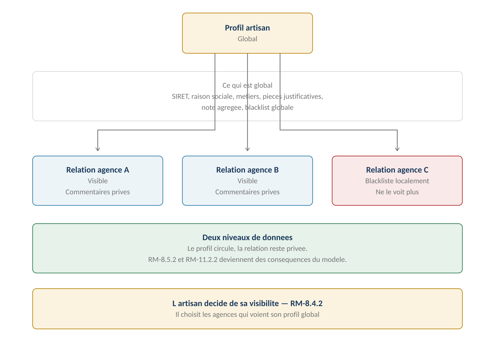
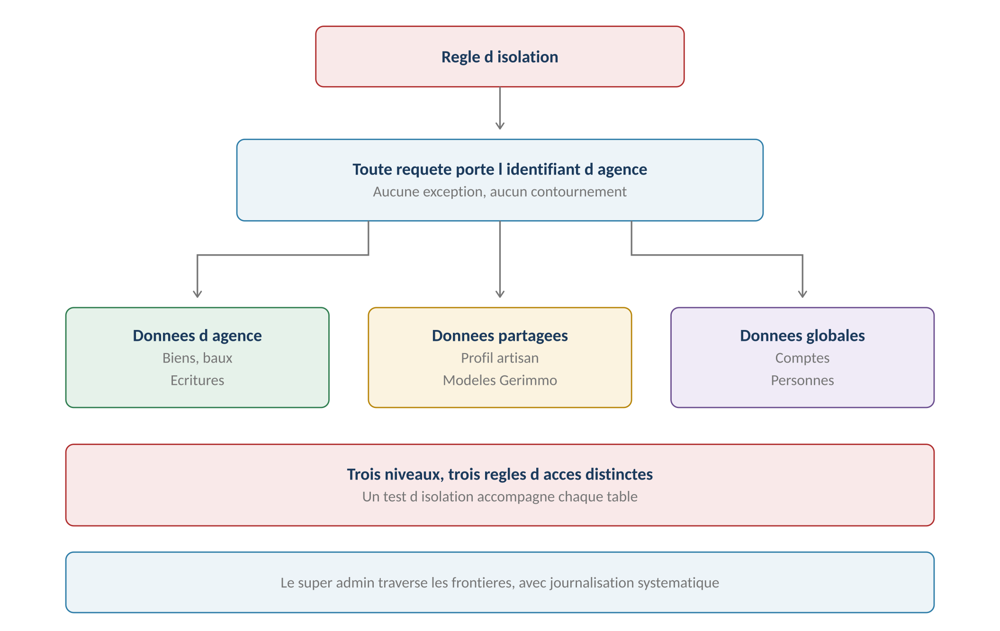

**GERIMMO V3**

Livrables transverses

**LIVRABLE A1**

**Modèle canonique d'identité**

|  |  |
|----|----|
| **Origine** | **Audit externe du 24 juillet 2026 — point P0.2** |
| **Objet** | Identité, comptes, rôles et isolation multi-agences |
| **Portée** | **Transverse — conditionne les vingt-deux modules** |
| **Décision structurante** | **Compte global, adhésion par agence** |
| **Statut** | **À valider avant tout développement** |

# **Pourquoi ce livrable**

> **Ce que l'audit reproche**
>
> Les vingt-deux modules séparent utilement la personne et le compte,
>
> mais ne définissent pas ce qui se passe quand une même personne
>
> existe dans plusieurs agences.
>
> L'email est déclaré unique dans une agence, alors que le compte
>
> semble parfois global. Ces règles ne suffisent pas à garantir
>
> l'absence de doublons ni l'étanchéité entre agences.

## **Les six cas non traités**

| **Cas** | **Ce que le référentiel dit** | **Ce qui manque** |
|----|----|----|
| **Locataire dans deux agences** | Rien | Un ou deux comptes ? |
| **Artisan public multi-agences** | RM-8.2.8 — pièces partagées | Où s'arrête le partage ? |
| **Personne cumulant des rôles** | RM-0b.1.1 — rôle déduit | Comment techniquement ? |
| **Agent changeant d'agence** | Rien | Son compte suit-il ? |
| **Propriétaire direct devenant mandant** | Rien | Que devient son accès ? |
| **Données globales et privées** | RM-11.2.2 — commentaires privés | Où passe la frontière ? |

> **Le cas qui tranche**
>
> Un locataire déménage d'un logement géré par l'agence A vers un logement
>
> de l'agence B.
>
> Avec deux comptes cloisonnés, il perd l'accès à son historique de quittances
>
> au moment même où il en a besoin — solde de tout compte, justificatif de revenus,
>
> litige éventuel.
>
> Avec un compte global, il bascule entre ses deux espaces.

## **Pourquoi ce choix ne peut pas attendre**

| **Sens de la migration** | **Difficulté** |
|----|----|
| **Comptes cloisonnés vers compte global** | **Fusion d'identités a posteriori, avec tous les doublons révélés** |
| **Compte global vers comptes cloisonnés** | Trivial — une adhésion par compte |

# **Le modèle retenu**

## **La structure**

*Schéma 1 — Un compte, plusieurs adhésions, autant d'espaces cloisonnés*

## **Les cinq entités**

| **Entité** | **Rôle** | **Portée** |
|----|----|----|
| **Personne** | Identité métier : nom, coordonnées, pièces | **Globale** |
| **Compte** | Moyen d'authentification : email, mot de passe | **Global** |
| **Agence** | Tenant — unité d'isolation des données | **Racine** |
| **Adhésion** | **Compte + agence + rôle + état** | **Par agence** |
| **Relation métier** | Locataire, garant, propriétaire, artisan | **Par agence** |

## 

## **Les règles d'unicité**

| **Élément** | **Unicité** | **Portée** |
|----|----|----|
| **Email du compte** | **Strictement unique** | Globale — toute la plateforme |
| **Personne** | Nom + date de naissance, alerte non bloquante | Par agence |
| **SIRET artisan** | Unique si vérifié, sinon état « non vérifié » | Globale |
| **Adhésion** | Un compte n'a qu'une adhésion par agence | Par couple |

> **Correction apportée au référentiel**
>
> RM-0b.1.3 posait que l'email est unique dans l'agence.
>
> Cette règle devient : l'email est unique sur toute la plateforme,
>
> car il identifie un compte global. Une personne inscrite dans deux agences
>
> utilise le même email et le même mot de passe.

# **Le cas de l'artisan**

> **Le cas le plus complexe du modèle**
>
> L'artisan porte des données qui circulent entre agences — son SIRET,
>
> ses attestations, sa note agrégée — et des données qui restent privées
>
> à chaque agence — les commentaires, la blacklist locale.
>
> Sans séparation explicite, les règles RM-8.5.2 et RM-11.2.2
>
> restent des intentions sans support technique.

## **Les deux niveaux**

*Schéma 3 — Le profil circule, la relation reste privée*

## **Ce qui appartient à quel niveau**

| **Donnée**                     | **Niveau**          | **Règle d'origine** |
|--------------------------------|---------------------|---------------------|
| **SIRET, raison sociale**      | **Profil global**   | RM-8.1.1            |
| **Métiers exercés**            | **Profil global**   | RM-8.1.2            |
| **Pièces justificatives**      | **Profil global**   | RM-8.2.8            |
| **Note agrégée**               | **Profil global**   | RM-11.4.1           |
| **Score de fiabilité**         | **Profil global**   | RM-11.3.1           |
| **Blacklist globale**          | **Profil global**   | RM-8.5.3            |
| **Visibilité choisie**         | **Profil global**   | RM-8.4.2            |
| **Commentaires d'évaluation**  | **Relation agence** | RM-11.2.2           |
| **Blacklist locale**           | **Relation agence** | RM-8.5.2            |
| **Historique d'interventions** | **Relation agence** | Ce livrable         |
| **Devis et factures**          | **Relation agence** | Ce livrable         |

> **Une conséquence utile**
>
> Un artisan blacklisté par l'agence A reste visible pour l'agence B :
>
> la blacklist est une donnée de relation, pas de profil.
>
> Une blacklist globale, elle, touche le profil et vaut partout — RM-8.5.3.
>
> Le modèle rend cette distinction structurelle plutôt que déclarative.

## **Le SIRET non vérifié**

| **État** | **Conséquence** |
|----|----|
| **SIRET vérifié** | L'artisan peut être publié et rattaché par d'autres agences |
| **SIRET non vérifié** | **Utilisable par l'agence qui l'a créé, non publiable** |
| **SIRET invalide** | Alerte, création possible, publication interdite |

> **Correction apportée au référentiel**
>
> RM-8.1.1 posait le SIRET comme clé d'unicité, tout en acceptant
>
> une valeur invalide avec une simple alerte.
>
> Le modèle ajoute un état intermédiaire : un artisan à SIRET non vérifié
>
> reste utilisable localement mais ne peut pas devenir public.
>
> Cela ferme la porte aux doublons entre agences.

# **L'isolation des données**

## **Trois niveaux de données**

*Schéma 4 — Trois niveaux, trois règles d'accès*

| **Niveau** | **Exemples** | **Règle d'accès** |
|----|----|----|
| **Données d'agence** | Biens, lots, baux, écritures, mandats | **Cloisonnées strictement** |
| **Données partagées** | Profil artisan public, modèles Gerimmo | Lisibles selon la visibilité |
| **Données globales** | Comptes, personnes, indices IRL | Lisibles par les agences concernées |

## **La règle technique**

| **Exigence** | **Détail** |
|----|----|
| **Identifiant d'agence obligatoire** | **Toute table de données d'agence porte un organization_id** |
| **Filtrage systématique** | Aucune requête ne s'exécute sans ce filtre |
| **Test d'isolation par table** | Un test vérifie qu'une agence ne lit jamais les données d'une autre |
| **Traversée par le super admin** | Autorisée, systématiquement journalisée |
| **Pas d'identifiant devinable** | Les identifiants sont non séquentiels |

> **Le test d'isolation est la contrepartie du modèle**
>
> Le compte global simplifie l'expérience mais concentre le risque :
>
> une requête mal filtrée exposerait les données d'une autre agence.
>
> La discipline est simple mais non négociable : chaque table de données
>
> d'agence porte son identifiant, et chaque table a son test d'isolation.

# **Les six cas résolus**

## **Cas 1 — Locataire dans deux agences**

| **Élément**        | **Traitement**                                    |
|--------------------|---------------------------------------------------|
| **Compte**         | Un seul, avec un email unique                     |
| **Adhésions**      | Deux, une par agence                              |
| **Personnes**      | Une par agence — les pièces ne circulent pas      |
| **À la connexion** | Sélecteur d'espace si plusieurs adhésions actives |
| **Fin d'un bail**  | L'adhésion passe en inactive, l'autre demeure     |

> **Les pièces du dossier ne circulent pas entre agences**
>
> RM-0b.7.3 le posait déjà : le dossier ne franchit jamais la frontière
>
> d'une autre agence.
>
> Le locataire a donc un compte unique, mais deux dossiers distincts.
>
> Il devra fournir ses pièces à chaque agence — c'est le droit,
>
> et c'est ce que les agences attendent.

## **Cas 2 — Artisan multi-agences**

Traité par la séparation profil global et relation agence — voir la section précédente.

## **Cas 3 — Personne cumulant des rôles**

| **Situation** | **Traitement** |
|----|----|
| **Locataire et garant dans la même agence** | Une personne, deux relations métier |
| **Locataire ici, propriétaire ailleurs** | Un compte, deux adhésions, deux personnes |
| **Rôle applicatif** | **Porté par l'adhésion, pas par la personne** |

## **Cas 4 — Agent changeant d'agence**

| **Étape**                | **Traitement**                                  |
|--------------------------|-------------------------------------------------|
| **Départ de l'agence A** | Ses mandats doivent être réaffectés — RM-18.1.4 |
| **Adhésion A**           | Passe en inactive, ses actions restent tracées  |
| **Arrivée à l'agence B** | Nouvelle adhésion sur le même compte            |
| **Ce qu'il emporte**     | **Rien — aucune donnée ne le suit**             |

## **Cas 5 — Propriétaire direct devenant mandant**

| **Étape** | **Traitement** |
|----|----|
| **Situation initiale** | Adhésion active, rôle propriétaire direct |
| **Il confie ses lots à une agence** | Un mandat est créé — module 5 |
| **Son adhésion** | Passe en inactive : le mandant n'a aucun accès |
| **Ses données** | Rattachées désormais à l'agence mandataire |
| **Retour en gestion directe** | L'adhésion est réactivée |

> **Une transition qui devait être décrite**
>
> Le référentiel distingue PM et PD depuis le module 0, mais ne disait pas
>
> comment on passe de l'un à l'autre.
>
> Le modèle le rend simple : c'est l'état de l'adhésion qui change,
>
> pas la personne ni ses données.

## **Cas 6 — Frontière entre données globales et privées**

Traité par les trois niveaux de données — voir la section précédente.

# **Synthèse**

## **Les règles du modèle**

| **Code** | **Règle** | **Bloquant** |
|----|----|----|
| **RM-A1.1** | **Un compte est global ; l'email est unique sur la plateforme** | **Oui** |
| **RM-A1.2** | Une adhésion relie un compte, une agence, un rôle et un état | Structurel |
| **RM-A1.3** | Un compte n'a qu'une adhésion par agence | **Oui** |
| **RM-A1.5** | Le rôle applicatif est porté par l'adhésion | Structurel |
| **RM-A1.6** | **Toute table de données d'agence porte un identifiant d'agence** | **Oui** |
| **RM-A1.7** | Chaque table a un test d'isolation automatisé | **Oui** |
| **RM-A1.8** | Le profil artisan est global, la relation agence est privée | Structurel |
| **RM-A1.9** | Un SIRET non vérifié interdit la publication globale | **Oui** |
| **RM-A1.10** | Les pièces d'un dossier ne franchissent jamais une frontière d'agence | **Oui** |
| **RM-A1.11** | Le super admin traverse les frontières, avec journalisation | Structurel |
| **RM-A1.12** | Un identifiant technique n'est jamais séquentiel | Structurel |

## **Les corrections apportées au référentiel**

| **Règle** | **Avant** | **Après** |
|----|----|----|
| **RM-0b.1.3** | Email unique dans l'agence | **Email unique sur la plateforme** |
| **RM-8.1.1** | SIRET clé d'unicité, invalide accepté | **Trois états : vérifié, non vérifié, invalide** |
| **RM-8.5.2** | Blacklist locale vaut pour son agence | Devient structurel — donnée de relation |
| **RM-11.2.2** | Commentaire privé à son agence | Devient structurel — donnée de relation |

## **Ce que ce livrable impose**

| **Module**           | **Conséquence**                                 |
|----------------------|-------------------------------------------------|
| **Module 0b**        | **RM-0b.1.3 à corriger — email global**         |
| **Module 8**         | **RM-8.1.1 à corriger — états du SIRET**        |
| **Module 16**        | L'invitation crée une adhésion, pas un compte   |
| **Module 18**        | Les rôles sont portés par l'adhésion            |
| **Tous les modules** | **Identifiant d'agence sur toute table métier** |

## **Ce qui reste à décider**

> **Deux points hors périmètre de ce livrable**
>
> La suppléance entre agents et le transfert de portefeuille — point P1.1 de l'audit.
>
> Ils relèvent du module 18 et seront traités en phase B.
>
> Le portail propriétaire par lien sécurisé — point P1.2.
>
> Il touche la décision structurante « le mandant reçoit, il ne consulte pas ».
