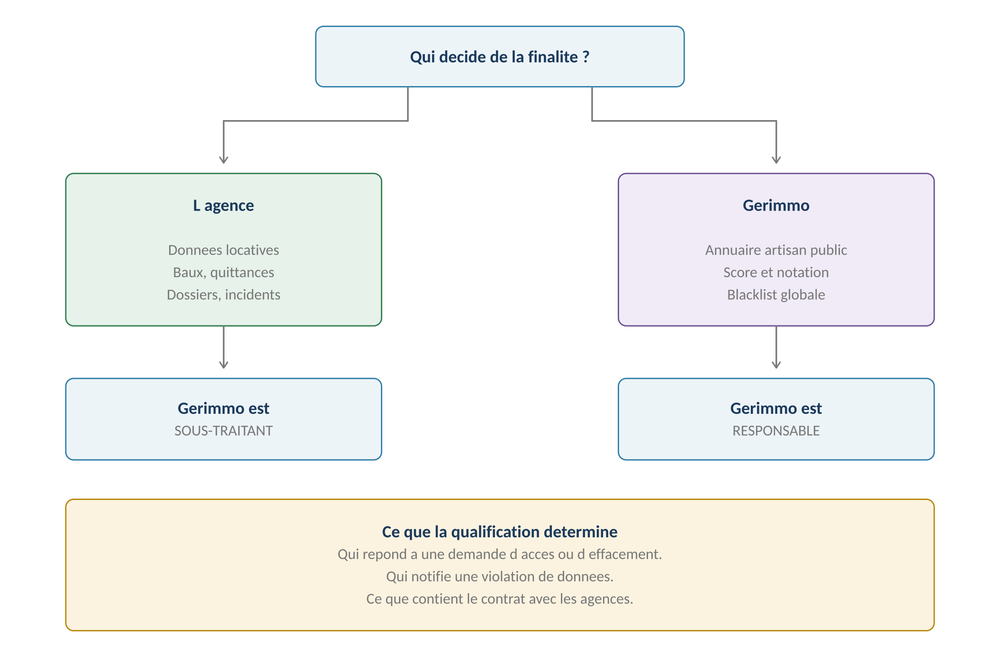
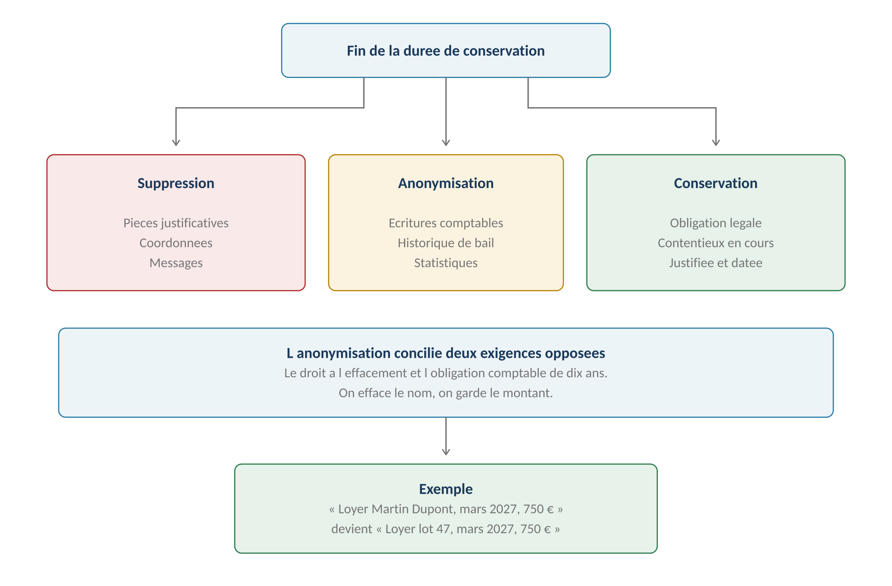
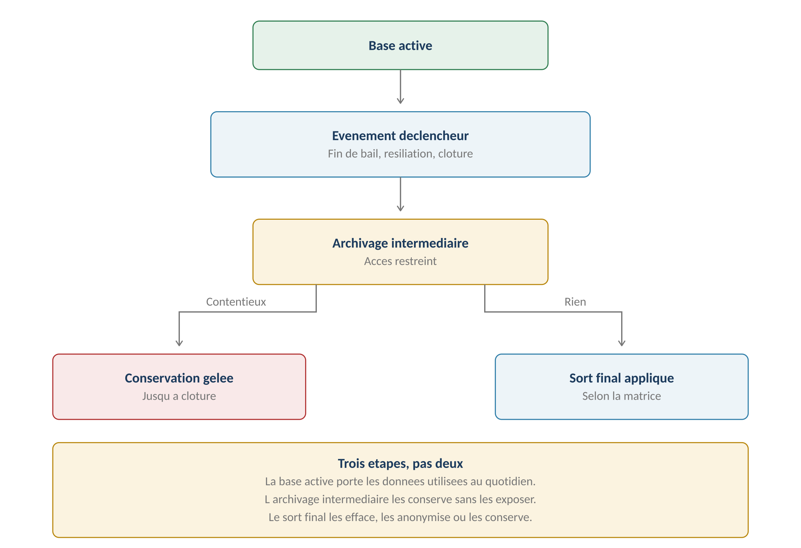
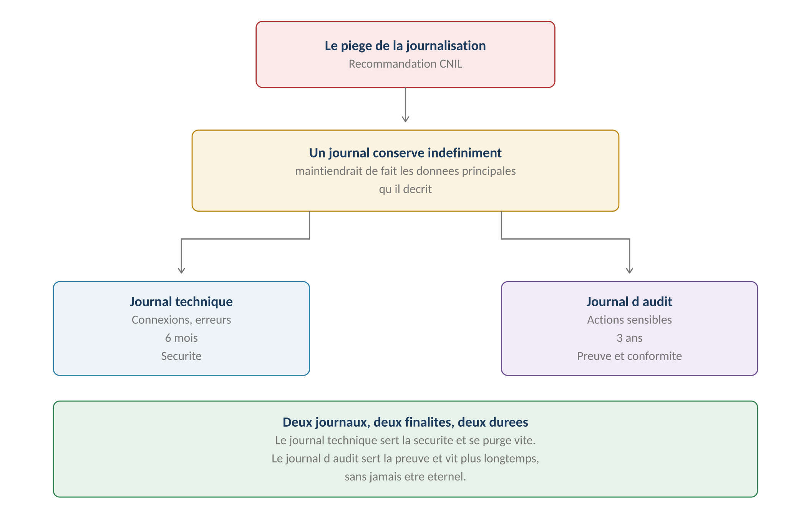

**GERIMMO V3**

Livrables transverses

**LIVRABLE A2**

**Conservation et RGPD**

|  |  |
|:---|:---|
| **Origine** | **Audit externe du 24 juillet 2026 — point P0.3** |
| **Objet** | Finalités, durées, sorts finaux et droits des personnes |
| **Qualification** | **Sous-traitant pour l'agence, responsable pour la plateforme** |
| **Portée** | **Transverse — corrige les durées de tous les modules** |
| **Réserve** | **À faire valider par un conseil spécialisé** |

> **Pourquoi ce livrable**
>
> **Ce que l'audit reproche**
>
> Le référentiel prévoit plusieurs conservations « sans limite » ou « indéfinies » :
>
> journal d'audit, motifs de blacklist, baux, mandats, états des lieux.
>
> À l'inverse, certaines purges sont définies par une durée unique
>
> sans rattachement à une finalité ni à une base légale.
>
> Le principe « jamais supprimé, seulement archivé » ne répond pas
>
> au droit à l'effacement.

**Les trois principes retenus**

------------------------------------------------------------------------

| **Principe** | **Ce qu'il impose** |
|:---|:---|
| **Toute durée découle d'une finalité** | **Aucune conservation « indéfinie » sans justification écrite** |
| **Trois sorts finaux** | Suppression, anonymisation, conservation justifiée |
| **La journalisation ne prolonge rien** | Un journal a sa propre durée, plus courte que la donnée |

> **Exemple de reformulation**
>
> Avant : « Baux et mandats — conservation sans limite. »
>
> Après : « Baux et mandats — conservés pendant la durée du contrat,
>
> puis cinq ans après son terme au titre de la prescription des actions
>
> nées du bail. Sort final : anonymisation. »
>
> **Qui est responsable de quoi**

*Schéma 1 — La qualification dépend de qui décide de la finalité*

**Le partage des rôles**

------------------------------------------------------------------------

| **Traitement**                  | **Responsable** | **Gerimmo est** |
|:--------------------------------|:----------------|:----------------|
| **Gestion locative**            | **L'agence**    | Sous-traitant   |
| **Dossiers locataires**         | **L'agence**    | Sous-traitant   |
| **Comptabilité et rapports**    | **L'agence**    | Sous-traitant   |
| **Incidents et interventions**  | **L'agence**    | Sous-traitant   |
| **Messagerie**                  | **L'agence**    | Sous-traitant   |
| **Annuaire artisan public**     | **Gerimmo**     | **Responsable** |
| **Score et notation artisan**   | **Gerimmo**     | **Responsable** |
| **Blacklist globale**           | **Gerimmo**     | **Responsable** |
| **Comptes et authentification** | **Gerimmo**     | **Responsable** |
| **Facturation des agences**     | **Gerimmo**     | **Responsable** |

> **Pourquoi le score artisan relève de Gerimmo**
>
> Aucune agence ne décide de la formule de pondération, du seuil de trois notes
>
> ou des cinq indicateurs de fiabilité — ces choix sont ceux de la plateforme.
>
> L'agence fournit des évaluations ; Gerimmo décide de ce qu'il en fait.
>
> C'est la définition du responsable de traitement.

**Ce que la qualification implique**

------------------------------------------------------------------------

| **Obligation** | **Données d'agence** | **Traitements plateforme** |
|:---|:---|:---|
| **Registre des traitements** | Tenu par l'agence | Tenu par Gerimmo |
| **Demande d'accès** | Répond l'agence | Répond Gerimmo |
| **Demande d'effacement** | L'agence décide, Gerimmo exécute | Gerimmo décide |
| **Notification de violation** | Gerimmo alerte l'agence sans délai | Gerimmo notifie la CNIL |
| **Contrat** | **Contrat de sous-traitance obligatoire** | Politique de confidentialité |
| **Sous-traitants ultérieurs** | Autorisation de l'agence requise | Information suffisante |

> **Les trois sorts finaux**

*Schéma 2 — L'anonymisation concilie effacement et obligation comptable*

> **Le principe « jamais supprimé » est corrigé**
>
> Le référentiel répétait que rien n'est jamais supprimé, seulement archivé.
>
> Cette position ne tient pas face au droit à l'effacement. La correction :
>
> l'archivage est une étape du cycle de vie, pas un sort final.
>
> Au terme de l'archivage, la donnée est supprimée, anonymisée,
>
> ou conservée pour un motif écrit.

**Quand appliquer chaque sort**

------------------------------------------------------------------------

| **Sort** | **Quand** | **Exemples** |
|:---|:---|:---|
| **Suppression** | La donnée n'a plus aucune utilité | Pièces d'identité, bulletins de salaire, messages |
| **Anonymisation** | **Une contrepartie comptable ou statistique subsiste** | Écritures, historiques de bail, volumes |
| **Conservation** | Une obligation légale explicite l'impose | Pièces comptables, contentieux en cours |

**Ce que l'anonymisation signifie**

------------------------------------------------------------------------

| **Élément** | **Avant** | **Après** |
|:---|:---|:---|
| **Écriture comptable** | Loyer Martin Dupont, mars 2027, 750 € | **Loyer lot 47, mars 2027, 750 €** |
| **Bail** | Bail Martin Dupont, lot 47, 2024-2027 | **Bail nº 1287, lot 47, 2024-2027** |
| **Rapport** | Rapport mensuel — locataire Dupont | **Rapport mensuel — lot 47** |

> **L'anonymisation doit être irréversible**
>
> Une pseudonymisation — remplacer le nom par un code qui permet de le retrouver —
>
> ne suffit pas : la donnée reste personnelle au sens du RGPD.
>
> L'anonymisation supprime le lien. On ne peut plus remonter à la personne,
>
> même en croisant les tables.
>
> **Le cycle de vie d'une donnée**

*Schéma 3 — Trois étapes, pas deux*

**Les trois étapes**

------------------------------------------------------------------------

| **Étape** | **Ce qu'elle permet** | **Qui y accède** |
|:---|:---|:---|
| **Base active** | Usage quotidien, modification, consultation | Selon les droits du module |
| **Archivage intermédiaire** | Consultation sur justification, aucune modification | Admin agence et super admin |
| **Sort final** | La donnée disparaît ou perd son caractère personnel | Personne |

> **Le contentieux gèle le cycle**
>
> RM-0b.8.3 posait déjà que la purge est suspendue tant qu'une procédure
>
> est en cours.
>
> Ce livrable généralise : tout contentieux identifié gèle le passage
>
> au sort final, pour toutes les données concernées, jusqu'à sa clôture.
>
> **La matrice de conservation**
>
> **Comment lire la matrice**
>
> Chaque ligne indique la finalité, la base légale, la durée en base active,
>
> l'événement déclencheur, la durée d'archivage et le sort final.
>
> Les durées d'archivage intermédiaire s'ajoutent à la base active.

**Données du dossier locataire**

------------------------------------------------------------------------

| **Donnée** | **Base légale** | **Actif** | **Archive** | **Sort** |
|:---|:---|:---|:---|:---|
| **Pièce d'identité** | Contrat | Durée du bail | 5 ans | Suppression |
| **Justificatifs de revenus** | Contrat | Durée du bail | 5 ans | Suppression |
| **Avis d'imposition** | Contrat | Durée du bail | 5 ans | Suppression |
| **Attestation d'assurance** | Obligation légale | Durée du bail | 5 ans | Suppression |
| **Coordonnées** | Contrat | Durée du bail | 5 ans | Anonymisation |
| **Identité de la personne** | Contrat | Durée du bail | 5 ans | Anonymisation |

**Données contractuelles**

------------------------------------------------------------------------

| **Donnée** | **Base légale** | **Actif** | **Archive** | **Sort** |
|:---|:---|:---|:---|:---|
| **Bail et avenants** | Contrat | Durée du bail | 5 ans | Anonymisation |
| **État des lieux** | Contrat | Durée du bail | 5 ans | Anonymisation |
| **Acte de cautionnement** | Contrat | Durée du bail | 5 ans | Anonymisation |
| **Congé** | Contrat | Durée du bail | 5 ans | Anonymisation |
| **Mandat de gestion** | Contrat | Durée du mandat | 5 ans | Anonymisation |

> **Pourquoi cinq ans**
>
> C'est la durée de prescription des actions nées du bail d'habitation.
>
> Au-delà, aucune action ne peut plus être engagée : la conservation
>
> de l'identité perd sa justification.

**Données comptables**

------------------------------------------------------------------------

| **Donnée** | **Base légale** | **Actif** | **Archive** | **Sort** |
|:---|:---|:---|:---|:---|
| **Écritures comptables** | Obligation légale | Exercice | 10 ans | Anonymisation |
| **Quittances et reçus** | Obligation légale | Durée du bail | 10 ans | Anonymisation |
| **Factures artisan** | Obligation légale | Exercice | 10 ans | Anonymisation |
| **Rapports de gestion** | Contrat | Durée du mandat | 10 ans | Anonymisation |
| **Récapitulatifs fiscaux** | Obligation légale | Année | 10 ans | Anonymisation |

**Données d'intervention**

------------------------------------------------------------------------

| **Donnée** | **Base légale** | **Actif** | **Archive** | **Sort** |
|:---|:---|:---|:---|:---|
| **Incident et photos** | Intérêt légitime | Durée du bail | 2 ans | Suppression |
| **Devis non retenu** | Intérêt légitime | 1 an | — | Suppression |
| **Compte rendu artisan** | Contrat | Durée du bail | 2 ans | Anonymisation |
| **Photos de travaux** | Contrat | Durée du bail | 2 ans | Suppression |
| **Rendez-vous** | Intérêt légitime | 1 an | — | Suppression |

**Données artisan — traitements plateforme**

------------------------------------------------------------------------

| **Donnée** | **Base légale** | **Actif** | **Archive** | **Sort** |
|:---|:---|:---|:---|:---|
| **Profil et pièces** | Contrat | Tant qu'il est actif | 3 ans | Suppression |
| **Évaluations individuelles** | Intérêt légitime | 3 ans | — | Suppression |
| **Score agrégé** | Intérêt légitime | Tant qu'il est actif | — | Suppression |
| **Motif de blacklist locale** | Intérêt légitime | 3 ans | — | Suppression |
| **Motif de blacklist globale** | Intérêt légitime | 5 ans | — | Suppression |

> **Correction majeure sur la blacklist**
>
> RM-8.5.6 posait que les motifs de blacklist sont conservés indéfiniment.
>
> Cette durée devient trois ans pour une blacklist locale, cinq ans
>
> pour une blacklist globale — la sanction la plus lourde justifiant
>
> la trace la plus longue.
>
> Au-delà, un artisan doit pouvoir repartir sans que son passé le suive.

**Données de communication**

------------------------------------------------------------------------

| **Donnée** | **Base légale** | **Actif** | **Archive** | **Sort** |
|:---|:---|:---|:---|:---|
| **Conversations** | Intérêt légitime | Durée du bail | 2 ans | Suppression |
| **Consentement WhatsApp** | Consentement | Tant qu'il vaut | 3 ans | Suppression |
| **Traces d'envoi** | Intérêt légitime | Durée du bail | 5 ans | Anonymisation |
| **Alertes traitées** | Intérêt légitime | 1 an | — | Suppression |

**Journaux**

------------------------------------------------------------------------

*Schéma 4 — Deux journaux, deux finalités, deux durées*

| **Journal** | **Finalité** | **Durée** | **Sort** |
|:---|:---|:---|:---|
| **Journal technique** | Sécurité, diagnostic | **6 mois** | Suppression |
| **Journal d'audit** | Preuve, conformité | **3 ans** | Suppression |
| **Journal d'accès aux pièces** | Contrôle de confidentialité | **1 an** | Suppression |

> **Correction majeure sur le journal d'audit**
>
> RM-18.5.2 posait que le journal d'audit ne se purge jamais.
>
> La CNIL recommande d'éviter qu'une journalisation prolonge artificiellement
>
> la conservation des données principales.
>
> La durée devient trois ans : assez pour couvrir un contrôle
>
> ou un contentieux, pas assez pour maintenir des données effacées ailleurs.
>
> **Les droits des personnes**

**Qui répond à quoi**

------------------------------------------------------------------------

| **Droit** | **Données d'agence** | **Traitements plateforme** |
|:---|:---|:---|
| **Accès** | L'agence, Gerimmo assiste | Gerimmo |
| **Rectification** | L'agence | Gerimmo |
| **Effacement** | L'agence décide | Gerimmo décide |
| **Limitation** | L'agence | Gerimmo |
| **Portabilité** | L'agence, export fourni par Gerimmo | Gerimmo |
| **Opposition** | L'agence | Gerimmo |
| **Intervention humaine** | Sans objet | **Gerimmo — contestation de note** |

> **Le droit à l'intervention humaine sur le score**
>
> Le score artisan combine des appréciations humaines et des indicateurs
>
> automatiques, et influence le classement dans les recherches.
>
> RM-11.4.4 prévoit déjà une contestation arbitrée par le super admin.
>
> Ce livrable la qualifie : c'est l'exercice du droit à l'intervention humaine,
>
> et elle doit être présentée comme telle à l'artisan.

**Les limites au droit à l'effacement**

------------------------------------------------------------------------

| **Situation** | **Effacement possible ?** |
|:---|:---|
| **Bail en cours** | Non — nécessaire à l'exécution du contrat |
| **Impayé non soldé** | Non — intérêt légitime à recouvrer |
| **Contentieux en cours** | Non — constatation d'un droit |
| **Écriture comptable** | Non — obligation légale, mais anonymisable au terme |
| **Bail terminé, aucune dette** | **Oui — après la prescription** |
| **Pièces du dossier** | **Oui — sur demande, même avant terme** |

> **Synthèse**

**Les règles du livrable**

------------------------------------------------------------------------

| **Code** | **Règle** | **Bloquant** |
|:---|:---|:---|
| **RM-A2.1** | **Toute durée de conservation découle d'une finalité écrite** | **Oui** |
| **RM-A2.2** | Aucune conservation indéfinie sans base légale explicite | **Oui** |
| **RM-A2.3** | Trois sorts finaux : suppression, anonymisation, conservation | Structurel |
| **RM-A2.4** | L'archivage est une étape, jamais un sort final | Structurel |
| **RM-A2.5** | L'anonymisation doit être irréversible | **Oui** |
| **RM-A2.6** | **Un journal a sa propre durée, plus courte que la donnée** | **Oui** |
| **RM-A2.7** | Un contentieux gèle le passage au sort final | **Oui** |
| **RM-A2.8** | Gerimmo est sous-traitant pour les données d'agence | Structurel |
| **RM-A2.9** | Gerimmo est responsable pour les traitements plateforme | Structurel |
| **RM-A2.10** | Toute violation est notifiée à l'agence sans délai | **Oui** |
| **RM-A2.11** | **La contestation de note est un droit à l'intervention humaine** | Structurel |

**Les corrections apportées au référentiel**

------------------------------------------------------------------------

| **Règle** | **Avant** | **Après** |
|:---|:---|:---|
| **RM-0b.8.7** | La purge ne supprime jamais la personne | **Anonymisation au terme de l'archivage** |
| **RM-8.5.6** | Motifs de blacklist conservés indéfiniment | **3 ans en local, 5 ans en global** |
| **RM-12.5.6** | Durée par type, certaines sans limite | **Toutes rattachées à une finalité** |
| **RM-18.5.2** | Journal d'audit jamais purgé | **3 ans** |
| **RM-18.4.4** | Agence archivée, jamais supprimée | **Archivée 10 ans, puis anonymisée** |

**Ce qui reste à faire**

------------------------------------------------------------------------

| **Livrable**                               | **Qui**                |
|:-------------------------------------------|:-----------------------|
| **Contrat de sous-traitance type**         | Conseil juridique      |
| **Politique de confidentialité**           | Conseil juridique      |
| **Registre des traitements plateforme**    | Gerimmo                |
| **Analyse d'impact sur le score artisan**  | À évaluer — profilage  |
| **Procédure de notification de violation** | Gerimmo                |
| **Validation de la matrice**               | **Conseil spécialisé** |

> **Réserve importante**
>
> Cette matrice traduit des principes réglementaires en règles applicables.
>
> Elle ne remplace pas une validation par un conseil spécialisé,
>
> notamment sur les durées de prescription et les bases légales retenues.
>
> L'audit le rappelait déjà : ce travail identifie des risques,
>
> il ne se substitue pas à une consultation juridique.
