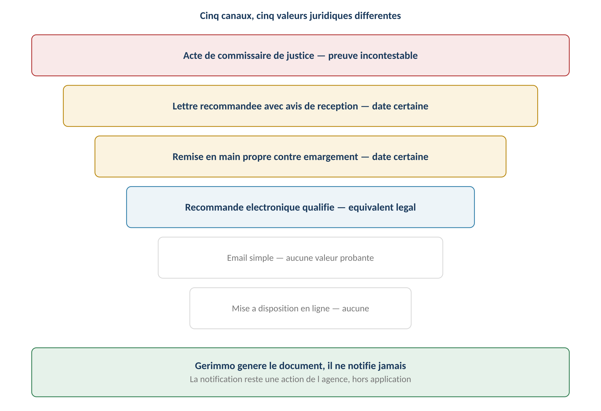
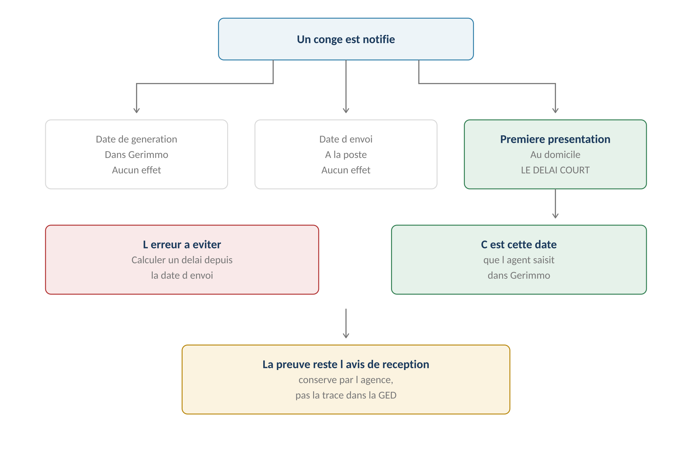
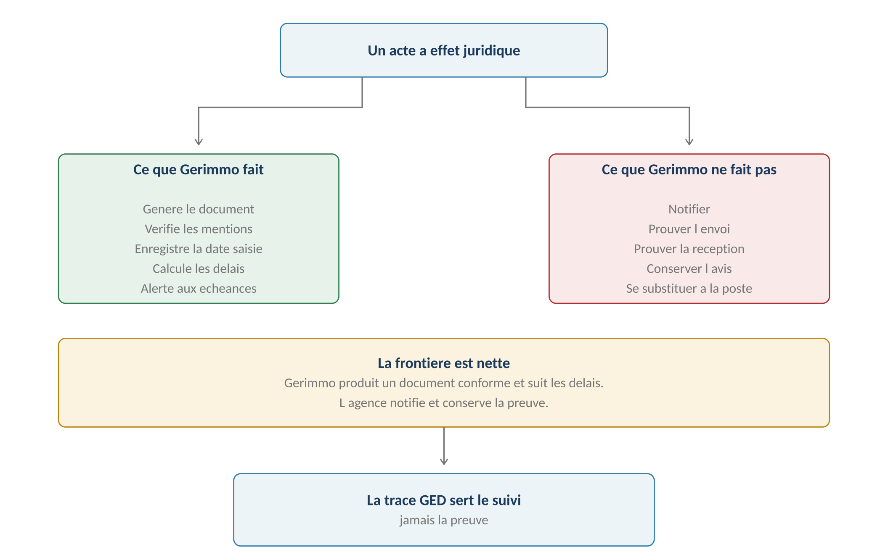
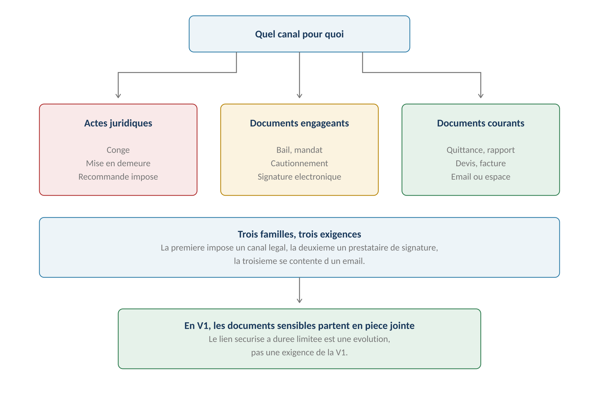

**GERIMMO V3**

Livrables transverses

**LIVRABLE A3**

**Documents, canaux et preuve**

|  |  |
|:---|:---|
| **Origine** | **Audit externe du 24 juillet 2026 — point P0.4** |
| **Objet** | Canal, valeur probante et date d'effet par type de document |
| **Correction** | **Gerimmo ne prétend jamais prouver un envoi** |
| **Portée** | **Corrige RM-12.4.1 et les règles qui s'y appuient** |
| **Réserve** | **À faire valider par un conseil juridique** |

> **Pourquoi ce livrable**
>
> **L'erreur à corriger**
>
> Le module 12 affirme que la date d'envoi conservée dans la GED permet
>
> de calculer et de prouver un délai.
>
> C'est faux en droit. Un email envoyé, un pixel d'ouverture et une lettre
>
> recommandée ne produisent pas les mêmes effets. Certains actes locatifs
>
> ont des canaux et des dates d'effet strictement encadrés.

**Les formulations à corriger**

------------------------------------------------------------------------

| **Règle** | **Ce qu'elle dit** | **Ce qui est faux** |
|:---|:---|:---|
| **RM-12.4.1** | Chaque envoi conserve date, canal et destinataire | Vrai et utile — mais ne prouve rien |
| **Module 12, p. 9** | « La trace d'envoi fonde les délais » | **Faux — seule la notification les fonde** |
| **RM-12.3.2** | La date de première consultation est enregistrée | Vrai — mais sans valeur probante |

**Les cinq niveaux de preuve**

------------------------------------------------------------------------

*Schéma 1 — Cinq canaux, cinq valeurs juridiques différentes*

> **Ce que chaque canal permet**
>
> L'acte de commissaire de justice établit une date et un contenu incontestables.
>
> La lettre recommandée avec avis de réception donne une date certaine.
>
> La remise en main propre contre émargement également.
>
> L'email simple et la mise à disposition en ligne n'ont aucune valeur probante
>
> pour un acte à effet juridique — même avec une trace d'ouverture.
>
> **Quelle date fait courir un délai**

*Schéma 2 — Ni la génération, ni l'envoi : la première présentation*

**Les quatre dates d'un acte notifié**

------------------------------------------------------------------------

| **Date** | **Où elle est connue** | **Effet juridique** |
|:---|:---|:---|
| **Génération du document** | Gerimmo | Aucun |
| **Envoi postal** | Récépissé de dépôt | Aucun pour le destinataire |
| **Première présentation** | **Avis de réception** | **LE DÉLAI COURT** |
| **Retrait effectif** | Avis de réception | Aucun — la présentation suffit |

> **La distinction qui compte**
>
> Un locataire qui ne retire pas sa lettre recommandée ne bloque pas le délai :
>
> c'est la première présentation qui compte, pas le retrait.
>
> C'est donc cette date que l'agent saisit dans Gerimmo, en la lisant
>
> sur l'avis de réception.

**Ce que Gerimmo fait et ne fait pas**

------------------------------------------------------------------------

*Schéma 3 — La frontière entre l'outil et l'acte*

| **Action** | **Gerimmo** | **L'agence** |
|:---|:---|:---|
| **Générer le document conforme** | **Oui** | Non |
| **Vérifier les mentions obligatoires** | **Oui** | Contrôle |
| **Notifier au destinataire** | **JAMAIS** | **Oui** |
| **Saisir la date de présentation** | Enregistre | **Saisit** |
| **Calculer les délais** | **Oui** | Vérifie |
| **Alerter aux échéances** | **Oui** | Non |
| **Conserver l'avis de réception** | Peut le stocker | **Détient l'original** |
| **Prouver l'envoi** | **JAMAIS** | **Par l'avis** |

> **La matrice par type de document**

**Trois familles**

------------------------------------------------------------------------

*Schéma 4 — Trois familles, trois exigences*

**Famille 1 — Actes à effet juridique**

------------------------------------------------------------------------

> **Canal légal imposé, Gerimmo ne notifie pas**
>
> Ces documents font courir des délais ou éteignent des droits.
>
> Leur notification obéit à des formes légales que Gerimmo ne peut pas remplacer.

| **Document** | **Canal** | **Date qui compte** | **Preuve** |
|:---|:---|:---|:---|
| **Congé du bailleur** | **LRAR ou acte** | Première présentation | Avis de réception |
| **Congé du locataire** | **LRAR ou acte** | Première présentation | Avis de réception |
| **Mise en demeure** | **LRAR** | Première présentation | Avis de réception |
| **Décompte de restitution** | LRAR recommandé | Remise des clés | Avis de réception |
| **Régularisation de charges** | Email accepté | Envoi | Aucune requise |

> **Le décompte de restitution — un cas particulier**
>
> RM-2.4.1 pose que le délai court depuis la remise des clés.
>
> Ce n'est pas la notification du décompte qui déclenche, mais la restitution
>
> du logement.
>
> Le recommandé reste recommandé : en cas de contestation, l'agence doit prouver
>
> qu'elle a bien envoyé le décompte dans le délai.

**Famille 2 — Documents engageants**

------------------------------------------------------------------------

> **Signature électronique, prestataire qualifié**
>
> Ces documents créent des obligations réciproques.
>
> La signature électronique simple suffit — décision du module 13 —
>
> et c'est Yousign qui porte la preuve, pas Gerimmo.

| **Document** | **Canal** | **Date qui compte** | **Preuve** |
|:---|:---|:---|:---|
| **Bail et avenants** | **Yousign** | Dernière signature | **Dossier de preuve Yousign** |
| **Acte de cautionnement** | **Yousign** | Signature du garant | Dossier de preuve Yousign |
| **Mandat de gestion** | **Yousign** | Dernière signature | Dossier de preuve Yousign |
| **État des lieux** | **Signature tactile** | Signature sur place | Document signé en GED |

> **L'état des lieux n'est pas signé électroniquement**
>
> RM-13.1.6 le pose : il est signé sur place, en présence des deux parties,
>
> sur l'écran du mobile.
>
> Ce n'est pas une signature électronique au sens du règlement européen,
>
> mais un consentement recueilli en présence. Sa valeur tient au fait
>
> que les deux parties étaient là, pas au procédé technique.
>
> L'audit demandait cette distinction — elle est faite ici.

**Famille 3 — Documents courants**

------------------------------------------------------------------------

> **Email ou espace personnel, aucune exigence de preuve**
>
> Ces documents informent ou justifient, sans faire courir de délai.
>
> Un email suffit, et la trace GED sert le suivi opérationnel.

| **Document** | **Canal** | **Date qui compte** | **Preuve** |
|:---|:---|:---|:---|
| **Quittance** | Email ou espace | Émission | Aucune requise |
| **Reçu** | Email ou espace | Émission | Aucune requise |
| **Appel de loyer** | Email ou espace | Émission | Aucune requise |
| **Relance simple** | Email ou WhatsApp | Envoi | Trace GED suffit |
| **Rapport de gestion** | Email — pièce jointe | Envoi | Trace GED suffit |
| **Récapitulatif fiscal** | Email — pièce jointe | Envoi | Trace GED suffit |
| **Devis et facture** | Espace artisan | Dépôt | Trace GED suffit |
| **Diagnostic** | Annexé au bail | Signature du bail | Le bail fait foi |

> **Le choix de la pièce jointe — décision confirmée**
>
> Deux audits successifs ont recommandé un lien sécurisé à durée limitée
>
> pour les documents financiers du propriétaire. Le choix de la pièce jointe
>
> est maintenu après réexamen.
>
> Trois raisons : aucun stockage temporaire à gérer, aucune expiration de lien,
>
> aucun développement supplémentaire.
>
> Le risque reste modéré — les données financières d'un propriétaire
>
> dans sa propre boîte email — et l'ajout d'une friction sur le seul livrable
>
> qu'il reçoit serait contre-productif.

**Ce que la décision implique**

------------------------------------------------------------------------

| **Aspect** | **Conséquence assumée** |
|:---|:---|
| **Sécurité** | Le document circule en clair dans la messagerie du propriétaire |
| **Durée de vie** | Illimitée — il reste dans sa boîte |
| **Révocation** | Impossible après envoi |
| **Traçabilité** | Date d'envoi seulement, pas de consultation |
| **Coût de développement** | **Nul** |

> **Une évolution possible, pas une exigence**
>
> Le lien sécurisé reste envisageable si le volume ou la sensibilité
>
> des documents transmis augmentait.
>
> Il ne conditionne ni la V1, ni la commercialisation.
>
> **Ce que la trace GED sert vraiment**
>
> **Suivi opérationnel, jamais preuve juridique**
>
> La trace d'envoi conservée dans la GED a une utilité réelle :
>
> savoir ce qui est parti, quand, à qui, et ce qui reste à envoyer.
>
> Elle ne prouve rien devant un tribunal, et le référentiel
>
> ne doit plus laisser croire le contraire.

**Deux usages distincts**

------------------------------------------------------------------------

| **Usage**               | **Ce que la trace permet**            | **Valeur** |
|:------------------------|:--------------------------------------|:-----------|
| **Suivi opérationnel**  | Savoir si le rapport de mai est parti | **Réelle** |
| **Relance**             | Repérer ce qui n'a pas été envoyé     | **Réelle** |
| **Contrôle interne**    | Vérifier qu'un agent a bien traité    | **Réelle** |
| **Preuve d'un délai**   | Rien — la notification seule compte   | **Nulle**  |
| **Preuve de réception** | Rien — un email ne prouve rien        | **Nulle**  |

**Ce que l'agent saisit**

------------------------------------------------------------------------

| **Champ**                    | **Pour quel document**  | **Obligatoire** |
|:-----------------------------|:------------------------|:----------------|
| **Date de notification**     | Actes à effet juridique | **Oui**         |
| **Canal utilisé**            | Actes à effet juridique | **Oui**         |
| **Numéro de recommandé**     | Si LRAR                 | Recommandé      |
| **Avis de réception scanné** | Si LRAR                 | Recommandé      |
| **Date d'envoi**             | Documents courants      | Automatique     |

> **Une saisie qui protège l'agence**
>
> Le numéro de recommandé et l'avis de réception scanné ne sont pas obligatoires,
>
> mais ils permettent de reconstituer le dossier en cas de litige.
>
> C'est le même raisonnement que la trace des relances au module 3 :
>
> l'agence prouve ses diligences.
>
> **Synthèse**

**Les règles du livrable**

------------------------------------------------------------------------

| **Code** | **Règle** | **Bloquant** |
|:---|:---|:---|
| **RM-A3.1** | **Gerimmo génère et suit, il ne notifie jamais** | Structurel |
| **RM-A3.2** | **Aucune trace GED ne constitue une preuve juridique** | Structurel |
| **RM-A3.3** | Un acte à effet juridique exige un canal légal | **Oui** |
| **RM-A3.4** | La date de notification est saisie par l'agent | **Oui** |
| **RM-A3.5** | C'est la première présentation qui fait courir le délai | Structurel |
| **RM-A3.6** | Les délais sont calculés depuis la date saisie, jamais depuis l'envoi | **Oui** |
| **RM-A3.7** | La signature tactile d'un EDL n'est pas une signature électronique | Structurel |
| **RM-A3.8** | Les documents courants partent par email ou espace personnel | Structurel |
| **RM-A3.9** | **Les documents sensibles partent en pièce jointe, sans lien sécurisé** | Structurel |
| **RM-A3.10** | Le numéro de recommandé et l'avis sont stockables, non obligatoires | Non |
| **RM-A3.11** | **Une pièce jointe envoyée ne peut être ni révoquée ni tracée en consultation** | Structurel |

**Les corrections apportées au référentiel**

------------------------------------------------------------------------

| **Règle** | **Avant** | **Après** |
|:---|:---|:---|
| **RM-12.4.1** | Chaque envoi conserve date, canal, destinataire | Inchangé, mais sans valeur probante |
| **Module 12, p. 9** | « La trace d'envoi fonde les délais » | **Formulation à supprimer** |
| **RM-12.4.3** | Un envoi en recommandé se trace manuellement | Précisé — date de présentation |
| **RM-1.10.1** | Le préavis court depuis la réception du congé | Confirmé — première présentation |
| **RM-1.11.6** | Alerte de préemption à deux mois | Depuis la date de présentation |
| **RM-13.1.6** | Les EDL sont signés sur place | Qualifié — consentement en présence |

**Ce que ce livrable impose**

------------------------------------------------------------------------

| **Module**    | **Conséquence**                                          |
|:--------------|:---------------------------------------------------------|
| **Module 1**  | **Champ « date de première présentation » sur le congé** |
| **Module 3**  | Idem sur la mise en demeure                              |
| **Module 2**  | Le décompte part en recommandé recommandé                |
| **Module 12** | **Retirer la formulation sur la preuve des délais**      |
| **Module 13** | Distinguer Yousign et signature tactile                  |

**Réserve**

------------------------------------------------------------------------

> **À faire valider**
>
> Cette matrice traduit des principes de droit locatif en règles applicables.
>
> Les canaux imposés et les dates d'effet retenues méritent une validation
>
> par un conseil juridique.
>
> En particulier, le recommandé électronique qualifié pourrait remplacer
>
> la LRAR pour certains actes — c'est une piste d'évolution
>
> qui simplifierait le circuit, mais qui suppose une vérification préalable.
