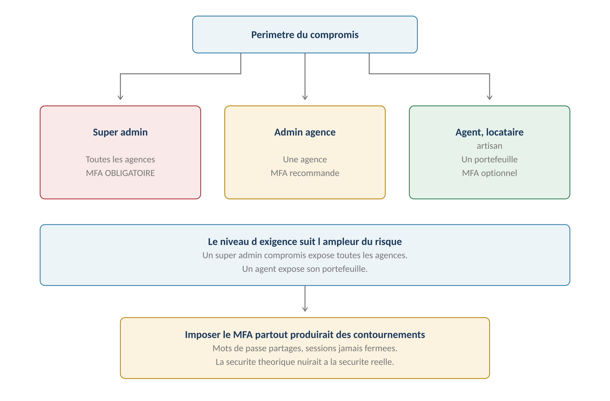
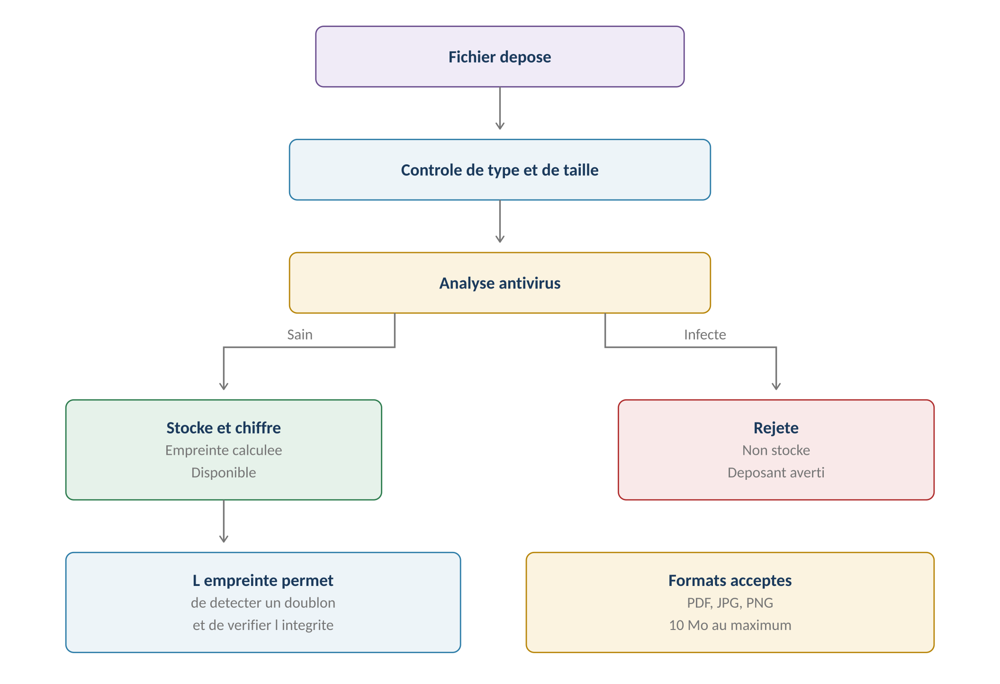
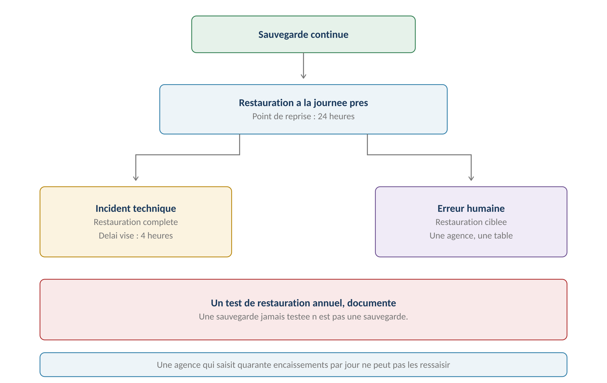
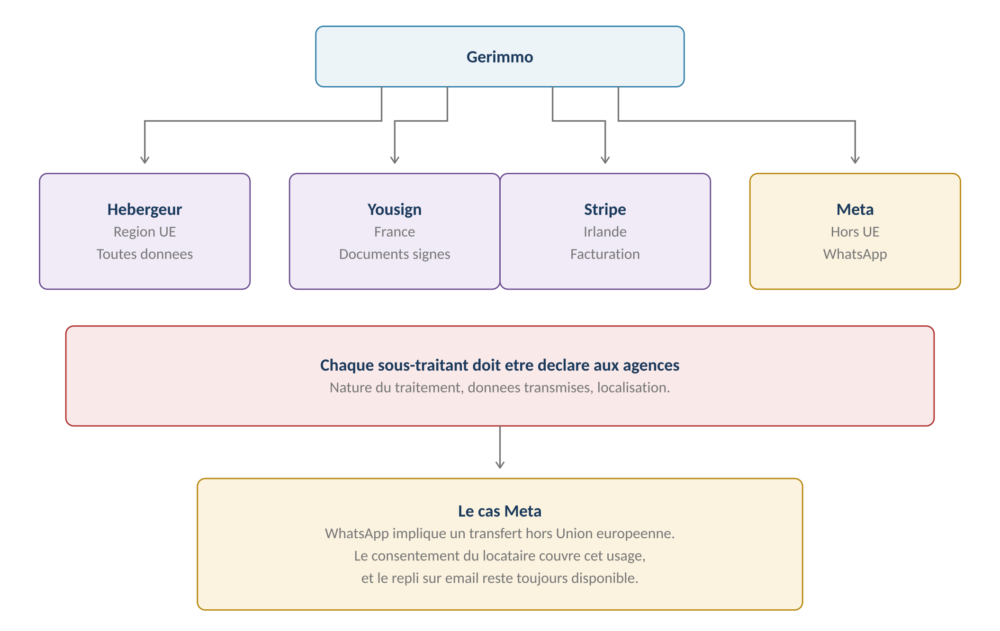

**GERIMMO V3**

Livrables transverses

**LIVRABLE A4**

**Socle sécurité**

|  |  |
|:---|:---|
| **Origine** | **Audit externe du 24 juillet 2026 — point P0.5** |
| **Objet** | Authentification, chiffrement, fichiers, sauvegardes, sous-traitants |
| **Constat** | **Aucune exigence de sécurité dans les 22 modules** |
| **Portée** | Transverse — s'applique à toute la plateforme |
| **Statut** | **À valider avant mise en production** |

> **Pourquoi ce livrable**
>
> **Ce que l'audit reproche**
>
> Le référentiel ne définit aucune exigence de sécurité : ni MFA,
>
> ni politique de mot de passe, ni chiffrement, ni durée de session,
>
> ni analyse des fichiers déposés, ni plan de sauvegarde.
>
> Une plateforme qui héberge des données personnelles et financières
>
> pour le compte de plusieurs agences ne peut pas ignorer ces sujets.

**Ce que la plateforme héberge**

------------------------------------------------------------------------

| **Nature** | **Exemples** | **Sensibilité** |
|:---|:---|:---|
| **Données d'identité** | Pièces d'identité, dates de naissance | **Élevée** |
| **Données financières** | Revenus, avis d'imposition, RIB | **Élevée** |
| **Données contractuelles** | Baux, mandats, cautionnements | Moyenne |
| **Données comptables** | Écritures, quittances, rapports | Moyenne |
| **Photos de logements** | États des lieux, incidents | Moyenne |
| **Coordonnées** | Adresses, téléphones, emails | Moyenne |

> **Le risque n'est pas théorique**
>
> Une agence de deux cents lots confie à Gerimmo les pièces d'identité,
>
> les bulletins de salaire et les coordonnées de deux cents foyers.
>
> Une fuite exposerait l'agence autant que la plateforme,
>
> et mettrait fin à la relation commerciale.
>
> **Authentification et accès**

**Le MFA par rôle**

------------------------------------------------------------------------

*Schéma 1 — Le niveau d'exigence suit l'ampleur du risque*

| **Rôle** | **MFA** | **Périmètre du compromis** |
|:---|:---|:---|
| **Super admin** | **OBLIGATOIRE** | Toutes les agences de la plateforme |
| **Admin agence** | **Recommandé, activable** | Une agence entière |
| **Agent immobilier** | Optionnel | Son portefeuille de mandats |
| **Locataire** | Optionnel | Son propre dossier |
| **Artisan** | Optionnel | Ses interventions |

> **Pourquoi ne pas l'imposer partout — décision actée**
>
> Un admin agence de trois personnes se connecte quinze fois par jour.
>
> Lui imposer un second facteur à chaque fois produirait des contournements :
>
> mot de passe partagé, session jamais fermée, navigateur qui mémorise tout.
>
> La sécurité théorique nuirait à la sécurité réelle.

**La politique de mot de passe**

------------------------------------------------------------------------

| **Exigence** | **Valeur** | **Justification** |
|:---|:---|:---|
| **Longueur minimale** | 12 caractères | Recommandation courante |
| **Complexité imposée** | Non | La longueur prime sur les symboles |
| **Vérification de fuite** | **Oui** | Refus des mots de passe compromis connus |
| **Expiration périodique** | Non | Produit des variantes prévisibles |
| **Historique** | 5 derniers | Évite la réutilisation immédiate |
| **Tentatives échouées** | 10 puis blocage temporaire | Ralentit les attaques automatisées |

**Les sessions**

------------------------------------------------------------------------

| **Rôle**             | **Durée d'inactivité** | **Durée absolue** |
|:---------------------|:-----------------------|:------------------|
| **Super admin**      | **30 minutes**         | 8 heures          |
| **Admin agence**     | 2 heures               | 12 heures         |
| **Agent immobilier** | 4 heures               | 12 heures         |
| **Locataire**        | 7 jours                | 30 jours          |
| **Artisan**          | 7 jours                | 30 jours          |

> **Des durées longues pour les usages ponctuels**
>
> Un locataire se connecte quatre fois par an. Lui demander de se réauthentifier
>
> à chaque fois le dissuaderait d'utiliser son espace.
>
> Un artisan consulte son agenda depuis un chantier : une session courte
>
> l'obligerait à ressaisir son mot de passe avec des gants.
>
> **Chiffrement et hébergement**

**Les trois états de la donnée**

------------------------------------------------------------------------

| **État** | **Protection** | **Portée** |
|:---|:---|:---|
| **En transit** | **TLS 1.2 minimum, 1.3 recommandé** | Toutes les communications |
| **Au repos — base** | **Chiffrement du disque** | Toute la base de données |
| **Au repos — fichiers** | **Chiffrement du stockage** | Documents et photos |
| **En sauvegarde** | **Chiffrement** | Toutes les sauvegardes |

**L'hébergement**

------------------------------------------------------------------------

| **Exigence** | **Décision** | **Motif** |
|:---|:---|:---|
| **Région** | **Union européenne** | Évite toute question de transfert |
| **Redondance** | Multi-zone | Continuité en cas de panne |
| **Isolation réseau** | Base non exposée publiquement | Réduction de surface d'attaque |
| **Accès administrateur** | MFA et journalisation | Traçabilité des interventions |

> **Pourquoi la région européenne — décision actée**
>
> La question n'est pas technique mais contractuelle.
>
> Une agence qui vous confie les données de trois cents locataires
>
> vous demandera où elles sont hébergées. Une réponse européenne
>
> clôt la discussion ; une réponse hors UE ouvre un dossier
>
> de garanties appropriées à documenter.

**Le cloisonnement applicatif**

------------------------------------------------------------------------

| **Mesure** | **Détail** | **Origine** |
|:---|:---|:---|
| **Identifiant d'agence obligatoire** | Sur toute table de données d'agence | RM-A1.6 |
| **Test d'isolation par table** | Automatisé, exécuté à chaque livraison | RM-A1.7 |
| **Identifiants non séquentiels** | Aucune énumération possible | RM-A1.12 |
| **Traversée du super admin** | Journalisée systématiquement | RM-A1.11 |

> **Les fichiers déposés**
>
> **Un point d'entrée souvent négligé**
>
> Locataires et artisans téléversent des documents et des photos.
>
> Sans contrôle, un fichier infecté transite vers l'agence,
>
> qui l'ouvre en toute confiance.
>
> Le risque de réputation est disproportionné par rapport au coût du contrôle.

**Le cycle d'un fichier**

------------------------------------------------------------------------

*Schéma 2 — Contrôle, analyse, chiffrement, empreinte*

**Les contrôles à l'entrée**

------------------------------------------------------------------------

| **Contrôle** | **Règle** | **Effet si échec** |
|:---|:---|:---|
| **Extension** | PDF, JPG, PNG uniquement | Refus |
| **Type réel du fichier** | **Vérifié, pas seulement l'extension** | Refus |
| **Taille** | 10 Mo au maximum | Refus |
| **Analyse antivirus** | **Systématique — décision actée** | Refus et alerte |
| **Empreinte** | Calculée et stockée | Détection de doublon |

> **Vérifier le type réel, pas l'extension**
>
> Un fichier nommé « attestation.pdf » peut être un exécutable renommé.
>
> Le contrôle porte sur la signature interne du fichier,
>
> pas sur ce que son nom prétend.

**L'accès aux fichiers**

------------------------------------------------------------------------

| **Exigence** | **Détail** |
|:---|:---|
| **Aucun accès direct par URL** | **Le lien de stockage n'est jamais exposé** |
| **Contrôle de droits à chaque accès** | Le type de document détermine qui peut voir |
| **Lien temporaire** | Généré à la demande, expire rapidement |
| **Journalisation** | Consultation d'une pièce sensible tracée — RM-0b.7.5 |

> **Sauvegardes et reprise**

*Schéma 3 — Sauvegarde continue, restauration à la journée près*

**Les objectifs**

------------------------------------------------------------------------

| **Objectif** | **Valeur retenue** | **Ce que cela signifie** |
|:---|:---|:---|
| **Perte de données maximale** | **24 heures** | Au pire, une journée de saisie à refaire |
| **Délai de remise en service** | **4 heures** | Après incident majeur |
| **Rétention des sauvegardes** | 30 jours glissants | Couvre une erreur découverte tardivement |
| **Test de restauration** | **Annuel, documenté** | Vérification que la sauvegarde fonctionne |

> **Une sauvegarde jamais testée n'est pas une sauvegarde**
>
> C'est le point que l'audit soulève sous le terme de plan de reprise.
>
> Le test annuel consiste à restaurer réellement une copie dans un environnement
>
> séparé, à vérifier que les données sont complètes et cohérentes,
>
> et à consigner le résultat.
>
> Sans ce test, on découvre le problème le jour où on en a besoin.

**Les deux cas de restauration**

------------------------------------------------------------------------

| **Cas** | **Portée** | **Décision** |
|:---|:---|:---|
| **Incident technique** | Toute la plateforme | Super admin |
| **Erreur humaine dans une agence** | **Une agence, une table** | Super admin, sur demande |
| **Suppression accidentelle** | Un objet précis | Corbeille applicative si prévue |

> **La corbeille applicative complète la sauvegarde**
>
> RM-0b.8.5 prévoit déjà une corbeille de trois mois pour les pièces purgées.
>
> Ce mécanisme évite de mobiliser une restauration de sauvegarde
>
> pour une suppression accidentelle isolée.
>
> **Les sous-traitants**

*Schéma 4 — Quatre prestataires, quatre localisations*

**Le tableau des sous-traitants**

------------------------------------------------------------------------

| **Prestataire** | **Traitement** | **Données transmises** | **Localisation** |
|:---|:---|:---|:---|
| **Hébergeur** | Hébergement et base | Toutes | Union européenne |
| **Yousign** | Signature électronique | Documents et identités des signataires | France |
| **Stripe** | Encaissement des abonnements | Coordonnées de facturation des agences | Irlande |
| **Meta** | Messagerie WhatsApp | Numéros et contenus des messages | **Hors UE** |
| **Service antivirus** | Analyse des fichiers | Fichiers déposés | À déterminer |

> **Le cas WhatsApp**
>
> L'usage de WhatsApp implique un transfert hors Union européenne.
>
> Trois éléments le rendent acceptable : le consentement explicite du locataire,
>
> le caractère optionnel du canal, et la disponibilité permanente
>
> du repli sur email — RM-16.5.1.
>
> Ce transfert doit néanmoins être déclaré aux agences.

**Les obligations qui en découlent**

------------------------------------------------------------------------

| **Obligation** | **Détail** |
|:---|:---|
| **Déclaration aux agences** | **Liste tenue à jour dans le contrat de sous-traitance** |
| **Information préalable** | Avant tout changement de sous-traitant |
| **Garanties contractuelles** | Chaque prestataire présente des garanties suffisantes |
| **Encadrement des transferts** | Clauses contractuelles types pour Meta |

> **Gestion des incidents de sécurité**

**La chaîne de réaction**

------------------------------------------------------------------------

| **Étape** | **Délai** | **Acteur** |
|:---|:---|:---|
| **Détection** | Immédiat | Supervision technique |
| **Qualification** | 2 heures | Super admin |
| **Confinement** | 4 heures | Super admin |
| **Information des agences** | **Sans délai si données touchées** | Super admin |
| **Notification CNIL** | **72 heures si violation avérée** | Agence ou Gerimmo selon le traitement |
| **Information des personnes** | Si risque élevé | Responsable de traitement |

> **Qui notifie quoi**
>
> Pour les données d'agence, Gerimmo est sous-traitant : il alerte l'agence
>
> sans délai, et c'est elle qui notifie la CNIL.
>
> Pour les traitements plateforme — annuaire artisan, score, comptes —
>
> Gerimmo est responsable : il notifie lui-même.
>
> Cette répartition découle du livrable A2.

**Ce qui est journalisé**

------------------------------------------------------------------------

| **Événement**                         | **Journal** | **Durée** |
|:--------------------------------------|:------------|:----------|
| **Connexion réussie ou échouée**      | Technique   | 6 mois    |
| **Changement de mot de passe**        | Technique   | 6 mois    |
| **Accès du super admin à une agence** | **Audit**   | 3 ans     |
| **Modification de rôle**              | Audit       | 3 ans     |
| **Export de données**                 | Audit       | 3 ans     |
| **Consultation de pièce sensible**    | Accès       | 1 an      |

> **Les durées viennent du livrable A2**
>
> RM-A2.6 pose qu'un journal a sa propre durée, plus courte que la donnée
>
> qu'il décrit.
>
> Le journal technique se purge à six mois, le journal d'audit à trois ans,
>
> le journal d'accès aux pièces à un an.
>
> **Synthèse**

**Les règles du livrable**

------------------------------------------------------------------------

| **Code** | **Règle** | **Bloquant** |
|:---|:---|:---|
| **RM-A4.1** | **Le MFA est obligatoire pour le super admin** | **Oui** |
| **RM-A4.2** | Le MFA est activable et recommandé pour l'admin agence | Non |
| **RM-A4.3** | Mot de passe de 12 caractères, vérifié contre les fuites connues | **Oui** |
| **RM-A4.4** | Aucune expiration périodique de mot de passe | Structurel |
| **RM-A4.5** | La durée de session dépend du rôle | Structurel |
| **RM-A4.6** | **Chiffrement en transit et au repos, sans exception** | **Oui** |
| **RM-A4.7** | **Hébergement dans une région européenne** | **Oui** |
| **RM-A4.8** | **Analyse antivirus de tout fichier déposé** | **Oui** |
| **RM-A4.9** | Le type réel du fichier est vérifié, pas son extension | **Oui** |
| **RM-A4.10** | Aucun accès direct à un fichier par son URL de stockage | **Oui** |
| **RM-A4.11** | Sauvegarde continue, perte maximale de 24 heures | Structurel |
| **RM-A4.12** | **Un test de restauration annuel, documenté** | **Oui** |
| **RM-A4.13** | Tout sous-traitant est déclaré aux agences | **Oui** |
| **RM-A4.14** | Une violation touchant des données d'agence lui est signalée sans délai | **Oui** |

**Ce que ce livrable impose**

------------------------------------------------------------------------

| **Module**    | **Conséquence**                                   |
|:--------------|:--------------------------------------------------|
| **Module 0b** | **Analyse antivirus au dépôt des pièces**         |
| **Module 8**  | Idem pour les pièces artisan                      |
| **Module 9**  | Idem pour les devis et factures                   |
| **Module 12** | **Aucun accès direct par URL de stockage**        |
| **Module 16** | Politique de mot de passe à la première connexion |
| **Module 18** | **MFA obligatoire pour le super admin**           |
| **Module 19** | Compression des photos avant envoi                |

**Ce qui reste à faire**

------------------------------------------------------------------------

| **Élément** | **Qui** | **Quand** |
|:---|:---|:---|
| **Choix du service antivirus** | Technique | Avant développement |
| **Configuration de l'hébergement** | Technique | Avant développement |
| **Contrat de sous-traitance type** | Conseil juridique | Avant commercialisation |
| **Procédure de notification** | Gerimmo | Avant mise en production |
| **Premier test de restauration** | Technique | **Avant mise en production** |
| **Audit de sécurité externe** | Prestataire spécialisé | Recommandé avant lancement |

> **Une réserve de méthode**
>
> Ce livrable pose des exigences fonctionnelles, pas une architecture technique.
>
> Il indique ce qui doit être garanti, non comment le garantir.
>
> Les choix d'implémentation relèvent du développement,
>
> et un audit de sécurité externe reste recommandé avant lancement.
