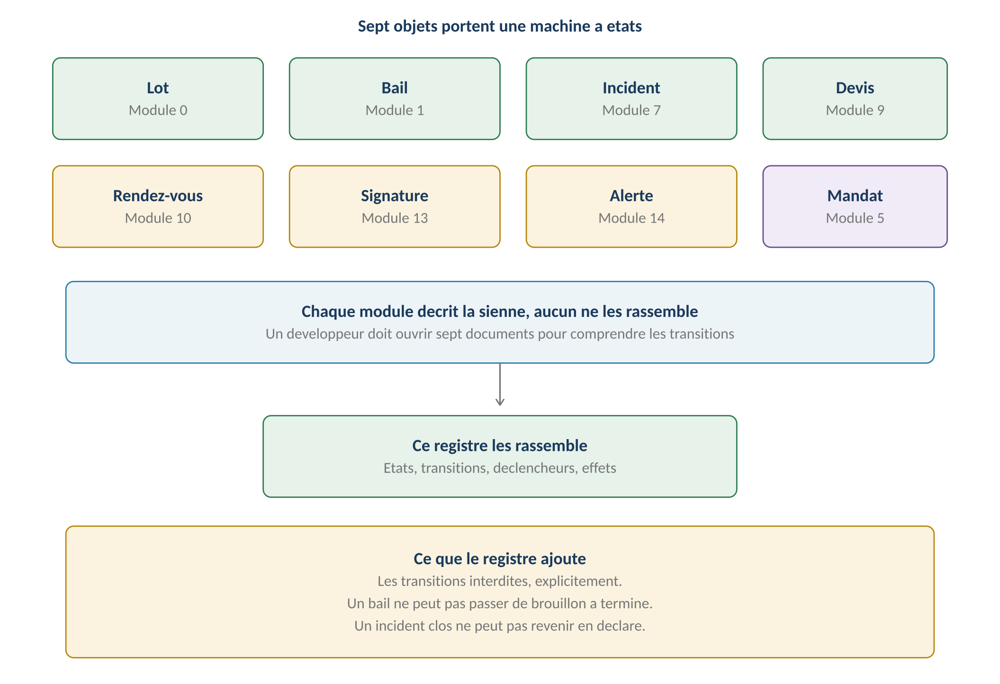
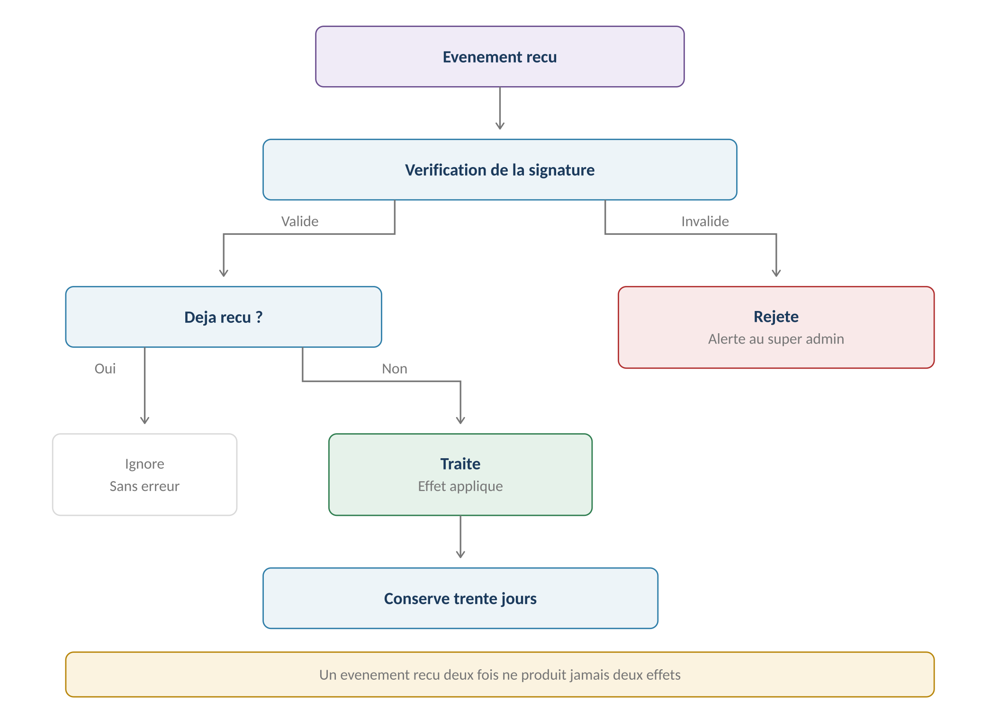
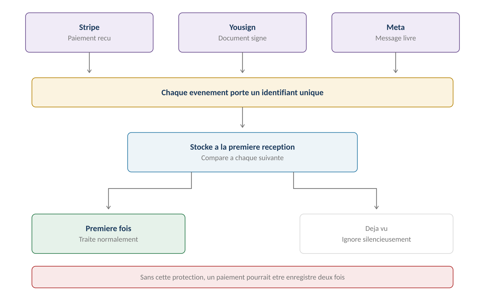

**GERIMMO V3**

Livrables transverses

**LIVRABLE A5**

**États et événements**

|             |                                                     |
|:------------|:----------------------------------------------------|
| **Origine** | **Audit externe du 24 juillet 2026 — point P0.6**   |
| **Objet**   | Machines à états unifiées et contrats d'événements  |
| **Constat** | **Huit machines dispersées, aucun registre commun** |
| **Portée**  | Transverse — consolide sans rien modifier           |
| **Usage**   | **Document de référence pour le développement**     |

> **Pourquoi ce livrable**
>
> **Ce que l'audit reproche**
>
> Les modules définissent des transitions d'état sans registre unifié
>
> ni contrat d'événements.
>
> Les intégrations externes — Stripe, Yousign, WhatsApp — appellent
>
> une gestion des rejeux, une idempotence et une compensation
>
> qui ne sont décrites nulle part.

**Les huit machines à états**

------------------------------------------------------------------------

*Schéma 1 — Huit objets, huit machines, aucun registre commun*

> **Ce que ce registre ajoute**
>
> Il ne modifie aucune machine : il les rassemble et les complète.
>
> Ce qui manquait surtout : les transitions interdites.
>
> Un bail ne peut pas passer de brouillon à terminé.
>
> Un incident clos ne peut pas revenir en déclaré.
>
> Les modules disaient ce qui est permis, jamais ce qui est impossible.
>
> **Le registre des machines à états**

**Lot — module 0**

------------------------------------------------------------------------

| **État**       | **Transitions permises** | **Déclencheur**                |
|:---------------|:-------------------------|:-------------------------------|
| **disponible** | → loué · → archivé       | Signature du bail              |
| **loué**       | → préavis · → disponible | Congé ou fin de bail           |
| **préavis**    | → disponible · → loué    | Fin de préavis ou rétractation |
| **archivé**    | Aucune                   | État terminal                  |

| **Transition interdite** | **Pourquoi**                     |
|:-------------------------|:---------------------------------|
| **disponible → préavis** | Un lot vacant n'a pas de préavis |
| **archivé → disponible** | L'archivage est définitif        |

**Bail — module 1**

------------------------------------------------------------------------

| **État** | **Transitions permises** | **Déclencheur** |
|:---|:---|:---|
| **brouillon** | → à signer · → annulé | Génération ou abandon |
| **à signer** | → actif · → brouillon · → annulé | Signature complète ou correction |
| **actif** | → préavis · → reconduit | Congé ou terme |
| **préavis** | → terminé · → actif | Fin de préavis ou rétractation |
| **terminé** | → archivé | État des lieux de sortie fait |
| **annulé** | Aucune | État terminal |
| **archivé** | Aucune | État terminal |

| **Transition interdite** | **Pourquoi**                                 |
|:-------------------------|:---------------------------------------------|
| **brouillon → actif**    | La signature est obligatoire — RM-1.7.1      |
| **actif → annulé**       | Un bail signé se résilie, il ne s'annule pas |
| **terminé → actif**      | Un nouveau bail est requis                   |

**Incident — module 7**

------------------------------------------------------------------------

| **État**     | **Transitions permises** | **Déclencheur**                   |
|:-------------|:-------------------------|:----------------------------------|
| **déclaré**  | → qualifié · → clos      | Qualification ou classement       |
| **qualifié** | → affecté · → résolu     | Affectation ou résolution directe |
| **affecté**  | → en cours · → qualifié  | Acceptation ou refus artisan      |
| **en cours** | → terminé                | Compte rendu déposé               |
| **terminé**  | → clos                   | Validation de l'agent             |
| **clos**     | → rouvert                | Le désordre réapparaît            |
| **rouvert**  | → qualifié               | Nouvelle qualification            |

| **Transition interdite** | **Pourquoi**                               |
|:-------------------------|:-------------------------------------------|
| **déclaré → affecté**    | L'imputation est obligatoire — RM-7.2.7    |
| **clos → déclaré**       | La réouverture passe par qualifié          |
| **en cours → clos**      | Le compte rendu est obligatoire — RM-7.5.1 |

**Devis — module 9**

------------------------------------------------------------------------

| **État**    | **Transitions permises**       | **Déclencheur**          |
|:------------|:-------------------------------|:-------------------------|
| **demandé** | → déposé · → expiré            | Dépôt ou délai           |
| **déposé**  | → validé · → refusé · → expiré | Décision ou délai        |
| **validé**  | → facturé                      | Facture déposée          |
| **refusé**  | Aucune                         | État terminal            |
| **expiré**  | Aucune                         | État terminal — RM-9.2.3 |
| **facturé** | Aucune                         | État terminal            |

**Rendez-vous — module 10**

------------------------------------------------------------------------

| **État** | **Transitions permises** | **Déclencheur** |
|:---|:---|:---|
| **proposé** | → confirmé · → contre-proposé | Choix ou refus du locataire |
| **contre-proposé** | → confirmé · → arbitrage | Acceptation ou refus artisan |
| **arbitrage** | → confirmé | Le gérant saisit le RDV |
| **confirmé** | → honoré · → reporté · → manqué | Réalisation ou absence |
| **reporté** | → proposé | Nouveau cycle |
| **manqué** | → proposé | Nouveau cycle |
| **honoré** | Aucune | État terminal |

**Demande de signature — module 13**

------------------------------------------------------------------------

| **État** | **Transitions permises** | **Déclencheur** |
|:---|:---|:---|
| **préparée** | → envoyée · → annulée | Envoi ou abandon |
| **envoyée** | → en cours · → refusée · → expirée | Première signature ou refus |
| **en cours** | → complète · → refusée · → expirée | Dernière signature ou refus |
| **complète** | Aucune | État terminal |
| **refusée** | → préparée | Nouvelle demande |
| **expirée** | → préparée | Relance — RM-13.4.5 |

**Alerte — module 14**

------------------------------------------------------------------------

| **État** | **Transitions permises** | **Déclencheur** |
|:---|:---|:---|
| **ouverte** | → fermée · → reportée · → escaladée | Action, report ou délai |
| **reportée** | → ouverte | Date de report atteinte |
| **escaladée** | → fermée · → ouverte | Traitement ou renvoi à l'agent |
| **fermée** | Aucune | État terminal |

> **Une alerte se ferme par l'action**
>
> RM-14.3.2 pose qu'aucun marquage manuel ne ferme une alerte.
>
> La transition « ouverte → fermée » n'est donc jamais déclenchée
>
> par l'utilisateur : elle résulte du traitement de l'échéance
>
> dans le module d'origine.

**Mandat — module 5**

------------------------------------------------------------------------

| **État**      | **Transitions permises** | **Déclencheur**                |
|:--------------|:-------------------------|:-------------------------------|
| **brouillon** | → à signer · → annulé    | Génération ou abandon          |
| **à signer**  | → actif · → annulé       | Signature complète             |
| **actif**     | → préavis · → reconduit  | Résiliation ou terme           |
| **préavis**   | → résilié · → actif      | Fin de préavis ou rétractation |
| **résilié**   | Aucune                   | État terminal                  |

> **Les événements et leurs effets**

**Une transition, plusieurs effets**

------------------------------------------------------------------------

*Schéma 2 — Un seul déclencheur, quatre effets à garantir ensemble*

> **Le point que l'audit soulève**
>
> La signature d'un bail déclenche quatre effets : le lot passe en loué,
>
> l'échéancier est créé, l'alerte d'état des lieux est programmée,
>
> le document est archivé.
>
> Si l'un échoue, les autres ne doivent pas rester à moitié faits.
>
> Soit tout aboutit, soit une compensation explicite intervient.

**Les chaînes critiques**

------------------------------------------------------------------------

| **Événement** | **Effets déclenchés** | **Règles** |
|:---|:---|:---|
| **Bail signé** | Lot loué, échéancier créé, alerte EDL, archivage | RM-1.7.1 à 1.7.3 |
| **Mandat signé** | Gestion activée sur les lots couverts | RM-5.6.1 |
| **Encaissement enregistré** | Écriture, honoraires, quittance | RM-3.4.1, RM-4.2.2 |
| **Facture validée** | Écriture selon imputation, solde ou rapport | RM-9.8.2 à 9.8.4 |
| **Incident clos** | Notation déclenchée, alerte fermée | RM-7.6.2 |
| **Période clôturée** | Rapport débloqué, écritures figées | RM-4.4.1, RM-6.1.2 |
| **Rapport envoyé** | Rapport figé, alerte versement programmée | RM-6.2.4, RM-6.2.7 |

**La règle de cohérence**

------------------------------------------------------------------------

| **Cas** | **Traitement** |
|:---|:---|
| **Tous les effets réussissent** | Transition validée |
| **Un effet échoue** | **Transition annulée, aucun effet appliqué** |
| **Effet différé par nature** | Envoi d'email, notification — traité en file |
| **Échec d'un effet différé** | Nouvelle tentative, puis alerte si persistant |

> **Distinguer l'effet immédiat de l'effet différé**
>
> Créer un échéancier est immédiat et doit réussir avec la transition.
>
> Envoyer un email de notification est différé : son échec ne doit pas
>
> annuler la signature du bail. Il déclenche une nouvelle tentative,
>
> puis une alerte à l'agent si le problème persiste.
>
> **Les événements externes**

**Le cycle de traitement**

------------------------------------------------------------------------

*Schéma 3 — Signature, idempotence, traitement, conservation*

**Les trois intégrations**

------------------------------------------------------------------------

| **Prestataire** | **Événements reçus** | **Effet dans Gerimmo** |
|:---|:---|:---|
| **Yousign** | Signature apposée | Progression du circuit |
| **Yousign** | **Toutes signatures obtenues** | **Bail actif, lot loué** |
| **Yousign** | Refus de signature | Demande refusée, alerte agent |
| **Yousign** | Expiration | Demande expirée, relançable |
| **Stripe** | Paiement réussi | Abonnement à jour |
| **Stripe** | **Échec de prélèvement** | **Relance puis suspension** |
| **Stripe** | Moyen de paiement expiré | Alerte avant échéance |
| **Meta** | Message livré | Trace de livraison |
| **Meta** | Message lu | Trace de lecture |
| **Meta** | **Message entrant** | File d'attente de rattachement |
| **Meta** | Consentement révoqué | Canal désactivé, repli email |

**L'idempotence**

------------------------------------------------------------------------

*Schéma 4 — Un événement reçu deux fois ne produit qu'un effet*

> **Pourquoi c'est indispensable — décision actée**
>
> Les trois prestataires renvoient parfois le même événement plusieurs fois.
>
> C'est documenté chez eux et considéré comme normal.
>
> Sans protection, un paiement serait enregistré deux fois,
>
> ou une signature déclencherait deux échéanciers.
>
> Chaque événement porte un identifiant unique, stocké à la première réception
>
> et comparé à chaque suivante.

**Le rejeu**

------------------------------------------------------------------------

| **Mécanisme** | **Qui** | **Détail** |
|:---|:---|:---|
| **Nouvelle tentative automatique** | Le prestataire | Selon son propre calendrier |
| **Conservation des événements** | Gerimmo | **Trente jours — décision actée** |
| **Rejeu manuel** | Super admin | Depuis la console, sur un événement conservé |
| **Alerte sur échec persistant** | Système | Après trois tentatives infructueuses |

> **Deux protections valent mieux qu'une**
>
> Le prestataire réessaie, ce qui couvre les pannes courtes.
>
> La conservation de trente jours couvre le cas où un bug applicatif
>
> a fait échouer le traitement sans que le prestataire le sache :
>
> l'événement a été accepté puis mal traité.
>
> Dans ce cas, seul un rejeu manuel permet de rattraper.

**La sécurité des webhooks**

------------------------------------------------------------------------

| **Exigence** | **Détail** |
|:---|:---|
| **Vérification de signature** | **Tout événement non signé est rejeté** |
| **Alerte sur signature invalide** | Tentative d'intrusion possible |
| **Réponse rapide** | Accusé immédiat, traitement asynchrone |
| **Pas de traitement synchrone** | Un traitement long ferait échouer le webhook |

> **Synthèse**

**Les règles du livrable**

------------------------------------------------------------------------

| **Code** | **Règle** | **Bloquant** |
|:---|:---|:---|
| **RM-A5.1** | **Toute transition non listée est interdite** | **Oui** |
| **RM-A5.2** | Un état terminal n'a aucune transition sortante | **Oui** |
| **RM-A5.3** | **Les effets immédiats d'une transition réussissent ensemble** | **Oui** |
| **RM-A5.4** | Un effet différé qui échoue n'annule pas la transition | Structurel |
| **RM-A5.5** | Tout événement externe est vérifié par sa signature | **Oui** |
| **RM-A5.6** | **Chaque événement porte un identifiant unique** | **Oui** |
| **RM-A5.7** | Un événement déjà reçu est ignoré sans erreur | **Oui** |
| **RM-A5.8** | Les événements reçus sont conservés trente jours | Structurel |
| **RM-A5.9** | Le super admin peut rejouer un événement conservé | Structurel |
| **RM-A5.10** | Un webhook répond immédiatement, traite en asynchrone | Structurel |
| **RM-A5.11** | Trois échecs consécutifs déclenchent une alerte | Non |

**Ce que ce livrable consolide**

------------------------------------------------------------------------

| **Module**    | **Machine à états**                   |
|:--------------|:--------------------------------------|
| **Module 0**  | Lot — 4 états                         |
| **Module 1**  | **Bail — 7 états**                    |
| **Module 5**  | Mandat — 5 états                      |
| **Module 7**  | **Incident — 7 états**                |
| **Module 9**  | Devis — 6 états                       |
| **Module 10** | **Rendez-vous — 7 états**             |
| **Module 13** | Signature — 6 états                   |
| **Module 14** | Alerte — 4 états                      |
| **TOTAL**     | **Huit machines, quarante-six états** |

**Ce que ce livrable impose**

------------------------------------------------------------------------

| **Élément** | **Conséquence** |
|:---|:---|
| **Transitions interdites** | **À implémenter comme contrôles, pas comme conventions** |
| **Transactions** | Les effets immédiats partagent une transaction |
| **File de traitement** | Les effets différés passent par une file |
| **Table d'événements** | Nouvelle table technique à créer |
| **Console de rejeu** | Écran super admin à prévoir — module 18 |

**La phase A est terminée**

------------------------------------------------------------------------

> **Cinq livrables transverses produits**
>
> A1 — Modèle canonique d'identité et multi-tenancy.
>
> A2 — Matrice de conservation et doctrine RGPD.
>
> A3 — Documents, canaux et valeur probante.
>
> A4 — Socle sécurité.
>
> A5 — Registre des états et événements.
>
> Les six points bloquants de l'audit sont couverts,
>
> à l'exception du positionnement comptable qui relève d'une décision
>
> commerciale plus que technique.
