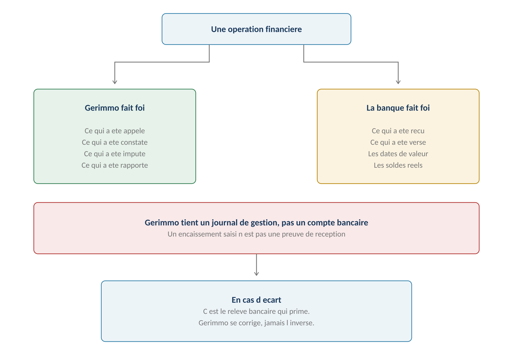
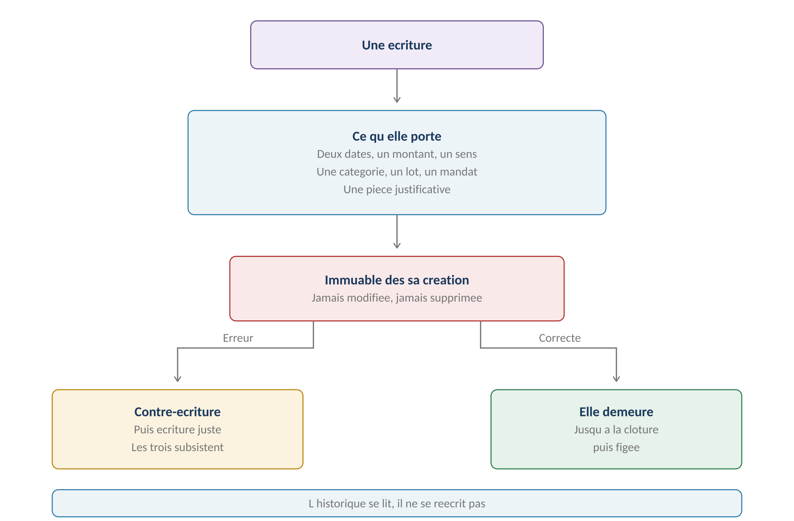
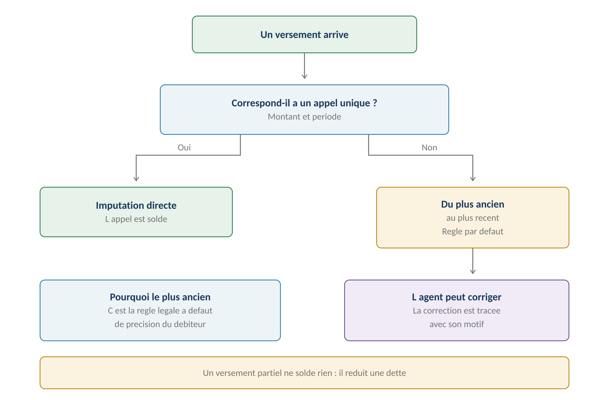
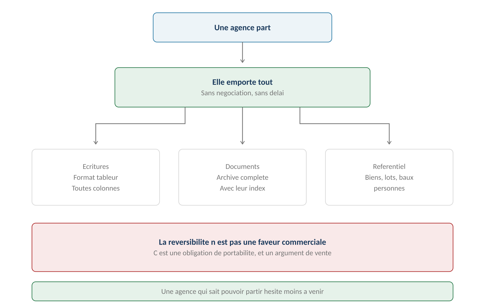

**GERIMMO V3**

Livrables transverses

**LIVRABLE A6**

**Doctrine financière**

|              |                                                          |
|:-------------|:---------------------------------------------------------|
| **Origine**  | **Audit actualisé — dernier blocage P0 ouvert**          |
| **Objet**    | Ce qui fait foi, immutabilité, allocation, réversibilité |
| **Position** | **Journal de gestion, jamais comptabilité de gérance**   |
| **Portée**   | Transverse — modules 3, 4, 6 et 18                       |
| **Réserve**  | **À faire valider par un expert-comptable**              |

> **Pourquoi ce livrable**
>
> **Le dernier blocage de l'audit**
>
> Cinq des six points bloquants ont reçu leur livrable — identité, RGPD,
>
> preuve, sécurité, événements.
>
> Le sixième restait ouvert : le module 4 pose désormais un positionnement
>
> clair, mais il ne dit pas ce qui fait foi où, ni comment se comporte
>
> le journal financier.

**Le risque à couvrir**

------------------------------------------------------------------------

| **Nature du risque** | **Ce qui peut arriver** |
|:---|:---|
| **Commercial** | **Une agence croit remplacer sa comptabilité de gérance** |
| **Réglementaire** | Elle manque à ses obligations sans le savoir |
| **Opérationnel** | Un écart entre Gerimmo et la banque n'est pas arbitré |
| **Contentieux** | Un montant est contesté sans historique fiable |

> **Le risque n'est pas technique**
>
> Gerimmo peut parfaitement tenir un journal de gestion juste et utile.
>
> Le danger est de laisser croire qu'il fait autre chose — et de le découvrir
>
> au premier contrôle, ou au premier litige.
>
> **Ce qui fait foi, et où**

*Schéma 1 — Gerimmo tient un journal de gestion, la banque tient les comptes*

**Le partage**

------------------------------------------------------------------------

| **Élément** | **Fait foi dans** | **Gerimmo en tient** |
|:---|:---|:---|
| **Montant appelé** | **Gerimmo** | La référence |
| **Montant reçu** | **La banque** | Une saisie déclarative |
| **Date de réception** | **La banque** | Une saisie déclarative |
| **Imputation comptable** | **Gerimmo** | La référence |
| **Honoraires calculés** | **Gerimmo** | La référence |
| **Net dû au propriétaire** | **Gerimmo** | La référence |
| **Versement effectué** | **La banque** | Une saisie déclarative |
| **Solde du compte** | **La banque** | Rien |
| **Comptabilité de l'agence** | **Son logiciel comptable** | Un export |

> **La règle simple**
>
> Gerimmo fait foi sur ce qu'il a calculé et décidé.
>
> La banque fait foi sur ce qui a réellement circulé.
>
> En cas d'écart, c'est le relevé bancaire qui prime.
>
> Gerimmo se corrige, jamais l'inverse.

**Ce que Gerimmo ne prétend pas être**

------------------------------------------------------------------------

| **Ce qu'il n'est pas** | **Pourquoi** |
|:---|:---|
| **Un logiciel de comptabilité** | Pas de plan comptable général, pas de balance |
| **Une comptabilité de gérance** | Pas de comptes mandants, pas de séquestre |
| **Un système bancaire** | Aucun mouvement de fonds ne transite |
| **Un tiers de confiance** | Aucune valeur probante sur les flux |
| **Un outil de rapprochement** | Le rapprochement reste manuel |

> **Le journal financier**

*Schéma 2 — Une écriture est immuable dès sa création*

**Ce que porte une écriture**

------------------------------------------------------------------------

| **Champ**                  | **Obligatoire** | **Origine**        |
|:---------------------------|:----------------|:-------------------|
| **Date de pièce**          | **Oui**         | RM-4.1.2           |
| **Date d'imputation**      | **Oui**         | RM-4.1.2           |
| **Montant**                | **Oui**         | Saisie             |
| **Sens**                   | **Oui**         | Recette ou dépense |
| **Catégorie**              | **Oui**         | RM-4.1.1           |
| **Lot**                    | **Oui**         | RM-4.1.1           |
| **Mandat**                 | **Oui**         | RM-4.1.7           |
| **Pièce justificative**    | Recommandée     | RM-4.1.6           |
| **Auteur de la saisie**    | **Oui**         | Automatique        |
| **Horodatage de création** | **Oui**         | Automatique        |

**L'immutabilité**

------------------------------------------------------------------------

> **Une écriture ne se modifie jamais**
>
> Le module 4 posait déjà qu'une période close est verrouillée — RM-4.4.1.
>
> Ce livrable étend le principe : une écriture est immuable dès sa création,
>
> même avant clôture.
>
> Une erreur constatée le jour même se corrige par contre-écriture,
>
> pas par modification. L'historique se lit, il ne se réécrit pas.

| **Cas** | **Traitement** | **Résultat** |
|:---|:---|:---|
| **Erreur de montant** | Contre-écriture puis écriture juste | **Trois lignes subsistent** |
| **Erreur de lot** | Contre-écriture puis écriture juste | Trois lignes subsistent |
| **Erreur de catégorie** | Contre-écriture puis écriture juste | Trois lignes subsistent |
| **Doublon de saisie** | Contre-écriture du doublon | Deux lignes subsistent |
| **Écriture à supprimer** | **Impossible** | Seule la contre-écriture existe |

> **Pourquoi cette rigueur sur un journal déclaratif**
>
> Parce qu'un rapport de gestion envoyé à un propriétaire engage l'agence.
>
> Si les écritures qui le composent peuvent être modifiées après coup,
>
> plus rien ne permet d'expliquer un montant contesté six mois plus tard.
>
> L'immutabilité protège l'agence autant que le propriétaire.

**La contre-écriture**

------------------------------------------------------------------------

| **Élément**           | **Règle**                                    |
|:----------------------|:---------------------------------------------|
| **Montant**           | Identique, sens inversé                      |
| **Date d'imputation** | **Celle du jour, jamais celle de l'origine** |
| **Date de pièce**     | Celle de l'écriture d'origine                |
| **Motif**             | **Obligatoire**                              |
| **Lien**              | Référence à l'écriture annulée               |
| **Visibilité**        | Les deux apparaissent dans l'historique      |

> **L'allocation des paiements**

*Schéma 3 — Du plus ancien au plus récent, sauf décision contraire*

**La règle et ses exceptions**

------------------------------------------------------------------------

| **Cas** | **Allocation** | **Origine** |
|:---|:---|:---|
| **Montant correspondant à un appel** | Cet appel | Évident |
| **Montant partiel** | **Du plus ancien au plus récent** | RM-3.3.2 |
| **Montant supérieur au dû** | Solde puis excédent reporté | RM-3.5.1 |
| **Le locataire précise** | **Sa précision prime** | Règle légale |
| **L'agent corrige** | Sa correction est tracée | RM-3.3.2 |

> **Pourquoi le plus ancien d'abord**
>
> C'est la règle d'imputation légale à défaut de précision du débiteur.
>
> Elle a une conséquence utile : elle permet de suivre l'ancienneté
>
> de la dette pour déclencher les relances au bon moment.

**Les écarts**

------------------------------------------------------------------------

| **Type d'écart** | **Détection** | **Traitement** |
|:---|:---|:---|
| **Montant reçu différent** | À la saisie | Écriture au montant réel |
| **Encaissement non saisi** | Au rapprochement manuel | Saisie rétroactive |
| **Encaissement saisi non reçu** | Au rapprochement manuel | Contre-écriture |
| **Frais bancaires** | Au rapprochement | Écriture de dépense |
| **Erreur de bénéficiaire** | Au rapprochement | Contre-écriture et régularisation |

> **Le rapprochement reste manuel — et c'est assumé**
>
> Aucune synchronisation bancaire n'est prévue : l'agent compare son relevé
>
> à son journal Gerimmo.
>
> Cette limite doit être connue de l'agence, et le journal doit faciliter
>
> la comparaison — export par période, tri par date, totaux clairs.
>
> **Clôtures et réouvertures**

**Ce que la clôture verrouille**

------------------------------------------------------------------------

| **Action**                     | **Avant clôture** | **Après clôture**      |
|:-------------------------------|:------------------|:-----------------------|
| **Ajouter une écriture**       | Oui               | **Non**                |
| **Contre-passer une écriture** | Oui               | Sur la période ouverte |
| **Modifier une écriture**      | **Non**           | **Non**                |
| **Consulter**                  | Oui               | Oui                    |
| **Exporter**                   | Oui               | Oui                    |

**La réouverture**

------------------------------------------------------------------------

| **Condition**               | **Règle**                       | **Origine** |
|:----------------------------|:--------------------------------|:------------|
| **Qui peut**                | Admin agence uniquement         | RM-4.4.5    |
| **Motif**                   | Obligatoire et tracé            | RM-4.4.5    |
| **Rapport déjà envoyé**     | **Réouverture impossible**      | RM-4.4.6    |
| **Effet sur les écritures** | Aucun — elles restent immuables | Ce livrable |
| **Journalisation**          | Au journal d'audit              | RM-18.5.1   |

> **Une réouverture ne rend pas les écritures modifiables**
>
> Elle permet d'ajouter des écritures manquantes sur la période,
>
> rien de plus.
>
> Les écritures existantes restent immuables : c'est la contre-écriture
>
> qui corrige, jamais la modification.
>
> **Exports et réversibilité**

*Schéma 4 — Une agence emporte tout, sans négociation*

**Les trois exports**

------------------------------------------------------------------------

| **Export** | **Contenu** | **Usage** |
|:---|:---|:---|
| **Journal comptable** | Toutes les écritures, toutes colonnes | **Transmission à l'expert-comptable** |
| **Documents** | Archive complète avec index | Conservation ou migration |
| **Référentiel** | Biens, lots, baux, personnes, mandats | Migration vers un autre outil |

**Le format du journal**

------------------------------------------------------------------------

| **Colonne**              | **Contenu**                   |
|:-------------------------|:------------------------------|
| **Date de pièce**        | Format standard               |
| **Date d'imputation**    | Format standard               |
| **Sens**                 | Recette ou dépense            |
| **Montant**              | Deux décimales                |
| **Famille et catégorie** | Libellés complets             |
| **Bien, lot, mandat**    | Références et libellés        |
| **Propriétaire**         | Nom ou raison sociale         |
| **Locataire**            | Si applicable                 |
| **Pièce justificative**  | Référence, non le fichier     |
| **Écriture liée**        | **Pour les contre-écritures** |
| **Auteur et horodatage** | Traçabilité                   |

> **Pourquoi la réversibilité est un argument de vente**
>
> Une agence qui sait pouvoir partir hésite moins à venir.
>
> L'export complet, disponible à tout moment et sans négociation,
>
> lève l'objection du verrouillage — qui est la première
>
> que soulève un dirigeant d'agence.
>
> RM-18.4.2 le pose déjà pour une agence suspendue : ce livrable
>
> le généralise.
>
> **Ce qu'on dit à l'agence**
>
> **La transparence est la seule protection**
>
> Une agence qui découvre à l'usage que Gerimmo ne tient pas sa comptabilité
>
> de gérance se sentira trompée — et elle aura raison.
>
> Dire clairement ce que fait l'outil, et ce qu'il ne fait pas,
>
> protège la relation autant que l'agence.

**La formulation retenue**

------------------------------------------------------------------------

| **Ce que Gerimmo fait** | **Ce qu'il ne fait pas** |
|:---|:---|
| **Suit vos loyers et vos dépenses** | **Ne tient pas votre comptabilité de gérance** |
| **Calcule vos honoraires** | **Ne gère aucun compte mandant** |
| **Produit vos rapports propriétaires** | **N'assure aucun séquestre** |
| **Prépare vos récapitulatifs fiscaux** | **Ne remplace pas votre expert-comptable** |
| **Exporte tout, à tout moment** | **Ne se synchronise pas à votre banque** |

**Où cette mention apparaît**

------------------------------------------------------------------------

| **Support** | **Forme** | **Moment** |
|:---|:---|:---|
| **Documentation commerciale** | Paragraphe dédié | Avant la vente |
| **Conditions d'utilisation** | Article explicite | À la souscription |
| **Paramétrage initial** | Écran d'information | **À la première connexion** |
| **Module comptabilité** | Bandeau permanent | À chaque usage |
| **Export du journal** | Mention en en-tête | Sur le fichier lui-même |

> **Synthèse**

**Les règles du livrable**

------------------------------------------------------------------------

| **Code** | **Règle** | **Bloquant** |
|:---|:---|:---|
| **RM-A6.1** | **Gerimmo tient un journal de gestion, jamais une comptabilité de gérance** | Structurel |
| **RM-A6.2** | **En cas d'écart, le relevé bancaire prime** | Structurel |
| **RM-A6.3** | **Une écriture est immuable dès sa création** | **Oui** |
| **RM-A6.4** | Une correction passe par contre-écriture, jamais par modification | **Oui** |
| **RM-A6.5** | Une contre-écriture porte la date du jour en imputation | Structurel |
| **RM-A6.6** | Le motif d'une contre-écriture est obligatoire | **Oui** |
| **RM-A6.7** | L'allocation suit le plus ancien, sauf précision du débiteur | Structurel |
| **RM-A6.8** | Le rapprochement bancaire reste manuel | Structurel |
| **RM-A6.9** | Une réouverture ne rend jamais les écritures modifiables | **Oui** |
| **RM-A6.10** | **L'export complet est disponible à tout moment** | **Oui** |
| **RM-A6.11** | Le journal exporté inclut les liens entre écritures | Structurel |
| **RM-A6.12** | **Les limites sont annoncées sur cinq supports** | **Oui** |

**Ce que ce livrable précise**

------------------------------------------------------------------------

| **Module**    | **Apport**                                              |
|:--------------|:--------------------------------------------------------|
| **Module 3**  | L'allocation des paiements et le traitement des écarts  |
| **Module 4**  | **L'immutabilité des écritures, au-delà de la clôture** |
| **Module 6**  | Ce qui fait foi dans un rapport envoyé                  |
| **Module 18** | Le contenu et le format des exports                     |

**Ce qui reste à faire**

------------------------------------------------------------------------

| **Action** | **Qui** | **Quand** |
|:---|:---|:---|
| **Validation de la doctrine** | Expert-comptable | Avant commercialisation |
| **Rédaction de l'article des CGU** | Conseil juridique | Avant commercialisation |
| **Format d'export définitif** | Technique | Lot 1 |
| **Écran d'information au paramétrage** | Produit | Lot 1 |

> **Réserve — point ouvert**
>
> Ce livrable pose une doctrine de fonctionnement, pas un avis comptable.
>
> Les principes retenus — immutabilité, contre-écriture, primauté du relevé —
>
> sont des pratiques courantes, mais leur suffisance au regard des obligations
>
> d'une agence titulaire d'une carte professionnelle doit être vérifiée.
>
> Aucun expert-comptable n'est identifié à ce jour.
>
> Cette validation reste un préalable à la commercialisation.

**Ce qu'il faudra faire valider**

------------------------------------------------------------------------

| **Question à poser** | **Pourquoi elle compte** |
|:---|:---|
| **La doctrine est-elle suffisante ?** | Immutabilité, contre-écriture, primauté du relevé |
| **Le journal est-il exploitable ?** | **Un expert-comptable doit pouvoir travailler avec l'export** |
| **Les mentions sont-elles suffisantes ?** | Protègent-elles réellement l'agence et Gerimmo |
| **Manque-t-il quelque chose ?** | Un élément indispensable non prévu |
| **Le format d'export convient-il ?** | Colonnes, granularité, périodicité |

> **Une note de synthèse plutôt que le référentiel entier**
>
> Le moment venu, il sera plus efficace de préparer une note de deux ou trois pages
>
> reprenant ces cinq questions, plutôt que de transmettre les quatre cent
>
> soixante-dix pages du référentiel.
>
> Un expert-comptable facture son temps de lecture.
