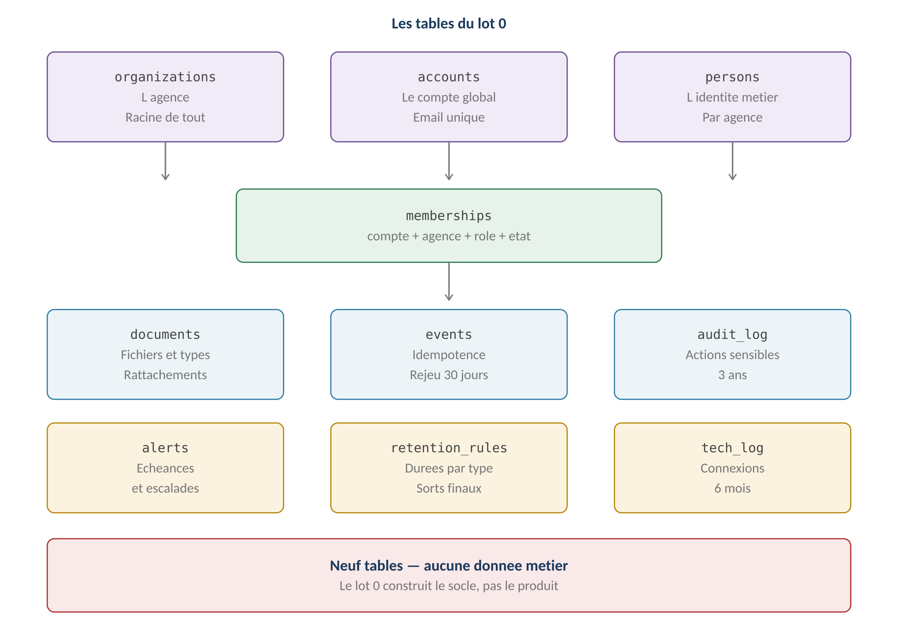
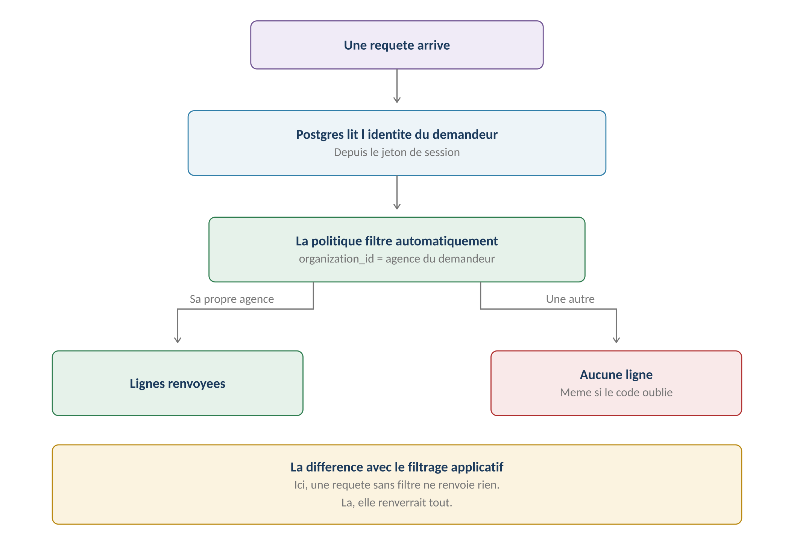
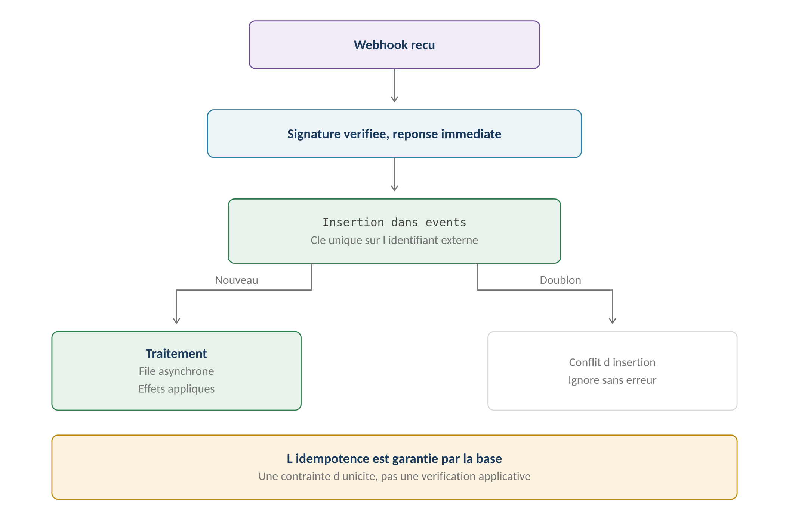
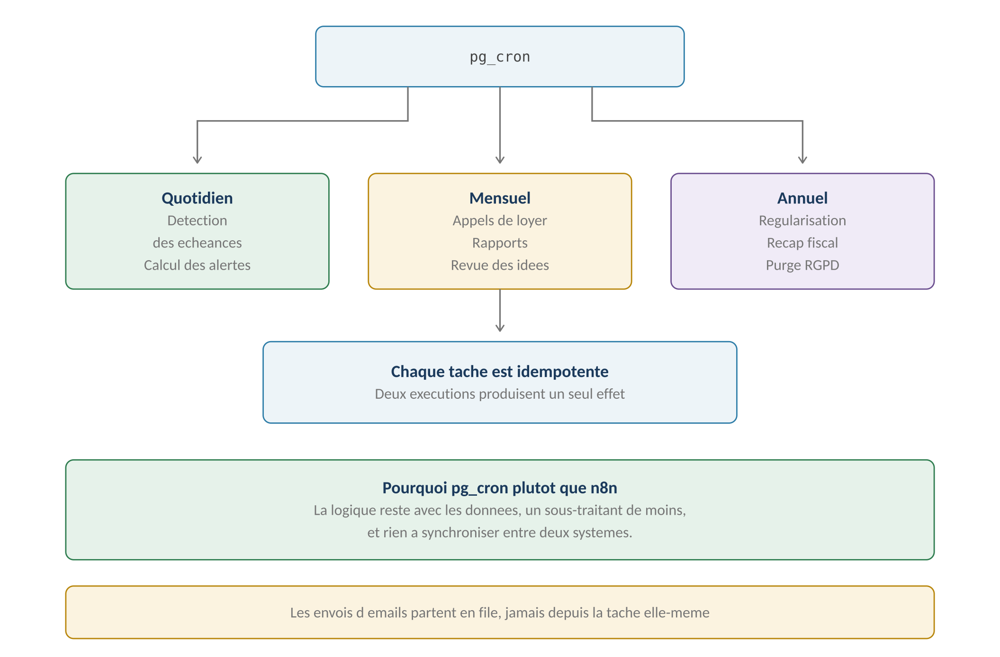

**GERIMMO V3**

Démarrage du développement

**LOT 0**

**Architecture du socle**

|               |                                                          |
|:--------------|:---------------------------------------------------------|
| **Objet**     | Traduction des six livrables A en architecture technique |
| **Pile**      | **Next.js, Supabase, Vercel**                            |
| **Isolation** | **Row Level Security Postgres**                          |
| **Tâches**    | pg_cron — pas de n8n                                     |
| **Périmètre** | **Aucune donnée métier — le socle seulement**            |

> **Ce que le lot 0 construit**
>
> **Un socle invisible**
>
> Le lot 0 ne produit aucun écran métier, aucun bail, aucune quittance.
>
> Il construit ce sur quoi tout le reste s'appuiera : l'identité,
>
> l'isolation, les documents, les événements, les alertes et l'audit.
>
> Sa réussite se mesure à une chose : que le lot 1A puisse démarrer
>
> sans avoir à revenir dessus.

**Les neuf tables**

------------------------------------------------------------------------

*Schéma 1 — Neuf tables, aucune donnée métier*

| **Table**           | **Rôle**                          | **Livrable** |
|:--------------------|:----------------------------------|:-------------|
| **organizations**   | L'agence — racine de l'isolation  | A1           |
| **accounts**        | Le compte global, email unique    | A1           |
| **persons**         | L'identité métier, par agence     | A1           |
| **memberships**     | **Compte + agence + rôle + état** | A1           |
| **documents**       | Fichiers, types et rattachements  | A3           |
| **events**          | Idempotence et rejeu              | A5           |
| **audit_log**       | Actions sensibles, trois ans      | A2, A4       |
| **tech_log**        | Connexions et erreurs, six mois   | A2, A4       |
| **alerts**          | Échéances et escalades            | A5           |
| **retention_rules** | Durées et sorts finaux            | A2           |

> **Pourquoi retention_rules est une table**
>
> La matrice de conservation du livrable A2 compte trente-deux types de données.
>
> Les coder en dur imposerait un déploiement à chaque ajustement de durée.
>
> Une table permet de les faire évoluer sans toucher au code,
>
> et de les documenter là où elles s'appliquent.
>
> **L'isolation multi-tenant**

*Schéma 2 — Une requête sans filtre ne renvoie rien*

> **Pourquoi Row Level Security — décision actée**
>
> Le filtrage applicatif fait reposer l'isolation sur la discipline du code.
>
> Une seule requête où le filtre est oublié expose les données d'une autre agence,
>
> et l'erreur est silencieuse.
>
> RLS déplace la garantie dans Postgres : même si le code se trompe,
>
> la base refuse de renvoyer les lignes.
>
> C'est ce qui protège quand on développe seul et vite.

**Le principe**

------------------------------------------------------------------------

| **Élément** | **Règle** |
|:---|:---|
| **Colonne d'isolation** | **organization_id sur toute table de données d'agence** |
| **Politique de lecture** | Filtre sur l'agence de l'utilisateur connecté |
| **Politique d'écriture** | Même filtre, plus contrôle du rôle |
| **Super admin** | Politique dédiée, traversée journalisée |
| **Identifiants** | UUID, jamais séquentiels — RM-A1.12 |

**Les trois niveaux de données**

------------------------------------------------------------------------

| **Niveau** | **Tables** | **Politique** |
|:---|:---|:---|
| **Données d'agence** | Toutes les tables métier à venir | **RLS strict** |
| **Données partagées** | Profil artisan public, modèles | RLS avec exception de lecture |
| **Données globales** | accounts, indices IRL | Lecture selon adhésion |

**La forme d'une politique**

------------------------------------------------------------------------

> -- Lecture : uniquement les lignes de son agence
>
> create policy lecture_agence on \<table\>
>
> for select using (
>
> organization_id in (
>
> select organization_id from memberships
>
> where account_id = auth.uid()
>
> and etat = 'active'
>
> )
>
> );
>
> **Un point d'attention**
>
> La sous-requête sur memberships s'exécute à chaque ligne.
>
> Sur des volumes importants, il faudra la remplacer par une fonction
>
> marquée stable, ou porter l'agence dans le jeton de session.
>
> À mesurer dès le lot 1B, quand les premières tables métier existeront.

**Le test d'isolation**

------------------------------------------------------------------------

> **RM-A1.7 — non négociable**
>
> Chaque table porte un test qui vérifie qu'une agence ne lit jamais
>
> les données d'une autre.
>
> Le test crée deux agences, insère une ligne dans chacune,
>
> et vérifie que chaque agence n'en voit qu'une.
>
> Il s'exécute à chaque livraison. Sans lui, RLS peut être désactivé
>
> sur une table sans que personne ne s'en aperçoive.
>
> **Identité et adhésions**

**Le modèle**

------------------------------------------------------------------------

> accounts
>
> id uuid primary key
>
> email text unique not null -- RM-A1.1
>
> mfa_actif boolean default false
>
> organizations
>
> id uuid primary key
>
> raison_sociale text not null
>
> etat text -- essai, active, suspendue, archivee
>
> memberships
>
> id uuid primary key
>
> account_id uuid references accounts
>
> organization_id uuid references organizations
>
> role text -- agent, admin_agence, super_admin
>
> etat text -- invitee, active, inactive
>
> unique (account_id, organization_id) -- RM-A1.3

**Les règles portées par le schéma**

------------------------------------------------------------------------

| **Règle**    | **Traduction technique**                               |
|:-------------|:-------------------------------------------------------|
| **RM-A1.1**  | **Contrainte unique sur accounts.email**               |
| **RM-A1.3**  | **Contrainte unique sur le couple compte-agence**      |
| **RM-A1.4**  | persons n'a aucune référence obligatoire vers accounts |
| **RM-A1.5**  | Le rôle est sur memberships, jamais sur accounts       |
| **RM-A1.12** | Clés primaires en UUID                                 |

> **Ce que le schéma garantit à lui seul**
>
> Trois règles du livrable A1 sont portées par des contraintes de base,
>
> pas par du code applicatif.
>
> Un doublon d'email ou une double adhésion sont impossibles,
>
> même en cas d'erreur de programmation.

**Le super admin**

------------------------------------------------------------------------

| **Aspect**        | **Traitement**                                      |
|:------------------|:----------------------------------------------------|
| **Rôle**          | Une adhésion de rôle super_admin, sans organisation |
| **Politique RLS** | Exception explicite dans chaque politique           |
| **Traversée**     | **Journalisée systématiquement — RM-A1.11**         |
| **MFA**           | Obligatoire — RM-A4.1                               |

> **Documents et stockage**

**Le modèle**

------------------------------------------------------------------------

> documents
>
> id uuid primary key
>
> organization_id uuid not null
>
> type text not null -- pilote droits et conservation
>
> chemin_storage text not null
>
> empreinte text -- detection de doublon
>
> taille integer
>
> analyse_av text -- en_attente, sain, rejete
>
> date_creation timestamptz
>
> document_liens
>
> document_id uuid references documents
>
> entite_type text -- lot, bail, personne, mandat, incident
>
> entite_id uuid
>
> primary key (document_id, entite_type, entite_id)
>
> **Le rattachement multiple sans arborescence**
>
> La table document_liens porte la décision du module 12 : un document
>
> apparaît sur toutes les fiches qu'il concerne.
>
> Aucune notion de dossier ni de chemin — c'est le type qui pilote
>
> les droits et la conservation.

**Le stockage**

------------------------------------------------------------------------

| **Aspect** | **Choix** | **Règle** |
|:---|:---|:---|
| **Service** | **Supabase Storage** | Décision actée |
| **Accès** | **Jamais par URL directe** | RM-A4.10 |
| **Lien de téléchargement** | Signé, expiration courte | RM-A4.10 |
| **Chiffrement** | Au repos, natif | RM-A4.6 |
| **Antivirus** | **À l'upload, avant disponibilité** | RM-A4.8 |
| **Formats** | PDF, JPG, PNG — type réel vérifié | RM-A4.9 |

> **L'antivirus reste à choisir**
>
> Le service n'est pas arrêté. Son choix a une conséquence contractuelle :
>
> sa localisation entre dans le tableau des sous-traitants du livrable A4.
>
> En attendant, le champ analyse_av permet de construire le parcours
>
> et de brancher le service ensuite.
>
> **Événements et idempotence**

*Schéma 3 — L'idempotence est garantie par une contrainte, pas par du code*

**Le modèle**

------------------------------------------------------------------------

> events
>
> id uuid primary key
>
> source text not null -- stripe, yousign, meta
>
> identifiant_ext text not null
>
> type text not null
>
> charge_utile jsonb
>
> recu_le timestamptz default now()
>
> traite_le timestamptz
>
> statut text -- recu, traite, echec
>
> tentatives integer default 0
>
> unique (source, identifiant_ext) -- RM-A5.6
>
> **La contrainte fait tout le travail**
>
> RM-A5.7 impose qu'un événement déjà reçu soit ignoré sans erreur.
>
> La contrainte d'unicité sur source et identifiant externe suffit :
>
> une seconde insertion échoue, on l'ignore, rien ne se passe.
>
> Aucune vérification applicative n'est nécessaire.

**Le traitement**

------------------------------------------------------------------------

| **Étape**                     | **Règle**                       | **Origine** |
|:------------------------------|:--------------------------------|:------------|
| **Vérification de signature** | Avant toute insertion           | RM-A5.5     |
| **Réponse au prestataire**    | **Immédiate, avant traitement** | RM-A5.10    |
| **Traitement**                | Asynchrone, en file             | RM-A5.10    |
| **Conservation**              | Trente jours                    | RM-A5.8     |
| **Échec répété**              | Alerte après trois tentatives   | RM-A5.11    |

**La cohérence des effets**

------------------------------------------------------------------------

> **RM-A5.3 en pratique**
>
> Les effets immédiats d'une transition partagent une transaction Postgres.
>
> La signature d'un bail — lot en loué, échéancier créé, alerte programmée,
>
> document archivé — s'exécute dans un seul begin/commit.
>
> Les effets différés — envoi d'email, notification — passent par la file
>
> et ne peuvent pas faire échouer la transition.
>
> **Tâches planifiées**

*Schéma 4 — pg_cron garde la logique avec les données*

> **Pourquoi pas n8n — décision actée**
>
> n8n était envisagé au début du projet. pg_cron le remplace avantageusement :
>
> un sous-traitant de moins dans le tableau A4, rien à synchroniser
>
> entre deux systèmes, et la logique reste avec les données.
>
> Le référentiel ne demande rien que pg_cron ne sache faire.

**Les tâches du socle**

------------------------------------------------------------------------

| **Tâche** | **Fréquence** | **Ce qu'elle fait** |
|:---|:---|:---|
| **Détection d'échéances** | Quotidienne | Alimente la table alerts |
| **Escalade des alertes** | Quotidienne | Selon la criticité — RM-14.4.1 |
| **Purge des journaux** | Quotidienne | Selon retention_rules |
| **Purge des événements** | Quotidienne | Au-delà de trente jours |
| **Application des sorts RGPD** | Quotidienne | Suppression ou anonymisation |
| **Relance de la file** | Toutes les heures | Événements en échec |

**La règle d'idempotence**

------------------------------------------------------------------------

> **Deux exécutions, un seul effet**
>
> Une tâche peut s'exécuter deux fois — reprise après incident,
>
> chevauchement, redémarrage.
>
> Chaque tâche doit donc vérifier ce qu'elle a déjà fait avant d'agir :
>
> une alerte existe déjà, un appel de loyer est déjà émis.
>
> C'est le même principe que l'idempotence des webhooks, appliqué au temps.
>
> **Conventions de développement**
>
> **Ce qui ne peut pas vivre dans un module**
>
> La matrice de traçabilité identifie vingt règles architecturales
>
> qui ne relèvent d'aucun parcours métier.
>
> Elles deviennent des conventions de développement — des règles
>
> que tout code respecte, vérifiées en revue et par les tests.

**Les conventions obligatoires**

------------------------------------------------------------------------

| **Convention** | **Origine** | **Vérification** |
|:---|:---|:---|
| **organization_id sur chaque table métier** | RM-A1.6 | **Test d'isolation** |
| **Politique RLS sur chaque table** | RM-A1.6 | **Test d'isolation** |
| **UUID en clé primaire** | RM-A1.12 | Revue |
| **Deux dates sur les écritures** | RM-4.1.2 | Contrainte de base |
| **Aucune suppression physique d'écriture** | RM-A6.3 | Absence de DELETE |
| **Transaction sur les effets immédiats** | RM-A5.3 | Revue |
| **Analyse antivirus avant disponibilité** | RM-A4.8 | Test |
| **Aucun accès direct au stockage** | RM-A4.10 | Revue |
| **Journalisation des actions sensibles** | RM-18.5.1 | Test |

**Ce que les tests vérifient**

------------------------------------------------------------------------

| **Test** | **Portée** | **Fréquence** |
|:---|:---|:---|
| **Isolation par table** | **Chaque table** | **Chaque livraison** |
| **Contraintes d'unicité** | Email, adhésion, événement | Chaque livraison |
| **Idempotence des webhooks** | Trois prestataires | Chaque livraison |
| **Idempotence des tâches** | Six tâches | Chaque livraison |
| **Politiques RLS actives** | Toutes les tables | Chaque livraison |

> **Le test qui compte le plus**
>
> Vérifier que RLS est actif sur chaque table.
>
> Une table créée sans politique est lisible par tout le monde.
>
> Ce test parcourt le catalogue Postgres et échoue si une seule table
>
> de données d'agence n'a pas de politique.
>
> **Séquence de construction**

**Les cinq étapes**

------------------------------------------------------------------------

| **Étape** | **Contenu** | **Fin quand** |
|:---|:---|:---|
| **1 — Identité** | accounts, organizations, memberships, RLS | **Deux agences isolées** |
| **2 — Accès** | Authentification, MFA, sessions, rôles | Un agent voit ses données |
| **3 — Documents** | documents, liens, stockage, antivirus | Un fichier déposé et relu |
| **4 — Événements** | events, file, webhooks, idempotence | Un doublon ignoré |
| **5 — Exploitation** | alerts, audit_log, pg_cron, conservation | Une alerte créée et purgée |

> **Un critère de fin par étape**
>
> Chaque étape se termine sur une démonstration, pas sur du code écrit.
>
> L'étape 1 se termine quand deux agences existent et que l'une
>
> ne voit rien de l'autre — vérifié par un test, pas par une lecture.

**Ce qui bloque le lot 1A**

------------------------------------------------------------------------

| **Élément**              | **Pourquoi il bloque**                       |
|:-------------------------|:---------------------------------------------|
| **Le modèle d'identité** | **Toute table métier s'y rattache**          |
| **RLS et son test**      | Sans lui, chaque table ajoutée est un risque |
| **La table documents**   | Le bail génère un document dès le lot 1A     |
| **L'authentification**   | Aucun écran sans utilisateur connecté        |

**Ce qui peut suivre**

------------------------------------------------------------------------

| **Élément**               | **Quand**                         |
|:--------------------------|:----------------------------------|
| **Les événements**        | Lot 1B — avec la signature        |
| **Les tâches planifiées** | Lot 1B — avec les appels de loyer |
| **Les alertes**           | Lot 1B — les premières échéances  |
| **L'antivirus**           | Avant le pilote                   |
| **Les sorts RGPD**        | Avant le pilote                   |

> **Une nuance sur la séquence**
>
> Les étapes 4 et 5 peuvent démarrer pendant le lot 1A si le temps le permet,
>
> mais elles ne le bloquent pas.
>
> Ce qui bloque vraiment, ce sont les étapes 1 à 3.
>
> **Synthèse**

**Les décisions techniques**

------------------------------------------------------------------------

| **Décision**          | **Choix**              | **Motif**                     |
|:----------------------|:-----------------------|:------------------------------|
| **Isolation**         | **Row Level Security** | La base garantit, pas le code |
| **Stockage**          | **Supabase Storage**   | Intégré, cohérent             |
| **Tâches planifiées** | **pg_cron**            | Un sous-traitant de moins     |
| **Identifiants**      | UUID                   | Non énumérables               |
| **Conservation**      | Table de règles        | Évolutive sans déploiement    |
| **Idempotence**       | Contrainte d'unicité   | Garantie par la base          |

**Ce que le lot 0 ne fait pas**

------------------------------------------------------------------------

| **Élément**                          | **Pourquoi**                 |
|:-------------------------------------|:-----------------------------|
| **Aucun écran métier**               | C'est le lot 1A              |
| **Aucune table de bien ou de bail**  | C'est le lot 1A              |
| **Aucune règle de gestion locative** | Les modules la portent       |
| **Aucun modèle de document**         | Lot 1A — dépend du module 12 |

**Ce qui reste à choisir**

------------------------------------------------------------------------

| **Point**                          | **Échéance**    |
|:-----------------------------------|:----------------|
| **Le service antivirus**           | Avant l'étape 3 |
| **Le format d'export du journal**  | Lot 1B          |
| **Le lien sécurisé pour le devis** | Lot 3           |

**Le point de départ**

------------------------------------------------------------------------

> **Par où commencer demain**
>
> L'étape 1 : trois tables, leurs politiques RLS, et le test d'isolation.
>
> C'est peu de code, mais c'est ce qui conditionne tout le reste.
>
> Une fois que deux agences coexistent sans se voir, le lot 1A peut démarrer
>
> sans crainte de devoir revenir en arrière.
