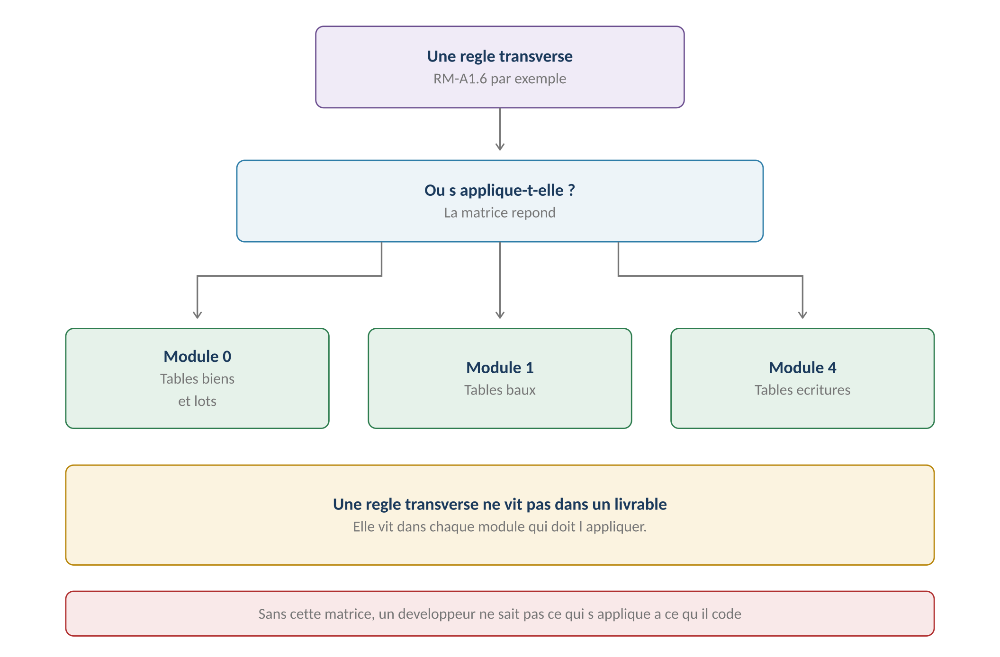
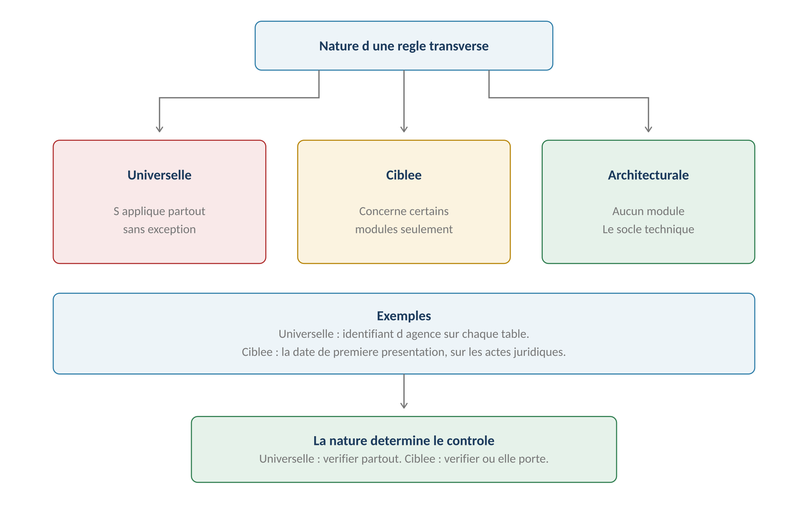
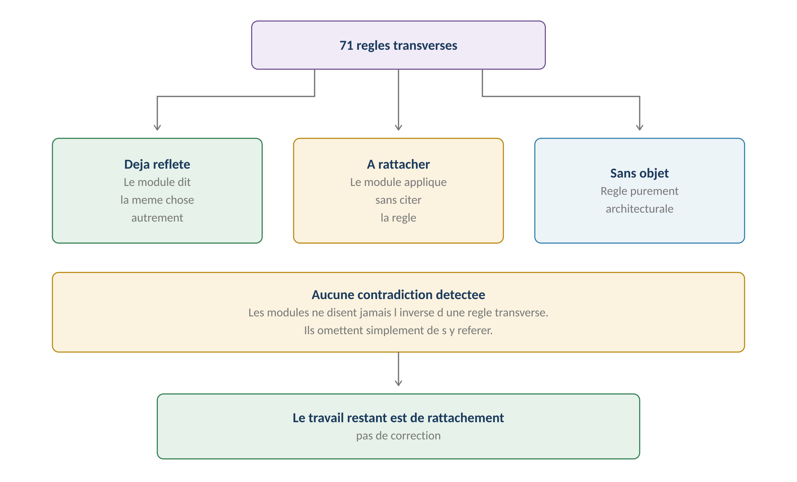
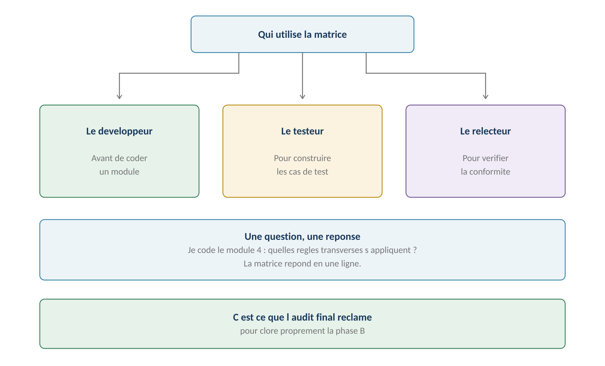

**GERIMMO V3**

Clôture de la phase B

**MATRICE**

**Traçabilité transverse**

|             |                                                          |
|:------------|:---------------------------------------------------------|
| **Origine** | **Audit final — clôture de la phase B**                  |
| **Objet**   | Où chacune des 71 règles transverses s'applique          |
| **Constat** | **Aucune contradiction — un défaut de rattachement**     |
| **Usage**   | **Document de travail du développement**                 |
| **Portée**  | Les six livrables A croisés avec les vingt-trois modules |

> **Pourquoi cette matrice**
>
> **Ce que l'audit final demande**
>
> Les corrections de phase B doivent être terminées et propagées dans les modules
>
> concernés, afin que les livrables transverses et les règles locales
>
> ne divergent plus.
>
> Ce document vérifie cette propagation, règle par règle.

**Le constat**

------------------------------------------------------------------------

| **Élément**                         | **Nombre** |
|:------------------------------------|:-----------|
| **Règles transverses définies**     | **71**     |
| **Règles citées dans un module**    | **3**      |
| **Contradictions détectées**        | **Aucune** |
| **Règles à rattacher**              | **38**     |
| **Règles purement architecturales** | **30**     |

> **Le problème n'est pas ce qu'on a écrit**
>
> Aucun module ne contredit une règle transverse. Le module 12 ne prétend plus
>
> que la trace GED prouve un envoi ; le module 4 assume le déclaratif ;
>
> le module 20 ne modifie plus la production.
>
> Le problème est qu'un développeur qui ouvre le module 4 pour coder
>
> la comptabilité ne sait pas que douze règles du livrable A6 s'y appliquent.

**Le sens de lecture**

------------------------------------------------------------------------

*Schéma 1 — Une règle transverse vit dans les modules qui l'appliquent*

> **La méthode**

**Les trois natures de règle**

------------------------------------------------------------------------

*Schéma 2 — La nature détermine le contrôle à faire*

| **Nature** | **Définition** | **Où la vérifier** |
|:---|:---|:---|
| **Universelle** | S'applique partout, sans exception | **Chaque module et chaque table** |
| **Ciblée** | Concerne certains modules identifiés | Les modules listés |
| **Architecturale** | Relève du socle, pas d'un parcours | Le lot 0 seulement |

**Les trois états de propagation**

------------------------------------------------------------------------

*Schéma 3 — Le travail restant est de rattachement, pas de correction*

| **État** | **Signification** | **Action** |
|:---|:---|:---|
| **Reflété** | Le module dit la même chose autrement | Rien |
| **À rattacher** | Le module applique sans citer la règle | Ajouter la référence |
| **Sans objet** | Règle purement architecturale | Rien |

**À quoi elle sert**

------------------------------------------------------------------------

*Schéma 4 — Une question, une réponse*

> **A1 — Modèle d'identité**

| **Règle**    | **Nature**      | **Modules concernés** | **État**            |
|:-------------|:----------------|:----------------------|:--------------------|
| **RM-A1.1**  | Universelle     | 0b, 16, 18            | Reflété — 0b        |
| **RM-A1.2**  | Architecturale  | Lot 0                 | Sans objet          |
| **RM-A1.3**  | Ciblée          | 16, 18                | À rattacher         |
| **RM-A1.4**  | Ciblée          | 0b, 16                | Reflété — RM-16.4.2 |
| **RM-A1.5**  | Ciblée          | 18                    | À rattacher         |
| **RM-A1.6**  | **Universelle** | **Tous les modules**  | **À rattacher**     |
| **RM-A1.7**  | Architecturale  | Lot 0                 | Sans objet          |
| **RM-A1.8**  | Ciblée          | 8, 11                 | Reflété — RM-8.5.2  |
| **RM-A1.9**  | Ciblée          | 8                     | À rattacher         |
| **RM-A1.10** | Ciblée          | 0b, 12                | Reflété — RM-0b.7.3 |
| **RM-A1.11** | Ciblée          | 18                    | Reflété — RM-18.5.1 |
| **RM-A1.12** | Architecturale  | Lot 0                 | Sans objet          |

> **La règle la plus lourde de conséquences**
>
> RM-A1.6 — toute table de données d'agence porte un identifiant d'agence —
>
> concerne littéralement chaque module.
>
> Elle ne peut pas être rattachée à un parcours : elle conditionne
>
> chaque écriture de code touchant une donnée métier.
>
> C'est une règle à faire figurer dans les conventions de développement,
>
> pas dans un module.
>
> **A2 — Conservation et RGPD**

| **Règle**    | **Nature**     | **Modules concernés** | **État**            |
|:-------------|:---------------|:----------------------|:--------------------|
| **RM-A2.1**  | Universelle    | 0b, 12, 18            | À rattacher         |
| **RM-A2.2**  | Universelle    | 0b, 8, 12, 18         | Reflété — corrigé   |
| **RM-A2.3**  | Ciblée         | 0b, 12                | À rattacher         |
| **RM-A2.4**  | Ciblée         | 0b, 12, 18            | Reflété — RM-18.4.4 |
| **RM-A2.5**  | Architecturale | Lot 0                 | Sans objet          |
| **RM-A2.6**  | Ciblée         | 18, 20                | Reflété — 20        |
| **RM-A2.7**  | Ciblée         | 0b, 3, 12             | Reflété — RM-0b.8.3 |
| **RM-A2.8**  | Architecturale | Contrat               | Sans objet          |
| **RM-A2.9**  | Ciblée         | 8, 11                 | À rattacher         |
| **RM-A2.10** | Architecturale | Procédure             | Sans objet          |
| **RM-A2.11** | Ciblée         | 11                    | **À rattacher**     |

> **Une règle à rattacher en priorité**
>
> RM-A2.11 qualifie la contestation de note du module 11 comme l'exercice
>
> du droit à l'intervention humaine.
>
> Le module 11 décrit bien le mécanisme, mais ne le présente pas comme un droit.
>
> Or cette qualification impose une obligation d'information envers l'artisan.
>
> **A3 — Documents, canaux et preuve**

| **Règle**    | **Nature**      | **Modules concernés** | **État**             |
|:-------------|:----------------|:----------------------|:---------------------|
| **RM-A3.1**  | Universelle     | 1, 2, 3, 12           | Reflété — 12 corrigé |
| **RM-A3.2**  | **Universelle** | 12                    | Reflété — RM-12.4.4  |
| **RM-A3.3**  | Ciblée          | 1, 2, 3               | À rattacher          |
| **RM-A3.4**  | Ciblée          | 1, 2, 3, 12           | Reflété — RM-12.4.5  |
| **RM-A3.5**  | Ciblée          | 1, 2                  | **À rattacher**      |
| **RM-A3.6**  | Ciblée          | 1, 2, 3, 14           | À rattacher          |
| **RM-A3.7**  | Ciblée          | 1, 13                 | Reflété — RM-13.1.6  |
| **RM-A3.8**  | Ciblée          | 3, 6, 9, 12           | Reflété              |
| **RM-A3.9**  | Ciblée          | 6, 12                 | Reflété              |
| **RM-A3.10** | Ciblée          | 1, 2, 3, 12           | Reflété — RM-12.4.3  |
| **RM-A3.11** | Ciblée          | 6, 12                 | À rattacher          |

> **La règle la plus importante à rattacher**
>
> RM-A3.5 — c'est la première présentation qui fait courir le délai —
>
> touche directement les modules 1 et 2.
>
> Le module 1 parle de « réception du congé », le module 2 de « remise des clés ».
>
> Aucun des deux n'introduit le champ « date de première présentation »
>
> que la règle impose.
>
> C'est le rattachement le plus concret de cette matrice.
>
> **A4 — Socle sécurité**

| **Règle** | **Nature** | **Modules concernés** | **État** |
|:---|:---|:---|:---|
| **RM-A4.1** | Ciblée | 18 | À rattacher |
| **RM-A4.2** | Ciblée | 18 | À rattacher |
| **RM-A4.3** | Ciblée | 16 | À rattacher |
| **RM-A4.4** | Architecturale | Lot 0 | Sans objet |
| **RM-A4.5** | Architecturale | Lot 0 | Sans objet |
| **RM-A4.6** | Architecturale | Lot 0 | Sans objet |
| **RM-A4.7** | Architecturale | Lot 0 | Sans objet |
| **RM-A4.8** | **Universelle** | **0, 0b, 0c, 8, 9, 12, 19, 20** | **À rattacher** |
| **RM-A4.9** | Universelle | Idem RM-A4.8 | À rattacher |
| **RM-A4.10** | Ciblée | 12 | À rattacher |
| **RM-A4.11** | Architecturale | Lot 0 | Sans objet |
| **RM-A4.12** | Architecturale | Procédure | Sans objet |
| **RM-A4.13** | Architecturale | Contrat | Sans objet |
| **RM-A4.14** | Architecturale | Procédure | Sans objet |

> **L'analyse antivirus touche huit modules**
>
> RM-A4.8 impose une analyse de tout fichier déposé.
>
> Huit modules permettent un dépôt : diagnostics, pièces de dossier,
>
> appels de charges, attestations artisan, devis, factures, documents,
>
> photos mobiles et captures de bugs.
>
> Aucun ne mentionne l'analyse. C'est le rattachement le plus dispersé.
>
> **A5 — États et événements**

| **Règle**    | **Nature**      | **Modules concernés**         | **État**        |
|:-------------|:----------------|:------------------------------|:----------------|
| **RM-A5.1**  | **Universelle** | **0, 1, 5, 7, 9, 10, 13, 14** | **À rattacher** |
| **RM-A5.2**  | Universelle     | Idem RM-A5.1                  | À rattacher     |
| **RM-A5.3**  | Ciblée          | 1, 3, 4, 5, 6, 9              | **À rattacher** |
| **RM-A5.4**  | Architecturale  | Lot 0                         | Sans objet      |
| **RM-A5.5**  | Ciblée          | 13, 16, 18                    | À rattacher     |
| **RM-A5.6**  | Architecturale  | Lot 0                         | Sans objet      |
| **RM-A5.7**  | Architecturale  | Lot 0                         | Sans objet      |
| **RM-A5.8**  | Architecturale  | Lot 0                         | Sans objet      |
| **RM-A5.9**  | Ciblée          | 18                            | À rattacher     |
| **RM-A5.10** | Architecturale  | Lot 0                         | Sans objet      |
| **RM-A5.11** | Ciblée          | 14, 18                        | À rattacher     |

> **La règle qui protège la cohérence**
>
> RM-A5.3 — les effets immédiats d'une transition réussissent ensemble —
>
> concerne six modules.
>
> Le cas le plus visible est la signature d'un bail : lot en loué,
>
> échéancier créé, alerte d'EDL programmée, document archivé.
>
> Le module 1 les décrit comme quatre conséquences, sans dire
>
> qu'elles forment une transaction unique.
>
> **A6 — Doctrine financière**

| **Règle**    | **Nature** | **Modules concernés** | **État**            |
|:-------------|:-----------|:----------------------|:--------------------|
| **RM-A6.1**  | Ciblée     | 4                     | Reflété — RM-4.0.1  |
| **RM-A6.2**  | Ciblée     | 3, 4                  | **À rattacher**     |
| **RM-A6.3**  | Ciblée     | 4                     | **À rattacher**     |
| **RM-A6.4**  | Ciblée     | 4                     | Reflété — RM-4.4.3  |
| **RM-A6.5**  | Ciblée     | 4                     | À rattacher         |
| **RM-A6.6**  | Ciblée     | 4                     | À rattacher         |
| **RM-A6.7**  | Ciblée     | 3                     | Reflété — RM-3.3.2  |
| **RM-A6.8**  | Ciblée     | 3, 4                  | Reflété             |
| **RM-A6.9**  | Ciblée     | 4                     | **À rattacher**     |
| **RM-A6.10** | Ciblée     | 4, 18                 | Reflété — RM-18.4.2 |
| **RM-A6.11** | Ciblée     | 4                     | À rattacher         |
| **RM-A6.12** | Ciblée     | 4, 16, 18             | Reflété — RM-4.0.2  |

> **Trois règles qui durcissent le module 4**
>
> RM-A6.3 étend l'immutabilité avant la clôture — le module 4 ne la pose
>
> qu'après.
>
> RM-A6.9 précise qu'une réouverture ne rend pas les écritures modifiables.
>
> RM-A6.2 pose la primauté du relevé bancaire, absente du module 4.
>
> Ces trois rattachements sont les plus structurants de la matrice.
>
> **Vue par module**
>
> **Le sens de lecture du développeur**
>
> Un développeur qui ouvre un module veut savoir quelles règles transverses
>
> s'y appliquent. Ce tableau répond dans ce sens.

| **Module** | **Règles transverses applicables** | **Nombre** |
|:---|:---|:---|
| **0 — Biens et lots** | A1.6, A4.8, A4.9, A5.1, A5.2 | **5** |
| **0b — Dossier locataire** | A1.1, A1.4, A1.6, A1.10, A2.1, A2.3, A2.7, A4.8, A4.9 | **9** |
| **0c — Copropriété** | A1.6, A4.8, A4.9 | **3** |
| **1 — Bail** | **A1.6, A3.1, A3.3, A3.4, A3.5, A3.6, A3.7, A3.10, A5.1, A5.2, A5.3** | **11** |
| **2 — Garanties** | A1.6, A3.1, A3.3, A3.4, A3.5, A3.6, A3.10 | **7** |
| **3 — Loyers** | **A1.6, A2.7, A3.1, A3.3, A3.4, A3.6, A3.8, A3.10, A5.3, A6.2, A6.7, A6.8** | **12** |
| **4 — Comptabilité** | **A1.6, A5.3, A6.1 à A6.12** | **14** |
| **5 — Mandat** | A1.6, A5.1, A5.2, A5.3 | **4** |
| **6 — Rapport** | A1.6, A3.8, A3.9, A3.11, A5.3 | **5** |
| **7 — Incidents** | A1.6, A5.1, A5.2 | **3** |
| **8 — Artisans** | A1.6, A1.8, A1.9, A2.2, A2.9, A4.8, A4.9 | **7** |
| **9 — Devis** | A1.6, A3.8, A4.8, A4.9, A5.1, A5.2, A5.3 | **7** |
| **10 — Rendez-vous** | A1.6, A5.1, A5.2 | **3** |
| **11 — Notation** | A1.6, A1.8, A2.9, A2.11 | **4** |
| **12 — Documents** | **A1.6, A1.10, A2.1, A2.3, A2.4, A3.1, A3.2, A3.4, A3.8 à A3.11, A4.8, A4.9, A4.10** | **15** |
| **13 — Signature** | A1.6, A3.7, A5.1, A5.2, A5.5 | **5** |
| **14 — Alertes** | A1.6, A3.6, A5.1, A5.2, A5.11 | **5** |
| **15 — Messagerie** | A1.6, A2.1 | **2** |
| **16 — Onboarding** | A1.1, A1.3, A1.4, A1.6, A4.3, A5.5, A6.12 | **7** |
| **17 — Marque blanche** | A1.6 | **1** |
| **18 — Administration** | **A1.1, A1.3, A1.5, A1.6, A1.11, A2.1, A2.2, A2.4, A2.6, A4.1, A4.2, A5.5, A5.9, A5.11, A6.10, A6.12** | **16** |
| **19 — Mobile** | A1.6, A4.8, A4.9 | **3** |
| **20 — Retours** | A1.6, A2.1, A2.6, A4.8, A4.9 | **5** |

> **Les quatre modules les plus contraints**
>
> Le module 18 avec seize règles, le module 12 avec quinze,
>
> le module 4 avec quatorze et le module 3 avec douze.
>
> Ce sont les modules à coder avec la matrice sous les yeux.
>
> **Les rattachements prioritaires**
>
> **Ce qu'il reste à faire, par ordre d'importance**
>
> Aucun de ces rattachements n'est une correction : les modules ne contredisent
>
> pas les livrables.
>
> Il s'agit d'ajouter des références pour qu'un développeur sache
>
> ce qui s'applique à ce qu'il code.

**Rang 1 — Les plus concrets**

------------------------------------------------------------------------

| **Règle** | **Module** | **Ce qu'il faut ajouter** |
|:---|:---|:---|
| **RM-A3.5** | 1 et 2 | **Le champ « date de première présentation »** |
| **RM-A6.3** | 4 | **L'immutabilité avant clôture, pas seulement après** |
| **RM-A6.9** | 4 | **La réouverture ne rend pas modifiable** |
| **RM-A6.2** | 3 et 4 | **La primauté du relevé bancaire** |
| **RM-A4.8** | Huit modules | **L'analyse antivirus au dépôt** |

**Rang 2 — Les structurants**

------------------------------------------------------------------------

| **Règle** | **Module** | **Ce qu'il faut ajouter** |
|:---|:---|:---|
| **RM-A5.3** | 1, 3, 4, 5, 6, 9 | La transaction unique des effets immédiats |
| **RM-A5.1 et A5.2** | Huit modules | Le renvoi au registre des transitions |
| **RM-A2.11** | 11 | La contestation comme droit à l'intervention humaine |
| **RM-A4.1 et A4.2** | 18 | Le MFA par rôle |
| **RM-A1.3 et A1.5** | 16 et 18 | L'adhésion porte le rôle |

**Rang 3 — Les confirmations**

------------------------------------------------------------------------

| **Règle** | **Module** | **Ce qu'il faut ajouter** |
|:---|:---|:---|
| **RM-A1.9** | 8 | Les trois états du SIRET |
| **RM-A2.1 et A2.3** | 0b et 12 | Le rattachement à une finalité écrite |
| **RM-A2.9** | 8 et 11 | Les durées des données artisan |
| **RM-A3.3 et A3.6** | 1, 2, 3 | Le canal légal et le calcul des délais |
| **RM-A4.10** | 12 | Aucun accès direct par URL |
| **RM-A6.5, A6.6, A6.11** | 4 | Le détail des contre-écritures et de l'export |

> **Synthèse**

**Le bilan**

------------------------------------------------------------------------

| **Livrable** | **Règles** | **Reflétées** | **À rattacher** | **Architecturales** |
|:---|:---|:---|:---|:---|
| **A1 — Identité** | 12 | 5 | 4 | 3 |
| **A2 — RGPD** | 11 | 4 | 4 | 3 |
| **A3 — Preuve** | 11 | 7 | 4 | 0 |
| **A4 — Sécurité** | 14 | 0 | 6 | 8 |
| **A5 — États** | 11 | 0 | 5 | 6 |
| **A6 — Financier** | 12 | 6 | 6 | 0 |
| **TOTAL** | **71** | **22** | **29** | **20** |

> **Ce que le bilan dit**
>
> Vingt-deux règles sont déjà reflétées dans les modules, souvent sous
>
> une autre formulation.
>
> Vingt-neuf demandent un rattachement — une référence à ajouter,
>
> parfois un champ ou une précision.
>
> Vingt relèvent du socle technique et n'ont pas vocation à figurer
>
> dans un module métier.

**Ce que cette matrice permet**

------------------------------------------------------------------------

| **Usage** | **Bénéfice** |
|:---|:---|
| **Avant de coder un module** | Savoir quelles règles transverses s'appliquent |
| **Pour construire les tests** | **Chaque règle devient un cas de test** |
| **Pour la revue de code** | Vérifier la conformité aux fondations |
| **Pour l'audit externe** | Montrer que rien n'est laissé au hasard |
| **Pour arbitrer un doute** | Trouver la règle qui fait autorité |

**Ce qui reste ouvert**

------------------------------------------------------------------------

| **Point** | **Décision attendue** |
|:---|:---|
| **Le lien sécurisé ponctuel** | Réutiliser le mécanisme Yousign pour d'autres usages ? |
| **Le format d'export** | Colonnes exactes, séparateur, encodage |
| **Le service antivirus** | Choix du prestataire — entre dans A4 |
| **Le calendrier du lot 0** | **Quand démarrer l'architecture** |

**La phase B est close**

------------------------------------------------------------------------

> **Ce qui est achevé**
>
> Les incohérences signalées par les trois audits sont corrigées.
>
> Les six fondations sont écrites.
>
> La propagation est cartographiée règle par règle.
>
> Ce qui reste — les vingt-neuf rattachements — relève du travail
>
> de développement, avec cette matrice comme guide.
>
> Le référentiel peut être confié à une équipe technique.
