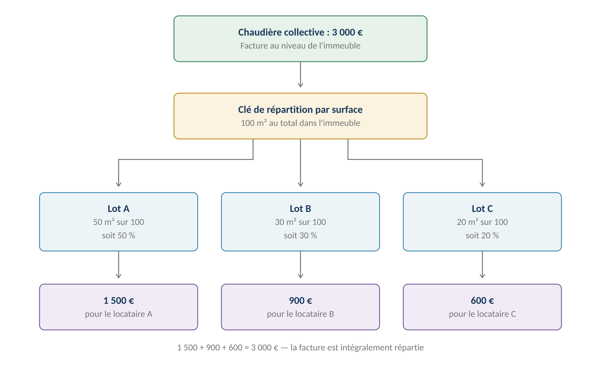
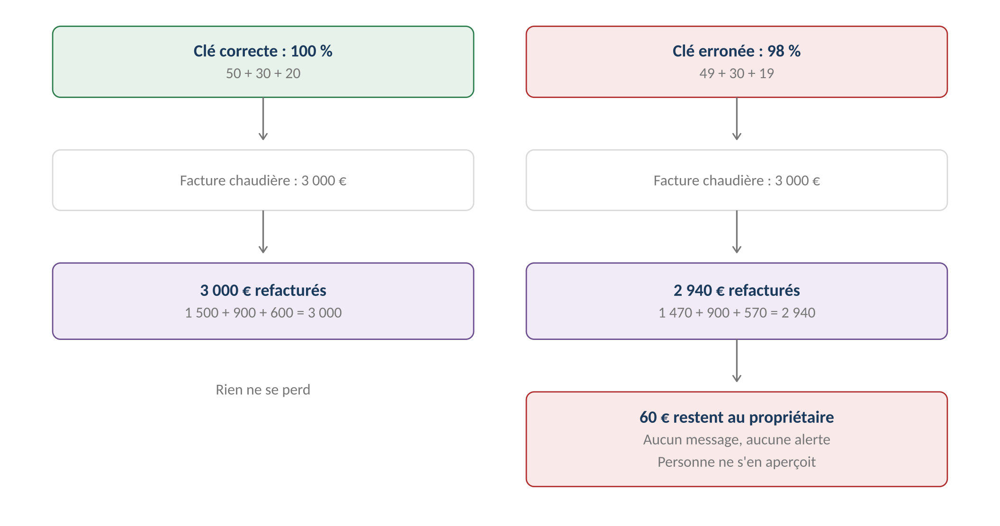
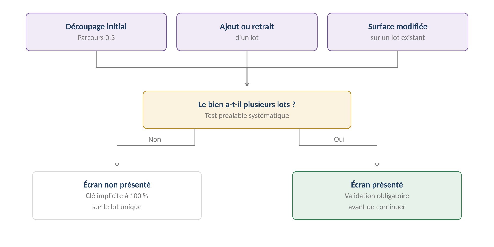
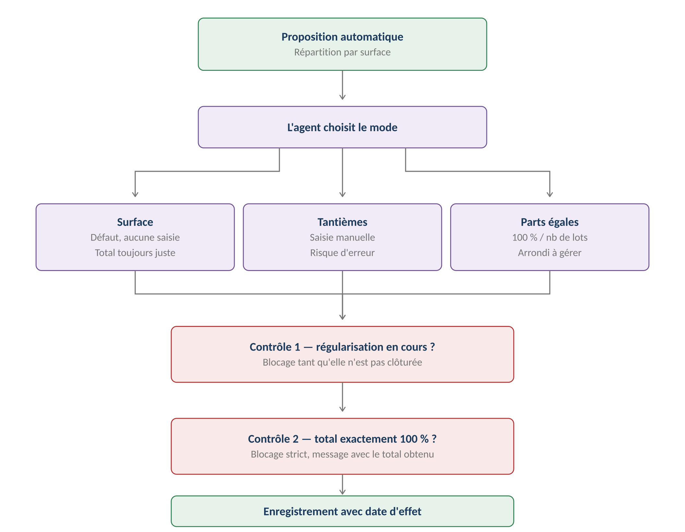
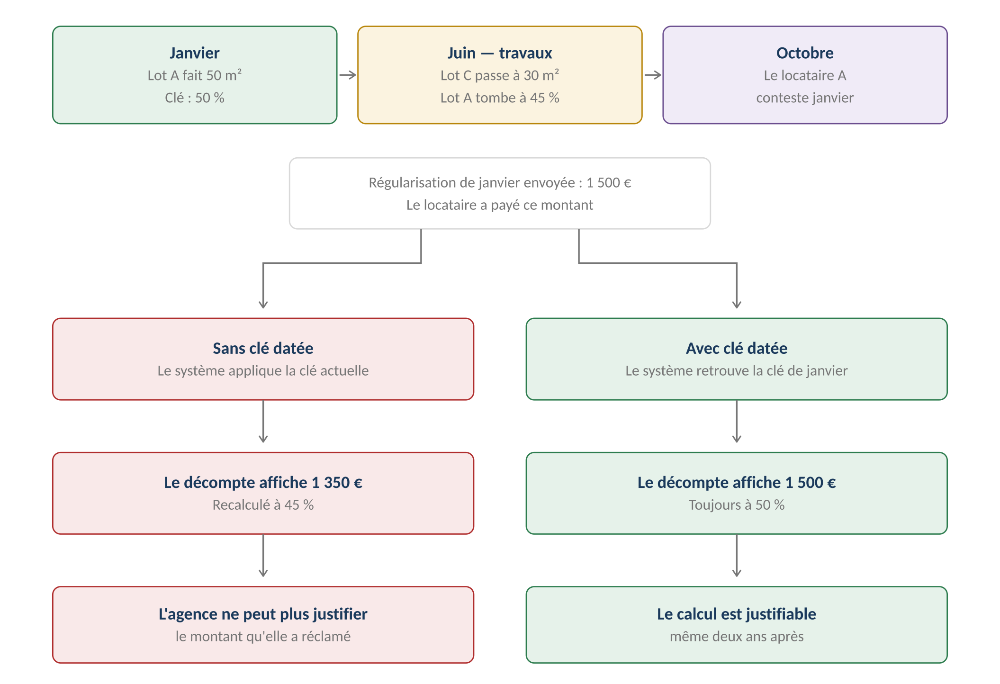
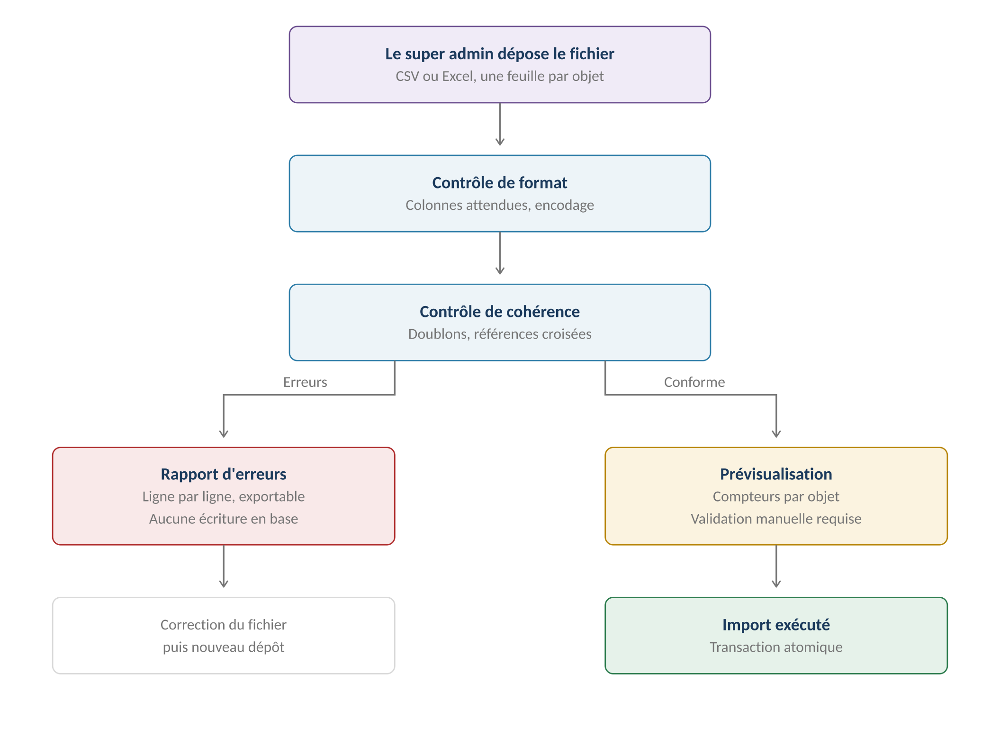

**GERIMMO V3**

Référentiel des parcours clients

**MODULE 0**

**Biens et lots**

|                 |                                                        |
|:----------------|:-------------------------------------------------------|
| **Périmètre**   | 11 parcours · 5 objets métier                          |
| **Dépendances** | Aucune — module racine du système                      |
| **Impacte**     | Bail · Mandat · Comptabilité · Incidents · Copropriété |
| **Criticité**   | **MAXIMALE — socle de toute la donnée**                |
| **Statut**      | Version de travail — à annoter et renvoyer             |

> **Comment lire ce document**

**Code couleur**

------------------------------------------------------------------------

| **Élément** | **Signification** |
|:---|:---|
| **Titre sur fond bleu nuit** | Section principale du document |
| **Encadré bleu** | Information structurante, modèle, principe |
| **Encadré vert** | Recommandation retenue pour la V1 |
| **Encadré ambre** | Point de décision à trancher de votre côté |
| **Encadré rouge** | Risque, blocage, ou règle critique |
| **Encadré violet** | User story et ses critères d'acceptation |
| **RM-0.x.x** | Règle métier codée, référençable en développement |

**Personas**

------------------------------------------------------------------------

> **Correction importante — deux propriétaires distincts**
>
> Le référentiel confondait jusqu'ici deux rôles sous le libellé « propriétaire bailleur ».
>
> Ce sont deux personas séparés, aux droits opposés — voir le tableau ci-dessous.

| **Code** | **Persona** | **Rôle dans ce module** |
|:---|:---|:---|
| SA | Super admin | Aucun rôle direct |
| AA | Admin agence | Réactivation d'un bien archivé |
| AG | Agent immobilier | **Acteur principal — 10 parcours sur 10** |
| **PM** | **Propriétaire mandant** | **AUCUN accès à l'app — reçoit des documents** |
| **PD** | **Propriétaire gestion directe** | Accès complet — gère seul, sans agence |
| LO | Locataire | Aucun rôle direct |
| AR | Artisan | Aucun rôle direct |

**Distinguer les deux propriétaires**

|  | **Propriétaire mandant (PM)** | **Propriétaire gestion directe (PD)** |
|:---|:---|:---|
| **Relation** | Signe un mandat avec une agence | Aucune agence |
| **Accès à l'app** | **AUCUN** | **Complet** |
| **Qui saisit ?** | L'agent immobilier | Lui-même |
| **Comment il sait ?** | Rapports et documents envoyés | Il consulte directement |
| **Dans le module 0** | Objet de données uniquement | Reprend les parcours de l'agent |

> **Conséquence sur ce module**
>
> Le parcours 0.11 « Consultation de son patrimoine » a été SUPPRIMÉ.
>
> Il supposait un accès du propriétaire mandant, ce qui contredit la décision actée.
>
> Le module 0 passe donc de 11 à 10 parcours.
>
> Le propriétaire en gestion directe reste dans le référentiel : ses parcours propres
>
> (bail, quittances, impayés, IRL, régularisations, EDL) restent à créer dans les modules 1 à 4.

**Structure de chaque parcours**

------------------------------------------------------------------------

> **Chaque parcours est décrit selon la même trame**
>
> 1\. Fiche d'identité — persona, déclencheur, fréquence, criticité
>
> 2\. Parcours nominal — le déroulé pas à pas, acteur par acteur
>
> 3\. Variantes — les chemins alternatifs légitimes
>
> 4\. Cas d'erreur — ce qui doit être bloqué et comment
>
> 5\. Règles métier — codées RM-x.x.x pour le développement
>
> 6\. User stories — avec critères d'acceptation Given/When/Then
>
> **Vue d'ensemble du module**
>
> **Principe fondateur**
>
> Le bail porte toujours sur un LOT, jamais sur un bien.
>
> Un bien non découpé possède automatiquement un lot unique créé à sa création.
>
> Cette règle rend le multi-lots invisible dans les 90 % de cas simples.
>
> **Décision structurante — la propriété est au niveau LOT**
>
> Le rattachement propriétaire se fait sur le lot, pas sur le bien.
>
> Un immeuble peut donc avoir des lots appartenant à des propriétaires différents,
>
> ce qui est le cas courant en copropriété.

**Objets créés dans ce module**

------------------------------------------------------------------------

| **Objet** | **Description** | **Rattaché à** |
|:---|:---|:---|
| **Bien** | Unité physique : immeuble, maison, appartement | — |
| **Lot** | Unité locative — porte le bail et la propriété | Bien |
| **Diagnostic** | Document réglementaire daté | Bien ou Lot |
| **Équipement** | Chauffage, eau chaude, cuisine, extérieur | Lot |
| **Détention** | **Lien propriétaire ↔ LOT avec quote-part** | **Lot** |

**Modèle conceptuel — qui porte quoi**

------------------------------------------------------------------------

| **Niveau** | **Porte** | **Ne porte jamais** |
|:---|:---|:---|
| **BIEN** | Adresse · Clé de répartition · Diagnostics communs (amiante PC, ERP, termites) · Copropriété | Propriétaire · Bail · Loyer |
| **LOT** | **Propriétaires · Bail · Loyer · Diagnostics privatifs · Équipements · Mandat** | Clé de répartition |
| **PROPRIÉTAIRE** | Quote-part de détention sur chaque lot | Rattachement direct au bien |

> **Ce que la bascule change concrètement**
>
> Un immeuble de 3 lots peut avoir 3 propriétaires différents, chacun avec son mandat.
>
> La facture de chaudière collective, saisie une seule fois au niveau du bien,
>
> devra apparaître dans 3 rapports de gestion distincts, pour la part de chacun.
>
> Le module 0 se contente de porter la donnée. La ventilation multi-propriétaires
>
> est traitée aux modules 4 (comptabilité), 5 (mandat) et 6 (rapport).

*Schéma 1 — Le bien porte la clé et les diagnostics communs ; chaque lot porte son bail et ses propres propriétaires*

**Machine à états — Lot**

------------------------------------------------------------------------

| **État** | **Signification** | **Transitions possibles** |
|:---|:---|:---|
| **brouillon** | Créé, incomplet | → disponible (si champs + diagnostics OK) |
| **disponible** | Prêt à être loué | → loué · → archivé |
| **loué** | Bail actif en cours | → préavis · → disponible |
| **préavis** | Bail en cours de résiliation | → disponible · → loué |
| **archivé** | Sorti du parc géré | → disponible (AA uniquement) |

**Cartographie des 11 parcours**

------------------------------------------------------------------------

| **\#** | **Parcours** | **Persona** | **V1 / V2** | **Criticité** |
|:---|:---|:---|:---|:---|
| 0.1 | Création d'un bien | AG | **V1** | Haute |
| 0.2 | Rattachement propriétaires aux lots | AG | **V1** | Haute |
| 0.3 | Découpage en lots | AG | **V1** | Haute |
| 0.4 | Clé de répartition des charges | AG | **V1** | **MAXIMALE** |
| 0.5 | Création / modification d'un lot | AG | **V1** | Moyenne |
| 0.6 | Diagnostics niveau bien | AG | **V1** | Haute |
| 0.7 | Diagnostics niveau lot | AG | **V1** | Haute |
| 0.8 | Alerte d'expiration diagnostic | Système | **V1** | Haute |
| 0.9 | Sortie du parc géré | AG | **V1** | Moyenne |
| 0.10 | Vente d'un bien occupé | AG | **V2** | Moyenne |
| 0.11 | **Consultation du patrimoine — SUPPRIMÉ** | — | — | — |
| **0.12** | **Import en masse du parc** | SA | **V1** | **MAXIMALE** |

> **0.1 — Création d'un bien**

|                 |                                                     |
|:----------------|:----------------------------------------------------|
| **Persona**     | AG — Agent immobilier                               |
| **Déclencheur** | Un propriétaire confie un bien à l'agence           |
| **Fréquence**   | Quelques fois par mois                              |
| **Criticité**   | Haute — porte d'entrée de toute la donnée           |
| **Aboutit à**   | Un bien en état brouillon + un lot unique auto-créé |

**Parcours nominal**

------------------------------------------------------------------------

| **\#** | **Acteur** | **Action** | **Écran / état** |
|:---|:---|:---|:---|
| 1 | AG | Clique « Nouveau bien » depuis la liste des biens | Liste → formulaire |
| 2 | AG | Saisit l'adresse | Autocomplétion API Adresse |
| 3 | **Système** | Vérifie l'absence de doublon sur l'adresse normalisée | Alerte non bloquante |
| 4 | AG | Renseigne type, année de construction, surface totale | Formulaire |
| 5 | AG | Indique si le bien est en copropriété | Case à cocher |
| 6 | AG | Valide | — |
| 7 | **Système** | Crée le bien en état brouillon | — |
| 8 | **Système** | **Crée automatiquement un lot unique** | Lot \#1 en brouillon |
| 9 | **Système** | Redirige vers l'onglet Propriétaires | Fiche bien |

**Variantes**

------------------------------------------------------------------------

| **Code** | **Situation** | **Comportement** |
|:---|:---|:---|
| **V1** | Doublon détecté (étape 3) | Message « Un bien existe déjà à cette adresse : \[lien\] ». L'agent peut poursuivre ou rejoindre le bien existant. |
| **V2** | Bien en copropriété (étape 5) | Enchaîne sur le parcours 0c.1 après l'étape 9. |
| **V3** | Création depuis un import | Le bien arrive en brouillon via le parcours 16.3, sans passer par ce formulaire. |

**Cas d'erreur**

------------------------------------------------------------------------

| **Cas** | **Comportement attendu** |
|:---|:---|
| Adresse introuvable dans l'API | Saisie manuelle autorisée, drapeau « adresse non vérifiée » |
| Perte de connexion pendant la saisie | Brouillon local restauré au retour |
| Surface totale à 0 ou vide | **BLOCAGE — la surface conditionne la clé de répartition** |

**Règles métier**

------------------------------------------------------------------------

> **RM-0.1.1** — L'adresse normalisée + le complément constituent la clé d'unicité fonctionnelle (non bloquante).
>
> **RM-0.1.2** — Tout bien créé génère systématiquement un lot. Un bien sans lot est impossible.
>
> **RM-0.1.3** — Le lot auto-créé porte le nom « Lot unique » et hérite de la surface du bien.
>
> **RM-0.1.4** — Un bien reste en brouillon tant qu'aucun de ses lots n'a de propriétaire.
>
> **RM-0.1.5** — Le type de bien conditionne les diagnostics obligatoires (voir 0.7).
>
> **RM-0.1.6** — La zone tendue est déduite du code postal à la création, et reste surchargeable par l'agent.
>
> **RM-0.1.7** — Un changement de zonage par décret ne modifie jamais les baux déjà signés.

**Champs du formulaire**

------------------------------------------------------------------------

| **Champ** | **Type** | **Oblig.** | **Règle** |
|:---|:---|:---|:---|
| Adresse | Texte + autocomplétion | **Oui** | — |
| Complément d'adresse | Texte | Non | Bâtiment, escalier |
| Code postal / Ville | Texte | **Oui** | Auto-rempli, non modifiable |
| Type de bien | Liste | **Oui** | Conditionne les diagnostics |
| Année de construction | Entier | Non | Conditionne plomb (\< 1949) et amiante (\< 1997) |
| Surface totale | Décimal | **Oui** | En m², strictement \> 0 |
| En copropriété | Booléen | **Oui** | Défaut : non |
| **Zone tendue** | Booléen | **Auto** | **Déduite du code postal, surchargeable** |
| Référence interne | Texte | Non | Libre, pour reprise d'ancien logiciel |

**User stories**

------------------------------------------------------------------------

> **US-0.1.1**
>
> *En tant qu'agent immobilier, je veux créer un bien en saisissant son adresse avec autocomplétion, afin d'éviter les erreurs de saisie et les doublons.*

- **Étant donné** que je saisis au moins 3 caractères dans le champ adresse, **quand** j'attends la réponse, **alors** une liste de suggestions normalisées s'affiche

- **Étant donné** que je sélectionne une suggestion, **quand** elle est appliquée, **alors** code postal et ville sont remplis automatiquement et non modifiables

- **Étant donné** qu'aucune suggestion ne correspond, **quand** je clique sur « saisir manuellement », **alors** les champs deviennent libres et le bien est marqué « adresse non vérifiée »

> **US-0.1.2**
>
> *En tant qu'agent immobilier, je veux être averti si un bien existe déjà à la même adresse, afin de ne pas créer de doublon.*

- **Étant donné** qu'un bien actif existe à l'adresse normalisée saisie, **quand** je valide le formulaire, **alors** un message non bloquant affiche le bien existant avec un lien

- **Étant donné** que j'ai vu l'alerte doublon, **quand** je confirme la création, **alors** le bien est créé normalement

> **US-0.1.3**
>
> *En tant qu'agent immobilier, je veux qu'un lot soit créé automatiquement à la création d'un bien, afin de pouvoir louer immédiatement sans étape supplémentaire.*

- **Étant donné** que je crée un bien, **quand** la création aboutit, **alors** un lot « Lot unique » existe avec la surface du bien

- **Étant donné** qu'un bien n'a qu'un seul lot, **quand** je consulte sa fiche, **alors** l'interface n'affiche pas la notion de lot

> **0.2 — Rattachement des propriétaires aux lots**

|  |  |
|:---|:---|
| **Persona** | AG — Agent immobilier |
| **Déclencheur** | Suite immédiate de 0.1, création d'un lot, ou modification |
| **Fréquence** | À chaque nouveau lot |
| **Criticité** | Haute — conditionne le mandat, la compta et le rapport |
| **Aboutit à** | Un lot pouvant passer en disponible |

> **Le rattachement se fait lot par lot**
>
> Sur un bien à lot unique, l'agent ne voit qu'un seul écran et ne perçoit aucune différence.
>
> Sur un immeuble découpé, chaque lot reçoit ses propres propriétaires,
>
> qui peuvent différer d'un lot à l'autre.

**Parcours nominal**

------------------------------------------------------------------------

| **\#** | **Acteur** | **Action** | **Écran / état** |
|:---|:---|:---|:---|
| 1 | AG | Onglet « Propriétaires » de la fiche lot → « Ajouter » | Fiche lot |
| 2 | AG | Recherche une personne existante ou en crée une | Modale de recherche |
| 3 | AG | Saisit la quote-part (%) | Champ décimal |
| 4 | AG | Valide | — |
| 5 | **Système** | Vérifie que la somme des quotes-parts du lot ≤ 100 % | — |
| 6 | AG | Répète pour chaque indivisaire du lot | — |
| 7 | **Système** | À 100 %, le lot peut passer en disponible | — |
| 8 | AG | **Répète l'opération pour chaque lot du bien** | Fiche lot suivante |

**Variantes**

------------------------------------------------------------------------

| **Code** | **Situation** | **Comportement** |
|:---|:---|:---|
| **V1** | **Bien à lot unique — cas majoritaire** | L'onglet Propriétaires s'affiche sur la fiche bien. Quote-part pré-remplie à 100 %, champ masqué. |
| **V2** | **Immeuble, même propriétaire partout** | Bouton « Appliquer à tous les lots » après saisie sur le premier lot. Évite la saisie répétée. |
| **V3** | **Immeuble, propriétaires différents** | Saisie lot par lot. Chaque lot aura son propre mandat de gestion (module 5). |
| **V4** | Indivision sur un lot | Quotes-parts saisies. Aucune ventilation du rapport ni du récap fiscal (décision actée). |
| **V5** | Personne morale (SCI) | Champs SIRET et représentant légal apparaissent. |
| **V6** | Vente d'un lot | Voir parcours 0.10 (V2). |

**Cas d'erreur**

------------------------------------------------------------------------

| **Cas** | **Comportement attendu** |
|:---|:---|
| Somme des quotes-parts d'un lot \> 100 % | **BLOCAGE à la validation, message explicite** |
| Somme \< 100 % | Autorisé, lot maintenu en brouillon, badge « détention incomplète » |
| Suppression du dernier propriétaire d'un lot | **BLOCAGE si un mandat ou un bail actif existe** |
| Lot sans propriétaire dans un immeuble | Alerte sur la fiche bien : « 2 lots sur 3 ont un propriétaire » |

**Règles métier**

------------------------------------------------------------------------

> **RM-0.2.1** — La somme des quotes-parts d'un LOT ne peut excéder 100 %.
>
> **RM-0.2.2** — Un lot sans propriétaire à 100 % ne peut pas passer en disponible.
>
> **RM-0.2.3** — Le rattachement est daté (début, fin optionnelle) pour tracer les changements.
>
> **RM-0.2.4** — Un propriétaire retiré n'est jamais supprimé : sa date de fin est renseignée.
>
> **RM-0.2.5** — Le rattachement se fait au niveau LOT, jamais au niveau bien.
>
> **RM-0.2.6** — Deux lots d'un même bien peuvent avoir des propriétaires entièrement différents.
>
> **RM-0.2.7** — Sur un bien à lot unique, l'interface présente l'onglet Propriétaires au niveau du bien.
>
> **Pourquoi conserver l'historique de détention**
>
> Un rapport de gestion émis en mars 2025 doit continuer à mentionner le propriétaire de l'époque,
>
> même si le lot a changé de mains depuis. Supprimer le rattachement casserait tous les documents passés.
>
> **Ce que ça déclenche ailleurs**
>
> Module 5 — un mandat de gestion par propriétaire, portant sur ses lots uniquement.
>
> Module 4 — une dépense commune du bien doit être ventilée entre les propriétaires des lots.
>
> Module 6 — un rapport de gestion distinct par propriétaire, même pour un seul immeuble.

**User stories**

------------------------------------------------------------------------

> **US-0.2.1**
>
> *En tant qu'agent immobilier gérant un bien à lot unique, je veux rattacher un propriétaire en un clic depuis la fiche bien, afin de ne pas subir la complexité du multi-lots.*

- **Étant donné** un bien avec un seul lot, **quand** j'ouvre l'onglet Propriétaires, **alors** il s'affiche au niveau du bien et la notion de lot reste masquée

- **Étant donné** qu'aucun propriétaire n'est rattaché, **quand** j'en ajoute un, **alors** la quote-part vaut 100 % par défaut et le champ est masqué

> **US-0.2.2**
>
> *En tant qu'agent immobilier gérant un immeuble, je veux affecter des propriétaires différents à chaque lot, afin de gérer une copropriété où les appartements ont des propriétaires distincts.*

- **Étant donné** un immeuble découpé en 3 lots, **quand** j'ouvre l'onglet Propriétaires d'un lot, **alors** je saisis les propriétaires de ce lot uniquement

- **Étant donné** que le lot A appartient à une personne et le lot B à une autre, **quand** je consulte la fiche du bien, **alors** la liste des lots affiche le propriétaire de chacun

> **US-0.2.3**
>
> *En tant qu'agent immobilier, je veux appliquer le même propriétaire à tous les lots en une action, afin de ne pas ressaisir la même personne dix fois sur un immeuble mono-propriétaire.*

- **Étant donné** un immeuble de 10 lots appartenant tous à la même personne, **quand** je saisis le propriétaire sur le premier lot et clique « Appliquer à tous les lots », **alors** les 9 autres lots reçoivent le même rattachement à 100 %

- **Étant donné** qu'un lot a déjà un propriétaire différent, **quand** j'utilise « Appliquer à tous les lots », **alors** ce lot est exclu et un message m'indique lesquels ont été ignorés

> **US-0.2.4**
>
> *En tant qu'agent immobilier, je veux être bloqué si la somme des quotes-parts d'un lot dépasse 100 %, afin de garantir la cohérence de la détention.*

- **Étant donné** que la somme des quotes-parts du lot est de 60 %, **quand** je saisis 50 % pour un nouvel indivisaire, **alors** la validation est refusée avec le message « La somme ne peut dépasser 100 % (actuellement 60 %) »

> **US-0.2.5**
>
> *En tant qu'agent immobilier, je veux que le retrait d'un propriétaire conserve l'historique, afin que les rapports passés restent justes.*

- **Étant donné** qu'un propriétaire est rattaché à un lot depuis le 01/01/2024, **quand** je le retire au 30/06/2026, **alors** le rattachement est daté de fin et non supprimé

- **Étant donné** qu'un rapport a été généré en mars 2025, **quand** je le consulte après le retrait, **alors** il mentionne toujours le propriétaire de l'époque

> **0.3 — Découpage du bien en lots**

|  |  |
|:---|:---|
| **Persona** | AG — Agent immobilier |
| **Déclencheur** | Le bien comporte plusieurs unités locatives |
| **Fréquence** | Rare — environ 10 % des biens |
| **Criticité** | Haute — irréversible en pratique |
| **Aboutit à** | Plusieurs lots + obligation de valider la clé de répartition (0.4) |

**Parcours nominal**

------------------------------------------------------------------------

| **\#** | **Acteur** | **Action** | **Écran / état** |
|:---|:---|:---|:---|
| 1 | AG | Depuis la fiche bien, clique « Découper en lots » | Fiche bien |
| 2 | **Système** | Avertit : action irréversible si un lot est loué | Modale de confirmation |
| 3 | AG | Confirme | — |
| 4 | AG | Renomme le lot existant (« Lot unique » → « RDC gauche ») | Éditeur de lots |
| 5 | AG | Ajoute les lots supplémentaires (nom, surface, étage) | Éditeur de lots |
| 6 | **Système** | Contrôle somme des surfaces ≤ surface du bien | Alerte non bloquante |
| 7 | AG | Valide | — |
| 8 | **Système** | **Enchaîne obligatoirement sur 0.4** | Écran clé de répartition |
| 9 | **Système** | **Propage le propriétaire du lot d'origine aux nouveaux lots** | Modifiable ensuite en 0.2 |

> **Pourquoi propager le propriétaire automatiquement**
>
> Au découpage, les nouveaux lots héritent du propriétaire du lot d'origine.
>
> C'est le cas de loin le plus fréquent : un propriétaire découpe son propre immeuble.
>
> Si les lots doivent avoir des propriétaires différents, l'agent les modifie ensuite en 0.2.

**Variantes**

------------------------------------------------------------------------

| **Code** | **Situation** | **Comportement** |
|:---|:---|:---|
| **V1** | Découpage à la création | L'agent peut découper immédiatement après 0.1. |
| **V2** | Ajout d'un lot sur bien déjà découpé | Pas de confirmation. La clé est recalculée et doit être revalidée. Le nouveau lot n'a aucun propriétaire. |
| **V3** | Découpage avec un lot déjà loué | Le lot loué garde son bail. Nouveaux lots en brouillon. Alerte sur les régularisations en cours. |
| **V4** | **Lots destinés à des propriétaires différents** | Découpage puis modification lot par lot en 0.2. Un mandat par propriétaire sera nécessaire. |

**Cas d'erreur**

------------------------------------------------------------------------

| **Cas** | **Comportement attendu** |
|:---|:---|
| Somme des surfaces \> surface du bien | Alerte non bloquante — les parties communes ne sont pas comptées |
| Suppression d'un lot loué | **BLOCAGE strict** |
| Suppression d'un lot avec historique comptable | **BLOCAGE — archivage uniquement** |
| Nouveau lot ajouté sans propriétaire | Lot maintenu en brouillon, alerte sur la fiche bien |

**Règles métier**

------------------------------------------------------------------------

> **RM-0.3.1** — Un bien a au minimum un lot, toujours.
>
> **RM-0.3.2** — Un lot loué ou ayant un historique comptable ne peut être supprimé, seulement archivé.
>
> **RM-0.3.3** — Toute modification du nombre de lots impose une revalidation de la clé (0.4).
>
> **RM-0.3.4** — L'interface masque la notion de lot tant que le bien n'a qu'un lot unique.
>
> **RM-0.3.5** — La somme des surfaces des lots peut être inférieure à celle du bien, mais ne devrait pas la dépasser.
>
> **RM-0.3.6** — Au découpage, les nouveaux lots héritent du propriétaire du lot d'origine.
>
> **RM-0.3.7** — Un lot ajouté après le découpage initial n'hérite d'aucun propriétaire.
>
> **RM-0.3.8** — Un lot loué ne peut pas être redécoupé : il faut résilier, archiver, puis recréer.

**User stories**

------------------------------------------------------------------------

> **US-0.3.1**
>
> *En tant qu'agent immobilier, je veux découper un bien en lots, afin de gérer un immeuble dont les appartements sont loués séparément.*

- **Étant donné** un bien avec un lot unique non loué, **quand** je clique « Découper en lots », **alors** une modale m'avertit des conséquences avant de continuer

- **Étant donné** que j'ai créé 3 lots, **quand** je valide, **alors** je suis redirigé vers l'écran de clé de répartition qui doit être validé

> **US-0.3.2**
>
> *En tant qu'agent immobilier, je veux être empêché de supprimer un lot loué, afin de ne pas casser un bail en cours.*

- **Étant donné** un lot en état loué, **quand** je tente de le supprimer, **alors** l'action est refusée : « Ce lot est occupé par un bail actif »

- **Étant donné** un lot avec des écritures comptables mais sans bail actif, **quand** je tente de le supprimer, **alors** seule l'option « archiver » est proposée

> **0.4 — Clé de répartition des charges communes**
>
> **Parcours le plus critique du module**
>
> Une clé de répartition fausse fausse TOUTES les régularisations de charges du bien,
>
> sur tous les lots, sur tous les exercices. C'est le point de contrôle le plus important du module 0.

**À quoi sert la clé — un exemple**

------------------------------------------------------------------------

Une chaudière collective tombe en panne : 3 000 € de réparation. Cette dépense concerne l'immeuble entier, mais elle doit être refacturée aux locataires, chacun pour sa part. La clé est la règle qui découpe les 3 000 € en autant de morceaux qu'il y a de lots.

*Schéma 2 — Une dépense du bien découpée sur les lots par la clé, puis refacturée à chaque locataire*

**Pourquoi le total doit faire exactement 100 %**

------------------------------------------------------------------------

Une clé à 98 % ne répartit que 2 940 € sur les 3 000 €. Les 60 € restants ne sont refacturés à personne : le propriétaire les paie sans le savoir, et rien ne signale l'écart. Sur des dizaines de dépenses annuelles, le manque devient significatif.

*Schéma 3 — Une clé incomplète fait disparaître une partie de la dépense sans aucune alerte*

|                 |                                                           |
|:----------------|:----------------------------------------------------------|
| **Persona**     | AG — Agent immobilier                                     |
| **Déclencheur** | Découpage en lots (0.3) ou modification du nombre de lots |
| **Fréquence**   | À chaque découpage ou modification                        |
| **Criticité**   | MAXIMALE                                                  |
| **Alimente**    | Régularisation des charges (3.9) · Comptabilité (4.1)     |

**Ce qui déclenche l'écran**

------------------------------------------------------------------------

*Schéma 4 — Trois situations mènent à l'écran ; un bien à lot unique ne le voit jamais*

**Parcours nominal**

------------------------------------------------------------------------

| **\#** | **Acteur** | **Action** | **Écran / état** |
|:---|:---|:---|:---|
| 1 | **Système** | Propose une clé par défaut : répartition par surface | Écran clé de répartition |
| 2 | **Système** | Affiche le tableau lot / surface / % calculé | Tableau |
| 3 | AG | Choisit le mode : surface, tantièmes, ou parts égales | Sélecteur |
| 4 | AG | Si tantièmes : saisit les tantièmes de chaque lot | Champs |
| 5 | **Système** | Recalcule les pourcentages en temps réel | — |
| 6 | **Système** | **Contrôle que la somme fait exactement 100 %** | BLOCAGE si ≠ 100 % |
| 7 | AG | Valide | — |
| 8 | **Système** | Enregistre la clé, datée | — |

*Schéma 5 — Les trois modes de calcul et les deux contrôles bloquants avant enregistrement*

**Modes de répartition**

------------------------------------------------------------------------

| **Mode** | **Calcul** | **Quand l'utiliser** |
|:---|:---|:---|
| **Surface** | Surface du lot / somme des surfaces | **Défaut — le plus intuitif et le plus souvent juste** |
| **Tantièmes** | Tantièmes du lot / somme des tantièmes | Bien en copropriété avec tantièmes officiels |
| **Parts égales** | 100 % / nombre de lots | Lots de caractéristiques identiques |

**Variantes**

------------------------------------------------------------------------

| **Code** | **Situation** | **Comportement** |
|:---|:---|:---|
| **V1** | Bien à lot unique | Écran non présenté. Clé implicite à 100 % sur le lot unique. |
| **V2** | Modification d'une clé existante | La nouvelle clé est datée. Les régularisations émises conservent l'ancienne. Alerte sur la date d'effet. |
| **V3** | Lot en copropriété | Les tantièmes de copropriété peuvent être proposés comme clé par défaut. |

**Cas d'erreur**

------------------------------------------------------------------------

| **Cas** | **Comportement attendu** |
|:---|:---|
| Somme ≠ 100 % | **BLOCAGE strict à la validation** |
| Modification pendant une régularisation en cours | **BLOCAGE — clôturer ou annuler la régularisation d'abord** |
| Lot ajouté sans revalidation de la clé | Le bien retourne en brouillon jusqu'à revalidation |

**Règles métier**

------------------------------------------------------------------------

> **RM-0.4.1** — La somme des pourcentages de répartition doit toujours faire exactement 100 %.
>
> **RM-0.4.2** — Toute clé est datée. Les documents émis figent la clé en vigueur à leur date.
>
> **RM-0.4.3** — Mode par défaut : surface.
>
> **RM-0.4.4** — Une modification de clé ne recalcule jamais rétroactivement les régularisations émises.
>
> **RM-0.4.5** — Arrondis au centième de pourcent, écart résiduel affecté au lot de plus grande surface.
>
> **Règle à ne pas négliger — RM-0.4.2**
>
> Sans datation de la clé, modifier une répartition invaliderait rétroactivement tous les décomptes
>
> de charges déjà envoyés aux locataires. C'est une source de litige directe.

*Schéma 6 — Sans clé datée, une régularisation contestée ressort avec un montant différent de celui réclamé*

**User stories**

------------------------------------------------------------------------

> **US-0.4.1**
>
> *En tant qu'agent immobilier, je veux qu'une clé par surface me soit proposée automatiquement, afin de ne pas calculer les pourcentages moi-même.*

- **Étant donné** un bien découpé en 3 lots de 50, 30 et 20 m², **quand** j'accède à l'écran de clé de répartition, **alors** les pourcentages proposés sont 50 %, 30 % et 20 %

- **Étant donné** que je change le mode en « parts égales », **quand** le recalcul s'effectue, **alors** chaque lot reçoit 33,33 % et l'écart d'arrondi va au lot de 50 m²

> **US-0.4.2**
>
> *En tant qu'agent immobilier, je veux que la modification d'une clé n'affecte pas les régularisations passées, afin de ne pas invalider des documents envoyés.*

- **Étant donné** qu'une régularisation a été émise en janvier avec une clé A, **quand** je modifie la clé en juin, **alors** la régularisation de janvier conserve la clé A

- **Étant donné** que je modifie une clé, **quand** je valide, **alors** un message m'indique la date d'effet de la nouvelle clé

> **US-0.4.3**
>
> *En tant qu'agent immobilier, je veux être bloqué si la somme ne fait pas 100 %, afin de garantir que toutes les charges sont réparties.*

- **Étant donné** que je saisis des tantièmes donnant 98 %, **quand** je valide, **alors** l'action est refusée : « La répartition doit totaliser 100 % (actuellement 98 %) »

> **0.5 — Création / modification d'un lot**

|                 |                                                     |
|:----------------|:----------------------------------------------------|
| **Persona**     | AG — Agent immobilier                               |
| **Déclencheur** | Découpage (0.3) ou mise à jour des caractéristiques |
| **Fréquence**   | Régulière                                           |
| **Criticité**   | Moyenne                                             |
| **Alimente**    | Bail (1.1, 1.2) · Inventaire meublé                 |

**Parcours nominal**

------------------------------------------------------------------------

| **\#** | **Acteur** | **Action** | **Écran / état** |
|:---|:---|:---|:---|
| 1 | AG | Ouvre la fiche du lot | Fiche lot |
| 2 | AG | Renseigne nom, surface, étage, pièces, type | Formulaire |
| 3 | AG | Ajoute les équipements (chauffage, eau chaude, cuisine, extérieur) | Liste à cocher |
| 4 | AG | Renseigne les caractéristiques réglementaires (Carrez si copro) | Formulaire |
| 5 | AG | Valide | — |
| 6 | **Système** | Vérifie la complétude pour le passage en disponible | — |

**Variantes**

------------------------------------------------------------------------

| **Code** | **Situation** | **Comportement** |
|:---|:---|:---|
| **V1** | Lot meublé | Un onglet « Inventaire mobilier » apparaît. Alimente le bail meublé (1.2). |
| **V2** | Modification d'un lot loué | Champs impactant le bail verrouillés. Message : « modifiables uniquement par avenant ». |
| **V3** | Lot parking ou cave | Formulaire allégé : ni pièces, ni équipements, ni diagnostics. |

**Critères de décence — alertes non bloquantes**

------------------------------------------------------------------------

| **Critère**             | **Seuil légal** | **Comportement**     |
|:------------------------|:----------------|:---------------------|
| Surface habitable       | ≥ 9 m²          | Alerte non bloquante |
| Hauteur sous plafond    | ≥ 2,20 m        | Alerte non bloquante |
| Équipement de chauffage | Obligatoire     | Alerte non bloquante |
| Alimentation en eau     | Obligatoire     | Alerte non bloquante |

**Cas d'erreur**

------------------------------------------------------------------------

| **Cas** | **Comportement attendu** |
|:---|:---|
| Surface modifiée sur un lot loué | **BLOCAGE — redirection vers le parcours avenant (1.9)** |
| Surface habitable \< 9 m² | Alerte non bloquante : seuil de décence |
| Absence d'équipement de chauffage | Alerte non bloquante : critère de décence |

**Règles métier**

------------------------------------------------------------------------

> **RM-0.5.1** — Un lot en état loué a ses champs structurants verrouillés (surface, pièces, adresse).
>
> **RM-0.5.2** — Les critères de décence génèrent des alertes non bloquantes.
>
> **RM-0.5.3** — L'inventaire mobilier n'est requis que pour la location meublée.
>
> **RM-0.5.4** — Un lot passe en disponible seulement si nom, surface, type renseignés ET diagnostics obligatoires valides.
>
> **RM-0.5.5** — Les équipements sont choisis dans une liste fermée paramétrée par l'admin agence.
>
> **RM-0.5.6** — La liste d'équipements alimente la génération automatique de la grille d'état des lieux (1.12).
>
> **RM-0.5.7** — La surface Carrez est un champ simple du lot, sans date ni diagnostiqueur en V1.

**User stories**

------------------------------------------------------------------------

> **US-0.5.1**
>
> *En tant qu'agent immobilier, je veux être alerté si un lot ne respecte pas les critères de décence, afin de ne pas louer un logement non conforme.*

- **Étant donné** que je saisis une surface de 8 m², **quand** je valide, **alors** une alerte non bloquante indique « Surface inférieure au seuil de décence de 9 m² »

- **Étant donné** qu'aucun équipement de chauffage n'est coché, **quand** je passe le lot en disponible, **alors** une alerte non bloquante s'affiche

> **US-0.5.2**
>
> *En tant qu'agent immobilier, je veux que les champs d'un lot loué soient verrouillés, afin de ne pas modifier accidentellement des données contractuelles.*

- **Étant donné** un lot en état loué, **quand** j'ouvre sa fiche, **alors** surface, pièces et adresse sont en lecture seule avec mention explicative

- **Étant donné** que je dois modifier la surface d'un lot loué, **quand** je clique sur le champ verrouillé, **alors** un lien me propose de créer un avenant au bail

> **0.6 & 0.7 — Diagnostics niveau bien et niveau lot**

|  |  |
|:---|:---|
| **Persona** | AG — Agent immobilier |
| **Déclencheur** | Création du bien / lot, ou renouvellement d'un diagnostic |
| **Fréquence** | À chaque nouveau bien puis tous les 6 mois à 10 ans |
| **Criticité** | Haute — obligation légale |
| **Bloque** | La génération d'un bail si un diagnostic obligatoire est expiré |

**Parcours nominal**

------------------------------------------------------------------------

| **\#** | **Acteur** | **Action** | **Écran / état** |
|:---|:---|:---|:---|
| 1 | AG | Onglet « Diagnostics » de la fiche bien ou lot | Fiche |
| 2 | **Système** | Affiche les diagnostics attendus selon type et année du bien | Liste avec statuts |
| 3 | AG | Clique sur un diagnostic à déposer | Modale |
| 4 | AG | Téléverse le document | Upload |
| 5 | AG | Saisit date de réalisation, date d'expiration, diagnostiqueur | Formulaire |
| 6 | AG | Valide | — |
| 7 | **Système** | Calcule le statut : valide / expire bientôt / expiré | Badge coloré |

**Répartition bien / lot**

------------------------------------------------------------------------

| **Diagnostic** | **Niveau** | **Validité** | **Obligatoire si** |
|:---|:---|:---|:---|
| **DPE** | **LOT** | 10 ans | **Toujours (habitation)** |
| **Électricité** | **LOT** | 6 ans | Installation \> 15 ans |
| **Gaz** | **LOT** | 6 ans | Installation \> 15 ans |
| **Plomb — CREP négatif** | **LOT** | Illimité | Construction \< 1949 |
| **Plomb — CREP positif** | **LOT** | 6 ans | Construction \< 1949 |
| **Amiante privatif** | **LOT** | Illimité / 3 ans | Permis \< 1997 |
| **Amiante parties communes** | **BIEN** | Illimité / 3 ans | Permis \< 1997 |
| **ERP — état des risques** | **BIEN** | **6 mois** | **Toujours** |
| **Termites** | **BIEN** | 6 mois | Zone déclarée par arrêté |

> **Attention aux validités courtes**
>
> L'ERP et le diagnostic termites ne sont valables que 6 mois.
>
> Ce sont les deux diagnostics qui expireront le plus souvent en production —
>
> l'alerte 0.8 doit les traiter avec des seuils adaptés (J-30 plutôt que J-90).

**Variantes**

------------------------------------------------------------------------

| **Code** | **Situation** | **Comportement** |
|:---|:---|:---|
| **V1** | Diagnostic sans expiration | Amiante ou plomb négatifs : le champ date accepte « illimité ». |
| **V2** | Remplacement d'un diagnostic | L'ancien est archivé, le nouveau devient courant. Historique conservé. |
| **V3** | **Bien à lot unique** | Les onglets diagnostics bien et lot fusionnent en un seul écran. |

**Cas d'erreur**

------------------------------------------------------------------------

| **Cas** | **Comportement attendu** |
|:---|:---|
| Date d'expiration antérieure à aujourd'hui | Autorisé, badge « expiré » immédiat |
| Absence de date sur un diagnostic qui en exige une | **BLOCAGE à la validation** |
| Format de fichier non supporté | Refus. Formats acceptés : PDF, JPG, PNG |

**Règles métier**

------------------------------------------------------------------------

> **RM-0.6.1** — Les diagnostics attendus dépendent du type de bien et de son année de construction.
>
> **RM-0.6.2** — Diagnostics niveau bien : amiante parties communes, termites, ERP.
>
> **RM-0.6.3** — Un diagnostic obligatoire expiré bloque la génération d'un bail sur les lots du bien.
>
> **RM-0.6.4** — La date d'expiration est obligatoire sauf mention explicite « illimité ».
>
> **RM-0.6.5** — L'historique des diagnostics est conservé indéfiniment.
>
> **RM-0.7.1** — Diagnostics niveau lot : DPE, électricité, gaz, plomb, amiante privatif. La surface Carrez n'est pas un diagnostic (voir RM-0.5.7).
>
> **RM-0.7.2** — Sur un bien à lot unique, l'interface fusionne les deux onglets.
>
> **RM-0.7.3** — Un lot ne passe pas en disponible si un diagnostic obligatoire est manquant ou expiré.
>
> **RM-0.7.4** — Le DPE est requis pour tout lot d'habitation, sans exception.

**User stories**

------------------------------------------------------------------------

> **US-0.6.1**
>
> *En tant qu'agent immobilier, je veux que le système m'indique quels diagnostics sont attendus pour ce bien, afin de ne pas en oublier.*

- **Étant donné** un appartement construit en 1970, **quand** j'ouvre l'onglet diagnostics, **alors** la liste affiche DPE, électricité, gaz, plomb, amiante et ERP avec leur statut

- **Étant donné** un bien de type parking, **quand** j'ouvre l'onglet diagnostics, **alors** seul l'ERP est attendu

> **US-0.6.2**
>
> *En tant qu'agent immobilier, je veux que le remplacement d'un diagnostic conserve l'ancien, afin de garder une traçabilité en cas de litige.*

- **Étant donné** un DPE déposé en 2020, **quand** je dépose un nouveau DPE en 2026, **alors** le DPE 2020 reste consultable dans l'historique et le 2026 devient courant

> **US-0.7.1**
>
> *En tant qu'agent immobilier gérant un bien à lot unique, je veux voir tous les diagnostics sur un seul écran, afin de ne pas naviguer entre deux onglets pour rien.*

- **Étant donné** un bien avec un lot unique, **quand** j'ouvre l'onglet diagnostics, **alors** les diagnostics de niveau bien et lot apparaissent dans une liste unique

- **Étant donné** un bien découpé en plusieurs lots, **quand** j'ouvre l'onglet diagnostics du bien, **alors** seuls les diagnostics de niveau bien apparaissent, avec un lien vers chaque lot

> **0.8 — Alerte d'expiration d'un diagnostic**

|                 |                               |
|:----------------|:------------------------------|
| **Persona**     | Système → AG                  |
| **Déclencheur** | Tâche planifiée quotidienne   |
| **Fréquence**   | Quotidienne                   |
| **Criticité**   | Haute                         |
| **Alimente**    | Agenda et alertes (module 14) |

**Parcours nominal**

------------------------------------------------------------------------

| **\#** | **Acteur** | **Action** | **Résultat** |
|:---|:---|:---|:---|
| 1 | **Système** | Balaye quotidiennement les diagnostics | — |
| 2 | **Système** | Identifie ceux expirant dans 90 jours | **Alerte INFO** |
| 3 | **Système** | Identifie ceux expirant dans 30 jours | **Alerte WARNING** |
| 4 | **Système** | Identifie ceux expirés | **Alerte CRITIQUE** |
| 5 | **Système** | Crée l'alerte dans le module 14 | Agenda / tableau de bord |
| 6 | **Système** | Notifie l'agent en charge du mandat | Email + notification in-app |
| 7 | AG | Traite l'alerte : dépose un nouveau diagnostic ou reporte | Parcours 0.6 / 0.7 |

**Seuils et niveaux**

------------------------------------------------------------------------

| **Seuil** | **Niveau** | **Canal** | **Effet bloquant** |
|:---|:---|:---|:---|
| **J-90** | **Information** | In-app + email | Aucun |
| **J-30** | **Warning** | In-app + email | Aucun |
| **J+0 (expiré)** | **Critique** | In-app + email + relance hebdo | **Bloque la création de bail** |

**Variantes**

------------------------------------------------------------------------

| **Code** | **Situation** | **Comportement** |
|:---|:---|:---|
| **V1** | Diagnostic expiré sur un lot loué | **Alerte critique mais NON bloquante — le bail est déjà en cours. Relance hebdomadaire.** |
| **V2** | Diagnostic expiré sur un lot disponible | **Alerte critique ET bloquante — aucun nouveau bail possible.** |
| **V3** | Diagnostic expirant pendant un bail à venir | Alerte spécifique à la création du bail si expiration avant la date d'entrée. |

**Règles métier**

------------------------------------------------------------------------

> **RM-0.8.1** — Seuils d'alerte : J-90 (info), J-30 (warning), J+0 (critique).
>
> **RM-0.8.2** — Un diagnostic obligatoire expiré empêche le passage en disponible et bloque la génération d'un bail.
>
> **RM-0.8.3** — Un diagnostic expiré sur un lot déjà loué ne bloque rien mais génère une relance hebdomadaire.
>
> **RM-0.8.4** — Destinataire : l'agent en charge du mandat ; à défaut, l'admin agence.
>
> **RM-0.8.5** — Une alerte traitée disparaît automatiquement au dépôt du diagnostic renouvelé.
>
> **Décision à confirmer**
>
> Un diagnostic expiré bloque un nouveau bail, mais ne bloque rien sur un lot déjà loué.
>
> C'est un choix assumé : bloquer un bail en cours n'aiderait personne et paralyserait l'agence.
>
> À confirmer de votre côté.

**User stories**

------------------------------------------------------------------------

> **US-0.8.1**
>
> *En tant qu'agent immobilier, je veux être alerté 90 jours avant l'expiration d'un diagnostic, afin d'avoir le temps de faire intervenir un diagnostiqueur.*

- **Étant donné** un DPE expirant dans 90 jours, **quand** la tâche quotidienne s'exécute, **alors** une alerte de niveau information est créée et notifiée par email

- **Étant donné** que j'ai déjà reçu l'alerte J-90, **quand** on atteint J-30, **alors** une nouvelle alerte de niveau warning est créée

> **US-0.8.2**
>
> *En tant qu'agent immobilier, je veux être empêché de générer un bail sur un lot dont un diagnostic obligatoire est expiré, afin de ne pas exposer l'agence à un risque juridique.*

- **Étant donné** un lot dont le DPE est expiré, **quand** je tente de créer un bail, **alors** l'action est bloquée avec un lien vers l'écran de dépôt

- **Étant donné** un lot dont l'ERP est expiré, **quand** je dépose un ERP à jour, **alors** la création du bail redevient possible sans autre action

> **0.9 — Sortie d'un lot ou d'un bien du parc géré**

|                 |                                                   |
|:----------------|:--------------------------------------------------|
| **Persona**     | AG — Agent immobilier                             |
| **Déclencheur** | Fin de mandat, vente, reprise par le propriétaire |
| **Fréquence**   | Occasionnelle                                     |
| **Criticité**   | Moyenne                                           |
| **Principe**    | Archivage — jamais de suppression                 |

**Parcours nominal**

------------------------------------------------------------------------

| **\#** | **Acteur** | **Action** | **Écran / état** |
|:---|:---|:---|:---|
| 1 | AG | Depuis la fiche bien ou lot, clique « Archiver » | Fiche |
| 2 | **Système** | Vérifie l'absence de bail actif | — |
| 3 | **Système** | Vérifie l'absence de mandat actif | — |
| 4 | AG | Saisit le motif et la date d'effet | Modale |
| 5 | AG | Confirme | — |
| 6 | **Système** | Passe le lot / bien en archivé | — |
| 7 | **Système** | Retire des listes actives, conserve tout l'historique | — |

**Cas d'erreur**

------------------------------------------------------------------------

| **Cas** | **Comportement attendu** |
|:---|:---|
| Bail actif sur le lot | **BLOCAGE — « Résiliez d'abord le bail en cours »** |
| Mandat actif sur le bien | **BLOCAGE — « Résiliez d'abord le mandat »** |
| Solde comptable non nul | Alerte non bloquante |

**Règles métier**

------------------------------------------------------------------------

> **RM-0.9.1** — L'archivage n'est jamais une suppression. Toutes les données restent consultables.
>
> **RM-0.9.2** — Archiver un bien archive tous ses lots, quels que soient leurs propriétaires.
>
> **RM-0.9.3** — Un bien archivé n'apparaît plus dans les listes par défaut mais reste accessible via filtre.
>
> **RM-0.9.4** — Seul l'admin agence peut réactiver un bien archivé.
>
> **RM-0.9.5** — L'archivage est daté et motivé.
>
> **RM-0.9.6** — Un lot peut être archivé seul, sans affecter les autres lots du bien.
>
> **Immeuble à plusieurs propriétaires**
>
> Archiver le bien entier suppose que tous les mandats soient résiliés — donc l'accord
>
> de tous les propriétaires concernés. Si un seul propriétaire retire sa gestion,
>
> c'est son lot qui est archivé, pas le bien.

**User story**

------------------------------------------------------------------------

> **US-0.9.1**
>
> *En tant qu'agent immobilier, je veux archiver un bien sorti du parc sans perdre son historique, afin de conserver la traçabilité comptable et documentaire.*

- **Étant donné** un bien sans bail ni mandat actif, **quand** je l'archive avec un motif, **alors** il disparaît de la liste par défaut mais reste accessible via le filtre « archivés »

- **Étant donné** un bien archivé, **quand** je consulte ses rapports et écritures passés, **alors** ils sont intégralement disponibles en lecture seule

> **0.10 — Vente d'un bien occupé**
>
> **Recommandation : reporter en V2**
>
> Contournement V1 : archiver le bien et le recréer sous le nouveau propriétaire,
>
> en acceptant la perte de continuité comptable.
>
> Parcours cible V2 : changement de propriétaire à date d'effet, bail maintenu et transféré,
>
> mandat résilié ou repris, rapports scindés avant/après.
>
> **0.11 — Consultation du patrimoine — SUPPRIMÉ**
>
> **Ce parcours a été retiré du référentiel**
>
> Il donnait au propriétaire mandant un tableau de bord avec ses lots, leurs statuts
>
> d'occupation et leurs diagnostics.
>
> Cela contredit la décision actée : le propriétaire mandant n'a AUCUN accès à l'application.
>
> Il reçoit uniquement les rapports et documents que l'agence lui envoie.
>
> Le module 0 passe donc de 11 à 10 parcours.

**Comment le propriétaire mandant est informé**

------------------------------------------------------------------------

| **Information** | **Comment il l'obtient** | **Parcours** |
|:---|:---|:---|
| État d'occupation de ses lots | Rapport de gestion mensuel | 6.2 |
| Loyers perçus | Rapport de gestion mensuel | 6.2 |
| Dépenses et travaux | Rapport de gestion mensuel | 6.2 |
| Synthèse annuelle | Récapitulatif fiscal annuel | 6.4 |
| **Devis au-dessus du seuil** | **Sollicitation ponctuelle pour accord** | 9.5 |
| Diagnostics | Envoi de document à la demande | 12.4 |

> **Point à vérifier lors des modules 6 et 9**
>
> Le propriétaire mandant n'ayant aucun accès, le parcours 9.5 — accord sur devis
>
> au-dessus du seuil — doit fonctionner hors application : email avec lien de validation
>
> à usage unique, ou accord recueilli par l'agent et tracé dans l'outil.
>
> À trancher au module 9.
>
> **Le propriétaire en gestion directe**

|                      |                                             |
|:---------------------|:--------------------------------------------|
| **Persona**          | PD — Propriétaire gestion directe           |
| **Statut**           | Conservé dans le référentiel                |
| **Accès**            | Complet — il gère lui-même, sans agence     |
| **Dans le module 0** | Reprend les parcours 0.1 à 0.10 de l'agent  |
| **À créer ailleurs** | Ses parcours propres dans les modules 1 à 4 |

**Ce que ça implique**

------------------------------------------------------------------------

> **Le module 0 ne change pas pour ce persona**
>
> Le propriétaire en gestion directe crée ses biens, découpe ses lots, paramètre sa clé
>
> de répartition et dépose ses diagnostics exactement comme un agent immobilier.
>
> Les parcours 0.1 à 0.10 s'appliquent tels quels — seul le persona change.
>
> Aucune règle métier n'est à modifier.

**Parcours restant à créer dans les autres modules**

------------------------------------------------------------------------

| **Module** | **Parcours à créer pour le propriétaire direct** |
|:---|:---|
| **Module 1 — Bail** | Création bail nu et meublé · État des lieux entrée et sortie · Avenant · Résiliation et congé |
| **Module 2 — Garanties** | Dépôt de garantie · Caution · Restitution en fin de bail |
| **Module 3 — Loyers** | Appel de loyer · Quittance · Impayés et relances · Révision IRL · Régularisation des charges |
| **Module 4 — Comptabilité** | Livre recettes-dépenses · Export · Récapitulatif fiscal |

> **Estimation**
>
> Environ 15 parcours supplémentaires à spécifier, répartis sur les modules 1 à 4.
>
> Ils reprennent en grande partie la logique des parcours agent, sans les notions
>
> de mandat, de rapport propriétaire ni d'honoraires de gestion.
>
> **0.12 — Import en masse du parc par le super admin**
>
> **Parcours décisif commercialement**
>
> Aucune agence ne migre vers Gerimmo si elle doit ressaisir son parc à la main.
>
> Une agence moyenne gère 300 à 800 lots — la reprise doit être automatisée,
>
> ou le produit est invendable quel que soit le reste de ses qualités.

|                 |                                                   |
|:----------------|:--------------------------------------------------|
| **Persona**     | SA — Super admin                                  |
| **Déclencheur** | Migration d'une agence depuis son ancien logiciel |
| **Fréquence**   | Une fois par agence, à l'onboarding               |
| **Criticité**   | MAXIMALE — condition de la vente                  |
| **Alimente**    | Tout le module 0, plus 0b, 1, 3 et 5              |

**Distinction avec le parcours 16.3**

------------------------------------------------------------------------

|  | **0.12 — Super admin** | **16.3 — Admin agence** |
|:---|:---|:---|
| **Qui** | Super admin Gerimmo | Admin de l'agence |
| **Quand** | Migration initiale | Ajouts ponctuels ultérieurs |
| **Volume** | **Plusieurs milliers de lignes** | Quelques dizaines |
| **Objets** | Tous : biens, lots, personnes, baux, mandats | Biens et lots seulement |
| **Reprise du passé** | **Oui — baux en cours, soldes** | Non |
| **Réversibilité** | **Annulation complète possible** | Non |

**Parcours nominal**

------------------------------------------------------------------------

*Schéma 7 — Deux contrôles successifs, une prévisualisation, puis un import atomique*

| **\#** | **Acteur** | **Action** | **Écran / état** |
|:---|:---|:---|:---|
| 1 | SA | Sélectionne l'agence de destination | Console super admin |
| 2 | SA | Télécharge le gabarit vierge (une feuille par objet) | Gabarit Excel |
| 3 | SA | Dépose le fichier rempli | Zone de dépôt |
| 4 | **Système** | Contrôle de format : colonnes, types, encodage | — |
| 5 | **Système** | Contrôle de cohérence : doublons, références croisées | — |
| 6 | **Système** | **Affiche la prévisualisation avec compteurs par objet** | Écran de validation |
| 7 | SA | Vérifie les compteurs et valide | — |
| 8 | **Système** | **Exécute l'import en transaction atomique** | Barre de progression |
| 9 | **Système** | Produit le rapport d'import, archivé | Rapport téléchargeable |

**Ordre d'import imposé**

------------------------------------------------------------------------

Les objets se référencent entre eux. L'ordre n'est pas un choix : un bail ne peut être créé avant son lot et son locataire.

| **Rang** | **Objet**               | **Dépend de**    | **Feuille du gabarit** |
|:---------|:------------------------|:-----------------|:-----------------------|
| 1        | **Personnes**           | —                | PERSONNES              |
| 2        | **Biens**               | —                | BIENS                  |
| 3        | **Lots**                | Biens            | LOTS                   |
| 4        | **Détentions**          | Lots + Personnes | DETENTIONS             |
| 5        | **Clés de répartition** | Lots             | CLES                   |
| 6        | **Diagnostics**         | Biens + Lots     | DIAGNOSTICS            |
| 7        | **Mandats**             | Lots + Personnes | MANDATS                |
| 8        | **Baux en cours**       | Lots + Personnes | BAUX                   |
| 9        | **Soldes de départ**    | Baux             | SOLDES                 |

**Variantes**

------------------------------------------------------------------------

| **Code** | **Situation** | **Comportement** |
|:---|:---|:---|
| **V1** | **Import partiel** | Seules certaines feuilles sont remplies. Les objets manquants sont créés plus tard à la main. |
| **V2** | **Import à blanc** | Contrôles exécutés, rapport produit, aucune écriture en base. Recommandé avant tout import réel. |
| **V3** | Reprise après correction | Le fichier corrigé est redéposé. Les lignes déjà importées sont détectées et ignorées. |
| **V4** | **Annulation d'un import** | Toutes les données de l'import sont retirées. Possible tant qu'aucune modification n'a eu lieu. |
| **V5** | Import complémentaire | Un second import ajoute des lots à une agence déjà migrée. |

**Contrôles de cohérence**

------------------------------------------------------------------------

| **Contrôle** | **Effet** |
|:---|:---|
| Référence inexistante (lot pointant un bien absent) | **BLOCAGE de la ligne, signalée dans le rapport** |
| Doublon d'adresse entre deux biens | Alerte non bloquante, l'import continue |
| Somme des quotes-parts d'un lot ≠ 100 % | **BLOCAGE de la ligne** |
| Clé de répartition ≠ 100 % sur un bien | **BLOCAGE de la ligne** |
| Bail dont la date de fin précède la date de début | **BLOCAGE de la ligne** |
| Diagnostic expiré à la date d'import | Importé avec alerte, ne bloque pas la reprise |
| Lot sans propriétaire | Importé en brouillon |
| Bail sans locataire identifié | **BLOCAGE de la ligne** |

**Cas d'erreur**

------------------------------------------------------------------------

| **Cas** | **Comportement attendu** |
|:---|:---|
| Fichier au mauvais format | Refus immédiat, message indiquant le format attendu |
| Colonne obligatoire absente | **BLOCAGE avant tout traitement, colonne nommée** |
| Plus de 20 % de lignes en erreur | **BLOCAGE global — le fichier est probablement mal construit** |
| Interruption pendant l'import | **Transaction annulée, base inchangée** |
| Agence de destination déjà peuplée | Alerte, confirmation explicite requise |

**Règles métier**

------------------------------------------------------------------------

> **RM-0.12.1** — L'import s'exécute en transaction atomique : tout réussit ou rien n'est écrit.
>
> **RM-0.12.2** — L'ordre d'import est imposé par les dépendances entre objets.
>
> **RM-0.12.3** — Un import à blanc est possible : contrôles exécutés, aucune écriture.
>
> **RM-0.12.4** — Au-delà de 20 % de lignes en erreur, l'import est refusé en bloc.
>
> **RM-0.12.5** — Chaque import produit un rapport archivé, téléchargeable, conservé indéfiniment.
>
> **RM-0.12.6** — Toute donnée importée porte l'identifiant de son import, ce qui permet l'annulation.
>
> **RM-0.12.7** — L'annulation n'est possible que si aucune donnée importée n'a été modifiée depuis.
>
> **RM-0.12.8** — Les contrôles métier du module 0 s'appliquent à l'import sans exception.
>
> **RM-0.12.9** — Seul le super admin accède à ce parcours ; l'admin agence utilise le 16.3.
>
> **Pourquoi la traçabilité de l'import est indispensable**
>
> Une migration se passe rarement bien du premier coup. Sans identifiant d'import sur chaque
>
> ligne, une erreur découverte après coup obligerait à nettoyer la base à la main.
>
> Avec RM-0.12.6, on annule, on corrige le fichier, on recommence.

**User stories**

------------------------------------------------------------------------

> **US-0.12.1**
>
> *En tant que super admin, je veux tester un import sans rien écrire en base, afin de vérifier le fichier avant de l'exécuter réellement.*

- **Étant donné** un fichier de reprise déposé, **quand** je choisis « Import à blanc », **alors** les contrôles s'exécutent et le rapport est produit sans aucune écriture

- **Étant donné** un import à blanc sans erreur, **quand** je lance l'import réel avec le même fichier, **alors** il s'exécute sans nouvelle erreur

> **US-0.12.2**
>
> *En tant que super admin, je veux un rapport d'erreurs ligne par ligne, afin de corriger le fichier sans deviner ce qui ne va pas.*

- **Étant donné** un fichier contenant 12 lignes en erreur, **quand** les contrôles s'achèvent, **alors** le rapport indique pour chaque ligne son numéro, la colonne fautive et la raison

- **Étant donné** un rapport d'erreurs, **quand** je le télécharge, **alors** je reçois un fichier exploitable dans un tableur

> **US-0.12.3**
>
> *En tant que super admin, je veux annuler un import entier, afin de repartir proprement si la migration s'est mal passée.*

- **Étant donné** un import exécuté une heure plus tôt, **quand** je clique « Annuler cet import », **alors** toutes les données créées par cet import sont retirées

- **Étant donné** qu'un lot importé a été modifié depuis, **quand** je tente d'annuler l'import, **alors** l'action est refusée et les objets modifiés me sont listés

> **US-0.12.4**
>
> *En tant que super admin, je veux voir les compteurs par objet avant de valider, afin de détecter une anomalie de volume avant écriture.*

- **Étant donné** un fichier contrôlé sans erreur bloquante, **quand** la prévisualisation s'affiche, **alors** je vois le nombre d'objets à créer par catégorie

- **Étant donné** que je m'attendais à 300 lots et que le compteur en annonce 3 000, **quand** je refuse la validation, **alors** aucune donnée n'est écrite

> **Point à trancher**
>
> Le gabarit d'import doit-il accepter les exports natifs des logiciels concurrents
>
> (un connecteur par logiciel), ou imposer son propre format à remplir ?
>
> Le format imposé est plus simple à construire mais transfère le travail de conversion
>
> à celui qui migre. Un connecteur par concurrent est un argument commercial fort
>
> mais représente un développement par logiciel supporté.
>
> **Synthèse du module**

**Toutes les règles métier**

------------------------------------------------------------------------

| **Code** | **Règle** | **Bloquant** |
|:---|:---|:---|
| **RM-0.1.2** | Tout bien génère systématiquement un lot | Structurel |
| **RM-0.1.4** | Un bien dont aucun lot n'a de propriétaire reste en brouillon | **Oui** |
| **RM-0.2.1** | Somme des quotes-parts d'un LOT ≤ 100 % | **Oui** |
| **RM-0.2.4** | Un propriétaire retiré n'est jamais supprimé | Structurel |
| **RM-0.2.5** | **Rattachement propriétaire au niveau LOT** | Structurel |
| **RM-0.2.6** | Deux lots d'un bien peuvent avoir des propriétaires différents | Structurel |
| **RM-0.3.1** | Un bien a au minimum un lot | Structurel |
| **RM-0.3.2** | Un lot loué ou avec historique ne peut être supprimé | **Oui** |
| **RM-0.3.6** | Au découpage, les nouveaux lots héritent du propriétaire d'origine | Structurel |
| **RM-0.4.1** | La clé de répartition totalise exactement 100 % | **Oui** |
| **RM-0.4.2** | Toute clé est datée, les documents émis la figent | Structurel |
| **RM-0.4.4** | Aucun recalcul rétroactif des régularisations émises | Structurel |
| **RM-0.5.1** | Les champs d'un lot loué sont verrouillés | **Oui** |
| **RM-0.6.3** | Un diagnostic obligatoire expiré bloque la création d'un bail | **Oui** |
| **RM-0.7.4** | Le DPE est requis pour tout lot d'habitation | **Oui** |
| **RM-0.8.1** | Seuils d'alerte diagnostics : J-90, J-30, J+0 | Non |
| **RM-0.9.1** | L'archivage n'est jamais une suppression | Structurel |
| **RM-0.9.6** | Un lot peut être archivé seul | Structurel |
| **RM-0.12.1** | L'import s'exécute en transaction atomique | **Oui** |
| **RM-0.12.4** | Au-delà de 20 % de lignes en erreur, import refusé en bloc | **Oui** |
| **RM-0.1.6** | Zone tendue déduite du code postal, surchargeable | Non |
| **RM-0.1.7** | Un changement de zonage ne modifie pas les baux signés | Structurel |
| **RM-0.3.8** | Un lot loué ne peut pas être redécoupé | **Oui** |
| **RM-0.5.5** | Équipements choisis dans une liste fermée | Structurel |
| **RM-0.5.7** | Surface Carrez = champ simple, pas un diagnostic | Structurel |
| **RM-0.12.1** | L'import s'exécute en transaction atomique | **Oui** |
| **RM-0.12.6** | Toute donnée importée porte l'identifiant de son import | Structurel |

**Décompte des user stories**

------------------------------------------------------------------------

| **Parcours** | **User stories** | **Critères d'acceptation** |
|:---|:---|:---|
| 0.1 — Création d'un bien | 3 | 7 |
| 0.2 — Rattachement propriétaires aux lots | 5 | 9 |
| 0.3 — Découpage en lots | 2 | 4 |
| 0.4 — Clé de répartition | 3 | 5 |
| 0.5 — Création / modification lot | 2 | 4 |
| 0.6 & 0.7 — Diagnostics | 3 | 5 |
| 0.8 — Alerte d'expiration | 2 | 4 |
| 0.9 — Sortie du parc | 1 | 2 |
| **0.12 — Import en masse** | **4** | **8** |
| **TOTAL** | **25** | **48** |

> **Décisions tranchées — module clos**
>
> **Aucune question ouverte ne subsiste sur ce module**
>
> Les six points en suspens ont été tranchés. Deux d'entre eux débloquent le module 1.

| **\#** | **Question** | **Décision** | **Impact** |
|:---|:---|:---|:---|
| 1 | **Un lot déjà loué peut-il être redécoupé ?** | **Non — archivage puis recréation** | Module 0 seul |
| 2 | **Surface Carrez : champ ou diagnostic daté ?** | **Simple champ sur le lot** | Voir réserve ci-dessous |
| 3 | **Zone tendue : déduite ou saisie ?** | **Déduite du code postal, surchargeable** | **Débloque 1.10 — préavis** |
| 4 | **Équipements : liste fermée ou libre ?** | **Liste fermée, paramétrée par l'AA** | **Débloque 1.12 — état des lieux** |
| 5 | **Gabarit d'import : format imposé ou connecteurs ?** | **Format imposé pour l'instant** | Connecteurs à reconsidérer en V2 |
| 6 | **Tantième de copropriété stocké sur le lot ?** | **Oui** | Alimente 0c — copropriété |

**Ce que ces décisions impliquent**

------------------------------------------------------------------------

**Zone tendue — déduction automatique**

| **Aspect** | **Comportement** |
|:---|:---|
| **Source** | Table des communes en zone tendue, tenue à jour par décret |
| **Application** | Déduite du code postal à la création du bien (0.1) |
| **Surcharge** | L'agent peut forcer la valeur, avec justification |
| **Mise à jour** | **Un changement de décret ne modifie pas les baux en cours** |
| **Consommé par** | Parcours 1.10 — calcul du préavis (1 ou 3 mois) |

> **Attention au changement de zonage**
>
> Comme pour la clé de répartition, la zone tendue doit être figée sur le bail à sa signature.
>
> Un décret qui reclasse une commune ne doit pas modifier le préavis d'un locataire en place.
>
> À traiter au parcours 1.10.

**Équipements — liste fermée**

| **Aspect** | **Comportement** |
|:---|:---|
| **Qui paramètre** | Admin agence, via le module 18 |
| **Contenu** | Catégories : chauffage, eau chaude, cuisine, sanitaires, extérieur |
| **Liste par défaut** | Fournie à l'installation de l'agence, modifiable |
| **Bénéfice** | **Permet de générer la grille d'état des lieux automatiquement** |
| **Consommé par** | Parcours 1.12 et 1.13 — états des lieux d'entrée et de sortie |

**Surface Carrez — champ simple**

> **Réserve à garder en tête pour la V2**
>
> En copropriété, une erreur de mesure supérieure à 5 % ouvre au locataire — et surtout
>
> à l'acquéreur en cas de vente — une action en diminution du prix.
>
> Le champ simple suffit en V1. Sans date ni nom du mesureur, l'agence n'aura toutefois
>
> pas de quoi se défendre si la mesure est contestée. À reconsidérer plus tard.

**Redécoupage d'un lot loué**

| **Aspect** | **Comportement** |
|:---|:---|
| **Règle** | **Interdit tant que le lot est loué** |
| **Procédure** | Résilier le bail, archiver le lot, créer les nouveaux lots |
| **Conséquence** | L'historique comptable du lot d'origine reste sur le lot archivé |
| **Consultation** | Le lot archivé et son historique restent accessibles via filtre |

**Tantième de copropriété**

| **Aspect** | **Comportement** |
|:---|:---|
| **Stockage** | Champ sur le lot, saisi au rattachement copropriété (0c.1) |
| **Usage 1** | Contrôle de cohérence des appels de charges du syndic |
| **Usage 2** | Clé de répartition alternative si l'agence engage une dépense au bien |
| **Rappel** | **En copropriété, le syndic a déjà réparti : la clé 0.4 sert peu** |

> **Copropriété — qui transmet l'appel de charges**
>
> Décision actée : le syndic adresse l'appel au propriétaire, qui le transmet à l'agence.
>
> L'agence n'est pas destinataire direct.
>
> Conséquence à traiter au module 0c : l'agence dépend du propriétaire pour un document
>
> dont elle a besoin. Il faut une alerte de relance et une trace de la demande,
>
> sans quoi l'oubli se découvre au moment de la régularisation annuelle — trop tard.

**Décisions déjà actées — rappel**

------------------------------------------------------------------------

| **Décision**                                      | **Statut**         |
|:--------------------------------------------------|:-------------------|
| **Propriétaire mandant : aucun accès à l'app**    | **Acté**           |
| **Propriétaire gestion directe : conservé**       | **Acté**           |
| Prospection et candidature locataire              | **Hors périmètre** |
| Dossier locataire rattaché à la personne          | **Acté**           |
| Bien découpable en plusieurs lots                 | **Acté**           |
| **Propriétaire rattaché au LOT, pas au bien**     | **Acté**           |
| Copropriété dans le périmètre                     | **Acté**           |
| Ventilation par indivisaire                       | **Hors périmètre** |
| Signature du bail hors plateforme en V1           | **Acté**           |
| Rapport figé après envoi                          | **Acté**           |
| **Zone tendue déduite du code postal**            | **Acté**           |
| **Équipements en liste fermée**                   | **Acté**           |
| **Surface Carrez en champ simple**                | **Acté**           |
| **Redécoupage d'un lot loué interdit**            | **Acté**           |
| **Gabarit d'import à format imposé**              | **Acté**           |
| **Tantième de copropriété sur le lot**            | **Acté**           |
| **Appel de charges transmis par le propriétaire** | **Acté**           |

**Prochaine étape**

------------------------------------------------------------------------

> **À produire au même standard**
>
> Module 0b — Dossier locataire (8 parcours)
>
> Module 0c — Copropriété (6 parcours) — dont la ventilation récupérable / non récupérable,
>
> le parcours le plus techniquement délicat de tout le projet.
>
> Puis le cœur métier : modules 1 à 6, en intégrant dès le départ
>
> les parcours du propriétaire en gestion directe.
>
> Le module 0 est clos : onze parcours, aucune question ouverte.

**À reporter sur le référentiel global**

------------------------------------------------------------------------

| **Correction** | **Effet** |
|:---|:---|
| Persona PR scindé en PM et PD | À appliquer sur les 150 parcours |
| Parcours 0.11 supprimé | Module 0 : 11 → 10 parcours |
| **Parcours 1.15 et 4.5 conservés** | Persona PD — plus « à sortir de la V1 » |
| **Environ 15 parcours PD à créer** | **Modules 1 à 4 — total global ~164** |
| Parcours 6.5 et 6.6 à revoir | Réception de documents, pas consultation |
| Parcours 9.5 à revoir | Accord sur devis hors application |
