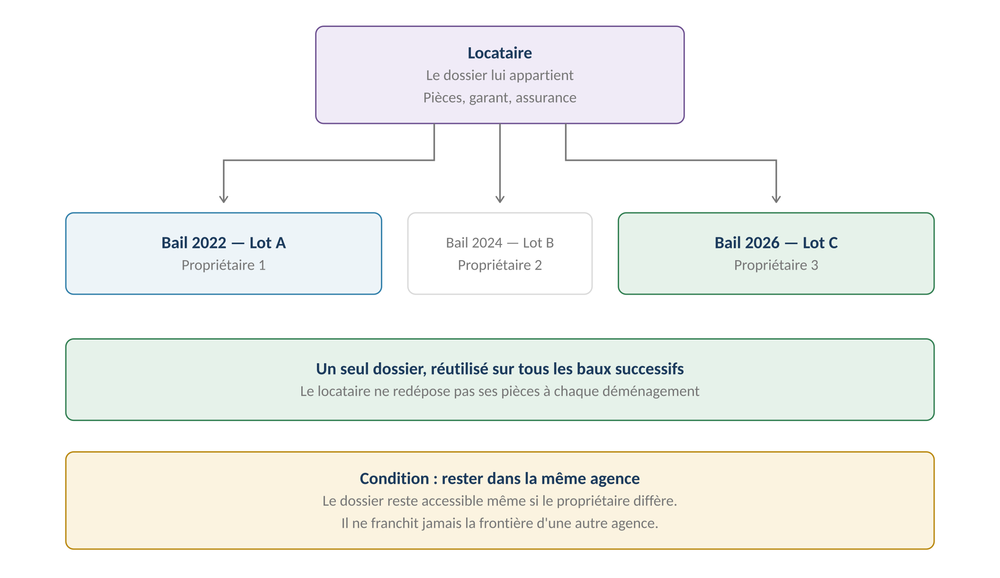
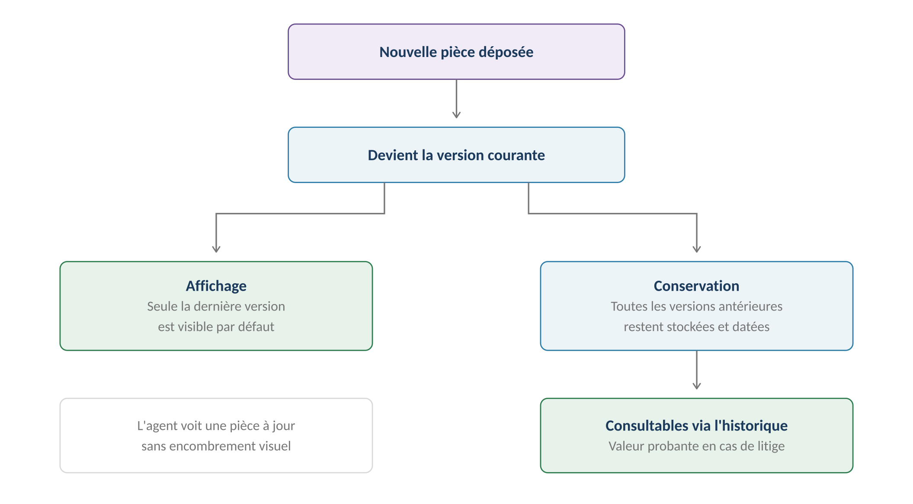
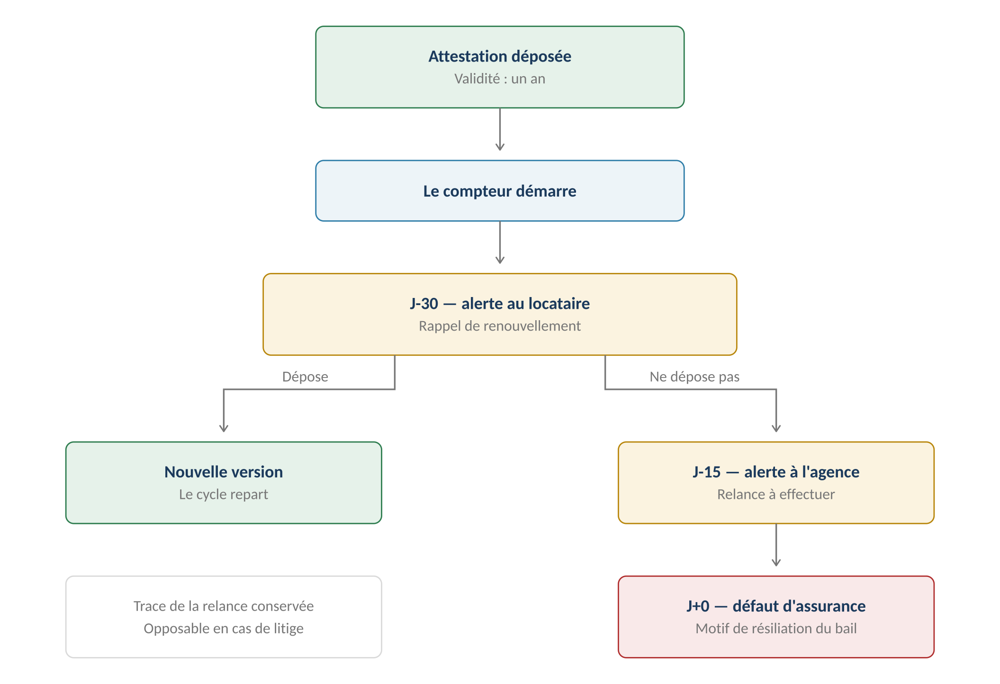
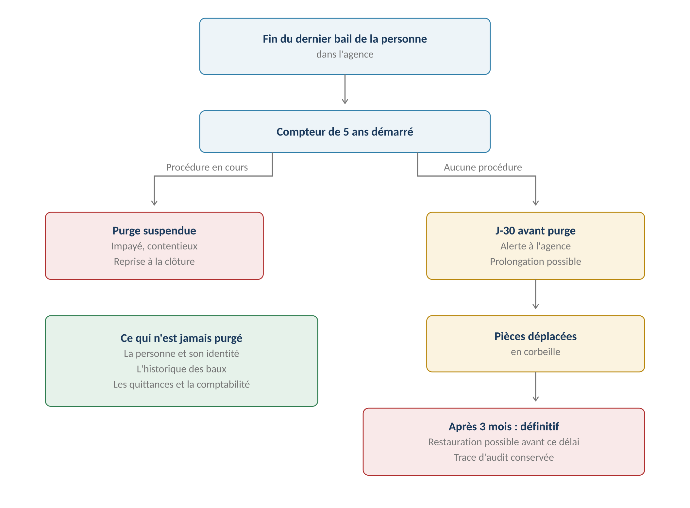

**GERIMMO V3**

Référentiel des parcours clients

**MODULE 0b**

**Dossier locataire**

|               |                                                        |
|:--------------|:-------------------------------------------------------|
| **Périmètre** | 8 parcours · 3 objets métier                           |
| **Dépend de** | Module 0 — le dossier se rattache à un lot loué        |
| **Alimente**  | Bail (module 1) · Garanties (module 2)                 |
| **Criticité** | **Haute — obligation légale annuelle sur l'assurance** |
| **Statut**    | **Module clos — aucune question ouverte**              |

> **Vue d'ensemble du module**
>
> **Ce n'est pas de la candidature**
>
> La prospection et la sélection du locataire sont hors périmètre (décision actée).
>
> Ce module commence après : le gérant enregistre les pièces d'un locataire
>
> qu'il a déjà retenu, avant de générer le bail.
>
> **Principe fondateur — le dossier appartient à la personne**
>
> Le dossier est rattaché au locataire, pas au bail.
>
> Un locataire qui déménage d'un lot à un autre garde son dossier :
>
> il ne redépose pas ses pièces à chaque bail.

*Schéma 1 — Un seul dossier, réutilisé sur tous les baux successifs au sein de la même agence*

**Objets créés dans ce module**

------------------------------------------------------------------------

| **Objet** | **Description** | **Rattaché à** |
|:---|:---|:---|
| **Personne** | Locataire ou garant — fiche d'identité | — |
| **Pièce** | Document justificatif, versionné et daté | Personne |
| **Lien de garantie** | Relation garant → locataire, portée par le bail | Personne + Bail |

**Les pièces attendues**

------------------------------------------------------------------------

| **Catégorie** | **Pièces** | **Qui dépose** | **Expire** |
|:---|:---|:---|:---|
| **Identité** | Pièce d'identité, titre de séjour | AG | Oui |
| **Revenus** | Bulletins de salaire, contrat de travail | AG | Non |
| **Fiscalité** | Avis d'imposition | AG | Non |
| **Domicile** | Justificatif de domicile précédent | AG | Non |
| **Assurance** | **Attestation d'assurance habitation** | **LO** | **Oui — annuelle** |
| **Garant** | Mêmes catégories, sur la fiche du garant | AG | Variable |
| **Sur demande** | Tout document réclamé par le gérant | LO | Non |

**Cartographie des 8 parcours**

------------------------------------------------------------------------

| **\#** | **Parcours** | **Persona** | **V1 / V2** | **Criticité** |
|:---|:---|:---|:---|:---|
| 0b.1 | Création de la fiche personne | AG | **V1** | Moyenne |
| 0b.2 | Dépôt des pièces du dossier | AG | **V1** | Haute |
| 0b.3 | Dépôt des pièces du garant | AG | **V1** | Haute |
| 0b.4 | Mise à jour d'une pièce | AG | **V1** | Moyenne |
| 0b.5 | Dépôt de l'attestation d'assurance | LO | **V1** | **MAXIMALE** |
| 0b.6 | Alerte d'expiration d'une pièce | Système | **V1** | **MAXIMALE** |
| 0b.7 | Consultation du dossier | AG | **V1** | Moyenne |
| 0b.8 | Purge RGPD | Système | **V2** | Haute |

> **Le module 0b.8 est en V2, mais se conçoit en V1**
>
> La purge peut attendre — aucune agence n'atteindra 5 ans de conservation avant longtemps.
>
> En revanche, le modèle de données doit prévoir dès maintenant l'identifiant de conservation
>
> et l'état « en corbeille », sans quoi la purge sera impossible à greffer plus tard.
>
> **0b.1 — Création de la fiche personne**

|                 |                                                     |
|:----------------|:----------------------------------------------------|
| **Persona**     | AG — Agent immobilier                               |
| **Déclencheur** | Un locataire est retenu pour un lot                 |
| **Fréquence**   | À chaque nouveau locataire ou garant                |
| **Criticité**   | Moyenne                                             |
| **Aboutit à**   | Une personne pouvant recevoir des pièces et un bail |

**Parcours nominal**

------------------------------------------------------------------------

| **\#** | **Acteur** | **Action** | **Écran / état** |
|:---|:---|:---|:---|
| 1 | AG | Clique « Nouvelle personne » ou depuis la création d'un bail | Liste des personnes |
| 2 | AG | Saisit nom, prénom, date de naissance, coordonnées | Formulaire |
| 3 | **Système** | Vérifie l'absence de doublon sur nom + date de naissance | Alerte non bloquante |
| 4 | AG | Indique le type : personne physique ou morale | Sélecteur |
| 5 | AG | Valide | — |
| 6 | **Système** | Crée la personne, sans rôle assigné | Fiche personne |
| 7 | **Système** | Le rôle se déduit de ses rattachements | — |

> **Une personne, plusieurs rôles**
>
> Une même personne peut être locataire d'un lot, garant pour un autre, et propriétaire d'un troisième.
>
> Le rôle n'est pas un champ : il se déduit des rattachements existants.
>
> Cela évite les doublons et permet de retrouver un historique complet.

**Variantes**

------------------------------------------------------------------------

| **Code** | **Situation** | **Comportement** |
|:---|:---|:---|
| **V1** | Personne déjà connue | L'agent la sélectionne dans la liste au lieu d'en créer une. |
| **V2** | Personne morale | Champs SIRET et représentant légal apparaissent. |
| **V3** | Création depuis le bail | Le formulaire s'ouvre en modale, sans quitter la création du bail. |
| **V4** | Création par import | Arrive via le parcours 0.12, sans passer par ce formulaire. |

**Cas d'erreur**

------------------------------------------------------------------------

| **Cas** | **Comportement attendu** |
|:---|:---|
| Doublon détecté | Alerte non bloquante avec lien vers la fiche existante |
| Email déjà utilisé sur la plateforme | **BLOCAGE — l'email identifie un compte global** |
| Date de naissance dans le futur | **BLOCAGE à la validation** |

**Règles métier**

------------------------------------------------------------------------

> **RM-0b.1.1** — Une personne n'a pas de rôle fixe : il se déduit de ses rattachements.
>
> **RM-0b.1.2** — Nom + date de naissance constituent la clé d'unicité fonctionnelle, non bloquante.
>
> **RM-0b.1.3** — L'email est unique sur toute la plateforme : il identifie un compte global (RM-A1.1).
>
> **RM-0b.1.4** — Une personne créée n'est jamais supprimée, seulement archivée.

**User stories**

------------------------------------------------------------------------

> **US-0b.1.1**
>
> *En tant qu'agent immobilier, je veux créer une personne sans lui assigner de rôle, afin qu'elle puisse être locataire ici et garant ailleurs sans doublon.*

- **Étant donné** que je crée une personne, **quand** la création aboutit, **alors** aucun rôle ne lui est attribué et sa fiche est vide de rattachements

- **Étant donné** une personne déjà locataire d'un lot, **quand** je la désigne comme garant sur un autre bail, **alors** les deux rôles coexistent sur la même fiche

> **US-0b.1.2**
>
> *En tant qu'agent immobilier, je veux être averti d'un doublon probable, afin de ne pas créer deux fiches pour la même personne.*

- **Étant donné** qu'une personne existe avec le même nom et la même date de naissance, **quand** je valide la création, **alors** une alerte non bloquante m'affiche la fiche existante

> **0b.2 — Dépôt des pièces du dossier**

|                 |                                                          |
|:----------------|:---------------------------------------------------------|
| **Persona**     | AG — Agent immobilier                                    |
| **Déclencheur** | Constitution du dossier avant génération du bail         |
| **Fréquence**   | À chaque nouveau locataire                               |
| **Criticité**   | Haute — le bail ne peut être généré sans dossier complet |
| **Alimente**    | Bail (1.1) · Garanties (2.2)                             |

**Parcours nominal**

------------------------------------------------------------------------

| **\#** | **Acteur** | **Action** | **Écran / état** |
|:---|:---|:---|:---|
| 1 | AG | Ouvre l'onglet « Dossier » de la fiche personne | Fiche personne |
| 2 | **Système** | Affiche les catégories attendues et leur statut | Liste avec badges |
| 3 | AG | Sélectionne une catégorie et téléverse le document | Modale de dépôt |
| 4 | AG | Saisit la date d'expiration si la catégorie l'exige | Formulaire |
| 5 | AG | Valide | — |
| 6 | **Système** | Enregistre la pièce en version 1, datée | — |
| 7 | **Système** | Recalcule le statut de complétude du dossier | Badge sur la fiche |

**Variantes**

------------------------------------------------------------------------

| **Code** | **Situation** | **Comportement** |
|:---|:---|:---|
| **V1** | Dépôt multiple | Plusieurs fichiers d'une même catégorie — trois bulletins de salaire, par exemple. |
| **V2** | Pièce sans expiration | Le champ date reste vide, aucune alerte ne sera générée. |
| **V3** | **Document sur demande** | L'agent réclame une pièce hors catégories. Le locataire la dépose via 0b.5. |
| **V4** | Dossier incomplet assumé | L'agent poursuit malgré des pièces manquantes. Le bail reste possible avec alerte. |

**Cas d'erreur**

------------------------------------------------------------------------

| **Cas** | **Comportement attendu** |
|:---|:---|
| Format de fichier non supporté | Refus. Formats acceptés : PDF, JPG, PNG |
| Fichier supérieur à 10 Mo | Refus avec message indiquant la limite |
| Date d'expiration déjà passée | Accepté, badge « expiré » immédiat |
| Aucune date sur une catégorie qui l'exige | **BLOCAGE à la validation** |

**Règles métier**

------------------------------------------------------------------------

> **RM-0b.2.1** — Les catégories de pièces sont fixes, définies au niveau de l'application.
>
> **RM-0b.2.2** — Une catégorie peut contenir plusieurs pièces (trois bulletins de salaire).
>
> **RM-0b.2.3** — Un dossier incomplet n'empêche pas la génération du bail, mais génère une alerte.
>
> **RM-0b.2.4** — Toute pièce est datée de son dépôt et porte le nom de qui l'a déposée.
>
> **RM-0b.2.5** — Le locataire peut déposer un document hors catégorie, à la demande du gérant.

**User stories**

------------------------------------------------------------------------

> **US-0b.2.1**
>
> *En tant qu'agent immobilier, je veux voir d'un coup d'œil quelles pièces manquent, afin de relancer le locataire avant la signature.*

- **Étant donné** un dossier où seules l'identité et les revenus sont déposés, **quand** j'ouvre l'onglet Dossier, **alors** les catégories manquantes apparaissent avec un badge distinct

- **Étant donné** un dossier incomplet, **quand** je génère le bail, **alors** une alerte non bloquante me signale les pièces manquantes

> **US-0b.2.2**
>
> *En tant qu'agent immobilier, je veux déposer plusieurs fichiers dans une même catégorie, afin d'enregistrer les trois derniers bulletins de salaire.*

- **Étant donné** la catégorie Revenus, **quand** je dépose trois fichiers, **alors** les trois coexistent sans que l'un remplace l'autre

> **0b.3 — Dépôt des pièces du garant**

|  |  |
|:---|:---|
| **Persona** | AG — Agent immobilier |
| **Déclencheur** | Le bail prévoit une caution personne physique |
| **Fréquence** | Fréquente — la plupart des baux ont un garant |
| **Criticité** | Haute — conditionne la validité de l'acte de cautionnement |
| **Alimente** | Garanties (2.2) — acte de cautionnement |

> **Le garant est une personne à part entière**
>
> Il a sa propre fiche, ses propres pièces, sa propre adresse.
>
> Ce n'est pas un bloc de champs sur la fiche du locataire.
>
> Cela permet à un même garant de couvrir deux locataires — un parent avec deux enfants
>
> étudiants, cas fréquent — sans dupliquer ses pièces.

**Parcours nominal**

------------------------------------------------------------------------

| **\#** | **Acteur** | **Action** | **Écran / état** |
|:---|:---|:---|:---|
| 1 | AG | Depuis la fiche du locataire, clique « Ajouter un garant » | Fiche locataire |
| 2 | AG | Recherche une personne existante ou en crée une (0b.1) | Modale |
| 3 | AG | Dépose les pièces du garant : identité, revenus, imposition | Onglet Dossier du garant |
| 4 | AG | Indique le type de garantie et son étendue | Formulaire |
| 5 | AG | Valide | — |
| 6 | **Système** | Crée le lien de garantie, rattaché au bail à venir | — |

**Variantes**

------------------------------------------------------------------------

| **Code** | **Situation** | **Comportement** |
|:---|:---|:---|
| **V1** | **Garant déjà connu** | Ses pièces existent déjà. L'agent vérifie leur fraîcheur sans les redéposer. |
| **V2** | Plusieurs garants | Chacun a sa fiche et son lien. La solidarité entre eux se paramètre au bail. |
| **V3** | Garant personne morale | Une entreprise se porte caution. Champs SIRET et représentant légal. |
| **V4** | Garantie Visale ou GLI | Pas de garant personne. Traité au module 2, parcours 2.3. |

**Règles métier**

------------------------------------------------------------------------

> **RM-0b.3.1** — Le garant est une personne à part entière, avec sa propre fiche et ses propres pièces.
>
> **RM-0b.3.2** — Un même garant peut couvrir plusieurs locataires sans duplication de ses pièces.
>
> **RM-0b.3.3** — Le lien de garantie est porté par le bail, pas par la personne.
>
> **RM-0b.3.4** — La fin d'un bail met fin au lien de garantie associé, sans effacer la fiche du garant.

**User stories**

------------------------------------------------------------------------

> **US-0b.3.1**
>
> *En tant qu'agent immobilier, je veux réutiliser un garant déjà connu, afin de ne pas redemander ses pièces pour un second locataire.*

- **Étant donné** une personne déjà garante d'un autre locataire, **quand** je la désigne comme garant d'un nouveau bail, **alors** ses pièces existantes sont immédiatement rattachées

- **Étant donné** un garant dont les pièces datent de trois ans, **quand** je le rattache à un nouveau bail, **alors** une alerte me signale l'ancienneté des pièces

> **0b.4 — Mise à jour d'une pièce**

|  |  |
|:---|:---|
| **Persona** | AG — Agent immobilier ou LO — Locataire |
| **Déclencheur** | Renouvellement d'une pièce expirée ou périmée |
| **Fréquence** | Annuelle pour l'assurance, ponctuelle sinon |
| **Criticité** | Moyenne |
| **Principe** | Toutes les versions conservées, seule la dernière affichée |

*Schéma 2 — La nouvelle version devient courante, les précédentes restent consultables*

**Parcours nominal**

------------------------------------------------------------------------

| **\#** | **Acteur** | **Action** | **Écran / état** |
|:---|:---|:---|:---|
| 1 | AG / LO | Ouvre la pièce à remplacer | Fiche personne |
| 2 | AG / LO | Clique « Remplacer » | Modale de dépôt |
| 3 | AG / LO | Téléverse la nouvelle version et saisit sa date d'expiration | Formulaire |
| 4 | AG / LO | Valide | — |
| 5 | **Système** | Incrémente le numéro de version | — |
| 6 | **Système** | **Conserve l'ancienne version, la marque comme antérieure** | — |
| 7 | **Système** | Affiche uniquement la nouvelle version par défaut | Fiche personne |
| 8 | **Système** | Annule l'alerte d'expiration s'il y en avait une | — |

**Pourquoi conserver toutes les versions**

------------------------------------------------------------------------

| **Situation** | **Ce que permet l'historique** |
|:---|:---|
| **Litige sur un sinistre** | Prouver quelle assurance couvrait le locataire à la date des faits |
| **Contestation d'un congé** | Établir la situation du locataire au moment de la décision |
| **Contrôle administratif** | Montrer la chaîne complète des justificatifs |
| **Erreur de dépôt** | Revenir à la version précédente sans perte |

**Règles métier**

------------------------------------------------------------------------

> **RM-0b.4.1** — Toutes les versions d'une pièce sont conservées, aucune n'est écrasée.
>
> **RM-0b.4.2** — Seule la version courante est affichée par défaut ; les antérieures sont dans l'historique.
>
> **RM-0b.4.3** — Chaque version porte sa date de dépôt et l'identité du déposant.
>
> **RM-0b.4.4** — Le dépôt d'une nouvelle version annule automatiquement l'alerte d'expiration en cours.
>
> **RM-0b.4.5** — Une version antérieure ne peut pas être supprimée individuellement.

**User stories**

------------------------------------------------------------------------

> **US-0b.4.1**
>
> *En tant qu'agent immobilier, je veux consulter une version antérieure d'une pièce, afin de savoir quelle assurance couvrait le locataire à une date donnée.*

- **Étant donné** une attestation d'assurance remplacée deux fois, **quand** j'ouvre l'historique de la pièce, **alors** les trois versions apparaissent avec leur date de dépôt

- **Étant donné** un sinistre survenu en mars 2025, **quand** je consulte l'historique, **alors** je peux ouvrir l'attestation en vigueur à cette date

> **US-0b.4.2**
>
> *En tant qu'agent immobilier, je veux que la fiche reste lisible malgré l'historique, afin de ne pas confondre les versions.*

- **Étant donné** une pièce ayant cinq versions, **quand** j'ouvre la fiche personne, **alors** seule la version courante s'affiche, avec un lien vers l'historique

> **0b.5 & 0b.6 — Attestation d'assurance et alertes**
>
> **Le parcours le plus critique du module**
>
> L'assurance habitation est une obligation légale annuelle du locataire.
>
> À défaut de justificatif, le bailleur peut résilier le bail — mais seulement s'il peut
>
> prouver qu'il a réclamé le document.
>
> C'est aussi le seul parcours du module où le locataire agit de lui-même.

|                 |                                              |
|:----------------|:---------------------------------------------|
| **Personas**    | LO — Locataire · Système → AG                |
| **Déclencheur** | Échéance annuelle de l'attestation           |
| **Fréquence**   | Annuelle, pour chaque bail actif             |
| **Criticité**   | MAXIMALE — obligation légale                 |
| **Alimente**    | Agenda et alertes (module 14) · Congé (1.11) |

*Schéma 3 — Le cycle annuel de l'attestation, avec les deux niveaux d'alerte*

**Parcours nominal — dépôt par le locataire**

------------------------------------------------------------------------

| **\#** | **Acteur** | **Action** | **Écran / état** |
|:---|:---|:---|:---|
| 1 | **Système** | Envoie l'alerte J-30 au locataire | Email + notification |
| 2 | LO | Se connecte à son espace | Espace locataire |
| 3 | LO | Téléverse sa nouvelle attestation | Modale de dépôt |
| 4 | LO | Saisit la date d'échéance figurant sur le document | Formulaire |
| 5 | LO | Valide | — |
| 6 | **Système** | Enregistre en nouvelle version (0b.4) | — |
| 7 | **Système** | Annule l'alerte et notifie l'agence | — |

**Les seuils d'alerte**

------------------------------------------------------------------------

| **Seuil** | **Destinataire** | **Canal** | **Effet** |
|:---|:---|:---|:---|
| **J-30** | **Locataire** | Email + in-app | Rappel de renouvellement |
| **J-15** | **Agence** | In-app + tableau de bord | Relance à effectuer |
| **J+0** | **Agence** | In-app + email | **Défaut d'assurance constaté** |
| **J+15** | **Agence** | Relance hebdomadaire | **Motif possible de résiliation** |

> **La trace de la relance est aussi importante que l'alerte**
>
> Le bailleur ne peut invoquer le défaut d'assurance que s'il prouve avoir réclamé le document.
>
> Chaque alerte envoyée au locataire doit donc être horodatée et conservée,
>
> de manière à être produite en cas de contentieux.

**Variantes**

------------------------------------------------------------------------

| **Code** | **Situation** | **Comportement** |
|:---|:---|:---|
| **V1** | Dépôt par l'agence | Le locataire envoie l'attestation par email, l'agent la dépose pour lui. |
| **V2** | Attestation multi-annuelle | Certains contrats couvrent plusieurs années. La date saisie fait foi. |
| **V3** | Colocation | Chaque colocataire dépose la sienne, ou une attestation couvre le logement entier. |
| **V4** | **Document sur demande** | Le gérant réclame une autre pièce. Même circuit de dépôt. |
| **V5** | Fin de bail proche | Aucune alerte si le bail se termine avant l'échéance de l'attestation. |

**Cas d'erreur**

------------------------------------------------------------------------

| **Cas** | **Comportement attendu** |
|:---|:---|
| Le locataire n'a pas d'accès à l'application | L'alerte part par email ; l'agent dépose à sa place |
| Date d'échéance incohérente | Alerte non bloquante si la date dépasse deux ans |
| Attestation déposée après l'échéance | Acceptée, l'alerte se ferme, la trace du défaut reste |
| Aucune attestation depuis plus de six mois | **Alerte critique remontée à l'admin agence** |

**Règles métier**

------------------------------------------------------------------------

> **RM-0b.5.1** — Le locataire peut déposer son attestation lui-même depuis son espace.
>
> **RM-0b.5.2** — Il peut aussi déposer tout autre document, à la demande explicite de son gérant.
>
> **RM-0b.5.3** — Un dépôt par le locataire notifie l'agence.
>
> **RM-0b.6.1** — Seuils d'alerte assurance : J-30 locataire, J-15 agence, J+0 et J+15 agence.
>
> **RM-0b.6.2** — Chaque alerte envoyée est horodatée et conservée à titre de preuve.
>
> **RM-0b.6.3** — Aucune alerte n'est générée si le bail se termine avant l'échéance.
>
> **RM-0b.6.4** — Le défaut d'assurance ne bloque rien dans l'application : il alerte, il ne verrouille pas.
>
> **RM-0b.6.5** — Les pièces d'identité à durée limitée (titre de séjour) suivent les mêmes seuils.

**User stories**

------------------------------------------------------------------------

> **US-0b.5.1**
>
> *En tant que locataire, je veux déposer mon attestation d'assurance depuis mon espace, afin de ne pas avoir à l'envoyer par email chaque année.*

- **Étant donné** que je reçois l'alerte J-30, **quand** je clique sur le lien de l'email, **alors** j'arrive directement sur l'écran de dépôt

- **Étant donné** que je dépose mon attestation, **quand** la validation aboutit, **alors** l'alerte disparaît et mon agence est notifiée

> **US-0b.6.1**
>
> *En tant qu'agent immobilier, je veux voir les attestations manquantes sur mon tableau de bord, afin de relancer avant que le défaut ne soit constaté.*

- **Étant donné** trois locataires dont l'attestation expire dans moins de quinze jours, **quand** j'ouvre mon tableau de bord, **alors** les trois apparaissent dans les alertes à traiter

- **Étant donné** un locataire sans attestation depuis six mois, **quand** l'alerte est générée, **alors** elle remonte également à l'admin agence

> **US-0b.6.2**
>
> *En tant qu'agent immobilier, je veux prouver que j'ai relancé le locataire, afin de pouvoir invoquer le défaut d'assurance si nécessaire.*

- **Étant donné** un locataire relancé trois fois sans réponse, **quand** je consulte l'historique des alertes, **alors** les trois envois apparaissent avec leur date et leur destinataire

> **0b.7 — Consultation du dossier**

|                     |                                           |
|:--------------------|:------------------------------------------|
| **Persona**         | AG — Agent immobilier                     |
| **Déclencheur**     | Vérification avant bail, litige, contrôle |
| **Fréquence**       | Régulière                                 |
| **Criticité**       | Moyenne                                   |
| **Points d'entrée** | Fiche personne · Fiche lot · Fiche bail   |

**Trois chemins vers le même dossier**

------------------------------------------------------------------------

| **Depuis** | **Ce que l'agent voit** |
|:---|:---|
| **Fiche personne** | Le dossier complet, toutes catégories, tous baux confondus |
| **Fiche lot** | Le dossier du locataire en place sur ce lot |
| **Fiche bail** | Le dossier du locataire et celui de son garant, liés à ce bail |

> **Le dossier suit la personne au sein de l'agence**
>
> Un locataire qui change de lot dans la même agence conserve son dossier,
>
> même si le nouveau propriétaire n'est pas le même.
>
> Le propriétaire mandant n'ayant aucun accès à l'application, la question de sa visibilité
>
> sur les pièces ne se pose pas : il ne voit rien.

**Règles métier**

------------------------------------------------------------------------

> **RM-0b.7.1** — Le dossier est accessible depuis la fiche personne, la fiche lot et la fiche bail.
>
> **RM-0b.7.2** — Il reste accessible au sein de la même agence, quel que soit le propriétaire du lot.
>
> **RM-0b.7.3** — Le dossier ne franchit jamais la frontière d'une autre agence.
>
> **RM-0b.7.4** — Le propriétaire mandant n'a aucun accès aux pièces du dossier locataire.
>
> **RM-0b.7.5** — Toute consultation d'une pièce est tracée dans un journal d'accès.

**User story**

------------------------------------------------------------------------

> **US-0b.7.1**
>
> *En tant qu'agent immobilier, je veux ouvrir le dossier du locataire depuis la fiche du lot, afin de vérifier une pièce sans chercher la personne.*

- **Étant donné** un lot occupé, **quand** j'ouvre sa fiche, **alors** un lien mène directement au dossier du locataire en place

- **Étant donné** un locataire ayant eu deux baux successifs dans l'agence, **quand** j'ouvre son dossier, **alors** je vois toutes ses pièces, indépendamment du bail concerné

> **0b.8 — Purge RGPD**

|                 |                                                      |
|:----------------|:-----------------------------------------------------|
| **Persona**     | Système → AA                                         |
| **Déclencheur** | Cinq ans après la fin du dernier bail de la personne |
| **Fréquence**   | Tâche planifiée quotidienne                          |
| **Criticité**   | Haute — obligation réglementaire                     |
| **Statut**      | **V2 — mais le modèle de données se conçoit en V1**  |

*Schéma 4 — Cinq ans, suspension si procédure, corbeille de trois mois avant suppression définitive*

**Parcours nominal**

------------------------------------------------------------------------

| **\#** | **Acteur** | **Action** | **Résultat** |
|:---|:---|:---|:---|
| 1 | **Système** | Identifie les personnes dont le dernier bail est clos depuis 5 ans | — |
| 2 | **Système** | **Vérifie qu'aucune procédure n'est en cours** | Suspension si oui |
| 3 | **Système** | Alerte l'agence à J-30 avant purge | Email + in-app |
| 4 | AA | Peut prolonger la conservation avec justification | Optionnel |
| 5 | **Système** | Déplace les pièces en corbeille | — |
| 6 | AA | Peut restaurer pendant trois mois | Corbeille |
| 7 | **Système** | **Après trois mois, suppression définitive** | — |
| 8 | **Système** | Inscrit l'opération au journal d'audit | Trace conservée |

**Ce qui est purgé, ce qui ne l'est pas**

------------------------------------------------------------------------

| **Donnée** | **Purgée** | **Raison** |
|:---|:---|:---|
| **Pièces d'identité** | **Oui** | Donnée personnelle sans utilité après 5 ans |
| **Justificatifs de revenus** | **Oui** | Donnée personnelle sensible |
| **Avis d'imposition** | **Oui** | Donnée personnelle sensible |
| **Attestations d'assurance** | **Oui** | Sans utilité après extinction des recours |
| **Identité de la personne** | **NON** | Nécessaire à l'historique des baux |
| **Historique des baux** | **NON** | Obligation comptable et fiscale |
| **Quittances** | **NON** | Obligation de conservation comptable |
| **Écritures comptables** | **NON** | Obligation légale de dix ans |

> **La purge ne supprime jamais la personne**
>
> Seules les pièces justificatives disparaissent. La personne, ses baux et sa comptabilité
>
> restent intacts — sinon les rapports de gestion et les exercices passés seraient cassés.
>
> Même logique que les propriétaires au module 0 : on date, on archive, on ne supprime pas.

**Variantes**

------------------------------------------------------------------------

| **Code** | **Situation** | **Comportement** |
|:---|:---|:---|
| **V1** | **Procédure en cours** | Purge suspendue tant qu'un impayé ou un contentieux n'est pas soldé. |
| **V2** | **Demande du locataire** | Purge déclenchable manuellement avant les cinq ans, sur demande RGPD. |
| **V3** | Retour du locataire | Un nouveau bail relance le compteur à zéro. |
| **V4** | Prolongation par l'agence | L'admin agence repousse la purge avec justification tracée. |
| **V5** | Restauration | Pendant trois mois, l'admin agence peut restaurer les pièces. |

**Cas d'erreur**

------------------------------------------------------------------------

| **Cas** | **Comportement attendu** |
|:---|:---|
| Impayé non soldé à l'échéance des 5 ans | **Purge suspendue automatiquement, sans intervention** |
| Demande RGPD alors qu'un bail est actif | **REFUS — les pièces sont nécessaires au bail en cours** |
| Restauration après trois mois | **Impossible — la suppression est définitive** |
| Purge d'une personne encore garante | **BLOCAGE tant que le lien de garantie est actif** |

**Règles métier**

------------------------------------------------------------------------

> **RM-0b.8.1** — Le compteur de conservation est de cinq ans après la fin du dernier bail dans l'agence.
>
> **RM-0b.8.2** — Un nouveau bail relance le compteur à zéro.
>
> **RM-0b.8.3** — La purge est suspendue automatiquement tant qu'une procédure est en cours.
>
> **RM-0b.8.4** — L'agence est alertée trente jours avant toute purge.
>
> **RM-0b.8.5** — Les pièces purgées restent restaurables pendant trois mois.
>
> **RM-0b.8.6** — Après trois mois, la suppression est définitive et irréversible.
>
> **RM-0b.8.7** — La purge ne supprime jamais la personne, ses baux ni sa comptabilité.
>
> **RM-0b.8.8** — Toute purge est inscrite au journal d'audit, conservé indéfiniment.
>
> **RM-0b.8.9** — Une purge peut être déclenchée manuellement sur demande RGPD du locataire.
>
> **RM-0b.8.10** — Une personne encore garante d'un bail actif ne peut pas être purgée.

**User stories**

------------------------------------------------------------------------

> **US-0b.8.1**
>
> *En tant qu'admin agence, je veux être alerté avant une purge, afin de pouvoir la retarder si une procédure se prépare.*

- **Étant donné** une personne dont les pièces seront purgées dans trente jours, **quand** la tâche quotidienne s'exécute, **alors** je reçois une alerte nommant la personne et la date de purge

- **Étant donné** que je reçois cette alerte, **quand** je prolonge la conservation avec un motif, **alors** la purge est repoussée et le motif est tracé

> **US-0b.8.2**
>
> *En tant qu'admin agence, je veux que la purge se suspende seule en cas d'impayé, afin de ne pas perdre des pièces nécessaires à une procédure.*

- **Étant donné** un ancien locataire avec un impayé non soldé, **quand** les cinq ans sont atteints, **alors** la purge est suspendue sans que j'aie à intervenir

- **Étant donné** que l'impayé est soldé deux ans plus tard, **quand** la procédure est clôturée, **alors** le processus de purge reprend

> **US-0b.8.3**
>
> *En tant qu'admin agence, je veux restaurer des pièces purgées par erreur, afin de corriger une manipulation dans un délai raisonnable.*

- **Étant donné** des pièces purgées il y a un mois, **quand** j'ouvre la corbeille, **alors** je peux les restaurer intégralement

- **Étant donné** des pièces purgées il y a quatre mois, **quand** je cherche à les restaurer, **alors** elles n'apparaissent plus : la suppression est définitive

> **Synthèse du module**

**Toutes les règles métier**

------------------------------------------------------------------------

| **Code** | **Règle** | **Bloquant** |
|:---|:---|:---|
| **RM-0b.1.1** | Une personne n'a pas de rôle fixe | Structurel |
| **RM-0b.1.3** | **L'email est unique sur toute la plateforme** | **Oui** |
| **RM-0b.2.3** | Un dossier incomplet n'empêche pas le bail, mais alerte | Non |
| **RM-0b.2.5** | Le locataire peut déposer un document à la demande du gérant | Structurel |
| **RM-0b.3.1** | Le garant est une personne à part entière | Structurel |
| **RM-0b.3.3** | Le lien de garantie est porté par le bail | Structurel |
| **RM-0b.4.1** | Toutes les versions sont conservées, aucune écrasée | Structurel |
| **RM-0b.4.2** | Seule la version courante est affichée par défaut | Structurel |
| **RM-0b.6.1** | Alertes assurance : J-30 LO, J-15 AG, J+0, J+15 | Non |
| **RM-0b.6.2** | Chaque alerte est horodatée et conservée comme preuve | Structurel |
| **RM-0b.6.4** | Le défaut d'assurance alerte mais ne verrouille rien | Non |
| **RM-0b.7.2** | Le dossier suit la personne dans la même agence | Structurel |
| **RM-0b.7.4** | Le propriétaire mandant ne voit aucune pièce | **Oui** |
| **RM-0b.8.1** | Conservation de cinq ans après le dernier bail | Structurel |
| **RM-0b.8.3** | Purge suspendue si une procédure est en cours | **Oui** |
| **RM-0b.8.5** | Pièces restaurables pendant trois mois | Structurel |
| **RM-0b.8.7** | La purge ne supprime jamais la personne ni sa comptabilité | **Oui** |

**Décompte des user stories**

------------------------------------------------------------------------

| **Parcours** | **User stories** | **Critères d'acceptation** |
|:---|:---|:---|
| 0b.1 — Création de la fiche personne | 2 | 3 |
| 0b.2 — Dépôt des pièces | 2 | 3 |
| 0b.3 — Pièces du garant | 1 | 2 |
| 0b.4 — Mise à jour d'une pièce | 2 | 3 |
| 0b.5 & 0b.6 — Assurance et alertes | 3 | 5 |
| 0b.7 — Consultation du dossier | 1 | 2 |
| 0b.8 — Purge RGPD | 3 | 6 |
| **TOTAL** | **14** | **24** |

**Décisions actées sur ce module**

------------------------------------------------------------------------

| **Décision**                                  | **Statut** |
|:----------------------------------------------|:-----------|
| Prospection et candidature hors périmètre     | **Acté**   |
| Dossier rattaché à la personne, pas au bail   | **Acté**   |
| Toutes versions conservées, dernière affichée | **Acté**   |
| Dossier partagé dans la même agence           | **Acté**   |
| Le locataire dépose sur demande du gérant     | **Acté**   |
| Conservation de cinq ans                      | **Acté**   |
| Garant = personne à part entière              | **Acté**   |
| Purge suspendue si procédure                  | **Acté**   |
| Purge réversible pendant trois mois           | **Acté**   |

**Ce que ce module impose ailleurs**

------------------------------------------------------------------------

| **Module** | **Conséquence** |
|:---|:---|
| **Module 1 — Bail** | Le lien de garantie est porté par le bail (RM-0b.3.3) |
| **Module 2 — Garanties** | L'acte de cautionnement s'appuie sur les pièces du garant |
| **Module 3 — Loyers** | Un impayé en cours suspend la purge (RM-0b.8.3) |
| **Module 14 — Alertes** | Quatre seuils d'alerte assurance à intégrer |
| **Module 19 — Mobile** | Le dépôt d'attestation doit fonctionner sur mobile |

**Prochaine étape**

------------------------------------------------------------------------

> **Module 0c — Copropriété**
>
> Six parcours, dont la ventilation récupérable / non récupérable des charges
>
> du syndic — le point le plus technique de tout le projet.
>
> Deux paramètres sont déjà tranchés : le tantième est stocké sur le lot,
>
> et l'appel de charges est transmis par le propriétaire à l'agence.
