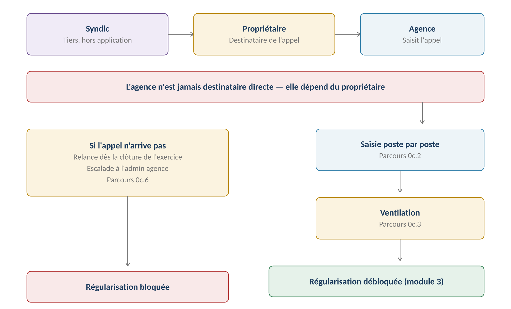
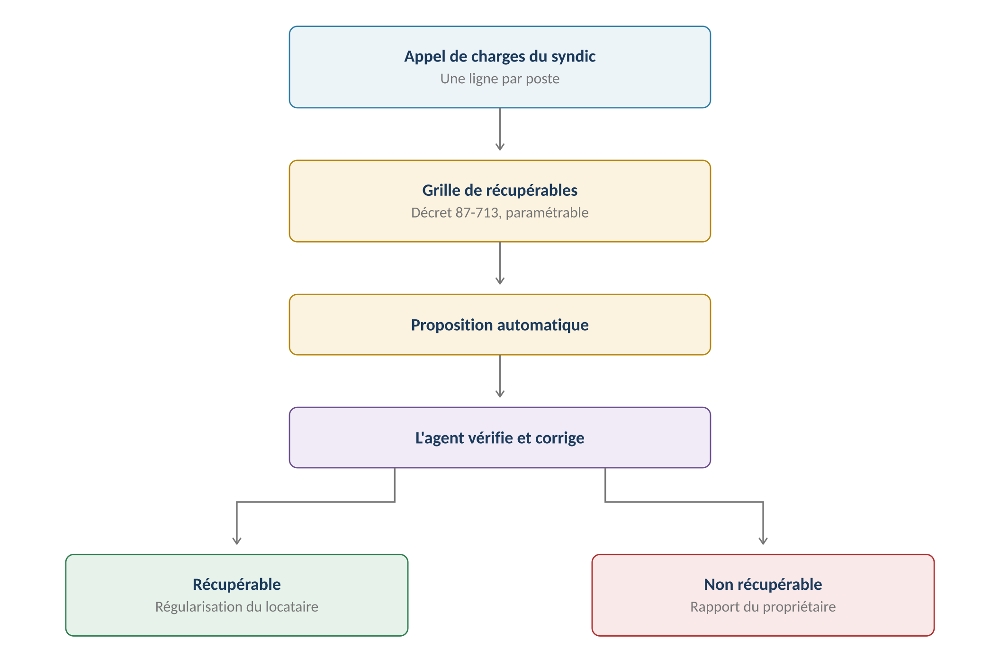
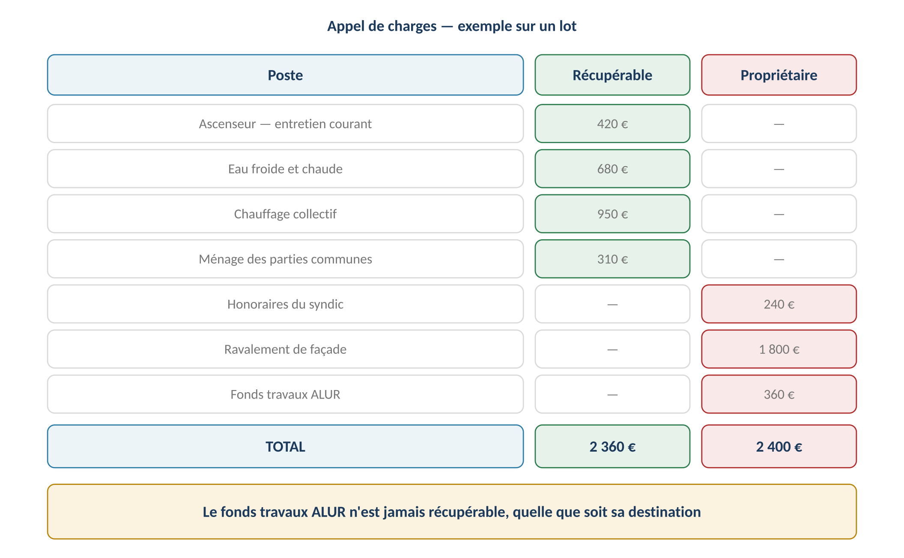
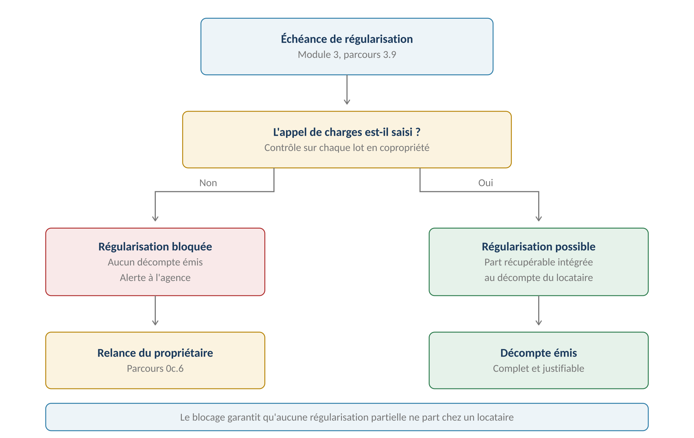

**GERIMMO V3**

Référentiel des parcours clients

**MODULE 0c**

**Copropriété**

|  |  |
|:---|:---|
| **Périmètre** | 6 parcours · 3 objets métier |
| **Dépend de** | Module 0 — le lot et son tantième |
| **Alimente** | **Régularisation des charges (3.9) · Rapport propriétaire (6.2)** |
| **Criticité** | **MAXIMALE — la ventilation conditionne toutes les régularisations** |
| **Statut** | **Module clos — aucune question ouverte** |

> **Vue d'ensemble du module**
>
> **Gerimmo n'est pas un logiciel de syndic**
>
> Pas d'assemblée générale, pas de comptabilité de copropriété, pas d'appels de fonds émis.
>
> L'agence gère un lot dans une copropriété administrée par un syndic tiers.
>
> Ce module fait une seule chose : recevoir l'appel de charges du syndic, le saisir,
>
> et le ventiler pour savoir qui paie quoi.

**Le circuit de l'appel de charges**

------------------------------------------------------------------------

*Schéma 1 — Le syndic écrit au propriétaire, qui transmet à l'agence : trois acteurs, deux transmissions*

> **Décision actée — l'agence n'est pas destinataire directe**
>
> Le syndic adresse l'appel de charges au propriétaire, qui le transmet à l'agence.
>
> Conséquence : l'agence dépend d'un tiers pour un document dont elle a besoin.
>
> Sans lui, la régularisation de charges du locataire est bloquée — d'où le parcours 0c.6,
>
> qui n'est pas un confort mais une nécessité.

**Les deux natures de charges**

------------------------------------------------------------------------

| **Nature** | **Qui paie** | **Où elle apparaît** | **Exemples** |
|:---|:---|:---|:---|
| **Récupérable** | **Locataire** | Régularisation (3.9) | Ascenseur, eau, chauffage, ménage |
| **Non récupérable** | **Propriétaire** | Rapport de gestion (6.2) | Travaux, honoraires syndic, fonds ALUR |

> **Pourquoi ce module est le plus technique du projet**
>
> Une erreur de ventilation ne se voit pas. Elle produit une régularisation plausible
>
> mais fausse, envoyée à tous les locataires en copropriété.
>
> Le locataire qui recalcule découvre qu'on lui a facturé le ravalement de façade.
>
> L'agence ne peut pas se défendre : le décompte est effectivement faux.

**Objets créés dans ce module**

------------------------------------------------------------------------

| **Objet** | **Description** | **Rattaché à** |
|:---|:---|:---|
| **Copropriété** | Syndic, référence, règlement | Bien |
| **Appel de charges** | Document du syndic, saisi poste par poste | Lot |
| **Poste de charge** | Une ligne de l'appel, ventilée | Appel de charges |
| **Grille de récupérables** | Règles de ventilation par défaut | Agence |

**Cartographie des 6 parcours**

------------------------------------------------------------------------

| **\#** | **Parcours** | **Persona** | **V1 / V2** | **Criticité** |
|:---|:---|:---|:---|:---|
| 0c.1 | Rattachement d'un lot à une copropriété | AG | **V1** | Moyenne |
| 0c.2 | Saisie d'un appel de charges | AG | **V1** | Haute |
| 0c.3 | **Ventilation récupérable / non récupérable** | AG | **V1** | **MAXIMALE** |
| 0c.4 | Paramétrage de la grille de récupérables | AA | **V1** | Haute |
| 0c.5 | Saisie d'un appel de fonds travaux | AG | **V1** | Moyenne |
| 0c.6 | **Relance du propriétaire** | Système | **V1** | **MAXIMALE** |

> **0c.1 — Rattachement d'un lot à une copropriété**

|  |  |
|:---|:---|
| **Persona** | AG — Agent immobilier |
| **Déclencheur** | La case « en copropriété » est cochée à la création du bien (0.1) |
| **Fréquence** | À chaque bien en copropriété |
| **Criticité** | Moyenne |
| **Aboutit à** | Un lot pouvant recevoir des appels de charges |

**Parcours nominal**

------------------------------------------------------------------------

| **\#** | **Acteur** | **Action** | **Écran / état** |
|:---|:---|:---|:---|
| 1 | AG | Ouvre l'onglet « Copropriété » de la fiche bien | Fiche bien |
| 2 | AG | Saisit le nom du syndic et ses coordonnées | Formulaire |
| 3 | AG | Renseigne la référence de la copropriété | Formulaire |
| 4 | AG | Dépose le règlement de copropriété | Upload optionnel |
| 5 | AG | **Saisit le tantième de chaque lot** | Fiche lot |
| 6 | **Système** | Contrôle que les tantièmes sont cohérents entre eux | Alerte non bloquante |
| 7 | AG | Valide | — |
| 8 | **Système** | Active la saisie des appels de charges sur ces lots | — |

> **Le tantième est stocké sur le lot — décision actée**
>
> Il sert à deux choses : contrôler la cohérence des appels du syndic,
>
> et servir de clé de répartition alternative si l'agence engage malgré tout
>
> une dépense au niveau du bien.
>
> Rappel : en copropriété, le syndic a déjà réparti. La clé du parcours 0.4 sert peu.

**Variantes**

------------------------------------------------------------------------

| **Code** | **Situation** | **Comportement** |
|:---|:---|:---|
| **V1** | Un seul lot du bien en copropriété | Le bien entier est un lot de copropriété. Cas le plus fréquent. |
| **V2** | Plusieurs lots dans la même copropriété | Chaque lot a son propre tantième. Un immeuble entier détenu par l'agence. |
| **V3** | Changement de syndic | Les coordonnées sont mises à jour. Les appels passés restent rattachés à l'ancien. |
| **V4** | Tantième inconnu | Saisie différée. Aucun contrôle de cohérence sur les appels tant qu'il manque. |

**Cas d'erreur**

------------------------------------------------------------------------

| **Cas** | **Comportement attendu** |
|:---|:---|
| Somme des tantièmes des lots \> total copropriété | **BLOCAGE — incohérence manifeste** |
| Tantième nul ou négatif | **BLOCAGE à la validation** |
| Copropriété déclarée sans syndic renseigné | Alerte non bloquante, la relance 0c.6 sera impossible |

**Règles métier**

------------------------------------------------------------------------

> **RM-0c.1.1** — La copropriété est rattachée au bien ; le tantième est porté par le lot.
>
> **RM-0c.1.2** — Un lot sans tantième peut recevoir des appels, sans contrôle de cohérence.
>
> **RM-0c.1.3** — Les coordonnées du syndic sont obligatoires pour permettre la relance (0c.6).
>
> **RM-0c.1.4** — Un changement de syndic ne modifie pas les appels de charges déjà saisis.

**User story**

------------------------------------------------------------------------

> **US-0c.1.1**
>
> *En tant qu'agent immobilier, je veux rattacher un lot à sa copropriété avec son tantième, afin de pouvoir vérifier la cohérence des appels du syndic.*

- **Étant donné** un bien déclaré en copropriété, **quand** j'ouvre l'onglet Copropriété, **alors** je peux saisir le syndic et le tantième de chaque lot

- **Étant donné** un tantième saisi sur un lot, **quand** un appel de charges arrive, **alors** le système peut contrôler la cohérence du montant appelé

> **0c.2 — Saisie d'un appel de charges**

|                 |                                                 |
|:----------------|:------------------------------------------------|
| **Persona**     | AG — Agent immobilier                           |
| **Déclencheur** | Le propriétaire transmet l'appel reçu du syndic |
| **Fréquence**   | Trimestrielle ou annuelle selon la copropriété  |
| **Criticité**   | Haute — sans lui, la régularisation est bloquée |
| **Alimente**    | Ventilation (0c.3) · Régularisation (3.9)       |

> **Saisie poste par poste — décision actée**
>
> Le détail permet de justifier la régularisation au locataire ligne par ligne,
>
> ce qu'il peut légalement exiger.
>
> Deux totaux iraient plus vite mais rendraient toute contestation ingérable :
>
> l'agence ne pourrait pas expliquer d'où vient le montant réclamé.

**Parcours nominal**

------------------------------------------------------------------------

| **\#** | **Acteur** | **Action** | **Écran / état** |
|:---|:---|:---|:---|
| 1 | AG | Ouvre l'onglet « Charges » du lot | Fiche lot |
| 2 | AG | Clique « Nouvel appel de charges » | Formulaire |
| 3 | AG | Saisit la période couverte et la date de l'appel | Formulaire |
| 4 | AG | Dépose le document reçu du syndic | Upload |
| 5 | AG | **Saisit chaque poste : libellé et montant** | Tableau de saisie |
| 6 | **Système** | Contrôle la cohérence du total avec le tantième | Alerte non bloquante |
| 7 | AG | Valide | — |
| 8 | **Système** | **Enchaîne sur la ventilation (0c.3)** | Écran de ventilation |

**Variantes**

------------------------------------------------------------------------

| **Code** | **Situation** | **Comportement** |
|:---|:---|:---|
| **V1** | Appel provisionnel | Appel trimestriel sur budget prévisionnel. Ventilation identique. |
| **V2** | **Régularisation du syndic** | Décompte annuel définitif. Remplace les provisions de l'exercice. |
| **V3** | Import depuis un tableau | Collage d'un tableau pour éviter la saisie ligne à ligne. |
| **V4** | **Extraction automatique** | V2 — lecture du document pour pré-remplir les postes |
| **V5** | Appel commun à plusieurs lots | L'appel est réparti entre les lots au prorata de leurs tantièmes. |

**Cas d'erreur**

------------------------------------------------------------------------

| **Cas** | **Comportement attendu** |
|:---|:---|
| Total des postes différent du total de l'appel | **BLOCAGE — la saisie est incomplète ou erronée** |
| Période chevauchant un appel déjà saisi | Alerte non bloquante, doublon possible |
| Montant incohérent avec le tantième | Alerte non bloquante, à vérifier auprès du syndic |
| Appel antérieur à l'entrée du lot en gestion | Accepté, mais signalé — il ne concerne peut-être pas l'agence |

**Règles métier**

------------------------------------------------------------------------

> **RM-0c.2.1** — Un appel de charges est saisi poste par poste, jamais en montant global.
>
> **RM-0c.2.2** — Le total des postes doit égaler le total de l'appel — blocage sinon.
>
> **RM-0c.2.3** — Le document original est conservé et rattaché à l'appel.
>
> **RM-0c.2.4** — Un appel est rattaché à un lot et à une période, qui sert de clé de contrôle.
>
> **RM-0c.2.5** — La saisie enchaîne obligatoirement sur la ventilation (0c.3).

**User stories**

------------------------------------------------------------------------

> **US-0c.2.1**
>
> *En tant qu'agent immobilier, je veux saisir l'appel poste par poste, afin de pouvoir justifier chaque euro au locataire.*

- **Étant donné** un appel de charges comportant douze postes, **quand** je les saisis un à un, **alors** le total calculé s'affiche et se compare au total de l'appel

- **Étant donné** que le total saisi diffère du total de l'appel, **quand** je valide, **alors** la validation est refusée avec l'écart affiché

> **US-0c.2.2**
>
> *En tant qu'agent immobilier, je veux coller un tableau plutôt que saisir ligne à ligne, afin de gagner du temps sur les appels volumineux.*

- **Étant donné** un tableau de postes copié depuis un tableur, **quand** je le colle dans la zone de saisie, **alors** les lignes sont créées automatiquement avec libellé et montant

> **0c.3 — Ventilation récupérable / non récupérable**
>
> **Le parcours le plus critique de tout le projet**
>
> C'est ici que se décide qui paie quoi. Une erreur produit une régularisation
>
> plausible mais fausse, envoyée à tous les locataires concernés.
>
> Contrairement à une erreur de calcul, elle ne se détecte pas : le montant est cohérent,
>
> seule sa répartition est fausse.

|                 |                                                   |
|:----------------|:--------------------------------------------------|
| **Persona**     | AG — Agent immobilier                             |
| **Déclencheur** | Suite immédiate de la saisie d'un appel (0c.2)    |
| **Fréquence**   | À chaque appel de charges                         |
| **Criticité**   | MAXIMALE                                          |
| **Alimente**    | Régularisation (3.9) · Rapport propriétaire (6.2) |

**Le mécanisme**

------------------------------------------------------------------------

*Schéma 2 — La grille propose, l'agent corrige, chaque poste part d'un côté ou de l'autre*

**Un exemple concret**

------------------------------------------------------------------------

*Schéma 3 — Sur un appel de 4 760 €, le locataire supporte 2 360 € et le propriétaire 2 400 €*

**Parcours nominal**

------------------------------------------------------------------------

| **\#** | **Acteur** | **Action** | **Écran / état** |
|:---|:---|:---|:---|
| 1 | **Système** | **Applique la grille et propose une ventilation par poste** | Écran de ventilation |
| 2 | **Système** | Signale les postes qu'il n'a pas su qualifier | Badge « à qualifier » |
| 3 | AG | Vérifie chaque ligne | Tableau |
| 4 | AG | Corrige les postes mal qualifiés | Sélecteur par ligne |
| 5 | AG | Qualifie les postes inconnus | Sélecteur par ligne |
| 6 | **Système** | Affiche les deux totaux : récupérable et propriétaire | — |
| 7 | AG | Valide | — |
| 8 | **Système** | Alimente la régularisation et le rapport de gestion | — |

> **Pourquoi la proposition automatique est indispensable**
>
> Un appel de charges comporte couramment vingt à quarante postes.
>
> Une qualification entièrement manuelle, à chaque appel, sur chaque lot,
>
> ne serait pas tenue en production — les agents finiraient par tout basculer
>
> d'un côté par lassitude.
>
> La grille fait le gros du travail ; l'agent traite les exceptions.

**Ce qui est récupérable — décret 87-713**

------------------------------------------------------------------------

| **Catégorie** | **Récupérable** | **Précision** |
|:---|:---|:---|
| **Ascenseur** | **Oui** | Entretien courant, électricité. Pas le remplacement. |
| **Eau froide et chaude** | **Oui** | Consommation et entretien des compteurs |
| **Chauffage collectif** | **Oui** | Combustible et entretien. Pas la chaudière neuve. |
| **Ménage des communs** | **Oui** | Produits et personnel |
| **Espaces verts** | **Oui** | Entretien courant |
| **Ordures ménagères** | **Oui** | Taxe et enlèvement |
| **Honoraires du syndic** | **NON** | Charge de gestion, jamais récupérable |
| **Gros travaux** | **NON** | Ravalement, toiture, remplacement d'équipement |
| **Fonds travaux ALUR** | **NON** | **Jamais, quelle que soit sa destination** |
| **Assurance immeuble** | **NON** | Charge du propriétaire |
| **Frais de procédure** | **NON** | Contentieux de copropriété |

> **Le piège de l'entretien contre le remplacement**
>
> L'entretien de l'ascenseur est récupérable. Son remplacement ne l'est pas.
>
> L'entretien de la chaudière est récupérable. Une chaudière neuve ne l'est pas.
>
> Le libellé du syndic ne permet pas toujours de trancher — « intervention ascenseur »
>
> peut être l'un ou l'autre. C'est là que l'agent doit intervenir,
>
> et c'est pourquoi les postes ambigus sont signalés plutôt que qualifiés d'office.

**Variantes**

------------------------------------------------------------------------

| **Code** | **Situation** | **Comportement** |
|:---|:---|:---|
| **V1** | **Poste reconnu par la grille** | Qualifié automatiquement, l'agent peut corriger. |
| **V2** | **Poste inconnu** | Signalé « à qualifier ». La validation est bloquée tant qu'il reste des postes non qualifiés. |
| **V3** | Poste mixte | Un poste peut être scindé en deux parts, l'une récupérable, l'autre non. |
| **V4** | Correction après validation | Possible tant que la régularisation n'est pas émise. Bloquée ensuite. |
| **V5** | **Enrichissement de la grille** | Une qualification manuelle peut être ajoutée à la grille pour les fois suivantes. |

**Cas d'erreur**

------------------------------------------------------------------------

| **Cas** | **Comportement attendu** |
|:---|:---|
| Postes non qualifiés à la validation | **BLOCAGE — chaque poste doit être qualifié** |
| Somme des deux parts ≠ montant du poste | **BLOCAGE sur un poste scindé** |
| Fonds travaux qualifié récupérable | **BLOCAGE — interdiction légale absolue** |
| Modification après émission de la régularisation | **BLOCAGE — passer par une régularisation rectificative** |

**Règles métier**

------------------------------------------------------------------------

> **RM-0c.3.1** — Chaque poste est qualifié récupérable ou non récupérable, sans exception.
>
> **RM-0c.3.2** — La grille propose une qualification ; l'agent la valide ou la corrige.
>
> **RM-0c.3.3** — Un poste non reconnu est signalé et bloque la validation tant qu'il n'est pas qualifié.
>
> **RM-0c.3.4** — Le fonds travaux ALUR ne peut jamais être qualifié récupérable — blocage absolu.
>
> **RM-0c.3.5** — Un poste peut être scindé en deux parts, dont la somme doit égaler le montant d'origine.
>
> **RM-0c.3.6** — La ventilation est figée dès qu'une régularisation s'appuie dessus.
>
> **RM-0c.3.7** — Toute qualification manuelle est tracée avec son auteur et sa date.
>
> **RM-0c.3.8** — La part récupérable alimente 3.9 ; la part propriétaire alimente 6.2.

**User stories**

------------------------------------------------------------------------

> **US-0c.3.1**
>
> *En tant qu'agent immobilier, je veux que la ventilation me soit proposée, afin de ne pas qualifier quarante postes à la main à chaque appel.*

- **Étant donné** un appel de charges saisi, **quand** j'arrive sur l'écran de ventilation, **alors** chaque poste reconnu porte déjà une qualification proposée

- **Étant donné** une proposition que je juge erronée, **quand** je la corrige, **alors** la correction est enregistrée avec mon nom et la date

> **US-0c.3.2**
>
> *En tant qu'agent immobilier, je veux être bloqué tant qu'un poste n'est pas qualifié, afin qu'aucun montant ne parte du mauvais côté par omission.*

- **Étant donné** un appel dont deux postes restent « à qualifier », **quand** je tente de valider, **alors** la validation est refusée et les deux postes sont mis en évidence

- **Étant donné** un poste intitulé « Fonds travaux », **quand** je tente de le qualifier récupérable, **alors** l'action est refusée : le fonds ALUR n'est jamais récupérable

> **US-0c.3.3**
>
> *En tant qu'agent immobilier, je veux scinder un poste mixte, afin de traiter une facture qui mélange entretien et remplacement.*

- **Étant donné** un poste de 1 200 € mêlant entretien et remplacement, **quand** je le scinde en 400 € récupérables et 800 € non récupérables, **alors** les deux parts sont enregistrées et leur somme égale le montant d'origine

> **US-0c.3.4**
>
> *En tant qu'agent immobilier, je veux enrichir la grille avec mes qualifications, afin que le même poste soit reconnu la prochaine fois.*

- **Étant donné** un poste que je viens de qualifier manuellement, **quand** je coche « ajouter à la grille », **alors** le libellé est mémorisé et proposé automatiquement au prochain appel

> **0c.4 — Paramétrage de la grille de récupérables**

|                 |                                                       |
|:----------------|:------------------------------------------------------|
| **Persona**     | AA — Admin agence                                     |
| **Déclencheur** | Installation de l'agence, puis ajustements            |
| **Fréquence**   | Rare — une fois puis à la marge                       |
| **Criticité**   | Haute — la grille conditionne toutes les ventilations |
| **Alimente**    | Ventilation (0c.3)                                    |

**Parcours nominal**

------------------------------------------------------------------------

| **\#** | **Acteur** | **Action** | **Écran / état** |
|:---|:---|:---|:---|
| 1 | **Système** | Fournit une grille par défaut fondée sur le décret 87-713 | À l'installation |
| 2 | AA | Ouvre le paramétrage de la grille | Module 18 |
| 3 | AA | Consulte les règles existantes | Liste |
| 4 | AA | Ajoute un libellé et sa qualification | Formulaire |
| 5 | AA | Modifie ou désactive une règle | — |
| 6 | AA | Valide | — |
| 7 | **Système** | **Applique la grille aux ventilations à venir seulement** | — |

> **La modification n'est jamais rétroactive**
>
> Comme la clé de répartition du module 0, la grille ne recalcule pas les ventilations
>
> déjà effectuées. Une régularisation émise garde la qualification en vigueur à sa date.
>
> Sans cette règle, corriger la grille invaliderait tous les décomptes passés.

**Variantes**

------------------------------------------------------------------------

| **Code** | **Situation** | **Comportement** |
|:---|:---|:---|
| **V1** | Grille par défaut conservée | Cas majoritaire. L'agence ne touche à rien. |
| **V2** | Enrichissement progressif | Les qualifications manuelles de 0c.3 viennent alimenter la grille. |
| **V3** | Règle désactivée | Le libellé redevient « à qualifier » aux prochains appels. |

**Règles métier**

------------------------------------------------------------------------

> **RM-0c.4.1** — Une grille par défaut, fondée sur le décret 87-713, est fournie à l'installation.
>
> **RM-0c.4.2** — La grille est propre à chaque agence et modifiable par l'admin agence.
>
> **RM-0c.4.3** — Une modification de la grille ne recalcule jamais les ventilations passées.
>
> **RM-0c.4.4** — Le fonds travaux ALUR est une règle système, non modifiable.
>
> **RM-0c.4.5** — La correspondance se fait sur le libellé, en recherche approchée.

**User story**

------------------------------------------------------------------------

> **US-0c.4.1**
>
> *En tant qu'admin agence, je veux partir d'une grille pré-remplie, afin de ne pas construire les règles de récupération moi-même.*

- **Étant donné** une agence nouvellement créée, **quand** j'ouvre le paramétrage de la grille, **alors** les catégories du décret 87-713 sont déjà présentes

- **Étant donné** que je modifie une règle, **quand** je valide, **alors** seules les ventilations futures sont concernées

> **0c.5 — Saisie d'un appel de fonds travaux**

|  |  |
|:---|:---|
| **Persona** | AG — Agent immobilier |
| **Déclencheur** | Le syndic appelle un fonds travaux ou une provision de travaux |
| **Fréquence** | Annuelle pour le fonds ALUR, ponctuelle pour les travaux votés |
| **Criticité** | Moyenne |
| **Alimente** | Rapport propriétaire (6.2) uniquement |

> **Un type dédié pour éviter l'erreur**
>
> Le fonds travaux ALUR n'est jamais récupérable sur le locataire.
>
> Lui donner un type de saisie distinct évite qu'il se retrouve par erreur
>
> dans la ventilation ordinaire — c'est une protection par la conception.

**Parcours nominal**

------------------------------------------------------------------------

| **\#** | **Acteur** | **Action** | **Écran / état** |
|:---|:---|:---|:---|
| 1 | AG | Ouvre l'onglet « Charges » du lot | Fiche lot |
| 2 | AG | Clique « Appel de fonds travaux » | Formulaire dédié |
| 3 | AG | Saisit le montant, la période et l'objet | Formulaire |
| 4 | AG | Dépose le document du syndic | Upload |
| 5 | AG | Valide | — |
| 6 | **Système** | **Enregistre en non récupérable, sans étape de ventilation** | — |
| 7 | **Système** | Alimente le rapport de gestion du propriétaire | — |

**Variantes**

------------------------------------------------------------------------

| **Code** | **Situation** | **Comportement** |
|:---|:---|:---|
| **V1** | Fonds travaux ALUR | Cotisation obligatoire annuelle. Jamais récupérable. |
| **V2** | Appel de travaux votés en AG | Provision pour travaux décidés. Jamais récupérable. |
| **V3** | **Travaux d'amélioration** | Certains ouvrent droit à une contribution du locataire — hors périmètre V1 |
| **V4** | Remboursement de trop-perçu | Montant négatif, en produit dans le rapport. |

**Règles métier**

------------------------------------------------------------------------

> **RM-0c.5.1** — Un appel de fonds travaux est enregistré comme non récupérable, sans ventilation.
>
> **RM-0c.5.2** — Il n'apparaît jamais dans la régularisation de charges du locataire.
>
> **RM-0c.5.3** — Il alimente le rapport de gestion du propriétaire en dépense.
>
> **RM-0c.5.4** — La contribution du locataire aux travaux d'amélioration est hors périmètre V1.

**User story**

------------------------------------------------------------------------

> **US-0c.5.1**
>
> *En tant qu'agent immobilier, je veux un formulaire distinct pour le fonds travaux, afin de ne pas risquer de le ventiler par erreur.*

- **Étant donné** un appel de fonds travaux ALUR, **quand** je le saisis via le formulaire dédié, **alors** aucune étape de ventilation ne m'est proposée

- **Étant donné** un fonds travaux saisi, **quand** la régularisation du locataire est générée, **alors** il n'y figure pas

> **0c.6 — Relance du propriétaire**
>
> **Ce parcours n'est pas un confort**
>
> L'agence n'étant pas destinataire de l'appel de charges, elle dépend entièrement
>
> du propriétaire pour l'obtenir.
>
> Et puisque la régularisation est bloquée sans lui, un propriétaire qui oublie
>
> de transmettre empêche la régularisation d'un locataire qui, lui, n'y est pour rien.

|                 |                                       |
|:----------------|:--------------------------------------|
| **Persona**     | Système → AG, puis AA                 |
| **Déclencheur** | Clôture de l'exercice de copropriété  |
| **Fréquence**   | Annuelle par lot en copropriété       |
| **Criticité**   | MAXIMALE — débloque la régularisation |
| **Alimente**    | Agenda et alertes (module 14)         |

**Le blocage et sa levée**

------------------------------------------------------------------------

*Schéma 4 — Sans appel de charges saisi, aucune régularisation n'est émise*

> **Décision actée — on bloque plutôt que de régulariser partiellement**
>
> Une régularisation émise sans les charges de copropriété serait incomplète,
>
> et le rattrapage arriverait l'année suivante en mélangeant deux exercices.
>
> Pire : si le locataire part entre-temps, l'agence devrait lui réclamer un complément
>
> après son départ, ou y renoncer. Le blocage évite entièrement ce cas.

**Parcours nominal**

------------------------------------------------------------------------

| **\#** | **Acteur** | **Action** | **Résultat** |
|:---|:---|:---|:---|
| 1 | **Système** | Détecte la clôture de l'exercice de copropriété | — |
| 2 | **Système** | Vérifie si un appel de charges a été saisi pour la période | — |
| 3 | **Système** | Crée une alerte à l'agent en charge du mandat | Tableau de bord |
| 4 | AG | Sollicite le propriétaire | Email ou téléphone |
| 5 | **Système** | Relance toutes les trois semaines si rien n'est saisi | Alerte récurrente |
| 6 | **Système** | **Escalade à l'admin agence après trois relances** | Alerte critique |
| 7 | AG | Saisit l'appel reçu (0c.2) | — |
| 8 | **Système** | Ferme l'alerte et débloque la régularisation | — |

**Les seuils**

------------------------------------------------------------------------

| **Moment** | **Destinataire** | **Niveau** | **Effet** |
|:---|:---|:---|:---|
| **Clôture exercice** | Agent | Information | Solliciter le propriétaire |
| **+3 semaines** | Agent | Warning | Première relance |
| **+6 semaines** | Agent | Warning | Deuxième relance |
| **+9 semaines** | **Admin agence** | **Critique** | **Escalade** |
| **Échéance de régul.** | **Admin agence** | **Bloquant** | **Régularisation impossible** |

**Variantes**

------------------------------------------------------------------------

| **Code** | **Situation** | **Comportement** |
|:---|:---|:---|
| **V1** | Appel reçu spontanément | Aucune alerte n'est générée, le cycle se ferme immédiatement. |
| **V2** | Lot sorti de gestion | L'alerte s'annule automatiquement. |
| **V3** | **Propriétaire injoignable** | Après escalade, l'admin agence décide : relance formelle ou renonciation tracée. |
| **V4** | Copropriété sans appel sur l'exercice | L'agent clôture l'alerte en indiquant qu'aucun appel n'est dû. |

**Cas d'erreur**

------------------------------------------------------------------------

| **Cas** | **Comportement attendu** |
|:---|:---|
| Date de clôture d'exercice inconnue | Alerte calée par défaut au 31 décembre |
| Aucun syndic renseigné | L'alerte part quand même, sans coordonnées à afficher |
| Régularisation tentée sans appel saisi | **BLOCAGE avec renvoi vers ce parcours** |

**Règles métier**

------------------------------------------------------------------------

> **RM-0c.6.1** — Une alerte est créée à la clôture de chaque exercice de copropriété.
>
> **RM-0c.6.2** — Les relances se répètent toutes les trois semaines tant que l'appel n'est pas saisi.
>
> **RM-0c.6.3** — Après trois relances sans effet, l'alerte est escaladée à l'admin agence.
>
> **RM-0c.6.4** — La régularisation d'un lot en copropriété est bloquée sans appel de charges saisi.
>
> **RM-0c.6.5** — Chaque relance est horodatée et conservée à titre de preuve de diligence.
>
> **RM-0c.6.6** — L'admin agence peut clôturer l'alerte en traçant une renonciation motivée.

**User stories**

------------------------------------------------------------------------

> **US-0c.6.1**
>
> *En tant qu'agent immobilier, je veux être alerté dès la clôture de l'exercice, afin de réclamer l'appel de charges bien avant la régularisation.*

- **Étant donné** un lot en copropriété dont l'exercice vient d'être clos, **quand** la tâche quotidienne s'exécute, **alors** une alerte apparaît sur mon tableau de bord

- **Étant donné** que je n'ai toujours pas reçu l'appel après trois semaines, **quand** la relance se déclenche, **alors** l'alerte passe en warning et m'est renotifiée

> **US-0c.6.2**
>
> *En tant qu'admin agence, je veux être alerté quand un propriétaire ne transmet pas, afin d'intervenir avant que le locataire ne subisse le retard.*

- **Étant donné** trois relances restées sans effet, **quand** la troisième échéance est atteinte, **alors** une alerte critique me remonte avec le nom du propriétaire et du lot

- **Étant donné** un propriétaire définitivement injoignable, **quand** je clôture l'alerte avec un motif, **alors** la renonciation est tracée et opposable

> **US-0c.6.3**
>
> *En tant qu'agent immobilier, je veux être empêché de régulariser sans l'appel de charges, afin de ne pas envoyer un décompte incomplet au locataire.*

- **Étant donné** un lot en copropriété sans appel saisi pour l'exercice, **quand** je lance la régularisation, **alors** l'action est bloquée avec un lien vers la saisie de l'appel

> **Synthèse du module**

**Toutes les règles métier**

------------------------------------------------------------------------

| **Code** | **Règle** | **Bloquant** |
|:---|:---|:---|
| **RM-0c.1.1** | Copropriété au bien, tantième au lot | Structurel |
| **RM-0c.1.3** | Coordonnées du syndic obligatoires | Non |
| **RM-0c.2.1** | Saisie poste par poste, jamais en montant global | Structurel |
| **RM-0c.2.2** | Total des postes = total de l'appel | **Oui** |
| **RM-0c.3.1** | Chaque poste est qualifié, sans exception | **Oui** |
| **RM-0c.3.3** | Un poste non qualifié bloque la validation | **Oui** |
| **RM-0c.3.4** | **Le fonds ALUR ne peut jamais être récupérable** | **Oui** |
| **RM-0c.3.6** | La ventilation est figée dès qu'une régularisation s'appuie dessus | **Oui** |
| **RM-0c.4.1** | Grille par défaut fondée sur le décret 87-713 | Structurel |
| **RM-0c.4.3** | Une modification de grille n'est jamais rétroactive | Structurel |
| **RM-0c.4.4** | La règle du fonds ALUR n'est pas modifiable | **Oui** |
| **RM-0c.5.1** | Le fonds travaux se saisit sans étape de ventilation | Structurel |
| **RM-0c.6.3** | Escalade à l'admin agence après trois relances | Non |
| **RM-0c.6.4** | **Régularisation bloquée sans appel de charges saisi** | **Oui** |
| **RM-0c.6.5** | Chaque relance est horodatée comme preuve de diligence | Structurel |

**Décompte des user stories**

------------------------------------------------------------------------

| **Parcours** | **User stories** | **Critères d'acceptation** |
|:---|:---|:---|
| 0c.1 — Rattachement copropriété | 1 | 2 |
| 0c.2 — Saisie de l'appel | 2 | 3 |
| **0c.3 — Ventilation** | **4** | **7** |
| 0c.4 — Grille de récupérables | 1 | 2 |
| 0c.5 — Fonds travaux | 1 | 2 |
| 0c.6 — Relance du propriétaire | 3 | 5 |
| **TOTAL** | **12** | **21** |

**Décisions actées sur ce module**

------------------------------------------------------------------------

| **Décision**                                         | **Statut**         |
|:-----------------------------------------------------|:-------------------|
| Copropriété dans le périmètre, syndic hors périmètre | **Acté**           |
| Tantième stocké sur le lot                           | **Acté**           |
| Appel de charges transmis par le propriétaire        | **Acté**           |
| Ventilation proposée automatiquement, corrigeable    | **Acté**           |
| Saisie détaillée poste par poste                     | **Acté**           |
| **Régularisation bloquée sans appel de charges**     | **Acté**           |
| Extraction automatique des postes                    | **V2**             |
| Contribution locataire aux travaux d'amélioration    | **Hors périmètre** |

**Ce que ce module impose ailleurs**

------------------------------------------------------------------------

| **Module** | **Conséquence** |
|:---|:---|
| **Module 3 — Loyers** | **La régularisation 3.9 se bloque sans appel saisi (RM-0c.6.4)** |
| **Module 4 — Comptabilité** | Les deux parts alimentent des catégories distinctes |
| **Module 6 — Rapport** | La part non récupérable apparaît en dépense propriétaire |
| **Module 14 — Alertes** | Cinq seuils de relance à intégrer |
| **Module 18 — Admin** | La grille de récupérables se paramètre ici |

**Le socle est terminé**

------------------------------------------------------------------------

> **Modules 0, 0b et 0c spécifiés**
>
> Vingt-cinq parcours, aucune question ouverte.
>
> Le cœur métier peut commencer : module 1 — Bail, seize parcours.
>
> Deux décisions du module 0 le débloquent : la zone tendue pour le calcul du préavis,
>
> et la liste fermée d'équipements pour la génération de la grille d'état des lieux.
