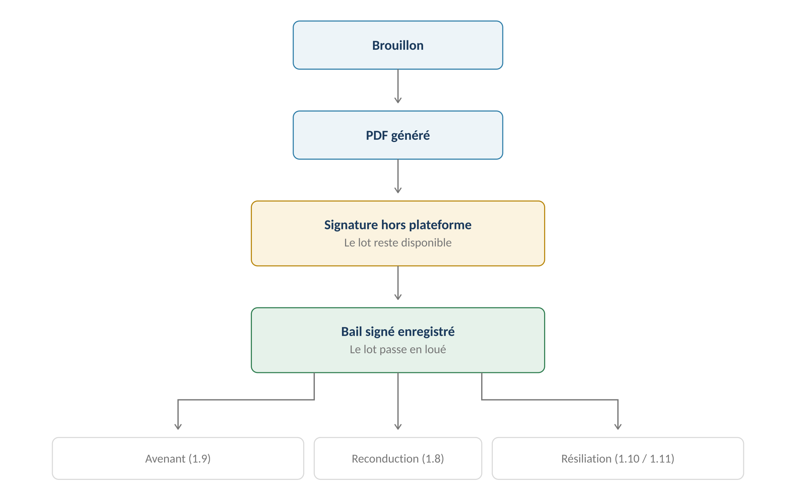
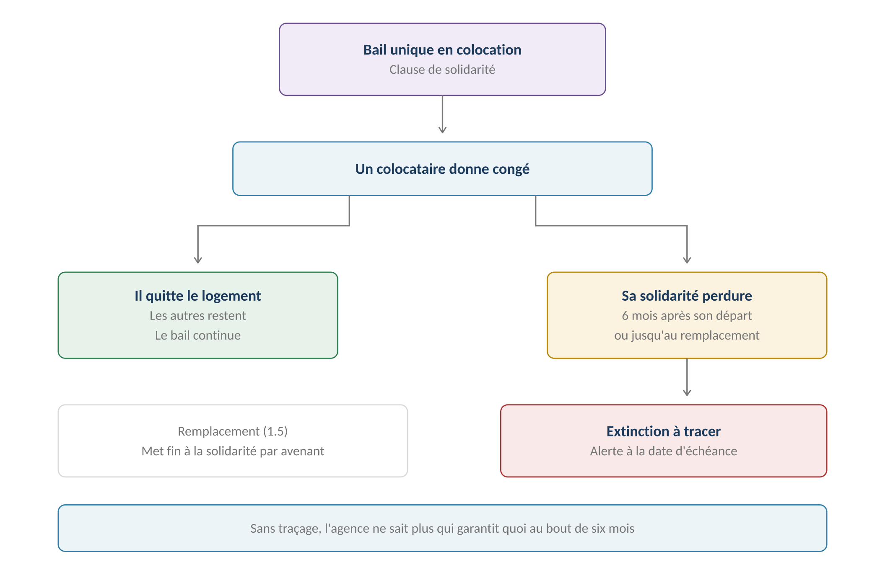
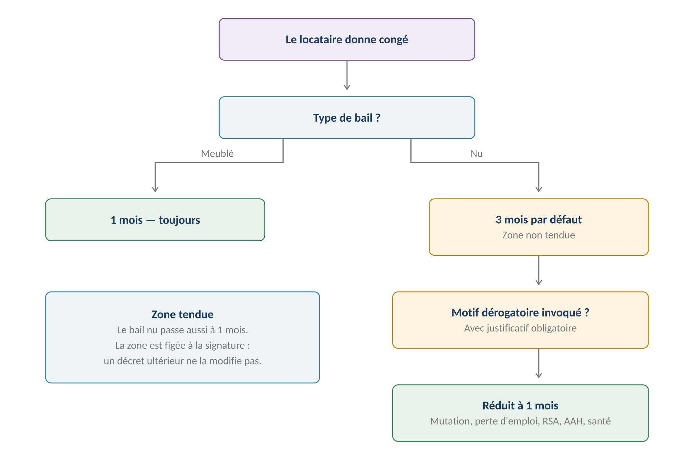

**GERIMMO V3**

Référentiel des parcours clients

**MODULE 1**

**Bail**

|               |                                                    |
|:--------------|:---------------------------------------------------|
| **Périmètre** | 15 parcours · 4 objets métier                      |
| **Dépend de** | Modules 0, 0b et 0c — le socle complet             |
| **Alimente**  | Garanties · Loyers · Comptabilité · Rapport        |
| **Criticité** | **MAXIMALE — densité réglementaire la plus forte** |
| **Cible**     | Baux conclus à partir du 1er octobre 2026          |
| **Statut**    | **Module clos — aucune question ouverte**          |

> **Vue d'ensemble du module**
>
> **Périmètre des baux couverts**
>
> Bail nu, bail meublé, colocation en bail unique et en contrats séparés.
>
> Hors périmètre : bail commercial, bail mobilité, bail rural, location saisonnière.

**Le cycle de vie du bail**

------------------------------------------------------------------------

*Schéma 1 — Le lot ne passe en loué qu'à l'enregistrement du bail signé*

> **Décision révisée — la signature électronique est en V1**
>
> Le référentiel prévoyait initialement une signature hors plateforme.
>
> Cette décision a été revue : le bail part en signature depuis l'application
>
> et revient signé automatiquement — module 13, prestataire Yousign.
>
> Les parcours 1.6 et 1.7 fusionnent en conséquence.
>
> C'est toujours la réception du bail signé qui active le bail et le lot.

**Objets créés dans ce module**

------------------------------------------------------------------------

| **Objet** | **Description** | **Rattaché à** |
|:---|:---|:---|
| **Bail** | Contrat de location, porté par un lot | Lot |
| **Occupant** | Lien locataire → bail, avec sa quote-part de solidarité | Bail + Personne |
| **Lien de garantie** | Lien garant → bail, avec sa date d'extinction | Bail + Personne |
| **État des lieux** | Constat d'entrée ou de sortie, pièce par pièce | Bail |

**Machine à états — Bail**

------------------------------------------------------------------------

| **État** | **Signification** | **Transitions possibles** |
|:---|:---|:---|
| **brouillon** | En cours de saisie | → à signer |
| **à signer** | PDF généré, transmis | → actif · → annulé |
| **actif** | Signé, en cours | → préavis · → reconduit |
| **préavis** | Congé donné, en cours de résiliation | → terminé · → actif |
| **terminé** | Locataire parti, EDL de sortie fait | → archivé |
| **annulé** | Abandonné avant signature | — |

**Cartographie des 15 parcours**

------------------------------------------------------------------------

| **\#** | **Parcours** | **Persona** | **V1 / V2** | **Criticité** |
|:---|:---|:---|:---|:---|
| 1.1 | Création bail nu | AG | **V1** | Haute |
| 1.2 | Création bail meublé | AG | **V1** | Haute |
| 1.3 | **Colocation — bail unique** | AG | **V1** | **MAXIMALE** |
| 1.4 | Colocation — contrats séparés | AG | **V2** | Moyenne |
| 1.5 | Remplacement d'un colocataire | AG | **V2** | Moyenne |
| 1.6 | **Génération et envoi en signature** | AG | **V1** | Haute |
| 1.7 | **Réception du bail signé** | Système | **V1** | Haute |
| 1.8 | Reconduction tacite | Système | **V1** | Moyenne |
| 1.9 | Avenant | AG | **V1** | Moyenne |
| 1.10 | **Résiliation par le locataire** | AG / LO | **V1** | **MAXIMALE** |
| 1.11 | **Congé du bailleur** | AG | **V1** | **MAXIMALE** |
| 1.12 | **État des lieux d'entrée** | AG | **V1** | **MAXIMALE** |
| 1.13 | **État des lieux de sortie** | AG | **V1** | **MAXIMALE** |
| 1.14 | Consultation du bail | LO | **V1** | Faible |
| 1.16 | Configuration des modèles | AA | **V1** | Moyenne |

> **Le parcours 1.15 n'existe plus**
>
> Il portait la création d'un bail par le propriétaire en gestion directe.
>
> Décision actée : ce persona est traité comme une variante sur les parcours existants,
>
> et non comme un jeu de parcours parallèle. Chaque parcours de ce module porte
>
> une section « Variante propriétaire en gestion directe » signalant ce qui change.
>
> **1.1 — Création d'un bail nu**

|                 |                                                          |
|:----------------|:---------------------------------------------------------|
| **Persona**     | AG — Agent immobilier                                    |
| **Déclencheur** | Un locataire est retenu pour un lot disponible           |
| **Fréquence**   | Régulière                                                |
| **Criticité**   | Haute — densité réglementaire                            |
| **Prérequis**   | Lot disponible · Diagnostics valides · Dossier locataire |

**Parcours nominal**

------------------------------------------------------------------------

| **\#** | **Acteur** | **Action** | **Écran / état** |
|:---|:---|:---|:---|
| 1 | AG | Depuis la fiche du lot, clique « Créer un bail » | Fiche lot |
| 2 | **Système** | **Vérifie que les diagnostics obligatoires sont valides** | Blocage si expirés |
| 3 | AG | Sélectionne le ou les locataires (0b.1) | Recherche de personne |
| 4 | **Système** | Alerte si le dossier locataire est incomplet | Alerte non bloquante |
| 5 | AG | Saisit la date d'entrée et la durée | Formulaire |
| 6 | AG | Saisit le loyer, les charges et leur mode | Formulaire |
| 7 | AG | Renseigne le dépôt de garantie | Formulaire |
| 8 | AG | Désigne le garant si nécessaire (0b.3) | Optionnel |
| 9 | **Système** | Calcule le premier loyer au prorata si entrée en cours de mois | Aperçu |
| 10 | AG | Valide | — |
| 11 | **Système** | Crée le bail en brouillon, le lot reste disponible | — |

> **Le prorata du premier loyer — décision actée**
>
> Une entrée le 15 du mois donne un premier appel couvrant quinze jours,
>
> calculé sur la base du nombre de jours réels du mois.
>
> Le calcul est proposé et affiché avant validation, de sorte que l'agent
>
> puisse le vérifier ou le corriger si le bail prévoit autre chose.

**Les mentions obligatoires du bail**

------------------------------------------------------------------------

| **Mention** | **Source** | **Obligatoire** |
|:---|:---|:---|
| **Identité des parties** | Personnes (0b.1) et propriétaires du lot (0.2) | **Oui** |
| **Désignation du logement** | Lot (0.5) — surface, pièces, équipements | **Oui** |
| **Date de prise d'effet et durée** | Saisie | **Oui** |
| **Loyer et modalités de révision** | Saisie — indice IRL de référence | **Oui** |
| **Charges et mode de règlement** | Saisie — provision ou forfait | **Oui** |
| **Dépôt de garantie** | Saisie — un mois maximum en nu | **Oui** |
| **Diagnostics annexés** | Lot et bien (0.6, 0.7) | **Oui** |
| **Notice d'information** | Modèle (1.16) | **Oui** |
| **Zone tendue** | **Déduite du code postal (RM-0.1.6)** | **Oui** |
| **Montant du dernier loyer** | Bail précédent, si moins de 18 mois | Si applicable |

**Variantes**

------------------------------------------------------------------------

| **Code** | **Situation** | **Comportement** |
|:---|:---|:---|
| **V1** | Locataire unique | Cas majoritaire. Aucune notion de solidarité. |
| **V2** | Couple ou colocation | Plusieurs occupants sur un bail unique. Voir 1.3. |
| **V3** | Entrée différée | Le bail est signé avant la date d'entrée. Le lot passe en loué à la signature. |
| **V4** | Charges au forfait | Aucune régularisation annuelle ne sera due. |
| **V5** | Relocation dans les 18 mois | Le montant du dernier loyer doit figurer au bail. |

> **Variante — propriétaire en gestion directe (PD)**
>
> Le propriétaire en gestion directe suit le même parcours.
>
> Ce qui change : il est lui-même le bailleur, il n'y a ni mandat ni honoraires de gestion,
>
> et aucun rapport de gestion ne sera produit à partir de ce bail.

**Cas d'erreur**

------------------------------------------------------------------------

| **Cas** | **Comportement attendu** |
|:---|:---|
| Diagnostic obligatoire expiré | **BLOCAGE — renvoi vers le dépôt de diagnostic (0.7)** |
| Lot déjà loué sur la période | **BLOCAGE — chevauchement de baux impossible** |
| Dossier locataire incomplet | **Alerte au gérant, la création reste possible** |
| Dépôt de garantie supérieur à un mois de loyer | **BLOCAGE — plafond légal en bail nu** |
| Date d'entrée antérieure à aujourd'hui | Accepté — régularisation d'une situation existante |

**Règles métier**

------------------------------------------------------------------------

> **RM-1.1.1** — Un bail porte toujours sur un lot, jamais sur un bien.
>
> **RM-1.1.2** — Un diagnostic obligatoire expiré bloque la création du bail (RM-0.6.3).
>
> **RM-1.1.3** — Deux baux actifs ne peuvent pas se chevaucher sur un même lot.
>
> **RM-1.1.4** — Un dossier locataire incomplet alerte le gérant mais ne bloque pas la création.
>
> **RM-1.1.5** — Le dépôt de garantie ne peut excéder un mois de loyer hors charges en bail nu.
>
> **RM-1.1.6** — Le premier loyer est calculé au prorata des jours en cas d'entrée en cours de mois.
>
> **RM-1.1.7** — La zone tendue est figée sur le bail à sa signature et ne change plus (RM-0.1.7).
>
> **RM-1.1.8** — La durée par défaut est de trois ans si le bailleur est une personne physique, six ans sinon.

**User stories**

------------------------------------------------------------------------

> **US-1.1.1**
>
> *En tant qu'agent immobilier, je veux être empêché de créer un bail si un diagnostic est expiré, afin de ne pas exposer l'agence à un risque juridique.*

- **Étant donné** un lot dont le DPE est expiré, **quand** je clique « Créer un bail », **alors** l'action est bloquée avec un lien vers le dépôt de diagnostic

- **Étant donné** que je dépose un DPE à jour, **quand** je relance la création, **alors** elle aboutit sans autre action

> **US-1.1.2**
>
> *En tant qu'agent immobilier, je veux voir le premier loyer calculé au prorata, afin de vérifier le montant avant de générer le bail.*

- **Étant donné** une entrée au 15 d'un mois de 31 jours et un loyer de 620 €, **quand** je saisis la date d'entrée, **alors** le premier loyer proposé est de 340 € pour 17 jours

- **Étant donné** un prorata proposé, **quand** je le corrige manuellement, **alors** la valeur saisie est retenue et la correction tracée

> **US-1.1.3**
>
> *En tant qu'agent immobilier, je veux être alerté d'un dossier incomplet sans être bloqué, afin de pouvoir avancer quand une pièce arrivera plus tard.*

- **Étant donné** un locataire dont l'avis d'imposition manque, **quand** je crée le bail, **alors** une alerte me signale la pièce manquante et la création aboutit

> **1.2 — Création d'un bail meublé**

|  |  |
|:---|:---|
| **Persona** | AG — Agent immobilier |
| **Déclencheur** | Location d'un lot meublé |
| **Fréquence** | Régulière |
| **Criticité** | Haute |
| **Différence clé** | Inventaire mobilier obligatoire · Durée et préavis réduits |

**Ce qui change par rapport au bail nu**

------------------------------------------------------------------------

| **Aspect** | **Bail nu** | **Bail meublé** |
|:---|:---|:---|
| **Durée minimale** | 3 ans (personne physique) | **1 an — 9 mois si étudiant** |
| **Préavis locataire** | 3 mois en zone non tendue | **1 mois toujours** |
| **Préavis bailleur** | 6 mois | **3 mois** |
| **Dépôt de garantie** | 1 mois maximum | **2 mois maximum** |
| **Inventaire mobilier** | Sans objet | **OBLIGATOIRE** |
| **Reconduction** | Tacite, 3 ans | **Tacite, 1 an — sauf bail étudiant** |

> **L'inventaire mobilier est une liste structurée**
>
> Décision de conception : ce n'est pas un PDF joint mais une liste d'éléments saisis,
>
> chacun avec sa quantité et son état.
>
> La raison est la même que pour l'état des lieux : sans structure, le comparatif
>
> de sortie est impossible et aucune retenue sur dépôt de garantie n'est défendable.

**Parcours nominal — écarts avec 1.1**

------------------------------------------------------------------------

| **\#** | **Acteur** | **Action** | **Écran / état** |
|:---|:---|:---|:---|
| 5b | AG | **Saisit l'inventaire mobilier pièce par pièce** | Onglet Inventaire |
| 5c | AG | Indique quantité et état de chaque élément | Tableau |
| 5d | **Système** | Contrôle la présence du mobilier minimum légal | Alerte non bloquante |
| 7b | **Système** | Autorise un dépôt de garantie jusqu'à deux mois | — |

**Le mobilier minimum légal**

------------------------------------------------------------------------

Le décret du 31 juillet 2015 fixe une liste d'éléments sans lesquels le logement ne peut être qualifié de meublé. Leur absence n'empêche pas la création du bail mais génère une alerte, car elle expose à une requalification en bail nu.

| **Catégorie**   | **Éléments attendus**                                  |
|:----------------|:-------------------------------------------------------|
| **Couchage**    | Literie avec couette ou couverture                     |
| **Occultation** | Volets ou rideaux dans les chambres                    |
| **Cuisine**     | Plaques de cuisson, four ou micro-ondes, réfrigérateur |
| **Congélation** | Compartiment à -6 °C au minimum                        |
| **Vaisselle**   | Vaisselle et ustensiles en nombre suffisant            |
| **Mobilier**    | Table, sièges, étagères de rangement                   |
| **Entretien**   | Matériel adapté au revêtement de sol                   |
| **Éclairage**   | Luminaires                                             |

**Variantes**

------------------------------------------------------------------------

| **Code** | **Situation** | **Comportement** |
|:---|:---|:---|
| **V1** | **Bail étudiant** | Durée de neuf mois, sans reconduction tacite. Le bail s'éteint à son terme. |
| **V2** | Meublé en colocation | Cumule les règles de 1.2 et 1.3. |
| **V3** | Mobilier incomplet | Alerte de requalification possible en bail nu. La création aboutit. |
| **V4** | Inventaire repris du bail précédent | L'inventaire du dernier bail sur ce lot est proposé en pré-remplissage. |

> **Variante — propriétaire en gestion directe (PD)**
>
> Identique à 1.1 : même parcours, sans mandat ni honoraires.

**Règles métier**

------------------------------------------------------------------------

> **RM-1.2.1** — Un bail meublé exige un inventaire mobilier structuré, non un document joint.
>
> **RM-1.2.2** — La durée minimale est d'un an, ramenée à neuf mois pour un bail étudiant.
>
> **RM-1.2.3** — Le bail étudiant de neuf mois ne se reconduit pas tacitement.
>
> **RM-1.2.4** — Le dépôt de garantie peut atteindre deux mois de loyer hors charges.
>
> **RM-1.2.5** — Le préavis du locataire est d'un mois, quelle que soit la zone.
>
> **RM-1.2.6** — L'absence de mobilier minimum génère une alerte de requalification, sans blocage.

**User stories**

------------------------------------------------------------------------

> **US-1.2.1**
>
> *En tant qu'agent immobilier, je veux saisir l'inventaire comme une liste structurée, afin de pouvoir le comparer à la sortie.*

- **Étant donné** un lot meublé, **quand** je crée le bail, **alors** un onglet Inventaire me demande la liste des éléments avec quantité et état

- **Étant donné** un inventaire saisi à l'entrée, **quand** l'état des lieux de sortie est réalisé, **alors** chaque élément est repris pour comparaison

> **US-1.2.2**
>
> *En tant qu'agent immobilier, je veux être alerté si le mobilier minimum manque, afin d'éviter une requalification du bail.*

- **Étant donné** un inventaire sans réfrigérateur, **quand** je valide, **alors** une alerte me signale le risque de requalification en bail nu

> **1.3 — Colocation en bail unique**
>
> **Le parcours le plus délicat du module**
>
> La clause de solidarité fait que chaque colocataire répond de la totalité du loyer.
>
> Quand l'un part, sa solidarité — et celle de son garant — perdure six mois,
>
> ou s'éteint plus tôt si un remplaçant arrive.
>
> Sans traçage de cette extinction, l'agence ne sait plus qui garantit quoi.

|                 |                                           |
|:----------------|:------------------------------------------|
| **Persona**     | AG — Agent immobilier                     |
| **Déclencheur** | Plusieurs locataires sur un même logement |
| **Fréquence**   | Fréquente en zone étudiante               |
| **Criticité**   | MAXIMALE                                  |
| **Alimente**    | Garanties (2.2) · Impayés (3.6)           |

**La mécanique de la solidarité**

------------------------------------------------------------------------

*Schéma 2 — Le départ d'un colocataire n'éteint pas immédiatement sa solidarité*

**Parcours nominal — écarts avec 1.1**

------------------------------------------------------------------------

| **\#** | **Acteur** | **Action** | **Écran / état** |
|:---|:---|:---|:---|
| 3b | AG | Sélectionne plusieurs locataires | Recherche multiple |
| 3c | AG | **Active la clause de solidarité** | Case à cocher |
| 8b | AG | Désigne un garant par colocataire | Optionnel mais fréquent |
| 8c | **Système** | Rattache chaque garant au colocataire qu'il couvre | — |
| 9b | **Système** | Émet un appel de loyer unique, non fractionné | — |

> **Un seul appel de loyer, pas un par colocataire**
>
> Le bail unique produit une seule créance. L'agence appelle le loyer entier,
>
> et les colocataires s'organisent entre eux.
>
> Fractionner l'appel reviendrait à nier la solidarité : en cas d'impayé partiel,
>
> l'agence pourrait réclamer la totalité à n'importe lequel d'entre eux.

**Le calendrier de la solidarité**

------------------------------------------------------------------------

| **Événement** | **Effet sur la solidarité** | **Trace attendue** |
|:---|:---|:---|
| **Signature du bail** | Solidarité active pour tous | Date de début |
| **Congé d'un colocataire** | **Solidarité maintenue** | Date de congé enregistrée |
| **Départ effectif** | **Compteur de six mois lancé** | Date d'échéance calculée |
| **Arrivée d'un remplaçant** | **Extinction anticipée** | Avenant (1.5) |
| **Échéance des six mois** | **Extinction automatique** | Alerte + date d'extinction |

**Variantes**

------------------------------------------------------------------------

| **Code** | **Situation** | **Comportement** |
|:---|:---|:---|
| **V1** | Colocation sans clause de solidarité | Chacun ne répond que de sa part. Rare mais possible. |
| **V2** | Couple marié ou pacsé | Solidarité légale automatique, sans clause nécessaire. |
| **V3** | **Départ d'un colocataire** | Le bail continue. Voir le calendrier ci-dessus. |
| **V4** | Départ de tous | Le bail prend fin, comme une résiliation ordinaire (1.10). |
| **V5** | Remplacement | Avenant au bail. Voir 1.5. |

**Cas d'erreur**

------------------------------------------------------------------------

| **Cas** | **Comportement attendu** |
|:---|:---|
| Dernier colocataire donnant congé | Bascule vers une résiliation ordinaire (1.10) |
| Solidarité éteinte et impayé antérieur | **L'ancien colocataire reste tenu des dettes nées avant extinction** |
| Garant sans colocataire rattaché | **BLOCAGE — chaque garant couvre un colocataire identifié** |

**Règles métier**

------------------------------------------------------------------------

> **RM-1.3.1** — Un bail unique en colocation produit un seul appel de loyer, non fractionné.
>
> **RM-1.3.2** — La clause de solidarité rend chaque colocataire tenu de la totalité.
>
> **RM-1.3.3** — Le départ d'un colocataire n'éteint pas immédiatement sa solidarité.
>
> **RM-1.3.4** — La solidarité s'éteint six mois après le départ, ou à l'arrivée d'un remplaçant.
>
> **RM-1.3.5** — La date d'extinction est calculée, tracée, et fait l'objet d'une alerte.
>
> **RM-1.3.6** — La solidarité du garant suit celle du colocataire qu'il couvre.
>
> **RM-1.3.7** — L'extinction ne libère pas des dettes nées avant elle.
>
> **RM-1.3.8** — Chaque garant est rattaché à un colocataire identifié, jamais au bail en bloc.

**User stories**

------------------------------------------------------------------------

> **US-1.3.1**
>
> *En tant qu'agent immobilier, je veux que la date d'extinction de solidarité soit calculée et tracée, afin de savoir qui garantit quoi à tout moment.*

- **Étant donné** un colocataire parti le 30 juin, **quand** son départ est enregistré, **alors** une date d'extinction au 31 décembre est calculée et affichée

- **Étant donné** cette date d'extinction, **quand** elle est atteinte, **alors** une alerte me signale que sa solidarité et celle de son garant ont cessé

> **US-1.3.2**
>
> *En tant qu'agent immobilier, je veux qu'un remplaçant éteigne la solidarité par anticipation, afin de libérer le partant dès que possible.*

- **Étant donné** un colocataire parti avec une solidarité courant jusqu'au 31 décembre, **quand** un remplaçant entre au 1er septembre par avenant, **alors** la solidarité du partant s'éteint à cette date

> **US-1.3.3**
>
> *En tant qu'agent immobilier, je veux un appel de loyer unique, afin que la solidarité reste opposable en cas d'impayé.*

- **Étant donné** un bail unique à trois colocataires, **quand** l'appel de loyer mensuel est émis, **alors** un seul appel est produit pour le montant entier

> **1.4 & 1.5 — Contrats séparés et remplacement**
>
> **Ces deux parcours sont reportés en V2**
>
> La colocation en contrats séparés est moins fréquente que le bail unique
>
> et double la complexité de la quittance : chaque colocataire a son propre appel,
>
> son propre solde et sa propre régularisation de charges.
>
> Le remplacement de colocataire en dépend partiellement.

**1.4 — Colocation en contrats séparés**

------------------------------------------------------------------------

| **Aspect** | **Bail unique (1.3)** | **Contrats séparés (1.4)** |
|:---|:---|:---|
| **Nombre de baux** | Un | **Un par colocataire** |
| **Appel de loyer** | Un seul, entier | **Un par colocataire** |
| **Solidarité** | Totale entre colocataires | **Aucune** |
| **Objet du bail** | Le logement entier | **Une chambre + parties communes** |
| **Départ d'un colocataire** | Le bail continue | **Son bail seul prend fin** |
| **Régularisation** | Une pour le logement | **Une par colocataire, au prorata** |

> **Conséquence sur le modèle de données**
>
> Un lot pourrait porter plusieurs baux actifs simultanément, ce que RM-1.1.3 interdit.
>
> La V2 devra donc introduire la notion de sous-lot, ou assouplir cette règle
>
> pour les seuls contrats séparés. Point à trancher au moment de la V2.

**1.5 — Remplacement d'un colocataire**

------------------------------------------------------------------------

| **\#** | **Acteur** | **Action** | **Écran / état** |
|:---|:---|:---|:---|
| 1 | AG | Enregistre le congé du colocataire sortant | Fiche bail |
| 2 | AG | Sélectionne le colocataire entrant | Recherche de personne |
| 3 | AG | Désigne son garant | Optionnel |
| 4 | **Système** | Génère un avenant au bail | PDF |
| 5 | AG | Fait signer l'avenant par toutes les parties | Hors plateforme |
| 6 | AG | Enregistre l'avenant signé | Upload |
| 7 | **Système** | **Éteint la solidarité du sortant à la date de l'avenant** | — |

**Règles métier**

------------------------------------------------------------------------

> **RM-1.4.1** — Les contrats séparés sont hors périmètre V1.
>
> **RM-1.4.2** — Leur mise en œuvre supposera de revoir RM-1.1.3 sur le chevauchement des baux.
>
> **RM-1.5.1** — Le remplacement d'un colocataire se fait par avenant, jamais par nouveau bail.
>
> **RM-1.5.2** — L'avenant signé éteint la solidarité du sortant à sa date d'effet.
>
> **RM-1.5.3** — L'entrant reprend la solidarité à compter de la même date.
>
> **1.6 & 1.7 — Génération et signature du bail**

|                      |                                               |
|:---------------------|:----------------------------------------------|
| **Persona**          | AG — Agent immobilier                         |
| **Déclencheur**      | Bail en brouillon, prêt à être signé          |
| **Fréquence**        | À chaque bail                                 |
| **Criticité**        | Haute — c'est la signature qui active le bail |
| **Décision révisée** | **Signature électronique en V1 — module 13**  |

> **Ces deux parcours ont fusionné**
>
> Le circuit initial comportait deux étapes manuelles : transmettre le PDF
>
> par ses propres moyens, puis téléverser le document signé.
>
> Avec la signature électronique, le bail part depuis l'application
>
> et revient signé automatiquement. L'agent n'intervient plus entre les deux.

**1.6 — Génération et envoi en signature**

------------------------------------------------------------------------

| **\#** | **Acteur** | **Action** | **Écran / état** |
|:---|:---|:---|:---|
| 1 | AG | Depuis le bail en brouillon, clique « Envoyer en signature » | Fiche bail |
| 2 | **Système** | Sélectionne le modèle correspondant au type de bail (1.16) | — |
| 3 | **Système** | Fusionne les données du lot, des parties et du bail | — |
| 4 | **Système** | **Annexe les diagnostics en cours de validité** | — |
| 5 | **Système** | Annexe la notice d'information et l'inventaire si meublé | — |
| 6 | **Système** | Produit le PDF et le dépose en GED | Module 12 |
| 7 | AG | Vérifie les signataires et leurs coordonnées | Module 13 |
| 8 | **Système** | **Envoie en signature séquentielle** | Yousign |
| 9 | **Système** | Passe le bail en « à signer » ; le lot reste disponible | — |

**L'ordre de signature du bail**

------------------------------------------------------------------------

| **Rang** | **Signataire** | **Remarque** |
|:---|:---|:---|
| **1** | Le locataire | Il s'engage en premier |
| **2** | Chaque colocataire | S'il y en a — dans l'ordre du bail |
| **3** | Chaque garant | Après le colocataire qu'il couvre |
| **4** | **Le bailleur ou son mandataire** | En dernier — RM-13.1.2 |

**1.7 — Réception du bail signé**

------------------------------------------------------------------------

| **\#** | **Acteur** | **Action** | **Écran / état** |
|:---|:---|:---|:---|
| 1 | **Système** | Le dernier signataire a signé (module 13) | Yousign |
| 2 | **Système** | Rapatrie le document signé et l'horodatage | GED |
| 3 | **Système** | **Passe le bail en actif et le lot en loué** | — |
| 4 | **Système** | Crée l'échéancier de loyer (3.1) | — |
| 5 | **Système** | Crée l'alerte d'état des lieux d'entrée (1.12) | — |
| 6 | **Système** | Notifie l'agent et les signataires | — |

> **Ce que la signature déclenche**
>
> Le lot passe en loué, même si la date d'entrée est ultérieure — RM-1.7.1.
>
> L'échéancier de loyer est créé, calé sur la date d'entrée.
>
> L'alerte d'état des lieux d'entrée est programmée.
>
> Ces trois conséquences sont inchangées : seul le circuit de signature a évolué.

**Variantes**

------------------------------------------------------------------------

| **Code** | **Situation** | **Comportement** |
|:---|:---|:---|
| **V1** | Correction avant envoi | Retour en brouillon, modification, nouvelle génération. |
| **V2** | **Refus d'un signataire** | Le circuit s'interrompt. L'agent est alerté avec le motif (RM-13.2.5). |
| **V3** | **Expiration à trente jours** | Le bail reste en « à signer », le lot disponible. Relançable en un clic. |
| **V4** | Bail abandonné | Le bail passe en annulé. Le lot reste disponible. |
| **V5** | Entrée différée | Le lot passe en loué dès la signature, même si l'entrée est ultérieure. |
| **V6** | **Signataire sans email** | BLOCAGE — la demande ne peut partir (RM-13.1.3). |

**Cas d'erreur**

------------------------------------------------------------------------

| **Cas** | **Comportement attendu** |
|:---|:---|
| Diagnostic expiré entre envoi et signature | **Alerte à l'agent — annuler la demande et régénérer** |
| Bail déjà actif sur ce lot | **BLOCAGE — chevauchement impossible** |
| Modification du bail pendant la signature | **BLOCAGE — RM-13.2.7** |
| Échec de rapatriement du document signé | Alerte, nouvelle tentative automatique |

**Règles métier**

------------------------------------------------------------------------

> **RM-1.6.1** — Le PDF généré annexe automatiquement les diagnostics en cours de validité.
>
> **RM-1.6.2** — La génération déclenche l'envoi en signature ; le bail passe en « à signer ».
>
> **RM-1.6.3** — Le lot reste disponible tant que la signature n'est pas complète.
>
> **RM-1.6.4** — L'ordre de signature place le bailleur en dernier (RM-13.1.2).
>
> **RM-1.7.1** — La réception du bail signé fait passer le lot en loué.
>
> **RM-1.7.2** — Le document signé fait foi ; il est rapatrié avec son horodatage.
>
> **RM-1.7.3** — La signature déclenche la création de l'échéancier et l'alerte d'EDL.
>
> **RM-1.7.4** — Un bail ne peut être modifié pendant qu'une signature est en cours.

**User stories**

------------------------------------------------------------------------

> **US-1.7.1**
>
> *En tant qu'agent immobilier, je veux que le lot passe en loué dès la signature complète, afin qu'il disparaisse des lots à louer.*

- **Étant donné** un bail signé par toutes les parties, avec une entrée dans trois semaines, **quand** le document signé est rapatrié, **alors** le lot passe immédiatement en loué

- **Étant donné** ce même bail, **quand** je consulte l'échéancier, **alors** le premier appel est daté de la date d'entrée, non de la signature

> **US-1.7.2**
>
> *En tant qu'agent immobilier, je veux que le lot reste disponible tant que rien n'est signé, afin de pouvoir le proposer si le candidat se désiste.*

- **Étant donné** un bail envoyé en signature depuis vingt jours, **quand** aucun signataire n'a encore signé, **alors** le lot reste disponible et le bail en « à signer »

- **Étant donné** une demande de signature expirée, **quand** je la relance, **alors** une nouvelle demande part sans régénérer le bail

> **1.8 & 1.9 — Reconduction et avenant**

**1.8 — Reconduction tacite**

------------------------------------------------------------------------

|                 |                                                      |
|:----------------|:-----------------------------------------------------|
| **Persona**     | Système → AG                                         |
| **Déclencheur** | Approche du terme du bail                            |
| **Fréquence**   | Tous les trois ans en nu, tous les ans en meublé     |
| **Criticité**   | Moyenne                                              |
| **Principe**    | Alerte à l'agent, jamais de reconduction silencieuse |

| **\#** | **Acteur** | **Action** | **Écran / état** |
|:---|:---|:---|:---|
| 1 | **Système** | Détecte l'approche du terme, six mois avant | — |
| 2 | **Système** | Crée une alerte à l'agent en charge | Tableau de bord |
| 3 | AG | Décide : laisser reconduire, ou délivrer congé (1.11) | — |
| 4 | **Système** | Au terme, reconduit le bail pour la même durée | — |
| 5 | **Système** | Enregistre la nouvelle échéance | Fiche bail |

> **Six mois d'avance, pas moins**
>
> Le congé du bailleur en bail nu exige un préavis de six mois avant le terme.
>
> Une alerte plus tardive rendrait le congé impossible pour cette échéance.
>
> C'est pourquoi l'alerte se déclenche à six mois et non à trois.

**1.9 — Avenant au bail**

------------------------------------------------------------------------

|                 |                                            |
|:----------------|:-------------------------------------------|
| **Persona**     | AG — Agent immobilier                      |
| **Déclencheur** | Modification d'une clause en cours de bail |
| **Fréquence**   | Occasionnelle                              |
| **Criticité**   | Moyenne                                    |
| **Principe**    | Le bail d'origine n'est jamais modifié     |

| **Motif d'avenant** | **Ce qui change** | **Fréquence** |
|:---|:---|:---|
| **Changement de colocataire** | Occupants et solidarité (1.5) | Fréquent en colocation |
| **Modification du logement** | Surface, équipements | Rare |
| **Changement de garant** | Lien de garantie | Occasionnel |
| **Ajout d'une clause** | Animaux, sous-location | Occasionnel |
| **Modification du loyer** | Hors révision IRL, qui ne nécessite pas d'avenant | Rare |

**Règles métier**

------------------------------------------------------------------------

> **RM-1.8.1** — L'alerte de reconduction se déclenche six mois avant le terme.
>
> **RM-1.8.2** — La reconduction n'est jamais automatique sans alerte préalable à l'agent.
>
> **RM-1.8.3** — Le bail étudiant de neuf mois ne se reconduit pas (RM-1.2.3).
>
> **RM-1.9.1** — Un avenant ne modifie jamais le bail d'origine : il s'y ajoute.
>
> **RM-1.9.2** — Un avenant suit le même circuit que le bail : génération, signature, enregistrement.
>
> **RM-1.9.3** — La révision annuelle IRL ne nécessite pas d'avenant (module 3).

**User story**

------------------------------------------------------------------------

> **US-1.8.1**
>
> *En tant qu'agent immobilier, je veux être alerté six mois avant le terme, afin de pouvoir délivrer congé si le propriétaire le souhaite.*

- **Étant donné** un bail nu arrivant à terme dans six mois, **quand** la tâche quotidienne s'exécute, **alors** une alerte m'invite à décider entre reconduction et congé

- **Étant donné** que je ne fais rien, **quand** le terme est atteint, **alors** le bail est reconduit pour la même durée

> **1.10 — Résiliation par le locataire**

|                 |                                                    |
|:----------------|:---------------------------------------------------|
| **Persona**     | AG — Agent immobilier · LO — Locataire             |
| **Déclencheur** | Le locataire donne congé                           |
| **Fréquence**   | Régulière                                          |
| **Criticité**   | MAXIMALE — le calcul du préavis engage l'agence    |
| **Alimente**    | EDL de sortie (1.13) · Solde de tout compte (3.11) |

**Le calcul du préavis**

------------------------------------------------------------------------

*Schéma 3 — Le préavis dépend du type de bail, de la zone, et d'un éventuel motif dérogatoire*

**Parcours nominal**

------------------------------------------------------------------------

| **\#** | **Acteur** | **Action** | **Écran / état** |
|:---|:---|:---|:---|
| 1 | LO | Adresse son congé par lettre recommandée ou acte | Hors plateforme |
| 2 | AG | Depuis la fiche bail, clique « Enregistrer un congé » | Fiche bail |
| 3 | AG | Saisit la date de réception du congé | Formulaire |
| 4 | **Système** | **Calcule le préavis : type de bail + zone tendue** | Proposition |
| 5 | AG | Indique si un motif dérogatoire est invoqué | Sélecteur |
| 6 | AG | **Joint le justificatif du motif** | Upload obligatoire |
| 7 | **Système** | Recalcule le préavis à un mois | — |
| 8 | **Système** | Affiche la date de fin de bail | Aperçu |
| 9 | AG | Valide | — |
| 10 | **Système** | Passe le bail en préavis et le lot en préavis | — |
| 11 | **Système** | Crée l'alerte d'EDL de sortie | Agenda |

**Les motifs de préavis réduit**

------------------------------------------------------------------------

| **Motif** | **Justificatif attendu** | **Préavis** |
|:---|:---|:---|
| **Mutation professionnelle** | Attestation de l'employeur | **1 mois** |
| **Perte d'emploi** | Lettre de licenciement, rupture | **1 mois** |
| **Nouvel emploi après perte** | Contrat de travail | **1 mois** |
| **Premier emploi** | Contrat de travail | **1 mois** |
| **Bénéficiaire du RSA ou de l'AAH** | Attestation CAF ou MDPH | **1 mois** |
| **État de santé** | Certificat médical | **1 mois** |
| **Logement social attribué** | Notification d'attribution | **1 mois** |
| **Violences conjugales** | Ordonnance de protection ou plainte | **1 mois** |

> **Le justificatif est obligatoire — décision actée**
>
> Sans pièce jointe, le motif dérogatoire ne peut pas être retenu.
>
> C'est une protection pour l'agence : si le propriétaire conteste la réduction du préavis,
>
> la pièce justifie la décision. Sans elle, l'agence a accordé une faveur indéfendable.

**Variantes**

------------------------------------------------------------------------

| **Code** | **Situation** | **Comportement** |
|:---|:---|:---|
| **V1** | Bail meublé | Préavis d'un mois sans motif à invoquer. |
| **V2** | Zone tendue | Bail nu à un mois, sans motif nécessaire. |
| **V3** | **Colocation, un seul partant** | Le bail continue. La solidarité court six mois (1.3). |
| **V4** | Rétractation du congé | Possible avec accord du bailleur. Le bail repasse en actif. |
| **V5** | Départ anticipé | Le locataire part avant la fin du préavis mais reste redevable du loyer. |
| **V6** | Relocation pendant le préavis | Le préavis s'interrompt à l'entrée du nouveau locataire. |

**Cas d'erreur**

------------------------------------------------------------------------

| **Cas** | **Comportement attendu** |
|:---|:---|
| Motif dérogatoire sans justificatif | **BLOCAGE — la pièce est obligatoire** |
| Date de congé antérieure au bail | **BLOCAGE à la validation** |
| Congé sur un bail déjà en préavis | **BLOCAGE — un congé est déjà enregistré** |
| Date de fin tombant un jour non ouvré | Aucun report : le préavis court en jours calendaires |

**Règles métier**

------------------------------------------------------------------------

> **RM-1.10.1** — Le préavis court à compter de la réception du congé, non de son envoi.
>
> **RM-1.10.2** — Le préavis est de trois mois en bail nu, un mois en meublé.
>
> **RM-1.10.3** — La zone tendue ramène le bail nu à un mois, sans motif nécessaire.
>
> **RM-1.10.4** — Un motif dérogatoire ramène le préavis à un mois, justificatif obligatoire.
>
> **RM-1.10.5** — Sans justificatif joint, le motif dérogatoire ne peut être retenu — blocage.
>
> **RM-1.10.6** — Le préavis court en jours calendaires, sans report de jour non ouvré.
>
> **RM-1.10.7** — La zone retenue est celle figée au bail, non la zone actuelle (RM-1.1.7).
>
> **RM-1.10.8** — Le locataire reste redevable du loyer jusqu'au terme du préavis, même parti.

**User stories**

------------------------------------------------------------------------

> **US-1.10.1**
>
> *En tant qu'agent immobilier, je veux que le préavis soit calculé automatiquement, afin de ne pas me tromper sur la date de fin de bail.*

- **Étant donné** un bail nu en zone non tendue et un congé reçu le 10 mars, **quand** je saisis la date de réception, **alors** la date de fin proposée est le 10 juin

- **Étant donné** un bail meublé, **quand** je saisis la même date, **alors** la date de fin proposée est le 10 avril

> **US-1.10.2**
>
> *En tant qu'agent immobilier, je veux être bloqué si le justificatif manque, afin de pouvoir défendre la réduction du préavis auprès du propriétaire.*

- **Étant donné** un motif de mutation professionnelle sélectionné, **quand** je valide sans joindre l'attestation, **alors** la validation est refusée

- **Étant donné** l'attestation jointe, **quand** je valide, **alors** le préavis passe à un mois et la pièce reste attachée au congé

> **US-1.10.3**
>
> *En tant qu'agent immobilier, je veux que la zone du bail prime sur la zone actuelle, afin qu'un décret ne change pas le préavis d'un locataire en place.*

- **Étant donné** un bail signé en zone non tendue, **quand** la commune est reclassée en zone tendue, **alors** le préavis reste de trois mois pour ce bail

> **1.11 — Congé délivré par le bailleur**
>
> **Trois motifs seulement, et un formalisme strict**
>
> Le bailleur ne peut donner congé qu'à l'échéance du bail, pour l'un de trois motifs :
>
> reprise pour habiter, vente, ou motif légitime et sérieux.
>
> Un congé mal motivé ou hors délai est nul : le bail se reconduit malgré tout.

|                 |                                                    |
|:----------------|:---------------------------------------------------|
| **Persona**     | AG — Agent immobilier                              |
| **Déclencheur** | Décision du propriétaire à l'échéance du bail      |
| **Fréquence**   | Occasionnelle                                      |
| **Criticité**   | MAXIMALE — la nullité du congé est fréquente       |
| **Périmètre**   | Génération du congé uniquement — préemption exclue |

**Les trois motifs**

------------------------------------------------------------------------

| **Motif** | **Conditions** | **Mentions obligatoires** |
|:---|:---|:---|
| **Reprise pour habiter** | Bénéficiaire dans le cercle familial défini par la loi | Identité et lien de parenté du bénéficiaire |
| **Vente** | Le congé vaut offre de vente au locataire | **Prix et conditions de la vente** |
| **Motif légitime et sérieux** | Impayés répétés, troubles, défaut d'assurance | Description précise et circonstanciée |

**Parcours nominal**

------------------------------------------------------------------------

| **\#** | **Acteur** | **Action** | **Écran / état** |
|:---|:---|:---|:---|
| 1 | AG | Depuis la fiche bail, clique « Délivrer congé » | Fiche bail |
| 2 | **Système** | **Vérifie que le délai de préavis est tenable** | Blocage si trop tard |
| 3 | AG | Sélectionne le motif | Sélecteur |
| 4 | AG | Renseigne les mentions propres au motif | Formulaire conditionnel |
| 5 | **Système** | Calcule la date d'effet : terme du bail | — |
| 6 | **Système** | Génère le congé au format légal | PDF |
| 7 | AG | Transmet par lettre recommandée ou acte d'huissier | Hors plateforme |
| 8 | AG | Enregistre la date de notification | Formulaire |
| 9 | **Système** | Passe le bail en préavis | — |
| 10 | **Système** | **Si vente : crée l'alerte de préemption à deux mois** | Agenda |

> **L'alerte de préemption — décision actée**
>
> Le droit de préemption du locataire est hors périmètre : Gerimmo ne gère pas
>
> l'offre, la réponse, ni la vente elle-même.
>
> Mais le congé pour vente vaut offre, et le locataire a deux mois pour se prononcer.
>
> Une alerte de rappel est créée à cette échéance, pour que l'agence n'oublie pas
>
> de vérifier la réponse — le manquement rendrait la vente contestable.

**Les délais de préavis**

------------------------------------------------------------------------

| **Type de bail**         | **Préavis** | **Point de départ**          |
|:-------------------------|:------------|:-----------------------------|
| **Bail nu**              | **6 mois**  | Avant le terme du bail       |
| **Bail meublé**          | **3 mois**  | Avant le terme du bail       |
| **Bail étudiant 9 mois** | Sans objet  | Le bail s'éteint à son terme |

**Variantes**

------------------------------------------------------------------------

| **Code** | **Situation** | **Comportement** |
|:---|:---|:---|
| **V1** | **Locataire protégé** | Plus de 65 ans et ressources modestes : congé impossible sans relogement. Alerte. |
| **V2** | Congé pour vente | Le congé vaut offre. Alerte de préemption à deux mois. |
| **V3** | Rétractation du bailleur | Possible avant la date d'effet. Le bail repasse en actif. |
| **V4** | Congé contesté | Hors périmètre : le contentieux se traite en dehors de l'application. |

**Cas d'erreur**

------------------------------------------------------------------------

| **Cas** | **Comportement attendu** |
|:---|:---|
| Délai de préavis insuffisant | **BLOCAGE — le congé serait nul, report à l'échéance suivante** |
| Congé hors échéance du bail | **BLOCAGE — le congé ne vaut qu'au terme** |
| Motif de vente sans prix renseigné | **BLOCAGE — mention obligatoire** |
| Locataire protégé | **Alerte forte, la génération reste possible sous la responsabilité de l'agence** |

**Règles métier**

------------------------------------------------------------------------

> **RM-1.11.1** — Le congé du bailleur n'est possible qu'au terme du bail.
>
> **RM-1.11.2** — Le préavis est de six mois en bail nu, trois mois en meublé.
>
> **RM-1.11.3** — Un préavis insuffisant bloque la génération : le congé serait nul.
>
> **RM-1.11.4** — Seuls trois motifs sont admis : reprise, vente, motif légitime et sérieux.
>
> **RM-1.11.5** — Le congé pour vente exige le prix et les conditions — mention obligatoire.
>
> **RM-1.11.6** — Un congé pour vente crée une alerte de préemption à deux mois.
>
> **RM-1.11.7** — Le statut de locataire protégé génère une alerte, sans blocage.
>
> **RM-1.11.8** — Le droit de préemption lui-même est hors périmètre.

**User stories**

------------------------------------------------------------------------

> **US-1.11.1**
>
> *En tant qu'agent immobilier, je veux être bloqué si le délai est trop court, afin de ne pas délivrer un congé nul.*

- **Étant donné** un bail nu arrivant à terme dans quatre mois, **quand** je tente de délivrer congé, **alors** l'action est bloquée : six mois de préavis sont exigés

- **Étant donné** ce blocage, **quand** je consulte le message, **alors** la prochaine échéance possible m'est indiquée

> **US-1.11.2**
>
> *En tant qu'agent immobilier, je veux une alerte à deux mois après un congé pour vente, afin de ne pas manquer le délai de préemption.*

- **Étant donné** un congé pour vente notifié le 1er mars, **quand** le 1er mai approche, **alors** une alerte me rappelle de vérifier la réponse du locataire

> **US-1.11.3**
>
> *En tant qu'agent immobilier, je veux être alerté si le locataire est protégé, afin de prévenir le propriétaire du risque.*

- **Étant donné** un locataire de plus de 65 ans, **quand** je sélectionne le motif de congé, **alors** une alerte me signale l'obligation éventuelle de relogement

> **1.12 & 1.13 — États des lieux**
>
> **Sans état des lieux, aucune retenue n'est possible**
>
> En l'absence d'état des lieux d'entrée, le logement est réputé avoir été remis
>
> en bon état. Le bailleur ne peut alors retenir aucune somme sur le dépôt de garantie,
>
> quelles que soient les dégradations constatées à la sortie.
>
> C'est pourquoi ces deux parcours conditionnent tout le module 2.

|                    |                                                     |
|:-------------------|:----------------------------------------------------|
| **Persona**        | AG — Agent immobilier                               |
| **Déclencheur**    | Entrée ou sortie du locataire                       |
| **Fréquence**      | Deux fois par bail                                  |
| **Criticité**      | MAXIMALE                                            |
| **Décision actée** | Saisie native pièce par pièce, avec parcours mobile |

**De l'entrée à la retenue**

------------------------------------------------------------------------

*Schéma 4 — Le comparatif automatique est ce qui rend une retenue défendable*

**La structure de l'état des lieux**

------------------------------------------------------------------------

| **Niveau** | **Contenu** | **Source** |
|:---|:---|:---|
| **Pièce** | Séjour, chambre 1, cuisine, salle de bains… | Lot (0.5) |
| **Élément** | Murs, sol, plafond, fenêtres, porte | Liste standard |
| **Équipement** | Chaudière, hotte, radiateurs | **Liste fermée (RM-0.5.5)** |
| **État** | Neuf, bon, usagé, mauvais | Échelle fixe |
| **Photos** | Une ou plusieurs par élément | Prise mobile |
| **Observation** | Texte libre par élément | Saisie |

> **Pourquoi la liste fermée d'équipements compte ici**
>
> Décision du module 0 : les équipements du lot sont choisis dans une liste paramétrée.
>
> C'est ce qui permet de générer la grille d'état des lieux automatiquement,
>
> et surtout de garantir que la grille de sortie porte exactement les mêmes lignes
>
> que celle d'entrée. Sans liste fermée, le comparatif serait impossible à établir.

**1.12 — État des lieux d'entrée**

------------------------------------------------------------------------

| **\#** | **Acteur** | **Action** | **Écran / état** |
|:---|:---|:---|:---|
| 1 | **Système** | Alerte créée à l'enregistrement du bail signé (1.7) | Agenda |
| 2 | AG | Sur place, ouvre l'état des lieux sur mobile | Application mobile |
| 3 | **Système** | **Génère la grille depuis les pièces et équipements du lot** | Grille pré-remplie |
| 4 | AG | Parcourt chaque pièce, qualifie chaque élément | Saisie mobile |
| 5 | AG | Prend les photos au fil de la visite | Appareil photo |
| 6 | AG | Relève les compteurs | Formulaire |
| 7 | AG | Fait signer le locataire sur l'écran | Signature tactile |
| 8 | **Système** | Génère le PDF et le rattache au bail | — |
| 9 | **Système** | Fige l'état des lieux : plus aucune modification | Verrouillage |

**1.13 — État des lieux de sortie**

------------------------------------------------------------------------

| **\#** | **Acteur** | **Action** | **Écran / état** |
|:---|:---|:---|:---|
| 1 | **Système** | Alerte créée à l'enregistrement du congé (1.10 ou 1.11) | Agenda |
| 2 | AG | Sur place, ouvre l'état des lieux de sortie | Application mobile |
| 3 | **Système** | **Reprend la grille d'entrée, avec l'état constaté alors** | Grille comparative |
| 4 | AG | Qualifie l'état de sortie de chaque élément | Saisie mobile |
| 5 | **Système** | Met en évidence chaque écart entrée / sortie | Badge par ligne |
| 6 | AG | Photographie les écarts | Appareil photo |
| 7 | AG | Relève les compteurs | Formulaire |
| 8 | AG | Fait signer le locataire | Signature tactile |
| 9 | **Système** | Produit le comparatif et le rattache au bail | — |
| 10 | **Système** | **Transmet les écarts au module 2 pour la restitution** | — |

**L'échelle d'état**

------------------------------------------------------------------------

| **État** | **Signification** | **Écart imputable ?** |
|:---|:---|:---|
| **Neuf** | Élément jamais utilisé | — |
| **Bon** | Usage normal, aucun défaut | — |
| **Usagé** | Traces d'usage normal | Non — vétusté |
| **Mauvais** | Dégradation au-delà de l'usage | **Oui, sous réserve de vétusté** |

> **La vétusté n'est pas une dégradation**
>
> Un revêtement passé de « bon » à « usagé » après trois ans d'occupation relève
>
> de l'usage normal : aucune retenue n'est possible.
>
> Seul un écart au-delà de l'usure attendue est imputable au locataire.
>
> L'application signale l'écart ; c'est l'agent qui décide s'il est imputable,
>
> au module 2. Le module 1 constate, il ne juge pas.

**Variantes**

------------------------------------------------------------------------

| **Code** | **Situation** | **Comportement** |
|:---|:---|:---|
| **V1** | Locataire absent à la sortie | EDL réalisé par huissier. Le document est déposé et rattaché. |
| **V2** | Refus de signature | Constat du refus. L'EDL vaut, mais sa portée est affaiblie. |
| **V3** | Absence de réseau sur place | Saisie hors ligne, synchronisation au retour. |
| **V4** | **Meublé** | L'inventaire mobilier (1.2) est repris dans la grille. |
| **V5** | Colocation | Un seul EDL pour le logement, signé par les colocataires présents. |
| **V6** | **Aucun EDL d'entrée** | Le logement est réputé en bon état. Aucune retenue possible à la sortie. |

**Cas d'erreur**

------------------------------------------------------------------------

| **Cas** | **Comportement attendu** |
|:---|:---|
| EDL de sortie sans EDL d'entrée | **Alerte forte : aucune retenue ne sera défendable** |
| Élément non qualifié | **BLOCAGE — chaque ligne doit porter un état** |
| Modification après signature | **BLOCAGE — l'EDL est figé** |
| Photos absentes sur un élément en mauvais état | Alerte : la retenue sera difficile à justifier |

**Règles métier**

------------------------------------------------------------------------

> **RM-1.12.1** — La grille d'EDL est générée depuis les pièces et équipements du lot.
>
> **RM-1.12.2** — Chaque élément doit porter un état : aucune ligne ne peut rester vide.
>
> **RM-1.12.3** — L'EDL est figé dès signature : aucune modification ultérieure.
>
> **RM-1.12.4** — La saisie fonctionne hors ligne et se synchronise au retour du réseau.
>
> **RM-1.13.1** — L'EDL de sortie reprend exactement la grille d'entrée, ligne pour ligne.
>
> **RM-1.13.2** — Chaque écart entrée / sortie est mis en évidence automatiquement.
>
> **RM-1.13.3** — Le module 1 constate les écarts ; leur imputabilité se décide au module 2.
>
> **RM-1.13.4** — Sans EDL d'entrée, aucune retenue n'est possible sur le dépôt de garantie.
>
> **RM-1.13.5** — Les relevés de compteurs sont saisis aux deux états des lieux.

**User stories**

------------------------------------------------------------------------

> **US-1.12.1**
>
> *En tant qu'agent immobilier, je veux que la grille soit générée depuis le lot, afin de ne pas la reconstruire à chaque état des lieux.*

- **Étant donné** un lot de trois pièces avec ses équipements renseignés, **quand** j'ouvre l'état des lieux d'entrée, **alors** la grille contient déjà les pièces et les équipements du lot

- **Étant donné** une pièce oubliée à la création du lot, **quand** je la constate sur place, **alors** je peux l'ajouter à la grille, et le lot est mis à jour

> **US-1.12.2**
>
> *En tant qu'agent immobilier, je veux saisir sans réseau, afin de ne pas être bloqué dans un logement mal couvert.*

- **Étant donné** aucune connexion sur place, **quand** je saisis l'état des lieux et prends des photos, **alors** tout est conservé localement

- **Étant donné** la connexion retrouvée, **quand** l'application se synchronise, **alors** l'état des lieux et ses photos remontent intégralement

> **US-1.13.1**
>
> *En tant qu'agent immobilier, je veux voir les écarts mis en évidence, afin de savoir immédiatement ce qui a changé.*

- **Étant donné** un mur en bon état à l'entrée, **quand** je le qualifie mauvais à la sortie, **alors** la ligne est signalée comme écart

- **Étant donné** l'état des lieux de sortie terminé, **quand** je le valide, **alors** la liste des écarts est transmise à la restitution du dépôt de garantie

> **US-1.13.2**
>
> *En tant qu'agent immobilier, je veux être alerté si aucun état des lieux d'entrée n'existe, afin de prévenir le propriétaire qu'aucune retenue ne sera possible.*

- **Étant donné** un bail sans état des lieux d'entrée, **quand** j'ouvre l'état des lieux de sortie, **alors** une alerte m'informe qu'aucune retenue ne sera défendable

> **1.14 & 1.16 — Consultation et modèles**

**1.14 — Consultation du bail par le locataire**

------------------------------------------------------------------------

|                 |                                                   |
|:----------------|:--------------------------------------------------|
| **Persona**     | LO — Locataire                                    |
| **Déclencheur** | Connexion à son espace                            |
| **Fréquence**   | Occasionnelle                                     |
| **Criticité**   | Faible                                            |
| **Contenu**     | Bail signé, annexes, diagnostics, états des lieux |

| **Document** | **Accessible** | **Remarque** |
|:---|:---|:---|
| **Bail signé** | **Oui** | Seule la version signée |
| **Avenants** | **Oui** | Tous, par ordre chronologique |
| **Diagnostics** | **Oui** | Ceux annexés au bail |
| **États des lieux** | **Oui** | Entrée et sortie |
| **Inventaire mobilier** | **Oui** | Si bail meublé |
| **PDF généré non signé** | **Non** | Document de travail interne |
| **Dossier des autres occupants** | **Non** | Même en colocation |

**1.16 — Configuration des modèles de bail**

------------------------------------------------------------------------

|                 |                                                   |
|:----------------|:--------------------------------------------------|
| **Persona**     | AA — Admin agence                                 |
| **Déclencheur** | Installation de l'agence, puis évolutions légales |
| **Fréquence**   | Rare                                              |
| **Criticité**   | Moyenne                                           |
| **Portée**      | Un modèle par type de bail                        |

| **Modèle**               | **Obligatoire** | **Fourni par défaut** |
|:-------------------------|:----------------|:----------------------|
| **Bail nu**              | **Oui**         | Oui                   |
| **Bail meublé**          | **Oui**         | Oui                   |
| **Bail étudiant**        | Si utilisé      | Oui                   |
| **Colocation**           | Si utilisé      | Oui                   |
| **Avenant**              | **Oui**         | Oui                   |
| **Congé locataire**      | **Oui**         | Oui                   |
| **Congé bailleur**       | **Oui**         | Oui                   |
| **Notice d'information** | **Oui**         | Oui                   |

> **Le contrat type évolue par décret**
>
> Les baux conclus à partir du 1er octobre 2026 relèvent d'une nouvelle version
>
> du contrat type — c'est la cible retenue pour ce projet.
>
> Chaque modèle porte donc une date d'entrée en vigueur. Un bail signé conserve
>
> la version du modèle en vigueur à sa date, même si le modèle change ensuite.
>
> Même logique que la clé de répartition et la zone tendue.

**Règles métier**

------------------------------------------------------------------------

> **RM-1.14.1** — Le locataire accède au bail signé, jamais au PDF généré non signé.
>
> **RM-1.14.2** — En colocation, chacun voit le bail commun mais pas le dossier des autres.
>
> **RM-1.16.1** — Un modèle est fourni par défaut pour chaque type de document.
>
> **RM-1.16.2** — Chaque modèle porte une date d'entrée en vigueur.
>
> **RM-1.16.3** — Un bail conserve la version du modèle en vigueur à sa signature.
>
> **RM-1.16.4** — Les mentions légales obligatoires ne peuvent être retirées d'un modèle.

**User story**

------------------------------------------------------------------------

> **US-1.16.1**
>
> *En tant qu'admin agence, je veux que les baux passés conservent leur modèle d'origine, afin qu'une évolution réglementaire n'altère pas les contrats en cours.*

- **Étant donné** un bail signé sous le modèle en vigueur en 2026, **quand** un nouveau modèle entre en vigueur en 2028, **alors** le bail de 2026 reste consultable dans sa version d'origine

> **Synthèse du module**

**Les règles métier les plus structurantes**

------------------------------------------------------------------------

| **Code** | **Règle** | **Bloquant** |
|:---|:---|:---|
| **RM-1.1.2** | Un diagnostic expiré bloque la création du bail | **Oui** |
| **RM-1.1.3** | Deux baux actifs ne peuvent se chevaucher sur un lot | **Oui** |
| **RM-1.1.6** | Premier loyer calculé au prorata des jours | Structurel |
| **RM-1.1.7** | La zone tendue est figée au bail à sa signature | Structurel |
| **RM-1.2.1** | Inventaire mobilier structuré, non un document joint | Structurel |
| **RM-1.3.4** | Solidarité éteinte à six mois ou au remplacement | Structurel |
| **RM-1.3.5** | **La date d'extinction est calculée, tracée et alertée** | Structurel |
| **RM-1.7.1** | Le lot passe en loué à l'enregistrement du bail signé | Structurel |
| **RM-1.6.2** | **La génération déclenche l'envoi en signature** | Structurel |
| **RM-1.7.2** | Le document signé fait foi, avec son horodatage | Structurel |
| **RM-1.10.5** | **Sans justificatif, pas de préavis réduit** | **Oui** |
| **RM-1.10.7** | La zone du bail prime sur la zone actuelle | Structurel |
| **RM-1.11.3** | Un préavis insuffisant bloque le congé du bailleur | **Oui** |
| **RM-1.11.6** | Congé pour vente : alerte de préemption à deux mois | Non |
| **RM-1.12.3** | L'état des lieux est figé dès signature | **Oui** |
| **RM-1.13.1** | L'EDL de sortie reprend exactement la grille d'entrée | Structurel |
| **RM-1.13.4** | **Sans EDL d'entrée, aucune retenue possible** | **Oui** |
| **RM-1.16.3** | Un bail conserve son modèle d'origine | Structurel |

**Décompte des user stories**

------------------------------------------------------------------------

| **Parcours** | **User stories** | **Critères d'acceptation** |
|:---|:---|:---|
| 1.1 — Bail nu | 3 | 6 |
| 1.2 — Bail meublé | 2 | 3 |
| **1.3 — Colocation** | **3** | **5** |
| 1.6 & 1.7 — Génération et signature | 2 | 4 |
| 1.8 & 1.9 — Reconduction et avenant | 1 | 2 |
| **1.10 — Résiliation locataire** | **3** | **5** |
| **1.11 — Congé bailleur** | **3** | **4** |
| **1.12 & 1.13 — États des lieux** | **4** | **7** |
| 1.16 — Modèles | 1 | 1 |
| **TOTAL** | **22** | **37** |

**Décisions actées sur ce module**

------------------------------------------------------------------------

| **Décision** | **Statut** |
|:---|:---|
| **Signature électronique en V1 — Yousign** | **Décision révisée** |
| Le lot passe en loué à l'enregistrement du bail signé | **Acté** |
| Premier loyer au prorata des jours | **Acté** |
| Extinction de solidarité tracée | **Acté** |
| État des lieux natif, pièce par pièce, sur mobile | **Acté** |
| Préavis réduit avec motif et justificatif | **Acté** |
| Ordre de signature séquentiel, bailleur en dernier | **Acté** |
| Bail possible avec dossier incomplet, gérant alerté | **Acté** |
| Alerte de préemption à deux mois | **Acté** |
| Propriétaire direct traité en variante | **Acté** |
| Colocation en contrats séparés | **V2** |
| Remplacement de colocataire | **V2** |
| Droit de préemption du locataire | **Hors périmètre** |
| Contentieux et contestation de congé | **Hors périmètre** |

**Ce que ce module impose ailleurs**

------------------------------------------------------------------------

| **Module** | **Conséquence** |
|:---|:---|
| **Module 2 — Garanties** | **Les écarts d'EDL alimentent la restitution du dépôt** |
| **Module 3 — Loyers** | L'échéancier naît de l'enregistrement du bail signé |
| **Module 13 — Signature** | **Les parcours 1.6 et 1.7 ont fusionné** |
| **Module 14 — Alertes** | Reconduction, préemption, extinction de solidarité, EDL |
| **Module 19 — Mobile** | **L'EDL est le parcours mobile le plus exigeant** |

**Prochaine étape**

------------------------------------------------------------------------

> **Module 2 — Garanties**
>
> Sept parcours : dépôt de garantie, caution, Visale, restitution et litige.
>
> Le parcours 2.4 — restitution du dépôt — s'appuie directement sur le comparatif
>
> des états des lieux produit ici, et sur la distinction entre vétusté et dégradation.
