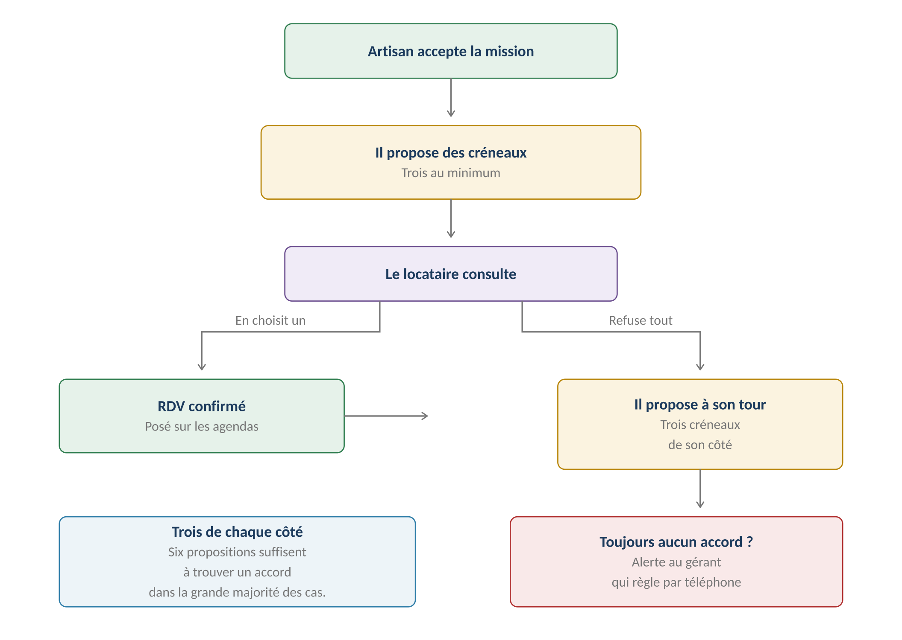
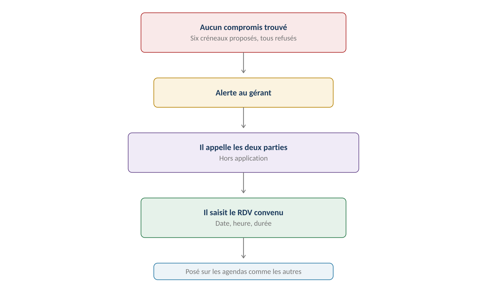
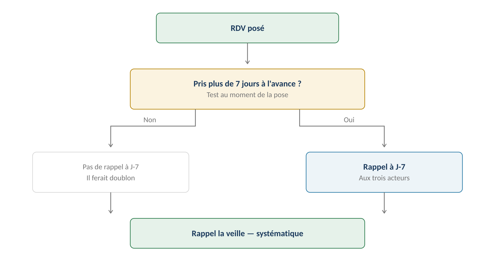
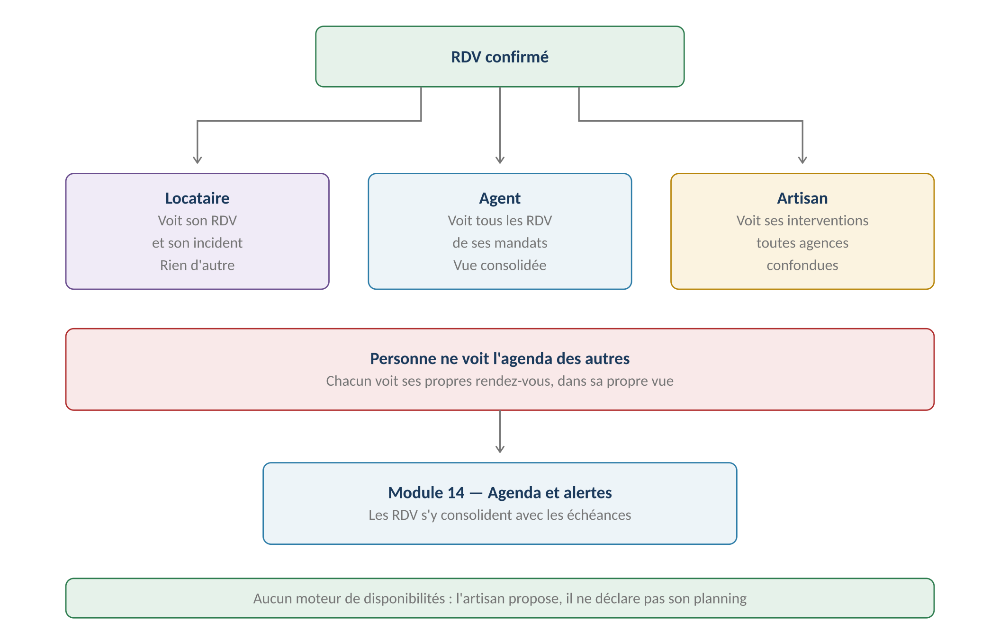

**GERIMMO V3**

Référentiel des parcours clients

**MODULE 10**

**RDV et planning**

|                |                                              |
|:---------------|:---------------------------------------------|
| **Périmètre**  | 7 parcours · 1 objet métier                  |
| **Dépend de**  | Module 7 (incident) · Module 8 (artisan)     |
| **Alimente**   | **Agenda et alertes (module 14)**            |
| **Difficulté** | Coordonner trois acteurs sans agenda partagé |
| **Statut**     | **Module clos — aucune question ouverte**    |

> **Vue d'ensemble du module**
>
> **Aucun moteur de disponibilités — parti pris de conception**
>
> L'artisan ne déclare pas son planning à l'avance. Il propose des créneaux
>
> quand une mission lui est confiée.
>
> Un moteur de disponibilités supposerait qu'il tienne son agenda dans Gerimmo,
>
> alors qu'il travaille pour plusieurs agences et particuliers.
>
> La proposition ponctuelle correspond à ce que font les outils du marché.

**La négociation du créneau**

------------------------------------------------------------------------

*Schéma 1 — Trois créneaux de chaque côté avant escalade*

> **L'artisan propose en premier — décision actée**
>
> Il vient d'accepter la mission : il sait ce qu'il a devant lui.
>
> Le locataire choisit parmi ses propositions, ou refuse tout et propose
>
> à son tour trois créneaux. Six propositions suffisent à trouver un accord
>
> dans la grande majorité des cas.

**Objet créé dans ce module**

------------------------------------------------------------------------

| **Objet**       | **Description**                         | **Rattaché à**   |
|:----------------|:----------------------------------------|:-----------------|
| **Rendez-vous** | Créneau confirmé, avec ses participants | Incident ou bail |

**Machine à états — Rendez-vous**

------------------------------------------------------------------------

| **État** | **Signification** | **Transitions** |
|:---|:---|:---|
| **proposé** | Créneaux soumis, aucun choisi | → confirmé · → contre-proposé |
| **contre-proposé** | Le locataire a proposé les siens | → confirmé · → arbitrage |
| **arbitrage** | Aucun accord, le gérant intervient | → confirmé |
| **confirmé** | Date arrêtée, agendas alimentés | → reporté · → annulé · → honoré |
| **reporté** | Nouvelle date à convenir | → proposé |
| **honoré** | L'intervention a eu lieu | — |
| **manqué** | Absence constatée | → proposé |

**Cartographie des 7 parcours**

------------------------------------------------------------------------

| **\#** | **Parcours**                 | **Persona** | **V1 / V2** | **Criticité** |
|:-------|:-----------------------------|:------------|:------------|:--------------|
| 10.1   | Proposition de créneaux      | AR          | **V1**      | Haute         |
| 10.2   | Choix ou refus du locataire  | LO          | **V1**      | Haute         |
| 10.3   | Contre-proposition           | LO → AR     | **V1**      | Moyenne       |
| 10.4   | **Arbitrage du gérant**      | AG          | **V1**      | Haute         |
| 10.5   | Report ou annulation         | Tous        | **V1**      | Moyenne       |
| 10.6   | RDV visite ou état des lieux | AG          | **V1**      | Moyenne       |
| 10.7   | Rappels automatiques         | Système     | **V1**      | Faible        |

> **10.1 à 10.3 — La négociation**

**10.1 — Proposition de créneaux par l'artisan**

------------------------------------------------------------------------

|                 |                                 |
|:----------------|:--------------------------------|
| **Persona**     | AR — Artisan                    |
| **Déclencheur** | Acceptation de la mission (7.4) |
| **Fréquence**   | À chaque intervention           |
| **Criticité**   | Haute                           |
| **Minimum**     | **Trois créneaux**              |

| **\#** | **Acteur** | **Action** | **Écran / état** |
|:---|:---|:---|:---|
| 1 | AR | Après acceptation, clique « Proposer des créneaux » | Espace artisan |
| 2 | AR | **Saisit au moins trois créneaux** | Date, heure, durée |
| 3 | AR | Peut indiquer une préférence | Optionnel |
| 4 | AR | Valide | — |
| 5 | **Système** | Notifie le locataire | Email + espace |
| 6 | **Système** | Informe l'agent que les créneaux sont partis | — |

**10.2 — Choix ou refus du locataire**

------------------------------------------------------------------------

| **\#** | **Acteur**  | **Action**                             | **Écran / état** |
|:-------|:------------|:---------------------------------------|:-----------------|
| 1      | LO          | Consulte les créneaux proposés         | Espace locataire |
| 2      | LO          | Sélectionne celui qui lui convient     | —                |
| 3      | **Système** | Confirme le RDV et notifie l'artisan   | —                |
| 4      | **Système** | Pose le RDV sur les agendas (10.4)     | Module 14        |
| —      | —           | **OU s'il refuse tout**                | —                |
| 5      | LO          | **Propose trois créneaux de son côté** | Formulaire       |
| 6      | **Système** | Transmet à l'artisan (10.3)            | —                |

> **Le locataire doit proposer, pas seulement refuser — décision actée**
>
> Un refus sec bloquerait le processus sans faire avancer la recherche.
>
> S'il refuse les trois créneaux de l'artisan, il doit en proposer trois autres.
>
> C'est cette contrainte qui permet de converger en deux tours.

**10.3 — Contre-proposition**

------------------------------------------------------------------------

| **\#** | **Acteur** | **Action** | **Écran / état** |
|:---|:---|:---|:---|
| 1 | **Système** | Notifie l'artisan des trois créneaux du locataire | — |
| 2 | AR | En accepte un | — |
| 3 | **Système** | Confirme le RDV | — |
| — | — | **OU s'il refuse tout** | — |
| 4 | **Système** | **Alerte le gérant pour arbitrage (10.4)** | Tableau de bord |

**Variantes**

------------------------------------------------------------------------

| **Code** | **Situation** | **Comportement** |
|:---|:---|:---|
| **V1** | Accord au premier tour | Cas majoritaire. Le locataire choisit parmi les trois. |
| **V2** | Accord au second tour | L'artisan accepte un créneau du locataire. |
| **V3** | **Aucun accord** | Escalade au gérant (10.4). |
| **V4** | Locataire sans réponse | Relance à J+2, puis alerte au gérant à J+4. |
| **V5** | **Urgence** | L'artisan propose un créneau immédiat, sans négociation. |
| **V6** | Colocation | N'importe quel colocataire peut choisir. Tous sont informés. |
| **V7** | Logement vacant | Aucun locataire : l'agent choisit directement. |

**Cas d'erreur**

------------------------------------------------------------------------

| **Cas**                          | **Comportement attendu**                 |
|:---------------------------------|:-----------------------------------------|
| Moins de trois créneaux proposés | **BLOCAGE — trois au minimum**           |
| Créneau dans le passé            | **BLOCAGE à la saisie**                  |
| Refus sans contre-proposition    | **BLOCAGE — le locataire doit proposer** |
| Artisan blacklisté entre-temps   | **RDV annulé, réaffectation requise**    |

**Règles métier**

------------------------------------------------------------------------

> **RM-10.1.1** — C'est l'artisan qui propose les créneaux, après acceptation de la mission.
>
> **RM-10.1.2** — Trois créneaux au minimum sont exigés.
>
> **RM-10.2.1** — Le locataire peut refuser tous les créneaux.
>
> **RM-10.2.2** — Un refus global oblige le locataire à proposer trois créneaux à son tour.
>
> **RM-10.3.1** — L'artisan accepte un créneau du locataire, ou déclenche l'arbitrage.
>
> **RM-10.3.2** — Aucun créneau ne peut être proposé dans le passé.
>
> **RM-10.3.3** — Sans réponse du locataire à J+2, une relance part ; à J+4, le gérant est alerté.

**User stories**

------------------------------------------------------------------------

> **US-10.1.1**
>
> *En tant qu'artisan, je veux proposer mes créneaux après avoir accepté, afin de tenir compte de ce que j'ai déjà planifié ailleurs.*

- **Étant donné** une mission que je viens d'accepter, **quand** je propose trois créneaux, **alors** le locataire est notifié et peut choisir

- **Étant donné** que je ne saisis que deux créneaux, **quand** je valide, **alors** la validation est refusée

> **US-10.2.1**
>
> *En tant que locataire, je veux proposer mes propres créneaux si aucun ne convient, afin de ne pas bloquer la réparation.*

- **Étant donné** trois créneaux qui tombent pendant mes heures de travail, **quand** je les refuse, **alors** je dois en proposer trois autres avant de valider

- **Étant donné** mes trois créneaux transmis, **quand** l'artisan en accepte un, **alors** le RDV est confirmé sans intervention de l'agence

> **10.4 — Arbitrage du gérant**

|                 |                                      |
|:----------------|:-------------------------------------|
| **Persona**     | AG — Agent immobilier                |
| **Déclencheur** | Six créneaux proposés, aucun accepté |
| **Fréquence**   | Rare                                 |
| **Criticité**   | Haute — le désordre attend           |
| **Canal**       | **Téléphone, hors application**      |

**Le circuit d'escalade**

------------------------------------------------------------------------

*Schéma 2 — Le gérant règle par téléphone et saisit le résultat*

> **Pourquoi l'humain reprend la main**
>
> Après six propositions infructueuses, le problème n'est plus logistique
>
> mais relationnel : un locataire réticent, un artisan surchargé,
>
> ou une incompréhension sur la nature de l'intervention.
>
> Un septième tour de propositions ne réglerait rien. Un appel, si.

**Parcours nominal**

------------------------------------------------------------------------

| **\#** | **Acteur** | **Action** | **Écran / état** |
|:---|:---|:---|:---|
| 1 | **Système** | Alerte le gérant après le second refus | Tableau de bord |
| 2 | AG | Consulte les créneaux refusés de part et d'autre | Fiche RDV |
| 3 | AG | Appelle le locataire puis l'artisan | Hors application |
| 4 | AG | **Saisit le RDV convenu** | Date, heure, durée |
| 5 | AG | Peut ajouter un commentaire sur la difficulté | Optionnel |
| 6 | **Système** | Confirme le RDV et notifie les deux parties | — |
| 7 | **Système** | Pose sur les agendas | Module 14 |

**Variantes**

------------------------------------------------------------------------

| **Code** | **Situation** | **Comportement** |
|:---|:---|:---|
| **V1** | Accord obtenu par téléphone | Cas courant. Le gérant saisit le RDV. |
| **V2** | **Locataire injoignable** | Le gérant trace ses tentatives. L'incident reste ouvert. |
| **V3** | Changement d'artisan | Le gérant réaffecte à un autre professionnel (7.3). |
| **V4** | **Refus persistant du locataire** | Tracé. L'agence peut invoquer son obstruction si le désordre s'aggrave. |

> **L'obstruction du locataire doit être tracée**
>
> Un locataire qui refuse tout accès empêche la réparation.
>
> Si le désordre s'aggrave — une fuite qui devient un dégât des eaux —
>
> la trace des créneaux proposés et refusés établit la responsabilité.
>
> Même logique que les relances du module 3 et les sollicitations du module 9.

**Règles métier**

------------------------------------------------------------------------

> **RM-10.4.1** — L'arbitrage se déclenche après six créneaux refusés.
>
> **RM-10.4.2** — Le gérant règle hors application et saisit le RDV convenu.
>
> **RM-10.4.3** — Tous les créneaux proposés et refusés sont conservés.
>
> **RM-10.4.4** — Un refus persistant du locataire est tracé et opposable.

**User story**

------------------------------------------------------------------------

> **US-10.4.1**
>
> *En tant qu'agent immobilier, je veux disposer de la trace des refus, afin d'établir la responsabilité si le désordre s'aggrave.*

- **Étant donné** six créneaux proposés et tous refusés par le locataire, **quand** j'ouvre la fiche du rendez-vous, **alors** chaque proposition apparaît avec sa date et son motif de refus

> **10.5 à 10.7 — Vie du rendez-vous**

**10.5 — Report et annulation**

------------------------------------------------------------------------

| **Origine** | **Effet** | **Conséquence** |
|:---|:---|:---|
| **Report par l'artisan** | Nouveaux créneaux proposés | Compte dans son score de fiabilité |
| **Report par le locataire** | Il propose trois créneaux | Tracé sur l'incident |
| **Annulation par l'agent** | Intervention abandonnée | Motif obligatoire |
| **Absence du locataire** | **RDV marqué manqué** | Nouveau cycle de propositions |
| **Absence de l'artisan** | **RDV marqué manqué** | Pèse fortement sur son score |

> **Les absences alimentent le score**
>
> Un artisan qui ne se présente pas fait perdre une demi-journée au locataire
>
> et décrédibilise l'agence.
>
> Le taux de RDV manqués est l'un des cinq indicateurs du score de fiabilité
>
> automatique (module 8, parcours 8.3).

**10.6 — RDV visite ou état des lieux**

------------------------------------------------------------------------

|                 |                                              |
|:----------------|:---------------------------------------------|
| **Persona**     | AG — Agent immobilier                        |
| **Déclencheur** | État des lieux d'entrée ou de sortie, visite |
| **Fréquence**   | À chaque début et fin de bail                |
| **Criticité**   | Moyenne                                      |
| **Différence**  | Deux acteurs seulement — pas d'artisan       |

| **Type de RDV** | **Participants** | **Rattaché à** |
|:---|:---|:---|
| **État des lieux d'entrée** | Agent et locataire | Bail (1.12) |
| **État des lieux de sortie** | Agent et locataire | Bail (1.13) |
| **Visite de courtoisie** | Agent et locataire | Bail |
| **Visite pour relocation** | Agent et candidat | Lot — hors périmètre candidature |
| **Rendez-vous diagnostic** | Agent et diagnostiqueur | Lot (0.7) |

> **Même mécanique, un acteur de moins**
>
> La négociation à trois créneaux s'applique aussi, mais entre l'agent
>
> et le locataire seulement.
>
> C'est l'agent qui propose, puisqu'il connaît sa propre disponibilité.

**10.7 — Rappels automatiques**

------------------------------------------------------------------------

*Schéma 3 — Rappel à J-7 seulement si le délai le justifie*

| **Moment**    | **Destinataires**         | **Condition**                  |
|:--------------|:--------------------------|:-------------------------------|
| **J-7**       | Locataire, artisan, agent | RDV pris plus de 7 jours avant |
| **La veille** | Locataire, artisan, agent | **Systématique**               |

> **Pourquoi conditionner le rappel à J-7**
>
> Un RDV pris trois jours à l'avance déclencherait deux notifications
>
> quasi simultanées — celle de J-7 arrivant après la prise de rendez-vous
>
> et celle de la veille juste derrière.
>
> Le test au moment de la pose évite ce doublon.

**L'agenda partagé**

------------------------------------------------------------------------

*Schéma 4 — Chacun voit ses propres rendez-vous, jamais ceux des autres*

| **Persona**              | **Ce qu'il voit**                              |
|:-------------------------|:-----------------------------------------------|
| **Locataire**            | Ses rendez-vous sur son logement, rien d'autre |
| **Agent**                | Tous les rendez-vous des lots de ses mandats   |
| **Artisan**              | Ses interventions, toutes agences confondues   |
| **Admin agence**         | Vue consolidée de l'agence                     |
| **Propriétaire mandant** | Rien — aucun accès à l'application             |

**Variantes**

------------------------------------------------------------------------

| **Code** | **Situation** | **Comportement** |
|:---|:---|:---|
| **V1** | Report simple | Nouveau cycle de propositions. |
| **V2** | **Absence constatée** | RDV marqué manqué, avec l'auteur de l'absence. |
| **V3** | Annulation de l'incident | Le RDV est annulé automatiquement. |
| **V4** | RDV le jour même | Seul le rappel de la veille est sans objet. |
| **V5** | Export vers un agenda externe | V2 — fichier iCal |

**Règles métier**

------------------------------------------------------------------------

> **RM-10.5.1** — Un report relance un cycle de propositions.
>
> **RM-10.5.2** — Une absence est attribuée à son auteur et tracée.
>
> **RM-10.5.3** — Les absences de l'artisan alimentent son score de fiabilité.
>
> **RM-10.5.4** — Une annulation par l'agent exige un motif.
>
> **RM-10.6.1** — Les RDV sans artisan se négocient entre l'agent et le locataire.
>
> **RM-10.6.2** — C'est l'agent qui propose les créneaux dans ce cas.
>
> **RM-10.7.1** — Un rappel part la veille de chaque rendez-vous, systématiquement.
>
> **RM-10.7.2** — Un rappel à J-7 part si le RDV a été pris plus de sept jours à l'avance.
>
> **RM-10.7.3** — Chaque persona ne voit que ses propres rendez-vous.
>
> **RM-10.7.4** — Le propriétaire mandant n'a aucun accès à l'agenda.

**User stories**

------------------------------------------------------------------------

> **US-10.5.1**
>
> *En tant qu'agent immobilier, je veux que les absences soient tracées, afin qu'elles pèsent sur le score de l'artisan.*

- **Étant donné** un artisan qui ne s'est pas présenté, **quand** le locataire le signale, **alors** le RDV est marqué manqué et l'absence entre dans son score

> **US-10.7.1**
>
> *En tant que locataire, je veux être rappelé la veille, afin de ne pas manquer l'intervention.*

- **Étant donné** un rendez-vous confirmé pour demain, **quand** le rappel se déclenche, **alors** je reçois une notification avec l'heure et le nom de l'artisan

- **Étant donné** un rendez-vous pris pour dans trois jours, **quand** il est confirmé, **alors** aucun rappel à J-7 n'est programmé

> **US-10.7.2**
>
> *En tant qu'artisan, je veux voir toutes mes interventions dans une seule vue, afin d'organiser ma journée sans consulter chaque agence.*

- **Étant donné** trois interventions pour deux agences différentes, **quand** j'ouvre mon agenda, **alors** les trois apparaissent avec leur adresse et leur horaire

> **Synthèse du module**

**Les règles métier les plus structurantes**

------------------------------------------------------------------------

| **Code** | **Règle** | **Bloquant** |
|:---|:---|:---|
| **RM-10.1.1** | **L'artisan propose après acceptation de la mission** | Structurel |
| **RM-10.1.2** | Trois créneaux au minimum | **Oui** |
| **RM-10.2.2** | **Un refus global oblige à proposer trois créneaux** | **Oui** |
| **RM-10.3.2** | Aucun créneau dans le passé | **Oui** |
| **RM-10.4.1** | Arbitrage après six créneaux refusés | Structurel |
| **RM-10.4.3** | Tous les créneaux refusés sont conservés | Structurel |
| **RM-10.4.4** | **Un refus persistant est tracé et opposable** | Structurel |
| **RM-10.5.3** | Les absences alimentent le score de fiabilité | Structurel |
| **RM-10.7.1** | Rappel systématique la veille | Non |
| **RM-10.7.2** | Rappel à J-7 selon le délai de prise | Non |
| **RM-10.7.3** | **Chacun ne voit que ses propres rendez-vous** | **Oui** |

**Décompte des user stories**

------------------------------------------------------------------------

| **Parcours**              | **User stories** | **Critères d'acceptation** |
|:--------------------------|:-----------------|:---------------------------|
| 10.1 à 10.3 — Négociation | 2                | 4                          |
| 10.4 — Arbitrage          | 1                | 1                          |
| 10.5 à 10.7 — Vie du RDV  | 3                | 4                          |
| **TOTAL**                 | **6**            | **9**                      |

**Décisions actées sur ce module**

------------------------------------------------------------------------

| **Décision**                                      | **Statut**         |
|:--------------------------------------------------|:-------------------|
| L'artisan propose les créneaux                    | **Acté**           |
| Le locataire peut tout refuser mais doit proposer | **Acté**           |
| Trois créneaux de chaque côté                     | **Acté**           |
| Escalade au gérant sans compromis                 | **Acté**           |
| Le gérant saisit le RDV trouvé                    | **Acté**           |
| RDV sur l'agenda partagé                          | **Acté**           |
| Rappels à J-7 et la veille                        | **Acté**           |
| Aucun moteur de disponibilités artisan            | **Acté**           |
| Export iCal vers un agenda externe                | **V2**             |
| Synchronisation avec Google ou Outlook            | **Hors périmètre** |

**Ce que ce module impose ailleurs**

------------------------------------------------------------------------

| **Module** | **Conséquence** |
|:---|:---|
| **Module 7 — Incidents** | L'acceptation de mission déclenche la proposition |
| **Module 8 — Artisans** | **Les RDV manqués entrent dans le score de fiabilité** |
| **Module 14 — Agenda** | **Les RDV s'y consolident avec les échéances** |
| **Module 19 — Mobile** | Choix de créneau et consultation d'agenda |

**Prochaine étape**

------------------------------------------------------------------------

> **Module 11 — Notation**
>
> Quatre parcours, dont les principes sont déjà arrêtés :
>
> trois sources de notation, leurs poids, la visibilité et la relance.
>
> Ce sera le dernier module du bloc intervention.
