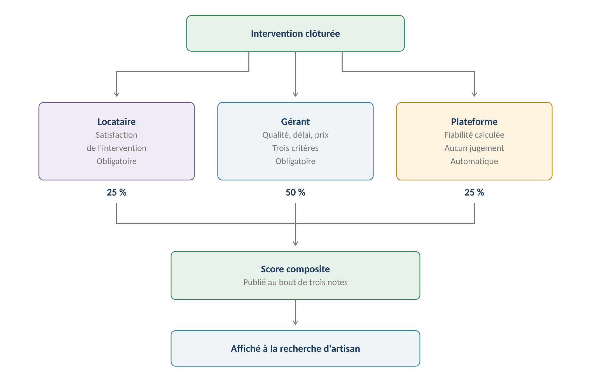
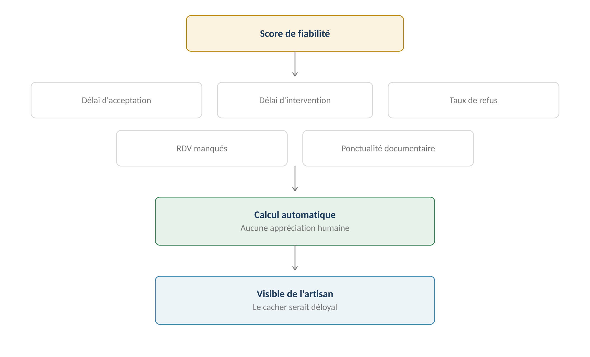
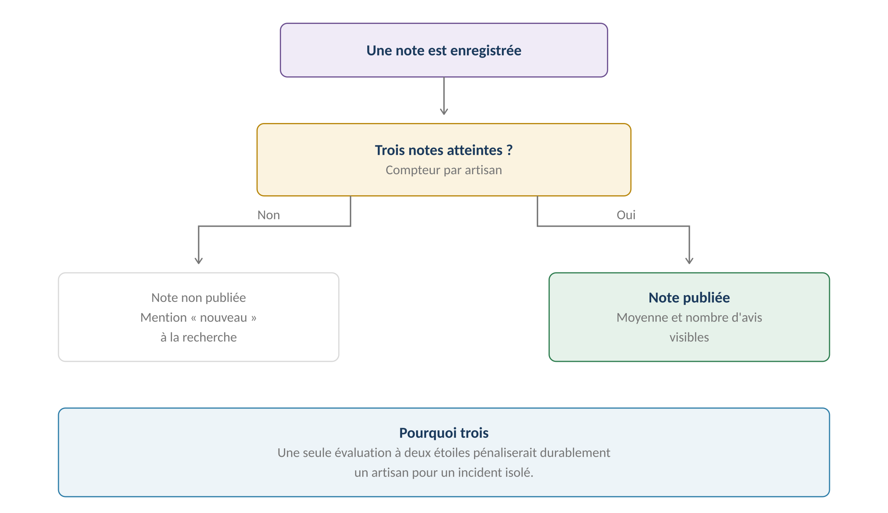
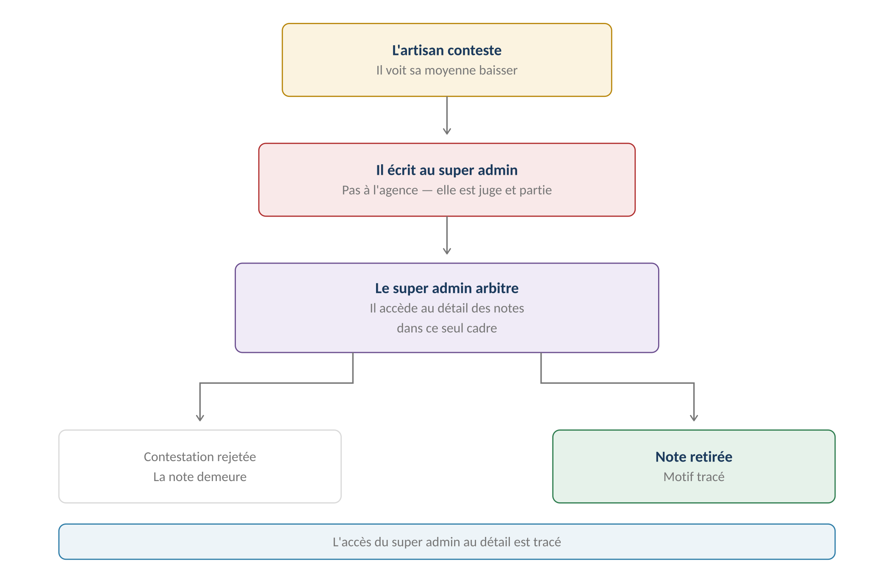

**GERIMMO V3**

Référentiel des parcours clients

**MODULE 11**

**Notation**

|  |  |
|:---|:---|
| **Périmètre** | 4 parcours · 1 objet métier |
| **Dépend de** | Module 7 (clôture) · Module 10 (RDV manqués) |
| **Alimente** | **Recherche d'artisan (8.3) · Comparaison de devis (9.3)** |
| **Particularité** | Trois sources, dont une automatique |
| **Statut** | **Module clos — aucune question ouverte** |

> **Vue d'ensemble du module**

**Trois sources, trois angles**

------------------------------------------------------------------------

*Schéma 1 — Le gérant pèse la moitié, le locataire et la plateforme un quart chacun*

> **Pourquoi trois sources plutôt qu'une**
>
> Un artisan excellent techniquement mais qui ne répond jamais n'est pas
>
> un bon partenaire. Un artisan très réactif dont le travail est à refaire non plus.
>
> Le locataire juge ce qu'il a vu. Le gérant juge l'ensemble, prix compris.
>
> La plateforme mesure ce qui ne s'apprécie pas : les délais et les manquements.

**Objet créé dans ce module**

------------------------------------------------------------------------

| **Objet** | **Description** | **Rattaché à** |
|:---|:---|:---|
| **Évaluation** | Note portée par un acteur sur une intervention | Intervention + Artisan |

**Cartographie des 4 parcours**

------------------------------------------------------------------------

| **\#** | **Parcours** | **Persona** | **V1 / V2** | **Criticité** |
|:---|:---|:---|:---|:---|
| 11.1 | Notation par le locataire | LO | **V1** | Haute |
| 11.2 | Notation par le gérant | AG | **V1** | Haute |
| 11.3 | Score de fiabilité automatique | Système | **V1** | Moyenne |
| 11.4 | **Consultation et contestation** | AR → SA | **V1** | Moyenne |

> **11.1 & 11.2 — Les notations humaines**

**11.1 — Notation par le locataire**

------------------------------------------------------------------------

|                    |                               |
|:-------------------|:------------------------------|
| **Persona**        | LO — Locataire                |
| **Déclencheur**    | Clôture de l'incident (7.6)   |
| **Fréquence**      | À chaque intervention         |
| **Criticité**      | Haute                         |
| **Décision actée** | **Obligatoire, avec relance** |

| **\#** | **Acteur** | **Action** | **Écran / état** |
|:---|:---|:---|:---|
| 1 | **Système** | À la clôture, sollicite le locataire | Notification |
| 2 | LO | Consulte la photo du travail réalisé (RM-7.5.2) | Espace locataire |
| 3 | LO | Attribue une note de satisfaction | Une à cinq étoiles |
| 4 | LO | Peut ajouter un commentaire libre | Optionnel |
| 5 | LO | Valide | — |
| 6 | **Système** | Enregistre l'évaluation | — |
| — | — | **S'il ne répond pas** | — |
| 7 | **Système** | Relance à J+3 puis à J+7 | Notification |
| 8 | **Système** | **Sans réponse : intervention classée sans note** | — |

> **Obligatoire ne veut pas dire bloquant — décision actée**
>
> La note est demandée systématiquement et relancée deux fois.
>
> Mais l'espace du locataire n'est jamais bloqué : il finirait par noter
>
> n'importe quoi pour se débarrasser de la contrainte.
>
> Sans réponse à J+7, l'intervention sort du calcul du score.

**Ce que le locataire évalue**

------------------------------------------------------------------------

| **Critère**              | **Pourquoi lui**                      |
|:-------------------------|:--------------------------------------|
| **Ponctualité**          | Il attendait chez lui                 |
| **Propreté du chantier** | Il vit dans les lieux                 |
| **Comportement**         | Il a reçu l'artisan                   |
| **Résolution apparente** | Il constate si le désordre a cessé    |
| **Prix**                 | Non — il ne l'a pas payé              |
| **Qualité technique**    | Non — il n'est pas en mesure de juger |

**11.2 — Notation par le gérant**

------------------------------------------------------------------------

|                 |                                |
|:----------------|:-------------------------------|
| **Persona**     | AG — Agent immobilier          |
| **Déclencheur** | Validation de la facture (9.8) |
| **Fréquence**   | À chaque intervention          |
| **Criticité**   | Haute                          |
| **Poids**       | **50 % du score composite**    |

| **Critère** | **Ce qu'il apprécie** | **Échelle** |
|:---|:---|:---|
| **Qualité** | Travail conforme, désordre résolu | Une à cinq étoiles |
| **Délai** | Rapidité entre affectation et résolution | Une à cinq étoiles |
| **Prix** | Rapport qualité-prix, respect du devis | Une à cinq étoiles |
| **Commentaire** | Texte libre | **Privé à l'agence** |

> **Pourquoi le gérant pèse le plus**
>
> Il est le seul à voir l'ensemble : la qualité du travail, le respect du devis,
>
> le sérieux du compte rendu et le prix pratiqué.
>
> Il compare aussi cet artisan aux autres qu'il fait intervenir,
>
> ce que le locataire ne peut pas faire.

**Variantes**

------------------------------------------------------------------------

| **Code** | **Situation** | **Comportement** |
|:---|:---|:---|
| **V1** | Les deux notes arrivent | Cas nominal. Score complet. |
| **V2** | **Locataire silencieux** | Le poids du gérant est recalculé sur les deux sources restantes. |
| **V3** | Intervention sans locataire | Logement vacant : seul le gérant note. |
| **V4** | Incident rouvert après notation | Une nouvelle évaluation est demandée après la seconde intervention. |
| **V5** | Plusieurs interventions sur un incident | Chacune est notée séparément. |
| **V6** | Colocation | Le colocataire présent lors de l'intervention note. |

**Cas d'erreur**

------------------------------------------------------------------------

| **Cas** | **Comportement attendu** |
|:---|:---|
| Notation avant clôture | **BLOCAGE — l'intervention doit être terminée** |
| Double notation par le même acteur | **BLOCAGE — une évaluation par acteur et par intervention** |
| Photo du travail absente | **Impossible — elle conditionne la clôture (RM-7.5.2)** |
| Note du gérant non saisie | Alerte à la validation de facture, sans blocage |

**Règles métier**

------------------------------------------------------------------------

> **RM-11.1.1** — La note du locataire est demandée à chaque clôture d'intervention.
>
> **RM-11.1.2** — Elle est relancée à J+3 puis à J+7, sans jamais bloquer son espace.
>
> **RM-11.1.3** — Sans réponse à J+7, l'intervention est classée sans note.
>
> **RM-11.1.4** — Une intervention sans note n'entre pas dans le calcul du score.
>
> **RM-11.1.5** — Le locataire consulte la photo du travail avant de noter.
>
> **RM-11.2.1** — Le gérant note sur trois critères : qualité, délai, prix.
>
> **RM-11.2.2** — Son commentaire reste privé à son agence (RM-8.2.8).
>
> **RM-11.2.3** — Une seule évaluation par acteur et par intervention.
>
> **RM-11.2.4** — Une intervention rouverte donne lieu à une nouvelle évaluation.

**User stories**

------------------------------------------------------------------------

> **US-11.1.1**
>
> *En tant que locataire, je veux noter l'intervention sans être bloqué si je ne le fais pas, afin de ne pas subir une contrainte disproportionnée.*

- **Étant donné** une intervention clôturée hier, **quand** je me connecte à mon espace, **alors** la demande de notation apparaît sans bloquer le reste

- **Étant donné** que je n'ai pas noté après sept jours, **quand** le délai expire, **alors** la demande disparaît et l'intervention est classée sans note

> **US-11.2.1**
>
> *En tant qu'agent immobilier, je veux noter sur trois critères distincts, afin de distinguer un artisan cher mais excellent d'un artisan bon marché mais lent.*

- **Étant donné** une intervention dont je valide la facture, **quand** j'accède à la notation, **alors** je note séparément la qualité, le délai et le prix

> **11.3 — Score de fiabilité automatique**

|                   |                                          |
|:------------------|:-----------------------------------------|
| **Persona**       | Système                                  |
| **Déclencheur**   | Chaque événement du cycle d'intervention |
| **Fréquence**     | Continue                                 |
| **Criticité**     | Moyenne                                  |
| **Particularité** | **Aucun jugement humain n'y entre**      |

**Les cinq indicateurs**

------------------------------------------------------------------------

*Schéma 2 — Cinq mesures objectives, aucune appréciation*

| **Indicateur** | **Mesure** | **Source** |
|:---|:---|:---|
| **Délai d'acceptation** | Heures entre affectation et réponse | Module 7 |
| **Délai d'intervention** | Jours entre acceptation et visite | Module 10 |
| **Taux de refus** | Missions déclinées sur missions proposées | Module 7 |
| **RDV manqués** | Absences constatées | Module 10 (RM-10.5.3) |
| **Ponctualité documentaire** | Pièces déposées avant expiration | Module 8 (RM-8.2.5) |

> **Un score que personne ne décide**
>
> Contrairement aux deux autres sources, celle-ci ne repose sur aucune opinion.
>
> Un artisan qui accepte vite, intervient dans les délais, refuse peu,
>
> honore ses rendez-vous et tient ses attestations à jour obtient
>
> un bon score — indépendamment de ce que pensent de lui les agences.

**La visibilité du score**

------------------------------------------------------------------------

| **Qui**          | **Voit le score** | **Voit le détail**                |
|:-----------------|:------------------|:----------------------------------|
| **Artisan**      | **Oui**           | Oui — ce sont ses propres données |
| **Agent**        | **Oui**           | Oui                               |
| **Admin agence** | **Oui**           | Oui                               |
| **Locataire**    | Non               | Non                               |
| **Propriétaire** | Non               | Non — aucun accès                 |

> **L'artisan voit son score de fiabilité — décision actée**
>
> Il pourrait être perçu comme une surveillance, mais le cacher serait déloyal :
>
> l'artisan est jugé sur des critères qu'il doit pouvoir connaître et améliorer.
>
> C'est aussi la différence avec les notes humaines, dont il ne voit
>
> que la moyenne — voir 11.4.

**Règles métier**

------------------------------------------------------------------------

> **RM-11.3.1** — Le score de fiabilité repose sur cinq indicateurs mesurés.
>
> **RM-11.3.2** — Aucune appréciation humaine n'entre dans son calcul.
>
> **RM-11.3.3** — L'artisan accède à son score et à son détail.
>
> **RM-11.3.4** — Ni le locataire ni le propriétaire n'y ont accès.
>
> **RM-11.3.5** — Le score se recalcule à chaque événement du cycle d'intervention.

**User story**

------------------------------------------------------------------------

> **US-11.3.1**
>
> *En tant qu'artisan, je veux comprendre mon score de fiabilité, afin de savoir ce que je dois améliorer.*

- **Étant donné** un score de fiabilité en baisse, **quand** je consulte le détail, **alors** je vois lequel des cinq indicateurs s'est dégradé

> **11.4 — Consultation et contestation**

|                    |                                            |
|:-------------------|:-------------------------------------------|
| **Persona**        | AR → SA                                    |
| **Déclencheur**    | L'artisan estime avoir été mal évalué      |
| **Fréquence**      | Rare                                       |
| **Criticité**      | Moyenne                                    |
| **Décision actée** | **Recours au super admin, pas à l'agence** |

**Le seuil de publication**

------------------------------------------------------------------------

*Schéma 3 — Trois notes avant publication*

> **Trois notes avant affichage — décision actée**
>
> Une seule évaluation à deux étoiles pénaliserait durablement un artisan
>
> pour un incident isolé, sans qu'il puisse rien y faire.
>
> En dessous de trois notes, il apparaît à la recherche avec la mention
>
> « nouveau » plutôt qu'avec un score.

**Ce que l'artisan voit**

------------------------------------------------------------------------

| **Élément** | **Visible** | **Raison** |
|:---|:---|:---|
| **Sa moyenne** | **Oui** | Il doit connaître sa réputation |
| **Son nombre d'avis** | **Oui** | Contexte de la moyenne |
| **Son score de fiabilité** | **Oui** | Données objectives le concernant |
| **Le détail par intervention** | **Non** | Décision actée |
| **Les commentaires** | **Non** | Privés à l'agence qui les a écrits |
| **Qui a noté quoi** | **Non** | Éviterait les tensions directes |

**Le circuit de contestation**

------------------------------------------------------------------------

*Schéma 4 — Le super admin arbitre, l'agence étant juge et partie*

> **Pourquoi le super admin et non l'agence**
>
> L'agence a émis la note contestée : elle ne peut pas arbitrer sa propre décision.
>
> Le super admin est extérieur au litige. Pour trancher, il accède au détail
>
> des évaluations — commentaires compris — dans ce seul cadre.
>
> Cet accès exceptionnel est tracé, puisqu'il déroge à la confidentialité
>
> posée par RM-11.2.2.

**Parcours nominal**

------------------------------------------------------------------------

| **\#** | **Acteur** | **Action** | **Écran / état** |
|:---|:---|:---|:---|
| 1 | AR | Constate une baisse de sa moyenne | Espace artisan |
| 2 | AR | Clique « Contester une évaluation » | — |
| 3 | AR | Décrit le motif de sa contestation | Texte libre |
| 4 | **Système** | Transmet au super admin | Console |
| 5 | SA | **Accède au détail des évaluations** | Accès tracé |
| 6 | SA | Examine la note, le commentaire et la photo du travail | — |
| 7 | SA | Tranche : maintien ou retrait | Décision motivée |
| 8 | **Système** | Notifie l'artisan et l'agence concernée | — |
| 9 | **Système** | Recalcule le score si une note est retirée | — |

**Variantes**

------------------------------------------------------------------------

| **Code** | **Situation** | **Comportement** |
|:---|:---|:---|
| **V1** | Contestation rejetée | La note demeure. L'artisan est informé du motif. |
| **V2** | **Note retirée** | Le score est recalculé. L'agence est informée. |
| **V3** | **Contestations répétées** | Signal pour le super admin : artisan de mauvaise foi ou agence trop sévère. |
| **V4** | Artisan public | La note retirée disparaît pour toutes les agences. |

**Règles métier**

------------------------------------------------------------------------

> **RM-11.4.1** — Une note n'est publiée qu'au-delà de trois évaluations.
>
> **RM-11.4.2** — En deçà, l'artisan apparaît avec la mention « nouveau ».
>
> **RM-11.4.3** — L'artisan voit sa moyenne, jamais le détail par intervention.
>
> **RM-11.4.4** — La contestation est adressée au super admin, non à l'agence.
>
> **RM-11.4.5** — Le super admin accède au détail dans le seul cadre d'une contestation.
>
> **RM-11.4.6** — Cet accès exceptionnel est tracé.
>
> **RM-11.4.7** — Le retrait d'une note déclenche un recalcul du score.

**User stories**

------------------------------------------------------------------------

> **US-11.4.1**
>
> *En tant qu'artisan, je veux contester une évaluation auprès du super admin, afin que l'agence qui m'a noté ne soit pas seule juge.*

- **Étant donné** une note que j'estime injustifiée, **quand** je la conteste avec un motif, **alors** le super admin est saisi et examine le détail

- **Étant donné** une contestation retenue, **quand** la note est retirée, **alors** mon score est recalculé et l'agence en est informée

> **US-11.4.2**
>
> *En tant qu'agent immobilier, je veux qu'un artisan récent n'affiche pas de note, afin de ne pas l'écarter sur une seule mauvaise expérience.*

- **Étant donné** un artisan avec deux évaluations seulement, **quand** je le vois dans la liste de recherche, **alors** la mention « nouveau » apparaît à la place du score

> **Synthèse du module**

**Les règles métier les plus structurantes**

------------------------------------------------------------------------

| **Code** | **Règle** | **Bloquant** |
|:---|:---|:---|
| **RM-11.1.1** | Note du locataire demandée à chaque clôture | Structurel |
| **RM-11.1.2** | **Relance à J+3 et J+7, sans blocage** | Non |
| **RM-11.1.4** | Une intervention sans note sort du calcul | Structurel |
| **RM-11.2.1** | Le gérant note qualité, délai et prix | Structurel |
| **RM-11.2.2** | **Le commentaire reste privé à son agence** | **Oui** |
| **RM-11.2.3** | Une évaluation par acteur et par intervention | **Oui** |
| **RM-11.3.2** | **Aucune appréciation humaine dans la fiabilité** | Structurel |
| **RM-11.3.3** | L'artisan accède à son score et à son détail | Structurel |
| **RM-11.4.1** | **Publication au-delà de trois évaluations** | Structurel |
| **RM-11.4.3** | L'artisan ne voit jamais le détail par intervention | **Oui** |
| **RM-11.4.4** | **Contestation adressée au super admin** | Structurel |
| **RM-11.4.6** | L'accès du super admin au détail est tracé | Structurel |

**Décompte des user stories**

------------------------------------------------------------------------

| **Parcours** | **User stories** | **Critères d'acceptation** |
|:---|:---|:---|
| 11.1 & 11.2 — Notations humaines | 2 | 3 |
| 11.3 — Score de fiabilité | 1 | 1 |
| 11.4 — Consultation et contestation | 2 | 3 |
| **TOTAL** | **5** | **7** |

**Décisions actées sur ce module**

------------------------------------------------------------------------

| **Décision**                                  | **Statut**         |
|:----------------------------------------------|:-------------------|
| Trois sources : locataire, gérant, plateforme | **Acté**           |
| Poids 25 %, 50 %, 25 %                        | **Acté**           |
| Note du locataire obligatoire, avec relance   | **Acté**           |
| Sans réponse à J+7, classée sans note         | **Acté**           |
| L'artisan ne voit pas le détail de ses notes  | **Acté**           |
| Le score de fiabilité lui est visible         | **Acté**           |
| Publication au bout de trois notes            | **Acté**           |
| Contestation auprès du super admin            | **Acté**           |
| Réponse publique de l'artisan à un avis       | **Hors périmètre** |
| Notation du locataire par l'artisan           | **Hors périmètre** |

**Ce que ce module consomme**

------------------------------------------------------------------------

| **Module** | **Ce qu'il fournit** |
|:---|:---|
| **Module 7 — Incidents** | La clôture déclenche la notation ; la photo du travail |
| **Module 8 — Artisans** | La ponctualité documentaire |
| **Module 9 — Devis** | Le respect du devis, apprécié par le gérant |
| **Module 10 — RDV** | **Les délais et les rendez-vous manqués** |

**Le bloc intervention est terminé**

------------------------------------------------------------------------

> **Modules 7 à 11 spécifiés**
>
> Incidents, artisans, devis, rendez-vous et notation forment un ensemble cohérent :
>
> du signalement par le locataire jusqu'à l'écriture comptable et l'évaluation.
>
> Restent les huit modules transverses, à commencer par les documents et la GED,
>
> puis la signature électronique désormais en V1.
