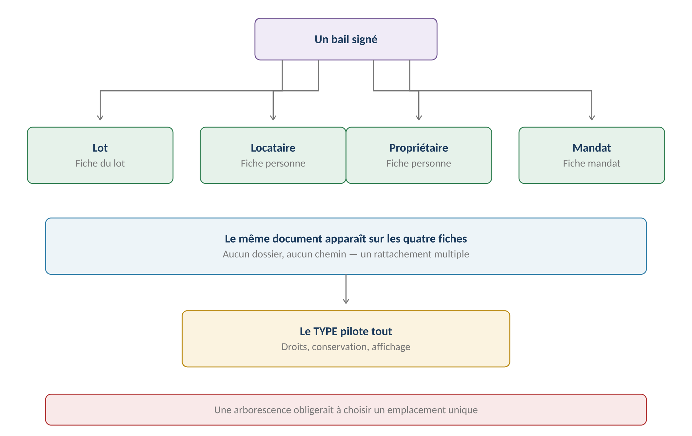
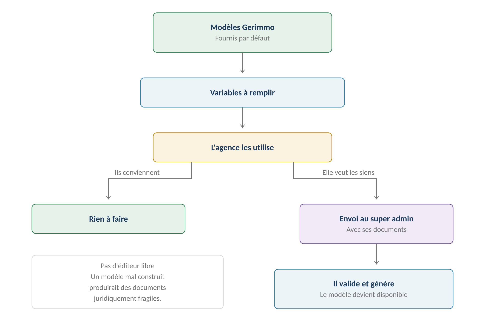
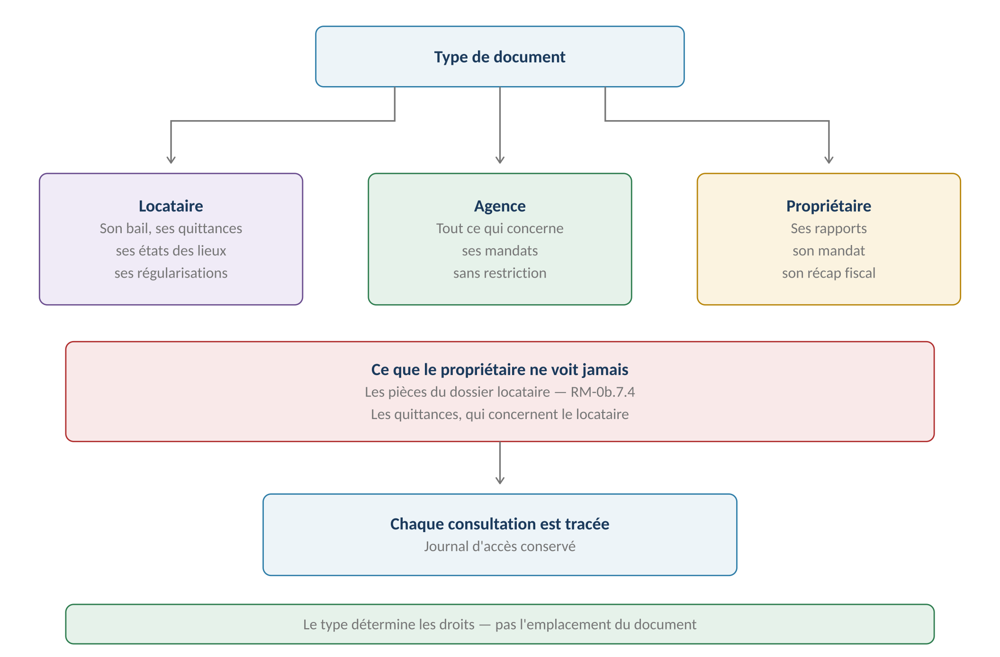
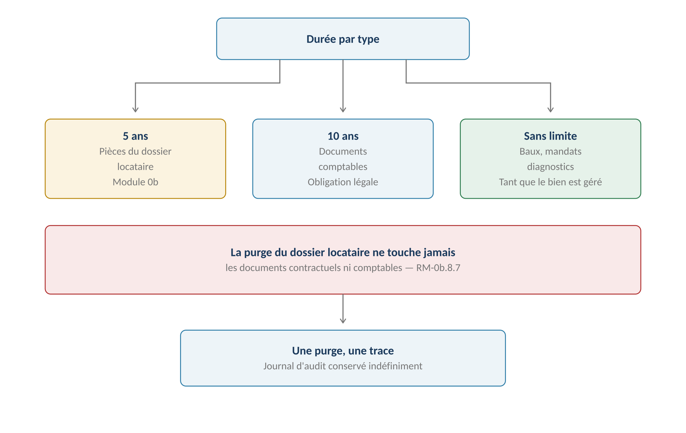

**GERIMMO V3**

Référentiel des parcours clients

**MODULE 12**

**Documents et GED**

|                |                                             |
|:---------------|:--------------------------------------------|
| **Périmètre**  | 5 parcours · 2 objets métier                |
| **Dépend de**  | Tous les modules produisant des documents   |
| **Alimente**   | **Signature électronique (module 13)**      |
| **Parti pris** | Aucune arborescence — rattachement multiple |
| **Statut**     | **Module clos — aucune question ouverte**   |

> **Vue d'ensemble du module**
>
> **Ce module ne produit rien — il organise**
>
> Les onze modules précédents génèrent des documents : baux, quittances,
>
> décomptes, rapports, devis, factures, états des lieux.
>
> Ce module leur donne un lieu commun, des règles d'accès et des durées
>
> de conservation. Il ne crée aucun document par lui-même.

**Le parti pris — aucune arborescence**

------------------------------------------------------------------------

*Schéma 1 — Un document apparaît sur toutes les fiches qu'il concerne*

> **Pourquoi pas de dossiers — décision actée**
>
> Une arborescence oblige à choisir un emplacement unique.
>
> Un bail concerne un lot, un locataire, un propriétaire et un mandat.
>
> Le ranger sous « lot » le rendrait invisible depuis la fiche du locataire.
>
> C'est le TYPE de document qui pilote les droits, la conservation
>
> et l'affichage — jamais son emplacement.

**Objets créés dans ce module**

------------------------------------------------------------------------

| **Objet**    | **Description**                            | **Rattaché à**    |
|:-------------|:-------------------------------------------|:------------------|
| **Document** | Fichier avec son type et ses rattachements | Plusieurs entités |
| **Modèle**   | Gabarit avec variables de fusion           | Agence ou Gerimmo |

**Les types de documents et leurs rattachements**

------------------------------------------------------------------------

| **Type** | **Rattaché à** | **Origine** |
|:---|:---|:---|
| **Bail et avenant** | Lot, locataire, propriétaire, mandat | Module 1 |
| **État des lieux** | Bail, lot, locataire | Module 1 |
| **Congé** | Bail, locataire | Module 1 |
| **Acte de cautionnement** | Bail, garant | Module 2 |
| **Décompte de restitution** | Bail, locataire | Module 2 |
| **Quittance et reçu** | Bail, locataire | Module 3 |
| **Relance et mise en demeure** | Bail, locataire, garant | Module 3 |
| **Régularisation de charges** | Bail, locataire, lot | Module 3 |
| **Justificatif de dépense** | Lot, mandat | Module 4 |
| **Mandat de gestion** | Lots, propriétaire | Module 5 |
| **Rapport de gestion** | Mandat, propriétaire | Module 6 |
| **Récapitulatif fiscal** | Mandat, propriétaire | Module 6 |
| **Devis et facture artisan** | Incident, lot, artisan, mandat | Module 9 |
| **Diagnostic** | Bien ou lot | Module 0 |
| **Pièce du dossier locataire** | Personne | Module 0b |
| **Appel de charges syndic** | Lot, bien | Module 0c |
| **Pièce artisan** | Artisan | Module 8 |

**Cartographie des 5 parcours**

------------------------------------------------------------------------

| **\#** | **Parcours**                | **Persona** | **V1 / V2** | **Criticité** |
|:-------|:----------------------------|:------------|:------------|:--------------|
| 12.1   | **Création d'un modèle**    | SA          | **V1**      | Haute         |
| 12.2   | Génération depuis un modèle | AG          | **V1**      | Haute         |
| 12.3   | Mise à disposition          | AG          | **V1**      | Moyenne       |
| 12.4   | Envoi d'un document         | AG          | **V1**      | Moyenne       |
| 12.5   | Consultation de la GED      | Tous        | **V1**      | Haute         |

> **12.1 — Création d'un modèle**

|  |  |
|:---|:---|
| **Persona** | SA — Super admin |
| **Déclencheur** | Livraison initiale, ou demande d'une agence |
| **Fréquence** | Rare |
| **Criticité** | Haute — un modèle fautif produit des documents fragiles |
| **Décision actée** | **Modèles figés, générés par le super admin** |

**Le circuit**

------------------------------------------------------------------------

*Schéma 2 — L'agence demande, le super admin valide et génère*

> **Pas d'éditeur libre — décision actée**
>
> Un bail, un congé ou une mise en demeure obéissent à un formalisme strict.
>
> Une mention manquante rend l'acte contestable, parfois nul.
>
> Confier l'édition à chaque agence multiplierait les modèles fragiles
>
> et rendrait toute correction réglementaire ingérable.
>
> Les modèles sont donc figés et générés par le super admin.

**Les modèles fournis par défaut**

------------------------------------------------------------------------

| **Modèle**                     | **Module** | **Formalisme**             |
|:-------------------------------|:-----------|:---------------------------|
| **Bail nu**                    | Module 1   | Contrat type réglementaire |
| **Bail meublé**                | Module 1   | Contrat type réglementaire |
| **Bail étudiant**              | Module 1   | Contrat type réglementaire |
| **Avenant**                    | Module 1   | Libre                      |
| **Congé locataire**            | Module 1   | Mentions obligatoires      |
| **Congé bailleur**             | Module 1   | Mentions obligatoires      |
| **Notice d'information**       | Module 1   | Texte réglementaire        |
| **Acte de cautionnement**      | Module 2   | Mentions obligatoires      |
| **Quittance**                  | Module 3   | Mentions obligatoires      |
| **Relance et mise en demeure** | Module 3   | Mentions obligatoires      |
| **Décompte de régularisation** | Module 3   | Libre                      |
| **Mandat de gestion**          | Module 5   | Mentions obligatoires      |
| **Rapport de gestion**         | Module 6   | Libre                      |
| **Récapitulatif fiscal**       | Module 6   | Calé sur la 2044           |

**Parcours nominal — demande d'une agence**

------------------------------------------------------------------------

| **\#** | **Acteur** | **Action** | **Écran / état** |
|:---|:---|:---|:---|
| 1 | AA | Souhaite utiliser son propre modèle | — |
| 2 | AA | Envoie son document au super admin | Formulaire de demande |
| 3 | SA | Examine le document | Console |
| 4 | SA | **Vérifie les mentions obligatoires** | — |
| 5 | SA | Identifie les variables de fusion nécessaires | — |
| 6 | SA | Génère le modèle et le rattache à l'agence | — |
| 7 | **Système** | Le modèle devient disponible pour cette agence | — |
| — | — | **OU en cas de refus** | — |
| 8 | SA | Refuse avec motif | Notification à l'agence |

**Les variables de fusion**

------------------------------------------------------------------------

| **Catégorie**      | **Exemples**                                   |
|:-------------------|:-----------------------------------------------|
| **Agence**         | Raison sociale, adresse, carte professionnelle |
| **Bien et lot**    | Adresse, surface, pièces, équipements          |
| **Parties**        | Identités, adresses, dates de naissance        |
| **Bail**           | Loyer, charges, dépôt, durée, date d'entrée    |
| **Montants**       | Calculés — prorata, régularisation, retenues   |
| **Dates**          | Émission, échéance, effet                      |
| **Marque blanche** | Logo et couleurs de l'agence (module 17)       |

**Variantes**

------------------------------------------------------------------------

| **Code** | **Situation** | **Comportement** |
|:---|:---|:---|
| **V1** | Modèle Gerimmo conservé | Cas majoritaire. Aucune démarche. |
| **V2** | **Modèle propre à l'agence** | Demande au super admin, validation, génération. |
| **V3** | **Évolution réglementaire** | Le super admin met à jour le modèle Gerimmo pour toutes les agences. |
| **V4** | Refus du super admin | Motivé. L'agence continue avec le modèle Gerimmo. |
| **V5** | Retrait d'un modèle | Les documents déjà générés restent intacts. |

**Règles métier**

------------------------------------------------------------------------

> **RM-12.1.1** — Les modèles sont figés : aucune agence ne peut les éditer.
>
> **RM-12.1.2** — Des modèles Gerimmo sont fournis par défaut à chaque agence.
>
> **RM-12.1.3** — Une agence souhaitant son propre modèle le soumet au super admin.
>
> **RM-12.1.4** — Le super admin valide, génère et rattache le modèle à l'agence demandeuse.
>
> **RM-12.1.5** — Un modèle porte une date d'entrée en vigueur (RM-1.16.2).
>
> **RM-12.1.6** — Un document généré conserve la version du modèle utilisée (RM-1.16.3).
>
> **RM-12.1.7** — Le retrait d'un modèle n'affecte pas les documents déjà produits.

**User stories**

------------------------------------------------------------------------

> **US-12.1.1**
>
> *En tant qu'admin agence, je veux soumettre mon propre modèle de bail, afin de conserver la présentation à laquelle mes clients sont habitués.*

- **Étant donné** un modèle de bail que j'utilisais avant Gerimmo, **quand** je le soumets au super admin, **alors** il l'examine et me répond avec un modèle intégré ou un refus motivé

> **US-12.1.2**
>
> *En tant que super admin, je veux mettre à jour un modèle réglementaire pour toutes les agences, afin qu'aucune ne produise un document obsolète.*

- **Étant donné** une évolution du contrat type de bail, **quand** je publie la nouvelle version, **alors** elle s'applique aux baux à venir de toutes les agences

- **Étant donné** des baux signés sous l'ancienne version, **quand** je publie la nouvelle, **alors** ils restent consultables dans leur version d'origine

> **12.2 à 12.4 — Générer, mettre à disposition, envoyer**

**12.2 — Génération depuis un modèle**

------------------------------------------------------------------------

|  |  |
|:---|:---|
| **Persona** | AG — Agent immobilier |
| **Déclencheur** | Besoin d'un document dans un parcours métier |
| **Fréquence** | Quotidienne |
| **Criticité** | Haute |
| **Automatisme** | La plupart des générations sont déclenchées par un parcours |

| **\#** | **Acteur** | **Action** | **Écran / état** |
|:---|:---|:---|:---|
| 1 | AG | Déclenche une action métier — signer un bail, émettre une quittance | Module concerné |
| 2 | **Système** | Sélectionne le modèle du type et de l'agence | — |
| 3 | **Système** | Remplit les variables depuis les données | — |
| 4 | **Système** | Applique la charte de l'agence si marque blanche | Module 17 |
| 5 | **Système** | Produit le PDF | — |
| 6 | **Système** | **Le rattache à toutes les entités concernées** | GED |
| 7 | **Système** | Conserve la version du modèle utilisée | — |

**12.3 & 12.4 — Mise à disposition et envoi**

------------------------------------------------------------------------

|  | **Mise à disposition** | **Envoi** |
|:---|:---|:---|
| **Définition** | Le document devient visible dans l'espace du destinataire | Le document part par email ou WhatsApp |
| **Destinataires** | Locataire, artisan | **Propriétaire, locataire, artisan** |
| **Trace** | Date de mise à disposition | **Date d'envoi et canal** |
| **Accusé** | Date de première consultation | Ouverture si le canal le permet |
| **Cas typique** | Quittance mensuelle | Rapport au propriétaire |

> **Le propriétaire ne peut être que destinataire d'un envoi**
>
> N'ayant aucun accès à l'application, la mise à disposition n'a pas de sens pour lui.
>
> Ses rapports, son mandat et son récapitulatif fiscal lui parviennent
>
> par email — c'est le seul canal disponible.

**Les canaux d'envoi**

------------------------------------------------------------------------

| **Canal**            | **Usage**              | **Trace**                   |
|:---------------------|:-----------------------|:----------------------------|
| **Email**            | Canal par défaut       | Envoi et ouverture          |
| **WhatsApp**         | Locataires et artisans | Envoi et lecture            |
| **Espace personnel** | Mise à disposition     | Première consultation       |
| **Courrier postal**  | Hors application       | Saisie manuelle par l'agent |

> **La trace d'envoi sert le suivi, jamais la preuve**
>
> Un congé, une mise en demeure ou un décompte de restitution font courir des délais.
>
> Mais aucune trace GED ne les prouve : seule la notification par un canal légal
>
> le fait — RM-A3.2.
>
> La trace conservée permet de savoir ce qui est parti et ce qui reste à envoyer.
>
> Pour les actes juridiques, c'est la date de première présentation saisie
>
> par l'agent qui fait courir le délai.

**Variantes**

------------------------------------------------------------------------

| **Code** | **Situation** | **Comportement** |
|:---|:---|:---|
| **V1** | Génération automatique | Quittance, rapport, appel de loyer. Sans intervention. |
| **V2** | Génération à la demande | Attestation, courrier ponctuel. |
| **V3** | **Envoi groupé** | Toutes les quittances du mois en une action. |
| **V4** | Échec d'envoi | Alerte à l'agent. Le document reste disponible. |
| **V5** | **Envoi en recommandé** | Hors application. L'agent trace la date et le numéro. |
| **V6** | Document à signer | **Bascule vers le module 13** |

**Règles métier**

------------------------------------------------------------------------

> **RM-12.2.1** — La génération utilise le modèle du type et de l'agence.
>
> **RM-12.2.2** — Un document généré est rattaché à toutes les entités concernées.
>
> **RM-12.2.3** — La version du modèle utilisée est conservée avec le document.
>
> **RM-12.3.1** — La mise à disposition rend le document visible dans un espace personnel.
>
> **RM-12.3.2** — La date de première consultation est enregistrée.
>
> **RM-12.4.1** — Chaque envoi conserve sa date, son canal et son destinataire, à fin de suivi.
>
> **RM-12.4.4** — Aucune trace GED ne constitue une preuve juridique (RM-A3.2).
>
> **RM-12.4.5** — Pour un acte à effet juridique, l'agent saisit la date de première présentation.
>
> **RM-12.4.2** — Le propriétaire mandant ne reçoit que par envoi, jamais par mise à disposition.
>
> **RM-12.4.3** — Un envoi en recommandé se trace manuellement.

**User story**

------------------------------------------------------------------------

> **US-12.4.1**
>
> *En tant qu'agent immobilier, je veux retrouver la date d'envoi d'un congé, afin de prouver que le préavis a bien couru.*

- **Étant donné** un congé envoyé il y a quatre mois, **quand** j'ouvre le document dans la GED, **alors** sa date d'envoi, son canal et son destinataire apparaissent

> **12.5 — Consultation de la GED**

|                 |                                      |
|:----------------|:-------------------------------------|
| **Persona**     | Tous, selon leurs droits             |
| **Déclencheur** | Recherche d'un document              |
| **Fréquence**   | Quotidienne                          |
| **Criticité**   | Haute                                |
| **Navigation**  | **Par filtres, jamais par dossiers** |

**Qui voit quoi**

------------------------------------------------------------------------

*Schéma 3 — Le type de document détermine les droits*

**La matrice de consultation**

------------------------------------------------------------------------

| **Type de document**           | **LO**         | **AG** | **PM**      | **AR**      |
|:-------------------------------|:---------------|:-------|:------------|:------------|
| **Bail et avenant**            | Oui            | Oui    | Sur demande | Non         |
| **État des lieux**             | Oui            | Oui    | Sur demande | Non         |
| **Quittance**                  | Oui            | Oui    | Non         | Non         |
| **Régularisation**             | Oui            | Oui    | Non         | Non         |
| **Pièce du dossier locataire** | Oui            | Oui    | **JAMAIS**  | Non         |
| **Mandat**                     | Non            | Oui    | Envoyé      | Non         |
| **Rapport de gestion**         | Non            | Oui    | Envoyé      | Non         |
| **Récapitulatif fiscal**       | Non            | Oui    | Envoyé      | Non         |
| **Devis et facture**           | Si à sa charge | Oui    | Rapport     | Les siens   |
| **Diagnostic**                 | Annexé au bail | Oui    | Sur demande | Non         |
| **Pièce artisan**              | Non            | Oui    | Non         | Les siennes |

> **Le propriétaire ne consulte pas — il reçoit**
>
> La colonne PM indique « envoyé » ou « sur demande » : il n'a aucun accès
>
> à l'application, donc aucune consultation directe.
>
> Un document « sur demande » lui est transmis par l'agent quand il le réclame.

**La conservation**

------------------------------------------------------------------------

*Schéma 4 — Une durée par type, sans jamais toucher au contractuel*

| **Type** | **Durée** | **Fondement** |
|:---|:---|:---|
| **Pièces du dossier locataire** | 5 ans | Décision actée (module 0b) |
| **Documents comptables** | 10 ans | Obligation légale |
| **Quittances** | 10 ans | Suivent la comptabilité |
| **Baux et avenants** | Sans limite | Preuve contractuelle |
| **États des lieux** | Sans limite | Attachés au bail |
| **Mandats** | Sans limite | Preuve contractuelle |
| **Rapports de gestion** | 10 ans | Suivent la comptabilité |
| **Diagnostics** | Tant que le bien est géré | Historique réglementaire |
| **Devis et factures** | 10 ans | Suivent la comptabilité |

> **La purge du module 0b ne touche que les pièces du dossier**
>
> RM-0b.8.7 posait déjà que la purge ne supprime ni la personne,
>
> ni ses baux, ni sa comptabilité.
>
> Ce module le confirme au niveau documentaire : un bail, une quittance
>
> ou un rapport survivent à la purge des pièces justificatives.

**La navigation**

------------------------------------------------------------------------

| **Depuis**            | **Ce qui s'affiche**                             |
|:----------------------|:-------------------------------------------------|
| **Fiche lot**         | Tous les documents rattachés à ce lot            |
| **Fiche bail**        | Bail, avenants, EDL, quittances, régularisations |
| **Fiche personne**    | Ses pièces, ses baux, ses documents              |
| **Fiche mandat**      | Mandat, rapports, récapitulatifs fiscaux         |
| **Fiche incident**    | Devis, factures, photos                          |
| **Recherche globale** | **Par type, période, entité, texte**             |

**Cas d'erreur**

------------------------------------------------------------------------

| **Cas**                  | **Comportement attendu**                    |
|:-------------------------|:--------------------------------------------|
| Consultation hors droits | **BLOCAGE — le document n'apparaît pas**    |
| Document purgé           | Mention « purgé le \[date\] » avec le motif |
| Fichier corrompu         | Alerte à l'admin agence                     |
| Recherche sans résultat  | Suggestion d'élargir les filtres            |

**Règles métier**

------------------------------------------------------------------------

> **RM-12.5.1** — La navigation se fait par filtres et recherche, jamais par arborescence.
>
> **RM-12.5.2** — Un document apparaît sur toutes les fiches auxquelles il est rattaché.
>
> **RM-12.5.3** — Le type de document détermine les droits de consultation.
>
> **RM-12.5.4** — Le propriétaire mandant ne consulte jamais : il reçoit.
>
> **RM-12.5.5** — Le propriétaire n'accède jamais aux pièces du dossier locataire (RM-0b.7.4).
>
> **RM-12.5.6** — Chaque type de document porte sa propre durée de conservation.
>
> **RM-12.5.7** — La purge du dossier locataire ne touche ni le contractuel ni le comptable.
>
> **RM-12.5.8** — Toute consultation est tracée dans un journal d'accès.

**User stories**

------------------------------------------------------------------------

> **US-12.5.1**
>
> *En tant qu'agent immobilier, je veux retrouver un document depuis n'importe quelle fiche, afin de ne pas mémoriser où il est rangé.*

- **Étant donné** un bail signé, **quand** j'ouvre la fiche du lot, celle du locataire ou celle du mandat, **alors** le bail apparaît dans les trois

- **Étant donné** que je cherche toutes les quittances d'un locataire, **quand** je filtre par type et par personne, **alors** elles s'affichent par ordre chronologique

> **US-12.5.2**
>
> *En tant qu'agent immobilier, je veux que le propriétaire ne voie jamais les pièces du dossier locataire, afin de respecter la confidentialité.*

- **Étant donné** un propriétaire réclamant les justificatifs de revenus de son locataire, **quand** je consulte les documents transmissibles, **alors** ces pièces n'y figurent pas

> **Synthèse du module**

**Les règles métier les plus structurantes**

------------------------------------------------------------------------

| **Code** | **Règle** | **Bloquant** |
|:---|:---|:---|
| **RM-12.1.1** | **Les modèles sont figés, non éditables par l'agence** | Structurel |
| **RM-12.1.4** | Le super admin valide et génère les modèles | Structurel |
| **RM-12.1.6** | Un document conserve la version du modèle utilisée | Structurel |
| **RM-12.2.2** | **Rattachement à toutes les entités concernées** | Structurel |
| **RM-12.4.1** | Chaque envoi conserve date, canal et destinataire | Structurel |
| **RM-12.4.4** | **Aucune trace GED ne prouve un envoi** | Structurel |
| **RM-12.4.2** | Le propriétaire ne reçoit que par envoi | Structurel |
| **RM-12.5.1** | **Navigation par filtres, jamais par arborescence** | Structurel |
| **RM-12.5.3** | Le type détermine les droits de consultation | **Oui** |
| **RM-12.5.5** | **Le propriétaire n'accède jamais au dossier locataire** | **Oui** |
| **RM-12.5.6** | Une durée de conservation par type | Structurel |
| **RM-12.5.7** | La purge ne touche ni le contractuel ni le comptable | **Oui** |
| **RM-12.5.8** | Toute consultation est tracée | Structurel |

**Décompte des user stories**

------------------------------------------------------------------------

| **Parcours** | **User stories** | **Critères d'acceptation** |
|:---|:---|:---|
| 12.1 — Création de modèle | 2 | 3 |
| 12.2 à 12.4 — Génération et envoi | 1 | 1 |
| 12.5 — Consultation | 2 | 3 |
| **TOTAL** | **5** | **7** |

**Décisions actées sur ce module**

------------------------------------------------------------------------

| **Décision**                          | **Statut**               |
|:--------------------------------------|:-------------------------|
| Modèles figés, sans éditeur libre     | **Acté**                 |
| Modèles Gerimmo fournis par défaut    | **Acté**                 |
| Modèle propre soumis au super admin   | **Acté**                 |
| Aucune arborescence de dossiers       | **Acté**                 |
| Rattachement multiple d'un document   | **Acté**                 |
| Le type pilote droits et conservation | **Acté**                 |
| Durée de conservation par type        | **Acté**                 |
| Éditeur de modèles pour les agences   | **Hors périmètre**       |
| **La trace GED ne vaut pas preuve**   | **Corrigé — audit P0.4** |
| Archivage à valeur probante certifié  | **Hors périmètre**       |

**Ce que ce module dessert**

------------------------------------------------------------------------

| **Module**                     | **Ce qu'il y dépose**                    |
|:-------------------------------|:-----------------------------------------|
| **Modules 0 à 11**             | Tous leurs documents produits            |
| **Module 13 — Signature**      | **Les documents à signer y transitent**  |
| **Module 15 — Messagerie**     | Les pièces jointes aux conversations     |
| **Module 17 — Marque blanche** | **La charte s'applique à la génération** |

**Prochaine étape**

------------------------------------------------------------------------

> **Module 13 — Signature électronique**
>
> Désormais en V1 : la signature du bail ne reste plus hors plateforme.
>
> Ce module obligera à reprendre les parcours 1.6 et 1.7 du module 1,
>
> le parcours 2.2 du module 2 et le parcours 5.6 du module 5.
