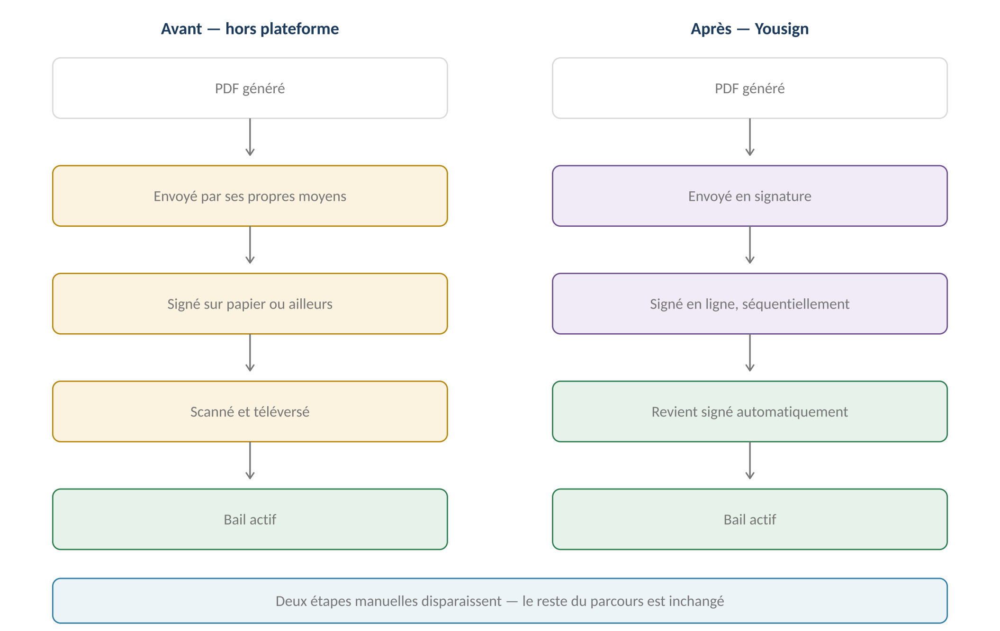
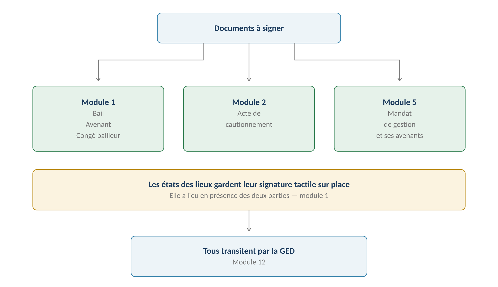
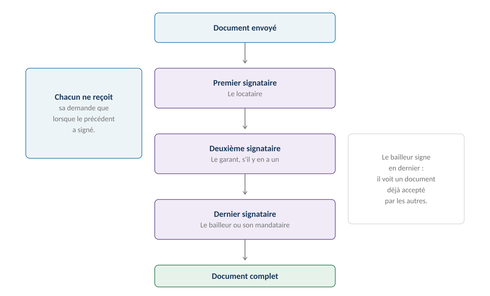
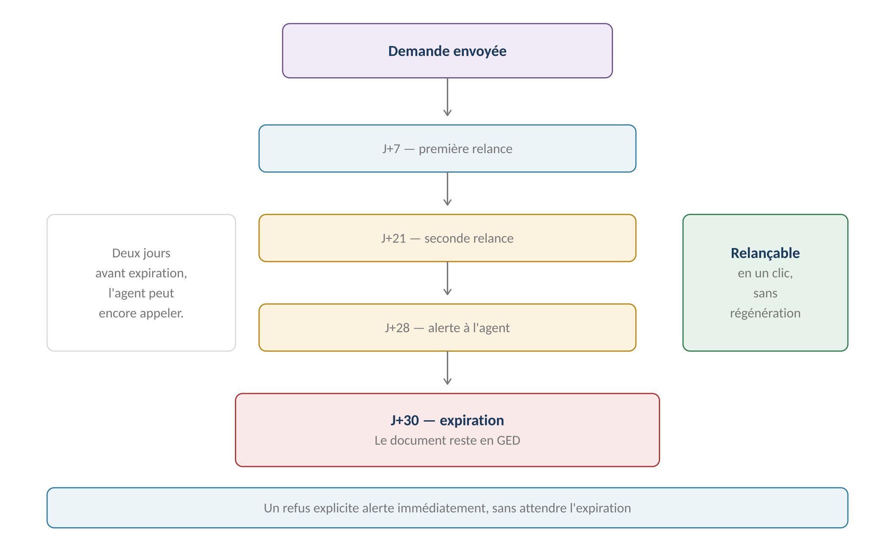

**GERIMMO V3**

Référentiel des parcours clients

**MODULE 13**

**Signature électronique**

|                     |                                              |
|:--------------------|:---------------------------------------------|
| **Périmètre**       | 4 parcours · 1 objet métier                  |
| **Prestataire**     | **Yousign — signature simple**               |
| **Impacte**         | **Modules 1, 2 et 5 — parcours à reprendre** |
| **Statut V1 ou V2** | **V1 — décision révisée**                    |
| **Statut**          | **Module clos — aucune question ouverte**    |

> **Vue d'ensemble du module**
>
> **Décision révisée — la signature passe en V1**
>
> Le référentiel prévoyait initialement une signature hors plateforme,
>
> avec un PDF généré, envoyé par les propres moyens de l'agence, puis téléversé signé.
>
> Cette décision est révisée : la signature électronique est intégrée dès la V1,
>
> ce qui supprime deux étapes manuelles du parcours de bail.

**Ce qui change**

------------------------------------------------------------------------

*Schéma 1 — Deux étapes manuelles disparaissent du circuit*

**Les documents concernés**

------------------------------------------------------------------------

*Schéma 2 — Trois modules produisent des documents à signer*

> **Les états des lieux gardent leur signature tactile**
>
> Ils sont signés sur place, en présence des deux parties, sur l'écran du mobile
>
> — parcours 1.12 et 1.13.
>
> Y ajouter un circuit de signature à distance n'aurait pas de sens :
>
> le locataire et l'agent sont physiquement ensemble.

**Objet créé dans ce module**

------------------------------------------------------------------------

| **Objet** | **Description** | **Rattaché à** |
|:---|:---|:---|
| **Demande de signature** | Circuit de signature d'un document, avec ses signataires | Document + Personnes |

**Machine à états — Demande de signature**

------------------------------------------------------------------------

| **État** | **Signification** | **Transitions** |
|:---|:---|:---|
| **préparée** | Signataires définis, pas encore envoyée | → envoyée · → annulée |
| **envoyée** | En attente du premier signataire | → en cours · → refusée · → expirée |
| **en cours** | Au moins une signature obtenue | → complète · → refusée · → expirée |
| **complète** | Tous ont signé | — |
| **refusée** | Un signataire a refusé, avec motif | → préparée |
| **expirée** | Trente jours écoulés | → préparée |
| **annulée** | Retirée par l'agent | — |

**Cartographie des 4 parcours**

------------------------------------------------------------------------

| **\#** | **Parcours** | **Persona** | **V1 / V2** | **Criticité** |
|:---|:---|:---|:---|:---|
| 13.1 | Envoi d'un document à signer | AG | **V1** | Haute |
| 13.2 | **Signature par le destinataire** | LO / PM / AR | **V1** | **MAXIMALE** |
| 13.3 | Suivi des signatures en attente | AG | **V1** | Moyenne |
| 13.4 | Relance et expiration | Système | **V1** | Moyenne |

> **13.1 — Envoi d'un document à signer**

|                 |                                        |
|:----------------|:---------------------------------------|
| **Persona**     | AG — Agent immobilier                  |
| **Déclencheur** | Document généré et prêt à signer       |
| **Fréquence**   | À chaque bail, mandat ou cautionnement |
| **Criticité**   | Haute                                  |
| **Ordre**       | **Séquentiel — décision actée**        |

**L'ordre séquentiel**

------------------------------------------------------------------------

*Schéma 3 — Chacun ne reçoit sa demande que lorsque le précédent a signé*

> **Pourquoi séquentiel plutôt que parallèle — décision actée**
>
> Le bailleur signe en dernier : il voit un document déjà accepté par les autres.
>
> En parallèle, il pourrait signer avant le locataire, puis découvrir que celui-ci
>
> refuse — le bailleur se serait engagé sur un contrat mort-né.
>
> Le séquentiel est plus lent mais juridiquement plus propre.

**Parcours nominal**

------------------------------------------------------------------------

| **\#** | **Acteur** | **Action** | **Écran / état** |
|:---|:---|:---|:---|
| 1 | **Système** | Le document est généré (module 12) | GED |
| 2 | AG | Clique « Envoyer en signature » | Fiche document |
| 3 | **Système** | Propose les signataires selon le type de document | Liste |
| 4 | AG | Vérifie l'ordre et les coordonnées | Formulaire |
| 5 | AG | **Vérifie les emails — ils portent la demande** | — |
| 6 | AG | Valide l'envoi | — |
| 7 | **Système** | Transmet à Yousign | API |
| 8 | **Système** | Notifie le premier signataire | Email |
| 9 | **Système** | Passe la demande en envoyée | — |

**Les signataires par type de document**

------------------------------------------------------------------------

| **Document** | **Ordre de signature** |
|:---|:---|
| **Bail nu ou meublé** | Locataire, puis garant, puis bailleur ou mandataire |
| **Bail en colocation** | Chaque colocataire, puis chaque garant, puis le bailleur |
| **Avenant** | Mêmes signataires que le bail d'origine |
| **Acte de cautionnement** | Le garant seul |
| **Mandat de gestion** | **Le propriétaire, puis l'agence** |
| **Congé du bailleur** | L'agence seule — notification, non contrat |

> **Le propriétaire mandant signe sans accès à l'application**
>
> Yousign fonctionne par email : il reçoit un lien, signe dans son navigateur,
>
> et n'entre jamais dans Gerimmo.
>
> C'est parfaitement cohérent avec sa situation — il reçoit déjà ses rapports
>
> et son récapitulatif fiscal par le même canal.

**Le niveau de signature**

------------------------------------------------------------------------

| **Niveau**    | **Vérification d'identité** | **Retenu**               |
|:--------------|:----------------------------|:-------------------------|
| **Simple**    | Email et code SMS           | **OUI — décision actée** |
| **Avancée**   | Pièce d'identité contrôlée  | Non                      |
| **Qualifiée** | Face-à-face ou certificat   | Non                      |

> **Pourquoi la signature simple suffit**
>
> Un bail d'habitation n'exige aucun niveau de signature particulier.
>
> Les niveaux avancé et qualifié alourdissent le parcours du signataire
>
> et coûtent sensiblement plus cher, pour une sécurité juridique
>
> que la nature du contrat ne réclame pas.

**Variantes**

------------------------------------------------------------------------

| **Code** | **Situation** | **Comportement** |
|:---|:---|:---|
| **V1** | Signataire unique | Acte de cautionnement, congé. Aucun ordre à définir. |
| **V2** | **Colocation** | Autant de signataires que de colocataires et de garants. |
| **V3** | Personne morale | Le représentant légal signe. |
| **V4** | Indivision | Tous les indivisaires signent le mandat. |
| **V5** | **Annulation avant signature** | L'agent retire la demande. Le document reste en GED. |
| **V6** | Correction du document | Nouvelle génération, nouvelle demande de signature. |

**Cas d'erreur**

------------------------------------------------------------------------

| **Cas** | **Comportement attendu** |
|:---|:---|
| Email manquant sur un signataire | **BLOCAGE — la demande ne peut partir** |
| Email invalide | **Échec d'envoi, alerte à l'agent** |
| Demande déjà en cours sur ce document | **BLOCAGE — annuler la précédente d'abord** |
| Indisponibilité du prestataire | Alerte à l'agent, nouvelle tentative automatique |

**Règles métier**

------------------------------------------------------------------------

> **RM-13.1.1** — La signature est de niveau simple : email et code SMS.
>
> **RM-13.1.2** — L'ordre de signature est séquentiel, le bailleur en dernier.
>
> **RM-13.1.3** — Un email valide est obligatoire pour chaque signataire.
>
> **RM-13.1.4** — Le propriétaire mandant signe par email, sans accès à l'application.
>
> **RM-13.1.5** — Une seule demande de signature active par document.
>
> **RM-13.1.6** — Les états des lieux sont signés sur place, hors de ce circuit.

**User stories**

------------------------------------------------------------------------

> **US-13.1.1**
>
> *En tant qu'agent immobilier, je veux que le bailleur signe en dernier, afin qu'il ne s'engage pas sur un contrat que le locataire refusera.*

- **Étant donné** un bail avec locataire, garant et bailleur, **quand** j'envoie la demande de signature, **alors** seul le locataire la reçoit dans un premier temps

- **Étant donné** que le locataire a signé, **quand** sa signature est enregistrée, **alors** le garant reçoit la sienne, et ainsi de suite

> **US-13.1.2**
>
> *En tant que propriétaire mandant, je veux signer mon mandat sans créer de compte, afin de ne pas avoir à apprendre un outil que je n'utiliserai pas.*

- **Étant donné** un mandat que l'agence m'envoie en signature, **quand** je clique sur le lien reçu par email, **alors** je signe dans mon navigateur sans créer de compte

> **13.2 — Signature par le destinataire**

|                 |                                                   |
|:----------------|:--------------------------------------------------|
| **Persona**     | LO — Locataire · PM — Propriétaire · AR — Artisan |
| **Déclencheur** | Réception de la demande de signature              |
| **Fréquence**   | Ponctuelle                                        |
| **Criticité**   | MAXIMALE — c'est l'acte juridique                 |
| **Canal**       | Email et navigateur, sans compte à créer          |

**Parcours nominal**

------------------------------------------------------------------------

| **\#** | **Acteur** | **Action** | **Écran / état** |
|:---|:---|:---|:---|
| 1 | **Système** | Envoie l'email de demande | Yousign |
| 2 | Signataire | Clique sur le lien | Navigateur |
| 3 | Signataire | Consulte le document intégralement | Visionneuse |
| 4 | Signataire | Reçoit un code par SMS | Téléphone |
| 5 | Signataire | Saisit le code et signe | — |
| 6 | **Système** | Enregistre la signature et son horodatage | — |
| 7 | **Système** | Notifie le signataire suivant | Email |
| 8 | **Système** | **Au dernier : rapatrie le document signé** | GED |
| 9 | **Système** | **Déclenche la suite du parcours métier** | Module concerné |

> **La signature déclenche le parcours métier**
>
> Pour un bail : le lot passe en loué, l'échéancier est créé, l'alerte
>
> d'état des lieux d'entrée est programmée — RM-1.7.1 à RM-1.7.3.
>
> Pour un mandat : la gestion des lots s'active — RM-5.6.1.
>
> Pour un cautionnement : la garantie devient effective — RM-2.2.3.

**Le refus**

------------------------------------------------------------------------

| **\#** | **Acteur** | **Action** | **Effet** |
|:---|:---|:---|:---|
| 1 | Signataire | Clique « Refuser de signer » | — |
| 2 | Signataire | **Saisit un motif — obligatoire** | Champ libre |
| 3 | **Système** | Passe la demande en refusée | — |
| 4 | **Système** | **Alerte immédiatement l'agent** | Tableau de bord |
| 5 | **Système** | Interrompt le circuit — les suivants ne reçoivent rien | — |
| 6 | AG | Comprend le motif et décide de la suite | — |

> **Un refus est une information, pas un échec**
>
> Le motif est obligatoire : un locataire qui refuse a une raison,
>
> et cette raison doit remonter à l'agent avant qu'il ne relance quoi que ce soit.
>
> Le circuit s'interrompt : inutile de solliciter les signataires suivants
>
> sur un document qui ne sera pas signé en l'état.

**Variantes**

------------------------------------------------------------------------

| **Code** | **Situation** | **Comportement** |
|:---|:---|:---|
| **V1** | Signature immédiate | Cas nominal. |
| **V2** | **Refus avec motif** | Circuit interrompu, agent alerté. |
| **V3** | Code SMS non reçu | Le signataire peut en demander un nouveau. |
| **V4** | **Numéro de téléphone erroné** | L'agent le corrige et relance la demande. |
| **V5** | Signature partielle abandonnée | Le signataire peut reprendre via le même lien. |
| **V6** | Signataire sans smartphone | Le code SMS reste recevable sur un téléphone simple |

**Cas d'erreur**

------------------------------------------------------------------------

| **Cas** | **Comportement attendu** |
|:---|:---|
| Refus sans motif | **BLOCAGE — le motif est obligatoire** |
| Lien de signature expiré | Message explicite, l'agent peut relancer |
| Document modifié entre-temps | **BLOCAGE — la demande doit être annulée et refaite** |
| Échec de rapatriement du signé | Alerte à l'agent, nouvelle tentative automatique |

**Règles métier**

------------------------------------------------------------------------

> **RM-13.2.1** — Le signataire n'a pas besoin de créer de compte.
>
> **RM-13.2.2** — La signature est horodatée et son horodatage conservé.
>
> **RM-13.2.3** — La signature du dernier signataire rapatrie le document dans la GED.
>
> **RM-13.2.4** — Elle déclenche la suite du parcours métier du module concerné.
>
> **RM-13.2.5** — Un refus exige un motif et interrompt le circuit.
>
> **RM-13.2.6** — Un refus alerte l'agent immédiatement.
>
> **RM-13.2.7** — Un document ne peut être modifié pendant qu'une signature est en cours.

**User stories**

------------------------------------------------------------------------

> **US-13.2.1**
>
> *En tant que locataire, je veux signer mon bail depuis mon téléphone, afin de ne pas avoir à me déplacer à l'agence.*

- **Étant donné** un email de demande de signature, **quand** je clique sur le lien, **alors** je consulte le bail et signe après réception d'un code SMS

- **Étant donné** que j'interromps la signature, **quand** je reviens plus tard sur le lien, **alors** je reprends là où j'en étais

> **US-13.2.2**
>
> *En tant qu'agent immobilier, je veux connaître le motif d'un refus, afin de corriger le document plutôt que de le renvoyer tel quel.*

- **Étant donné** un locataire qui refuse de signer, **quand** il saisit son motif, **alors** je suis alerté immédiatement avec ce motif

- **Étant donné** ce refus, **quand** le circuit s'interrompt, **alors** le garant et le bailleur ne reçoivent aucune sollicitation

> **13.3 & 13.4 — Suivi, relances et expiration**

**13.3 — Suivi des signatures en attente**

------------------------------------------------------------------------

|                 |                                             |
|:----------------|:--------------------------------------------|
| **Persona**     | AG — Agent immobilier                       |
| **Déclencheur** | Consultation quotidienne                    |
| **Fréquence**   | Continue                                    |
| **Criticité**   | Moyenne                                     |
| **Vue**         | Toutes les demandes en cours de ses mandats |

| **Information affichée** | **Détail** |
|:---|:---|
| **Document** | Type, entité concernée, date de génération |
| **Signataires** | Qui a signé, qui reste, dans quel ordre |
| **Ancienneté** | Jours écoulés depuis l'envoi |
| **Prochaine relance** | Date programmée |
| **Expiration** | Date limite, mise en évidence à l'approche |
| **Action** | Relancer manuellement, annuler, corriger un email |

**13.4 — Relances et expiration**

------------------------------------------------------------------------

*Schéma 4 — Deux relances, une alerte, puis expiration*

| **Échéance** | **Destinataire** | **Nature** |
|:---|:---|:---|
| **J+7** | Signataire en attente | Première relance automatique |
| **J+21** | Signataire en attente | Seconde relance automatique |
| **J+28** | **Agent** | **Alerte — deux jours avant expiration** |
| **J+30** | Agent | **Expiration de la demande** |

> **L'alerte à J+28 laisse le temps d'agir**
>
> Deux jours avant l'expiration, l'agent est prévenu. Il peut appeler
>
> le signataire, vérifier que l'email n'est pas tombé dans les indésirables,
>
> ou corriger un numéro de téléphone erroné.
>
> Sans cette alerte, il découvrirait l'expiration après coup.

**Ce que devient un document expiré**

------------------------------------------------------------------------

| **Aspect** | **Comportement** |
|:---|:---|
| **Le document** | Reste en GED — trace de la tentative |
| **La demande** | Passe en état expiré |
| **Les signatures obtenues** | Conservées mais sans valeur — le document est incomplet |
| **La relance** | **En un clic, sans régénérer le document** |
| **Le parcours métier** | Reste bloqué — le bail n'est pas actif |

> **Le lot reste disponible tant que rien n'est signé**
>
> RM-1.7.1 continue de s'appliquer : c'est l'enregistrement du bail signé
>
> qui fait passer le lot en loué.
>
> Une demande expirée laisse donc le lot disponible et le bail en « à signer ».
>
> L'agence peut le proposer à un autre candidat si elle le souhaite.

**Variantes**

------------------------------------------------------------------------

| **Code** | **Situation** | **Comportement** |
|:---|:---|:---|
| **V1** | Signature avant expiration | Cas nominal, aucune relance nécessaire. |
| **V2** | Relance manuelle | L'agent peut relancer à tout moment. |
| **V3** | **Correction d'email** | L'agent corrige et relance sans régénérer. |
| **V4** | **Expiration** | Document conservé, demande relançable. |
| **V5** | Annulation par l'agent | Le circuit s'arrête. Motif recommandé. |
| **V6** | Signataire injoignable | L'agent le remplace ou abandonne le dossier. |

**Règles métier**

------------------------------------------------------------------------

> **RM-13.3.1** — L'agent suit toutes les demandes en cours de ses mandats.
>
> **RM-13.3.2** — Il peut relancer manuellement, annuler ou corriger un email.
>
> **RM-13.4.1** — Deux relances automatiques partent à J+7 et à J+21.
>
> **RM-13.4.2** — Une alerte prévient l'agent à J+28.
>
> **RM-13.4.3** — La demande expire à J+30.
>
> **RM-13.4.4** — Un document expiré reste en GED comme trace de la tentative.
>
> **RM-13.4.5** — Une demande expirée est relançable sans régénérer le document.
>
> **RM-13.4.6** — Tant que la signature n'aboutit pas, le parcours métier reste bloqué.

**User stories**

------------------------------------------------------------------------

> **US-13.3.1**
>
> *En tant qu'agent immobilier, je veux voir qui bloque une signature, afin de relancer la bonne personne.*

- **Étant donné** un bail dont le locataire a signé mais pas le garant, **quand** j'ouvre le suivi des signatures, **alors** je vois que le garant est en attente depuis douze jours

> **US-13.4.1**
>
> *En tant qu'agent immobilier, je veux être alerté avant l'expiration, afin de pouvoir intervenir plutôt que de tout recommencer.*

- **Étant donné** une demande envoyée il y a vingt-huit jours, **quand** l'alerte se déclenche, **alors** je peux appeler le signataire avant les deux jours restants

- **Étant donné** une demande expirée, **quand** je la relance, **alors** une nouvelle demande part sur le même document, sans régénération

> **Impact sur les modules déjà spécifiés**
>
> **Trois modules doivent être repris**
>
> La décision de passer la signature en V1 modifie des parcours déjà écrits.
>
> Les corrections sont listées ci-dessous et seront appliquées.

**Module 1 — Bail**

------------------------------------------------------------------------

| **Parcours** | **Correction à apporter** |
|:---|:---|
| **1.6 — Génération du PDF** | Le PDF part directement en signature, sans transmission manuelle |
| **1.7 — Enregistrement du signé** | **Fusionne avec 1.6 — le document revient signé automatiquement** |
| **RM-1.6.2** | La génération déclenche la demande de signature |
| **RM-1.7.2** | À revoir — Yousign renvoie un document unique |
| **RM-1.7.1** | Inchangé — le lot passe en loué à réception du signé |

> **Un point à trancher lors de la reprise du module 1**
>
> RM-1.7.2 prévoyait de conserver le PDF généré et le PDF signé,
>
> pour détecter un document modifié par le locataire.
>
> Avec Yousign, cette précaution perd son objet : le signataire ne peut pas
>
> altérer le document. La règle pourra être simplifiée.

**Module 2 — Garanties**

------------------------------------------------------------------------

| **Parcours** | **Correction à apporter** |
|:---|:---|
| **2.2 — Caution personne physique** | L'acte de cautionnement part en signature électronique |
| **RM-2.2.3** | Inchangé — la signature active la garantie |

**Module 5 — Mandat**

------------------------------------------------------------------------

| **Parcours** | **Correction à apporter** |
|:---|:---|
| **5.6 — Signature du mandat** | Circuit Yousign au lieu du circuit manuel |
| **RM-5.6.1** | Inchangé — la signature active la gestion des lots |
| **RM-5.6.2** | Précisé — le propriétaire signe par email, toujours sans accès |

**Module 12 — Documents**

------------------------------------------------------------------------

| **Élément** | **Correction** |
|:---|:---|
| **Variante V6 du parcours 12.4** | Déjà prévue — bascule vers le module 13 |
| **Types de documents** | Ajouter l'état « en signature » aux documents concernés |

> **Synthèse du module**

**Les règles métier les plus structurantes**

------------------------------------------------------------------------

| **Code** | **Règle** | **Bloquant** |
|:---|:---|:---|
| **RM-13.1.1** | **Signature de niveau simple** | Structurel |
| **RM-13.1.2** | **Ordre séquentiel, bailleur en dernier** | Structurel |
| **RM-13.1.3** | Email valide obligatoire par signataire | **Oui** |
| **RM-13.1.4** | Le propriétaire signe sans accès à l'application | Structurel |
| **RM-13.1.5** | Une seule demande active par document | **Oui** |
| **RM-13.1.6** | Les états des lieux restent signés sur place | Structurel |
| **RM-13.2.1** | Aucun compte à créer pour signer | Structurel |
| **RM-13.2.4** | **La signature déclenche le parcours métier** | Structurel |
| **RM-13.2.5** | Un refus exige un motif et interrompt le circuit | **Oui** |
| **RM-13.2.7** | Document non modifiable pendant la signature | **Oui** |
| **RM-13.4.3** | Expiration à trente jours | Structurel |
| **RM-13.4.5** | Relance sans régénération du document | Structurel |
| **RM-13.4.6** | **Sans signature, le parcours métier reste bloqué** | **Oui** |

**Décompte des user stories**

------------------------------------------------------------------------

| **Parcours** | **User stories** | **Critères d'acceptation** |
|:---|:---|:---|
| 13.1 — Envoi | 2 | 3 |
| **13.2 — Signature** | **2** | **4** |
| 13.3 & 13.4 — Suivi et relances | 2 | 3 |
| **TOTAL** | **6** | **10** |

**Décisions actées sur ce module**

------------------------------------------------------------------------

| **Décision**                             | **Statut**           |
|:-----------------------------------------|:---------------------|
| **Signature électronique en V1**         | **Décision révisée** |
| Prestataire Yousign                      | **Acté**             |
| Signature simple                         | **Acté**             |
| Ordre séquentiel                         | **Acté**             |
| Le propriétaire signe par email          | **Acté**             |
| Expiration à trente jours                | **Acté**             |
| Relances à J+7 et J+21, alerte à J+28    | **Acté**             |
| Document expiré conservé et relançable   | **Acté**             |
| Refus avec motif obligatoire             | **Acté**             |
| Signature avancée ou qualifiée           | **Hors périmètre**   |
| Signature des états des lieux à distance | **Hors périmètre**   |

**Ce que ce module impose ailleurs**

------------------------------------------------------------------------

| **Module**                | **Conséquence**                                 |
|:--------------------------|:------------------------------------------------|
| **Module 1 — Bail**       | **Parcours 1.6 et 1.7 à fusionner**             |
| **Module 2 — Garanties**  | Acte de cautionnement en signature électronique |
| **Module 5 — Mandat**     | Parcours 5.6 à reprendre                        |
| **Module 12 — Documents** | État « en signature » à ajouter                 |
| **Module 14 — Alertes**   | Relances, alerte à J+28, expiration             |

**Prochaine étape**

------------------------------------------------------------------------

> **Reprise des modules 1, 2 et 5**
>
> Avant de poursuivre avec le module 14, les trois modules impactés
>
> seront corrigés pour intégrer le circuit de signature.
>
> Les corrections sont listées en pages précédentes.
