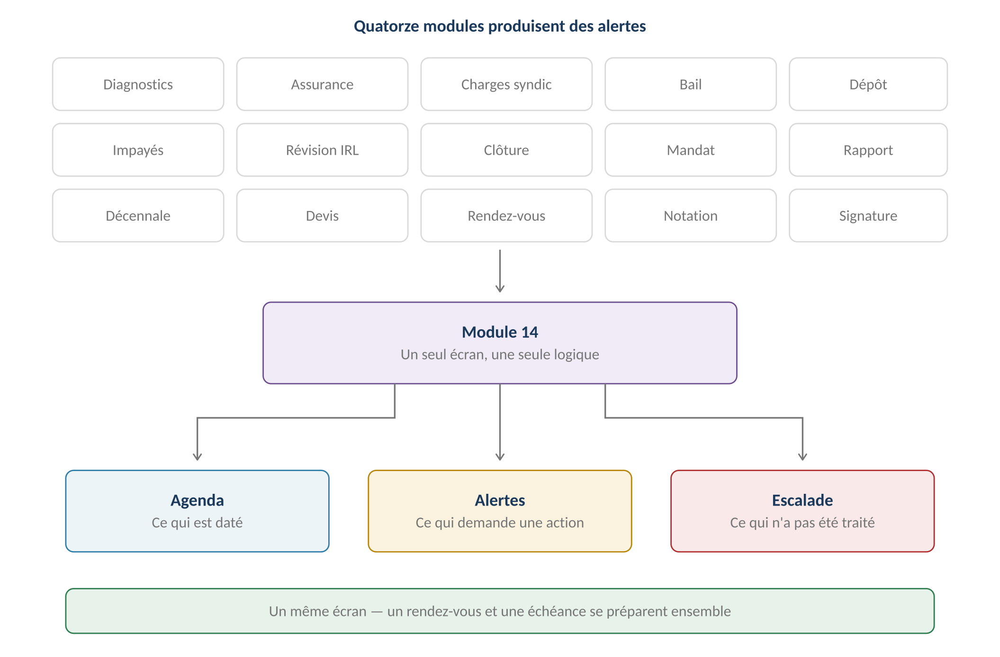
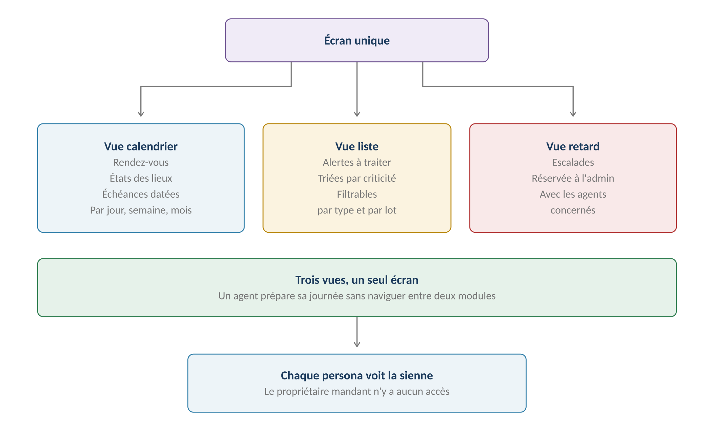
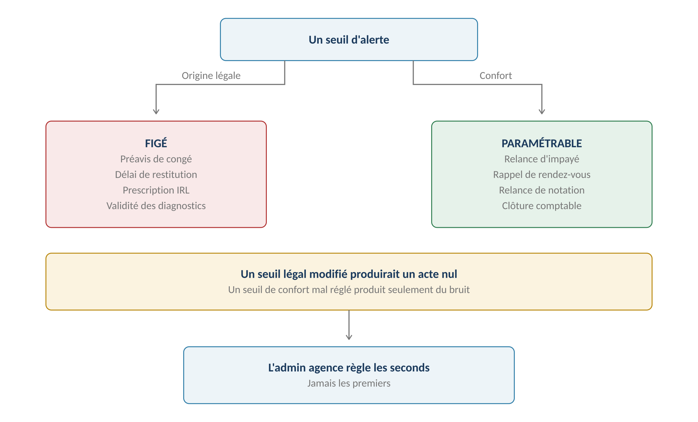
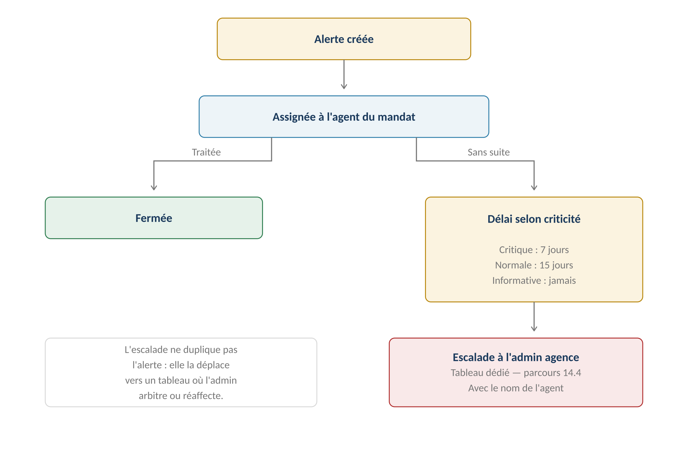

**GERIMMO V3**

Référentiel des parcours clients

**MODULE 14**

**Agenda et alertes**

|               |                                                      |
|:--------------|:-----------------------------------------------------|
| **Périmètre** | 6 parcours · 2 objets métier                         |
| **Dépend de** | **Les treize modules précédents**                    |
| **Nature**    | Module de consolidation — il n'invente aucune alerte |
| **Volume**    | Une trentaine de types d'alertes                     |
| **Statut**    | **Module clos — aucune question ouverte**            |

> **Vue d'ensemble du module**
>
> **Ce module n'invente rien — il rassemble**
>
> Chaque module a défini ses propres alertes, avec ses seuils et ses destinataires.
>
> Ce module leur donne un écran commun, une logique de criticité,
>
> et une règle d'escalade quand elles ne sont pas traitées.

**La consolidation**

------------------------------------------------------------------------

*Schéma 1 — Quatorze modules convergent vers un seul écran*

**L'inventaire des alertes**

------------------------------------------------------------------------

| **Alerte** | **Seuils** | **Destinataire** | **Origine** |
|:---|:---|:---|:---|
| **Expiration de diagnostic** | J-90, J-30, J+0 | Agent | RM-0.8.1 |
| **Attestation d'assurance** | J-30, J-15, J+0, J+15 | Locataire puis agent | RM-0b.6.1 |
| **Purge RGPD imminente** | J-30 | Admin agence | RM-0b.8.4 |
| **Appel de charges syndic** | Clôture, +3, +6, +9 sem. | Agent puis admin | RM-0c.6.2 |
| **Reconduction de bail** | J-180 | Agent | RM-1.8.1 |
| **Préemption après congé** | J+60 | Agent | RM-1.11.6 |
| **Extinction de solidarité** | À échéance | Agent | RM-1.3.5 |
| **État des lieux à planifier** | À la signature ou au congé | Agent | RM-1.7.3 |
| **Restitution du dépôt** | 1 ou 2 mois — légal | Agent | RM-2.4.2 |
| **Impayé** | Paramétrable par agence | Agent puis garant | RM-3.6.1 |
| **Révision IRL** | Date anniversaire | Agent | RM-3.8.4 |
| **Prescription de révision** | J-60 avant les 12 mois | Agent | RM-3.8.5 |
| **Régularisation de charges** | Clôture d'exercice | Agent | RM-3.9.1 |
| **Clôture comptable** | Avant date de rapport | Agent | RM-4.4.7 |
| **Renouvellement de mandat** | J-120 | Agent | RM-5.4.1 |
| **Validation du rapport** | Date du mandat | Agent | RM-6.1.1 |
| **Versement au propriétaire** | J+15 après envoi | Agent | RM-6.2.7 |
| **Expiration de décennale** | J-60, J-30, J-7, J+0 | Artisan puis agence | RM-8.2.5 |
| **Expiration de devis** | J-7 | Agent | RM-9.2.2 |
| **Accord propriétaire en attente** | Tous les 5 jours | Agent | RM-9.5.5 |
| **Preuve de résolution locataire** | Délai imparti | Locataire puis agent | RM-9.8.6 |
| **Rappel de rendez-vous** | J-7 et la veille | Les trois acteurs | RM-10.7.1 |
| **Créneaux sans réponse** | J+2 puis J+4 | Locataire puis agent | RM-10.3.3 |
| **Notation en attente** | J+3 et J+7 | Locataire | RM-11.1.2 |
| **Relance de signature** | J+7, J+21 | Signataire | RM-13.4.1 |
| **Expiration de signature** | J+28 puis J+30 | Agent | RM-13.4.2 |
| **Revue mensuelle des idées** | Mensuelle | Super admin | RM-20.5.1 |

**Objets créés dans ce module**

------------------------------------------------------------------------

| **Objet** | **Description** | **Rattaché à** |
|:---|:---|:---|
| **Alerte** | Échéance demandant une action, avec sa criticité | Entité concernée + Personne |
| **Annonce** | Message diffusé, sans action attendue | Agence ou plateforme |

**Cartographie des 6 parcours**

------------------------------------------------------------------------

| **\#** | **Parcours**                 | **Persona** | **V1 / V2** | **Criticité** |
|:-------|:-----------------------------|:------------|:------------|:--------------|
| 14.1   | **Consultation de l'agenda** | Tous        | **V1**      | Haute         |
| 14.2   | Paramétrage des règles       | AA          | **V1**      | Haute         |
| 14.3   | Traitement d'une alerte      | AG          | **V1**      | Haute         |
| 14.4   | **Reporting des retards**    | AA          | **V1**      | Moyenne       |
| 14.5   | Diffusion par l'agence       | AA          | **V1**      | Faible        |
| 14.6   | Annonce du super admin       | SA          | **V1**      | Faible        |

> **14.1 — Consultation de l'agenda**

|                    |                                             |
|:-------------------|:--------------------------------------------|
| **Persona**        | Tous, selon leurs droits                    |
| **Déclencheur**    | Connexion quotidienne                       |
| **Fréquence**      | Continue                                    |
| **Criticité**      | Haute — c'est l'écran de travail de l'agent |
| **Décision actée** | **Agenda et alertes sur un même écran**     |

**Les trois vues**

------------------------------------------------------------------------

*Schéma 2 — Un seul écran, trois vues complémentaires*

> **Pourquoi ne pas séparer agenda et alertes — décision actée**
>
> Un rendez-vous est daté et se prépare. Une alerte est une échéance
>
> qui demande une action. Ce sont deux natures différentes.
>
> Mais un agent qui prépare sa journée a besoin des deux au même endroit :
>
> ses trois visites et ses cinq relances forment une seule charge de travail.

**Ce que chaque persona voit**

------------------------------------------------------------------------

| **Persona** | **Vue calendrier** | **Vue alertes** | **Vue retards** |
|:---|:---|:---|:---|
| **Agent** | Ses RDV et ceux de ses lots | Ses alertes | Non |
| **Admin agence** | Vue consolidée | Toutes | **Oui** |
| **Locataire** | Ses RDV | Assurance, notation | Non |
| **Artisan** | Ses interventions | Ses pièces à jour | Non |
| **Propriétaire mandant** | **Aucun accès** | Aucun | Non |
| **Super admin** | Non | Non | Supervision globale |

**Les niveaux de criticité**

------------------------------------------------------------------------

| **Niveau**      | **Signification**                          | **Escalade** |
|:----------------|:-------------------------------------------|:-------------|
| **Critique**    | Conséquence légale ou financière immédiate | **7 jours**  |
| **Normale**     | Action attendue sans urgence               | **15 jours** |
| **Informative** | Simple portée à connaissance               | Jamais       |

**Exemples de classement**

------------------------------------------------------------------------

| **Alerte**                                  | **Niveau**  |
|:--------------------------------------------|:------------|
| **Diagnostic expiré sur un lot disponible** | Critique    |
| **Prescription de révision IRL imminente**  | Critique    |
| **Délai de restitution du dépôt**           | Critique    |
| **Impayé au-delà du seuil**                 | Critique    |
| **Renouvellement de mandat à quatre mois**  | Normale     |
| **Régularisation de charges à faire**       | Normale     |
| **Expiration de devis à J-7**               | Normale     |
| **Rappel de rendez-vous**                   | Informative |
| **Notation en attente**                     | Informative |
| **Annonce du super admin**                  | Informative |

**Règles métier**

------------------------------------------------------------------------

> **RM-14.1.1** — Agenda et alertes partagent un même écran, en trois vues.
>
> **RM-14.1.2** — Chaque persona ne voit que ce qui le concerne.
>
> **RM-14.1.3** — Le propriétaire mandant n'a aucun accès à l'agenda.
>
> **RM-14.1.4** — Trois niveaux de criticité : critique, normale, informative.
>
> **RM-14.1.5** — La vue retards est réservée à l'admin agence.

**User story**

------------------------------------------------------------------------

> **US-14.1.1**
>
> *En tant qu'agent immobilier, je veux voir mes rendez-vous et mes alertes ensemble, afin de préparer ma journée en un coup d'œil.*

- **Étant donné** trois visites et cinq alertes pour aujourd'hui, **quand** j'ouvre mon agenda, **alors** les huit éléments apparaissent sur le même écran

- **Étant donné** une alerte critique et une informative, **quand** je consulte la liste, **alors** la critique apparaît en premier

> **14.2 — Paramétrage des règles d'alerte**

|  |  |
|:---|:---|
| **Persona** | AA — Admin agence |
| **Déclencheur** | Installation, puis ajustements |
| **Fréquence** | Rare |
| **Criticité** | Haute |
| **Décision actée** | **Seuils légaux figés, seuils de confort paramétrables** |

**Figé ou paramétrable**

------------------------------------------------------------------------

*Schéma 3 — L'origine du seuil détermine s'il est modifiable*

> **Pourquoi figer les seuils légaux**
>
> Un préavis de congé raccourci produit un acte nul.
>
> Un délai de restitution dépassé expose à une pénalité.
>
> Une révision demandée hors délai est perdue.
>
> Ces seuils ne relèvent pas du confort de l'agence : les modifier
>
> exposerait ses clients à des conséquences juridiques.

**Les seuils figés**

------------------------------------------------------------------------

| **Seuil** | **Valeur** | **Fondement** |
|:---|:---|:---|
| **Préavis de congé bailleur** | 6 mois nu, 3 mois meublé | Loi de 1989 |
| **Préavis de congé locataire** | 3 mois ou 1 mois | Loi de 1989 |
| **Restitution du dépôt** | 1 ou 2 mois | Loi de 1989 |
| **Prescription de révision IRL** | 12 mois | Loi de 1989 |
| **Validité des diagnostics** | De 6 mois à 10 ans | Codes de la construction |
| **Communication des justificatifs** | 6 mois | Loi de 1989 |
| **Préemption après congé pour vente** | 2 mois | Loi de 1989 |

**Les seuils paramétrables**

------------------------------------------------------------------------

| **Seuil**                       | **Défaut**        | **Portée** |
|:--------------------------------|:------------------|:-----------|
| **Montant plancher d'impayé**   | 50 €              | Agence     |
| **Délais de relance d'impayé**  | 5, 15, 15 jours   | Agence     |
| **Information du garant**       | Dès la relance 2  | Agence     |
| **Alerte de diagnostic**        | J-90 et J-30      | Agence     |
| **Alerte de clôture comptable** | J-5 avant rapport | Agence     |
| **Relance de notation**         | J+3 et J+7        | Agence     |
| **Rappel de rendez-vous**       | J-7 et la veille  | Agence     |
| **Délai d'escalade critique**   | 7 jours           | Agence     |
| **Délai d'escalade normale**    | 15 jours          | Agence     |

**Variantes**

------------------------------------------------------------------------

| **Code** | **Situation** | **Comportement** |
|:---|:---|:---|
| **V1** | Valeurs par défaut conservées | Cas majoritaire. Aucune action. |
| **V2** | Ajustement d'un seuil de confort | Effet immédiat sur les alertes à venir. |
| **V3** | **Tentative sur un seuil légal** | Le champ est en lecture seule, avec la mention du fondement. |
| **V4** | Désactivation d'une alerte de confort | Possible. Les alertes légales ne se désactivent pas. |
| **V5** | **Évolution réglementaire** | Le super admin met à jour les seuils légaux pour toutes les agences. |

**Règles métier**

------------------------------------------------------------------------

> **RM-14.2.1** — Les seuils d'origine légale sont figés et non modifiables.
>
> **RM-14.2.2** — Les seuils de confort sont paramétrables par l'admin agence.
>
> **RM-14.2.3** — Une alerte légale ne peut être désactivée.
>
> **RM-14.2.4** — Une alerte de confort peut être désactivée.
>
> **RM-14.2.5** — Seul le super admin met à jour les seuils légaux.
>
> **RM-14.2.6** — Une modification de seuil ne s'applique qu'aux alertes à venir.

**User stories**

------------------------------------------------------------------------

> **US-14.2.1**
>
> *En tant qu'admin agence, je veux ajuster mes délais de relance, afin de les adapter à ma clientèle.*

- **Étant donné** un délai de première relance à cinq jours, **quand** je le porte à dix jours, **alors** les impayés à venir suivent le nouveau délai

> **US-14.2.2**
>
> *En tant qu'admin agence, je veux être empêché de modifier un délai légal, afin de ne pas exposer mes clients.*

- **Étant donné** le délai de restitution du dépôt de garantie, **quand** j'ouvre le paramétrage, **alors** il est en lecture seule avec la mention de son fondement légal

> **14.3 & 14.4 — Traitement et escalade**

**14.3 — Traitement d'une alerte**

------------------------------------------------------------------------

|                 |                                              |
|:----------------|:---------------------------------------------|
| **Persona**     | AG — Agent immobilier                        |
| **Déclencheur** | Alerte apparue sur son écran                 |
| **Fréquence**   | Quotidienne                                  |
| **Criticité**   | Haute                                        |
| **Issues**      | Traitée, reportée, ou escaladée par inaction |

| **\#** | **Acteur** | **Action** | **Écran / état** |
|:---|:---|:---|:---|
| 1 | **Système** | Crée l'alerte et l'assigne à l'agent du mandat | — |
| 2 | AG | La consulte sur son agenda | Vue alertes |
| 3 | AG | Clique dessus pour rejoindre le parcours concerné | Module d'origine |
| 4 | AG | Traite l'échéance | Module concerné |
| 5 | **Système** | **Ferme l'alerte automatiquement** | — |
| — | — | **OU l'agent la reporte** | — |
| 6 | AG | Reporte avec un motif | Nouvelle date |
| 7 | **Système** | Repose l'alerte à la date choisie | — |

> **Une alerte se ferme par l'action, pas par un clic**
>
> Un agent qui dépose le diagnostic manquant voit l'alerte disparaître seule.
>
> Il n'y a pas de bouton « marquer comme traitée » : cela permettrait
>
> de faire disparaître une échéance sans l'avoir réglée.
>
> Le report, lui, est explicite et motivé.

**14.4 — Reporting des retards**

------------------------------------------------------------------------

**Le mécanisme d'escalade**

------------------------------------------------------------------------

*Schéma 4 — L'escalade déplace l'alerte, elle ne la duplique pas*

|                    |                                         |
|:-------------------|:----------------------------------------|
| **Persona**        | AA — Admin agence                       |
| **Déclencheur**    | Alerte non traitée au-delà de son délai |
| **Fréquence**      | Consultation régulière                  |
| **Criticité**      | Moyenne                                 |
| **Décision actée** | **Escalade selon la criticité**         |

| **Niveau**      | **Délai avant escalade** | **Ce que voit l'admin**        |
|:----------------|:-------------------------|:-------------------------------|
| **Critique**    | 7 jours                  | Alerte, lot, agent, ancienneté |
| **Normale**     | 15 jours                 | Alerte, lot, agent, ancienneté |
| **Informative** | Jamais                   | —                              |

> **L'escalade ne duplique pas — elle déplace**
>
> Si l'alerte restait aussi chez l'agent, elle s'accumulerait sans être traitée
>
> et l'admin verrait un tableau qui ne se vide jamais.
>
> Elle bascule donc dans la vue retards, avec le nom de l'agent qui ne l'a pas
>
> traitée. L'admin arbitre : il traite lui-même, réaffecte, ou renvoie à l'agent.

| **\#** | **Acteur**  | **Action**                             | **Écran / état**  |
|:-------|:------------|:---------------------------------------|:------------------|
| 1      | **Système** | Détecte le dépassement du délai        | Tâche quotidienne |
| 2      | **Système** | **Bascule l'alerte en vue retards**    | —                 |
| 3      | **Système** | Notifie l'admin agence                 | Email             |
| 4      | AA          | Consulte le tableau des retards        | Vue retards       |
| 5      | AA          | Traite, réaffecte ou renvoie à l'agent | Trois actions     |
| 6      | **Système** | Trace la décision                      | —                 |

**Ce que le tableau des retards affiche**

------------------------------------------------------------------------

| **Colonne**    | **Contenu**                      |
|:---------------|:---------------------------------|
| **Alerte**     | Type et objet                    |
| **Entité**     | Lot, bail ou personne concernée  |
| **Agent**      | **Celui qui ne l'a pas traitée** |
| **Criticité**  | Critique ou normale              |
| **Ancienneté** | Jours depuis la création         |
| **Action**     | Traiter, réaffecter, renvoyer    |

**Variantes**

------------------------------------------------------------------------

| **Code** | **Situation** | **Comportement** |
|:---|:---|:---|
| **V1** | Traitement dans les délais | Aucune escalade. Cas nominal. |
| **V2** | Report motivé | L'alerte revient à la date choisie. Le compteur repart. |
| **V3** | **Escalade** | L'alerte quitte l'agent pour l'admin. |
| **V4** | Renvoi à l'agent | L'admin la lui rend avec un commentaire. |
| **V5** | **Agent absent** | L'admin réaffecte à un autre agent. |
| **V6** | Alerte devenue sans objet | Elle se ferme seule — le bail résilié, le lot sorti de gestion. |

**Règles métier**

------------------------------------------------------------------------

> **RM-14.3.1** — Une alerte est assignée à l'agent en charge du mandat.
>
> **RM-14.3.2** — Elle se ferme par l'action, non par un marquage manuel.
>
> **RM-14.3.3** — Un report exige une nouvelle date et un motif.
>
> **RM-14.3.4** — Une alerte devenue sans objet se ferme automatiquement.
>
> **RM-14.4.1** — Une alerte critique non traitée escalade après sept jours.
>
> **RM-14.4.2** — Une alerte normale escalade après quinze jours.
>
> **RM-14.4.3** — Une alerte informative n'escalade jamais.
>
> **RM-14.4.4** — L'escalade déplace l'alerte vers l'admin agence, sans la dupliquer.
>
> **RM-14.4.5** — Le tableau des retards nomme l'agent qui n'a pas traité.
>
> **RM-14.4.6** — L'admin peut traiter, réaffecter ou renvoyer à l'agent.

**User stories**

------------------------------------------------------------------------

> **US-14.3.1**
>
> *En tant qu'agent immobilier, je veux que l'alerte se ferme quand je règle l'échéance, afin de ne pas avoir à la clore manuellement.*

- **Étant donné** une alerte de diagnostic expiré, **quand** je dépose le diagnostic renouvelé, **alors** l'alerte disparaît de mon écran sans autre action

> **US-14.4.1**
>
> *En tant qu'admin agence, je veux voir les alertes non traitées avec le nom de l'agent, afin de comprendre où ça bloque.*

- **Étant donné** une alerte critique ouverte depuis dix jours, **quand** j'ouvre la vue retards, **alors** elle apparaît avec l'agent concerné et son ancienneté

- **Étant donné** un agent absent depuis une semaine, **quand** je réaffecte ses alertes, **alors** elles rejoignent l'écran d'un autre agent

> **14.5 & 14.6 — Diffusion d'annonces**
>
> **Une annonce n'est pas une alerte**
>
> Une alerte demande une action et se ferme quand elle est traitée.
>
> Une annonce porte une information à connaissance : fermeture de l'agence,
>
> évolution réglementaire, maintenance de la plateforme.
>
> Elle s'affiche, puis disparaît à sa date de fin.

**14.5 — Diffusion par l'agence**

------------------------------------------------------------------------

|                   |                                          |
|:------------------|:-----------------------------------------|
| **Persona**       | AA — Admin agence                        |
| **Déclencheur**   | Information à porter à connaissance      |
| **Fréquence**     | Occasionnelle                            |
| **Criticité**     | Faible                                   |
| **Destinataires** | Ses agents, ses locataires, ses artisans |

| **Destinataire**      | **Exemples d'annonce**                              |
|:----------------------|:----------------------------------------------------|
| **Ses agents**        | Nouvelle procédure interne, réunion                 |
| **Ses locataires**    | Fermeture estivale, changement de coordonnées       |
| **Ses artisans**      | Nouvelle grille tarifaire, procédure de facturation |
| **Ses propriétaires** | Impossible — aucun accès à l'application            |

**14.6 — Annonce du super admin**

------------------------------------------------------------------------

|                 |                                           |
|:----------------|:------------------------------------------|
| **Persona**     | SA — Super admin                          |
| **Déclencheur** | Information concernant toutes les agences |
| **Fréquence**   | Rare                                      |
| **Criticité**   | Faible                                    |
| **Portée**      | Toutes les agences, ou une sélection      |

| **Type d'annonce**          | **Exemple**                                 |
|:----------------------------|:--------------------------------------------|
| **Évolution réglementaire** | Nouveau contrat type de bail au 1er octobre |
| **Nouvelle fonctionnalité** | Mise à disposition d'un module              |
| **Maintenance**             | Indisponibilité programmée                  |
| **Mise à jour de modèle**   | Nouveau modèle de congé — module 12         |
| **Mise à jour d'indice**    | Rappel de saisie de l'IRL — module 3        |

**Règles métier**

------------------------------------------------------------------------

> **RM-14.5.1** — Une annonce porte une information, sans action attendue.
>
> **RM-14.5.2** — Elle porte une date de début et une date de fin d'affichage.
>
> **RM-14.5.3** — L'agence diffuse à ses agents, locataires et artisans.
>
> **RM-14.5.4** — Le propriétaire mandant ne reçoit aucune annonce — aucun accès.
>
> **RM-14.6.1** — Le super admin diffuse à toutes les agences ou à une sélection.
>
> **RM-14.6.2** — Une annonce du super admin ne peut être masquée par une agence.

**User story**

------------------------------------------------------------------------

> **US-14.6.1**
>
> *En tant que super admin, je veux annoncer une évolution réglementaire à toutes les agences, afin qu'aucune ne l'ignore.*

- **Étant donné** un nouveau contrat type entrant en vigueur, **quand** je diffuse l'annonce, **alors** elle apparaît sur l'agenda de chaque agent de chaque agence

> **Synthèse du module**

**Les règles métier les plus structurantes**

------------------------------------------------------------------------

| **Code**      | **Règle**                                    | **Bloquant** |
|:--------------|:---------------------------------------------|:-------------|
| **RM-14.1.1** | **Agenda et alertes sur un même écran**      | Structurel   |
| **RM-14.1.3** | Le propriétaire mandant n'a aucun accès      | **Oui**      |
| **RM-14.1.4** | Trois niveaux de criticité                   | Structurel   |
| **RM-14.2.1** | **Les seuils légaux sont figés**             | **Oui**      |
| **RM-14.2.2** | Les seuils de confort sont paramétrables     | Structurel   |
| **RM-14.2.3** | Une alerte légale ne se désactive pas        | **Oui**      |
| **RM-14.3.2** | **Une alerte se ferme par l'action**         | Structurel   |
| **RM-14.3.3** | Un report exige date et motif                | **Oui**      |
| **RM-14.4.1** | Escalade critique après sept jours           | Structurel   |
| **RM-14.4.4** | **L'escalade déplace, elle ne duplique pas** | Structurel   |
| **RM-14.4.5** | Le tableau des retards nomme l'agent         | Structurel   |
| **RM-14.6.2** | Une annonce du super admin ne se masque pas  | **Oui**      |

**Décompte des user stories**

------------------------------------------------------------------------

| **Parcours** | **User stories** | **Critères d'acceptation** |
|:---|:---|:---|
| 14.1 — Consultation | 1 | 2 |
| 14.2 — Paramétrage | 2 | 2 |
| 14.3 & 14.4 — Traitement et escalade | 2 | 3 |
| 14.5 & 14.6 — Annonces | 1 | 1 |
| **TOTAL** | **6** | **8** |

**Décisions actées sur ce module**

------------------------------------------------------------------------

| **Décision** | **Statut** |
|:---|:---|
| Seuils légaux figés | **Acté** |
| Seuils de confort paramétrables par l'admin agence | **Acté** |
| Escalade des alertes non traitées | **Acté** |
| Délai d'escalade lié à la criticité | **Acté** |
| Tableau dédié avec le nom de l'agent | **Acté** |
| Agenda et alertes sur un même écran | **Acté** |
| Export vers un agenda externe | **V2** |
| **Notifications push mobiles** | **Hors périmètre — RM-19.3.4** |

**Ce que ce module consolide**

------------------------------------------------------------------------

| **Origine**                            | **Nombre d'alertes**           |
|:---------------------------------------|:-------------------------------|
| **Socle — modules 0, 0b, 0c**          | Quatre types                   |
| **Cœur métier — modules 1 à 6**        | **Treize types**               |
| **Intervention — modules 7 à 11**      | Six types                      |
| **Transverses — modules 12, 13 et 20** | Quatre types                   |
| **TOTAL**                              | **Vingt-sept types d'alertes** |

**Prochaine étape**

------------------------------------------------------------------------

> **Module 15 — Messagerie**
>
> Quatre parcours : conversation agence-locataire, ajout d'un artisan
>
> sur un incident, conversation agence-propriétaire, notifications.
>
> Le point de conception : toute conversation est rattachée à un objet,
>
> sans quoi rien n'est retrouvable.
