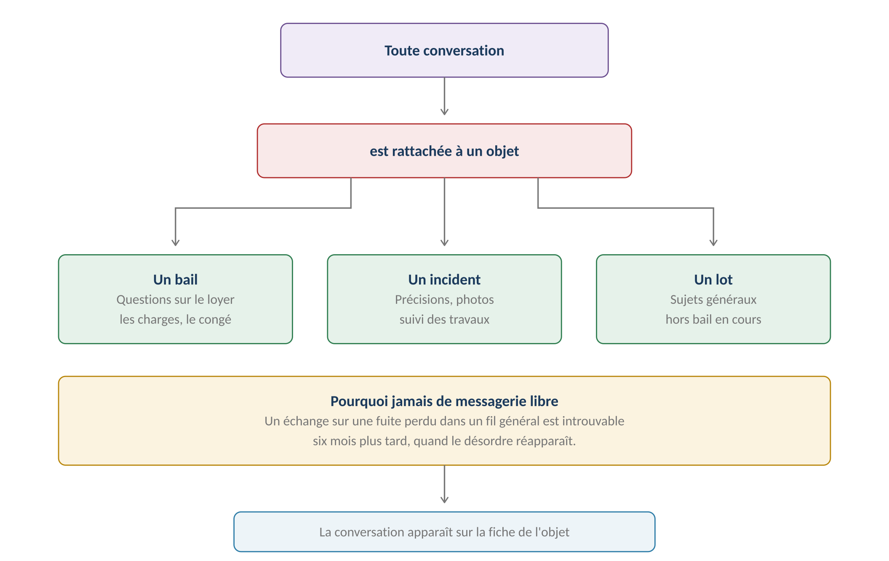
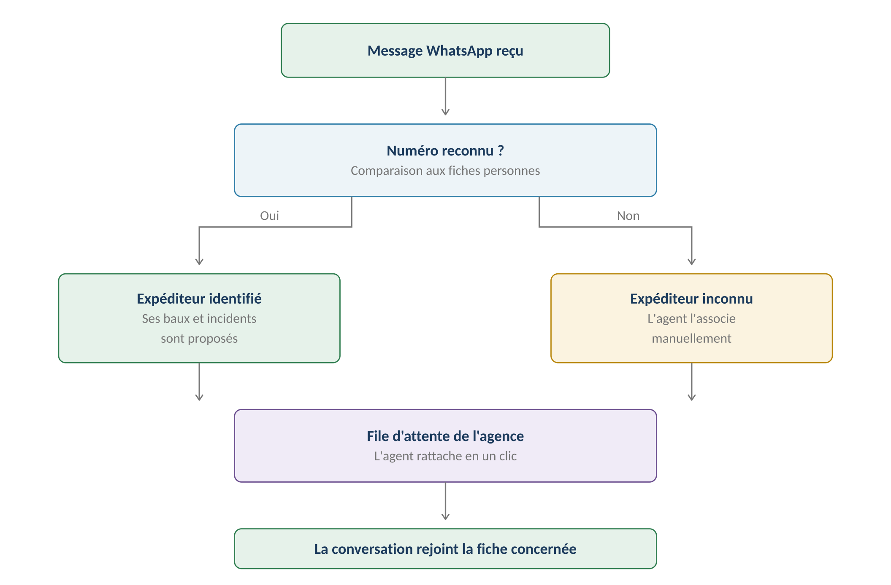
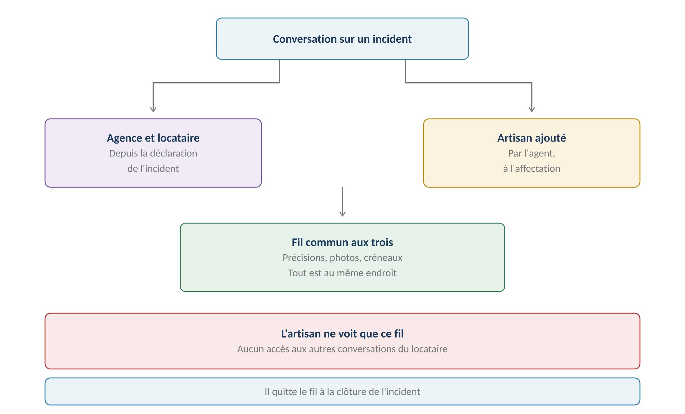
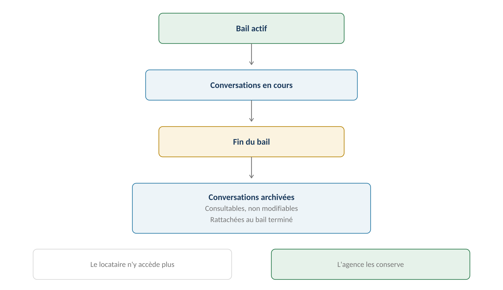

**GERIMMO V3**

Référentiel des parcours clients

**MODULE 15**

**Messagerie**

|                   |                                                 |
|:------------------|:------------------------------------------------|
| **Périmètre**     | 4 parcours · 2 objets métier                    |
| **Dépend de**     | Module 1 (bail) · Module 7 (incident)           |
| **Canal intégré** | **WhatsApp, en plus de la messagerie interne**  |
| **Principe**      | **Toute conversation est rattachée à un objet** |
| **Statut**        | **Module clos — aucune question ouverte**       |

> **Vue d'ensemble du module**

**Le principe fondateur**

------------------------------------------------------------------------

*Schéma 1 — Aucune messagerie libre : tout échange se rattache à un objet*

> **Pourquoi jamais de fil général**
>
> Une messagerie libre produit un flux continu où tout se mélange :
>
> une question sur le loyer, une photo de fuite, une demande de quittance.
>
> Six mois plus tard, quand le désordre réapparaît, personne ne retrouve
>
> ce qui avait été dit ni ce qui avait été promis.
>
> Le rattachement rend l'échange retrouvable depuis la fiche concernée.

**Objets créés dans ce module**

------------------------------------------------------------------------

| **Objet** | **Description** | **Rattaché à** |
|:---|:---|:---|
| **Conversation** | Fil d'échanges entre plusieurs personnes | Bail, incident ou lot |
| **Message** | Contribution datée, avec ses pièces jointes | Conversation |

**Les objets auxquels rattacher**

------------------------------------------------------------------------

| **Objet** | **Sujets typiques** | **Participants** |
|:---|:---|:---|
| **Bail** | Loyer, charges, congé, documents | Agence et locataire |
| **Incident** | Précisions, photos, créneaux, suivi | **Agence, locataire et artisan** |
| **Lot** | Sujets généraux, hors bail en cours | Agence et locataire |
| **Mandat** | Traçage d'échanges hors application | Agence seule — le propriétaire n'a pas d'accès |

**Cartographie des 4 parcours**

------------------------------------------------------------------------

| **\#** | **Parcours** | **Persona** | **V1 / V2** | **Criticité** |
|:---|:---|:---|:---|:---|
| 15.1 | **Conversation agence-locataire** | AG / LO | **V1** | Haute |
| 15.2 | Ajout d'un artisan sur un incident | AG / AR | **V1** | Moyenne |
| 15.3 | **Traçage des échanges propriétaire** | AG | **V1** | Moyenne |
| 15.4 | Notifications et relances | Système | **V1** | Moyenne |

> **15.1 — Conversation agence et locataire**

|                    |                                               |
|:-------------------|:----------------------------------------------|
| **Persona**        | AG — Agent immobilier · LO — Locataire        |
| **Déclencheur**    | Question, demande ou information à échanger   |
| **Fréquence**      | Quotidienne                                   |
| **Criticité**      | Haute                                         |
| **Décision actée** | **Le locataire peut ouvrir une conversation** |

**Parcours nominal — ouverture par le locataire**

------------------------------------------------------------------------

| **\#** | **Acteur** | **Action** | **Écran / état** |
|:---|:---|:---|:---|
| 1 | LO | Depuis son espace, clique « Écrire à mon agence » | Espace locataire |
| 2 | LO | **Choisit le sujet : son bail ou un incident** | Sélecteur |
| 3 | LO | Rédige son message | Texte libre |
| 4 | LO | Peut joindre une photo ou un document | Upload |
| 5 | LO | Envoie | — |
| 6 | **Système** | Crée ou complète la conversation rattachée | — |
| 7 | **Système** | Notifie l'agent en charge du mandat | Email + agenda |
| 8 | AG | Répond depuis la fiche du bail ou de l'incident | Fiche |
| 9 | **Système** | Notifie le locataire | Email + espace |

**L'intégration WhatsApp**

------------------------------------------------------------------------

*Schéma 2 — Un message entrant passe par une file d'attente avant rattachement*

> **WhatsApp intégré — décision actée**
>
> Un locataire écrit spontanément sur WhatsApp : il ne choisit aucun objet.
>
> Le message arrive dans une file d'attente de l'agence. Si le numéro correspond
>
> à une personne connue, ses baux et incidents en cours sont proposés.
>
> L'agent rattache en un clic.
>
> C'est ce qui préserve le principe du rattachement obligatoire
>
> malgré un canal qui, par nature, ne le connaît pas.

**Les deux canaux**

------------------------------------------------------------------------

|  | **Messagerie interne** | **WhatsApp** |
|:---|:---|:---|
| **Rattachement** | Choisi à l'envoi | Par l'agent, après réception |
| **Identification** | Compte connecté | Numéro de téléphone |
| **Pièces jointes** | Oui | Oui |
| **Notification** | Email et espace | WhatsApp |
| **Historique** | Dans la conversation | Dans la conversation, après rattachement |
| **Usage typique** | Demande formelle | Signalement rapide, photo |

**Variantes**

------------------------------------------------------------------------

| **Code** | **Situation** | **Comportement** |
|:---|:---|:---|
| **V1** | Ouverture par l'agence | L'agent initie depuis une fiche. |
| **V2** | **Ouverture par le locataire** | Il choisit l'objet parmi ses baux et incidents. |
| **V3** | **Message WhatsApp entrant** | File d'attente, rattachement par l'agent. |
| **V4** | Numéro inconnu | L'agent associe manuellement à une personne. |
| **V5** | Colocation | Chaque colocataire voit le fil du bail commun. |
| **V6** | **Message hors sujet** | L'agent peut le déplacer vers un autre objet. |

**Cas d'erreur**

------------------------------------------------------------------------

| **Cas** | **Comportement attendu** |
|:---|:---|
| Aucun objet sélectionné | **BLOCAGE — le rattachement est obligatoire** |
| Locataire sans bail actif | Il peut écrire sur un bail archivé, en lecture seule côté agence |
| Pièce jointe trop lourde | Refus avec indication de la limite |
| Message WhatsApp non rattaché depuis 48 h | **Alerte à l'agent — le locataire attend une réponse** |

**Règles métier**

------------------------------------------------------------------------

> **RM-15.1.1** — Toute conversation est rattachée à un bail, un incident ou un lot.
>
> **RM-15.1.2** — Le locataire peut ouvrir une conversation, pas seulement répondre.
>
> **RM-15.1.3** — Il choisit l'objet parmi ses baux et incidents en cours.
>
> **RM-15.1.4** — Un message WhatsApp entrant arrive dans une file d'attente.
>
> **RM-15.1.5** — L'identification se fait par numéro de téléphone si la personne est connue.
>
> **RM-15.1.6** — L'agent rattache le message en un clic ; le rattachement reste obligatoire.
>
> **RM-15.1.7** — Un message non rattaché depuis quarante-huit heures alerte l'agent.
>
> **RM-15.1.8** — Un message peut être déplacé vers un autre objet par l'agent.

**User stories**

------------------------------------------------------------------------

> **US-15.1.1**
>
> *En tant que locataire, je veux écrire à mon agence en choisissant le sujet, afin que ma question atterrisse au bon endroit.*

- **Étant donné** une question sur ma régularisation de charges, **quand** j'ouvre une conversation, **alors** je choisis mon bail comme objet et l'agent la retrouve depuis sa fiche

- **Étant donné** un incident en cours, **quand** j'ouvre une conversation, **alors** il m'est proposé parmi les objets disponibles

> **US-15.1.2**
>
> *En tant qu'agent immobilier, je veux rattacher un message WhatsApp en un clic, afin de ne pas perdre le bénéfice du classement.*

- **Étant donné** un message WhatsApp d'un numéro connu, **quand** j'ouvre la file d'attente, **alors** les baux et incidents de cette personne me sont proposés

- **Étant donné** un message d'un numéro inconnu, **quand** je l'associe à une personne, **alors** le numéro est enregistré pour les prochains messages

> **15.2 — Ajout d'un artisan sur un incident**

|                 |                                              |
|:----------------|:---------------------------------------------|
| **Persona**     | AG — Agent immobilier · AR — Artisan         |
| **Déclencheur** | Affectation d'un incident à un artisan (7.3) |
| **Fréquence**   | À chaque intervention                        |
| **Criticité**   | Moyenne                                      |
| **Portée**      | Le fil de cet incident uniquement            |

**Le fil à trois**

------------------------------------------------------------------------

*Schéma 3 — L'artisan rejoint un fil existant, sans accéder au reste*

> **Trois acteurs, un seul fil**
>
> Le locataire décrit le désordre, l'agent qualifie, l'artisan pose ses questions.
>
> Sans fil commun, l'agent servirait d'intermédiaire à chaque échange :
>
> l'artisan lui demande une précision, il la demande au locataire,
>
> puis retransmet la réponse.
>
> Le fil commun supprime cet intermédiaire pour les échanges opérationnels.

**Parcours nominal**

------------------------------------------------------------------------

| **\#** | **Acteur** | **Action** | **Écran / état** |
|:---|:---|:---|:---|
| 1 | AG | Affecte l'incident à un artisan (7.3) | Fiche incident |
| 2 | **Système** | Ajoute l'artisan au fil de l'incident | — |
| 3 | **Système** | Notifie les trois participants | — |
| 4 | AR | Consulte l'historique du fil | Espace artisan |
| 5 | AR | Pose une question ou joint une photo | — |
| 6 | LO | Répond directement | Espace locataire |
| 7 | **Système** | À la clôture de l'incident, retire l'artisan du fil | — |
| 8 | **Système** | Le fil reste consultable par l'agence et le locataire | — |

**Ce que l'artisan voit et ne voit pas**

------------------------------------------------------------------------

| **Élément** | **Accès** |
|:---|:---|
| **Le fil de l'incident qui lui est affecté** | **Oui, entièrement** |
| **Les messages antérieurs à son arrivée** | Oui — il a besoin du contexte |
| **Les autres incidents du même lot** | **Non** |
| **Les conversations sur le bail** | **Non** |
| **L'identité complète du locataire** | Prénom et téléphone seulement |
| **Le fil après clôture** | Non — il en est retiré |

**Règles métier**

------------------------------------------------------------------------

> **RM-15.2.1** — L'artisan est ajouté au fil de l'incident à son affectation.
>
> **RM-15.2.2** — Il accède à l'historique complet de ce fil, y compris avant son arrivée.
>
> **RM-15.2.3** — Il n'accède à aucun autre fil du locataire ni du lot.
>
> **RM-15.2.4** — Il est retiré du fil à la clôture de l'incident.
>
> **RM-15.2.5** — Le fil reste consultable par l'agence et le locataire après clôture.
>
> **RM-15.2.6** — L'artisan ne voit du locataire que son prénom et son téléphone.

**User story**

------------------------------------------------------------------------

> **US-15.2.1**
>
> *En tant qu'artisan, je veux poser mes questions directement au locataire, afin de ne pas passer par l'agence pour chaque précision.*

- **Étant donné** un incident qui m'est affecté, **quand** j'ouvre le fil, **alors** je vois l'historique et peux écrire au locataire

- **Étant donné** l'incident clôturé, **quand** je cherche le fil, **alors** il n'apparaît plus dans mon espace

> **15.3 & 15.4 — Propriétaire et notifications**

**15.3 — Traçage des échanges avec le propriétaire**

------------------------------------------------------------------------

> **Ce parcours a changé de nature**
>
> Le propriétaire mandant n'ayant aucun accès à l'application,
>
> aucune conversation ne peut se tenir avec lui dans Gerimmo.
>
> Le parcours devient donc un traçage d'échanges hors application,
>
> comme l'accord sur devis du module 9.

|                 |                                          |
|:----------------|:-----------------------------------------|
| **Persona**     | AG — Agent immobilier                    |
| **Déclencheur** | Échange important avec le propriétaire   |
| **Fréquence**   | Occasionnelle                            |
| **Criticité**   | Moyenne                                  |
| **Canal réel**  | **Email ou téléphone, hors application** |

| **\#** | **Acteur** | **Action** | **Écran / état** |
|:---|:---|:---|:---|
| 1 | AG | Échange avec le propriétaire | Email ou téléphone |
| 2 | AG | Depuis la fiche du mandat, enregistre l'échange | Formulaire |
| 3 | AG | Saisit la date, le canal et la teneur | — |
| 4 | AG | Peut joindre l'email reçu | Upload |
| 5 | **Système** | Rattache la trace au mandat | — |

**Ce qui mérite d'être tracé**

------------------------------------------------------------------------

| **Situation** | **Pourquoi** |
|:---|:---|
| **Accord sur un devis** | Déjà couvert par le parcours 9.5 |
| **Contestation d'une dépense** | Le propriétaire remet en cause une ligne du rapport |
| **Instruction particulière** | Il demande de ne pas relouer, de vendre, d'attendre |
| **Décision sur un congé** | Il souhaite reprendre son bien |
| **Réclamation** | Mécontentement sur la gestion |
| **Échange courant** | Non — inutile de tout tracer |

> **Tracer ce qui engage, pas tout**
>
> Un traçage systématique de chaque appel serait ingérable et personne
>
> ne le ferait.
>
> Ce qui mérite une trace, c'est ce qui engage : une instruction,
>
> un accord, une contestation. Le reste peut rester informel.

**15.4 — Notifications et relances**

------------------------------------------------------------------------

|                 |                                              |
|:----------------|:---------------------------------------------|
| **Persona**     | Système                                      |
| **Déclencheur** | Nouveau message ou absence de réponse        |
| **Fréquence**   | Continue                                     |
| **Criticité**   | Moyenne                                      |
| **Canal**       | Selon le destinataire et son canal d'origine |

| **Événement**                   | **Destinataire**   | **Canal**       |
|:--------------------------------|:-------------------|:----------------|
| **Message du locataire**        | Agent du mandat    | Email et agenda |
| **Réponse de l'agent**          | Locataire          | Canal d'origine |
| **Message de l'artisan**        | Agent et locataire | Email et espace |
| **Message sans réponse à J+2**  | **Agent**          | Alerte agenda   |
| **WhatsApp non rattaché à J+2** | **Agent**          | Alerte agenda   |

> **Le canal de réponse suit le canal d'origine**
>
> Un locataire qui écrit par WhatsApp reçoit la réponse par WhatsApp.
>
> Celui qui passe par son espace est notifié par email.
>
> Sans cette règle, un locataire habitué à WhatsApp ne verrait jamais
>
> les réponses qui lui arrivent par email.

**Variantes**

------------------------------------------------------------------------

| **Code** | **Situation** | **Comportement** |
|:---|:---|:---|
| **V1** | Réponse dans les délais | Aucune relance. |
| **V2** | **Message sans réponse** | Alerte à l'agent après deux jours. |
| **V3** | Agent absent | L'alerte escalade à l'admin agence (module 14). |
| **V4** | Locataire injoignable | Les notifications échouent, l'agent est prévenu. |
| **V5** | Notification désactivée | Le destinataire peut couper les emails, jamais les alertes critiques. |

**L'archivage**

------------------------------------------------------------------------

*Schéma 4 — Les conversations suivent le sort du bail*

> **Archivage avec le bail — décision actée**
>
> À la fin du bail, ses conversations passent en lecture seule.
>
> Le locataire n'y accède plus depuis son espace — il n'a plus de bail.
>
> L'agence les conserve : elles peuvent servir en cas de litige
>
> sur la restitution du dépôt ou une régularisation contestée.

**Règles métier**

------------------------------------------------------------------------

> **RM-15.3.1** — Aucune conversation ne se tient avec le propriétaire dans l'application.
>
> **RM-15.3.2** — Les échanges qui l'engagent sont tracés sur son mandat.
>
> **RM-15.3.3** — La trace comporte la date, le canal et la teneur.
>
> **RM-15.4.1** — La réponse emprunte le canal d'origine du message.
>
> **RM-15.4.2** — Un message sans réponse alerte l'agent après deux jours.
>
> **RM-15.4.3** — Les alertes de messagerie escaladent comme les autres (module 14).
>
> **RM-15.4.4** — Les conversations s'archivent avec le bail.
>
> **RM-15.4.5** — Une conversation archivée reste consultable par l'agence.
>
> **RM-15.4.6** — Le locataire n'accède plus aux conversations d'un bail terminé.

**User stories**

------------------------------------------------------------------------

> **US-15.4.1**
>
> *En tant que locataire, je veux recevoir la réponse par le canal que j'ai utilisé, afin de ne pas avoir à surveiller deux endroits.*

- **Étant donné** un message que j'ai envoyé par WhatsApp, **quand** l'agent répond, **alors** je reçois sa réponse sur WhatsApp

> **US-15.4.2**
>
> *En tant qu'agent immobilier, je veux retrouver les échanges d'un bail terminé, afin de me défendre si le locataire conteste une retenue.*

- **Étant donné** un bail terminé il y a six mois, **quand** j'ouvre sa fiche, **alors** les conversations archivées restent consultables

> **Synthèse du module**

**Les règles métier les plus structurantes**

------------------------------------------------------------------------

| **Code** | **Règle** | **Bloquant** |
|:---|:---|:---|
| **RM-15.1.1** | **Toute conversation est rattachée à un objet** | **Oui** |
| **RM-15.1.2** | Le locataire peut ouvrir une conversation | Structurel |
| **RM-15.1.4** | **Un WhatsApp entrant passe par une file d'attente** | Structurel |
| **RM-15.1.6** | Le rattachement reste obligatoire, même via WhatsApp | **Oui** |
| **RM-15.1.7** | Un message non rattaché à J+2 alerte l'agent | Non |
| **RM-15.2.3** | **L'artisan n'accède à aucun autre fil** | **Oui** |
| **RM-15.2.4** | Il est retiré du fil à la clôture | Structurel |
| **RM-15.2.6** | Il ne voit que le prénom et le téléphone du locataire | **Oui** |
| **RM-15.3.1** | Aucune conversation avec le propriétaire dans l'app | Structurel |
| **RM-15.4.1** | **La réponse emprunte le canal d'origine** | Structurel |
| **RM-15.4.4** | Les conversations s'archivent avec le bail | Structurel |
| **RM-15.4.6** | Le locataire perd l'accès aux fils d'un bail terminé | **Oui** |

**Décompte des user stories**

------------------------------------------------------------------------

| **Parcours** | **User stories** | **Critères d'acceptation** |
|:---|:---|:---|
| **15.1 — Agence et locataire** | **2** | **4** |
| 15.2 — Artisan sur incident | 1 | 2 |
| 15.3 & 15.4 — Propriétaire et notifications | 2 | 2 |
| **TOTAL** | **5** | **8** |

**Décisions actées sur ce module**

------------------------------------------------------------------------

| **Décision**                                 | **Statut**          |
|:---------------------------------------------|:--------------------|
| Toute conversation rattachée à un objet      | **Acté**            |
| Le locataire peut ouvrir une conversation    | **Acté**            |
| WhatsApp intégré à la messagerie             | **Acté**            |
| File d'attente et rattachement par l'agent   | **Acté**            |
| Identification par numéro de téléphone       | **Acté**            |
| L'artisan rejoint le fil de son incident     | **Acté**            |
| Archivage avec le bail                       | **Acté**            |
| **Parcours 15.3 en traçage d'échanges**      | **Nature modifiée** |
| Messagerie libre sans rattachement           | **Hors périmètre**  |
| Conversation avec le propriétaire dans l'app | **Hors périmètre**  |

**Ce que ce module consomme**

------------------------------------------------------------------------

| **Module**                | **Ce qu'il fournit**                     |
|:--------------------------|:-----------------------------------------|
| **Module 1 — Bail**       | L'objet de rattachement le plus fréquent |
| **Module 7 — Incidents**  | **Le fil à trois acteurs**               |
| **Module 12 — Documents** | Les pièces jointes aux conversations     |
| **Module 14 — Alertes**   | Les relances et leur escalade            |

**Prochaine étape**

------------------------------------------------------------------------

> **Module 16 — Onboarding et invitations**
>
> Huit parcours : création d'agence, paramétrage initial, import de données,
>
> invitation des utilisateurs depuis Gerimmo et via bot WhatsApp,
>
> relance, refus et première connexion.
>
> C'est le module qui décide si une agence réussit à démarrer.
