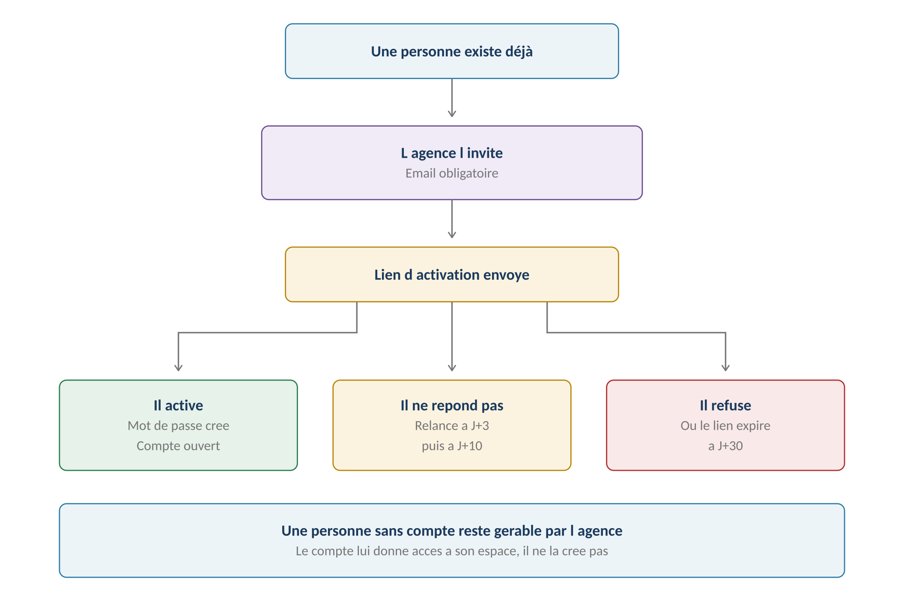
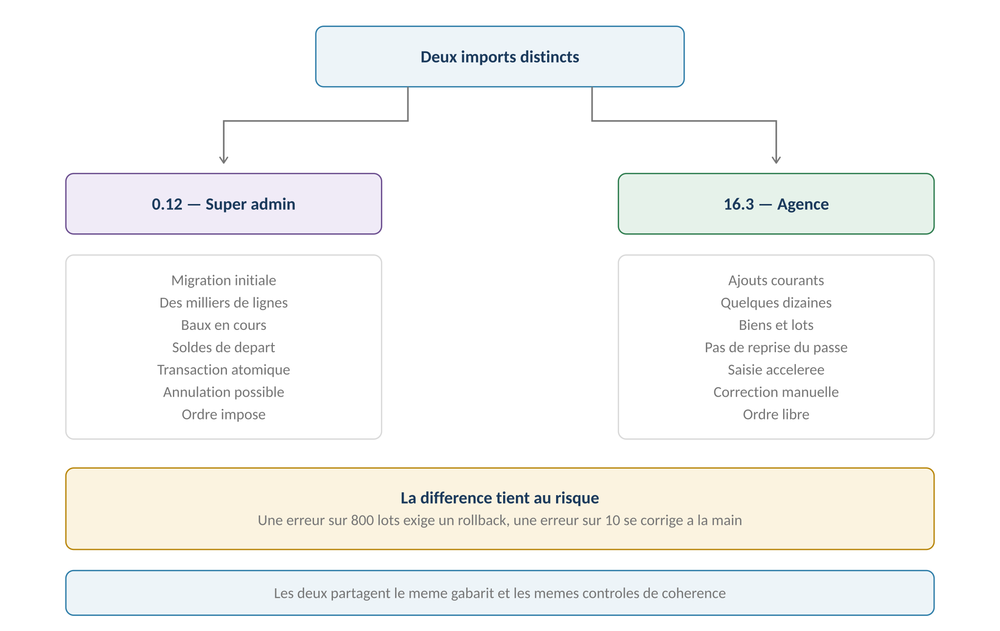
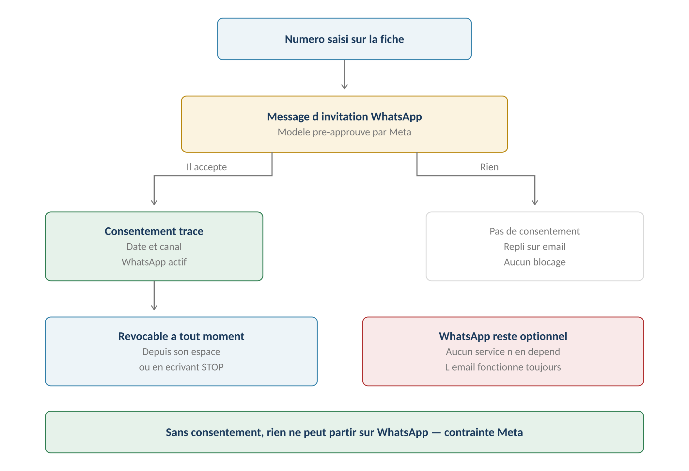
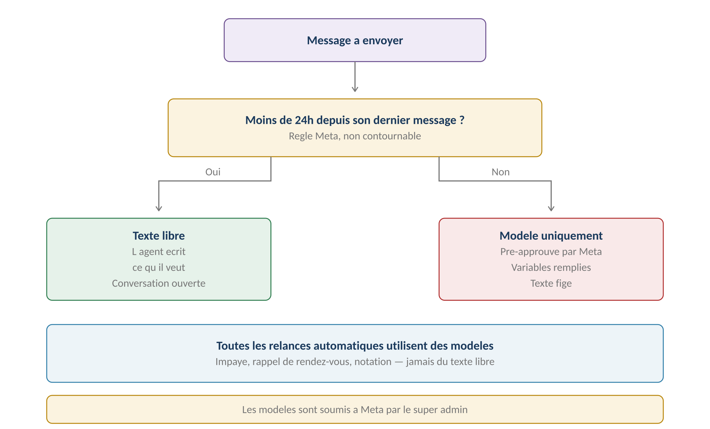

**GERIMMO V3**

Référentiel des parcours clients

**MODULE 16**

**Onboarding et invitations**

|  |  |
|:---|:---|
| **Périmètre** | 8 parcours · 2 objets métier |
| **Dépend de** | Module 0b — les personnes existent avant d'être invitées |
| **Alimente** | **Messagerie (module 15) · Tous les espaces personnels** |
| **Enjeu commercial** | **Sans import, aucune agence ne migre** |
| **Statut** | **Module clos — aucune question ouverte** |

> **Vue d'ensemble du module**
>
> **Une personne existe avant d'avoir un compte**
>
> Le module 0b crée les personnes : locataires, garants, propriétaires.
>
> L'agence les gère sans qu'elles aient nécessairement accès à l'application.
>
> Ce module leur ouvre un espace personnel — quand elles en ont besoin,
>
> et quand elles l'acceptent.

**Qui a un compte, qui n'en a pas**

------------------------------------------------------------------------

| **Persona** | **Compte** | **Pourquoi** |
|:---|:---|:---|
| **Super admin** | **Oui** | Créé à l'installation de la plateforme |
| **Admin agence** | **Oui** | Créé par le super admin (16.1) |
| **Agent immobilier** | **Oui** | Invité par l'admin agence |
| **Locataire** | Optionnel | Utile mais non indispensable |
| **Artisan** | **Oui** | Il dépose ses pièces lui-même (RM-8.2.1) |
| **Propriétaire mandant** | **JAMAIS** | Décision actée — aucun accès |
| **Propriétaire gestion directe** | **Oui** | Il gère lui-même ses biens |

**Le circuit d'invitation**

------------------------------------------------------------------------

*Schéma 1 — Le compte donne accès à un espace, il ne crée pas la personne*

**Objets créés dans ce module**

------------------------------------------------------------------------

| **Objet** | **Description** | **Rattaché à** |
|:---|:---|:---|
| **Compte** | Accès à un espace personnel, avec ses droits | Personne |
| **Consentement** | Accord de recevoir des messages sur un canal | Personne + Canal |

**Cartographie des 8 parcours**

------------------------------------------------------------------------

| **\#** | **Parcours**                    | **Persona** | **V1 / V2** | **Criticité** |
|:-------|:--------------------------------|:------------|:------------|:--------------|
| 16.1   | Création d'une agence           | SA          | **V1**      | Haute         |
| 16.2   | Paramétrage initial             | AA          | **V1**      | Haute         |
| 16.3   | **Import courant par l'agence** | AA          | **V1**      | Haute         |
| 16.4   | Invitation d'un utilisateur     | AA          | **V1**      | Moyenne       |
| 16.5   | **Enrôlement WhatsApp**         | Tous        | **V1**      | **MAXIMALE**  |
| 16.6   | Relance d'invitation            | Système     | **V1**      | Faible        |
| 16.7   | Refus ou expiration             | Système     | **V1**      | Faible        |
| 16.8   | Première connexion              | Tous        | **V1**      | Moyenne       |

> **16.1 & 16.2 — Création et paramétrage d'une agence**

**16.1 — Création d'une agence**

------------------------------------------------------------------------

|                 |                                               |
|:----------------|:----------------------------------------------|
| **Persona**     | SA — Super admin                              |
| **Déclencheur** | Signature d'un contrat commercial             |
| **Fréquence**   | À chaque nouveau client                       |
| **Criticité**   | Haute                                         |
| **Aboutit à**   | Un espace agence vide, avec son premier admin |

| **\#** | **Acteur** | **Action** | **Écran / état** |
|:---|:---|:---|:---|
| 1 | SA | Depuis la console, clique « Nouvelle agence » | Console |
| 2 | SA | Saisit raison sociale, SIRET, carte professionnelle | Formulaire |
| 3 | SA | Renseigne le contact du premier admin agence | — |
| 4 | SA | Choisit le plan et les modules activés | — |
| 5 | **Système** | Crée l'agence et son jeu de données par défaut | — |
| 6 | **Système** | **Installe les modèles Gerimmo (module 12)** | — |
| 7 | **Système** | Installe les grilles par défaut | — |
| 8 | **Système** | Invite le premier admin agence (16.4) | Email |

**Ce qui est installé par défaut**

------------------------------------------------------------------------

| **Élément**                       | **Origine**               |
|:----------------------------------|:--------------------------|
| **Modèles de documents**          | Module 12 — RM-12.1.2     |
| **Grille de récupérables**        | Module 0c — décret 87-713 |
| **Grille de vétusté**             | Module 2 — RM-2.4.9       |
| **Plan de catégories comptables** | Module 4 — RM-4.7.2       |
| **Liste d'équipements**           | Module 0 — RM-0.5.5       |
| **Seuils d'alerte de confort**    | Module 14 — RM-14.2.2     |
| **Modèles de messages WhatsApp**  | Parcours 16.5             |

> **Une agence démarre avec un jeu complet de paramètres**
>
> Elle peut commencer à travailler immédiatement, sans rien configurer.
>
> Chaque grille, chaque modèle, chaque seuil a une valeur par défaut
>
> issue de la pratique ou de la réglementation. L'agence les ajuste ensuite
>
> si elle le souhaite.

**16.2 — Paramétrage initial**

------------------------------------------------------------------------

| **Étape** | **Ce que l'admin agence renseigne** | **Obligatoire** |
|:---|:---|:---|
| **Identité** | Logo, coordonnées, mentions légales | Oui |
| **Utilisateurs** | Ses agents immobiliers | Oui |
| **Indice IRL** | **Le dernier publié — module 3** | Oui |
| **Seuil de délégation** | Montant par défaut des devis | Oui |
| **Seuils de relance** | Impayés, notation | Défauts fournis |
| **Marque blanche** | Logo et couleurs — module 17 | Optionnel |
| **WhatsApp** | Activation du canal | Optionnel |

**Règles métier**

------------------------------------------------------------------------

> **RM-16.1.1** — Seul le super admin crée une agence.
>
> **RM-16.1.2** — Une agence reçoit un jeu complet de paramètres par défaut.
>
> **RM-16.1.3** — Le premier admin agence est invité automatiquement.
>
> **RM-16.2.1** — L'indice IRL doit être saisi avant toute révision de loyer.
>
> **RM-16.2.2** — Le seuil de délégation doit être renseigné avant tout devis.
>
> **16.3 — Import courant par l'agence**

|                 |                                              |
|:----------------|:---------------------------------------------|
| **Persona**     | AA — Admin agence                            |
| **Déclencheur** | Acquisition de nouveaux mandats              |
| **Fréquence**   | Occasionnelle                                |
| **Criticité**   | Haute                                        |
| **Distinction** | **À ne pas confondre avec le parcours 0.12** |

**Deux imports, deux périmètres**

------------------------------------------------------------------------

*Schéma 2 — Deux imports : la différence tient au volume et au risque*

> **Pourquoi conserver les deux — décision actée**
>
> Le 0.12 est une migration : des milliers de lignes, des baux en cours,
>
> des soldes de départ. Une erreur exige un rollback complet.
>
> Le 16.3 est de la saisie accélérée : quelques dizaines de lots,
>
> sans reprise du passé. Une erreur se corrige à la main.
>
> Supprimer le 16.3 créerait une dépendance au super admin à chaque ajout.

**Comparaison**

------------------------------------------------------------------------

| **Aspect** | **0.12 — Super admin** | **16.3 — Agence** |
|:---|:---|:---|
| **Volume** | Des milliers de lignes | Quelques dizaines |
| **Objets** | Tous, y compris baux et soldes | Biens, lots, personnes |
| **Reprise du passé** | Oui | Non |
| **Transaction** | Atomique | Ligne par ligne |
| **Annulation globale** | Oui | Non |
| **Ordre imposé** | Neuf rangs | Libre |
| **Gabarit** | **Commun aux deux** | **Commun aux deux** |
| **Contrôles** | **Communs aux deux** | **Communs aux deux** |

**Parcours nominal**

------------------------------------------------------------------------

| **\#** | **Acteur** | **Action** | **Écran / état** |
|:---|:---|:---|:---|
| 1 | AA | Télécharge le gabarit | Excel |
| 2 | AA | Dépose le fichier rempli | Zone de dépôt |
| 3 | **Système** | Applique les mêmes contrôles que le 0.12 | — |
| 4 | **Système** | Affiche la prévisualisation | Compteurs |
| 5 | AA | Valide | — |
| 6 | **Système** | Crée les objets ligne par ligne | — |
| 7 | **Système** | Signale les lignes en échec | Rapport |

**Règles métier**

------------------------------------------------------------------------

> **RM-16.3.1** — L'import courant partage le gabarit et les contrôles du parcours 0.12.
>
> **RM-16.3.2** — Il ne permet ni la reprise de baux en cours ni de soldes de départ.
>
> **RM-16.3.3** — Les lignes en échec n'empêchent pas les autres d'aboutir.
>
> **RM-16.3.4** — Aucune annulation globale : la correction se fait à la main.

**User story**

------------------------------------------------------------------------

> **US-16.3.1**
>
> *En tant qu'admin agence, je veux importer une dizaine de lots sans passer par le super admin, afin de ne pas dépendre de lui à chaque nouveau mandat.*

- **Étant donné** huit lots acquis d'un nouveau propriétaire, **quand** je dépose le fichier rempli, **alors** les huit sont créés sans intervention extérieure

> **16.4 & 16.5 — Invitations et enrôlement**

**16.4 — Invitation d'un utilisateur**

------------------------------------------------------------------------

|                 |                                     |
|:----------------|:------------------------------------|
| **Persona**     | AA — Admin agence                   |
| **Déclencheur** | Une personne a besoin d'un espace   |
| **Fréquence**   | Régulière                           |
| **Criticité**   | Moyenne                             |
| **Prérequis**   | La personne existe déjà (module 0b) |

| **\#** | **Acteur** | **Action** | **Écran / état** |
|:---|:---|:---|:---|
| 1 | AA | Depuis la fiche personne, clique « Inviter » | Fiche personne |
| 2 | **Système** | Vérifie la présence d'un email | Blocage si absent |
| 3 | AA | Choisit le rôle | Sélecteur |
| 4 | **Système** | Envoie le lien d'activation | Email |
| 5 | **Système** | Programme les relances | J+3, J+10 |
| 6 | **Système** | Fixe l'expiration à J+30 | — |

> **Une personne sans compte reste gérable**
>
> Un locataire qui n'accepte jamais son invitation continue d'être géré :
>
> son bail existe, ses quittances sont émises, ses documents lui sont envoyés.
>
> Le compte lui donne un espace de consultation et la possibilité de déclarer
>
> un incident. Il ne conditionne rien.

**16.5 — Enrôlement WhatsApp**

------------------------------------------------------------------------

|                    |                                               |
|:-------------------|:----------------------------------------------|
| **Persona**        | Tous sauf le propriétaire mandant             |
| **Déclencheur**    | Activation du canal par l'agence              |
| **Fréquence**      | Une fois par personne                         |
| **Criticité**      | MAXIMALE — contraintes Meta non contournables |
| **Décision actée** | **WhatsApp optionnel, repli sur l'email**     |

**Le circuit de consentement**

------------------------------------------------------------------------

*Schéma 3 — Sans consentement, aucun message ne peut partir sur WhatsApp*

| **\#** | **Acteur** | **Action** | **Écran / état** |
|:---|:---|:---|:---|
| 1 | AG | Saisit le numéro sur la fiche personne | Module 0b |
| 2 | AA | Active le canal WhatsApp pour cette personne | — |
| 3 | **Système** | **Envoie un message d'invitation — modèle Meta** | WhatsApp |
| 4 | Personne | Répond pour accepter | WhatsApp |
| 5 | **Système** | Enregistre le consentement, daté | — |
| 6 | **Système** | Active le canal pour cette personne | — |
| — | — | **Sans réponse** | — |
| 7 | **Système** | Le canal reste inactif, l'email prend le relais | — |

**La fenêtre de 24 heures**

------------------------------------------------------------------------

*Schéma 4 — Au-delà de 24 heures, seuls les modèles pré-approuvés passent*

> **Une contrainte Meta, pas un choix de conception**
>
> WhatsApp Business n'autorise le texte libre que dans les 24 heures
>
> suivant le dernier message du destinataire.
>
> Au-delà, seuls des modèles soumis à Meta et validés peuvent partir.
>
> Toutes les relances automatiques du module 14 utilisent donc des modèles.

**Les modèles WhatsApp à faire approuver**

------------------------------------------------------------------------

| **Modèle**                  | **Usage**               | **Module** |
|:----------------------------|:------------------------|:-----------|
| **Invitation**              | Demande de consentement | Ce module  |
| **Rappel de rendez-vous**   | J-7 et la veille        | Module 10  |
| **Relance d'impayé**        | Trois niveaux           | Module 3   |
| **Attestation d'assurance** | Rappel annuel           | Module 0b  |
| **Document disponible**     | Quittance, décompte     | Module 12  |
| **Demande de notation**     | Après intervention      | Module 11  |
| **Créneaux à choisir**      | Proposition d'artisan   | Module 10  |
| **Signature en attente**    | Relance                 | Module 13  |

> **Les modèles sont gérés par le super admin — décision actée**
>
> Même logique que les modèles de documents du module 12 : un modèle mal rédigé
>
> serait refusé par Meta, ou pire, validé puis utilisé de travers.
>
> Le super admin les soumet, les maintient, et les met à disposition
>
> de toutes les agences.

**La révocation**

------------------------------------------------------------------------

| **Moyen**             | **Effet**                            |
|:----------------------|:-------------------------------------|
| **Depuis son espace** | **Décision actée — case à décocher** |
| **En écrivant STOP**  | Mécanisme natif de WhatsApp          |
| **Par l'agence**      | Sur demande de la personne, tracée   |
| **Effet**             | Immédiat — repli sur l'email         |

**Variantes**

------------------------------------------------------------------------

| **Code** | **Situation** | **Comportement** |
|:---|:---|:---|
| **V1** | Consentement donné | Le canal WhatsApp est actif pour cette personne. |
| **V2** | **Pas de consentement** | Repli automatique sur l'email. Aucun blocage. |
| **V3** | **Révocation** | Effet immédiat. Les messages en attente basculent sur email. |
| **V4** | Numéro changé | Nouveau consentement à recueillir. |
| **V5** | Agence sans WhatsApp | Le canal n'existe pas. Tout passe par email. |
| **V6** | **Propriétaire mandant** | Jamais concerné — il n'a aucun accès (RM-14.1.3). |

**Cas d'erreur**

------------------------------------------------------------------------

| **Cas** | **Comportement attendu** |
|:---|:---|
| Envoi sans consentement | **BLOCAGE — contrainte Meta** |
| Texte libre hors fenêtre de 24h | **BLOCAGE — modèle imposé** |
| Modèle non approuvé par Meta | **BLOCAGE — le super admin doit le soumettre** |
| Numéro invalide | Échec signalé, repli sur email |
| Aucun email ni WhatsApp | **BLOCAGE — un canal au minimum est requis** |

**Règles métier**

------------------------------------------------------------------------

> **RM-16.4.1** — Une invitation exige un email valide.
>
> **RM-16.4.2** — Une personne sans compte reste gérable par l'agence.
>
> **RM-16.4.3** — Le propriétaire mandant n'est jamais invité.
>
> **RM-16.5.1** — WhatsApp est optionnel : l'email reste le canal de repli.
>
> **RM-16.5.2** — Aucun message WhatsApp sans consentement préalable.
>
> **RM-16.5.3** — Le consentement est daté et conservé.
>
> **RM-16.5.4** — Il est révocable depuis l'espace personnel ou en écrivant STOP.
>
> **RM-16.5.5** — Hors fenêtre de 24 heures, seuls les modèles approuvés peuvent partir.
>
> **RM-16.5.6** — Les modèles WhatsApp sont soumis à Meta par le super admin.
>
> **RM-16.5.7** — Toute alerte doit disposer d'un canal de repli.

**User stories**

------------------------------------------------------------------------

> **US-16.5.1**
>
> *En tant que locataire, je veux recevoir mes quittances sur WhatsApp, afin de ne pas les chercher dans mes emails.*

- **Étant donné** une invitation WhatsApp reçue de mon agence, **quand** j'y réponds pour accepter, **alors** mes documents me parviennent désormais sur ce canal

- **Étant donné** que je change d'avis, **quand** je décoche l'option dans mon espace, **alors** tout revient immédiatement par email

> **US-16.5.2**
>
> *En tant qu'agent immobilier, je veux que mes relances partent quand même si le locataire n'a pas WhatsApp, afin de ne pas dépendre de son choix.*

- **Étant donné** un locataire sans consentement WhatsApp, **quand** une relance d'impayé se déclenche, **alors** elle part par email sans que j'aie à intervenir

> **16.6 à 16.8 — Relances, refus et activation**

**16.6 & 16.7 — Cycle de vie de l'invitation**

------------------------------------------------------------------------

| **Échéance**      | **Action**                 | **Effet**              |
|:------------------|:---------------------------|:-----------------------|
| **J+0**           | Envoi du lien d'activation | —                      |
| **J+3**           | Première relance           | Automatique            |
| **J+10**          | Seconde relance            | Automatique            |
| **J+30**          | **Expiration du lien**     | Renvoyable en un clic  |
| **À tout moment** | Refus explicite            | Tracé, plus de relance |

> **Un refus n'est pas un problème**
>
> Un locataire qui ne veut pas de compte reste géré normalement.
>
> Son refus est simplement enregistré pour qu'aucune relance ne reparte,
>
> et l'agence continue de lui envoyer ses documents par email.

**16.8 — Première connexion**

------------------------------------------------------------------------

| **\#** | **Acteur** | **Action** | **Écran / état** |
|:---|:---|:---|:---|
| 1 | Personne | Clique sur le lien reçu | Navigateur |
| 2 | **Système** | Vérifie la validité du lien | Blocage si expiré |
| 3 | Personne | Définit son mot de passe | Formulaire |
| 4 | Personne | Accepte les conditions d'utilisation | Case à cocher |
| 5 | **Système** | Active le compte | — |
| 6 | **Système** | **Propose l'enrôlement WhatsApp (16.5)** | Optionnel |
| 7 | **Système** | Affiche l'espace correspondant à son rôle | — |

**Ce que chaque espace contient**

------------------------------------------------------------------------

| **Persona** | **Contenu de son espace** |
|:---|:---|
| **Agent immobilier** | Agenda, lots, baux, incidents, comptabilité |
| **Admin agence** | Idem, plus paramétrage et vue retards |
| **Locataire** | Bail, quittances, incidents, messagerie, documents |
| **Artisan** | Missions, devis, factures, pièces, agenda |
| **Propriétaire direct** | Ses lots, ses baux, sa comptabilité |
| **Propriétaire mandant** | **Aucun espace** |

**Règles métier**

------------------------------------------------------------------------

> **RM-16.6.1** — Deux relances automatiques partent à J+3 et J+10.
>
> **RM-16.7.1** — Le lien d'activation expire à J+30.
>
> **RM-16.7.2** — Un refus explicite arrête les relances et reste tracé.
>
> **RM-16.7.3** — Une invitation expirée est renvoyable en un clic.
>
> **RM-16.8.1** — L'acceptation des conditions d'utilisation est obligatoire.
>
> **RM-16.8.2** — L'enrôlement WhatsApp est proposé à la première connexion, sans obligation.
>
> **RM-16.8.3** — L'espace affiché dépend du rôle de la personne.

**User story**

------------------------------------------------------------------------

> **US-16.7.1**
>
> *En tant qu'admin agence, je veux qu'un refus arrête les relances, afin de ne pas harceler quelqu'un qui a dit non.*

- **Étant donné** un locataire qui refuse son invitation, **quand** il clique sur « Je ne souhaite pas de compte », **alors** aucune relance ne repart et son refus est enregistré

> **Synthèse du module**

**Les règles métier les plus structurantes**

------------------------------------------------------------------------

| **Code** | **Règle** | **Bloquant** |
|:---|:---|:---|
| **RM-16.1.2** | **Une agence reçoit un jeu complet de paramètres** | Structurel |
| **RM-16.2.1** | L'indice IRL avant toute révision | **Oui** |
| **RM-16.3.1** | Gabarit et contrôles communs aux deux imports | Structurel |
| **RM-16.3.2** | L'import courant ne reprend pas le passé | Structurel |
| **RM-16.4.2** | **Une personne sans compte reste gérable** | Structurel |
| **RM-16.4.3** | Le propriétaire mandant n'est jamais invité | **Oui** |
| **RM-16.5.1** | **WhatsApp optionnel, email en repli** | Structurel |
| **RM-16.5.2** | Aucun message sans consentement | **Oui** |
| **RM-16.5.4** | Consentement révocable depuis l'espace | Structurel |
| **RM-16.5.5** | **Hors 24 heures, modèles approuvés seulement** | **Oui** |
| **RM-16.5.7** | Toute alerte doit avoir un canal de repli | **Oui** |
| **RM-16.7.2** | Un refus arrête les relances | Structurel |

**Décompte des user stories**

------------------------------------------------------------------------

| **Parcours**                   | **User stories** | **Critères d'acceptation** |
|:-------------------------------|:-----------------|:---------------------------|
| 16.3 — Import courant          | 1                | 1                          |
| **16.5 — Enrôlement WhatsApp** | **2**            | **3**                      |
| 16.7 — Refus                   | 1                | 1                          |
| **TOTAL**                      | **4**            | **5**                      |

**Décisions actées sur ce module**

------------------------------------------------------------------------

| **Décision**                              | **Statut**         |
|:------------------------------------------|:-------------------|
| WhatsApp optionnel, repli sur email       | **Acté**           |
| Modèles WhatsApp gérés par le super admin | **Acté**           |
| Révocation depuis l'espace personnel      | **Acté**           |
| Deux parcours d'import conservés          | **Acté**           |
| Gabarit et contrôles communs              | **Acté**           |
| Le propriétaire mandant sans compte       | **Acté**           |
| Bot WhatsApp conversationnel              | **Hors périmètre** |
| SMS comme canal alternatif                | **Hors périmètre** |

**Ce que ce module impose ailleurs**

------------------------------------------------------------------------

| **Module** | **Conséquence** |
|:---|:---|
| **Module 14 — Alertes** | **Chaque alerte doit avoir un canal de repli** |
| **Module 15 — Messagerie** | **L'enrôlement conditionne le canal WhatsApp** |
| **Module 12 — Documents** | L'envoi WhatsApp suit le consentement |
| **Module 17 — Marque blanche** | Le paramétrage initial l'active |
| **Module 18 — Administration** | Les modèles WhatsApp s'y gèrent |

**Prochaine étape**

------------------------------------------------------------------------

> **Module 17 — Marque blanche**
>
> Quatre parcours : activation par le super admin, personnalisation par l'agence,
>
> personnalisation des documents, et expérience des utilisateurs finaux.
>
> Il ne reste ensuite que l'administration et le mobile.
