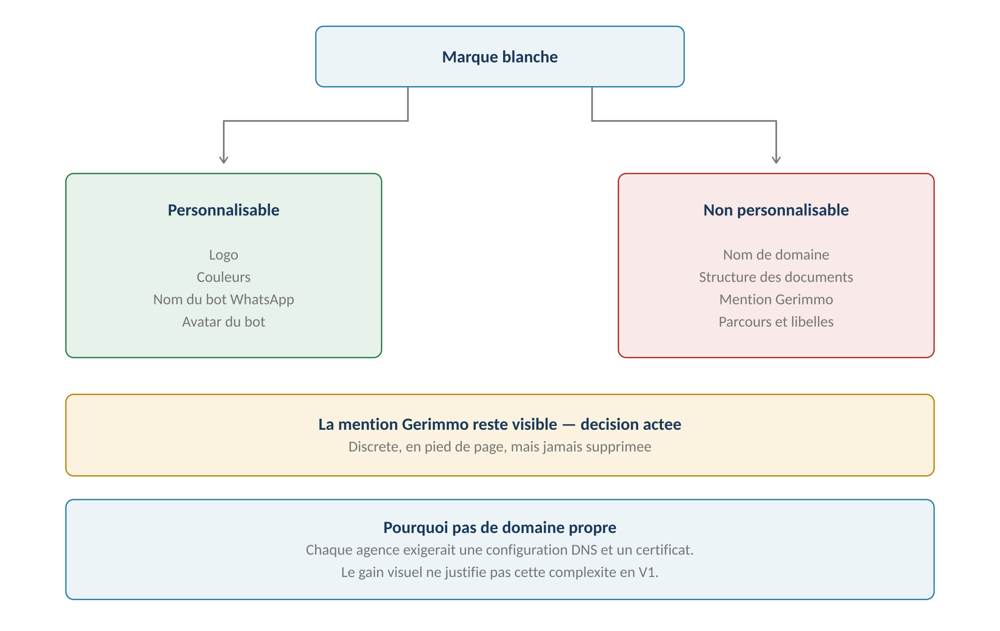
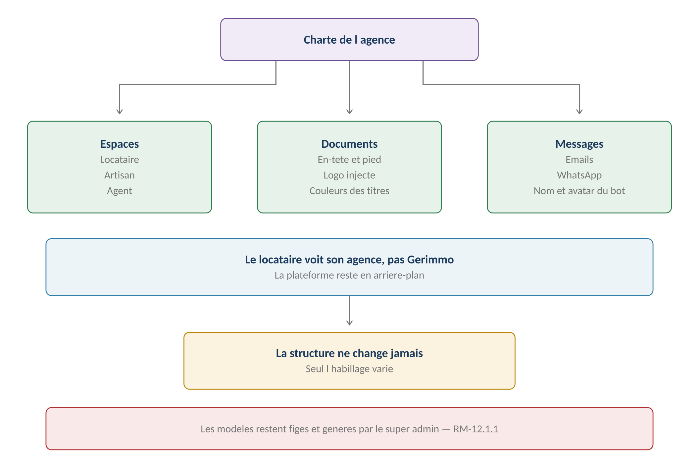
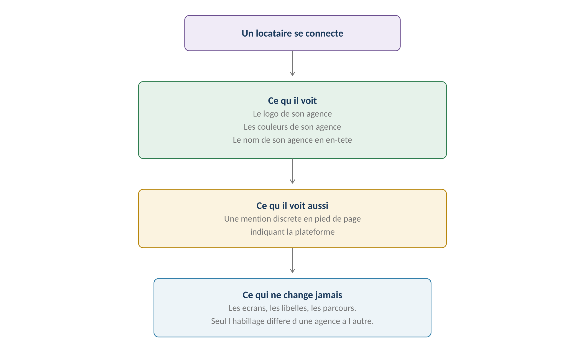

**GERIMMO V3**

Référentiel des parcours clients

**MODULE 17**

**Marque blanche**

|               |                                                 |
|:--------------|:------------------------------------------------|
| **Périmètre** | 3 parcours · 1 objet métier                     |
| **Dépend de** | Module 12 (documents) · Module 16 (WhatsApp)    |
| **Nature**    | Habillage — aucun parcours métier n'est modifié |
| **Enjeu**     | Argument commercial pour vendre aux réseaux     |
| **Statut**    | **Module clos — aucune question ouverte**       |

> **Vue d'ensemble du module**
>
> **Un module d'habillage, pas de fonctionnement**
>
> Aucun parcours métier n'est modifié par la marque blanche.
>
> Les écrans, les libellés, les règles restent identiques d'une agence à l'autre.
>
> Seul l'habillage change : le logo et les couleurs de l'agence.
>
> C'est peu profond techniquement, mais décisif commercialement.

**Le périmètre exact**

------------------------------------------------------------------------

*Schéma 1 — Ce qui se personnalise et ce qui ne se personnalise pas*

> **Trois décisions actées**
>
> Personnalisation limitée au logo et aux couleurs — pas de nom de domaine propre.
>
> La mention Gerimmo reste visible, discrète mais jamais supprimée.
>
> C'est l'admin agence qui personnalise, pas le super admin.

**Pourquoi pas de domaine propre**

------------------------------------------------------------------------

| **Aspect** | **Conséquence d'un domaine par agence** |
|:---|:---|
| **Configuration DNS** | À faire par chaque agence, avec assistance |
| **Certificat TLS** | Un par domaine, à renouveler |
| **Emails** | Configuration SPF et DKIM par domaine |
| **Support** | Chaque erreur de configuration remonte au super admin |
| **Gain** | Cosmétique — l'utilisateur clique un lien, il ne lit pas l'URL |

**Objet créé dans ce module**

------------------------------------------------------------------------

| **Objet**  | **Description**              | **Rattaché à** |
|:-----------|:-----------------------------|:---------------|
| **Charte** | Logo et couleurs de l'agence | Agence         |

**Cartographie des 3 parcours**

------------------------------------------------------------------------

| **\#** | **Parcours** | **Persona** | **V1 / V2** | **Criticité** |
|:---|:---|:---|:---|:---|
| 17.1 | Activation de la marque blanche | SA | **V1** | Faible |
| 17.2 | **Personnalisation visuelle** | AA | **V1** | Moyenne |
| 17.3 | Expérience des utilisateurs finaux | LO / AR | **V1** | Faible |

> **17.1 & 17.2 — Activation et personnalisation**

**17.1 — Activation par le super admin**

------------------------------------------------------------------------

|                 |                                                 |
|:----------------|:------------------------------------------------|
| **Persona**     | SA — Super admin                                |
| **Déclencheur** | Souscription au plan incluant la marque blanche |
| **Fréquence**   | Une fois par agence                             |
| **Criticité**   | Faible                                          |
| **Effet**       | Ouvre le paramétrage à l'admin agence           |

| **\#** | **Acteur** | **Action** | **Écran / état** |
|:---|:---|:---|:---|
| 1 | SA | Depuis la fiche agence, active l'option | Console |
| 2 | **Système** | Ouvre le menu de personnalisation à l'admin agence | — |
| 3 | **Système** | Applique la charte Gerimmo par défaut | — |
| 4 | SA | Notifie l'agence | Email |

**17.2 — Personnalisation visuelle**

------------------------------------------------------------------------

|                    |                                           |
|:-------------------|:------------------------------------------|
| **Persona**        | AA — Admin agence                         |
| **Déclencheur**    | Marque blanche activée                    |
| **Fréquence**      | Une fois, puis ajustements                |
| **Criticité**      | Moyenne                                   |
| **Décision actée** | **C'est l'admin agence qui personnalise** |

| **\#** | **Acteur** | **Action** | **Écran / état** |
|:---|:---|:---|:---|
| 1 | AA | Ouvre le paramétrage de la charte | Module 18 |
| 2 | AA | Téléverse son logo | Formats acceptés |
| 3 | **Système** | Contrôle dimensions et format | Alerte si inadapté |
| 4 | AA | Choisit une couleur principale et une couleur secondaire | Sélecteur |
| 5 | **Système** | **Vérifie le contraste pour la lisibilité** | Alerte |
| 6 | AA | Prévisualise sur un écran type | Aperçu |
| 7 | AA | Valide | — |
| 8 | **Système** | Applique immédiatement à tous les espaces | — |

**Les contraintes techniques**

------------------------------------------------------------------------

| **Élément** | **Contrainte** | **Raison** |
|:---|:---|:---|
| **Logo** | PNG ou SVG, fond transparent | Il s'affiche sur plusieurs fonds |
| **Dimensions** | Ratio proche du carré ou horizontal | Contraintes d'en-tête |
| **Poids** | Sous 500 Ko | Temps de chargement |
| **Couleur principale** | Contraste suffisant sur blanc | Lisibilité du texte |
| **Couleur secondaire** | Distincte de la principale | Hiérarchie visuelle |

> **Le contrôle de contraste évite un écueil courant**
>
> Une agence choisit un jaune vif comme couleur principale. Le texte blanc
>
> sur ce fond devient illisible.
>
> Le système vérifie le contraste et alerte. Il ne bloque pas — l'agence
>
> reste maîtresse de son identité — mais elle est prévenue.

**Où la charte s'applique**

------------------------------------------------------------------------

*Schéma 2 — Espaces, documents et messages portent la charte*

| **Support**            | **Ce qui est personnalisé**                      |
|:-----------------------|:-------------------------------------------------|
| **Espace locataire**   | Logo en en-tête, couleurs des boutons et titres  |
| **Espace artisan**     | Idem                                             |
| **Espace agent**       | Idem                                             |
| **Documents générés**  | Logo en en-tête, couleurs des titres — module 12 |
| **Emails**             | Logo, couleurs, signature                        |
| **Écran de connexion** | Logo de l'agence si l'accès se fait par son lien |

> **La structure des documents ne change pas**
>
> RM-12.1.1 pose que les modèles sont figés et générés par le super admin.
>
> La marque blanche injecte le logo et les couleurs à la génération,
>
> mais ne touche ni au contenu ni à la mise en page.
>
> Une agence qui veut un document différent passe par le circuit du module 12.

**Variantes**

------------------------------------------------------------------------

| **Code** | **Situation** | **Comportement** |
|:---|:---|:---|
| **V1** | Charte Gerimmo conservée | Cas par défaut. Aucune action. |
| **V2** | Logo seul personnalisé | Les couleurs restent celles de Gerimmo. |
| **V3** | **Contraste insuffisant** | Alerte non bloquante. L'agence décide. |
| **V4** | Retour à la charte par défaut | Un clic. Effet immédiat. |
| **V5** | Marque blanche désactivée | Retour à la charte Gerimmo pour tous les espaces. |

**Règles métier**

------------------------------------------------------------------------

> **RM-17.1.1** — Le super admin active la marque blanche par agence.
>
> **RM-17.2.1** — L'admin agence personnalise le logo et deux couleurs.
>
> **RM-17.2.2** — Le contraste est contrôlé, avec alerte non bloquante.
>
> **RM-17.2.3** — La charte s'applique aux espaces, aux documents et aux messages.
>
> **RM-17.2.4** — Elle ne modifie jamais la structure des documents (RM-12.1.1).
>
> **RM-17.2.5** — Aucun nom de domaine personnalisé en V1.
>
> **RM-17.2.6** — La mention de la plateforme reste visible en pied de page.

**User stories**

------------------------------------------------------------------------

> **US-17.2.1**
>
> *En tant qu'admin agence, je veux que mes locataires voient mon logo, afin qu'ils reconnaissent leur interlocuteur.*

- **Étant donné** mon logo téléversé, **quand** un locataire se connecte, **alors** il voit mon logo en en-tête de son espace

- **Étant donné** une quittance générée, **quand** il la télécharge, **alors** elle porte mon logo et mes couleurs

> **US-17.2.2**
>
> *En tant qu'admin agence, je veux être averti si mes couleurs nuisent à la lisibilité, afin de ne pas dégrader l'expérience de mes clients.*

- **Étant donné** une couleur principale très claire, **quand** je la sélectionne, **alors** une alerte me signale le contraste insuffisant

- **Étant donné** cette alerte, **quand** je valide malgré tout, **alors** la couleur est appliquée

> **17.3 — Expérience des utilisateurs finaux**

*Schéma 3 — Le locataire voit son agence, avec une mention discrète de la plateforme*

|                 |                                          |
|:----------------|:-----------------------------------------|
| **Persona**     | LO — Locataire · AR — Artisan            |
| **Déclencheur** | Connexion à leur espace                  |
| **Fréquence**   | Continue                                 |
| **Criticité**   | Faible                                   |
| **Effet**       | Aucune action — ils constatent seulement |

| **Ce qu'ils voient**                      | **Origine**                |
|:------------------------------------------|:---------------------------|
| **Le logo de l'agence**                   | Charte (17.2)              |
| **Les couleurs de l'agence**              | Charte (17.2)              |
| **Le nom de l'agence en en-tête**         | Paramétrage (16.2)         |
| **Une mention discrète de la plateforme** | Décision actée — RM-17.2.6 |

> **Un artisan travaillant pour plusieurs agences**
>
> Il voit la charte de l'agence dont il consulte les missions.
>
> Son agenda consolidé — RM-10.7.3 — mélange les interventions de plusieurs agences.
>
> Chaque ligne porte alors le logo de l'agence concernée, ce qui l'aide
>
> à identifier son interlocuteur d'un coup d'œil.

**Cas d'erreur**

------------------------------------------------------------------------

| **Cas**                    | **Comportement attendu**            |
|:---------------------------|:------------------------------------|
| Logo au mauvais format     | Refus au dépôt, formats indiqués    |
| Logo trop lourd            | Compression automatique, alerte     |
| Contraste insuffisant      | Alerte non bloquante                |
| Marque blanche non activée | Charte Gerimmo appliquée par défaut |

**Règles métier**

------------------------------------------------------------------------

> **RM-17.3.1** — L'utilisateur final voit la charte de l'agence concernée.
>
> **RM-17.3.2** — Un artisan multi-agences voit chaque logo sur les lignes correspondantes.
>
> **RM-17.3.3** — Aucun parcours ni libellé n'est modifié par la marque blanche.

**User story**

------------------------------------------------------------------------

> **US-17.3.1**
>
> *En tant qu'artisan travaillant pour trois agences, je veux distinguer leurs missions, afin de savoir qui m'a mandaté.*

- **Étant donné** des interventions pour trois agences différentes, **quand** j'ouvre mon agenda, **alors** chaque ligne porte le logo de l'agence concernée

> **Synthèse du module**

**Les règles métier**

------------------------------------------------------------------------

| **Code** | **Règle** | **Bloquant** |
|:---|:---|:---|
| **RM-17.1.1** | Le super admin active la marque blanche | Structurel |
| **RM-17.2.1** | **L'admin agence personnalise logo et couleurs** | Structurel |
| **RM-17.2.2** | Contraste contrôlé, alerte non bloquante | Non |
| **RM-17.2.4** | **La structure des documents ne change jamais** | **Oui** |
| **RM-17.2.5** | Aucun nom de domaine personnalisé en V1 | Structurel |
| **RM-17.2.6** | **La mention de la plateforme reste visible** | **Oui** |
| **RM-17.3.2** | Un artisan multi-agences voit chaque logo | Structurel |
| **RM-17.3.3** | Aucun parcours n'est modifié | Structurel |

**Décompte des user stories**

------------------------------------------------------------------------

| **Parcours** | **User stories** | **Critères d'acceptation** |
|:---|:---|:---|
| 17.2 — Personnalisation visuelle | 2 | 4 |
| 17.3 — Expérience finale | 1 | 1 |
| **TOTAL** | **3** | **5** |

**Décisions actées sur ce module**

------------------------------------------------------------------------

| **Décision**                              | **Statut**                    |
|:------------------------------------------|:------------------------------|
| Logo et couleurs personnalisables         | **Acté**                      |
| Mention Gerimmo visible                   | **Acté**                      |
| Personnalisation par l'admin agence       | **Acté**                      |
| **Personnalisation du bot WhatsApp**      | **Abandonné — trop complexe** |
| Nom de domaine personnalisé               | **V2**                        |
| Suppression de la mention Gerimmo         | **Hors périmètre**            |
| Personnalisation des libellés et parcours | **Hors périmètre**            |

**Ce que ce module consomme**

------------------------------------------------------------------------

| **Module**                     | **Ce qu'il fournit**                |
|:-------------------------------|:------------------------------------|
| **Module 12 — Documents**      | **La génération injecte la charte** |
| **Module 18 — Administration** | L'écran de paramétrage de la charte |

**Prochaine étape**

------------------------------------------------------------------------

> **Module 18 — Administration et super admin**
>
> Six parcours : rôles et permissions, paramétrage de l'agence,
>
> supervision de la plateforme, facturation, journal d'audit.
>
> C'est le module qui reçoit tous les paramétrages définis ailleurs.
>
> Il ne restera ensuite que le module 19 — Mobile.
