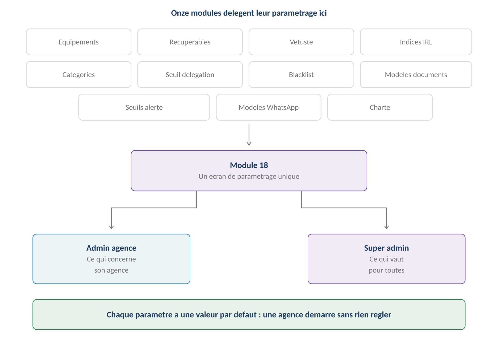
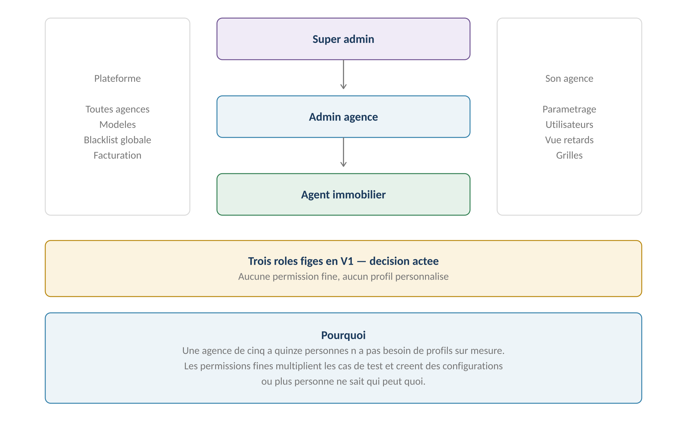
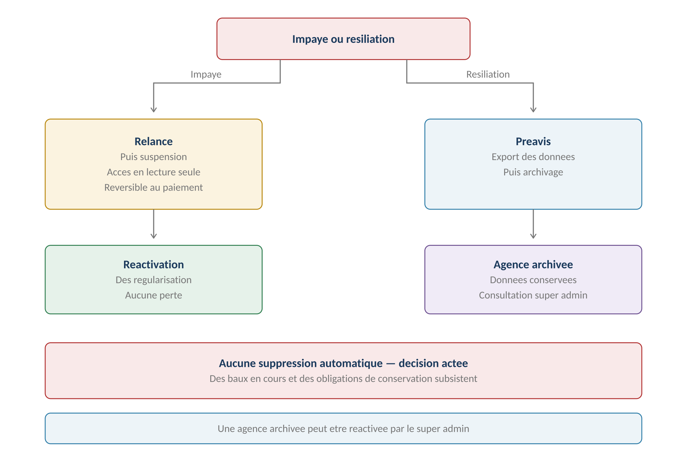
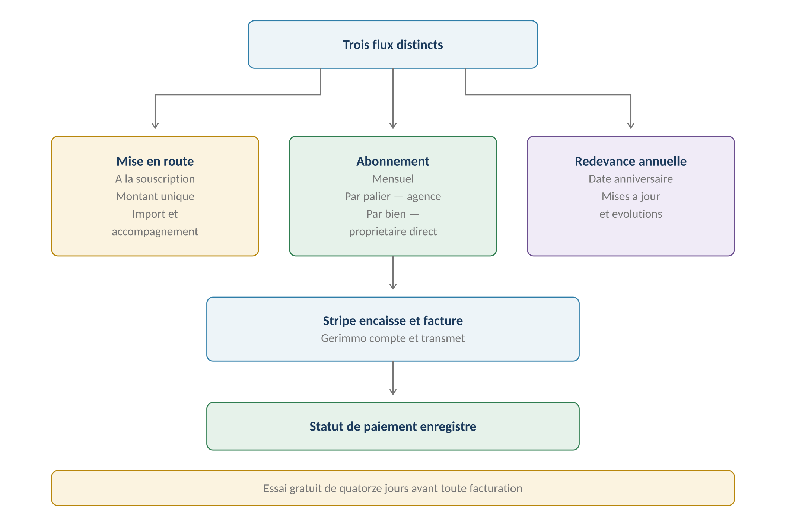

**GERIMMO V3**

Référentiel des parcours clients

**MODULE 18**

**Administration**

|               |                                                     |
|:--------------|:----------------------------------------------------|
| **Périmètre** | 6 parcours · 3 objets métier                        |
| **Dépend de** | **Onze modules y délèguent leur paramétrage**       |
| **Nature**    | Module de convergence — il ne produit rien lui-même |
| **Nouveauté** | **La facturation entre dans le périmètre**          |
| **Statut**    | **Module clos — aucune question ouverte**           |

> **Vue d'ensemble du module**
>
> **Le point de convergence du référentiel**
>
> Chaque module a défini ses règles, ses grilles et ses seuils.
>
> Tous ont délégué leur paramétrage ici.
>
> Ce module n'invente aucune règle métier : il donne un lieu unique
>
> à ce qui est décidé ailleurs.

**Ce qui converge ici**

------------------------------------------------------------------------

*Schéma 1 — Onze modules délèguent leur paramétrage*

**Le détail des paramétrages**

------------------------------------------------------------------------

| **Paramètre**                     | **Origine** | **Qui le règle** |
|:----------------------------------|:------------|:-----------------|
| **Liste d'équipements**           | RM-0.5.5    | Admin agence     |
| **Grille de récupérables**        | RM-0c.4.2   | Admin agence     |
| **Grille de vétusté**             | RM-2.4.9    | Admin agence     |
| **Indices IRL**                   | RM-3.8.3    | Admin agence     |
| **Seuils de relance d'impayé**    | RM-3.6.1    | Admin agence     |
| **Plan de catégories comptables** | RM-4.7.2    | Admin agence     |
| **Seuil de délégation**           | RM-5.3.3    | Admin agence     |
| **Seuils d'alerte de confort**    | RM-14.2.2   | Admin agence     |
| **Charte de marque blanche**      | RM-17.2.1   | Admin agence     |
| **Modèles de documents**          | RM-12.1.4   | **Super admin**  |
| **Modèles WhatsApp**              | RM-16.5.6   | **Super admin**  |
| **Blacklist globale d'artisans**  | RM-8.5.3    | **Super admin**  |
| **Seuils d'alerte légaux**        | RM-14.2.5   | **Super admin**  |

**Objets créés dans ce module**

------------------------------------------------------------------------

| **Objet** | **Description** | **Rattaché à** |
|:---|:---|:---|
| **Utilisateur** | Compte avec son rôle et son périmètre | Personne + Agence |
| **Abonnement** | Contrat commercial et son statut de paiement | Agence |
| **Entrée d'audit** | Trace d'une action sensible | Utilisateur + Objet |

**Cartographie des 6 parcours**

------------------------------------------------------------------------

| **\#** | **Parcours** | **Persona** | **V1 / V2** | **Criticité** |
|:---|:---|:---|:---|:---|
| 18.1 | Gestion des utilisateurs et rôles | AA | **V1** | Haute |
| 18.2 | **Paramétrage de l'agence** | AA | **V1** | Haute |
| 18.3 | Supervision de la plateforme | SA | **V1** | Moyenne |
| 18.4 | Suspension et archivage | SA | **V1** | Haute |
| 18.5 | Journal d'audit | AA / SA | **V1** | Moyenne |
| 18.6 | **Facturation et abonnement** | SA | **V1** | **MAXIMALE** |

> **18.1 — Gestion des utilisateurs et rôles**

|                    |                                               |
|:-------------------|:----------------------------------------------|
| **Persona**        | AA — Admin agence                             |
| **Déclencheur**    | Arrivée ou départ d'un collaborateur          |
| **Fréquence**      | Occasionnelle                                 |
| **Criticité**      | Haute                                         |
| **Décision actée** | **Trois rôles figés, aucune permission fine** |

**Les trois rôles**

------------------------------------------------------------------------

*Schéma 2 — Une hiérarchie simple, sans profils personnalisés*

> **Pourquoi ne pas offrir des rôles personnalisables — décision actée**
>
> Une agence de cinq à quinze personnes n'a pas besoin de profils sur mesure.
>
> Les permissions fines multiplient les cas de test et créent des configurations
>
> où plus personne ne sait qui peut quoi.
>
> Si le besoin remonte du terrain, il sera traité avec des cas d'usage réels
>
> plutôt qu'imaginés à l'avance.

**Ce que chaque rôle peut faire**

------------------------------------------------------------------------

| **Action**                            | **AG** | **AA**  | **SA**  |
|:--------------------------------------|:-------|:--------|:--------|
| **Créer un bien, un lot, un bail**    | Oui    | Oui     | Non     |
| **Saisir une écriture comptable**     | Oui    | Oui     | Non     |
| **Clôturer une période**              | Oui    | Oui     | Non     |
| **Rouvrir une période close**         | Non    | **Oui** | Non     |
| **Envoyer un rapport**                | Oui    | Oui     | Non     |
| **Voir la vue retards**               | Non    | **Oui** | Non     |
| **Paramétrer les grilles**            | Non    | **Oui** | Non     |
| **Inviter un utilisateur**            | Non    | **Oui** | Non     |
| **Blacklister localement**            | Non    | **Oui** | Non     |
| **Blacklister globalement**           | Non    | Non     | **Oui** |
| **Créer une agence**                  | Non    | Non     | **Oui** |
| **Générer un modèle**                 | Non    | Non     | **Oui** |
| **Arbitrer une contestation de note** | Non    | Non     | **Oui** |

**Le périmètre d'un agent**

------------------------------------------------------------------------

| **Aspect**        | **Portée**                                |
|:------------------|:------------------------------------------|
| **Mandats**       | Ceux dont il est l'agent en charge        |
| **Lots et baux**  | Ceux de ses mandats                       |
| **Alertes**       | Celles qui lui sont assignées — RM-14.3.1 |
| **Agenda**        | Ses rendez-vous — RM-10.7.3               |
| **Comptabilité**  | Les écritures de ses mandats              |
| **Autres agents** | Aucune visibilité sur leurs dossiers      |

> **Le départ d'un agent**
>
> Ses mandats doivent être réaffectés avant désactivation de son compte,
>
> sinon les alertes qui lui étaient assignées n'auraient plus de destinataire.
>
> Le système bloque la désactivation tant qu'un mandat lui reste rattaché.

**L'absence temporaire d'un agent**

------------------------------------------------------------------------

> **Un besoin que le référentiel ignorait**
>
> Un agent en arrêt maladie ou en congé bloque ses mandats :
>
> ses alertes s'accumulent, ses dossiers n'avancent pas.
>
> La désactivation ne convient pas — il revient. La réaffectation définitive
>
> non plus — il faudrait tout rendre à son retour.

| **\#** | **Acteur** | **Action** | **Écran / état** |
|:---|:---|:---|:---|
| 1 | AA | Ouvre la fiche de l'agent absent | Utilisateurs |
| 2 | AA | **Clique « Transfert temporaire »** | — |
| 3 | AA | Choisit l'agent remplaçant | Liste |
| 4 | AA | Saisit la date de retour prévue | Optionnelle |
| 5 | **Système** | Réassigne les mandats et les alertes en cours | — |
| 6 | **Système** | **Conserve le titulaire d'origine** | — |
| 7 | AA | Au retour, clique « Restituer » | — |
| 8 | **Système** | Rend les mandats au titulaire | — |

| **Aspect** | **Transfert temporaire** | **Réaffectation définitive** |
|:---|:---|:---|
| **Titulaire d'origine** | **Conservé** | Remplacé |
| **Retour** | **En un clic** | Nouvelle réaffectation |
| **Alertes en cours** | Transférées | Transférées |
| **Alertes futures** | Vont au remplaçant | Vont au nouveau titulaire |
| **Usage** | Absence, congé | Départ, réorganisation |

> **La même mécanique, avec une date de fin**
>
> Le transfert temporaire n'est pas un système de délégation nouveau :
>
> c'est la réaffectation déjà prévue, avec le titulaire conservé
>
> et un retour en un clic.
>
> C'est ce qui la rend simple à construire et à comprendre.
>
> **Pourquoi pas d'équipes — décision actée**
>
> L'audit proposait aussi des équipes d'agents partageant un portefeuille.
>
> Dans une agence de cinq à quinze personnes, chaque mandat a un référent
>
> identifié, et le transfert temporaire couvre les absences.
>
> Ajouter des équipes multiplierait les règles de visibilité
>
> pour un besoin qui ne se manifeste pas à cette échelle.

**Règles métier**

------------------------------------------------------------------------

> **RM-18.1.1** — Trois rôles existent : agent, admin agence, super admin.
>
> **RM-18.1.2** — Aucun rôle personnalisé ni permission fine en V1.
>
> **RM-18.1.3** — Un agent ne voit que les dossiers de ses mandats.
>
> **RM-18.1.4** — La désactivation d'un agent exige la réaffectation de ses mandats.
>
> **RM-18.1.5** — Un compte désactivé n'est jamais supprimé : ses actions restent tracées.
>
> **RM-18.1.6** — Un transfert temporaire réassigne les mandats sans changer le titulaire.
>
> **RM-18.1.7** — La restitution des mandats se fait en une action.

**User story**

------------------------------------------------------------------------

> **US-18.1.1**
>
> *En tant qu'admin agence, je veux être bloqué si je désactive un agent avec des mandats, afin qu'aucune alerte ne se retrouve sans destinataire.*

- **Étant donné** un agent en charge de douze mandats, **quand** je tente de désactiver son compte, **alors** l'action est refusée et la liste des mandats m'est présentée

> **18.2 & 18.3 — Paramétrage et supervision**

**18.2 — Paramétrage de l'agence**

------------------------------------------------------------------------

|                 |                                |
|:----------------|:-------------------------------|
| **Persona**     | AA — Admin agence              |
| **Déclencheur** | Installation, puis ajustements |
| **Fréquence**   | Rare après la mise en route    |
| **Criticité**   | Haute                          |
| **Contenu**     | Neuf familles de paramètres    |

| **Famille**        | **Ce qui s'y règle**               | **Défaut fourni** |
|:-------------------|:-----------------------------------|:------------------|
| **Identité**       | Coordonnées, mentions légales      | Non               |
| **Marque blanche** | Logo, couleurs                     | Charte Gerimmo    |
| **Grilles métier** | Récupérables, vétusté, équipements | Oui               |
| **Comptabilité**   | Plan de catégories                 | Oui               |
| **Indices**        | IRL trimestriels                   | Non               |
| **Seuils métier**  | Délégation, honoraires             | Oui               |
| **Alertes**        | Seuils de confort                  | Oui               |
| **Canaux**         | Activation WhatsApp                | Désactivé         |
| **Utilisateurs**   | Agents et leurs mandats            | Non               |

> **Deux paramètres bloquent l'usage s'ils manquent**
>
> L'indice IRL : sans lui, aucune révision de loyer n'est possible — RM-16.2.1.
>
> Le seuil de délégation : sans lui, aucun devis ne peut être traité — RM-16.2.2.
>
> Tous les autres ont une valeur par défaut utilisable telle quelle.

**18.3 — Supervision de la plateforme**

------------------------------------------------------------------------

|                 |                    |
|:----------------|:-------------------|
| **Persona**     | SA — Super admin   |
| **Déclencheur** | Suivi quotidien    |
| **Fréquence**   | Continue           |
| **Criticité**   | Moyenne            |
| **Portée**      | Toutes les agences |

| **Indicateur** | **Usage** |
|:---|:---|
| **Agences actives** | Suivi commercial |
| **Lots gérés par agence** | Base de la facturation — parcours 18.6 |
| **Agences en essai** | Relance avant expiration des quatorze jours |
| **Agences suspendues** | Suivi des impayés |
| **Demandes de modèles** | File d'attente — RM-12.1.3 |
| **Contestations de notes** | File d'attente — RM-11.4.4 |
| **Modèles WhatsApp à soumettre** | File d'attente — RM-16.5.6 |
| **Bugs à trier** | File d'attente — RM-20.2.1 |
| **Correctifs à valider** | File d'attente — RM-20.3.1 |
| **Idées à examiner** | Revue mensuelle — RM-20.5.1 |
| **Volume d'usage** | Baux créés, incidents, documents générés |

> **Six files d'attente convergent vers le super admin**
>
> Les demandes de modèles de documents, les contestations de notes d'artisans,
>
> les soumissions de modèles WhatsApp, les bugs à trier, les correctifs à valider
>
> et les idées à examiner.
>
> Chacune a été décidée dans son module ; toutes atterrissent sur le même écran.

**Règles métier**

------------------------------------------------------------------------

> **RM-18.2.1** — Neuf familles de paramètres sont regroupées sur un écran unique.
>
> **RM-18.2.2** — Tous les paramètres ont une valeur par défaut, sauf identité, IRL et utilisateurs.
>
> **RM-18.2.3** — L'indice IRL et le seuil de délégation conditionnent des parcours métier.
>
> **RM-18.3.1** — Le super admin supervise toutes les agences depuis une console unique.
>
> **RM-18.3.2** — Six files d'attente y convergent : modèles, contestations, WhatsApp, bugs, correctifs, idées.
>
> **18.4 & 18.5 — Archivage et audit**

**18.4 — Suspension et archivage**

------------------------------------------------------------------------

|  |  |
|:---|:---|
| **Persona** | SA — Super admin |
| **Déclencheur** | Impayé ou résiliation |
| **Fréquence** | Rare |
| **Criticité** | Haute |
| **Décision actée** | **Une agence qui résilie est archivée, jamais supprimée** |

**Les deux chemins**

------------------------------------------------------------------------

*Schéma 3 — Suspension réversible, archivage définitif mais conservateur*

| **Situation**                 | **Effet**     | **Réversible**     |
|:------------------------------|:--------------|:-------------------|
| **Impayé — première relance** | Aucun         | Sans objet         |
| **Impayé — suspension**       | Lecture seule | Oui, au paiement   |
| **Résiliation — préavis**     | Aucun         | Oui                |
| **Résiliation — archivage**   | Accès fermé   | Par le super admin |

**Ce que permet une agence suspendue**

------------------------------------------------------------------------

| **Action**                          | **Suspendue** |
|:------------------------------------|:--------------|
| **Consulter les baux et documents** | Oui           |
| **Créer un bail**                   | Non           |
| **Générer un document**             | Non           |
| **Encaisser un loyer**              | Non           |
| **Envoyer un rapport**              | Non           |
| **Exporter ses données**            | **Oui**       |

> **L'export reste toujours possible**
>
> Une agence suspendue ou en préavis de résiliation doit pouvoir récupérer
>
> ses données — c'est une obligation de portabilité.
>
> Bloquer l'export d'une agence en litige commercial serait à la fois illégal
>
> et commercialement désastreux.
>
> **Pourquoi jamais de suppression — décision actée**
>
> Une agence qui résilie laisse derrière elle des baux en cours,
>
> une comptabilité soumise à conservation légale de dix ans,
>
> et des locataires qui continuent d'occuper les logements.
>
> L'archivage conserve tout, ferme l'accès, et reste réversible.

**18.5 — Journal d'audit**

------------------------------------------------------------------------

|                  |                                      |
|:-----------------|:-------------------------------------|
| **Persona**      | AA — Admin agence · SA — Super admin |
| **Déclencheur**  | Contrôle, litige, vérification       |
| **Fréquence**    | Occasionnelle                        |
| **Criticité**    | Moyenne                              |
| **Conservation** | Indéfinie                            |

**Ce qui est tracé**

------------------------------------------------------------------------

| **Action**                                   | **Origine** |
|:---------------------------------------------|:------------|
| **Réouverture d'une période close**          | RM-4.4.5    |
| **Purge RGPD**                               | RM-0b.8.8   |
| **Consultation d'une pièce de dossier**      | RM-0b.7.5   |
| **Blacklist d'un artisan**                   | RM-8.5.6    |
| **Accès du super admin au détail des notes** | RM-11.4.6   |
| **Consultation d'un document**               | RM-12.5.8   |
| **Modification d'un paramètre**              | Ce module   |
| **Changement de rôle**                       | Ce module   |
| **Suspension ou archivage**                  | Ce module   |
| **Validation d'un correctif**                | RM-20.3.6   |

> **Neuf actions sensibles sont tracées**
>
> Chacune a été identifiée dans son module comme méritant une trace.
>
> Le journal les rassemble avec leur auteur, leur date et leur objet.
>
> Il ne se purge jamais.

**Règles métier**

------------------------------------------------------------------------

> **RM-18.4.1** — Une agence en impayé est suspendue, non supprimée.
>
> **RM-18.4.2** — Une agence suspendue conserve l'accès en lecture et l'export.
>
> **RM-18.4.3** — La suspension est levée dès régularisation.
>
> **RM-18.4.4** — Une agence qui résilie est archivée, jamais supprimée.
>
> **RM-18.4.5** — Les données d'une agence archivée restent conservées.
>
> **RM-18.4.6** — Le super admin peut réactiver une agence archivée.
>
> **RM-18.5.1** — Dix types d'actions sensibles sont tracées au journal d'audit.
>
> **RM-18.5.2** — Le journal d'audit ne se purge jamais.

**User stories**

------------------------------------------------------------------------

> **US-18.4.1**
>
> *En tant que super admin, je veux qu'une agence suspendue puisse exporter ses données, afin de respecter son droit à la portabilité.*

- **Étant donné** une agence suspendue pour impayé, **quand** elle demande un export, **alors** il lui est fourni malgré la suspension

> **US-18.5.1**
>
> *En tant qu'admin agence, je veux retrouver qui a rouvert une période close, afin de comprendre une anomalie comptable.*

- **Étant donné** une période rouverte le mois dernier, **quand** je consulte le journal d'audit, **alors** je vois qui l'a fait, quand et avec quel motif

> **18.6 — Facturation et abonnement**
>
> **La facturation entre dans le périmètre — décision actée**
>
> Elle en était initialement exclue. La décision a été revue :
>
> Gerimmo compte les biens gérés, transmet à Stripe, et suit les paiements.
>
> Stripe encaisse et émet les factures.

|                 |                              |
|:----------------|:-----------------------------|
| **Persona**     | SA — Super admin             |
| **Déclencheur** | Souscription, puis échéances |
| **Fréquence**   | Mensuelle et annuelle        |
| **Criticité**   | MAXIMALE — c'est le revenu   |
| **Prestataire** | Stripe                       |

**Les trois flux**

------------------------------------------------------------------------

*Schéma 4 — Mise en route, abonnement mensuel, redevance annuelle*

| **Flux** | **Périodicité** | **Ce qu'il couvre** |
|:---|:---|:---|
| **Mise en route** | **Une fois** | Création, import du parc, accompagnement |
| **Abonnement** | **Mensuelle** | Usage de la plateforme |
| **Redevance** | **Annuelle, date anniversaire** | Mises à jour et évolutions |

**Les deux modèles de tarification**

------------------------------------------------------------------------

| **Client** | **Modèle** | **Logique** |
|:---|:---|:---|
| **Agence immobilière** | **Par palier** | Le prix suit la croissance sans être linéaire |
| **Propriétaire en gestion directe** | **Par bien** | Un particulier avec trois biens paie pour trois |

> **Pourquoi deux modèles distincts**
>
> Une agence de deux cents lots et un particulier avec trois appartements
>
> n'ont ni le même usage ni la même capacité à payer.
>
> Le palier récompense la croissance de l'agence ; le prix par bien
>
> reste accessible au propriétaire qui gère seul.

**Le comptage**

------------------------------------------------------------------------

| **Règle**                       | **Précision**                      |
|:--------------------------------|:-----------------------------------|
| **Unité comptée**               | **Le lot sous mandat actif**       |
| **Date de comptage**            | Dernier jour du mois               |
| **Lot vacant**                  | Compté — il mobilise l'application |
| **Lot sans mandat**             | Non compté — RM-5.5.3              |
| **Lot archivé**                 | Non compté                         |
| **Changement en cours de mois** | Pris en compte le mois suivant     |

**L'essai gratuit**

------------------------------------------------------------------------

| **Aspect**            | **Règle**                                    |
|:----------------------|:---------------------------------------------|
| **Durée**             | **Quatorze jours**                           |
| **Bénéficiaires**     | Agences et propriétaires directs             |
| **Périmètre**         | Toutes les fonctionnalités                   |
| **Limite**            | Aucune restriction fonctionnelle             |
| **Fin d'essai**       | Alerte à J-3, puis souscription requise      |
| **Sans souscription** | Passage en lecture seule, données conservées |

**Le circuit de paiement**

------------------------------------------------------------------------

| **\#** | **Acteur** | **Action** | **Écran / état** |
|:---|:---|:---|:---|
| 1 | **Système** | Compte les lots sous mandat au dernier jour du mois | — |
| 2 | **Système** | Détermine le palier ou le nombre de biens | — |
| 3 | **Système** | Transmet à Stripe | API |
| 4 | **Stripe** | Prélève et émet la facture | Hors application |
| 5 | **Système** | Enregistre le statut de paiement | — |
| 6 | **Système** | **Si échec : relance puis suspension** | Parcours 18.4 |

**Variantes**

------------------------------------------------------------------------

| **Code** | **Situation** | **Comportement** |
|:---|:---|:---|
| **V1** | Paiement réussi | Cas nominal, rien à signaler. |
| **V2** | **Échec de prélèvement** | Relance automatique, puis suspension après délai. |
| **V3** | Changement de palier | Applicable au mois suivant. |
| **V4** | Fin d'essai sans souscription | Lecture seule, données conservées. |
| **V5** | Résiliation en cours de mois | Le mois entamé reste dû. |
| **V6** | **Redevance annuelle impayée** | Même circuit que l'abonnement mensuel. |

**Cas d'erreur**

------------------------------------------------------------------------

| **Cas** | **Comportement attendu** |
|:---|:---|
| Moyen de paiement expiré | Alerte avant échéance, relance à l'échec |
| Palier franchi en cours de mois | Appliqué au mois suivant |
| Agence sans aucun lot | Palier minimum facturé |
| Indisponibilité de Stripe | Nouvelle tentative automatique, alerte au super admin |

**Règles métier**

------------------------------------------------------------------------

> **RM-18.6.1** — L'essai gratuit dure quatorze jours, sans restriction fonctionnelle.
>
> **RM-18.6.2** — Les agences sont facturées par palier de lots gérés.
>
> **RM-18.6.3** — Les propriétaires en gestion directe sont facturés par bien.
>
> **RM-18.6.4** — Le comptage se fait au dernier jour du mois, sur les lots sous mandat actif.
>
> **RM-18.6.5** — Un lot vacant sous mandat est compté ; un lot sans mandat ne l'est pas.
>
> **RM-18.6.6** — Une facturation de mise en route est due à la souscription.
>
> **RM-18.6.7** — Les abonnements sont exclusivement mensuels.
>
> **RM-18.6.8** — Une redevance annuelle est due à la date anniversaire.
>
> **RM-18.6.9** — Stripe encaisse et émet les factures ; Gerimmo compte et suit.
>
> **RM-18.6.10** — Un échec de paiement déclenche relance puis suspension, jamais suppression.

**User stories**

------------------------------------------------------------------------

> **US-18.6.1**
>
> *En tant que super admin, je veux que le comptage se fasse automatiquement, afin de ne pas facturer à la main chaque mois.*

- **Étant donné** une agence gérant cent quarante lots au 31 du mois, **quand** le comptage s'exécute, **alors** le palier correspondant est transmis à Stripe

- **Étant donné** douze lots sortis de gestion en cours de mois, **quand** le comptage s'exécute, **alors** ils ne sont pas comptés

> **US-18.6.2**
>
> *En tant qu'agence en essai, je veux être prévenue avant la fin des quatorze jours, afin de ne pas perdre l'accès sans préavis.*

- **Étant donné** un essai commencé il y a onze jours, **quand** l'alerte se déclenche, **alors** je suis invitée à souscrire avant l'échéance

- **Étant donné** l'essai expiré sans souscription, **quand** je me connecte, **alors** mes données sont là, en lecture seule

> **Synthèse du module**

**Les règles métier les plus structurantes**

------------------------------------------------------------------------

| **Code** | **Règle** | **Bloquant** |
|:---|:---|:---|
| **RM-18.1.2** | **Aucun rôle personnalisé en V1** | Structurel |
| **RM-18.1.3** | Un agent ne voit que ses mandats | **Oui** |
| **RM-18.1.4** | Désactivation bloquée si des mandats subsistent | **Oui** |
| **RM-18.1.6** | **Transfert temporaire sans changer le titulaire** | Structurel |
| **RM-18.2.3** | IRL et seuil de délégation conditionnent des parcours | **Oui** |
| **RM-18.4.2** | **Une agence suspendue conserve l'export** | Structurel |
| **RM-18.4.4** | **Une agence est archivée, jamais supprimée** | **Oui** |
| **RM-18.5.2** | Le journal d'audit ne se purge jamais | Structurel |
| **RM-18.6.1** | Essai gratuit de quatorze jours | Structurel |
| **RM-18.6.2** | **Agences facturées par palier** | Structurel |
| **RM-18.6.3** | **Propriétaires directs facturés par bien** | Structurel |
| **RM-18.6.7** | Abonnements exclusivement mensuels | Structurel |
| **RM-18.6.10** | Échec de paiement : suspension, jamais suppression | **Oui** |

**Décompte des user stories**

------------------------------------------------------------------------

| **Parcours** | **User stories** | **Critères d'acceptation** |
|:---|:---|:---|
| 18.1 — Utilisateurs et rôles | 1 | 1 |
| 18.4 & 18.5 — Archivage et audit | 2 | 2 |
| **18.6 — Facturation** | **2** | **4** |
| **TOTAL** | **5** | **7** |

**Décisions actées sur ce module**

------------------------------------------------------------------------

| **Décision** | **Statut** |
|:---|:---|
| Trois rôles figés, sans permission fine | **Acté** |
| Agence archivée, jamais supprimée | **Acté** |
| **La facturation entre dans le périmètre** | **Décision révisée** |
| Essai gratuit de quatorze jours | **Acté** |
| Agences par palier, propriétaires par bien | **Acté** |
| Facturation de mise en route | **Acté** |
| Abonnements mensuels uniquement | **Acté** |
| Redevance annuelle à la date anniversaire | **Acté** |
| **Transfert temporaire de mandats** | **Ajouté — audit P1.1** |
| **Équipes d'agents partageant un portefeuille** | **Hors périmètre — superflu à cette échelle** |
| Rôles et permissions personnalisables | **V2** |
| Émission des factures par Gerimmo | **Hors périmètre** |

**Ce que ce module rassemble**

------------------------------------------------------------------------

| **Origine**          | **Ce qui y converge**                               |
|:---------------------|:----------------------------------------------------|
| **Modules 0, 0c, 2** | Grilles métier — équipements, récupérables, vétusté |
| **Modules 3, 4, 5**  | Indices, catégories, seuils                         |
| **Modules 8, 11**    | Blacklist globale, contestations                    |
| **Modules 12, 16**   | Modèles de documents et de messages                 |
| **Module 20**        | **Bugs, correctifs et idées**                       |
| **Modules 14, 17**   | Seuils d'alerte, charte graphique                   |

**Prochaine étape**

------------------------------------------------------------------------

> **Module 19 — Mobile**
>
> Le dernier du référentiel. Deux déclinaisons : locataire et artisan.
>
> Aucun parcours nouveau — ce sont les parcours existants adaptés au mobile,
>
> notamment l'état des lieux, la déclaration d'incident et le compte rendu d'intervention.
