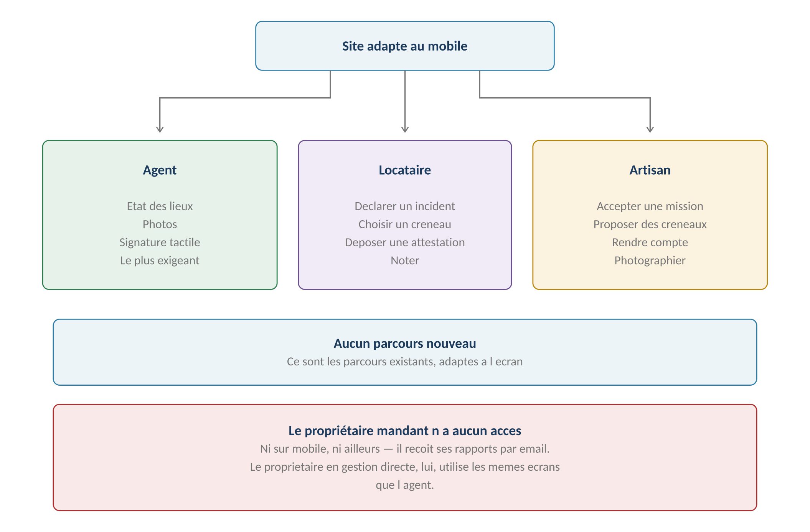
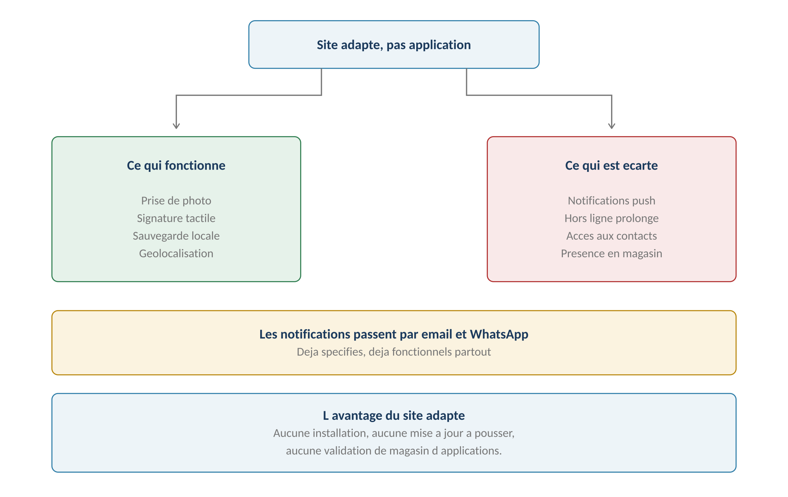
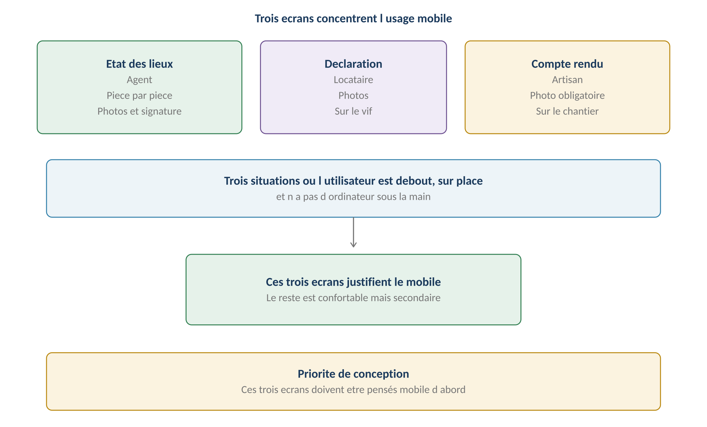
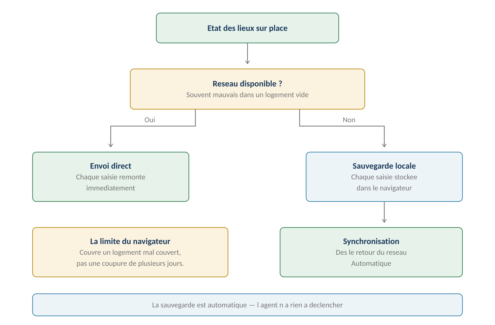

**GERIMMO V3**

Référentiel des parcours clients

**MODULE 19**

**Mobile**

|                    |                                                    |
|:-------------------|:---------------------------------------------------|
| **Périmètre**      | 3 déclinaisons · Aucun parcours nouveau            |
| **Dépend de**      | Modules 1, 7, 8, 10 et 11                          |
| **Décision actée** | **Site adapté, pas d'application native**          |
| **Nature**         | Adaptation d'écrans, non spécification de parcours |
| **Statut**         | **Module clos — aucune question ouverte**          |

> **Vue d'ensemble du module**
>
> **Un module d'adaptation, pas de spécification**
>
> Aucun parcours nouveau n'est décrit ici. Les parcours métier ont tous été
>
> spécifiés dans leurs modules respectifs.
>
> Ce module identifie ceux qui s'utilisent debout, sur place, sans ordinateur,
>
> et précise ce que l'écran mobile impose.

**Les trois personas mobiles**

------------------------------------------------------------------------

*Schéma 1 — Trois usages mobiles, aucun parcours nouveau*

> **Site adapté, pas d'application — décision actée**
>
> Aucune installation, aucune mise à jour à pousser, aucune validation
>
> de magasin d'applications.
>
> En contrepartie, on renonce aux notifications push et au hors ligne prolongé.
>
> L'email et WhatsApp couvrent déjà les notifications — modules 14 et 16.

**Ce que le navigateur permet**

------------------------------------------------------------------------

*Schéma 2 — Le nécessaire fonctionne, l'accessoire est écarté*

| **Fonction** | **Disponible** | **Usage** |
|:---|:---|:---|
| **Prise de photo** | **Oui** | États des lieux, incidents, comptes rendus |
| **Signature tactile** | **Oui** | États des lieux — RM-13.1.6 |
| **Sauvegarde locale** | **Oui** | États des lieux hors ligne |
| **Géolocalisation** | **Oui** | Optionnelle, confort |
| **Notifications push** | **Écarté** | Email et WhatsApp les remplacent |
| **Hors ligne prolongé** | **Écarté** | Sauvegarde locale suffit |
| **Accès aux contacts** | **Écarté** | Sans usage identifié |

**Les trois écrans prioritaires**

------------------------------------------------------------------------

*Schéma 3 — Trois situations où l'utilisateur est debout, sur place*

> **Déclinaison agent — l'état des lieux**

|               |                                             |
|:--------------|:--------------------------------------------|
| **Persona**   | AG — Agent immobilier                       |
| **Parcours**  | Modules 1.12 et 1.13                        |
| **Fréquence** | Deux fois par bail                          |
| **Criticité** | MAXIMALE — le plus exigeant du produit      |
| **Contexte**  | Debout dans un logement souvent mal couvert |

**Le mode hors ligne**

------------------------------------------------------------------------

*Schéma 4 — Sauvegarde locale automatique, synchronisation au retour du réseau*

> **Sauvegarde automatique, sans action de l'agent**
>
> Chaque saisie est stockée localement dès qu'elle est faite.
>
> L'agent n'a rien à déclencher, rien à penser.
>
> Au retour du réseau, la synchronisation se fait seule.
>
> Cela couvre le cas courant — un logement vide mal couvert —
>
> pas une coupure de plusieurs jours.

**Les limites du hors ligne**

------------------------------------------------------------------------

| **Situation** | **Comportement** | **Risque** |
|:---|:---|:---|
| **Réseau intermittent** | Synchronisation dès que possible | Aucun |
| **Absence complète de réseau** | Tout reste local jusqu'au retour | Aucun |
| **Navigateur fermé** | Les données subsistent | Faible |
| **Cache vidé** | **Perte des données non synchronisées** | Réel |
| **Changement d'appareil** | **Les données ne suivent pas** | Réel |
| **Deux agents sur le même EDL** | La dernière synchronisation prime | Réel |

> **Ce que l'agent doit savoir**
>
> Un indicateur visible signale que des données ne sont pas encore synchronisées,
>
> avec le nombre d'éléments en attente.
>
> Une alerte prévient si l'agent tente de fermer l'onglet avec des données
>
> non remontées.
>
> Ces deux garde-fous sont ce qui distingue un hors ligne utilisable
>
> d'un hors ligne dangereux.

**Le cas de la concurrence**

------------------------------------------------------------------------

> **Un état des lieux ne se saisit pas à deux**
>
> Le cas est théorique mais doit être tranché : si deux agents ouvrent
>
> le même état des lieux, la dernière synchronisation écrase la précédente.
>
> Pour l'éviter, un état des lieux ouvert sur un appareil est signalé
>
> comme tel aux autres. Ce n'est pas un verrou — le hors ligne l'interdit —
>
> mais un avertissement.

**Les contraintes de l'écran**

------------------------------------------------------------------------

| **Contrainte** | **Réponse** |
|:---|:---|
| **Une main occupée** | Boutons larges, peu de saisie clavier |
| **Grille longue** | Progression pièce par pièce, sauvegarde continue |
| **Photos nombreuses** | Compression à la prise, envoi différé |
| **Signature du locataire** | Zone tactile pleine largeur |
| **Relevé de compteurs** | Champs numériques dédiés |
| **Comparatif à la sortie** | État d'entrée affiché en regard — RM-1.13.1 |

> **Pourquoi c'est le parcours le plus exigeant**
>
> Une grille d'état des lieux compte facilement soixante lignes,
>
> chacune avec un état, parfois une observation et une ou plusieurs photos.
>
> L'agent la remplit debout, parfois sans réseau, avec un locataire qui attend.
>
> Si l'écran est mal conçu, il retournera au papier.

**Ce qui reste identique**

------------------------------------------------------------------------

| **Règle**                                | **Origine** |
|:-----------------------------------------|:------------|
| **La grille est générée depuis le lot**  | RM-1.12.1   |
| **Chaque élément doit porter un état**   | RM-1.12.2   |
| **L'EDL est figé dès signature**         | RM-1.12.3   |
| **La sortie reprend la grille d'entrée** | RM-1.13.1   |
| **Les écarts sont mis en évidence**      | RM-1.13.2   |

**Règles métier**

------------------------------------------------------------------------

> **RM-19.1.1** — L'état des lieux fonctionne sur mobile, avec sauvegarde locale automatique.
>
> **RM-19.1.2** — La synchronisation s'effectue seule au retour du réseau.
>
> **RM-19.1.3** — Les photos sont compressées à la prise pour limiter le volume.
>
> **RM-19.1.4** — La signature tactile occupe la pleine largeur de l'écran.
>
> **RM-19.1.5** — Aucune règle métier de l'état des lieux n'est modifiée par le mobile.
>
> **RM-19.1.6** — Un indicateur signale en permanence les données non synchronisées.
>
> **RM-19.1.7** — Une alerte prévient avant fermeture avec des données en attente.
>
> **RM-19.1.8** — Les données locales ne survivent ni au vidage du cache ni au changement d'appareil.
>
> **RM-19.1.9** — Un état des lieux ouvert sur un appareil est signalé aux autres.

**User story**

------------------------------------------------------------------------

> **US-19.1.1**
>
> *En tant qu'agent immobilier, je veux réaliser un état des lieux sans réseau, afin de ne pas être bloqué dans un logement mal couvert.*

- **Étant donné** aucune connexion dans le logement, **quand** je saisis les états et prends les photos, **alors** tout est conservé localement sans que j'aie à intervenir

- **Étant donné** la connexion retrouvée en sortant, **quand** le navigateur détecte le réseau, **alors** l'état des lieux et ses photos remontent intégralement

> **Déclinaison locataire**

|               |                                         |
|:--------------|:----------------------------------------|
| **Persona**   | LO — Locataire                          |
| **Parcours**  | Modules 0b, 3, 7, 10 et 11              |
| **Fréquence** | Ponctuelle                              |
| **Criticité** | Haute sur la déclaration d'incident     |
| **Contexte**  | Chez lui, souvent au moment du problème |

**Les parcours concernés**

------------------------------------------------------------------------

| **Parcours**                 | **Module** | **Pourquoi le mobile**         |
|:-----------------------------|:-----------|:-------------------------------|
| **Déclarer un incident**     | 7.1        | **Il photographie sur le vif** |
| **Choisir un créneau**       | 10.2       | Réponse rapide attendue        |
| **Proposer des créneaux**    | 10.2       | Suite du refus                 |
| **Déposer son attestation**  | 0b.5       | Photo du document              |
| **Consulter ses quittances** | 3.12       | Consultation simple            |
| **Noter une intervention**   | 11.1       | Juste après le passage         |
| **Échanger par messagerie**  | 15.1       | Conversation courante          |
| **Signer son bail**          | 13.2       | Circuit Yousign externe        |

> **La déclaration d'incident est le parcours qui compte**
>
> Le locataire constate une fuite. S'il doit ouvrir un ordinateur, il appellera
>
> ou attendra — et l'agence perdra la photo prise au bon moment.
>
> Sur mobile, il photographie, décrit en deux phrases, et envoie.
>
> C'est ce qui alimente la qualification du module 7.

**Les contraintes de l'écran**

------------------------------------------------------------------------

| **Contrainte** | **Réponse** |
|:---|:---|
| **Il ne connaît pas l'application** | Parcours en trois écrans maximum |
| **Il est peut-être stressé** | Champs minimaux, photos suffisent |
| **Il écrit peu** | Catégorie en liste, description courte |
| **Il veut savoir où ça en est** | Statut visible sur la fiche incident |

**Règles métier**

------------------------------------------------------------------------

> **RM-19.2.1** — La déclaration d'incident tient en trois écrans au maximum.
>
> **RM-19.2.2** — La photo est le premier champ proposé, avant la description.
>
> **RM-19.2.3** — Le statut de l'incident reste visible depuis l'accueil.
>
> **RM-19.2.4** — Aucune règle métier n'est modifiée par le mobile.

**User story**

------------------------------------------------------------------------

> **US-19.2.1**
>
> *En tant que locataire, je veux déclarer un incident en photographiant, afin que l'agence comprenne sans que j'aie à décrire.*

- **Étant donné** une fuite que je constate, **quand** j'ouvre la déclaration sur mon téléphone, **alors** la prise de photo m'est proposée immédiatement

- **Étant donné** deux photos prises et la pièce sélectionnée, **quand** je valide, **alors** l'incident part sans autre saisie obligatoire

> **Déclinaison artisan**

|               |                                           |
|:--------------|:------------------------------------------|
| **Persona**   | AR — Artisan                              |
| **Parcours**  | Modules 7, 8, 9 et 10                     |
| **Fréquence** | Quotidienne                               |
| **Criticité** | Haute — c'est son outil de travail        |
| **Contexte**  | Sur le chantier, entre deux interventions |

**Les parcours concernés**

------------------------------------------------------------------------

| **Parcours**                 | **Module** | **Pourquoi le mobile**           |
|:-----------------------------|:-----------|:---------------------------------|
| **Accepter une mission**     | 7.4        | Réponse rapide attendue          |
| **Proposer des créneaux**    | 10.1       | Il connaît son planning          |
| **Consulter son agenda**     | 10.7       | Toutes agences confondues        |
| **Rendre compte**            | 7.5        | **Photo obligatoire — RM-7.5.2** |
| **Déposer un devis**         | 9.2        | Depuis le chantier               |
| **Déposer une facture**      | 9.7        | Photo du document                |
| **Déposer ses attestations** | 8.2        | Photo — RM-8.2.1                 |
| **Consulter sa note**        | 11.4       | Sa moyenne seulement             |

> **Le compte rendu conditionne la facturation**
>
> RM-7.5.2 impose une photo du travail réalisé : sans elle, l'intervention
>
> ne peut être terminée, donc pas de facture non plus.
>
> L'artisan doit pouvoir la prendre et l'envoyer depuis le chantier,
>
> en quelques secondes. C'est la condition pour qu'il joue le jeu.

**Les contraintes de l'écran**

------------------------------------------------------------------------

| **Contrainte** | **Réponse** |
|:---|:---|
| **Mains sales, gants** | Boutons larges, peu de précision requise |
| **Extérieur, plein soleil** | Contrastes élevés |
| **Il travaille pour plusieurs agences** | Logo de l'agence sur chaque ligne — RM-17.3.2 |
| **Il est pressé** | Compte rendu en deux écrans |
| **Réseau parfois faible** | Photo compressée, envoi différé possible |

**Règles métier**

------------------------------------------------------------------------

> **RM-19.3.1** — Le compte rendu d'intervention tient en deux écrans.
>
> **RM-19.3.2** — La photo du travail réalisé est le champ central de l'écran.
>
> **RM-19.3.3** — L'agenda affiche le logo de l'agence sur chaque intervention.
>
> **RM-19.3.4** — Aucune règle métier n'est modifiée par le mobile.

**User story**

------------------------------------------------------------------------

> **US-19.3.1**
>
> *En tant qu'artisan, je veux rendre compte depuis le chantier, afin de ne pas avoir à le faire le soir chez moi.*

- **Étant donné** une intervention que je viens de terminer, **quand** j'ouvre le compte rendu sur mon téléphone, **alors** la prise de photo m'est proposée en premier

- **Étant donné** la photo prise et deux lignes de description, **quand** je valide, **alors** l'intervention est marquée terminée

> **Synthèse du module**

**Les règles métier**

------------------------------------------------------------------------

| **Code** | **Règle** | **Bloquant** |
|:---|:---|:---|
| **RM-19.1.1** | **État des lieux avec sauvegarde locale automatique** | Structurel |
| **RM-19.1.2** | Synchronisation automatique au retour du réseau | Structurel |
| **RM-19.1.3** | Photos compressées à la prise | Structurel |
| **RM-19.1.6** | **Indicateur permanent de synchronisation** | **Oui** |
| **RM-19.1.8** | Les données locales ne survivent pas au vidage du cache | Structurel |
| **RM-19.2.1** | Déclaration d'incident en trois écrans maximum | Structurel |
| **RM-19.2.2** | **La photo précède la description** | Structurel |
| **RM-19.3.1** | Compte rendu en deux écrans | Structurel |
| **RM-19.3.3** | Logo de l'agence sur chaque intervention | Structurel |
| **RM-19.1.5** | **Aucune règle métier modifiée par le mobile** | Structurel |

**Décompte des user stories**

------------------------------------------------------------------------

| **Déclinaison**         | **User stories** | **Critères d'acceptation** |
|:------------------------|:-----------------|:---------------------------|
| Agent — état des lieux  | 1                | 2                          |
| Locataire — déclaration | 1                | 2                          |
| Artisan — compte rendu  | 1                | 2                          |
| **TOTAL**               | **3**            | **6**                      |

**Décisions actées sur ce module**

------------------------------------------------------------------------

| **Décision** | **Statut** |
|:---|:---|
| **Site adapté, pas d'application native** | **Acté** |
| Sauvegarde locale automatique pour l'état des lieux | **Acté** |
| Synchronisation au retour du réseau | **Acté** |
| Pas de notifications push | **Acté** |
| Email et WhatsApp comme canaux de notification | **Acté** |
| Application native iOS et Android | **Hors périmètre** |
| Hors ligne prolongé | **Hors périmètre** |
| **Indicateur de synchronisation** | **Ajouté — audit P1.5** |
| Accès aux contacts du téléphone | **Hors périmètre** |

**Ce que ce module décline**

------------------------------------------------------------------------

| **Module**    | **Parcours déclinés**                     |
|:--------------|:------------------------------------------|
| **Module 0b** | Dépôt d'attestation d'assurance           |
| **Module 1**  | **États des lieux d'entrée et de sortie** |
| **Module 3**  | Consultation des quittances               |
| **Module 7**  | **Déclaration d'incident, compte rendu**  |
| **Module 8**  | Dépôt de pièces artisan                   |
| **Module 9**  | Devis et facture                          |
| **Module 10** | Créneaux et agenda                        |
| **Module 11** | Notation                                  |
| **Module 15** | Messagerie                                |

**Le référentiel est terminé**

------------------------------------------------------------------------

> **Vingt-deux modules spécifiés**
>
> Le socle, le cœur métier, le bloc intervention et les modules transverses
>
> sont couverts.
>
> Chaque parcours porte ses règles métier codées, ses variantes, ses cas d'erreur
>
> et ses user stories avec critères d'acceptation.
>
> Le référentiel peut servir de base au développement.
