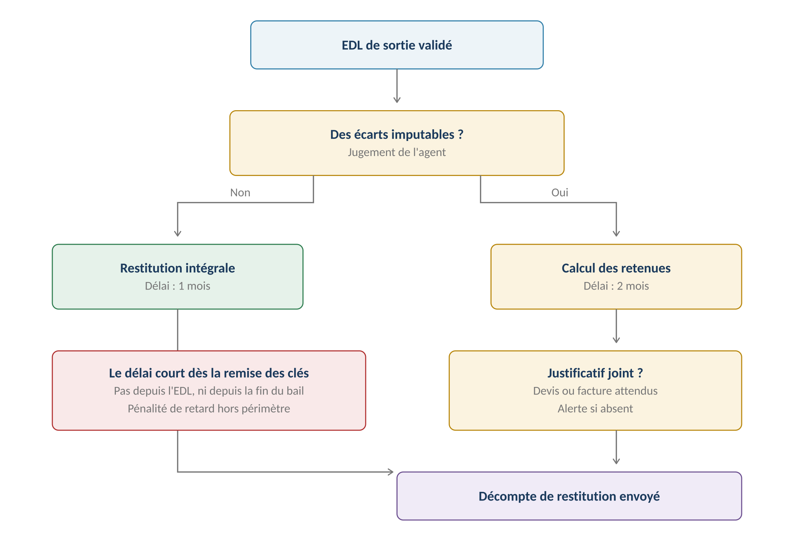
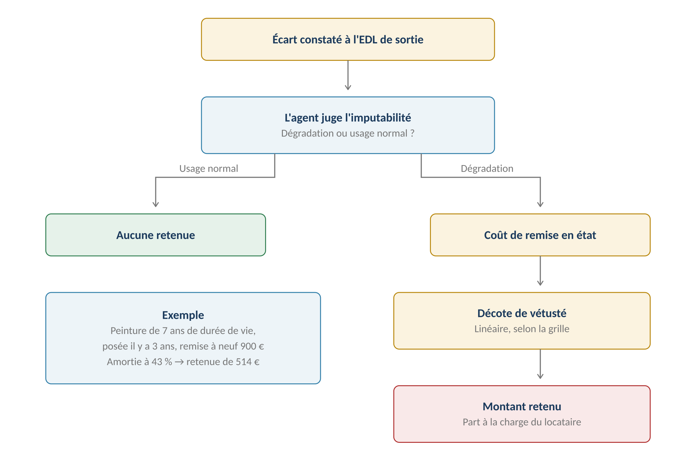

**GERIMMO V3**

Référentiel des parcours clients

**MODULE 2**

**Garanties**

|               |                                                          |
|:--------------|:---------------------------------------------------------|
| **Périmètre** | 7 parcours · 3 objets métier                             |
| **Dépend de** | **Module 1 — le comparatif des états des lieux**         |
| **Alimente**  | Solde de tout compte (3.11) · Comptabilité (4.1)         |
| **Criticité** | **MAXIMALE sur la restitution — délai légal sanctionné** |
| **Statut**    | **Module clos — aucune question ouverte**                |

> **Vue d'ensemble du module**

**Trois manières de sécuriser le bailleur**

------------------------------------------------------------------------

*Schéma 1 — Seul le dépôt de garantie se restitue ; les deux autres s'éteignent avec le bail*

> **Le dépôt de garantie n'est pas un solde comptable — décision actée**
>
> Il est suivi comme un montant encaissé à l'entrée, puis restitué à la sortie.
>
> Pas de compte mandant, pas de séquestre, pas de suivi d'intérêts.
>
> C'est cohérent avec la comptabilité déclarative retenue au module 4.

**Objets créés dans ce module**

------------------------------------------------------------------------

| **Objet** | **Description** | **Rattaché à** |
|:---|:---|:---|
| **Dépôt de garantie** | Montant encaissé, puis restitué | Bail |
| **Garantie** | Caution personne, Visale, GLI, caution bancaire | Bail |
| **Retenue** | Ligne de décompte, avec sa décote de vétusté | Restitution |

**Cartographie des 7 parcours**

------------------------------------------------------------------------

| **\#** | **Parcours** | **Persona** | **V1 / V2** | **Criticité** |
|:---|:---|:---|:---|:---|
| 2.1 | Encaissement du dépôt de garantie | AG | **V1** | Haute |
| 2.2 | Caution personne physique | AG | **V1** | Haute |
| 2.3 | Garantie Visale, GLI, bancaire | AG | **V1** | Moyenne |
| 2.4 | **Restitution du dépôt** | AG | **V1** | **MAXIMALE** |
| 2.5 | Litige sur retenue | AG | **V2** | Moyenne |
| 2.6 | Suivi du dépôt par le locataire | LO | **V1** | Faible |
| 2.7 | Réception du décompte | LO | **V1** | Moyenne |

> **2.1 — Encaissement du dépôt de garantie**

|                 |                                                      |
|:----------------|:-----------------------------------------------------|
| **Persona**     | AG — Agent immobilier                                |
| **Déclencheur** | Signature du bail                                    |
| **Fréquence**   | À chaque bail                                        |
| **Criticité**   | Haute                                                |
| **Plafond**     | 1 mois de loyer hors charges en nu, 2 mois en meublé |

**Parcours nominal**

------------------------------------------------------------------------

| **\#** | **Acteur** | **Action** | **Écran / état** |
|:---|:---|:---|:---|
| 1 | **Système** | Reprend le montant saisi au bail (1.1) | Onglet Garanties |
| 2 | AG | Enregistre l'encaissement : date, moyen, montant reçu | Formulaire |
| 3 | **Système** | Contrôle la conformité au plafond légal | Blocage si dépassé |
| 4 | **Système** | Marque le dépôt comme encaissé | Badge sur le bail |
| 5 | **Système** | Enregistre l'écriture en comptabilité (4.2) | — |

**Les plafonds légaux**

------------------------------------------------------------------------

| **Type de bail**  | **Plafond**        | **Base de calcul** |
|:------------------|:-------------------|:-------------------|
| **Bail nu**       | **1 mois maximum** | Loyer hors charges |
| **Bail meublé**   | **2 mois maximum** | Loyer hors charges |
| **Bail mobilité** | Interdit           | Hors périmètre     |

**Variantes**

------------------------------------------------------------------------

| **Code** | **Situation** | **Comportement** |
|:---|:---|:---|
| **V1** | Encaissement partiel | Le solde restant est signalé. Le bail reste valide. |
| **V2** | Dépôt versé par un tiers | Un parent verse pour un étudiant. Le versant est tracé. |
| **V3** | Aucun dépôt | Certains baux n'en prévoient pas. Le champ reste à zéro. |
| **V4** | Garantie Visale | Visale peut se substituer au dépôt. Voir 2.3. |

> **Variante — propriétaire en gestion directe (PD)**
>
> Le propriétaire en gestion directe encaisse lui-même le dépôt.
>
> Aucun compte de gérance n'est concerné.

**Règles métier**

------------------------------------------------------------------------

> **RM-2.1.1** — Le dépôt ne peut excéder un mois de loyer hors charges en bail nu.
>
> **RM-2.1.2** — Il peut atteindre deux mois en bail meublé.
>
> **RM-2.1.3** — Le dépôt est suivi comme un encaissement, non comme un solde comptable.
>
> **RM-2.1.4** — Le versant est tracé s'il diffère du locataire.
>
> **RM-2.1.5** — Le dépôt n'est jamais révisé en cours de bail, même après révision du loyer.

**User story**

------------------------------------------------------------------------

> **US-2.1.1**
>
> *En tant qu'agent immobilier, je veux être bloqué si le dépôt dépasse le plafond, afin de ne pas exposer le bailleur à une restitution forcée.*

- **Étant donné** un bail nu à 700 € de loyer hors charges, **quand** je saisis un dépôt de 1 400 €, **alors** la validation est refusée : le plafond est d'un mois

> **2.2 & 2.3 — Caution et garanties externes**

**2.2 — Caution personne physique**

------------------------------------------------------------------------

|                 |                                               |
|:----------------|:----------------------------------------------|
| **Persona**     | AG — Agent immobilier                         |
| **Déclencheur** | Un garant s'engage pour le locataire          |
| **Fréquence**   | Fréquente                                     |
| **Criticité**   | Haute — le formalisme conditionne la validité |
| **Prérequis**   | Le garant existe comme personne (0b.3)        |

| **\#** | **Acteur** | **Action** | **Écran / état** |
|:---|:---|:---|:---|
| 1 | AG | Depuis l'onglet Garanties, clique « Ajouter une caution » | Fiche bail |
| 2 | AG | Sélectionne le garant parmi les personnes (0b.3) | Recherche |
| 3 | AG | Choisit le type : simple ou solidaire | Sélecteur |
| 4 | AG | Indique la durée de l'engagement | Formulaire |
| 5 | **Système** | Génère l'acte de cautionnement | PDF |
| 6 | **Système** | **Envoie en signature électronique** | Module 13 |
| 7 | AR | Le garant signe par email | Yousign |
| 8 | **Système** | Rapatrie l'acte signé et active la garantie | — |

| **Type de caution** | **Portée** | **Usage** |
|:---|:---|:---|
| **Caution simple** | Le bailleur poursuit d'abord le locataire | Rare |
| **Caution solidaire** | **Le bailleur peut poursuivre directement le garant** | Cas majoritaire |

> **Le lien de garantie est porté par le bail**
>
> Décision du module 0b : le garant est une personne à part entière,
>
> mais son engagement est rattaché à un bail précis.
>
> Un même garant peut couvrir deux locataires sur deux baux distincts,
>
> avec deux engagements séparés.

**2.3 — Garanties externes**

------------------------------------------------------------------------

| **Dispositif** | **Nature** | **Ce que Gerimmo enregistre** |
|:---|:---|:---|
| **Visale** | Garantie gratuite d'Action Logement | Numéro de visa, période, plafond |
| **GLI** | Assurance loyers impayés souscrite par le bailleur | Assureur, contrat, franchise |
| **Caution bancaire** | Engagement d'une banque | Banque, montant, durée |
| **Garantie employeur** | Engagement d'un employeur | Entreprise, référence |

> **Aucune intégration avec les organismes**
>
> Gerimmo enregistre l'existence de la garantie et ses caractéristiques.
>
> Pas de vérification en ligne auprès d'Action Logement, pas de déclaration
>
> de sinistre à l'assureur GLI. Ces démarches restent hors application.

**Règles métier**

------------------------------------------------------------------------

> **RM-2.2.1** — La caution est rattachée à un bail, jamais à une personne en général.
>
> **RM-2.2.2** — La caution solidaire est le type par défaut.
>
> **RM-2.2.3** — L'acte de cautionnement signé conditionne l'activation de la garantie.
>
> **RM-2.2.6** — L'acte est signé électroniquement via le module 13.
>
> **RM-2.2.4** — En colocation, chaque garant couvre un colocataire identifié (RM-1.3.8).
>
> **RM-2.2.5** — L'engagement du garant s'éteint avec celui du colocataire qu'il couvre.
>
> **RM-2.3.1** — Les garanties externes sont enregistrées sans intégration aux organismes.
>
> **RM-2.3.2** — Plusieurs garanties peuvent coexister sur un même bail.
>
> **RM-2.3.3** — Visale peut se substituer au dépôt de garantie, qui reste alors à zéro.

**User story**

------------------------------------------------------------------------

> **US-2.2.1**
>
> *En tant qu'agent immobilier, je veux que l'engagement du garant suive celui du colocataire, afin de savoir précisément qui garantit quoi après un départ.*

- **Étant donné** un colocataire dont la solidarité s'éteint au 31 décembre, **quand** cette date est atteinte, **alors** l'engagement de son garant s'éteint également

> **2.4 — Restitution du dépôt de garantie**
>
> **Le parcours le plus exposé du module**
>
> Le délai est légal et sanctionné : un mois si l'état des lieux de sortie est conforme
>
> à celui d'entrée, deux mois en cas d'écarts.
>
> Et rappel du module 1 — RM-1.13.4 : sans état des lieux d'entrée,
>
> aucune retenue n'est possible, quelles que soient les dégradations constatées.

|                 |                                                  |
|:----------------|:-------------------------------------------------|
| **Persona**     | AG — Agent immobilier                            |
| **Déclencheur** | Remise des clés par le locataire                 |
| **Fréquence**   | À chaque fin de bail                             |
| **Criticité**   | MAXIMALE                                         |
| **Alimente**    | Solde de tout compte (3.11) · Comptabilité (4.1) |

**Le circuit**

------------------------------------------------------------------------

*Schéma 2 — Le délai court depuis la remise des clés, non depuis l'état des lieux*

**Parcours nominal**

------------------------------------------------------------------------

| **\#** | **Acteur** | **Action** | **Écran / état** |
|:---|:---|:---|:---|
| 1 | AG | Enregistre la remise des clés | Fiche bail |
| 2 | **Système** | **Lance le compteur : 1 ou 2 mois selon les écarts** | Alerte |
| 3 | **Système** | Reprend les écarts du comparatif d'EDL (1.13) | Liste |
| 4 | AG | Juge l'imputabilité de chaque écart | Sélecteur par ligne |
| 5 | AG | Saisit le coût de remise en état | Formulaire |
| 6 | **Système** | **Applique la décote de vétusté depuis la grille** | Calcul automatique |
| 7 | AG | Joint devis ou facture | Alerte si absent |
| 8 | **Système** | Calcule le solde à restituer | Aperçu |
| 9 | AG | Valide et génère le décompte | PDF |
| 10 | **Système** | Envoie le décompte au locataire (2.7) | — |

**Le calcul d'une retenue**

------------------------------------------------------------------------

*Schéma 3 — L'écart constaté ne devient une retenue qu'après jugement d'imputabilité et décote*

**La décote de vétusté**

------------------------------------------------------------------------

*Schéma 4 — Décote linéaire : au terme de la durée de vie, plus aucune retenue n'est possible*

> **Grille par défaut modifiable, décote linéaire — décision actée**
>
> Chaque type d'élément porte une durée de vie. La part amortie se calcule au prorata
>
> de l'âge de l'élément, sans palier.
>
> La décote linéaire est celle que retiennent les tribunaux : elle est plus favorable
>
> au locataire qu'un système de paliers, et plus simple à défendre.

**Grille de vétusté par défaut**

------------------------------------------------------------------------

| **Élément** | **Durée de vie** | **Remarque** |
|:---|:---|:---|
| **Peinture, papier peint** | 7 ans | Le plus fréquemment invoqué |
| **Revêtement de sol souple** | 10 ans | Lino, vinyle |
| **Moquette** | 7 ans | — |
| **Parquet** | 25 ans | Hors ponçage |
| **Robinetterie** | 15 ans | — |
| **Appareils sanitaires** | 25 ans | — |
| **Électroménager** | 8 ans | En location meublée |
| **Volets, stores** | 15 ans | — |
| **Serrurerie** | 20 ans | — |
| **Chaudière individuelle** | 15 ans | Entretien annuel à la charge du locataire |

**Ce qui n'est jamais retenu**

------------------------------------------------------------------------

| **Situation** | **Raison** |
|:---|:---|
| **Usure normale** | L'usage du logement implique une dégradation progressive |
| **Élément amorti** | Au-delà de sa durée de vie, sa valeur résiduelle est nulle |
| **Vétusté antérieure au bail** | L'EDL d'entrée fait foi |
| **Absence d'EDL d'entrée** | **Le logement est réputé avoir été remis en bon état** |
| **Réparation locative non faite** | Retenue possible — décret 87-712 |

**Variantes**

------------------------------------------------------------------------

| **Code** | **Situation** | **Comportement** |
|:---|:---|:---|
| **V1** | Restitution intégrale | Aucun écart imputable. Délai d'un mois. |
| **V2** | **Retenue estimée sans devis** | Acceptée avec alerte : difficilement défendable en cas de contestation |
| **V3** | Retenue supérieure au dépôt | Le solde devient une créance sur le locataire (module 3). |
| **V4** | Loyer ou charges impayés | Imputés sur le dépôt avant les retenues de dégradation. |
| **V5** | **Régularisation de charges en attente** | Retenue provisionnelle de 20 % autorisée jusqu'à l'arrêté des comptes. |
| **V6** | Colocation | Restitution unique, aux colocataires conjointement. |

**Cas d'erreur**

------------------------------------------------------------------------

| **Cas** | **Comportement attendu** |
|:---|:---|
| Aucun EDL d'entrée | **BLOCAGE des retenues — restitution intégrale imposée** |
| Retenue sur un élément amorti | **BLOCAGE — valeur résiduelle nulle** |
| Retenue sans justificatif | **Alerte explicite, la validation reste possible** |
| Délai dépassé | Alerte. La pénalité de retard est hors périmètre. |
| Total des retenues supérieur au dépôt | Autorisé : le solde bascule en créance |

**Règles métier**

------------------------------------------------------------------------

> **RM-2.4.1** — Le délai court à compter de la remise des clés, non de l'état des lieux.
>
> **RM-2.4.2** — Le délai est d'un mois sans écart, de deux mois avec écarts.
>
> **RM-2.4.3** — Sans EDL d'entrée, aucune retenue n'est possible (RM-1.13.4).
>
> **RM-2.4.4** — Chaque retenue subit une décote de vétusté linéaire selon la grille.
>
> **RM-2.4.5** — Un élément au-delà de sa durée de vie ne peut donner lieu à aucune retenue.
>
> **RM-2.4.6** — Une retenue sans justificatif est acceptée mais génère une alerte explicite.
>
> **RM-2.4.7** — Les impayés sont imputés sur le dépôt avant les retenues de dégradation.
>
> **RM-2.4.8** — Une provision de 20 % peut être conservée jusqu'à l'arrêté des charges.
>
> **RM-2.4.9** — La grille de vétusté est modifiable par l'agence, sans effet rétroactif.
>
> **RM-2.4.10** — La pénalité de retard de 10 % par mois est hors périmètre V1.

**User stories**

------------------------------------------------------------------------

> **US-2.4.1**
>
> *En tant qu'agent immobilier, je veux que la décote de vétusté soit calculée automatiquement, afin de produire une retenue défendable sans calcul manuel.*

- **Étant donné** une peinture de 7 ans de durée de vie, refaite il y a 3 ans, **quand** je saisis un coût de remise en état de 900 €, **alors** la retenue proposée est de 514 €, soit 57 % du coût

- **Étant donné** un revêtement de sol posé il y a 12 ans pour 10 ans de durée de vie, **quand** je tente d'imputer une retenue, **alors** l'action est refusée : l'élément est amorti

> **US-2.4.2**
>
> *En tant qu'agent immobilier, je veux être alerté si je retiens sans justificatif, afin de mesurer le risque avant d'envoyer le décompte.*

- **Étant donné** une retenue de 400 € sans devis joint, **quand** je valide le décompte, **alors** une alerte m'indique que la retenue sera difficilement défendable

- **Étant donné** cette alerte, **quand** je confirme malgré tout, **alors** le décompte est généré et l'absence de justificatif est tracée

> **US-2.4.3**
>
> *En tant qu'agent immobilier, je veux être bloqué s'il n'y a pas d'état des lieux d'entrée, afin de ne pas produire un décompte indéfendable.*

- **Étant donné** un bail sans EDL d'entrée, **quand** j'ouvre la restitution du dépôt, **alors** aucune retenue n'est saisissable et la restitution intégrale est proposée

> **US-2.4.4**
>
> *En tant qu'agent immobilier, je veux être alerté du délai qui court, afin de ne pas dépasser le terme légal.*

- **Étant donné** des clés remises le 5 avril avec des écarts constatés, **quand** le 20 mai approche, **alors** une alerte me rappelle que le délai expire le 5 juin

> **2.5, 2.6 & 2.7 — Litige, suivi et décompte**

**2.5 — Litige sur retenue**

------------------------------------------------------------------------

> **Reporté en V2**
>
> En V1, le litige se traite par la messagerie (module 15) et le traçage documentaire.
>
> La V2 apporterait un suivi structuré : contestation enregistrée, pièces échangées,
>
> issue tracée. Utile mais non bloquant.

| **Étape** | **V1** | **V2** |
|:---|:---|:---|
| **Contestation reçue** | Messagerie | Objet dédié, daté |
| **Échange de pièces** | Pièces jointes | Rattachées au litige |
| **Décision** | Nouveau décompte | Décompte rectificatif tracé |
| **Commission de conciliation** | Hors périmètre | Hors périmètre |

**2.6 — Suivi du dépôt par le locataire**

------------------------------------------------------------------------

|                 |                                      |
|:----------------|:-------------------------------------|
| **Persona**     | LO — Locataire                       |
| **Déclencheur** | Connexion à son espace               |
| **Fréquence**   | Occasionnelle                        |
| **Criticité**   | Faible                               |
| **Contenu**     | Montant, date d'encaissement, statut |

| **Information**                   | **Visible** | **Quand**                   |
|:----------------------------------|:------------|:----------------------------|
| **Montant du dépôt**              | **Oui**     | Dès l'encaissement          |
| **Date d'encaissement**           | **Oui**     | Dès l'encaissement          |
| **Délai de restitution en cours** | **Oui**     | Après remise des clés       |
| **Retenues envisagées**           | **Non**     | Seulement au décompte final |
| **Identité du garant**            | **Oui**     | S'il en a un                |

> **Pourquoi masquer les retenues en cours de calcul**
>
> Un montant provisoire affiché puis modifié créerait une attente injustifiée
>
> et une source de contestation.
>
> Le locataire voit le décompte quand il est arrêté, pas pendant son élaboration.

**2.7 — Réception du décompte de restitution**

------------------------------------------------------------------------

| **\#** | **Acteur**  | **Action**                       | **Écran / état** |
|:-------|:------------|:---------------------------------|:-----------------|
| 1      | **Système** | Envoie le décompte au locataire  | Email + espace   |
| 2      | LO          | Consulte le détail des retenues  | Espace locataire |
| 3      | LO          | Accède aux justificatifs joints  | Pièces jointes   |
| 4      | LO          | Peut contester via la messagerie | Module 15        |

**Ce que contient le décompte**

------------------------------------------------------------------------

| **Rubrique** | **Détail attendu** |
|:---|:---|
| **Dépôt initial** | Montant et date d'encaissement |
| **Impayés imputés** | Loyers et charges dus, période par période |
| **Retenues pour dégradation** | Élément, coût, âge, décote appliquée, montant retenu |
| **Justificatifs** | Devis ou factures joints |
| **Provision sur charges** | Si régularisation en attente — 20 % maximum |
| **Solde restitué** | **Montant et date de versement** |

**Règles métier**

------------------------------------------------------------------------

> **RM-2.6.1** — Le locataire voit le montant et la date de son dépôt dès l'encaissement.
>
> **RM-2.6.2** — Il ne voit aucune retenue tant que le décompte n'est pas arrêté.
>
> **RM-2.7.1** — Le décompte détaille chaque retenue : coût, âge, décote, montant.
>
> **RM-2.7.2** — Les justificatifs joints sont accessibles au locataire.
>
> **RM-2.7.3** — Le décompte est figé après envoi ; une correction produit un décompte rectificatif.

**User story**

------------------------------------------------------------------------

> **US-2.7.1**
>
> *En tant que locataire, je veux comprendre le détail de chaque retenue, afin de savoir si elle est justifiée.*

- **Étant donné** un décompte comportant une retenue de peinture, **quand** je l'ouvre, **alors** je vois le coût de remise en état, l'âge de l'élément et la décote appliquée

- **Étant donné** une retenue accompagnée d'un devis, **quand** je clique dessus, **alors** le devis s'ouvre

> **Synthèse du module**

**Les règles métier les plus structurantes**

------------------------------------------------------------------------

| **Code** | **Règle** | **Bloquant** |
|:---|:---|:---|
| **RM-2.1.1** | Dépôt plafonné à un mois en nu, deux en meublé | **Oui** |
| **RM-2.1.3** | Le dépôt est un encaissement, pas un solde comptable | Structurel |
| **RM-2.2.1** | La caution est rattachée à un bail | Structurel |
| **RM-2.2.5** | L'engagement du garant suit celui du colocataire | Structurel |
| **RM-2.3.1** | Aucune intégration aux organismes de garantie | Structurel |
| **RM-2.4.1** | **Le délai court depuis la remise des clés** | Structurel |
| **RM-2.4.3** | **Sans EDL d'entrée, aucune retenue possible** | **Oui** |
| **RM-2.4.4** | Décote de vétusté linéaire selon la grille | Structurel |
| **RM-2.4.5** | Aucune retenue sur un élément amorti | **Oui** |
| **RM-2.4.6** | Retenue sans justificatif acceptée avec alerte | Non |
| **RM-2.4.7** | Impayés imputés avant les dégradations | Structurel |
| **RM-2.6.2** | Le locataire ne voit rien avant l'arrêté du décompte | Structurel |
| **RM-2.7.3** | Le décompte est figé après envoi | **Oui** |

**Décompte des user stories**

------------------------------------------------------------------------

| **Parcours** | **User stories** | **Critères d'acceptation** |
|:---|:---|:---|
| 2.1 — Encaissement | 1 | 1 |
| 2.2 & 2.3 — Caution et garanties | 1 | 1 |
| **2.4 — Restitution** | **4** | **7** |
| 2.7 — Décompte | 1 | 2 |
| **TOTAL** | **7** | **11** |

**Décisions actées sur ce module**

------------------------------------------------------------------------

| **Décision**                                        | **Statut**         |
|:----------------------------------------------------|:-------------------|
| Grille de vétusté par défaut, modifiable            | **Acté**           |
| Décote linéaire, sans palier                        | **Acté**           |
| Retenue estimée acceptée avec alerte                | **Acté**           |
| Dépôt suivi comme encaissement, pas comme solde     | **Acté**           |
| **Acte de cautionnement en signature électronique** | **Acté**           |
| Litige structuré                                    | **V2**             |
| Pénalité de retard de 10 % par mois                 | **Hors périmètre** |
| Intégration Visale, GLI                             | **Hors périmètre** |
| Commission de conciliation                          | **Hors périmètre** |

**Ce que ce module impose ailleurs**

------------------------------------------------------------------------

| **Module** | **Conséquence** |
|:---|:---|
| **Module 3 — Loyers** | Le solde de tout compte intègre le dépôt et ses retenues |
| **Module 4 — Comptabilité** | Encaissement et restitution produisent deux écritures |
| **Module 13 — Signature** | **L'acte de cautionnement y transite** |
| **Module 14 — Alertes** | Délai de restitution, échéance de garantie |
| **Module 18 — Admin** | **La grille de vétusté se paramètre ici** |

**Prochaine étape**

------------------------------------------------------------------------

> **Module 3 — Loyers et charges**
>
> Douze parcours : appel de loyer, quittance, impayés, révision IRL,
>
> régularisation des charges et solde de tout compte.
>
> C'est le module le plus dense en calculs, et celui où la régularisation
>
> dépend directement de la ventilation du module 0c.
