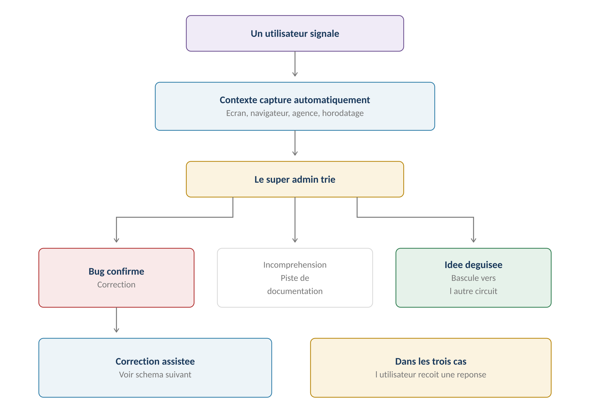
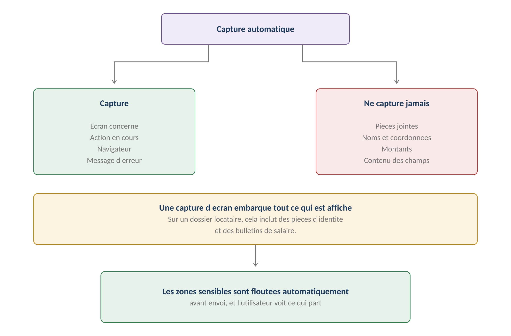
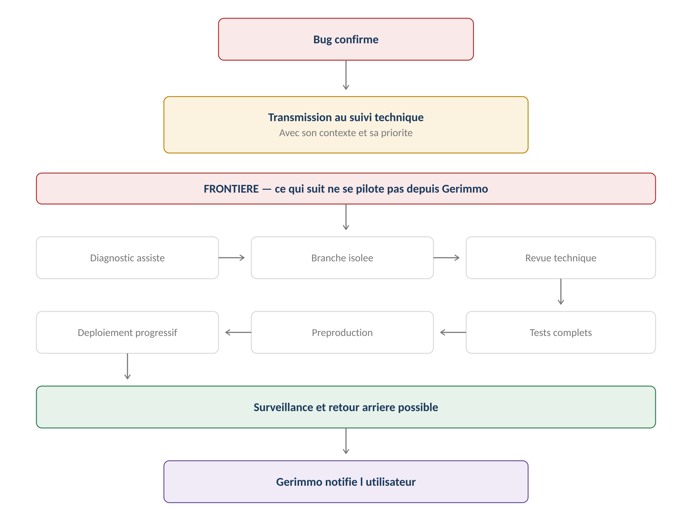
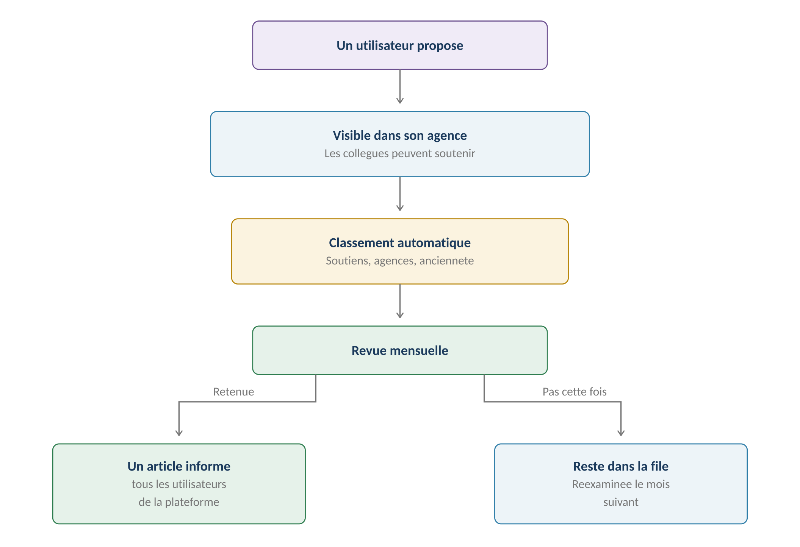
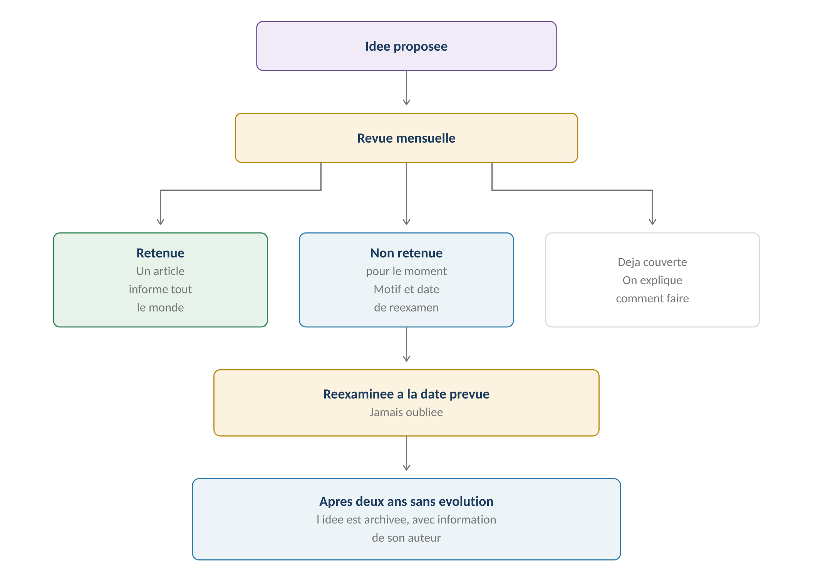
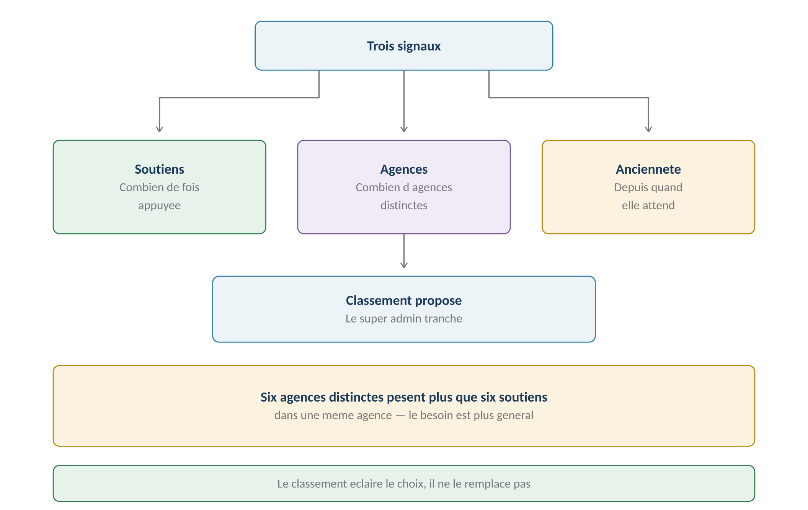

**GERIMMO V3**

Référentiel des parcours clients

**MODULE 20**

**Retours utilisateurs**

|  |  |
|:---|:---|
| **Périmètre** | 6 parcours · 2 objets métier |
| **Origine** | **Lacune identifiée après l'audit** |
| **Objet** | Signalement de bugs et propositions d'évolution |
| **Correction apportée** | **La modification du code sort du périmètre — audit actualisé** |
| **Statut** | **Module clos — aucune question ouverte** |

> **Vue d'ensemble du module**
>
> **Une lacune du référentiel**
>
> Les vingt-deux modules décrivent comment une agence gère ses locataires,
>
> ses biens et ses artisans.
>
> Aucun ne décrivait comment Gerimmo écoute ses propres utilisateurs.
>
> C'est l'objet de ce module.

**Deux objets, deux circuits**

------------------------------------------------------------------------

| **Objet**       | **Ce que c'est**                | **Circuit**         |
|:----------------|:--------------------------------|:--------------------|
| **Signalement** | Quelque chose ne fonctionne pas | **Immédiat**        |
| **Idée**        | Quelque chose manque            | **Revue mensuelle** |

> **Pourquoi deux circuits distincts**
>
> Un bug empêche de travailler : il se traite vite.
>
> Une idée enrichit le produit : elle se compare aux autres avant d'être retenue.
>
> Les mélanger produirait soit des bugs traités trop lentement,
>
> soit des évolutions décidées dans l'urgence.

**Objets créés dans ce module**

------------------------------------------------------------------------

| **Objet** | **Description** | **Rattaché à** |
|:---|:---|:---|
| **Signalement** | Bug rapporté avec son contexte technique | Utilisateur + Agence |
| **Idée** | Proposition d'évolution, avec ses soutiens | Utilisateur + Agence |

**Cartographie des 6 parcours**

------------------------------------------------------------------------

| **\#** | **Parcours** | **Persona** | **V1 / V2** | **Criticité** |
|:---|:---|:---|:---|:---|
| 20.1 | Signalement d'un bug | Tous | **V1** | Haute |
| 20.2 | Tri des signalements | SA | **V1** | Haute |
| 20.3 | **Transmission au suivi technique** | SA | **V1** | Haute |
| 20.4 | Proposition d'une idée | Tous | **V1** | Moyenne |
| 20.5 | **Revue mensuelle** | SA | **V1** | Moyenne |
| 20.6 | Publication d'un article | SA | **V1** | Faible |

> **20.1 & 20.2 — Signaler et trier**

**Le circuit**

------------------------------------------------------------------------

*Schéma 1 — Trois issues au tri, une réponse dans tous les cas*

**20.1 — Signalement d'un bug**

------------------------------------------------------------------------

|                  |                                  |
|:-----------------|:---------------------------------|
| **Persona**      | Tout utilisateur connecté        |
| **Déclencheur**  | Quelque chose ne fonctionne pas  |
| **Fréquence**    | Occasionnelle                    |
| **Criticité**    | Haute — c'est la voix du terrain |
| **Destinataire** | **Le super admin, toujours**     |

| **\#** | **Acteur** | **Action** | **Écran / état** |
|:---|:---|:---|:---|
| 1 | Utilisateur | Clique « Signaler un problème » | Menu permanent |
| 2 | **Système** | **Capture le contexte automatiquement** | — |
| 3 | Utilisateur | Décrit ce qu'il attendait | Champ obligatoire |
| 4 | Utilisateur | Décrit ce qui s'est passé | Champ obligatoire |
| 5 | Utilisateur | Joint une capture d'écran | Recommandé |
| 6 | Utilisateur | Valide | — |
| 7 | **Système** | Transmet au super admin | File d'attente |
| 8 | **Système** | Accuse réception à l'utilisateur | Notification |

**Ce qui est capturé automatiquement**

------------------------------------------------------------------------

| **Élément** | **Pourquoi** |
|:---|:---|
| **Écran concerné** | Localise le problème sans description |
| **Action en cours** | Reconstitue le parcours |
| **Navigateur et version** | Isole les problèmes de compatibilité |
| **Appareil et taille d'écran** | Distingue mobile et bureau |
| **Agence et rôle** | Contextualise les droits |
| **Horodatage** | Permet de retrouver les journaux techniques |
| **Dernières erreurs techniques** | **Le message d'erreur exact, s'il y en a un** |

> **Sans contexte, aucune correction possible**
>
> Un signalement qui dit seulement « ça ne marche pas » ne permet pas d'agir.
>
> La capture automatique du contexte technique évite de demander à l'utilisateur
>
> des informations qu'il ne sait pas fournir.

**Ce qui n'est jamais capturé**

------------------------------------------------------------------------

*Schéma 2 — La capture technique ne doit embarquer aucune donnée personnelle*

| **Élément** | **Capturé** | **Raison** |
|:---|:---|:---|
| **Écran et action en cours** | **Oui** | Localise le problème |
| **Navigateur et appareil** | **Oui** | Isole les incompatibilités |
| **Message d'erreur technique** | **Oui** | Diagnostic |
| **Identifiant de l'agence** | **Oui** | Contextualise les droits |
| **Contenu des champs saisis** | **Non** | Données personnelles |
| **Noms et coordonnées** | **Non** | Données personnelles |
| **Montants et données financières** | **Non** | Confidentialité |
| **Pièces jointes affichées** | **Non** | **Pièces d'identité, revenus** |

> **Le piège de la capture d'écran**
>
> Une capture embarque tout ce qui est affiché.
>
> Sur un dossier locataire, cela inclut potentiellement une pièce d'identité,
>
> un bulletin de salaire ou un avis d'imposition.
>
> Les zones sensibles sont donc floutées automatiquement avant envoi,
>
> et l'utilisateur voit exactement ce qui part.

**Les règles de protection**

------------------------------------------------------------------------

| **Règle** | **Détail** |
|:---|:---|
| **Masquage automatique** | Les champs personnels sont floutés avant envoi |
| **Prévisualisation** | **L'utilisateur voit ce qui sera transmis** |
| **Conservation limitée** | Six mois — RM-A2.6 |
| **Accès restreint** | Super admin et personnes habilitées |
| **Séparation des données** | **Le support ne donne pas accès au métier** |
| **Information de l'utilisateur** | Ce qui est capturé est indiqué au moment du signalement |

**20.2 — Tri par le super admin**

------------------------------------------------------------------------

|                 |                                             |
|:----------------|:--------------------------------------------|
| **Persona**     | SA — Super admin                            |
| **Déclencheur** | Signalement reçu                            |
| **Fréquence**   | Quotidienne                                 |
| **Criticité**   | Haute                                       |
| **Issues**      | Trois — bug, incompréhension, idée déguisée |

| **Issue** | **Quand** | **Suite** |
|:---|:---|:---|
| **Bug confirmé** | Le comportement est effectivement anormal | **Correction assistée (20.3)** |
| **Incompréhension d'usage** | Le comportement est normal mais mal compris | Piste de documentation |
| **Idée déguisée** | C'est une demande d'évolution | Bascule vers 20.4 |

> **L'incompréhension d'usage est une information**
>
> Un utilisateur qui signale comme bug un comportement normal révèle
>
> que l'écran n'est pas assez explicite.
>
> Ce n'est pas un signalement inutile : c'est un signal de conception,
>
> et il alimente une file de pistes de documentation.

**Les priorités**

------------------------------------------------------------------------

| **Niveau**   | **Critère**                         | **Traitement**         |
|:-------------|:------------------------------------|:-----------------------|
| **Bloquant** | Empêche une action essentielle      | **Immédiat**           |
| **Majeur**   | Contournement possible mais pénible | Sous quelques jours    |
| **Mineur**   | Gêne sans conséquence               | Regroupé avec d'autres |

**Règles métier**

------------------------------------------------------------------------

> **RM-20.1.1** — Tout utilisateur connecté peut signaler un bug.
>
> **RM-20.1.2** — Le contexte technique est capturé automatiquement, sans donnée personnelle.
>
> **RM-20.1.5** — Les champs personnels et les pièces affichées sont masqués avant envoi.
>
> **RM-20.1.6** — L'utilisateur prévisualise ce qui sera transmis.
>
> **RM-20.1.7** — Les données de support sont séparées des données métier.
>
> **RM-20.1.8** — Un signalement est conservé six mois, puis supprimé.
>
> **RM-20.1.3** — La description de l'attendu et du constaté est obligatoire.
>
> **RM-20.1.4** — Tout signalement est accusé réception immédiatement.
>
> **RM-20.2.1** — Le tri est fait par le super admin, jamais par l'agence.
>
> **RM-20.2.2** — Trois issues possibles : bug, incompréhension, idée.
>
> **RM-20.2.3** — Une incompréhension alimente une file de pistes de documentation.
>
> **RM-20.2.4** — L'utilisateur reçoit une réponse quelle que soit l'issue.

**User story**

------------------------------------------------------------------------

> **US-20.1.1**
>
> *En tant qu'agent immobilier, je veux signaler un problème sans avoir à décrire mon environnement technique, afin que le signalement soit exploitable.*

- **Étant donné** une erreur rencontrée sur un écran, **quand** je clique sur « Signaler un problème », **alors** l'écran, mon navigateur et le message d'erreur sont déjà renseignés

- **Étant donné** mon signalement envoyé, **quand** il est reçu, **alors** j'obtiens un accusé de réception immédiat

> **20.3 — Transmission au suivi technique**
>
> **Une correction apportée après audit**
>
> Une version antérieure de ce module prévoyait qu'un correctif de code
>
> soit validé puis appliqué depuis l'administration de production.
>
> C'était une erreur de conception. Un test qui reproduit un bug
>
> ne prouve ni l'absence de régression ailleurs, ni la sécurité du changement,
>
> et le super admin n'est pas nécessairement développeur.
>
> La modification du code relève d'un processus d'ingénierie,
>
> pas d'un module métier.

|                         |                                                |
|:------------------------|:-----------------------------------------------|
| **Persona**             | SA — Super admin                               |
| **Déclencheur**         | Bug confirmé au tri                            |
| **Fréquence**           | Selon les signalements                         |
| **Criticité**           | Haute                                          |
| **Ce que fait Gerimmo** | **Il transmet et il suit — il ne corrige pas** |

**La frontière**

------------------------------------------------------------------------

*Schéma 3 — Ce qui suit la transmission ne se pilote pas depuis Gerimmo*

**Ce qui reste dans Gerimmo**

------------------------------------------------------------------------

| **Action** | **Détail** |
|:---|:---|
| **Confirmer le bug** | Au tri, parcours 20.2 |
| **Qualifier la priorité** | Bloquant, majeur, mineur |
| **Transmettre au suivi technique** | **Avec le contexte capturé** |
| **Suivre l'avancement** | Reçu, en cours, corrigé |
| **Notifier l'utilisateur** | À la confirmation, puis à la correction |

**Où arrive un bug transmis**

------------------------------------------------------------------------

| **Élément** | **Détail** |
|:---|:---|
| **Destination** | **Une file dédiée dans l'environnement Claude Code** |
| **Ce qui est transmis** | Le contexte capturé, la priorité, le motif de confirmation |
| **Ce qui revient** | L'état d'avancement et la version de correction |
| **Lien de suivi** | Une référence technique visible du super admin |

**Ce qui se passe en dehors**

------------------------------------------------------------------------

| **Étape** | **Qui** | **Pourquoi elle est nécessaire** |
|:---|:---|:---|
| **Diagnostic assisté** | Claude Code | Accélère l'analyse |
| **Proposition de modification** | Claude Code | Accélère l'écriture |
| **Branche isolée** | Processus technique | **La production n'est jamais touchée** |
| **Relecture** | **Le responsable technique** | Comprendre ce qui change |
| **Tests unitaires et d'intégration** | Automatisé | **Le vrai garde-fou** |
| **Tests de non-régression** | Automatisé | **Le vrai garde-fou** |
| **Préproduction** | Processus technique | Vérifie dans des conditions réelles |
| **Déploiement progressif** | Processus technique | **Limite l'impact d'un problème** |
| **Surveillance** | Automatisé | Détecte un effet imprévu |
| **Retour arrière** | Processus technique | Rétablit en cas de besoin |

> **Où se situe réellement le garde-fou**
>
> Dans une petite structure, le responsable technique et le super admin
>
> sont la même personne. La relecture reste utile — comprendre ce qui change —
>
> mais elle ne peut pas tout garantir.
>
> Ce sont les tests automatisés, la préproduction et le déploiement progressif
>
> qui protègent réellement.
>
> C'est pourquoi ils ne sont pas optionnels : ils compensent ce qu'une revue
>
> par une seule personne ne peut pas voir.

**Ce que le super admin voit**

------------------------------------------------------------------------

| **Information**         | **Origine**                         |
|:------------------------|:------------------------------------|
| **État du signalement** | Reçu, confirmé, transmis, corrigé   |
| **Priorité assignée**   | Fixée au tri                        |
| **Référence technique** | Lien vers le suivi de développement |
| **Date de correction**  | Remontée par le processus technique |
| **Version concernée**   | Celle qui contient le correctif     |

> **Le super admin pilote le produit, pas le code**
>
> Il décide de ce qui est un bug, de sa priorité et de ce qu'on répond
>
> à l'utilisateur.
>
> Il ne décide pas si un correctif est techniquement acceptable —
>
> ce n'est ni son rôle ni sa compétence.

**Variantes**

------------------------------------------------------------------------

| **Code** | **Situation** | **Comportement** |
|:---|:---|:---|
| **V1** | Bug transmis et corrigé | Cas nominal. L'utilisateur est notifié. |
| **V2** | **Bug non reproductible** | Classé en attente, l'utilisateur est informé. |
| **V3** | Correction reportée | Priorité insuffisante, l'utilisateur est informé du report. |
| **V4** | **Bug bloquant** | Traitement accéléré, mais la chaîne reste la même. |
| **V5** | Correction annulée | Retour arrière effectué, l'utilisateur est réinformé. |

**Règles métier**

------------------------------------------------------------------------

> **RM-20.3.1** — Gerimmo transmet un bug confirmé, il ne le corrige jamais lui-même.
>
> **RM-20.3.2** — Aucune modification de code ne s'applique depuis l'administration.
>
> **RM-20.3.3** — La correction suit un processus d'ingénierie distinct du produit.
>
> **RM-20.3.4** — Toute modification passe par une branche isolée, jamais par la production.
>
> **RM-20.3.8** — Les tests automatisés et le déploiement progressif ne sont jamais optionnels.
>
> **RM-20.3.5** — Le super admin suit l'avancement, il ne valide pas le correctif.
>
> **RM-20.3.6** — L'utilisateur ayant signalé est notifié à la confirmation puis à la correction.
>
> **RM-20.3.7** — Un bug non reproductible reste ouvert, avec information de l'utilisateur.

**User stories**

------------------------------------------------------------------------

> **US-20.3.1**
>
> *En tant que super admin, je veux suivre l'avancement d'un bug sans piloter sa correction, afin de rester sur mon rôle.*

- **Étant donné** un bug que j'ai confirmé et transmis, **quand** je consulte son état, **alors** je vois s'il est en cours, corrigé, ou reporté

- **Étant donné** ce même bug, **quand** je cherche à appliquer un correctif, **alors** aucune action de ce type n'existe dans l'application

> **US-20.3.2**
>
> *En tant qu'utilisateur ayant signalé un bug, je veux savoir quand il est corrigé, afin de reprendre mon travail normalement.*

- **Étant donné** un bug que j'ai signalé la semaine dernière, **quand** la correction est déployée, **alors** je reçois une notification

> **20.4 à 20.6 — Les idées**

**Le circuit**

------------------------------------------------------------------------

*Schéma 4 — Le circuit de l'idée, de la proposition à l'article*

> **Aucun refus, mais une réponse — décision affinée**
>
> Une idée n'est jamais rejetée. Mais laisser une file grandir indéfiniment
>
> la rendrait illisible et priverait l'auteur de toute réponse.
>
> Trois statuts existent donc : retenue, non retenue pour le moment,
>
> ou déjà couverte.
>
> Une idée non retenue reçoit un motif compréhensible et une date
>
> de réexamen. Elle n'est pas refusée : elle attend, et on sait quand.

**Les trois statuts**

------------------------------------------------------------------------

*Schéma 5 — Trois statuts, aucun ne laisse l'auteur sans réponse*

| **Statut** | **Ce que reçoit l'auteur** | **Suite** |
|:---|:---|:---|
| **Retenue** | Notification et article public | Développement planifié |
| **Non retenue pour le moment** | **Motif et date de réexamen** | Revient à la date prévue |
| **Déjà couverte** | Explication de comment faire | Clôturée |

> **Pourquoi un motif et une date**
>
> Un utilisateur qui propose une idée et n'obtient jamais de réponse
>
> cesse d'en proposer.
>
> Un motif compréhensible — « nous priorisons d'abord la sortie de bail » —
>
> et une date de réexamen suffisent à entretenir le flux.
>
> Après deux ans sans évolution, l'idée est archivée, son auteur informé.

**20.4 — Proposition d'une idée**

------------------------------------------------------------------------

|                 |                           |
|:----------------|:--------------------------|
| **Persona**     | Tout utilisateur connecté |
| **Déclencheur** | Quelque chose manque      |
| **Fréquence**   | Occasionnelle             |
| **Criticité**   | Moyenne                   |
| **Visibilité**  | **Au sein de son agence** |

| **\#** | **Acteur** | **Action** | **Écran / état** |
|:---|:---|:---|:---|
| 1 | Utilisateur | Clique « Proposer une idée » | Menu permanent |
| 2 | **Système** | **Propose les idées similaires déjà déposées** | Évite les doublons |
| 3 | Utilisateur | Soutient une idée existante, ou en crée une | — |
| 4 | Utilisateur | Décrit le besoin, pas la solution | Champ guidé |
| 5 | Utilisateur | Valide | — |
| 6 | **Système** | Rend l'idée visible dans son agence | — |
| 7 | **Système** | L'ajoute à la file de la revue mensuelle | — |

> **Décrire le besoin, pas la solution**
>
> Un utilisateur qui écrit « il faudrait un bouton ici » propose une solution.
>
> Un utilisateur qui écrit « je perds du temps à faire ceci » décrit un besoin.
>
> Le second est plus utile : il laisse ouverte la manière de le résoudre,
>
> et il se rapproche plus facilement d'autres demandes similaires.
>
> Le formulaire guide dans ce sens.

**La visibilité**

------------------------------------------------------------------------

| **Qui voit** | **Quoi** | **Pourquoi** |
|:---|:---|:---|
| **L'auteur** | Son idée et son statut | Suivi de sa proposition |
| **Son agence** | **Toutes les idées de l'agence** | Éviter les doublons, soutenir |
| **Les autres agences** | Rien | Pas d'attente publique sur la feuille de route |
| **Le super admin** | **Toutes les idées, toutes agences** | Arbitrage et classement |

**20.5 — La revue mensuelle**

------------------------------------------------------------------------

|                        |                            |
|:-----------------------|:---------------------------|
| **Persona**            | SA — Super admin           |
| **Déclencheur**        | Échéance mensuelle         |
| **Fréquence**          | Une fois par mois          |
| **Criticité**          | Moyenne                    |
| **Aide à la décision** | **Classement automatique** |

**Le classement automatique**

------------------------------------------------------------------------

*Schéma 6 — Trois signaux, un classement, une décision humaine*

| **Signal** | **Ce qu'il mesure** | **Poids relatif** |
|:---|:---|:---|
| **Nombre de soutiens** | Combien de fois l'idée a été appuyée | Fort |
| **Agences distinctes** | **Combien d'agences différentes concernées** | **Le plus fort** |
| **Ancienneté** | Depuis quand elle attend | Modéré |

> **Pourquoi les agences distinctes pèsent le plus**
>
> Six soutiens dans une même agence signalent un besoin local,
>
> peut-être lié à une organisation particulière.
>
> Six agences différentes qui demandent la même chose signalent
>
> un besoin du métier.
>
> La seconde information vaut plus que la première.

| **\#** | **Acteur** | **Action** | **Écran / état** |
|:---|:---|:---|:---|
| 1 | **Système** | Alerte à la date de revue | Agenda |
| 2 | **Système** | Présente les idées classées | Console |
| 3 | SA | Examine la file | — |
| 4 | SA | **Retient une ou plusieurs idées** | — |
| 5 | **Système** | Les idées non retenues restent en file | Aucun refus |
| 6 | SA | Rédige l'article annonçant ce qui est retenu | Parcours 20.6 |
| 7 | **Système** | Notifie les auteurs et soutiens | — |

**20.6 — L'article d'information**

------------------------------------------------------------------------

> **Toute idée retenue fait l'objet d'un article — décision actée**
>
> L'article informe l'ensemble des utilisateurs de la plateforme,
>
> pas seulement l'agence à l'origine de l'idée.
>
> Il montre que les retours sont lus et suivis d'effet,
>
> ce qui entretient le flux de propositions.

| **Élément de l'article** | **Contenu** |
|:---|:---|
| **Ce qui a été retenu** | L'évolution décidée, en langage d'usage |
| **Pourquoi** | Le besoin auquel elle répond |
| **Quand** | Une échéance indicative, jamais un engagement |
| **Qui l'a proposée** | L'agence, si elle l'accepte |
| **Où le lire** | Espace de tous les utilisateurs, via les annonces (14.6) |

**Variantes**

------------------------------------------------------------------------

| **Code** | **Situation** | **Comportement** |
|:---|:---|:---|
| **V1** | Idée retenue | Article publié, auteurs notifiés. |
| **V2** | **Idée non retenue ce mois** | Motif et date de réexamen communiqués à l'auteur. |
| **V3** | Idée déjà couverte | L'auteur reçoit l'explication de comment faire. |
| **V4** | **Idée proposée par plusieurs agences** | Fusionnée, les soutiens s'additionnent. |
| **V5** | Idée devenue sans objet | Archivée avec explication. |

**Règles métier**

------------------------------------------------------------------------

> **RM-20.4.1** — Tout utilisateur connecté peut proposer une idée.
>
> **RM-20.4.2** — Les idées similaires sont proposées avant création, pour éviter les doublons.
>
> **RM-20.4.3** — Une idée est visible au sein de son agence, jamais entre agences.
>
> **RM-20.4.4** — Le super admin voit toutes les idées, toutes agences confondues.
>
> **RM-20.5.1** — Les idées sont examinées une fois par mois.
>
> **RM-20.5.2** — Le classement repose sur les soutiens, les agences distinctes et l'ancienneté.
>
> **RM-20.5.3** — Le nombre d'agences distinctes est le signal le plus fort.
>
> **RM-20.5.4** — Le classement éclaire la décision, il ne la remplace pas.
>
> **RM-20.5.5** — Aucune idée n'est refusée : trois statuts existent, jamais le rejet.
>
> **RM-20.5.6** — Une idée non retenue reçoit un motif et une date de réexamen.
>
> **RM-20.5.7** — Elle est réexaminée automatiquement à la date prévue.
>
> **RM-20.5.8** — Après deux ans sans évolution, elle est archivée avec information de l'auteur.
>
> **RM-20.5.9** — Les doublons sont regroupés, leurs soutiens s'additionnent.
>
> **RM-20.6.1** — Toute idée retenue fait l'objet d'un article.
>
> **RM-20.6.2** — L'article est diffusé à tous les utilisateurs de la plateforme.
>
> **RM-20.6.3** — L'échéance annoncée est indicative, jamais un engagement.

**User stories**

------------------------------------------------------------------------

> **US-20.4.1**
>
> *En tant qu'agent immobilier, je veux voir si mon idée existe déjà, afin de la soutenir plutôt que de créer un doublon.*

- **Étant donné** que je commence à décrire mon besoin, **quand** des idées similaires existent dans mon agence, **alors** elles me sont proposées avant que je valide

- **Étant donné** une idée similaire à la mienne, **quand** je la soutiens, **alors** mon soutien s'ajoute au compteur

> **US-20.5.1**
>
> *En tant que super admin, je veux que le classement distingue six agences de six soutiens, afin de prioriser les besoins du métier.*

- **Étant donné** une idée soutenue six fois dans une seule agence, **quand** une autre est soutenue une fois dans six agences, **alors** la seconde apparaît plus haut au classement

> **US-20.6.1**
>
> *En tant qu'utilisateur ayant proposé une idée, je veux savoir ce qu'elle devient, afin de continuer à en proposer.*

- **Étant donné** une idée que j'ai proposée, **quand** elle est retenue en revue mensuelle, **alors** je suis notifié et un article l'annonce à tous

- **Étant donné** une idée non retenue ce mois, **quand** la revue se termine, **alors** elle reste visible dans la file, sans être refusée

> **Synthèse du module**

**Les règles métier les plus structurantes**

------------------------------------------------------------------------

| **Code** | **Règle** | **Bloquant** |
|:---|:---|:---|
| **RM-20.1.1** | Tout utilisateur connecté peut signaler | Structurel |
| **RM-20.1.2** | **Contexte capturé sans donnée personnelle** | **Oui** |
| **RM-20.1.5** | **Masquage automatique avant envoi** | **Oui** |
| **RM-20.1.7** | Données de support séparées des données métier | **Oui** |
| **RM-20.2.1** | Le tri est fait par le super admin | Structurel |
| **RM-20.2.4** | L'utilisateur reçoit une réponse quelle que soit l'issue | Structurel |
| **RM-20.3.1** | **Gerimmo transmet, il ne corrige jamais** | **Oui** |
| **RM-20.3.2** | **Aucune modification de code depuis l'administration** | **Oui** |
| **RM-20.3.4** | Branche isolée, jamais la production | **Oui** |
| **RM-20.3.8** | **Tests et déploiement progressif non optionnels** | **Oui** |
| **RM-20.4.3** | Une idée est visible dans son agence, jamais entre agences | **Oui** |
| **RM-20.5.3** | **Le nombre d'agences distinctes est le signal le plus fort** | Structurel |
| **RM-20.5.5** | **Trois statuts, jamais le rejet** | Structurel |
| **RM-20.5.6** | **Motif et date de réexamen obligatoires** | **Oui** |
| **RM-20.6.1** | Toute idée retenue fait l'objet d'un article | Structurel |
| **RM-20.6.3** | L'échéance annoncée est indicative | Structurel |

**Décompte des user stories**

------------------------------------------------------------------------

| **Parcours** | **User stories** | **Critères d'acceptation** |
|:---|:---|:---|
| 20.1 & 20.2 — Signaler et trier | 1 | 2 |
| **20.3 — Correction assistée** | **2** | **3** |
| 20.4 à 20.6 — Les idées | 3 | 5 |
| **TOTAL** | **6** | **10** |

**Décisions actées sur ce module**

------------------------------------------------------------------------

| **Décision** | **Statut** |
|:---|:---|
| Tout utilisateur peut signaler et proposer | **Acté** |
| Tout arrive au super admin | **Acté** |
| **La correction du code sort du périmètre** | **Corrigé — audit actualisé** |
| Masquage des données personnelles | **Ajouté** |
| Revue mensuelle des idées | **Acté** |
| **Aucun refus, mais motif et date de réexamen** | **Affiné — audit actualisé** |
| Article pour chaque idée retenue | **Acté** |
| Classement automatique | **Acté** |
| Visibilité des idées entre agences | **Hors périmètre** |
| Feuille de route publique | **Hors périmètre** |

**Ce que ce module impose ailleurs**

------------------------------------------------------------------------

| **Module**               | **Conséquence**                                 |
|:-------------------------|:------------------------------------------------|
| **Module 14 — Alertes**  | **Alerte mensuelle de revue des idées**         |
| **Module 14 — Annonces** | Les articles passent par le parcours 14.6       |
| **Module 18 — Console**  | **Deux files supplémentaires : bugs et idées**  |
| **Processus technique**  | **Reçoit les bugs confirmés, hors application** |
| **Tous les modules**     | Un point d'entrée permanent dans l'interface    |

**Place dans le plan de livraison**

------------------------------------------------------------------------

> **Un module de lot 1**
>
> Le signalement de bugs doit exister dès la première mise en production :
>
> c'est ainsi qu'on découvre ce qui ne va pas.
>
> Le circuit des idées peut attendre le lot 2 — il suppose déjà
>
> plusieurs agences utilisatrices pour que le classement ait du sens.
