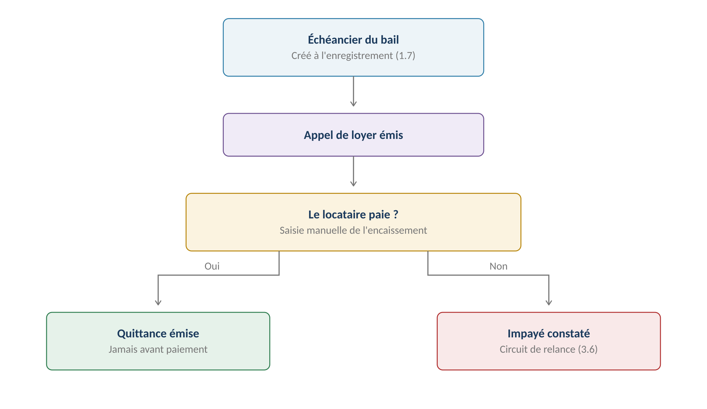
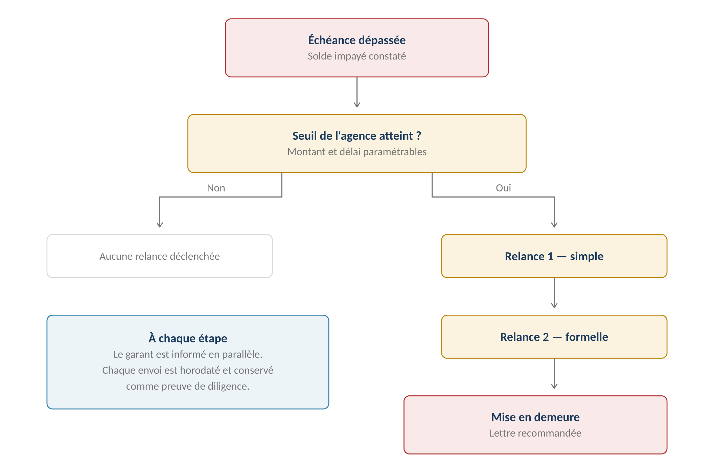
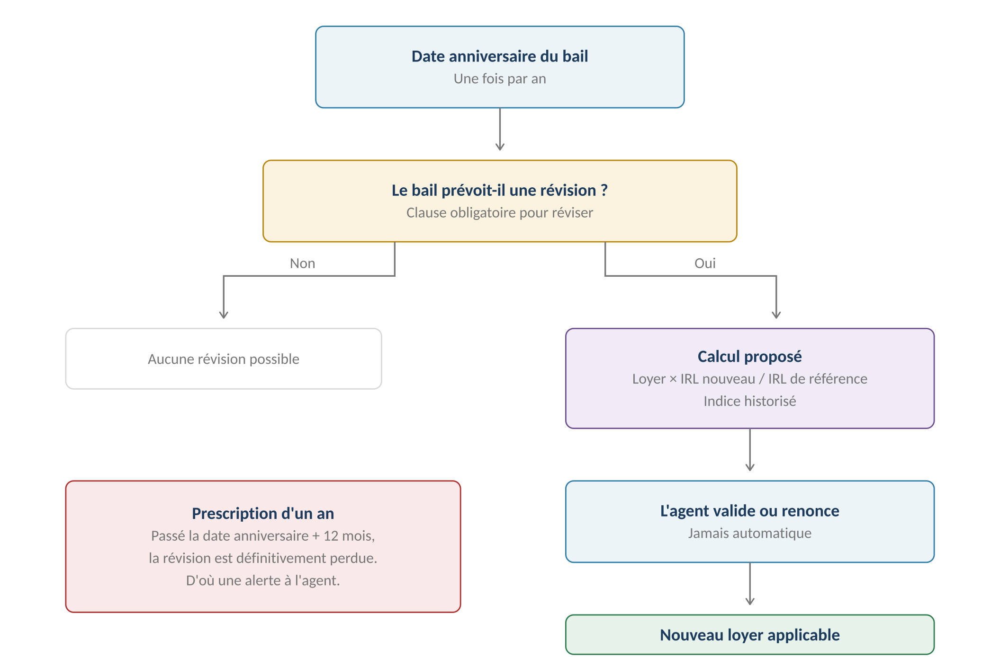
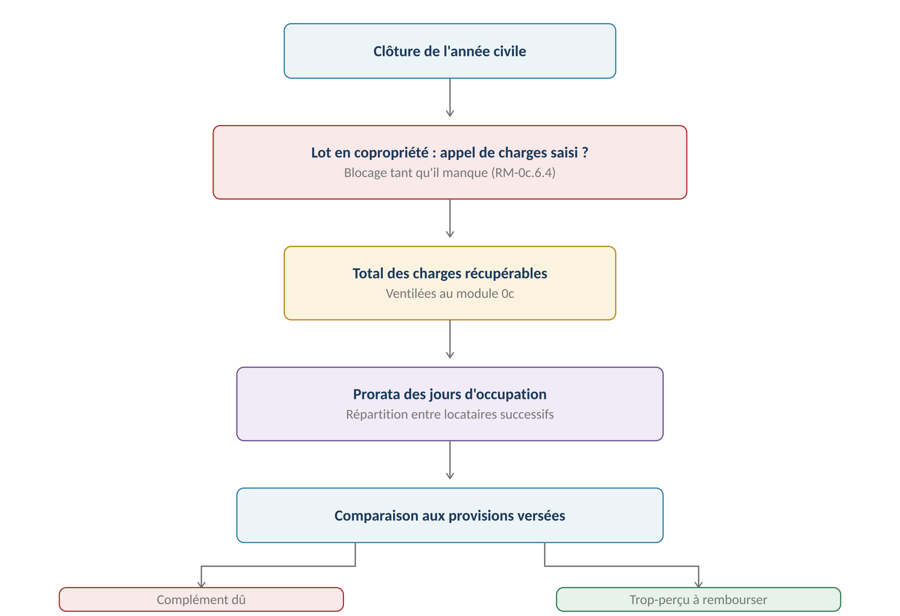

**GERIMMO V3**

Référentiel des parcours clients

**MODULE 3**

**Loyers et charges**

|               |                                                     |
|:--------------|:----------------------------------------------------|
| **Périmètre** | 12 parcours · 5 objets métier                       |
| **Dépend de** | **Module 1 (échéancier) · Module 0c (ventilation)** |
| **Alimente**  | Comptabilité (4.2) · Rapport propriétaire (6.2)     |
| **Criticité** | **MAXIMALE — module le plus dense en calculs**      |
| **Statut**    | **Module clos — aucune question ouverte**           |

> **Vue d'ensemble du module**

**Le cycle mensuel**

------------------------------------------------------------------------

*Schéma 1 — La quittance n'est jamais émise avant l'encaissement*

> **Pas de synchronisation bancaire — décision actée**
>
> Les encaissements sont saisis manuellement par l'agent.
>
> La quittance atteste d'un paiement reçu : l'émettre avant encaissement reviendrait
>
> à attester d'un fait qui ne s'est pas produit, et priverait l'agence de tout recours.

**Objets créés dans ce module**

------------------------------------------------------------------------

| **Objet** | **Description** | **Rattaché à** |
|:---|:---|:---|
| **Échéancier** | Calendrier des appels à venir | Bail |
| **Appel de loyer** | Créance mensuelle : loyer + provisions | Bail |
| **Encaissement** | Paiement reçu, imputé sur un ou plusieurs appels | Bail |
| **Quittance** | Attestation de paiement, après encaissement | Appel de loyer |
| **Régularisation** | Décompte annuel de charges | Bail + exercice |

**Cartographie des 12 parcours**

------------------------------------------------------------------------

| **\#** | **Parcours** | **Persona** | **V1 / V2** | **Criticité** |
|:---|:---|:---|:---|:---|
| 3.1 | Paramétrage de l'échéancier | AG | **V1** | Haute |
| 3.2 | Émission de l'appel de loyer | Système | **V1** | Haute |
| 3.3 | Enregistrement d'un encaissement | AG | **V1** | Haute |
| 3.4 | Émission de la quittance | Système | **V1** | Haute |
| 3.5 | Encaissement partiel, trop-perçu | AG | **V1** | Moyenne |
| 3.6 | **Impayés et relances** | AG | **V1** | **MAXIMALE** |
| 3.7 | Escalade contentieux | AG | **V2** | Moyenne |
| 3.8 | **Révision annuelle IRL** | AG | **V1** | **MAXIMALE** |
| 3.9 | **Régularisation des charges** | AG | **V1** | **MAXIMALE** |
| 3.10 | Ajustement de la provision | AG | **V1** | Moyenne |
| 3.11 | Solde de tout compte | AG | **V1** | Haute |
| 3.12 | Consultation par le locataire | LO | **V1** | Faible |

> **3.1 à 3.5 — Le cycle mensuel**

**3.1 — Paramétrage de l'échéancier**

------------------------------------------------------------------------

|                 |                                               |
|:----------------|:----------------------------------------------|
| **Persona**     | AG — Agent immobilier                         |
| **Déclencheur** | Enregistrement du bail signé (1.7)            |
| **Fréquence**   | Une fois par bail                             |
| **Criticité**   | Haute                                         |
| **Aboutit à**   | Un calendrier d'appels jusqu'au terme du bail |

| **Paramètre**         | **Valeurs**              | **Défaut** |
|:----------------------|:-------------------------|:-----------|
| **Périodicité**       | Mensuelle, trimestrielle | Mensuelle  |
| **Terme**             | À échoir, à terme échu   | À échoir   |
| **Jour d'émission**   | 1 à 28                   | Le 1er     |
| **Jour d'échéance**   | 1 à 28                   | Le 5       |
| **Mode de charges**   | Provision, forfait       | Provision  |
| **Envoi automatique** | Oui, non                 | Oui        |

> **À échoir ou à terme échu**
>
> À échoir : le loyer de mars est appelé début mars, avant occupation. Cas majoritaire.
>
> À terme échu : le loyer de mars est appelé début avril, après occupation.
>
> Ce choix conditionne tout le calendrier et ne se modifie pas en cours de bail.

**3.2 — Émission de l'appel de loyer**

------------------------------------------------------------------------

| **\#** | **Acteur** | **Action** | **Écran / état** |
|:---|:---|:---|:---|
| 1 | **Système** | Au jour d'émission, génère les appels du jour | Tâche planifiée |
| 2 | **Système** | Calcule loyer + provisions de charges | — |
| 3 | **Système** | Applique le prorata si entrée ou sortie dans le mois | — |
| 4 | **Système** | Reporte le solde antérieur s'il en existe | — |
| 5 | **Système** | Produit le document et l'envoie au locataire | Email + espace |
| 6 | AG | Peut consulter le lot des appels émis | Liste |

**3.3 — Enregistrement d'un encaissement**

------------------------------------------------------------------------

| **\#** | **Acteur** | **Action** | **Écran / état** |
|:---|:---|:---|:---|
| 1 | AG | Depuis la fiche bail, clique « Enregistrer un paiement » | Fiche bail |
| 2 | AG | Saisit montant, date et moyen de paiement | Formulaire |
| 3 | **Système** | **Impute sur les appels ouverts, du plus ancien au plus récent** | Proposition |
| 4 | AG | Peut modifier l'imputation | Tableau |
| 5 | **Système** | Solde les appels couverts intégralement | — |
| 6 | **Système** | Déclenche l'émission de la quittance (3.4) | — |

> **L'imputation du plus ancien au plus récent**
>
> Un locataire qui doit deux mois et verse un mois solde d'abord la dette la plus ancienne.
>
> C'est la règle d'imputation légale à défaut de précision du débiteur,
>
> et c'est ce qui permet de suivre l'ancienneté de la dette pour les relances.

**3.4 — Émission de la quittance**

------------------------------------------------------------------------

| **Situation** | **Document émis** | **Motif** |
|:---|:---|:---|
| **Appel soldé intégralement** | **Quittance** | Le paiement est complet |
| **Appel partiellement payé** | **Reçu** | Atteste du versement sans libérer |
| **Aucun paiement** | **Aucun** | Rien à attester |

> **Quittance et reçu ne sont pas la même chose**
>
> La quittance libère le locataire pour la période : elle atteste qu'il ne doit plus rien.
>
> Le reçu constate un versement sans éteindre la dette.
>
> Émettre une quittance sur un paiement partiel reviendrait à renoncer au solde.

**3.5 — Encaissement partiel et trop-perçu**

------------------------------------------------------------------------

| **Cas** | **Traitement** |
|:---|:---|
| **Paiement inférieur à l'appel** | Reçu émis, solde reporté sur l'appel suivant |
| **Paiement supérieur à l'appel** | Excédent imputé sur l'appel suivant |
| **Paiement couvrant plusieurs mois** | Imputation du plus ancien au plus récent |
| **Trop-perçu en fin de bail** | Intégré au solde de tout compte (3.11) |

**Règles métier**

------------------------------------------------------------------------

> **RM-3.1.1** — L'échéancier est créé automatiquement à l'enregistrement du bail signé.
>
> **RM-3.1.2** — Le choix à échoir ou à terme échu ne se modifie pas en cours de bail.
>
> **RM-3.2.1** — L'appel de loyer intègre le loyer et les provisions de charges.
>
> **RM-3.2.2** — Un prorata s'applique aux mois d'entrée et de sortie (RM-1.1.6).
>
> **RM-3.2.3** — Le solde antérieur est reporté sur chaque nouvel appel.
>
> **RM-3.3.1** — Les encaissements sont saisis manuellement, sans synchronisation bancaire.
>
> **RM-3.3.2** — L'imputation se fait du plus ancien au plus récent, modifiable par l'agent.
>
> **RM-3.4.1** — La quittance n'est émise qu'après encaissement intégral de l'appel.
>
> **RM-3.4.2** — Un paiement partiel donne lieu à un reçu, jamais à une quittance.
>
> **RM-3.5.1** — Un excédent est imputé sur l'appel suivant, jamais remboursé spontanément.

**User stories**

------------------------------------------------------------------------

> **US-3.3.1**
>
> *En tant qu'agent immobilier, je veux que le paiement s'impute automatiquement sur la dette la plus ancienne, afin de suivre correctement l'ancienneté de l'impayé.*

- **Étant donné** un locataire devant les loyers de janvier et février, **quand** il verse le montant d'un mois, **alors** le versement solde janvier et février reste dû

> **US-3.4.1**
>
> *En tant qu'agent immobilier, je veux qu'un paiement partiel ne produise qu'un reçu, afin de ne pas renoncer au solde restant.*

- **Étant donné** un appel de 800 € et un versement de 500 €, **quand** j'enregistre le paiement, **alors** un reçu est émis et 300 € restent dus

- **Étant donné** le complément de 300 € versé plus tard, **quand** je l'enregistre, **alors** la quittance du mois est émise

> **3.6 — Impayés et relances**

|                 |                                               |
|:----------------|:----------------------------------------------|
| **Persona**     | AG — Agent immobilier                         |
| **Déclencheur** | Échéance dépassée, solde impayé               |
| **Fréquence**   | Malheureusement régulière                     |
| **Criticité**   | MAXIMALE                                      |
| **Alimente**    | Garanties (2.2) · Purge RGPD suspendue (0b.8) |

**Le circuit**

------------------------------------------------------------------------

*Schéma 2 — Trois niveaux de relance, avec le garant informé en parallèle*

> **Seuil paramétrable par agence — décision actée**
>
> Un locataire devant douze euros d'arrondi ne doit pas recevoir une mise en demeure.
>
> L'agence fixe deux paramètres : un montant plancher et un délai après échéance.
>
> En dessous, aucune relance n'est déclenchée.

**Les paramètres de déclenchement**

------------------------------------------------------------------------

| **Paramètre**                   | **Portée** | **Valeur suggérée**      |
|:--------------------------------|:-----------|:-------------------------|
| **Montant plancher**            | Agence     | 50 €                     |
| **Délai avant relance 1**       | Agence     | 5 jours après échéance   |
| **Délai avant relance 2**       | Agence     | 15 jours après relance 1 |
| **Délai avant mise en demeure** | Agence     | 15 jours après relance 2 |
| **Information du garant**       | Agence     | Dès la relance 2         |

**Parcours nominal**

------------------------------------------------------------------------

| **\#** | **Acteur**  | **Action**                             | **Écran / état**  |
|:-------|:------------|:---------------------------------------|:------------------|
| 1      | **Système** | Détecte les appels échus non soldés    | Tâche quotidienne |
| 2      | **Système** | Compare au seuil de l'agence           | —                 |
| 3      | **Système** | Crée une alerte à l'agent              | Tableau de bord   |
| 4      | AG          | Génère la relance depuis le modèle     | PDF               |
| 5      | AG          | Envoie au locataire                    | Email ou courrier |
| 6      | **Système** | **Horodate et conserve l'envoi**       | Historique        |
| 7      | **Système** | Informe le garant selon le paramétrage | —                 |
| 8      | **Système** | Programme l'étape suivante             | Alerte différée   |

> **La trace des relances est ce qui fonde le recours**
>
> Pour actionner la garantie, saisir le tribunal ou invoquer la clause résolutoire,
>
> le bailleur doit prouver ses diligences.
>
> Chaque relance est donc horodatée, son destinataire conservé, et son contenu figé.
>
> Même logique que les relances du module 0c et les alertes d'assurance du 0b.

**Variantes**

------------------------------------------------------------------------

| **Code** | **Situation** | **Comportement** |
|:---|:---|:---|
| **V1** | Paiement pendant le circuit | Les relances programmées sont annulées. |
| **V2** | Paiement partiel | Le circuit se poursuit sur le solde restant. |
| **V3** | **Plan d'apurement convenu** | Les relances sont suspendues tant que l'échéancier est respecté. |
| **V4** | Garantie GLI active | La déclaration de sinistre reste hors application (2.3). |
| **V5** | **Trêve hivernale** | Aucune expulsion possible. Les relances continuent. |
| **V6** | Colocation solidaire | La relance vise tous les colocataires (RM-1.3.2). |

**Cas d'erreur**

------------------------------------------------------------------------

| **Cas** | **Comportement attendu** |
|:---|:---|
| Impayé sous le seuil | Aucune relance, mais le solde reste visible |
| Relance sur un bail terminé | Autorisé : la dette survit au bail |
| Garant sans coordonnées | La relance au locataire part, celle au garant échoue avec alerte |
| Mise en demeure sans relances préalables | **Alerte : le formalisme sera contesté** |

**Règles métier**

------------------------------------------------------------------------

> **RM-3.6.1** — Le seuil de déclenchement est paramétré par agence : montant et délai.
>
> **RM-3.6.2** — Aucune relance n'est déclenchée sous le montant plancher.
>
> **RM-3.6.3** — Chaque relance est horodatée et conservée comme preuve de diligence.
>
> **RM-3.6.4** — Le garant est informé selon le paramétrage de l'agence.
>
> **RM-3.6.5** — Un paiement intégral annule les relances programmées.
>
> **RM-3.6.6** — Un plan d'apurement suspend les relances tant qu'il est respecté.
>
> **RM-3.6.7** — Un impayé en cours suspend la purge RGPD du locataire (RM-0b.8.3).
>
> **RM-3.6.8** — La dette survit au bail : les relances restent possibles après son terme.

**User stories**

------------------------------------------------------------------------

> **US-3.6.1**
>
> *En tant qu'admin agence, je veux paramétrer un montant plancher, afin de ne pas relancer pour quelques euros.*

- **Étant donné** un plancher fixé à 50 €, **quand** un locataire doit 12 €, **alors** aucune relance n'est déclenchée et le solde reste visible

> **US-3.6.2**
>
> *En tant qu'agent immobilier, je veux retrouver l'historique des relances, afin de prouver mes diligences si le dossier part au contentieux.*

- **Étant donné** trois relances envoyées sur six mois, **quand** j'ouvre l'historique de l'impayé, **alors** chaque envoi apparaît avec sa date, son destinataire et son contenu

> **US-3.6.3**
>
> *En tant qu'agent immobilier, je veux suspendre les relances pendant un plan d'apurement, afin de ne pas relancer un locataire qui respecte son engagement.*

- **Étant donné** un plan d'apurement enregistré, **quand** les échéances sont respectées, **alors** aucune relance automatique ne part

- **Étant donné** une échéance du plan non honorée, **quand** le délai est dépassé, **alors** le circuit de relance reprend

> **3.8 — Révision annuelle IRL**

|                 |                                              |
|:----------------|:---------------------------------------------|
| **Persona**     | AA (indice) · AG (révision)                  |
| **Déclencheur** | Date anniversaire du bail                    |
| **Fréquence**   | Annuelle par bail                            |
| **Criticité**   | MAXIMALE — la révision se prescrit par un an |
| **Prérequis**   | Clause de révision au bail                   |

**Le mécanisme**

------------------------------------------------------------------------

*Schéma 3 — Proposition calculée, validation par l'agent, prescription à un an*

> **Saisie manuelle de l'indice en V1 — décision actée**
>
> L'INSEE publie l'IRL une fois par trimestre : quatre saisies par an pour l'agence.
>
> Une récupération automatique introduirait une dépendance externe sur une donnée
>
> à valeur juridique. La saisie manuelle oblige à vérifier, ce qui vaut mieux.
>
> La récupération automatique est envisagée en V2.

**Le calcul**

------------------------------------------------------------------------

| **Élément** | **Source** |
|:---|:---|
| **Loyer actuel hors charges** | Bail ou dernière révision |
| **IRL de référence** | Indice figé au bail à sa signature |
| **IRL du trimestre de révision** | **Saisi par l'admin agence, historisé** |
| **Formule** | **Nouveau loyer = loyer × IRL nouveau / IRL de référence** |

**Exemple chiffré**

------------------------------------------------------------------------

| **Donnée**                   | **Valeur**                |
|:-----------------------------|:--------------------------|
| Loyer hors charges actuel    | 750,00 €                  |
| IRL de référence (bail)      | 145,17                    |
| IRL du trimestre de révision | 148,03                    |
| **Nouveau loyer**            | **764,78 €**              |
| **Augmentation**             | **14,78 € — soit 1,97 %** |

> **La prescription d'un an**
>
> La révision doit être demandée dans l'année qui suit la date anniversaire.
>
> Passé ce délai, elle est définitivement perdue pour cette échéance —
>
> le bailleur ne peut pas la réclamer rétroactivement.
>
> D'où une alerte à l'agent bien avant l'expiration du délai.

**Parcours nominal**

------------------------------------------------------------------------

| **\#** | **Acteur** | **Action** | **Écran / état** |
|:---|:---|:---|:---|
| 1 | AA | Saisit le nouvel indice IRL publié | Module 18 |
| 2 | **Système** | Historise l'indice avec son trimestre | — |
| 3 | **Système** | Détecte les baux dont la date anniversaire approche | Tâche quotidienne |
| 4 | **Système** | Vérifie la présence d'une clause de révision | Blocage si absente |
| 5 | **Système** | Calcule le nouveau loyer et alerte l'agent | Proposition |
| 6 | AG | Vérifie le calcul | Aperçu |
| 7 | AG | **Valide ou renonce** | Décision explicite |
| 8 | **Système** | Applique le nouveau loyer aux appels suivants | — |
| 9 | **Système** | Notifie le locataire du nouveau montant | Courrier |
| 10 | **Système** | Conserve l'indice utilisé sur la révision | Historique |

**Variantes**

------------------------------------------------------------------------

| **Code** | **Situation** | **Comportement** |
|:---|:---|:---|
| **V1** | Renonciation du bailleur | L'agent renonce. La révision est tracée comme abandonnée. |
| **V2** | Absence de clause de révision | Aucune révision possible. Alerte informative. |
| **V3** | IRL en baisse | Le loyer baisse. Rare mais légalement dû. |
| **V4** | **Révision non demandée dans l'année** | Perdue définitivement. Alerte forte avant expiration. |
| **V5** | Logement classé F ou G | Révision interdite depuis août 2022. Blocage. |

**Cas d'erreur**

------------------------------------------------------------------------

| **Cas** | **Comportement attendu** |
|:---|:---|
| Indice du trimestre non saisi | **BLOCAGE — l'admin agence doit le renseigner** |
| Passoire thermique (DPE F ou G) | **BLOCAGE — révision légalement interdite** |
| Date anniversaire dépassée de plus d'un an | **BLOCAGE — révision prescrite** |
| Aucune clause de révision au bail | Alerte informative, aucune proposition |

**Règles métier**

------------------------------------------------------------------------

> **RM-3.8.1** — La révision suppose une clause expresse au bail.
>
> **RM-3.8.2** — L'indice de référence est celui figé au bail à sa signature.
>
> **RM-3.8.3** — Les indices IRL sont saisis par l'admin agence et historisés.
>
> **RM-3.8.4** — La révision est proposée, jamais appliquée sans validation de l'agent.
>
> **RM-3.8.5** — Une révision non demandée dans l'année est définitivement perdue.
>
> **RM-3.8.6** — Un logement classé F ou G au DPE ne peut faire l'objet d'aucune révision.
>
> **RM-3.8.7** — Chaque révision conserve l'indice utilisé pour être recalculable.
>
> **RM-3.8.8** — La révision ne modifie ni le dépôt de garantie ni les provisions de charges.

**User stories**

------------------------------------------------------------------------

> **US-3.8.1**
>
> *En tant qu'agent immobilier, je veux valider la révision plutôt qu'elle s'applique seule, afin de pouvoir y renoncer si le propriétaire le souhaite.*

- **Étant donné** une date anniversaire atteinte et un indice disponible, **quand** l'alerte se déclenche, **alors** le nouveau loyer m'est proposé sans être appliqué

- **Étant donné** cette proposition, **quand** je renonce, **alors** le loyer reste inchangé et la renonciation est tracée

> **US-3.8.2**
>
> *En tant qu'agent immobilier, je veux être alerté avant la prescription, afin de ne pas perdre une révision par oubli.*

- **Étant donné** une révision non traitée depuis dix mois, **quand** l'échéance approche, **alors** une alerte forte me signale les deux mois restants

> **US-3.8.3**
>
> *En tant qu'agent immobilier, je veux être bloqué sur une passoire thermique, afin de ne pas appliquer une révision illégale.*

- **Étant donné** un logement classé G au DPE, **quand** la date anniversaire arrive, **alors** aucune révision n'est proposée et le motif m'est indiqué

> **3.9 & 3.10 — Régularisation des charges**

|                 |                                                     |
|:----------------|:----------------------------------------------------|
| **Persona**     | AG — Agent immobilier                               |
| **Déclencheur** | Clôture de l'année civile                           |
| **Fréquence**   | Annuelle par bail                                   |
| **Criticité**   | MAXIMALE                                            |
| **Prérequis**   | **Appel de charges du syndic saisi si copropriété** |

**Le mécanisme**

------------------------------------------------------------------------

*Schéma 4 — Le prorata d'occupation s'applique à des charges qui portent sur l'année entière*

> **Année civile et prorata — décisions actées**
>
> La régularisation porte sur l'année civile, du 1er janvier au 31 décembre.
>
> Un locataire entré le 1er mars ne supporte que 306 jours sur 365.
>
> Si le lot a changé de mains dans l'année, les charges se répartissent
>
> entre les locataires successifs au prorata de leurs jours d'occupation.

**Exemple chiffré**

------------------------------------------------------------------------

| **Donnée**                          | **Valeur**                   |
|:------------------------------------|:-----------------------------|
| Charges récupérables de l'exercice  | 1 200,00 €                   |
| Période d'occupation                | Du 1er mars au 31 décembre   |
| Jours occupés sur 365               | 306                          |
| **Quote-part du locataire**         | **1 006,03 €**               |
| Provisions versées (85 € × 10 mois) | 850,00 €                     |
| **Solde**                           | **156,03 € — complément dû** |

**Parcours nominal**

------------------------------------------------------------------------

| **\#** | **Acteur** | **Action** | **Écran / état** |
|:---|:---|:---|:---|
| 1 | **Système** | À la clôture de l'exercice, alerte l'agent | Tableau de bord |
| 2 | **Système** | **Vérifie l'appel de charges syndic si copropriété** | BLOCAGE si absent |
| 3 | **Système** | Totalise les charges récupérables de l'exercice | — |
| 4 | **Système** | Applique le prorata des jours d'occupation | — |
| 5 | **Système** | Compare aux provisions encaissées | — |
| 6 | AG | Vérifie le décompte poste par poste | Tableau |
| 7 | AG | **Joint les justificatifs** | Obligatoire |
| 8 | AG | Valide et génère le décompte | PDF |
| 9 | **Système** | Émet un appel complémentaire ou un avoir | — |
| 10 | **Système** | Propose l'ajustement de la provision (3.10) | — |

> **Le justificatif est obligatoire — décision du 22 juillet**
>
> Le locataire peut exiger la communication des pièces justificatives
>
> pendant les six mois suivant l'envoi du décompte.
>
> Sans justificatif joint, la régularisation est contestable et le complément
>
> difficilement recouvrable.

**3.10 — Ajustement de la provision**

------------------------------------------------------------------------

| **Situation**               | **Ajustement proposé**                 |
|:----------------------------|:---------------------------------------|
| **Complément important dû** | Augmentation de la provision mensuelle |
| **Trop-perçu important**    | Diminution de la provision mensuelle   |
| **Écart faible**            | Aucun ajustement proposé               |
| **Charges au forfait**      | Sans objet — aucune régularisation     |

> **L'ajustement n'est pas automatique**
>
> La provision se rapproche des charges réelles constatées, mais l'agent valide.
>
> Une augmentation brutale de provision est mal reçue par le locataire :
>
> l'agent peut choisir de l'étaler ou de l'accompagner d'une explication.

**Variantes**

------------------------------------------------------------------------

| **Code** | **Situation** | **Comportement** |
|:---|:---|:---|
| **V1** | Charges au forfait | Aucune régularisation. Le forfait est définitif. |
| **V2** | **Lot en copropriété** | Bloquée tant que l'appel du syndic n'est pas saisi (RM-0c.6.4). |
| **V3** | **Changement de locataire dans l'année** | Les charges se répartissent au prorata entre les occupants successifs. |
| **V4** | Locataire parti | La régularisation s'intègre au solde de tout compte (3.11). |
| **V5** | Contestation du locataire | Les pièces sont communicables pendant six mois. |
| **V6** | Régularisation rectificative | Un nouveau décompte remplace le précédent, sans le supprimer. |

**Cas d'erreur**

------------------------------------------------------------------------

| **Cas** | **Comportement attendu** |
|:---|:---|
| Appel de charges syndic manquant | **BLOCAGE — renvoi au parcours 0c.6** |
| Aucun justificatif joint | **BLOCAGE — pièces obligatoires** |
| Provisions non encaissées | Le décompte se fait sur les provisions appelées, l'impayé reste dû |
| Régularisation déjà émise | **BLOCAGE — passer par une rectificative** |

**Règles métier**

------------------------------------------------------------------------

> **RM-3.9.1** — La régularisation porte sur l'année civile.
>
> **RM-3.9.2** — Elle est bloquée sans appel de charges du syndic si le lot est en copropriété.
>
> **RM-3.9.3** — La quote-part se calcule au prorata des jours d'occupation.
>
> **RM-3.9.4** — Les charges se répartissent entre locataires successifs d'un même exercice.
>
> **RM-3.9.5** — Les justificatifs sont obligatoires à la validation.
>
> **RM-3.9.6** — Les pièces restent communicables au locataire pendant six mois.
>
> **RM-3.9.7** — Une régularisation émise se corrige par une rectificative, jamais par modification.
>
> **RM-3.9.8** — Les charges au forfait ne donnent lieu à aucune régularisation.
>
> **RM-3.10.1** — L'ajustement de provision est proposé, jamais appliqué sans validation.

**User stories**

------------------------------------------------------------------------

> **US-3.9.1**
>
> *En tant qu'agent immobilier, je veux que la quote-part se calcule au prorata, afin de ne facturer au locataire que sa période d'occupation.*

- **Étant donné** un locataire entré le 1er mars et des charges annuelles de 1 200 €, **quand** je lance la régularisation, **alors** sa quote-part proposée est de 1 006,03 € pour 306 jours

- **Étant donné** un lot ayant changé de locataire en cours d'année, **quand** je régularise, **alors** les charges se répartissent entre les deux occupants au prorata

> **US-3.9.2**
>
> *En tant qu'agent immobilier, je veux être bloqué sans justificatifs, afin de produire un décompte défendable.*

- **Étant donné** une régularisation sans pièce jointe, **quand** je tente de valider, **alors** la validation est refusée

> **US-3.9.3**
>
> *En tant qu'agent immobilier, je veux être bloqué sans l'appel du syndic, afin de ne pas envoyer une régularisation incomplète.*

- **Étant donné** un lot en copropriété sans appel de charges saisi, **quand** je lance la régularisation, **alors** l'action est bloquée avec un lien vers la saisie de l'appel

> **3.11 & 3.12 — Solde de tout compte et consultation**

**3.11 — Solde de tout compte**

------------------------------------------------------------------------

|                      |                                                     |
|:---------------------|:----------------------------------------------------|
| **Persona**          | AG — Agent immobilier                               |
| **Déclencheur**      | Fin de bail, après état des lieux de sortie         |
| **Fréquence**        | À chaque fin de bail                                |
| **Criticité**        | Haute                                               |
| **Décision révisée** | **Émis dans les deux cas — restitution ou créance** |

**Ce que le document regroupe**

------------------------------------------------------------------------

| **Rubrique**                  | **Origine**          | **Sens**            |
|:------------------------------|:---------------------|:--------------------|
| **Dernier loyer et prorata**  | Échéancier (3.2)     | Dû par le locataire |
| **Impayés antérieurs**        | Solde du bail (3.6)  | Dû par le locataire |
| **Régularisation de charges** | Régularisation (3.9) | Dans les deux sens  |
| **Dépôt de garantie**         | Garanties (2.1)      | Dû au locataire     |
| **Retenues pour dégradation** | Restitution (2.4)    | Dû par le locataire |
| **Trop-perçu éventuel**       | Encaissements (3.5)  | Dû au locataire     |

> **Un document dans les deux cas — décision révisée**
>
> Le décompte est émis que le solde soit en faveur du locataire ou non.
>
> Dans les deux cas, il a besoin de comprendre le calcul : pourquoi
>
> on lui restitue 450 €, ou pourquoi il doit encore 340 €.
>
> Seuls l'intitulé et la suite changent : restitution d'un côté,
>
> mise en recouvrement de l'autre par le circuit des impayés (3.6).

**Parcours nominal**

------------------------------------------------------------------------

| **\#** | **Acteur** | **Action** | **Écran / état** |
|:---|:---|:---|:---|
| 1 | **Système** | Après l'EDL de sortie, agrège toutes les lignes | — |
| 2 | **Système** | Calcule le solde net | Aperçu |
| 3 | AG | Vérifie chaque ligne | Tableau |
| 4 | **Système** | **Génère le décompte dans tous les cas** | PDF |
| 5 | **Système** | Si solde positif : intitulé « restitution » | — |
| 6 | **Système** | Si solde négatif : intitulé « décompte de sortie » | — |
| 7 | AG | Envoie le document | — |
| 8 | **Système** | Si créance : bascule vers le circuit impayé (3.6) | — |

**3.12 — Consultation par le locataire**

------------------------------------------------------------------------

| **Information**           | **Visible** | **Remarque**                 |
|:--------------------------|:------------|:-----------------------------|
| **Échéancier à venir**    | **Oui**     | Appels des mois suivants     |
| **Quittances**            | **Oui**     | Toutes, téléchargeables      |
| **Reçus**                 | **Oui**     | Paiements partiels           |
| **Solde en cours**        | **Oui**     | Ce qu'il doit ou a en avance |
| **Régularisations**       | **Oui**     | Avec les justificatifs       |
| **Relances envoyées**     | **Oui**     | Il les a déjà reçues         |
| **Commentaires internes** | **Non**     | Notes de l'agence            |

**Règles métier**

------------------------------------------------------------------------

> **RM-3.11.1** — Le solde de tout compte regroupe toutes les créances réciproques.
>
> **RM-3.11.2** — Il est émis quel que soit le sens du solde.
>
> **RM-3.11.3** — Un solde en défaveur bascule vers le circuit des impayés, après émission du décompte.
>
> **RM-3.11.5** — L'intitulé du document reflète le sens du solde.
>
> **RM-3.11.4** — Il ne peut être établi avant l'état des lieux de sortie.
>
> **RM-3.12.1** — Le locataire accède à ses quittances et reçus sans limite de durée.
>
> **RM-3.12.2** — Les commentaires internes de l'agence ne lui sont jamais visibles.

**User story**

------------------------------------------------------------------------

> **US-3.11.1**
>
> *En tant qu'agent immobilier, je veux un document unique en cas de restitution, afin que le locataire comprenne le calcul sans recouper plusieurs courriers.*

- **Étant donné** un dépôt de 700 €, une retenue de 200 € et une régularisation de 50 € due, **quand** je génère le solde de tout compte, **alors** un seul document présente les trois lignes et un solde de 450 € à restituer

- **Étant donné** des retenues supérieures au dépôt, **quand** je clôture le bail, **alors** un décompte de sortie est émis et la créance passe en impayé

> **Synthèse du module**

**Les règles métier les plus structurantes**

------------------------------------------------------------------------

| **Code**      | **Règle**                                       | **Bloquant** |
|:--------------|:------------------------------------------------|:-------------|
| **RM-3.3.2**  | Imputation du plus ancien au plus récent        | Structurel   |
| **RM-3.4.1**  | **Quittance émise après encaissement intégral** | **Oui**      |
| **RM-3.4.2**  | Paiement partiel : reçu, jamais quittance       | **Oui**      |
| **RM-3.6.1**  | Seuil de relance paramétré par agence           | Structurel   |
| **RM-3.6.3**  | Chaque relance horodatée comme preuve           | Structurel   |
| **RM-3.6.7**  | Un impayé suspend la purge RGPD                 | Structurel   |
| **RM-3.8.3**  | Indices IRL saisis et historisés                | Structurel   |
| **RM-3.8.4**  | Révision proposée, jamais appliquée seule       | Structurel   |
| **RM-3.8.5**  | **Révision perdue après un an**                 | **Oui**      |
| **RM-3.8.6**  | Aucune révision sur un DPE F ou G               | **Oui**      |
| **RM-3.9.2**  | **Régularisation bloquée sans appel syndic**    | **Oui**      |
| **RM-3.9.3**  | Quote-part au prorata des jours d'occupation    | Structurel   |
| **RM-3.9.5**  | Justificatifs obligatoires à la validation      | **Oui**      |
| **RM-3.11.2** | **Décompte émis dans les deux sens**            | Structurel   |

**Décompte des user stories**

------------------------------------------------------------------------

| **Parcours**                | **User stories** | **Critères d'acceptation** |
|:----------------------------|:-----------------|:---------------------------|
| 3.1 à 3.5 — Cycle mensuel   | 2                | 3                          |
| **3.6 — Impayés**           | **3**            | **5**                      |
| **3.8 — Révision IRL**      | **3**            | **5**                      |
| **3.9 — Régularisation**    | **3**            | **5**                      |
| 3.11 — Solde de tout compte | 1                | 2                          |
| **TOTAL**                   | **12**           | **20**                     |

**Décisions actées sur ce module**

------------------------------------------------------------------------

| **Décision**                                   | **Statut**           |
|:-----------------------------------------------|:---------------------|
| Quittance après encaissement, jamais avant     | **Acté**             |
| Indice IRL saisi manuellement, historisé       | **Acté**             |
| Révision proposée puis validée                 | **Acté**             |
| Seuil de relance paramétré par agence          | **Acté**             |
| Régularisation sur année civile                | **Acté**             |
| Prorata des jours d'occupation                 | **Acté**             |
| Répartition entre locataires successifs        | **Acté**             |
| **Décompte de sortie émis dans les deux sens** | **Décision révisée** |
| Récupération automatique de l'IRL              | **V2**               |
| Escalade contentieux structurée                | **V2**               |
| Synchronisation bancaire                       | **Hors périmètre**   |
| Procédure judiciaire                           | **Hors périmètre**   |

**Ce que ce module impose ailleurs**

------------------------------------------------------------------------

| **Module** | **Conséquence** |
|:---|:---|
| **Module 4 — Comptabilité** | Chaque encaissement produit une écriture |
| **Module 6 — Rapport** | Loyers perçus et impayés alimentent le rapport mensuel |
| **Module 14 — Alertes** | **Impayés, révision IRL, prescription, régularisation** |
| **Module 18 — Admin** | **Indices IRL et seuils de relance se paramètrent ici** |

**Prochaine étape**

------------------------------------------------------------------------

> **Module 4 — Comptabilité**
>
> Huit parcours : saisie des dépenses, rapprochement, suivi de gérance,
>
> clôture mensuelle et plan de catégories.
>
> C'est le module qui consolide tout ce qui précède avant le rapport propriétaire.
