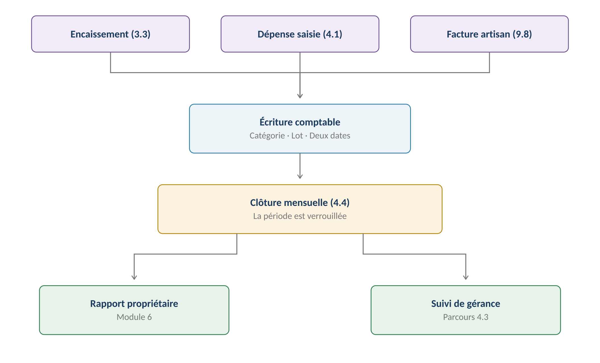
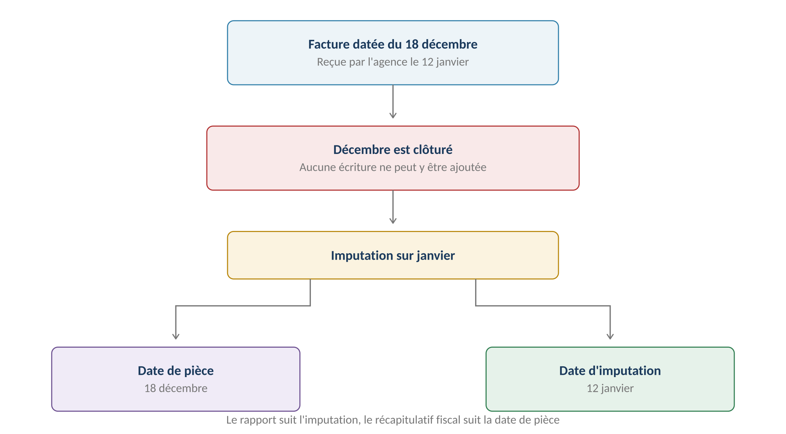
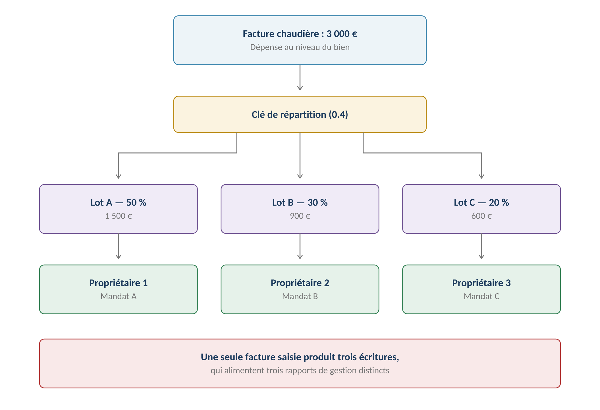
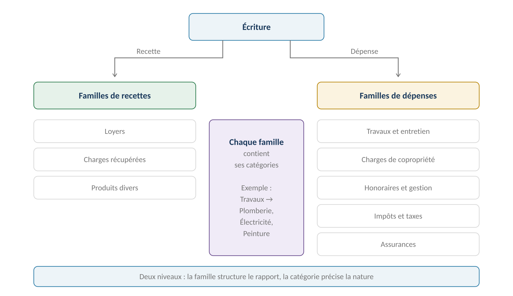

**GERIMMO V3**

Référentiel des parcours clients

**MODULE 4**

**Comptabilité**

|  |  |
|:---|:---|
| **Périmètre** | 8 parcours · 3 objets métier |
| **Dépend de** | Modules 0 à 3 — tous les flux convergent ici |
| **Alimente** | **Rapport propriétaire (6.2) · Récapitulatif fiscal (6.4)** |
| **Nature** | Comptabilité déclarative — pas de compta de gérance réglementée |
| **Statut** | **Module clos — aucune question ouverte** |

> **Vue d'ensemble du module**
>
> **Comptabilité déclarative — positionnement assumé**
>
> Recettes et dépenses catégorisées, rattachées à un lot et à un mandat.
>
> Pas de comptabilité de gérance réglementée, pas de comptes mandants,
>
> pas de séquestre, pas de synchronisation bancaire.
>
> L'objectif est de produire un rapport propriétaire juste et un récapitulatif fiscal
>
> exploitable, pas de tenir une comptabilité au sens du plan comptable général.
>
> **Ce que Gerimmo ne remplace pas — à dire clairement**
>
> Une agence titulaire d'une carte de gestion immobilière a des obligations
>
> comptables propres : comptes mandants séparés, séquestre, articulation
>
> avec les exigences de la loi Hoguet.
>
> Gerimmo ne les couvre pas et ne prétend pas les couvrir.
>
> Le risque n'est pas de faire du déclaratif — c'est de laisser croire
>
> qu'on fait autre chose. Une agence qui le découvre à l'usage
>
> se sentira trompée.

**La formulation commerciale retenue**

------------------------------------------------------------------------

| **Ce que Gerimmo fait** | **Ce qu'il ne fait pas** |
|:---|:---|
| **Produit votre suivi de gestion** | **Ne tient pas votre comptabilité de gérance** |
| **Génère les rapports propriétaires** | **Ne gère pas de comptes mandants** |
| **Prépare le récapitulatif fiscal** | **Ne remplace pas votre expert-comptable** |
| **Trace honoraires et versements** | **N'assure aucun séquestre** |

> **Où cette mention doit apparaître**
>
> Dans la documentation commerciale, dans les conditions d'utilisation,
>
> et à l'écran lors du paramétrage initial de l'agence.
>
> Une agence doit savoir ce qu'elle achète avant de l'utiliser.

**Les flux qui convergent ici**

------------------------------------------------------------------------

*Schéma 1 — Trois sources alimentent l'écriture, qui se fige à la clôture*

**Objets créés dans ce module**

------------------------------------------------------------------------

| **Objet** | **Description** | **Rattaché à** |
|:---|:---|:---|
| **Écriture** | Recette ou dépense, catégorisée et datée deux fois | Lot + Mandat |
| **Catégorie** | Nature de l'écriture, dans une famille | Agence |
| **Période comptable** | Mois, ouvert ou clôturé | Agence |

**Cartographie des 8 parcours**

------------------------------------------------------------------------

| **\#** | **Parcours** | **Persona** | **V1 / V2** | **Criticité** |
|:---|:---|:---|:---|:---|
| 4.1 | Saisie d'une dépense catégorisée | AG | **V1** | Haute |
| 4.2 | Rapprochement recette ↔ appel | AG | **V1** | Moyenne |
| 4.3 | Suivi de gérance par mandat | AG | **V1** | Haute |
| 4.4 | **Clôture mensuelle** | AG | **V1** | **MAXIMALE** |
| 4.5 | Livre recettes-dépenses | PD | **V1** | Moyenne |
| 4.6 | Consultation et export | AG | **V1** | Moyenne |
| 4.7 | Plan de catégories | AA | **V1** | Haute |
| 4.8 | Récapitulatif annuel de l'agence | AA | **V2** | Moyenne |

> **4.1 — Saisie d'une dépense**

|                 |                                                      |
|:----------------|:-----------------------------------------------------|
| **Persona**     | AG — Agent immobilier                                |
| **Déclencheur** | Facture reçue, dépense engagée sur un bien ou un lot |
| **Fréquence**   | Régulière                                            |
| **Criticité**   | Haute                                                |
| **Alimente**    | Rapport propriétaire (6.2) · Régularisation (3.9)    |

**Les deux dates d'une écriture**

------------------------------------------------------------------------

*Schéma 2 — La date de pièce et la date d'imputation ne coïncident pas toujours*

> **Pourquoi deux dates — décision actée**
>
> La clôture verrouille la période : une facture de décembre reçue en janvier
>
> s'impute sur janvier.
>
> Sans distinction entre date de pièce et date d'imputation, cette facture tomberait
>
> dans l'exercice fiscal suivant et fausserait la déclaration du propriétaire.
>
> Le rapport mensuel suit l'imputation ; le récapitulatif fiscal suit la date de pièce.

**Parcours nominal**

------------------------------------------------------------------------

| **\#** | **Acteur** | **Action** | **Écran / état** |
|:---|:---|:---|:---|
| 1 | AG | Depuis la fiche bien ou lot, clique « Nouvelle dépense » | Fiche |
| 2 | AG | Saisit le montant et la date de la pièce | Formulaire |
| 3 | AG | Choisit la famille puis la catégorie | Sélecteurs liés |
| 4 | AG | **Indique le niveau : bien ou lot** | Sélecteur |
| 5 | **Système** | **Si niveau bien : applique la clé de répartition (0.4)** | Ventilation |
| 6 | AG | Joint la facture | Upload |
| 7 | **Système** | Calcule la date d'imputation selon la période ouverte | — |
| 8 | AG | Valide | — |
| 9 | **Système** | Crée une écriture par lot concerné | — |

**La ventilation multi-propriétaires**

------------------------------------------------------------------------

*Schéma 3 — Une facture au niveau bien produit autant d'écritures que de lots*

> **Conséquence de la propriété au niveau lot**
>
> Depuis la bascule décidée au module 0, un immeuble peut avoir trois propriétaires.
>
> Une facture de chaudière saisie une fois se répartit sur les trois lots via la clé,
>
> puis chaque part rejoint le mandat de son propriétaire.
>
> Trois écritures, trois mandats, trois rapports de gestion — depuis une seule saisie.

**Variantes**

------------------------------------------------------------------------

| **Code** | **Situation** | **Comportement** |
|:---|:---|:---|
| **V1** | Dépense sur un lot précis | Une seule écriture. Cas majoritaire. |
| **V2** | **Dépense au niveau du bien** | Répartie sur les lots via la clé (0.4). |
| **V3** | Charge de copropriété | Ventilée récupérable / non récupérable au module 0c. |
| **V4** | Facture artisan validée | Créée automatiquement depuis le parcours 9.8. |
| **V5** | Dépense sur période clôturée | Imputée sur la période ouverte suivante. |
| **V6** | Avoir ou remboursement | Montant négatif dans la même catégorie. |

**Cas d'erreur**

------------------------------------------------------------------------

| **Cas** | **Comportement attendu** |
|:---|:---|
| Aucune clé de répartition validée | **BLOCAGE — renvoi au parcours 0.4** |
| Catégorie non renseignée | **BLOCAGE — la catégorie structure le rapport** |
| Facture non jointe | Alerte : la dépense sera difficile à justifier au propriétaire |
| Date de pièce postérieure à aujourd'hui | **BLOCAGE à la validation** |
| Lot sans mandat actif | Écriture créée, mais elle n'alimentera aucun rapport |

**Règles métier**

------------------------------------------------------------------------

> **RM-4.0.1** — Gerimmo tient une comptabilité déclarative, jamais une comptabilité de gérance réglementée.
>
> **RM-4.0.2** — Cette limite est annoncée dans la documentation, les conditions d'utilisation et au paramétrage.
>
> **RM-4.1.1** — Toute écriture porte une catégorie, un lot et un mandat.
>
> **RM-4.1.2** — Chaque écriture porte deux dates : date de pièce et date d'imputation.
>
> **RM-4.1.3** — Une dépense au niveau bien se répartit sur les lots via la clé (0.4).
>
> **RM-4.1.4** — Chaque part de répartition produit une écriture distincte.
>
> **RM-4.1.5** — Une écriture sur période clôturée s'impute sur la période ouverte suivante.
>
> **RM-4.1.6** — Le justificatif est recommandé, non bloquant.
>
> **RM-4.1.7** — Une écriture est rattachée au mandat en vigueur à sa date d'imputation.

**User stories**

------------------------------------------------------------------------

> **US-4.1.1**
>
> *En tant qu'agent immobilier, je veux saisir une facture commune une seule fois, afin qu'elle se répartisse automatiquement entre les propriétaires.*

- **Étant donné** un immeuble de trois lots à trois propriétaires différents, **quand** je saisis une facture de 3 000 € au niveau du bien, **alors** trois écritures sont créées : 1 500 €, 900 € et 600 €

- **Étant donné** ces trois écritures, **quand** les rapports mensuels sont générés, **alors** chaque propriétaire ne voit que sa part

> **US-4.1.2**
>
> *En tant qu'agent immobilier, je veux qu'une facture en retard s'impute sur le mois ouvert, afin de ne pas rouvrir une période clôturée.*

- **Étant donné** une facture du 18 décembre reçue le 12 janvier, décembre étant clos, **quand** je la saisis, **alors** elle porte le 18 décembre en date de pièce et janvier en imputation

> **4.2 & 4.3 — Rapprochement et suivi de gérance**

**4.2 — Rapprochement recette ↔ appel de loyer**

------------------------------------------------------------------------

|                 |                                                       |
|:----------------|:------------------------------------------------------|
| **Persona**     | AG — Agent immobilier                                 |
| **Déclencheur** | Encaissement enregistré (3.3)                         |
| **Fréquence**   | À chaque encaissement                                 |
| **Criticité**   | Moyenne                                               |
| **Automatisme** | L'écriture naît de l'encaissement, sans double saisie |

| **\#** | **Acteur** | **Action** | **Écran / état** |
|:---|:---|:---|:---|
| 1 | **Système** | À l'encaissement (3.3), crée l'écriture de recette | — |
| 2 | **Système** | La catégorise selon la nature : loyer ou provision | — |
| 3 | **Système** | **Génère l'écriture d'honoraires de gestion** | — |
| 4 | AG | Peut corriger la catégorisation | Optionnel |

> **Les honoraires sont des écritures — recommandation retenue**
>
> À chaque encaissement de loyer, une écriture d'honoraires est générée automatiquement,
>
> calculée au taux du mandat.
>
> Trois raisons : le rapport doit montrer le brut perçu, les honoraires prélevés
>
> et le net reversé ; les honoraires sont déductibles fiscalement pour le propriétaire ;
>
> et c'est le chiffre d'affaires de l'agence, qu'il faut suivre par mandat.

**Exemple chiffré**

------------------------------------------------------------------------

| **Ligne**                       | **Montant**  | **Sens**             |
|:--------------------------------|:-------------|:---------------------|
| **Loyer encaissé**              | 750,00 €     | Recette propriétaire |
| **Honoraires de gestion — 7 %** | 52,50 €      | Dépense propriétaire |
| **Net reversé**                 | **697,50 €** | Solde                |

**4.3 — Suivi de gérance par mandat**

------------------------------------------------------------------------

|                 |                                       |
|:----------------|:--------------------------------------|
| **Persona**     | AG — Agent immobilier                 |
| **Déclencheur** | Consultation, préparation du rapport  |
| **Fréquence**   | Mensuelle                             |
| **Criticité**   | Haute                                 |
| **Portée**      | Un mandat, tous ses lots, une période |

| **Ce que montre le suivi**        | **Détail**                           |
|:----------------------------------|:-------------------------------------|
| **Recettes de la période**        | Loyers et charges encaissés, par lot |
| **Dépenses de la période**        | Par famille et par catégorie         |
| **Honoraires prélevés**           | Calculés sur les encaissements       |
| **Solde net**                     | **Ce qui revient au propriétaire**   |
| **Impayés en cours**              | Sans les compter dans les recettes   |
| **Comparaison au mois précédent** | Écarts significatifs signalés        |

> **Les impayés ne sont pas des recettes**
>
> Un loyer appelé mais non encaissé ne produit aucune écriture de recette.
>
> Il apparaît dans le suivi comme créance, jamais comme produit.
>
> C'est la différence entre comptabilité d'engagement et comptabilité de caisse —
>
> et Gerimmo tient une comptabilité de caisse.
>
> **Variante — propriétaire en gestion directe (PD)**
>
> Le propriétaire en gestion directe utilise le parcours 4.5, son livre recettes-dépenses.
>
> Différence essentielle : aucun honoraire de gestion, puisqu'il n'y a pas d'agence.
>
> Le net encaissé égale le brut.

**Règles métier**

------------------------------------------------------------------------

> **RM-4.2.1** — L'écriture de recette naît de l'encaissement, sans saisie séparée.
>
> **RM-4.2.2** — Une écriture d'honoraires est générée à chaque encaissement de loyer.
>
> **RM-4.2.3** — Le taux d'honoraires est celui du mandat en vigueur.
>
> **RM-4.2.4** — Les honoraires apparaissent en dépense déductible pour le propriétaire.
>
> **RM-4.3.1** — Le suivi de gérance porte sur un mandat, tous lots confondus.
>
> **RM-4.3.2** — Un loyer appelé mais non encaissé ne produit aucune recette.
>
> **RM-4.3.3** — Les impayés figurent en créance, jamais en produit.

**User story**

------------------------------------------------------------------------

> **US-4.2.1**
>
> *En tant qu'agent immobilier, je veux que les honoraires se calculent automatiquement, afin que le net reversé soit juste sans calcul manuel.*

- **Étant donné** un mandat à 7 % et un loyer de 750 € encaissé, **quand** j'enregistre l'encaissement, **alors** une écriture d'honoraires de 52,50 € est créée et le net ressort à 697,50 €

> **4.4 — Clôture mensuelle**
>
> **La clôture est ce qui rend un rapport fiable**
>
> Un rapport envoyé à un propriétaire doit rester juste. Si des écritures peuvent
>
> être ajoutées ou modifiées après coup sur une période déjà rapportée,
>
> le rapport devient faux sans que personne ne le sache.
>
> La clôture verrouille la période : c'est la contrepartie du rapport figé (module 6).

|                 |                                          |
|:----------------|:-----------------------------------------|
| **Persona**     | AG — Agent immobilier                    |
| **Déclencheur** | Fin de mois, avant génération du rapport |
| **Fréquence**   | Mensuelle                                |
| **Criticité**   | MAXIMALE                                 |
| **Effet**       | Verrouillage définitif de la période     |

**Parcours nominal**

------------------------------------------------------------------------

| **\#** | **Acteur** | **Action** | **Écran / état** |
|:---|:---|:---|:---|
| 1 | **Système** | Alerte à l'approche de la date de rapport du mandat | Tableau de bord |
| 2 | AG | Ouvre l'écran de clôture | Module 4 |
| 3 | **Système** | Liste les points de vigilance de la période | Contrôles |
| 4 | AG | Traite ou accepte chaque point | Cases à cocher |
| 5 | AG | Confirme la clôture | Modale de confirmation |
| 6 | **Système** | **Verrouille la période : plus aucune écriture** | — |
| 7 | **Système** | Débloque la génération du rapport (6.1) | — |

**Les contrôles avant clôture**

------------------------------------------------------------------------

| **Contrôle** | **Nature** | **Effet** |
|:---|:---|:---|
| **Écritures sans justificatif** | Alerte | Signalées, non bloquantes |
| **Encaissements non catégorisés** | Blocage | À traiter avant clôture |
| **Dépenses sans catégorie** | Blocage | À traiter avant clôture |
| **Lots sans mandat actif** | Alerte | Leurs écritures n'alimenteront aucun rapport |
| **Impayés de la période** | Information | Rappel avant envoi au propriétaire |
| **Écarts significatifs** | Alerte | Variation forte par rapport au mois précédent |

**Ce que le verrouillage empêche**

------------------------------------------------------------------------

| **Action** | **Après clôture** |
|:---|:---|
| **Ajouter une écriture sur la période** | **Impossible — imputation au mois suivant** |
| **Modifier une écriture existante** | **Impossible** |
| **Supprimer une écriture** | **Impossible** |
| **Corriger une erreur** | Par écriture inverse sur le mois ouvert |
| **Consulter la période** | Toujours possible |
| **Rouvrir la période** | Admin agence uniquement, avec justification tracée |

> **La correction d'erreur passe par une contre-écriture**
>
> Une écriture fausse sur une période close ne se modifie pas : on passe une écriture
>
> inverse sur le mois ouvert, puis la bonne écriture.
>
> C'est le principe comptable de l'irréversibilité. Il rend la correction visible
>
> plutôt que silencieuse — et le propriétaire comprend ce qui s'est passé.

**Variantes**

------------------------------------------------------------------------

| **Code** | **Situation** | **Comportement** |
|:---|:---|:---|
| **V1** | Clôture normale | Tous contrôles passés, verrouillage immédiat. |
| **V2** | Point bloquant non traité | La clôture est refusée. La liste des points reste affichée. |
| **V3** | **Réouverture exceptionnelle** | Admin agence uniquement, avec motif. Trace conservée. |
| **V4** | Rapport déjà envoyé | Réouverture impossible. Passer par un rectificatif (6.3). |
| **V5** | Clôture rétroactive | Plusieurs mois clos d'un coup, à la reprise d'un retard. |

**Règles métier**

------------------------------------------------------------------------

> **RM-4.4.1** — La clôture verrouille définitivement la période comptable.
>
> **RM-4.4.2** — Aucune écriture ne peut être ajoutée, modifiée ou supprimée après clôture.
>
> **RM-4.4.3** — Une correction se fait par contre-écriture sur la période ouverte.
>
> **RM-4.4.4** — Les écritures non catégorisées bloquent la clôture.
>
> **RM-4.4.5** — Seul l'admin agence peut rouvrir une période, avec motif tracé.
>
> **RM-4.4.6** — Une période dont le rapport est envoyé ne peut plus être rouverte.
>
> **RM-4.4.7** — La clôture conditionne la génération du rapport propriétaire (6.1).

**User stories**

------------------------------------------------------------------------

> **US-4.4.1**
>
> *En tant qu'agent immobilier, je veux être bloqué si des écritures ne sont pas catégorisées, afin de ne pas produire un rapport incomplet.*

- **Étant donné** trois dépenses sans catégorie sur le mois, **quand** je tente de clôturer, **alors** la clôture est refusée et les trois écritures me sont listées

> **US-4.4.2**
>
> *En tant qu'agent immobilier, je veux corriger une erreur par contre-écriture, afin de ne pas altérer un mois déjà rapporté.*

- **Étant donné** une dépense saisie sur le mauvais lot en janvier, mois clos, **quand** je passe la correction, **alors** une écriture inverse et une écriture correcte apparaissent sur février

> **US-4.4.3**
>
> *En tant qu'admin agence, je veux pouvoir rouvrir une période en cas d'erreur grave, afin de ne pas être bloqué avant l'envoi du rapport.*

- **Étant donné** une période close dont le rapport n'est pas encore envoyé, **quand** je la rouvre avec un motif, **alors** la réouverture est tracée avec mon nom, la date et le motif

- **Étant donné** une période dont le rapport est envoyé, **quand** je tente de la rouvrir, **alors** l'action est refusée

> **4.5 à 4.8 — Livre, export et paramétrage**

**4.5 — Livre recettes-dépenses du propriétaire direct**

------------------------------------------------------------------------

|                 |                                      |
|:----------------|:-------------------------------------|
| **Persona**     | PD — Propriétaire en gestion directe |
| **Déclencheur** | Suivi de ses propres biens           |
| **Fréquence**   | Continue                             |
| **Criticité**   | Moyenne                              |
| **Différence**  | Aucun honoraire, aucun mandat        |

| **Aspect**      | **Agence (4.3)**          | **Propriétaire direct (4.5)** |
|:----------------|:--------------------------|:------------------------------|
| **Périmètre**   | Un mandat                 | Ses propres lots              |
| **Honoraires**  | Écriture générée          | Aucun                         |
| **Net reversé** | Brut moins honoraires     | Égal au brut                  |
| **Rapport**     | Envoyé au propriétaire    | Consultation directe          |
| **Clôture**     | Obligatoire avant rapport | Recommandée, non bloquante    |

**4.6 — Consultation et export**

------------------------------------------------------------------------

| **Fonction** | **Détail** |
|:---|:---|
| **Filtres** | Par période, lot, mandat, famille, catégorie |
| **Totaux** | Par famille et par catégorie |
| **Export** | **CSV — décision actée, pas de format FEC** |
| **Contenu de l'export** | Toutes les colonnes, y compris les deux dates |
| **Justificatifs** | Non inclus dans l'export, consultables individuellement |

> **CSV suffit — décision actée**
>
> Le format FEC répond à une obligation des entreprises soumises à un contrôle fiscal.
>
> Un propriétaire bailleur particulier n'y est pas soumis.
>
> Le CSV s'ouvre dans un tableur et se transmet à un expert-comptable sans difficulté.

**4.7 — Plan de catégories**

------------------------------------------------------------------------

*Schéma 4 — Deux niveaux : la famille structure le rapport, la catégorie précise la nature*

|                    |                                             |
|:-------------------|:--------------------------------------------|
| **Persona**        | AA — Admin agence                           |
| **Déclencheur**    | Installation de l'agence, puis ajustements  |
| **Fréquence**      | Rare                                        |
| **Criticité**      | Haute — le plan structure tous les rapports |
| **Décision actée** | Deux niveaux : famille puis catégorie       |

**Plan par défaut — familles de recettes**

------------------------------------------------------------------------

| **Famille**            | **Catégories**                         |
|:-----------------------|:---------------------------------------|
| **Loyers**             | Loyer nu, loyer meublé, loyer parking  |
| **Charges récupérées** | Provisions sur charges, régularisation |
| **Produits divers**    | Indemnités, remboursements, avoirs     |

**Plan par défaut — familles de dépenses**

------------------------------------------------------------------------

| **Famille** | **Catégories** |
|:---|:---|
| **Travaux et entretien** | Plomberie, électricité, peinture, serrurerie, chauffage |
| **Charges de copropriété** | Charges récupérables, non récupérables, fonds travaux |
| **Honoraires et gestion** | **Honoraires de gestion, honoraires de location** |
| **Impôts et taxes** | Taxe foncière, taxe d'ordures ménagères |
| **Assurances** | PNO, GLI |
| **Diagnostics** | DPE, électricité, gaz, amiante, plomb |
| **Frais divers** | Frais bancaires, frais de procédure |

**4.8 — Récapitulatif annuel de l'agence**

------------------------------------------------------------------------

> **Reporté en V2**
>
> Le suivi du chiffre d'affaires de l'agence, consolidé sur tous ses mandats,
>
> est utile mais ne bloque aucun autre parcours.
>
> Les données existent déjà via les écritures d'honoraires : c'est une restitution,
>
> pas une nouvelle collecte.

**Règles métier**

------------------------------------------------------------------------

> **RM-4.5.1** — Le propriétaire direct n'a ni mandat ni honoraires.
>
> **RM-4.5.2** — La clôture lui est recommandée mais non imposée.
>
> **RM-4.6.1** — L'export est au format CSV, colonnes complètes.
>
> **RM-4.6.2** — Les justificatifs ne sont pas inclus dans l'export.
>
> **RM-4.7.1** — Le plan de catégories comporte deux niveaux : famille puis catégorie.
>
> **RM-4.7.2** — Un plan par défaut est fourni à l'installation, modifiable.
>
> **RM-4.7.3** — Une catégorie utilisée par une écriture ne peut être supprimée, seulement désactivée.
>
> **RM-4.7.4** — La catégorie « Honoraires de gestion » est une catégorie système, non supprimable.

**User story**

------------------------------------------------------------------------

> **US-4.7.1**
>
> *En tant qu'admin agence, je veux un plan à deux niveaux, afin que le rapport propriétaire soit lisible sans être simpliste.*

- **Étant donné** une dépense de plomberie, **quand** je la catégorise, **alors** je choisis la famille Travaux puis la catégorie Plomberie

- **Étant donné** un rapport mensuel, **quand** il est généré, **alors** les dépenses sont totalisées par famille, avec le détail par catégorie

> **Synthèse du module**

**Les règles métier les plus structurantes**

------------------------------------------------------------------------

| **Code** | **Règle** | **Bloquant** |
|:---|:---|:---|
| **RM-4.0.1** | **Comptabilité déclarative assumée et annoncée** | Structurel |
| **RM-4.1.1** | Toute écriture porte catégorie, lot et mandat | **Oui** |
| **RM-4.1.2** | **Deux dates : pièce et imputation** | Structurel |
| **RM-4.1.3** | Dépense au niveau bien répartie via la clé | Structurel |
| **RM-4.1.4** | **Une écriture par lot concerné** | Structurel |
| **RM-4.2.2** | Honoraires générés à chaque encaissement | Structurel |
| **RM-4.3.2** | Un loyer non encaissé ne produit aucune recette | Structurel |
| **RM-4.4.1** | **La clôture verrouille définitivement** | **Oui** |
| **RM-4.4.3** | Correction par contre-écriture, jamais par modification | **Oui** |
| **RM-4.4.4** | Écritures non catégorisées bloquent la clôture | **Oui** |
| **RM-4.4.6** | Période rapportée non rouvrable | **Oui** |
| **RM-4.7.1** | Plan à deux niveaux : famille puis catégorie | Structurel |
| **RM-4.7.4** | Catégorie honoraires système, non supprimable | **Oui** |

**Décompte des user stories**

------------------------------------------------------------------------

| **Parcours** | **User stories** | **Critères d'acceptation** |
|:---|:---|:---|
| 4.1 — Saisie d'une dépense | 2 | 3 |
| 4.2 & 4.3 — Rapprochement et gérance | 1 | 1 |
| **4.4 — Clôture mensuelle** | **3** | **4** |
| 4.7 — Plan de catégories | 1 | 2 |
| **TOTAL** | **7** | **10** |

**Décisions actées sur ce module**

------------------------------------------------------------------------

| **Décision**                                     | **Statut**            |
|:-------------------------------------------------|:----------------------|
| **Comptabilité déclarative assumée et annoncée** | **Acté — audit P0.1** |
| Plan de catégories à deux niveaux                | **Acté**              |
| Honoraires traités comme écritures comptables    | **Acté**              |
| Clôture verrouillant la période                  | **Acté**              |
| Facture en retard imputée au mois suivant        | **Acté**              |
| Deux dates par écriture                          | **Acté**              |
| Export CSV                                       | **Acté**              |
| Récapitulatif annuel de l'agence                 | **V2**                |
| Format FEC                                       | **Hors périmètre**    |
| Comptes mandants et séquestre                    | **Hors périmètre**    |
| Synchronisation bancaire                         | **Hors périmètre**    |

**Ce que ce module impose ailleurs**

------------------------------------------------------------------------

| **Module** | **Conséquence** |
|:---|:---|
| **Module 5 — Mandat** | **Le taux d'honoraires se paramètre au mandat** |
| **Module 6 — Rapport** | **La clôture conditionne la génération (RM-4.4.7)** |
| **Module 9 — Devis** | La facture artisan validée crée une écriture |
| **Module 14 — Alertes** | Alerte de clôture avant date de rapport |
| **Module 18 — Admin** | Le plan de catégories se paramètre ici |

**Prochaine étape**

------------------------------------------------------------------------

> **Module 5 — Mandat de gestion**
>
> Six parcours : création multi-biens, ajout et retrait de lots, paramétrage,
>
> renouvellement, résiliation et signature.
>
> C'est le mandat qui porte le taux d'honoraires, la date de rapport
>
> et le seuil de délégation sur devis.
