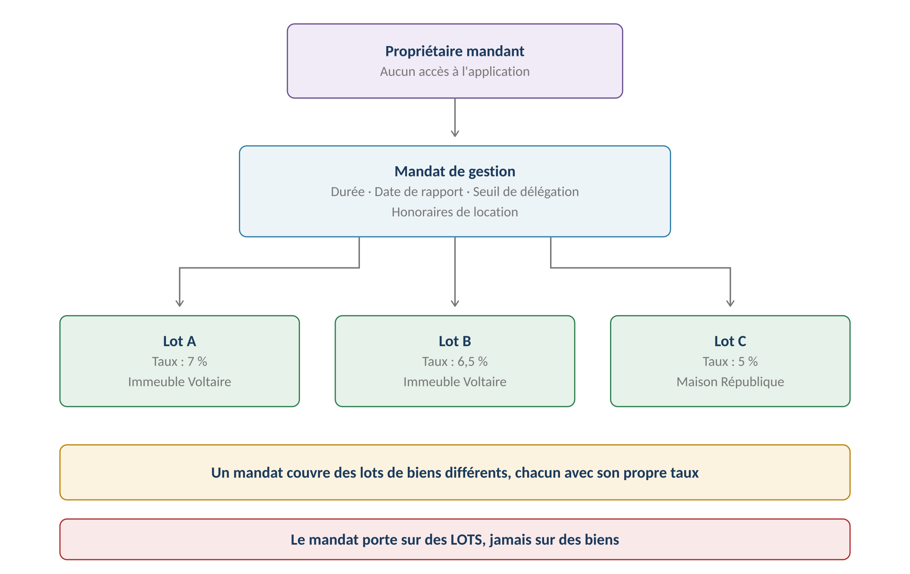
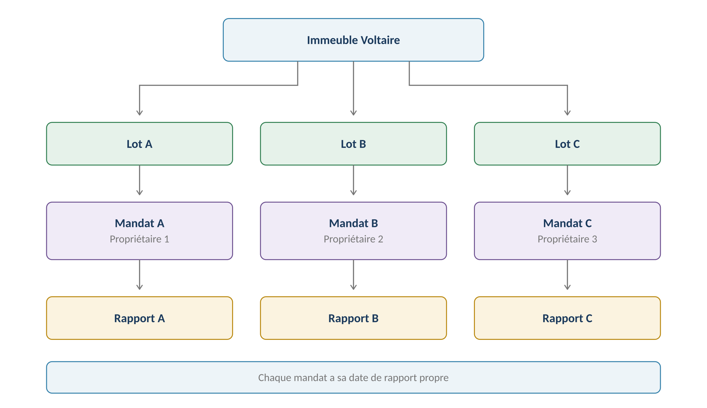
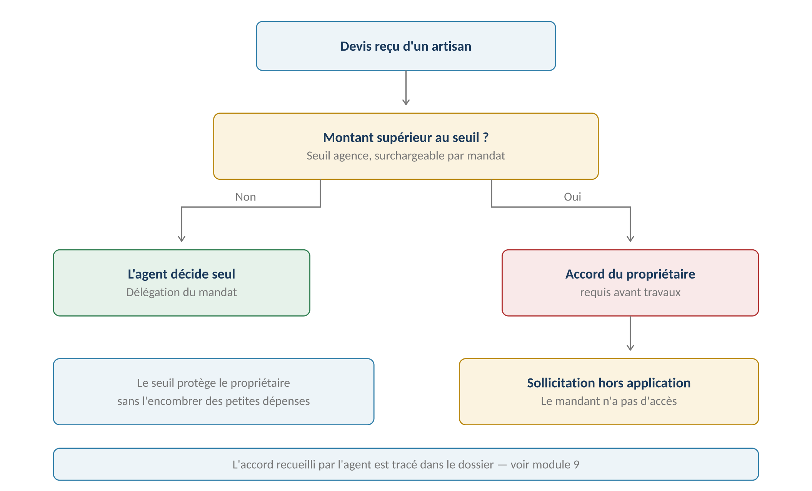
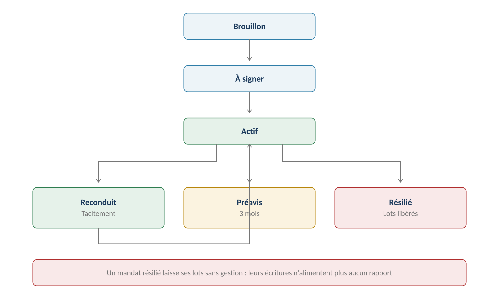

**GERIMMO V3**

Référentiel des parcours clients

**MODULE 5**

**Mandat de gestion**

|               |                                                      |
|:--------------|:-----------------------------------------------------|
| **Périmètre** | 6 parcours · 2 objets métier                         |
| **Dépend de** | Module 0 — les lots et leurs propriétaires           |
| **Alimente**  | **Comptabilité (4.2) · Rapport (6.1) · Devis (9.5)** |
| **Rôle**      | Pivot entre le propriétaire et l'agence              |
| **Statut**    | **Module clos — aucune question ouverte**            |

> **Vue d'ensemble du module**
>
> **Le mandat est le contrat qui fonde tout le reste**
>
> Sans mandat, l'agence n'a aucun droit d'agir sur un lot : pas de bail à signer,
>
> pas de loyer à encaisser, pas d'honoraires à percevoir.
>
> Il porte trois paramètres décisifs : le taux d'honoraires, la date de rapport
>
> et le seuil de délégation sur devis.

**La structure**

------------------------------------------------------------------------

*Schéma 1 — Un mandat couvre des lots de biens différents, chacun avec son propre taux*

> **Le mandat porte sur des lots — conséquence du module 0**
>
> Depuis la bascule de la propriété au niveau lot, un mandat ne couvre plus des biens
>
> mais des lots précis.
>
> Un propriétaire possédant deux appartements dans deux immeubles différents
>
> a un seul mandat couvrant ses deux lots.

**Plusieurs mandats sur un même immeuble**

------------------------------------------------------------------------

*Schéma 2 — Trois propriétaires dans un immeuble donnent trois mandats et trois rapports*

**Objets créés dans ce module**

------------------------------------------------------------------------

| **Objet** | **Description** | **Rattaché à** |
|:---|:---|:---|
| **Mandat** | Contrat agence ↔ propriétaire, sur un ou plusieurs lots | Personne |
| **Ligne de mandat** | Un lot couvert, avec son taux d'honoraires propre | Mandat + Lot |

**Cartographie des 6 parcours**

------------------------------------------------------------------------

| **\#** | **Parcours**                    | **Persona** | **V1 / V2** | **Criticité** |
|:-------|:--------------------------------|:------------|:------------|:--------------|
| 5.1    | Création d'un mandat multi-lots | AG          | **V1**      | Haute         |
| 5.2    | Ajout et retrait de lots        | AG          | **V1**      | Moyenne       |
| 5.3    | **Paramétrage du mandat**       | AG          | **V1**      | **MAXIMALE**  |
| 5.4    | Renouvellement                  | Système     | **V1**      | Moyenne       |
| 5.5    | Résiliation                     | AG          | **V1**      | Haute         |
| 5.6    | Signature et transmission       | AG          | **V1**      | Haute         |

> **5.1 & 5.2 — Création et composition du mandat**

|                 |                                                |
|:----------------|:-----------------------------------------------|
| **Persona**     | AG — Agent immobilier                          |
| **Déclencheur** | Un propriétaire confie la gestion de ses lots  |
| **Fréquence**   | À chaque nouveau client                        |
| **Criticité**   | Haute                                          |
| **Prérequis**   | Les lots existent et ont ce propriétaire (0.2) |

**5.1 — Parcours nominal**

------------------------------------------------------------------------

| **\#** | **Acteur** | **Action** | **Écran / état** |
|:---|:---|:---|:---|
| 1 | AG | Clique « Nouveau mandat » | Liste des mandats |
| 2 | AG | Sélectionne le propriétaire | Recherche de personne |
| 3 | **Système** | **Propose les lots dont cette personne est propriétaire** | Liste filtrée |
| 4 | AG | Coche les lots à intégrer au mandat | Cases à cocher |
| 5 | AG | Saisit le taux d'honoraires de chaque lot | Tableau |
| 6 | AG | Renseigne la durée et la date de rapport (5.3) | Formulaire |
| 7 | AG | Valide | — |
| 8 | **Système** | Crée le mandat en brouillon | — |

> **Seuls les lots du propriétaire sont proposés**
>
> Le système filtre sur la détention enregistrée au parcours 0.2.
>
> Un lot dont la personne n'est pas propriétaire ne peut pas entrer dans son mandat —
>
> ce serait un contrat sans objet.

**Le taux d'honoraires par lot — décision actée**

------------------------------------------------------------------------

| **Lot**             | **Loyer mensuel** | **Taux** | **Honoraires** |
|:--------------------|:------------------|:---------|:---------------|
| **Studio Voltaire** | 520 €             | 8 %      | 41,60 €        |
| **T2 Voltaire**     | 750 €             | 7 %      | 52,50 €        |
| **T4 République**   | 1 350 €           | 5 %      | 67,50 €        |
| **TOTAL**           | **2 620 €**       | —        | **161,60 €**   |

> **Pourquoi un taux par lot et non par mandat**
>
> Un propriétaire multi-lots négocie souvent un taux dégressif : plus il confie de biens,
>
> plus le taux baisse.
>
> Un taux unique par mandat interdirait cette pratique, ou obligerait à créer
>
> plusieurs mandats pour le même propriétaire — ce qui multiplierait les rapports.

**5.2 — Ajout et retrait de lots**

------------------------------------------------------------------------

| **\#** | **Acteur** | **Action** | **Écran / état** |
|:---|:---|:---|:---|
| 1 | AG | Ouvre le mandat actif | Fiche mandat |
| 2 | AG | Ajoute un lot ou en retire un | Tableau des lignes |
| 3 | **Système** | **Vérifie qu'aucun bail actif ne subsiste sur un lot retiré** | Blocage |
| 4 | AG | Saisit le taux du lot ajouté | Formulaire |
| 5 | **Système** | Génère un avenant au mandat | PDF |
| 6 | AG | Fait signer et enregistre | Upload |
| 7 | **Système** | Date d'effet appliquée à la ligne | — |

**Variantes**

------------------------------------------------------------------------

| **Code** | **Situation** | **Comportement** |
|:---|:---|:---|
| **V1** | Mandat mono-lot | Cas le plus fréquent. Le tableau des lignes est masqué. |
| **V2** | **Propriétaire en indivision** | Le mandat est signé par tous les indivisaires. Un seul rapport (décision actée). |
| **V3** | Propriétaire personne morale | Signature par le représentant légal. |
| **V4** | Nouveau lot acquis | Ajout au mandat existant par avenant. |
| **V5** | **Lot vendu** | Retiré du mandat. Le bail en cours doit être transféré ou résilié. |

**Cas d'erreur**

------------------------------------------------------------------------

| **Cas** | **Comportement attendu** |
|:---|:---|
| Lot appartenant à une autre personne | **Non proposé à la sélection** |
| Lot déjà couvert par un mandat actif | **BLOCAGE — un lot n'a qu'un mandat à la fois** |
| Retrait d'un lot avec bail actif | **BLOCAGE — résilier ou transférer le bail d'abord** |
| Taux d'honoraires non renseigné | **BLOCAGE — le calcul du net en dépend** |
| Taux supérieur à 15 % | Alerte : montant inhabituel, à confirmer |

**Règles métier**

------------------------------------------------------------------------

> **RM-5.1.1** — Un mandat porte sur des lots, jamais sur des biens.
>
> **RM-5.1.2** — Seuls les lots dont la personne est propriétaire peuvent être intégrés.
>
> **RM-5.1.3** — Un lot ne peut être couvert que par un seul mandat actif à la fois.
>
> **RM-5.1.4** — Chaque ligne de mandat porte son propre taux d'honoraires.
>
> **RM-5.1.5** — Le taux est obligatoire : le calcul du net reversé en dépend (RM-4.2.3).
>
> **RM-5.2.1** — Un lot avec bail actif ne peut être retiré du mandat.
>
> **RM-5.2.2** — Toute modification de composition passe par un avenant signé.
>
> **RM-5.2.3** — Chaque ligne porte sa date d'entrée et de sortie du mandat.

**User stories**

------------------------------------------------------------------------

> **US-5.1.1**
>
> *En tant qu'agent immobilier, je veux un taux différent par lot, afin de pratiquer un tarif dégressif pour un propriétaire multi-lots.*

- **Étant donné** un propriétaire confiant trois lots, **quand** je crée le mandat, **alors** je saisis un taux distinct pour chacun

- **Étant donné** des taux de 8 %, 7 % et 5 %, **quand** les loyers sont encaissés, **alors** chaque écriture d'honoraires applique le taux de son lot

> **US-5.2.1**
>
> *En tant qu'agent immobilier, je veux être bloqué si je retire un lot occupé, afin de ne pas laisser un bail sans gestionnaire.*

- **Étant donné** un lot avec un bail actif, **quand** je tente de le retirer du mandat, **alors** l'action est refusée avec un renvoi vers la résiliation du bail

> **5.3 — Paramétrage du mandat**
>
> **Trois paramètres décident du comportement de toute l'application**
>
> Le taux d'honoraires alimente la comptabilité et le rapport.
>
> La date de rapport déclenche la clôture et la génération mensuelle.
>
> Le seuil de délégation détermine quand l'agent doit consulter le propriétaire.

|                 |                               |
|:----------------|:------------------------------|
| **Persona**     | AG — Agent immobilier         |
| **Déclencheur** | Création du mandat ou avenant |
| **Fréquence**   | À la création, puis rarement  |
| **Criticité**   | MAXIMALE                      |
| **Alimente**    | Modules 4, 6 et 9             |

**Les paramètres du mandat**

------------------------------------------------------------------------

| **Paramètre** | **Portée** | **Défaut** | **Impact** |
|:---|:---|:---|:---|
| **Taux d'honoraires** | **Par lot** | 7 % | Comptabilité (4.2) |
| **Date de rapport** | Mandat | Le 10 du mois | Rapport (6.1) |
| **Seuil de délégation** | **Agence, surchargeable** | 500 € | Devis (9.5) |
| **Durée** | Mandat | 1 an, modifiable | Renouvellement (5.4) |
| **Préavis de résiliation** | Mandat | 3 mois | Résiliation (5.5) |
| **Honoraires de location** | Mandat | Selon barème agence | Facturation à la mise en location |

**Le seuil de délégation**

------------------------------------------------------------------------

*Schéma 3 — Sous le seuil, l'agent décide seul ; au-dessus, il consulte le propriétaire*

> **Global agence avec surcharge par mandat — décision actée**
>
> L'agence fixe un seuil par défaut, appliqué à tous ses mandats.
>
> Un propriétaire particulièrement prudent — ou particulièrement confiant —
>
> peut négocier un seuil différent, saisi sur son mandat.
>
> Rappel du module 1 : le propriétaire mandant n'ayant aucun accès à l'application,
>
> la sollicitation se fait hors plateforme et l'accord est tracé par l'agent.

**Les honoraires de location**

------------------------------------------------------------------------

| **Prestation** | **Payeur** | **Plafond locataire** |
|:---|:---|:---|
| **Visite et constitution du dossier** | Bailleur et locataire | Selon zone, au m² |
| **Rédaction du bail** | Bailleur et locataire | Selon zone, au m² |
| **État des lieux d'entrée** | Bailleur et locataire | 3 €/m² maximum |
| **Autres prestations** | **Bailleur seul** | Aucun plafond |

> **Contrôle de plafond en alerte — décision actée**
>
> La part locataire des honoraires de location est plafonnée au mètre carré,
>
> selon un barème dépendant de la zone — même mécanique que la zone tendue du module 0.
>
> Le système alerte en cas de dépassement sans bloquer : l'agence reste responsable
>
> de ce qu'elle facture, mais elle est prévenue.

**Variantes**

------------------------------------------------------------------------

| **Code** | **Situation** | **Comportement** |
|:---|:---|:---|
| **V1** | Seuil par défaut de l'agence | Aucune saisie sur le mandat. Cas majoritaire. |
| **V2** | Seuil négocié | Saisi sur le mandat, il prime sur celui de l'agence. |
| **V3** | **Seuil à zéro** | Tout devis nécessite l'accord du propriétaire. |
| **V4** | Modification du taux en cours de mandat | Par avenant, avec date d'effet. Sans rétroactivité. |
| **V5** | Honoraires forfaitaires | Montant fixe mensuel au lieu d'un pourcentage. |

**Règles métier**

------------------------------------------------------------------------

> **RM-5.3.1** — Le taux d'honoraires est porté par la ligne de mandat, donc par le lot.
>
> **RM-5.3.2** — La date de rapport est propre à chaque mandat.
>
> **RM-5.3.3** — Le seuil de délégation est celui de l'agence, sauf surcharge sur le mandat.
>
> **RM-5.3.4** — La durée par défaut est d'un an, modifiable par l'agent, plafonnée à dix ans.
>
> **RM-5.3.5** — Une modification de paramètre passe par un avenant, sans rétroactivité.
>
> **RM-5.3.6** — Les honoraires de location sont portés par le mandat.
>
> **RM-5.3.7** — Un dépassement du plafond légal de la part locataire génère une alerte non bloquante.

**User stories**

------------------------------------------------------------------------

> **US-5.3.1**
>
> *En tant qu'agent immobilier, je veux surcharger le seuil de délégation sur un mandat, afin de respecter ce qu'un propriétaire a négocié.*

- **Étant donné** un seuil agence à 500 €, **quand** je saisis 1 000 € sur un mandat, **alors** les devis de ce propriétaire ne remontent qu'au-delà de 1 000 €

> **US-5.3.2**
>
> *En tant qu'agent immobilier, je veux être alerté si les honoraires de location dépassent le plafond, afin de ne pas facturer au-delà du légal.*

- **Étant donné** un logement de 45 m² et un plafond de 3 €/m² pour l'état des lieux, **quand** je saisis 200 € de part locataire, **alors** une alerte m'indique que le plafond est de 135 €

> **5.4, 5.5 & 5.6 — Cycle de vie**

**Le cycle complet**

------------------------------------------------------------------------

*Schéma 4 — Un mandat résilié laisse ses lots sans gestion*

**5.4 — Renouvellement**

------------------------------------------------------------------------

|                 |                                            |
|:----------------|:-------------------------------------------|
| **Persona**     | Système → AG                               |
| **Déclencheur** | Approche du terme du mandat                |
| **Fréquence**   | Annuelle par mandat                        |
| **Criticité**   | Moyenne                                    |
| **Principe**    | Alerte, jamais de reconduction silencieuse |

| **\#** | **Acteur** | **Action** | **Résultat** |
|:---|:---|:---|:---|
| 1 | **Système** | Détecte le terme approchant, quatre mois avant | Alerte |
| 2 | AG | Décide : laisser reconduire ou résilier | — |
| 3 | **Système** | Au terme, reconduit tacitement pour la même durée | — |
| 4 | **Système** | Enregistre la nouvelle échéance | Fiche mandat |

> **Quatre mois d'avance, pas trois**
>
> Le préavis de résiliation est de trois mois. Alerter trois mois avant le terme
>
> ne laisserait aucune marge de décision.
>
> Quatre mois donnent un mois pour en discuter avec le propriétaire.

**5.5 — Résiliation**

------------------------------------------------------------------------

| **Origine** | **Préavis** | **Conséquence** |
|:---|:---|:---|
| **À l'initiative du propriétaire** | 3 mois | Les lots sortent de gestion |
| **À l'initiative de l'agence** | 3 mois | Les lots sortent de gestion |
| **Vente de tous les lots** | À la vente | Le mandat devient sans objet |
| **Décès du propriétaire** | Hors périmètre | Traitement manuel |

| **\#** | **Acteur** | **Action** | **Écran / état** |
|:---|:---|:---|:---|
| 1 | AG | Enregistre la résiliation et sa date de réception | Fiche mandat |
| 2 | **Système** | Calcule la date d'effet : réception + 3 mois | — |
| 3 | **Système** | Passe le mandat en préavis | — |
| 4 | **Système** | Alerte sur les baux en cours des lots concernés | Liste |
| 5 | AG | Prépare la transmission des dossiers | Hors application |
| 6 | **Système** | **À la date d'effet, passe le mandat en résilié** | — |
| 7 | **Système** | Émet le dernier rapport et le récapitulatif fiscal | Module 6 |

> **Ce que la résiliation laisse derrière elle**
>
> Les baux ne s'arrêtent pas : ils continuent avec le propriétaire ou son nouveau gestionnaire.
>
> Mais dans Gerimmo, les lots n'étant plus couverts par un mandat actif,
>
> leurs écritures comptables n'alimenteront plus aucun rapport.
>
> D'où l'importance d'émettre le dernier rapport et le récapitulatif fiscal
>
> avant que le mandat ne s'éteigne.

**5.6 — Signature et transmission**

------------------------------------------------------------------------

| **\#** | **Acteur** | **Action** | **Écran / état** |
|:---|:---|:---|:---|
| 1 | AG | Depuis le mandat en brouillon, génère le PDF | Fiche mandat |
| 2 | **Système** | Fusionne les lots, taux et paramètres dans le modèle | — |
| 3 | **Système** | **Envoie en signature électronique** | Module 13 |
| 4 | PM | **Le propriétaire signe par email, puis l'agence** | Yousign |
| 5 | **Système** | **Passe le mandat en actif** | — |
| 6 | **Système** | Active la gestion des lots couverts | — |
| 7 | AG | Envoie une copie signée au propriétaire | Module 12 |

> **Le propriétaire signe sans accès à l'application**
>
> Décision actée : il n'a aucun accès à Gerimmo.
>
> Yousign fonctionnant par email, il reçoit un lien, signe dans son navigateur,
>
> et n'entre jamais dans l'application — RM-13.1.4.
>
> Son mandat signé lui est ensuite envoyé, comme ses rapports mensuels.

**Règles métier**

------------------------------------------------------------------------

> **RM-5.4.1** — L'alerte de renouvellement se déclenche quatre mois avant le terme.
>
> **RM-5.4.2** — La reconduction est tacite, pour la même durée.
>
> **RM-5.5.1** — Le préavis de résiliation est de trois mois.
>
> **RM-5.5.2** — La résiliation ne met pas fin aux baux en cours.
>
> **RM-5.5.3** — Un lot sans mandat actif n'alimente plus aucun rapport.
>
> **RM-5.5.4** — Le dernier rapport et le récapitulatif fiscal sont émis avant extinction.
>
> **RM-5.6.1** — C'est l'enregistrement du mandat signé qui active la gestion des lots.
>
> **RM-5.6.2** — Le propriétaire signe par email, sans accès à l'application (RM-13.1.4).
>
> **RM-5.6.3** — L'ordre de signature place le propriétaire avant l'agence.

**User stories**

------------------------------------------------------------------------

> **US-5.4.1**
>
> *En tant qu'agent immobilier, je veux être alerté quatre mois avant le terme, afin d'avoir le temps de discuter du renouvellement.*

- **Étant donné** un mandat arrivant à terme dans quatre mois, **quand** la tâche quotidienne s'exécute, **alors** une alerte m'invite à décider avant que le préavis ne soit trop court

> **US-5.5.1**
>
> *En tant qu'agent immobilier, je veux que le dernier rapport soit émis avant l'extinction, afin que le propriétaire dispose de sa comptabilité complète.*

- **Étant donné** un mandat arrivant à sa date d'effet de résiliation, **quand** l'extinction se produit, **alors** le dernier rapport et le récapitulatif fiscal sont générés

- **Étant donné** un lot sorti de gestion, **quand** une écriture le concernant est saisie, **alors** une alerte signale qu'elle n'alimentera aucun rapport

> **US-5.6.1**
>
> *En tant qu'agent immobilier, je veux que la gestion ne s'active qu'au mandat signé, afin de ne pas agir sans mandat valable.*

- **Étant donné** un mandat en brouillon, **quand** je tente de créer un bail sur un de ses lots, **alors** une alerte me signale l'absence de mandat actif

> **Synthèse du module**

**Les règles métier les plus structurantes**

------------------------------------------------------------------------

| **Code** | **Règle** | **Bloquant** |
|:---|:---|:---|
| **RM-5.1.1** | **Un mandat porte sur des lots, jamais sur des biens** | Structurel |
| **RM-5.1.2** | Seuls les lots du propriétaire sont intégrables | **Oui** |
| **RM-5.1.3** | Un lot n'a qu'un mandat actif à la fois | **Oui** |
| **RM-5.1.4** | **Chaque ligne porte son propre taux** | Structurel |
| **RM-5.2.1** | Un lot avec bail actif ne peut être retiré | **Oui** |
| **RM-5.3.2** | La date de rapport est propre à chaque mandat | Structurel |
| **RM-5.3.3** | Seuil agence, surchargeable par mandat | Structurel |
| **RM-5.3.5** | Modification par avenant, sans rétroactivité | Structurel |
| **RM-5.3.7** | Dépassement du plafond locataire en alerte | Non |
| **RM-5.5.2** | La résiliation ne met pas fin aux baux | Structurel |
| **RM-5.5.3** | **Un lot sans mandat n'alimente plus aucun rapport** | Structurel |
| **RM-5.6.1** | Le mandat signé active la gestion | **Oui** |

**Décompte des user stories**

------------------------------------------------------------------------

| **Parcours** | **User stories** | **Critères d'acceptation** |
|:---|:---|:---|
| 5.1 & 5.2 — Création et composition | 2 | 3 |
| **5.3 — Paramétrage** | **2** | **2** |
| 5.4 à 5.6 — Cycle de vie | 3 | 4 |
| **TOTAL** | **7** | **9** |

**Décisions actées sur ce module**

------------------------------------------------------------------------

| **Décision**                              | **Statut**         |
|:------------------------------------------|:-------------------|
| Mandat multi-biens et multi-lots          | **Acté**           |
| Taux d'honoraires variable par lot        | **Acté**           |
| Seuil de délégation agence, surchargeable | **Acté**           |
| Durée modifiable par l'agent              | **Acté**           |
| Honoraires de location dans le périmètre  | **Acté**           |
| Contrôle du plafond en alerte             | **Acté**           |
| Propriétaire mandant sans accès à l'app   | **Acté**           |
| **Signature électronique du mandat**      | **Acté — V1**      |
| Décès du propriétaire et succession       | **Hors périmètre** |

**Ce que ce module impose ailleurs**

------------------------------------------------------------------------

| **Module** | **Conséquence** |
|:---|:---|
| **Module 1 — Bail** | Aucun bail sans mandat actif sur le lot |
| **Module 4 — Comptabilité** | **Le taux de la ligne pilote le calcul des honoraires** |
| **Module 6 — Rapport** | **Un rapport par mandat, à sa date propre** |
| **Module 9 — Devis** | Le seuil détermine quand solliciter le propriétaire |
| **Module 13 — Signature** | **Le mandat y transite pour signature** |
| **Module 14 — Alertes** | Renouvellement à quatre mois, échéance de préavis |

**Prochaine étape**

------------------------------------------------------------------------

> **Module 6 — Rapport propriétaire et fiscalité**
>
> Six parcours : alerte de validation, relecture et envoi, rapport rectificatif,
>
> récapitulatif fiscal annuel.
>
> C'est l'aboutissement de tout ce qui précède : le seul livrable
>
> que le propriétaire mandant reçoit réellement.
