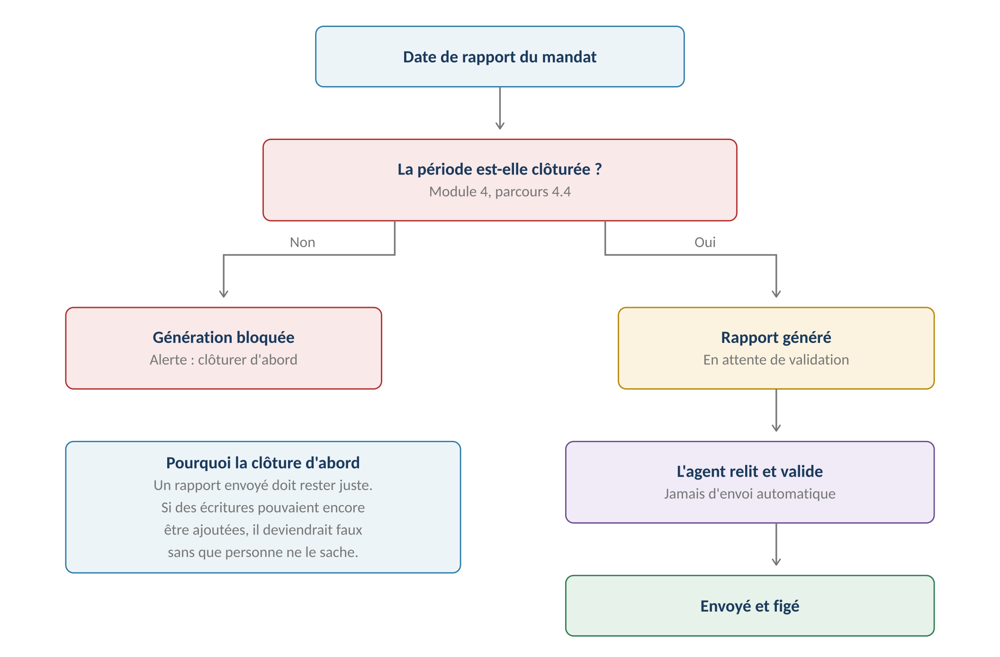
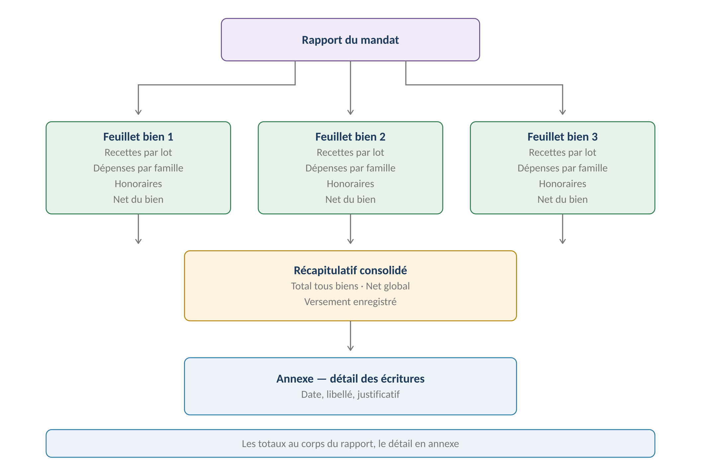
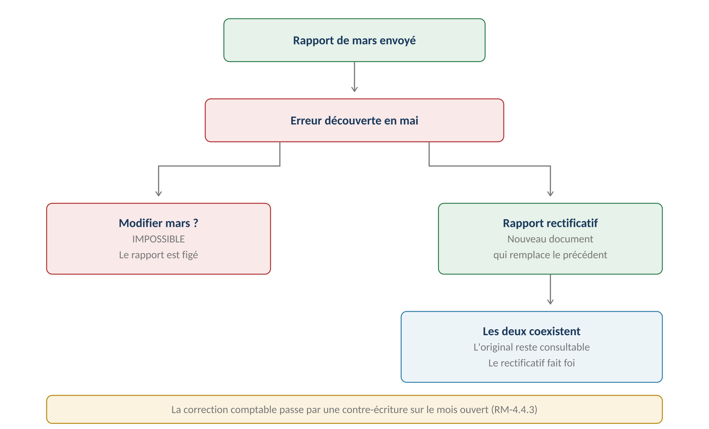
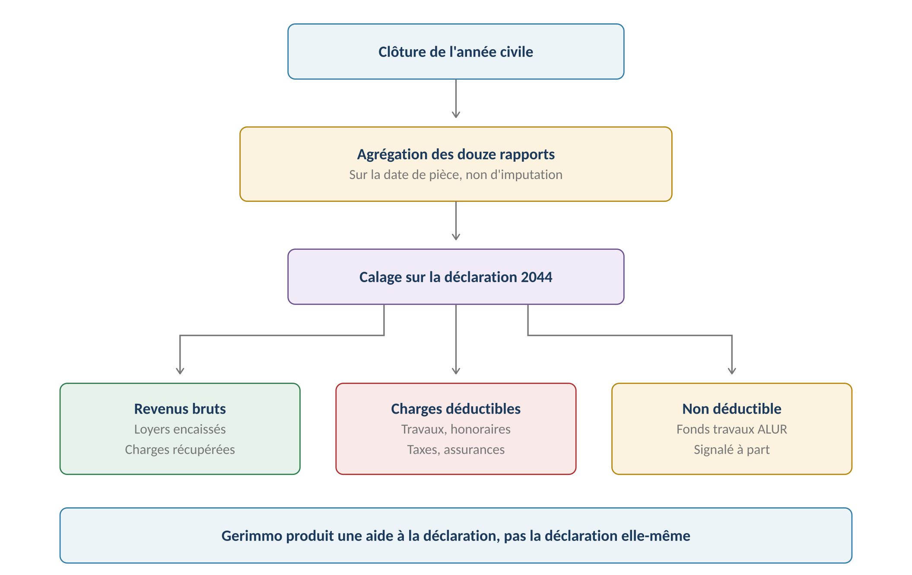

**GERIMMO V3**

Référentiel des parcours clients

**MODULE 6**

**Rapport et fiscalité**

|               |                                                       |
|:--------------|:------------------------------------------------------|
| **Périmètre** | 6 parcours · 2 objets métier                          |
| **Dépend de** | **Module 4 (clôture) · Module 5 (mandat)**            |
| **Livrable**  | Le seul que le propriétaire mandant reçoit réellement |
| **Criticité** | **MAXIMALE — c'est la vitrine du service rendu**      |
| **Statut**    | **Module clos — aucune question ouverte**             |

> **Vue d'ensemble du module**
>
> **Le rapport est le produit visible de l'agence**
>
> Le propriétaire mandant n'a aucun accès à l'application. Il ne voit ni les baux,
>
> ni les quittances, ni la comptabilité.
>
> Son rapport mensuel est la seule chose qu'il reçoit. C'est à travers lui
>
> qu'il juge la qualité du service — et qu'il décide de renouveler son mandat.

**La chaîne de génération**

------------------------------------------------------------------------

*Schéma 1 — La clôture comptable conditionne la génération du rapport*

> **Trois décisions du 22 juillet structurent ce module**
>
> Génération automatique à date fixe, propre à chaque mandat.
>
> Alerte de validation à l'agent, qui envoie lui-même — jamais d'envoi automatique.
>
> Rapport figé après envoi : la correction passe par un rectificatif.

**Objets créés dans ce module**

------------------------------------------------------------------------

| **Objet**     | **Description**                      | **Rattaché à**   |
|:--------------|:-------------------------------------|:-----------------|
| **Rapport**   | Document mensuel, figé après envoi   | Mandat + période |
| **Versement** | Trace du reversement au propriétaire | Rapport          |

**Cartographie des 6 parcours**

------------------------------------------------------------------------

| **\#** | **Parcours** | **Persona** | **V1 / V2** | **Criticité** |
|:---|:---|:---|:---|:---|
| 6.1 | Alerte de validation à date fixe | Système | **V1** | Haute |
| 6.2 | **Relecture et envoi** | AG | **V1** | **MAXIMALE** |
| 6.3 | Rapport rectificatif | AG | **V1** | Haute |
| 6.4 | **Récapitulatif fiscal annuel** | AG | **V1** | **MAXIMALE** |
| 6.5 | Réception du rapport mensuel | PM | **V1** | Moyenne |
| 6.6 | Réception du récapitulatif fiscal | PM | **V1** | Moyenne |

> **6.1 & 6.2 — Génération et envoi du rapport**

|                 |                                           |
|:----------------|:------------------------------------------|
| **Persona**     | Système (6.1) · AG (6.2)                  |
| **Déclencheur** | Date de rapport propre au mandat (5.3)    |
| **Fréquence**   | Mensuelle par mandat                      |
| **Criticité**   | MAXIMALE                                  |
| **Prérequis**   | **Période comptable clôturée (RM-4.4.7)** |

**La structure du rapport**

------------------------------------------------------------------------

*Schéma 2 — Un feuillet par bien, un récapitulatif consolidé, le détail en annexe*

> **Un feuillet par bien — décision actée**
>
> Un propriétaire multi-biens veut voir chaque bien séparément : c'est ainsi
>
> qu'il raisonne sur son patrimoine.
>
> Le récapitulatif consolidé lui donne ensuite le net global à percevoir,
>
> et l'annexe le détail s'il conteste une ligne.

**Contenu d'un feuillet de bien**

------------------------------------------------------------------------

| **Rubrique** | **Détail** | **Source** |
|:---|:---|:---|
| **Recettes encaissées** | Loyers et provisions, par lot | Module 3 |
| **Dépenses** | Par famille du plan de catégories | Module 4 |
| **Honoraires prélevés** | Au taux de la ligne de mandat | RM-4.2.2 |
| **Net du bien** | **Recettes moins dépenses et honoraires** | Calcul |
| **Impayés en cours** | Signalés, jamais comptés en recette | RM-4.3.3 |
| **Incidents ouverts** | Statut et montant estimé | Module 7 |

**Exemple de feuillet**

------------------------------------------------------------------------

| **Ligne**                  | **Montant**    |
|:---------------------------|:---------------|
| **Loyers encaissés**       | 2 620,00 €     |
| **Provisions sur charges** | 255,00 €       |
| **Total des recettes**     | **2 875,00 €** |
| Travaux et entretien       | – 340,00 €     |
| Charges de copropriété     | – 412,00 €     |
| **Honoraires de gestion**  | – 161,60 €     |
| **Total des dépenses**     | **– 913,60 €** |
| **NET À REVERSER**         | **1 961,40 €** |

**Parcours nominal**

------------------------------------------------------------------------

| **\#** | **Acteur** | **Action** | **Écran / état** |
|:---|:---|:---|:---|
| 1 | **Système** | À la date du mandat, vérifie que la période est clôturée | — |
| 2 | **Système** | **Si non clôturée : bloque et alerte** | Renvoi au 4.4 |
| 3 | **Système** | Génère le rapport en état « à valider » | — |
| 4 | **Système** | Alerte l'agent en charge du mandat | Tableau de bord |
| 5 | AG | Relit le rapport feuillet par feuillet | Aperçu |
| 6 | AG | Peut ajouter un commentaire au propriétaire | Champ libre |
| 7 | AG | **Valide et envoie** | Action explicite |
| 8 | **Système** | **Fige le rapport définitivement** | — |
| 9 | **Système** | Transmet au propriétaire par email | Module 12 |
| 10 | **Système** | Programme l'alerte de versement à J+15 | Agenda |

> **L'agent envoie, le système ne décide pas**
>
> Un rapport contient parfois une mauvaise nouvelle : un impayé, des travaux imprévus,
>
> un net inférieur au mois précédent.
>
> L'agent doit pouvoir le relire, ajouter un mot d'explication, ou appeler
>
> le propriétaire avant l'envoi. Un envoi automatique le priverait de cette latitude.

**L'enregistrement du versement**

------------------------------------------------------------------------

| **\#** | **Acteur** | **Action** | **Effet** |
|:---|:---|:---|:---|
| 1 | AG | Effectue le virement au propriétaire | Hors application |
| 2 | AG | Enregistre la date et le montant versés | Fiche rapport |
| 3 | **Système** | Rapproche le versement du net annoncé | Contrôle |
| 4 | **Système** | **Alerte si aucun versement au bout de 15 jours** | Relance |

> **Pourquoi tracer un versement que Gerimmo ne fait pas**
>
> Le paiement est hors périmètre, mais son absence ne doit pas passer inaperçue.
>
> Sans trace, le propriétaire pourrait avoir été payé sans que le système le sache —
>
> ou ne pas l'avoir été sans que personne ne s'en aperçoive, ce qui est pire.
>
> D'où l'alerte à quinze jours si le versement n'est pas enregistré.

**Variantes**

------------------------------------------------------------------------

| **Code** | **Situation** | **Comportement** |
|:---|:---|:---|
| **V1** | Mandat mono-bien | Un seul feuillet, le récapitulatif est allégé. |
| **V2** | **Net négatif** | Les dépenses excèdent les recettes. Appel de fonds au propriétaire. |
| **V3** | Aucun mouvement sur la période | Rapport généré quand même, à zéro. Le propriétaire est rassuré. |
| **V4** | **Mandat résilié en cours de mois** | Dernier rapport émis avant extinction (RM-5.5.4). |
| **V5** | Indivision | Un seul rapport pour tous les indivisaires (décision actée). |

**Cas d'erreur**

------------------------------------------------------------------------

| **Cas** | **Comportement attendu** |
|:---|:---|
| Période non clôturée | **BLOCAGE — renvoi au parcours 4.4** |
| Lot sans mandat actif | Ses écritures n'apparaissent dans aucun rapport |
| Rapport déjà envoyé pour la période | **BLOCAGE — passer par un rectificatif (6.3)** |
| Adresse email du propriétaire absente | **BLOCAGE de l'envoi, rapport généré quand même** |
| Versement supérieur au net annoncé | Alerte : écart à justifier |

**Règles métier**

------------------------------------------------------------------------

> **RM-6.1.1** — Le rapport se génère à la date propre au mandat (RM-5.3.2).
>
> **RM-6.1.2** — La génération est bloquée tant que la période n'est pas clôturée.
>
> **RM-6.1.3** — Un rapport est généré même si aucun mouvement n'a eu lieu.
>
> **RM-6.2.1** — Le rapport est structuré en un feuillet par bien, plus un récapitulatif.
>
> **RM-6.2.2** — Le détail des écritures figure en annexe, non dans le corps.
>
> **RM-6.2.3** — L'envoi est toujours déclenché par l'agent, jamais automatique.
>
> **RM-6.2.4** — Le rapport est figé définitivement à l'envoi.
>
> **RM-6.2.5** — Les impayés sont signalés sans être comptés en recette.
>
> **RM-6.2.6** — Le versement au propriétaire est enregistré : date et montant.
>
> **RM-6.2.7** — Une alerte se déclenche si aucun versement n'est enregistré à J+15.

**User stories**

------------------------------------------------------------------------

> **US-6.1.1**
>
> *En tant qu'agent immobilier, je veux être bloqué si la période n'est pas clôturée, afin de ne pas envoyer un rapport qui deviendrait faux.*

- **Étant donné** une période comptable encore ouverte, **quand** la date de rapport du mandat arrive, **alors** la génération est bloquée et une alerte m'invite à clôturer

> **US-6.2.1**
>
> *En tant qu'agent immobilier, je veux relire avant d'envoyer, afin de pouvoir expliquer une mauvaise nouvelle au propriétaire.*

- **Étant donné** un rapport généré avec un net inférieur au mois précédent, **quand** je le relis, **alors** je peux ajouter un commentaire avant l'envoi

- **Étant donné** un rapport en attente de validation, **quand** je ne fais rien, **alors** il n'est jamais envoyé automatiquement

> **US-6.2.2**
>
> *En tant qu'agent immobilier, je veux être alerté si je n'ai pas enregistré le versement, afin de ne pas oublier de payer le propriétaire.*

- **Étant donné** un rapport envoyé il y a quinze jours, **quand** aucun versement n'est enregistré, **alors** une alerte me le signale

- **Étant donné** un versement enregistré pour un montant différent du net, **quand** je le saisis, **alors** une alerte me signale l'écart

> **6.3 — Rapport rectificatif**

|                 |                                          |
|:----------------|:-----------------------------------------|
| **Persona**     | AG — Agent immobilier                    |
| **Déclencheur** | Erreur découverte après envoi            |
| **Fréquence**   | Occasionnelle                            |
| **Criticité**   | Haute                                    |
| **Principe**    | Le rapport original n'est jamais modifié |

**Le mécanisme**

------------------------------------------------------------------------

*Schéma 3 — Un rectificatif remplace sans effacer*

> **Pourquoi ne jamais modifier un rapport envoyé**
>
> Le propriétaire a reçu un document et peut l'avoir transmis à son comptable
>
> ou utilisé pour sa déclaration.
>
> Le modifier silencieusement créerait deux versions d'un même document
>
> sans que personne ne sache laquelle fait foi.

**Parcours nominal**

------------------------------------------------------------------------

| **\#** | **Acteur** | **Action** | **Écran / état** |
|:---|:---|:---|:---|
| 1 | AG | Constate une erreur sur un rapport envoyé | — |
| 2 | AG | **Passe la correction comptable par contre-écriture** | Module 4 |
| 3 | AG | Depuis le rapport concerné, clique « Rectifier » | Fiche rapport |
| 4 | AG | Saisit le motif de rectification | Champ obligatoire |
| 5 | **Système** | Génère un rapport rectificatif daté | PDF |
| 6 | **Système** | Marque l'original comme rectifié, sans le supprimer | — |
| 7 | AG | Relit et envoie | — |
| 8 | **Système** | Transmet au propriétaire avec le motif | Module 12 |

**Ce que voit le propriétaire**

------------------------------------------------------------------------

| **Document**               | **Statut affiché**              | **Accessible** |
|:---------------------------|:--------------------------------|:---------------|
| **Rapport original**       | Rectifié le \[date\]            | Oui            |
| **Rapport rectificatif**   | **En vigueur**                  | Oui            |
| **Motif de rectification** | **Affiché sur le rectificatif** | Oui            |

**Règles métier**

------------------------------------------------------------------------

> **RM-6.3.1** — Un rapport envoyé ne peut jamais être modifié.
>
> **RM-6.3.2** — La correction produit un rapport rectificatif, document distinct.
>
> **RM-6.3.3** — L'original reste consultable, marqué comme rectifié.
>
> **RM-6.3.4** — Le motif de rectification est obligatoire et transmis au propriétaire.
>
> **RM-6.3.5** — La correction comptable passe par contre-écriture (RM-4.4.3).
>
> **RM-6.3.6** — Plusieurs rectificatifs successifs sont possibles sur une même période.

**User story**

------------------------------------------------------------------------

> **US-6.3.1**
>
> *En tant qu'agent immobilier, je veux rectifier sans effacer, afin que le propriétaire comprenne ce qui a changé.*

- **Étant donné** un rapport de mars envoyé avec une dépense mal imputée, **quand** je le rectifie en mai avec un motif, **alors** un rectificatif est envoyé et l'original reste consultable

- **Étant donné** ce rectificatif, **quand** le propriétaire le reçoit, **alors** le motif de la correction y figure

> **6.4 — Récapitulatif fiscal annuel**

|                    |                                                 |
|:-------------------|:------------------------------------------------|
| **Persona**        | AG — Agent immobilier                           |
| **Déclencheur**    | Clôture de l'année civile                       |
| **Fréquence**      | Annuelle par mandat                             |
| **Criticité**      | MAXIMALE — le propriétaire déclare avec         |
| **Décision actée** | Calage sur les rubriques de la déclaration 2044 |

**Le mécanisme**

------------------------------------------------------------------------

*Schéma 4 — Agrégation annuelle calée sur les rubriques de la 2044*

> **Aide à la déclaration, pas déclaration**
>
> Gerimmo produit un document qui reprend les rubriques de la 2044 avec les montants
>
> de l'année. Le propriétaire ou son comptable le recopie dans sa déclaration.
>
> Pas de télétransmission, pas de calcul d'impôt, pas de conseil fiscal.
>
> La télédéclaration est hors périmètre — décision actée.

**Le calage sur la 2044**

------------------------------------------------------------------------

| **Rubrique 2044** | **Ce que Gerimmo y range** | **Source** |
|:---|:---|:---|
| **Recettes brutes** | Loyers encaissés dans l'année | Module 3 |
| **Charges récupérées** | Provisions et régularisations perçues | Module 3 |
| **Frais d'administration** | **Honoraires de gestion et de location** | Module 4 |
| **Primes d'assurance** | PNO, GLI | Module 4 |
| **Dépenses de réparation** | Travaux et entretien | Module 4 |
| **Charges de copropriété** | **Part non récupérable uniquement** | Module 0c |
| **Impôts** | Taxe foncière | Module 4 |
| **Intérêts d'emprunt** | Non suivis par Gerimmo | Saisie propriétaire |

> **Deux subtilités à ne pas manquer**
>
> Le fonds travaux ALUR n'est pas déductible l'année de son versement,
>
> mais l'année où les travaux sont réalisés. Il est donc signalé à part.
>
> Les intérêts d'emprunt sont déductibles mais Gerimmo ne les connaît pas :
>
> le récapitulatif laisse la rubrique vide, à compléter par le propriétaire.

**La date de pièce fait foi**

------------------------------------------------------------------------

| **Situation** | **Rapport mensuel** | **Récapitulatif fiscal** |
|:---|:---|:---|
| **Facture de décembre payée en décembre** | Décembre | Année N |
| **Facture de décembre reçue en janvier** | Janvier | **Année N** |
| **Facture de janvier reçue en janvier** | Janvier | Année N+1 |

> **Pourquoi les deux dates du module 4 comptent ici**
>
> Le rapport mensuel suit la date d'imputation : une facture de décembre reçue
>
> en janvier apparaît dans le rapport de janvier.
>
> Le récapitulatif fiscal suit la date de pièce : cette même facture rejoint
>
> l'exercice N, celui où la dépense a été engagée.
>
> Sans cette distinction (RM-4.1.2), la déclaration du propriétaire serait fausse.

**Parcours nominal**

------------------------------------------------------------------------

| **\#** | **Acteur** | **Action** | **Écran / état** |
|:---|:---|:---|:---|
| 1 | **Système** | À la clôture de décembre, alerte l'agent | Tableau de bord |
| 2 | **Système** | Agrège les écritures de l'année sur la date de pièce | — |
| 3 | **Système** | Range chaque montant dans sa rubrique 2044 | — |
| 4 | **Système** | **Signale le fonds travaux à part** | — |
| 5 | AG | Relit le récapitulatif | Aperçu |
| 6 | AG | Valide et envoie | — |
| 7 | **Système** | Transmet au propriétaire | Module 12 |

**Variantes**

------------------------------------------------------------------------

| **Code** | **Situation** | **Comportement** |
|:---|:---|:---|
| **V1** | Mandat en cours d'année | Le récapitulatif ne couvre que la période sous mandat. |
| **V2** | **Mandat résilié en cours d'année** | Émis avant extinction (RM-5.5.4). |
| **V3** | Indivision | Un seul récapitulatif, non ventilé (décision actée). |
| **V4** | Régime micro-foncier | Le récapitulatif reste utile : il donne le revenu brut. |
| **V5** | Rectificatif fiscal | Même mécanique que le rapport rectificatif (6.3). |

**Règles métier**

------------------------------------------------------------------------

> **RM-6.4.1** — Le récapitulatif agrège l'année civile sur la date de pièce.
>
> **RM-6.4.2** — Les montants sont rangés dans les rubriques de la déclaration 2044.
>
> **RM-6.4.3** — Seule la part non récupérable des charges de copropriété est déductible.
>
> **RM-6.4.4** — Le fonds travaux ALUR est signalé à part, non déductible l'année du versement.
>
> **RM-6.4.5** — Les intérêts d'emprunt ne sont pas suivis : rubrique laissée vide.
>
> **RM-6.4.6** — Le récapitulatif ne couvre que la période sous mandat.
>
> **RM-6.4.7** — La télédéclaration est hors périmètre.

**User stories**

------------------------------------------------------------------------

> **US-6.4.1**
>
> *En tant qu'agent immobilier, je veux un récapitulatif calé sur la 2044, afin que le propriétaire n'ait qu'à recopier les montants.*

- **Étant donné** une année complète d'écritures, **quand** je génère le récapitulatif, **alors** chaque montant apparaît en face de sa rubrique 2044

- **Étant donné** des charges de copropriété mixtes, **quand** le récapitulatif est produit, **alors** seule la part non récupérable figure en charge déductible

> **US-6.4.2**
>
> *En tant qu'agent immobilier, je veux qu'une facture de décembre reçue en janvier reste sur l'exercice de décembre, afin que la déclaration soit juste.*

- **Étant donné** une facture datée du 18 décembre, imputée en janvier, **quand** le récapitulatif de l'année N est généré, **alors** elle y figure, bien qu'elle apparaisse au rapport de janvier

> **6.5 & 6.6 — Réception par le propriétaire**

|                 |                                         |
|:----------------|:----------------------------------------|
| **Persona**     | PM — Propriétaire mandant               |
| **Déclencheur** | Envoi par l'agent                       |
| **Fréquence**   | Mensuelle et annuelle                   |
| **Criticité**   | Moyenne                                 |
| **Canal**       | **Email — aucun accès à l'application** |

> **Le propriétaire mandant reçoit, il ne consulte pas**
>
> Décision actée et rappelée à chaque module : il n'a aucun accès à Gerimmo.
>
> Ses rapports lui parviennent par email, en pièce jointe.
>
> Il n'a ni espace personnel, ni tableau de bord, ni historique consultable en ligne.

**Ce que le propriétaire reçoit**

------------------------------------------------------------------------

| **Document** | **Fréquence** | **Contenu** |
|:---|:---|:---|
| **Rapport de gestion** | Mensuelle | Feuillets par bien, récapitulatif, annexe |
| **Rapport rectificatif** | Si nécessaire | Même structure, avec le motif |
| **Récapitulatif fiscal** | Annuelle | Rubriques 2044 |
| **Mandat signé** | À la signature | Module 5 |
| **Sollicitation sur devis** | Au cas par cas | Au-delà du seuil (module 9) |

**Ce qu'il ne reçoit pas**

------------------------------------------------------------------------

| **Élément** | **Raison** |
|:---|:---|
| **Les baux** | Documents de l'agence, transmis sur demande |
| **Les quittances** | Concernent le locataire |
| **Le dossier locataire** | **Interdit — RM-0b.7.4** |
| **Les écritures comptables détaillées** | Figurent en annexe du rapport |
| **Un accès à l'application** | Décision actée |

> **Variante — propriétaire en gestion directe (PD)**
>
> Le propriétaire en gestion directe n'a ni mandat ni rapport : il consulte
>
> directement son livre recettes-dépenses (parcours 4.5).
>
> En revanche, un récapitulatif fiscal lui reste utile — il déclare comme les autres.

**Règles métier**

------------------------------------------------------------------------

> **RM-6.5.1** — Les documents sont transmis par email, sans accès à l'application.
>
> **RM-6.5.2** — Le propriétaire ne reçoit jamais les pièces du dossier locataire.
>
> **RM-6.6.1** — Le récapitulatif fiscal est transmis par le même canal.
>
> **Synthèse du module**

**Les règles métier les plus structurantes**

------------------------------------------------------------------------

| **Code**     | **Règle**                                        | **Bloquant** |
|:-------------|:-------------------------------------------------|:-------------|
| **RM-6.1.2** | **Génération bloquée sans clôture comptable**    | **Oui**      |
| **RM-6.1.3** | Rapport généré même sans mouvement               | Structurel   |
| **RM-6.2.1** | Un feuillet par bien, plus un récapitulatif      | Structurel   |
| **RM-6.2.3** | **L'envoi est toujours déclenché par l'agent**   | Structurel   |
| **RM-6.2.4** | Le rapport est figé à l'envoi                    | **Oui**      |
| **RM-6.2.5** | Impayés signalés, jamais comptés en recette      | Structurel   |
| **RM-6.2.7** | Alerte si aucun versement à J+15                 | Non          |
| **RM-6.3.1** | Un rapport envoyé ne se modifie jamais           | **Oui**      |
| **RM-6.3.4** | Motif de rectification obligatoire               | **Oui**      |
| **RM-6.4.1** | **Le récapitulatif agrège sur la date de pièce** | Structurel   |
| **RM-6.4.3** | Seule la part non récupérable est déductible     | Structurel   |
| **RM-6.4.4** | Fonds travaux ALUR signalé à part                | Structurel   |
| **RM-6.5.2** | Jamais les pièces du dossier locataire           | **Oui**      |

**Décompte des user stories**

------------------------------------------------------------------------

| **Parcours** | **User stories** | **Critères d'acceptation** |
|:---|:---|:---|
| **6.1 & 6.2 — Génération et envoi** | **3** | **5** |
| 6.3 — Rectificatif | 1 | 2 |
| **6.4 — Récapitulatif fiscal** | **2** | **3** |
| **TOTAL** | **6** | **10** |

**Décisions actées sur ce module**

------------------------------------------------------------------------

| **Décision**                               | **Statut**         |
|:-------------------------------------------|:-------------------|
| Génération à date fixe propre au mandat    | **Acté**           |
| Envoi déclenché par l'agent                | **Acté**           |
| Rapport figé après envoi                   | **Acté**           |
| Un feuillet par bien plus un récapitulatif | **Acté**           |
| Détail des écritures en annexe             | **Acté**           |
| Calage sur les rubriques 2044              | **Acté**           |
| Versement enregistré, alerte à J+15        | **Acté**           |
| Propriétaire mandant sans accès            | **Acté**           |
| Télédéclaration fiscale                    | **Hors périmètre** |
| Calcul de l'impôt et conseil fiscal        | **Hors périmètre** |
| Suivi des intérêts d'emprunt               | **Hors périmètre** |

**Ce que ce module consomme**

------------------------------------------------------------------------

| **Module**    | **Ce qu'il fournit**                            |
|:--------------|:------------------------------------------------|
| **Module 0c** | La ventilation récupérable / non récupérable    |
| **Module 3**  | Les loyers encaissés et les impayés             |
| **Module 4**  | **La clôture, les écritures et les deux dates** |
| **Module 5**  | **La date de rapport et le taux d'honoraires**  |
| **Module 7**  | Les incidents ouverts sur les lots              |

**Le cœur métier est terminé**

------------------------------------------------------------------------

> **Modules 0 à 6 spécifiés**
>
> Le socle et le cœur métier sont couverts : biens et lots, dossier locataire,
>
> copropriété, bail, garanties, loyers, comptabilité, mandat et rapport.
>
> Restent les modules d'intervention — incidents, artisans, devis, RDV, notation —
>
> et les modules transverses : documents, signature, alertes, messagerie,
>
> onboarding, marque blanche, administration et mobile.
