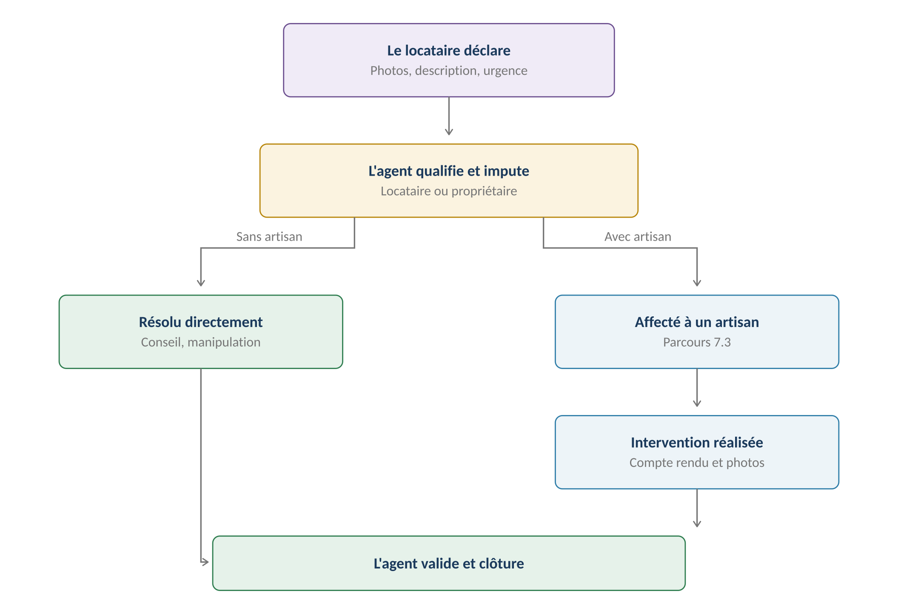
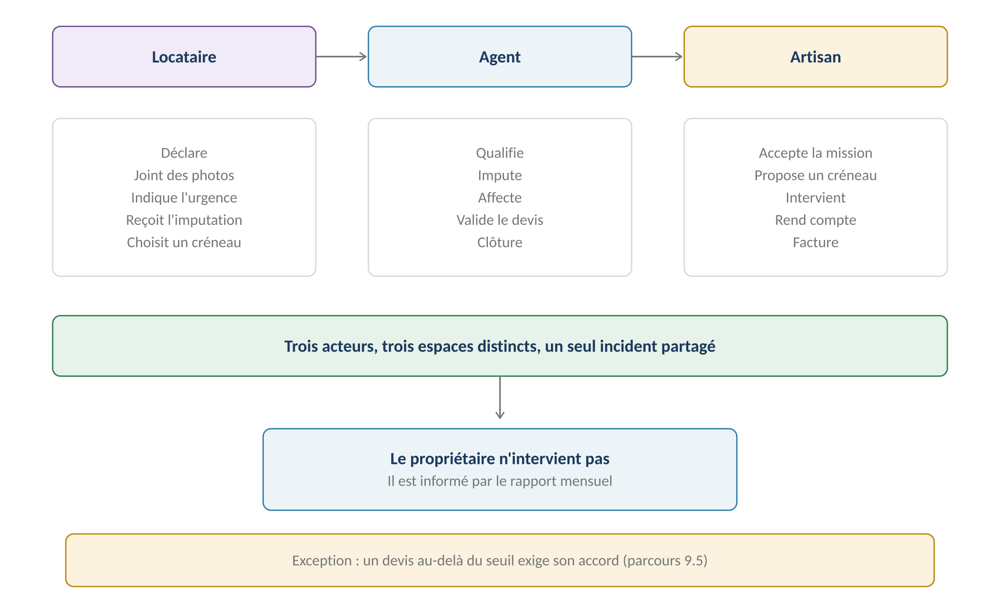
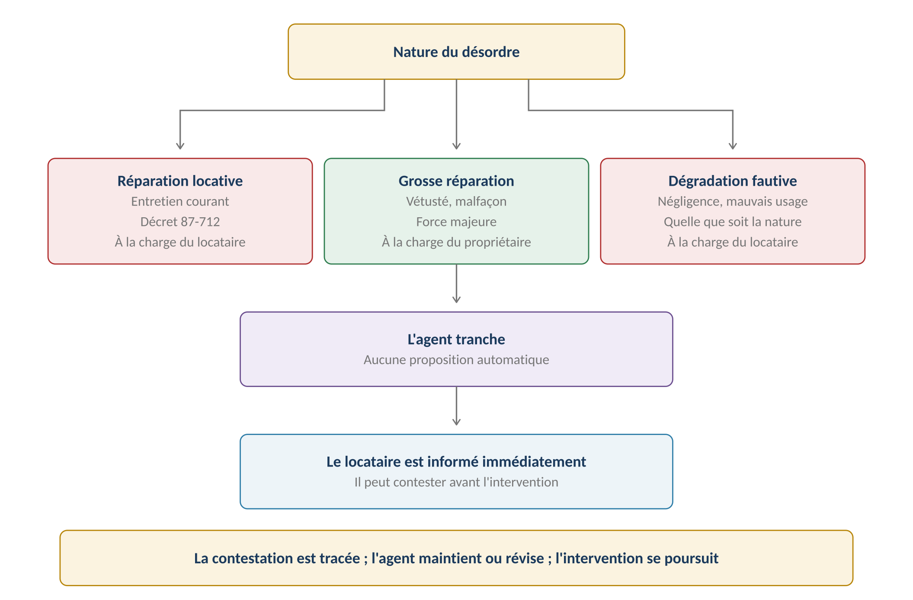
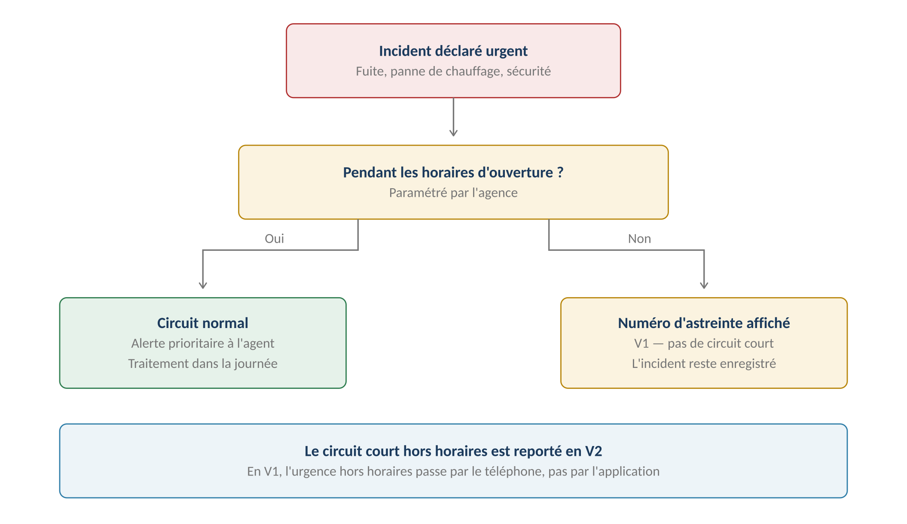

**GERIMMO V3**

Référentiel des parcours clients

**MODULE 7**

**Incidents**

|               |                                                      |
|:--------------|:-----------------------------------------------------|
| **Périmètre** | 8 parcours · 2 objets métier                         |
| **Dépend de** | Module 1 (bail actif) · Module 8 (artisans)          |
| **Alimente**  | **Devis (9.1) · Comptabilité (4.1) · Rapport (6.2)** |
| **Enjeu**     | **L'imputation décide de qui paie**                  |
| **Statut**    | **Module clos — aucune question ouverte**            |

> **Vue d'ensemble du module**

**Le cycle complet**

------------------------------------------------------------------------

*Schéma 1 — Un incident peut se résoudre sans artisan*

> **Trois acteurs, trois espaces**
>
> Le locataire déclare depuis son espace. L'agent qualifie et pilote.
>
> L'artisan intervient depuis le sien.
>
> Le propriétaire, lui, n'intervient pas : il découvre les incidents
>
> dans son rapport mensuel — décision actée.

**Qui fait quoi**

------------------------------------------------------------------------

*Schéma 2 — Le propriétaire est informé, il n'agit pas*

**Objets créés dans ce module**

------------------------------------------------------------------------

| **Objet**        | **Description**                      | **Rattaché à**     |
|:-----------------|:-------------------------------------|:-------------------|
| **Incident**     | Désordre signalé, qualifié et imputé | Lot + Bail         |
| **Intervention** | Mission confiée à un artisan         | Incident + Artisan |

**Machine à états — Incident**

------------------------------------------------------------------------

| **État**     | **Signification**             | **Transitions**         |
|:-------------|:------------------------------|:------------------------|
| **déclaré**  | Signalé par le locataire      | → qualifié · → clos     |
| **qualifié** | Nature et imputation décidées | → affecté · → résolu    |
| **affecté**  | Confié à un artisan           | → en cours · → qualifié |
| **en cours** | Intervention acceptée         | → terminé               |
| **terminé**  | Artisan a rendu compte        | → clos                  |
| **clos**     | Validé par l'agent            | → rouvert               |
| **rouvert**  | Le désordre persiste          | → qualifié              |

**Cartographie des 8 parcours**

------------------------------------------------------------------------

| **\#** | **Parcours**                    | **Persona** | **V1 / V2** | **Criticité** |
|:-------|:--------------------------------|:------------|:------------|:--------------|
| 7.1    | Déclaration d'un incident       | LO          | **V1**      | Haute         |
| 7.2    | **Qualification et imputation** | AG          | **V1**      | **MAXIMALE**  |
| 7.3    | Affectation à un artisan        | AG          | **V1**      | Haute         |
| 7.4    | Réception et acceptation        | AR          | **V1**      | Moyenne       |
| 7.5    | Compte rendu et clôture         | AR          | **V1**      | Haute         |
| 7.6    | Validation et clôture           | AG          | **V1**      | Moyenne       |
| 7.7    | Urgence hors horaires           | LO / AG     | **V2**      | Moyenne       |
| 7.8    | Information du propriétaire     | PM          | **V1**      | Faible        |

> **7.1 — Déclaration d'un incident**

|                      |                                           |
|:---------------------|:------------------------------------------|
| **Persona**          | LO — Locataire                            |
| **Déclencheur**      | Un désordre est constaté dans le logement |
| **Fréquence**        | Régulière                                 |
| **Criticité**        | Haute — c'est la porte d'entrée du module |
| **Canal privilégié** | **Mobile — le locataire est sur place**   |

**Parcours nominal**

------------------------------------------------------------------------

| **\#** | **Acteur** | **Action** | **Écran / état** |
|:---|:---|:---|:---|
| 1 | LO | Depuis son espace, clique « Signaler un problème » | Espace locataire |
| 2 | LO | Choisit la pièce concernée | Liste du lot |
| 3 | LO | Choisit la catégorie du désordre | Liste fermée |
| 4 | LO | Décrit le problème | Texte libre |
| 5 | LO | **Prend des photos** | Appareil photo |
| 6 | LO | Indique le niveau d'urgence | Sélecteur |
| 7 | LO | Valide | — |
| 8 | **Système** | Crée l'incident en état déclaré | — |
| 9 | **Système** | Alerte l'agent en charge du mandat | Tableau de bord |

**Les catégories de désordre**

------------------------------------------------------------------------

| **Catégorie** | **Exemples** | **Métier probable** |
|:---|:---|:---|
| **Plomberie** | Fuite, engorgement, chasse d'eau | Plombier |
| **Chauffage** | Panne, radiateur froid, chaudière | Chauffagiste |
| **Électricité** | Panne, prise défectueuse, disjoncteur | Électricien |
| **Serrurerie** | Serrure bloquée, clé cassée | Serrurier |
| **Menuiserie** | Fenêtre, volet, porte | Menuisier |
| **Second œuvre** | Peinture, revêtement, moisissure | Peintre |
| **Équipement** | Électroménager en meublé | Selon appareil |
| **Parties communes** | Ascenseur, hall, éclairage | Relève du syndic |
| **Autre** | À qualifier par l'agent | — |

> **Les parties communes ne relèvent pas de l'agence**
>
> Un ascenseur en panne dans une copropriété est du ressort du syndic.
>
> L'incident est enregistré pour trace, mais l'agent le clôture en indiquant
>
> la transmission au syndic. Gerimmo n'est pas un logiciel de syndic — module 0c.

**Les niveaux d'urgence**

------------------------------------------------------------------------

| **Niveau** | **Définition** | **Délai attendu** |
|:---|:---|:---|
| **Urgent** | Sécurité, dégât en cours, logement inhabitable | Traitement immédiat |
| **Prioritaire** | Confort fortement dégradé | Sous 48 heures |
| **Normal** | Gêne sans urgence | Sous une semaine |

**Variantes**

------------------------------------------------------------------------

| **Code** | **Situation** | **Comportement** |
|:---|:---|:---|
| **V1** | **Déclaration par téléphone** | L'agent saisit l'incident pour le locataire. |
| **V2** | Locataire sans accès à l'application | Même chose : saisie par l'agent. |
| **V3** | **Incident sur parties communes** | Enregistré puis clos avec transmission au syndic. |
| **V4** | Incident déjà signalé | Alerte de doublon si un incident similaire est ouvert sur le lot. |
| **V5** | Colocation | N'importe quel colocataire peut déclarer. Tous sont informés. |
| **V6** | **Urgence hors horaires** | V1 : numéro d'astreinte affiché. Voir 7.7. |

**Cas d'erreur**

------------------------------------------------------------------------

| **Cas** | **Comportement attendu** |
|:---|:---|
| Aucune photo jointe | Accepté, mais alerte : la qualification sera plus difficile |
| Description vide | **BLOCAGE — un minimum de contexte est requis** |
| Bail terminé | **BLOCAGE — plus de déclaration après la fin du bail** |
| Incident similaire déjà ouvert | Alerte de doublon, création possible |

**Règles métier**

------------------------------------------------------------------------

> **RM-7.1.1** — Seul un locataire avec bail actif peut déclarer un incident.
>
> **RM-7.1.2** — La description est obligatoire ; les photos sont recommandées.
>
> **RM-7.1.3** — La catégorie est choisie dans une liste fermée, affinable par l'agent.
>
> **RM-7.1.4** — Un incident sur parties communes est enregistré puis transmis au syndic.
>
> **RM-7.1.5** — En colocation, tous les colocataires sont informés de l'incident.
>
> **RM-7.1.6** — L'agent peut créer un incident pour le compte d'un locataire.

**User stories**

------------------------------------------------------------------------

> **US-7.1.1**
>
> *En tant que locataire, je veux déclarer un incident avec des photos depuis mon téléphone, afin que l'agence comprenne le problème sans se déplacer.*

- **Étant donné** une fuite constatée sous l'évier, **quand** je la déclare avec deux photos, **alors** l'incident est créé et l'agent est alerté immédiatement

- **Étant donné** une connexion défaillante, **quand** je déclare hors ligne, **alors** la déclaration part dès le retour du réseau

> **US-7.1.2**
>
> *En tant qu'agent immobilier, je veux être alerté d'un doublon, afin de ne pas ouvrir deux incidents pour le même problème.*

- **Étant donné** un incident de plomberie déjà ouvert sur un lot, **quand** un second est déclaré dans la même catégorie, **alors** une alerte signale le doublon possible

> **7.2 — Qualification et imputation**
>
> **Le parcours qui décide de qui paie**
>
> Un désordre identique peut relever du locataire ou du propriétaire selon sa cause.
>
> Une canalisation bouchée par négligence est locative ; la même bouchée
>
> par vétusté de la tuyauterie ne l'est pas.
>
> Se tromper, c'est facturer les travaux à la mauvaise personne.

|                    |                                               |
|:-------------------|:----------------------------------------------|
| **Persona**        | AG — Agent immobilier                         |
| **Déclencheur**    | Incident déclaré                              |
| **Fréquence**      | À chaque incident                             |
| **Criticité**      | MAXIMALE                                      |
| **Décision actée** | L'agent tranche, sans proposition automatique |

**Les trois imputations**

------------------------------------------------------------------------

*Schéma 3 — L'agent tranche, le locataire est informé immédiatement*

> **Pas de proposition automatique — décision actée**
>
> Contrairement à la grille de récupérables du module 0c, aucune imputation
>
> n'est proposée par le système.
>
> La raison : la cause du désordre ne se déduit pas de sa catégorie.
>
> Seul l'agent, avec les photos et parfois une visite, peut trancher.
>
> Une proposition automatique serait fausse trop souvent pour être utile.

**Les réparations locatives — décret 87-712**

------------------------------------------------------------------------

| **Domaine**     | **À la charge du locataire**                           |
|:----------------|:-------------------------------------------------------|
| **Plomberie**   | Joints, siphons, débouchage, robinetterie courante     |
| **Chauffage**   | Entretien annuel de la chaudière, purge des radiateurs |
| **Électricité** | Ampoules, interrupteurs, prises, fusibles              |
| **Menuiserie**  | Graissage, remplacement de poignées, mastic des vitres |
| **Serrurerie**  | Graissage, remplacement de clés et petites pièces      |
| **Revêtements** | Menus raccords de peinture et de papier peint          |
| **Extérieur**   | Entretien courant du jardin, taille, élagage           |

**Ce qui reste au propriétaire**

------------------------------------------------------------------------

| **Nature** | **Exemples** |
|:---|:---|
| **Vétusté** | Canalisation percée, chaudière en fin de vie |
| **Malfaçon** | Défaut de construction ou de pose |
| **Force majeure** | Tempête, dégât des eaux venant de l'extérieur |
| **Mise aux normes** | Électricité, sécurité |
| **Gros œuvre** | Toiture, façade, structure |
| **Remplacement d'équipement** | Distinct de l'entretien — voir module 0c |

**Parcours nominal**

------------------------------------------------------------------------

| **\#** | **Acteur** | **Action** | **Écran / état** |
|:---|:---|:---|:---|
| 1 | AG | Ouvre l'incident déclaré | Fiche incident |
| 2 | AG | Examine les photos et la description | — |
| 3 | AG | Précise ou corrige la catégorie | Sélecteur |
| 4 | AG | Peut demander des précisions au locataire | Messagerie |
| 5 | AG | **Choisit l'imputation** | Trois options |
| 6 | AG | Justifie son choix | Champ obligatoire |
| 7 | AG | Valide | — |
| 8 | **Système** | **Informe immédiatement le locataire de l'imputation** | Notification |
| 9 | **Système** | Passe l'incident en qualifié | — |

> **Le locataire est informé immédiatement — décision actée**
>
> Il découvre l'imputation avant l'intervention, non à la facture.
>
> Il peut contester : sa contestation est tracée dans l'incident.
>
> L'agent maintient ou révise son analyse, et l'intervention se poursuit.
>
> Un éventuel litige se règle ensuite, hors application.

**Variantes**

------------------------------------------------------------------------

| **Code** | **Situation** | **Comportement** |
|:---|:---|:---|
| **V1** | Imputation évidente | Cas majoritaire. Qualification en quelques secondes. |
| **V2** | **Cause indéterminée** | L'agent impute provisoirement au propriétaire et révise après diagnostic. |
| **V3** | Imputation partagée | Un incident peut être scindé en deux, avec deux imputations. |
| **V4** | **Contestation du locataire** | Tracée. L'agent maintient ou révise. L'intervention continue. |
| **V5** | Révision après intervention | Le compte rendu de l'artisan révèle la vraie cause. Imputation corrigée. |
| **V6** | Sinistre assurance | Dégât des eaux, incendie — déclaration hors application |

**Cas d'erreur**

------------------------------------------------------------------------

| **Cas** | **Comportement attendu** |
|:---|:---|
| Imputation non renseignée | **BLOCAGE — impossible d'affecter un artisan sans imputation** |
| Justification absente | **BLOCAGE — le motif est opposable au locataire** |
| Imputation modifiée après facturation | Autorisé avec traçage, mais la facture doit être régularisée |

**Règles métier**

------------------------------------------------------------------------

> **RM-7.2.1** — L'imputation est décidée par l'agent, sans proposition automatique.
>
> **RM-7.2.2** — Trois imputations possibles : locataire, propriétaire, dégradation fautive.
>
> **RM-7.2.3** — La justification de l'imputation est obligatoire.
>
> **RM-7.2.4** — Le locataire est informé de l'imputation dès la qualification.
>
> **RM-7.2.5** — Une contestation est tracée sans bloquer l'intervention.
>
> **RM-7.2.6** — L'imputation peut être révisée après diagnostic, avec traçage.
>
> **RM-7.2.7** — Aucune affectation d'artisan sans imputation renseignée.
>
> **RM-7.2.8** — Un incident peut être scindé pour porter deux imputations distinctes.

**User stories**

------------------------------------------------------------------------

> **US-7.2.1**
>
> *En tant qu'agent immobilier, je veux justifier chaque imputation, afin de pouvoir l'opposer au locataire s'il conteste.*

- **Étant donné** un engorgement que j'impute au locataire, **quand** je valide sans justification, **alors** la validation est refusée

- **Étant donné** une justification saisie, **quand** le locataire consulte l'incident, **alors** il voit l'imputation et son motif

> **US-7.2.2**
>
> *En tant que locataire, je veux connaître l'imputation avant l'intervention, afin de pouvoir la contester à temps.*

- **Étant donné** un incident que je viens de déclarer, **quand** l'agent l'impute à ma charge, **alors** je reçois une notification avec le motif

- **Étant donné** que je conteste cette imputation, **quand** je le signale, **alors** ma contestation est enregistrée et l'agent en est informé

> **US-7.2.3**
>
> *En tant qu'agent immobilier, je veux réviser l'imputation après diagnostic, afin de corriger une analyse faite sans information suffisante.*

- **Étant donné** un incident imputé au propriétaire par précaution, **quand** l'artisan révèle une négligence du locataire, **alors** je peux réviser l'imputation et l'historique conserve les deux

> **7.3 à 7.6 — De l'affectation à la clôture**

**7.3 — Affectation à un artisan**

------------------------------------------------------------------------

|                 |                                                |
|:----------------|:-----------------------------------------------|
| **Persona**     | AG — Agent immobilier                          |
| **Déclencheur** | Incident qualifié nécessitant une intervention |
| **Fréquence**   | Fréquente                                      |
| **Criticité**   | Haute                                          |
| **Prérequis**   | Imputation renseignée (RM-7.2.7)               |

| **\#** | **Acteur** | **Action** | **Écran / état** |
|:---|:---|:---|:---|
| 1 | AG | Depuis l'incident qualifié, clique « Affecter » | Fiche incident |
| 2 | **Système** | Propose les artisans du métier concerné (module 8) | Liste filtrée |
| 3 | AG | **Qualifie la nature de l'intervention** | Sélecteur |
| 3b | **Système** | **Si décennale requise : écarte ceux sans attestation valide** | Filtre |
| 4 | AG | Choisit un artisan | — |
| 5 | AG | Décide : intervention directe ou demande de devis | Sélecteur |
| 6 | **Système** | Notifie l'artisan | Espace artisan |
| 7 | **Système** | Passe l'incident en affecté | — |

> **Devis ou intervention directe**
>
> Sous le seuil de délégation du mandat, l'agent peut envoyer l'artisan directement.
>
> Au-delà, il doit passer par une demande de devis (module 9),
>
> puis obtenir l'accord du propriétaire avant d'engager les travaux.

**7.4 — Réception et acceptation par l'artisan**

------------------------------------------------------------------------

| **\#** | **Acteur** | **Action** | **Écran / état** |
|:---|:---|:---|:---|
| 1 | **Système** | Notifie l'artisan de la mission | Email + espace |
| 2 | AR | Consulte le détail : lot, désordre, photos | Espace artisan |
| 3 | AR | Accepte ou refuse | Décision |
| 4 | AR | Si accepte : propose des créneaux | Module 10 |
| 5 | **Système** | Si refuse : alerte l'agent pour réaffectation | — |
| 6 | **Système** | Passe l'incident en cours | — |

**7.5 — Compte rendu et clôture d'intervention**

------------------------------------------------------------------------

| **\#** | **Acteur** | **Action** | **Écran / état** |
|:---|:---|:---|:---|
| 1 | AR | Sur place, ouvre l'intervention | Mobile |
| 2 | AR | **Photographie le travail réalisé — OBLIGATOIRE** | Appareil photo |
| 3 | AR | Décrit ce qu'il a fait | Texte |
| 4 | AR | **Peut signaler une cause différente de celle supposée** | Champ dédié |
| 5 | AR | Indique si le désordre est résolu | Booléen |
| 6 | AR | Valide | — |
| 7 | **Système** | Passe l'incident en terminé et alerte l'agent | — |

> **L'artisan peut contredire l'imputation**
>
> Il est le seul à voir la cause réelle du désordre.
>
> Son compte rendu comporte un champ dédié : « la cause constatée diffère-t-elle
>
> de celle supposée ? ». S'il le remplit, l'agent est alerté et peut réviser
>
> l'imputation avant facturation (RM-7.2.6).
>
> **La photo du travail réalisé est obligatoire — décision actée**
>
> Elle est transmise au gérant avec le compte rendu.
>
> Trois raisons : elle atteste que l'intervention a bien eu lieu, elle justifie
>
> la facture auprès du propriétaire, et elle sert de référence si le désordre
>
> réapparaît quelques mois plus tard.
>
> Sans elle, l'intervention ne peut pas être marquée terminée.

**7.6 — Validation et clôture**

------------------------------------------------------------------------

| **\#** | **Acteur** | **Action** | **Écran / état** |
|:---|:---|:---|:---|
| 1 | **Système** | Alerte l'agent de l'intervention terminée | Tableau de bord |
| 2 | AG | Consulte le compte rendu et les photos | Fiche incident |
| 3 | AG | Révise l'imputation si l'artisan a signalé un écart | Optionnel |
| 4 | AG | Clôture l'incident | — |
| 5 | **Système** | Notifie le locataire | — |
| 6 | **Système** | Déclenche la notation (module 11) | — |
| 7 | **Système** | Attend la facture de l'artisan (module 9) | — |

**Variantes**

------------------------------------------------------------------------

| **Code** | **Situation** | **Comportement** |
|:---|:---|:---|
| **V1** | **Clôture sans artisan** | Résolu par conseil téléphonique. Aucune intervention créée. |
| **V2** | Refus de l'artisan | Retour en état qualifié. Réaffectation à un autre. |
| **V3** | Désordre non résolu | L'incident reste ouvert. Nouvelle intervention. |
| **V4** | **Réouverture après clôture** | Le désordre réapparaît. L'incident est rouvert, l'historique conservé. |
| **V5** | Plusieurs interventions | Un incident peut porter plusieurs interventions successives. |
| **V6** | Locataire absent au RDV | L'artisan le signale. Nouveau créneau à convenir. |

**Cas d'erreur**

------------------------------------------------------------------------

| **Cas** | **Comportement attendu** |
|:---|:---|
| Artisan sans décennale sur travaux concernés | **Non proposé à l'affectation (RM-8.2.9)** |
| Clôture sans compte rendu | **BLOCAGE si une intervention existe** |
| Photo du travail réalisé manquante | **BLOCAGE — l'intervention ne peut être terminée** |
| Incident clos avec facture en attente | Autorisé : la facture arrive après (module 9) |

**Règles métier**

------------------------------------------------------------------------

> **RM-7.3.1** — Seuls les artisans du métier concerné sont proposés.
>
> **RM-7.3.2** — Si l'intervention relève de la garantie décennale, seuls les artisans à jour sont proposés (RM-8.2.9).
>
> **RM-7.3.4** — L'agent qualifie la nature de l'intervention à l'affectation.
>
> **RM-7.3.3** — Au-delà du seuil de délégation, une demande de devis est obligatoire.
>
> **RM-7.4.1** — L'artisan peut refuser une mission, ce qui alerte l'agent.
>
> **RM-7.5.1** — Le compte rendu est obligatoire pour terminer une intervention.
>
> **RM-7.5.2** — La photo du travail réalisé est obligatoire : sans elle, l'intervention ne peut être terminée.
>
> **RM-7.5.4** — La photo avant intervention est recommandée ; celle du travail réalisé est exigée.
>
> **RM-7.5.3** — L'artisan peut signaler une cause différente de celle supposée.
>
> **RM-7.6.1** — Un incident peut être clos sans qu'aucun artisan soit intervenu.
>
> **RM-7.6.2** — La clôture déclenche la notation de l'intervention (module 11).
>
> **RM-7.6.3** — Un incident clos peut être rouvert, avec conservation de l'historique.
>
> **RM-7.6.4** — Un incident peut porter plusieurs interventions successives.

**User stories**

------------------------------------------------------------------------

> **US-7.3.1**
>
> *En tant qu'agent immobilier, je veux que le filtre suive la nature des travaux, afin de ne pas écarter un artisan pour un simple débouchage.*

- **Étant donné** un artisan dont la décennale a expiré, **quand** j'affecte un remplacement de chaudière, **alors** il n'apparaît pas dans la liste

- **Étant donné** ce même artisan, **quand** j'affecte un débouchage de canalisation, **alors** il reste proposé

> **US-7.5.1**
>
> *En tant qu'artisan, je veux signaler une cause différente, afin que l'agence ne facture pas la mauvaise personne.*

- **Étant donné** un incident imputé au propriétaire pour vétusté, **quand** je constate un objet introduit dans la canalisation, **alors** je le signale et l'agent est alerté avant facturation

> **US-7.6.1**
>
> *En tant qu'agent immobilier, je veux clôturer un incident sans artisan, afin de tracer les problèmes résolus par un simple conseil.*

- **Étant donné** un incident résolu par explication téléphonique, **quand** je le clôture, **alors** aucune intervention n'est requise et l'incident est archivé

> **7.7 & 7.8 — Urgence et information du propriétaire**

**7.7 — Incident d'urgence hors horaires**

------------------------------------------------------------------------

*Schéma 4 — En V1, l'urgence hors horaires passe par le téléphone*

> **Reporté en V2**
>
> Un circuit court hors horaires supposerait une astreinte artisan organisée,
>
> des notifications push et une chaîne d'escalade automatique.
>
> En V1, l'agence affiche un numéro d'astreinte dans l'espace locataire.
>
> L'incident est enregistré et traité au matin par le circuit normal.

| **Aspect**      | **V1**                   | **V2**                      |
|:----------------|:-------------------------|:----------------------------|
| **Déclaration** | Possible à toute heure   | Idem                        |
| **Traitement**  | Au matin, circuit normal | Circuit court immédiat      |
| **Astreinte**   | Numéro affiché           | Artisan d'astreinte notifié |
| **Escalade**    | Manuelle                 | Automatique                 |

**7.8 — Information du propriétaire**

------------------------------------------------------------------------

|                    |                                   |
|:-------------------|:----------------------------------|
| **Persona**        | PM — Propriétaire mandant         |
| **Déclencheur**    | Génération du rapport mensuel     |
| **Fréquence**      | Mensuelle                         |
| **Criticité**      | Faible                            |
| **Décision actée** | Par le rapport mensuel uniquement |

> **Pas d'email par incident — décision actée**
>
> Le propriétaire n'ayant aucun accès à l'application, chaque incident
>
> devrait faire l'objet d'un email.
>
> Sur un immeuble de dix lots, ce serait vécu comme du harcèlement.
>
> Les incidents figurent donc dans la rubrique dédiée du rapport mensuel (6.2).

| **Ce que le rapport montre**    | **Détail**                               |
|:--------------------------------|:-----------------------------------------|
| **Incidents ouverts**           | Lot, nature, date, statut                |
| **Incidents clos dans le mois** | Avec leur coût s'il est à sa charge      |
| **Imputation**                  | Locataire ou propriétaire                |
| **Montant**                     | Seulement pour les incidents à sa charge |

> **L'exception : le devis au-delà du seuil**
>
> Un devis dépassant le seuil de délégation du mandat exige l'accord du propriétaire
>
> avant engagement des travaux.
>
> Il est alors sollicité individuellement, hors application — c'est le parcours 9.5.
>
> C'est la seule circonstance où il est contacté au sujet d'un incident.

**Règles métier**

------------------------------------------------------------------------

> **RM-7.7.1** — Le circuit court hors horaires est reporté en V2.
>
> **RM-7.7.2** — En V1, un numéro d'astreinte est affiché dans l'espace locataire.
>
> **RM-7.8.1** — Le propriétaire est informé des incidents par le rapport mensuel.
>
> **RM-7.8.2** — Aucun email individuel n'est envoyé par incident.
>
> **RM-7.8.3** — Seul un devis au-delà du seuil provoque une sollicitation directe (9.5).
>
> **Variante — propriétaire en gestion directe (PD)**
>
> Le propriétaire en gestion directe reçoit lui-même les déclarations de ses locataires
>
> et joue le rôle de l'agent : il qualifie, impute et affecte.
>
> Les parcours 7.2 à 7.6 s'appliquent à lui sans modification.
>
> **Synthèse du module**

**Les règles métier les plus structurantes**

------------------------------------------------------------------------

| **Code** | **Règle** | **Bloquant** |
|:---|:---|:---|
| **RM-7.1.1** | Seul un locataire avec bail actif peut déclarer | **Oui** |
| **RM-7.1.4** | Parties communes transmises au syndic | Structurel |
| **RM-7.2.1** | **L'imputation est décidée par l'agent, sans proposition** | Structurel |
| **RM-7.2.3** | Justification de l'imputation obligatoire | **Oui** |
| **RM-7.2.4** | **Le locataire est informé dès la qualification** | Structurel |
| **RM-7.2.5** | Contestation tracée sans bloquer l'intervention | Structurel |
| **RM-7.2.7** | Aucune affectation sans imputation | **Oui** |
| **RM-7.3.2** | **Décennale exigée selon la nature des travaux** | **Oui** |
| **RM-7.5.1** | Compte rendu obligatoire pour terminer | **Oui** |
| **RM-7.5.2** | **Photo du travail réalisé obligatoire** | **Oui** |
| **RM-7.5.3** | L'artisan peut signaler une cause différente | Structurel |
| **RM-7.6.1** | Un incident peut être clos sans artisan | Structurel |
| **RM-7.8.1** | Propriétaire informé par le rapport mensuel | Structurel |

**Décompte des user stories**

------------------------------------------------------------------------

| **Parcours** | **User stories** | **Critères d'acceptation** |
|:---|:---|:---|
| 7.1 — Déclaration | 2 | 3 |
| **7.2 — Qualification et imputation** | **3** | **5** |
| 7.3 à 7.6 — Affectation à clôture | 3 | 3 |
| **TOTAL** | **8** | **11** |

**Décisions actées sur ce module**

------------------------------------------------------------------------

| **Décision**                                    | **Statut**         |
|:------------------------------------------------|:-------------------|
| L'agent tranche l'imputation, sans proposition  | **Acté**           |
| Le locataire connaît l'imputation immédiatement | **Acté**           |
| Clôture possible sans artisan                   | **Acté**           |
| Propriétaire informé par le rapport mensuel     | **Acté**           |
| Contestation tracée sans blocage                | **Acté**           |
| **Photo du travail réalisé obligatoire**        | **Acté**           |
| Circuit court hors horaires                     | **V2**             |
| Déclaration de sinistre assurance               | **Hors périmètre** |
| Gestion des parties communes                    | **Hors périmètre** |

**Ce que ce module impose ailleurs**

------------------------------------------------------------------------

| **Module** | **Conséquence** |
|:---|:---|
| **Module 8 — Artisans** | **Le filtre suit la nature de l'intervention (RM-8.2.9)** |
| **Module 9 — Devis** | Au-delà du seuil, la demande de devis est obligatoire |
| **Module 10 — RDV** | La prise de créneau suit l'acceptation de mission |
| **Module 11 — Notation** | **La clôture déclenche la notation ; la photo alimente l'évaluation** |
| **Module 19 — Mobile** | **Déclaration locataire et compte rendu artisan** |

**Prochaine étape**

------------------------------------------------------------------------

> **Module 8 — Artisans**
>
> Cinq parcours : fiche artisan, pièces justificatives et alertes d'expiration,
>
> recherche, profil, désactivation.
>
> C'est le module qui garantit qu'aucun artisan sans assurance valide
>
> ne peut être envoyé chez un locataire.
