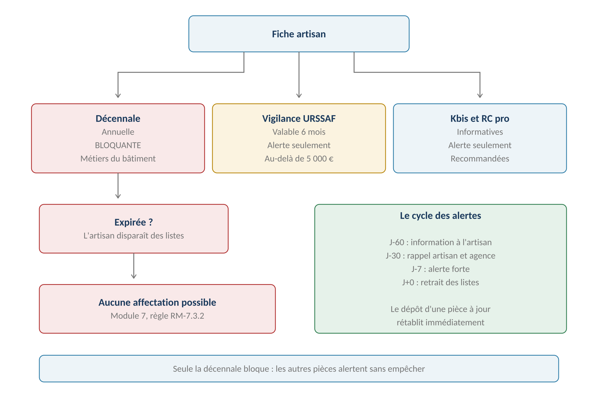
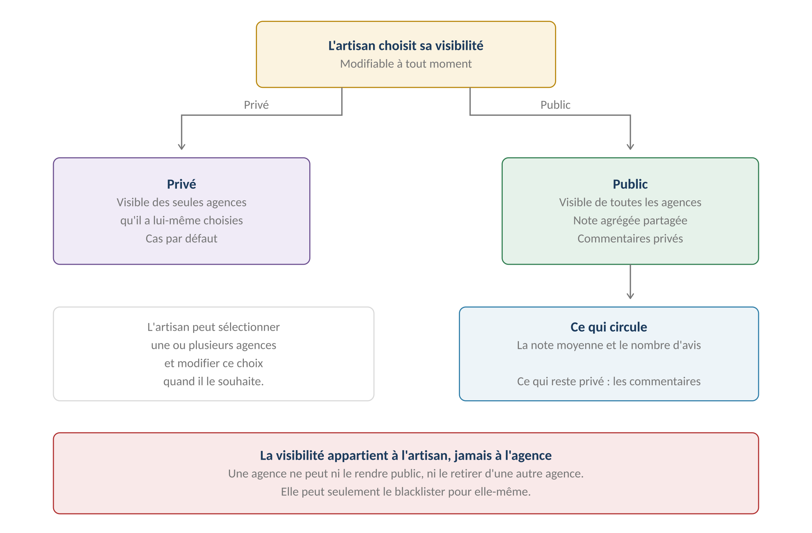
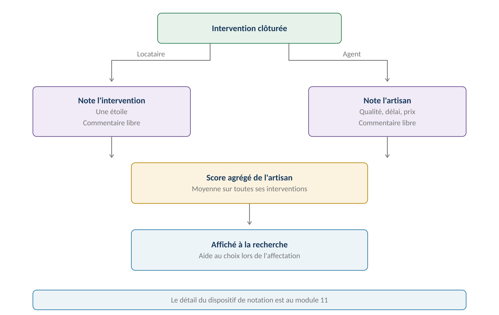
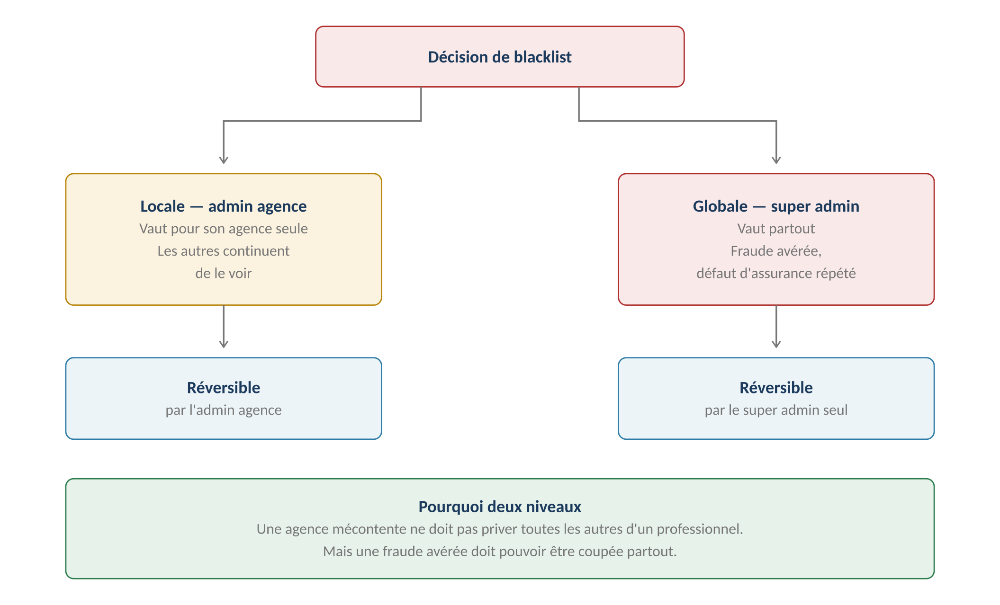

**GERIMMO V3**

Référentiel des parcours clients

**MODULE 8**

**Artisans**

|               |                                                           |
|:--------------|:----------------------------------------------------------|
| **Périmètre** | 5 parcours · 2 objets métier                              |
| **Dépend de** | Module 16 — invitation des utilisateurs                   |
| **Alimente**  | **Incidents (7.3) · Devis (9.1) · Notation (11.2)**       |
| **Enjeu**     | **Aucun artisan sans assurance valide chez un locataire** |
| **Statut**    | **Module clos — aucune question ouverte**                 |

> **Vue d'ensemble du module**
>
> **Ce module rend applicable une règle du module 7**
>
> RM-7.3.2 pose qu'un artisan sans décennale valide n'est jamais proposé
>
> à l'affectation d'un incident.
>
> Encore faut-il suivre les pièces et leurs dates d'expiration.
>
> C'est l'objet du parcours 8.2, cœur de ce module.

**Les pièces suivies**

------------------------------------------------------------------------

*Schéma 1 — Seule la décennale bloque ; les autres pièces alertent*

**Objets créés dans ce module**

------------------------------------------------------------------------

| **Objet** | **Description** | **Rattaché à** |
|:---|:---|:---|
| **Artisan** | Entreprise ou indépendant, avec ses métiers et sa zone | Agence ou public |
| **Pièce justificative** | Document daté, versionné comme au module 0b | Artisan |

**Cartographie des 5 parcours**

------------------------------------------------------------------------

| **\#** | **Parcours** | **Persona** | **V1 / V2** | **Criticité** |
|:---|:---|:---|:---|:---|
| 8.1 | Création d'une fiche artisan | AA | **V1** | Moyenne |
| 8.2 | **Pièces et alertes d'expiration** | AR / Système | **V1** | **MAXIMALE** |
| 8.3 | Recherche par métier et zone | AG | **V1** | Haute |
| 8.4 | Profil de l'artisan | AR | **V1** | Moyenne |
| 8.5 | Désactivation et blacklist | AA / SA | **V1** | Haute |

> **8.1 — Création d'une fiche artisan**

|                     |                                                      |
|:--------------------|:-----------------------------------------------------|
| **Persona**         | AA — Admin agence                                    |
| **Déclencheur**     | L'agence commence à travailler avec un professionnel |
| **Fréquence**       | Occasionnelle                                        |
| **Criticité**       | Moyenne                                              |
| **Suite naturelle** | Invitation de l'artisan à compléter son profil (8.4) |

**Parcours nominal**

------------------------------------------------------------------------

| **\#** | **Acteur** | **Action** | **Écran / état** |
|:---|:---|:---|:---|
| 1 | AA | Clique « Nouvel artisan » | Annuaire |
| 2 | **Système** | **Vérifie si l'artisan existe déjà en public** | Recherche SIRET |
| 3 | AA | Saisit raison sociale, SIRET, coordonnées | Formulaire |
| 4 | AA | Coche les métiers exercés | Liste fermée |
| 5 | AA | Définit la zone d'intervention | Codes postaux |
| 6 | AA | Valide | — |
| 7 | **Système** | Crée la fiche en état incomplet | — |
| 8 | AA | **Invite l'artisan à déposer ses pièces et fixer sa visibilité** | Module 16 |

> **L'agence crée la fiche, l'artisan la maîtrise**
>
> L'admin agence pose les informations qu'elle connaît : nom, métier, zone.
>
> Puis elle invite l'artisan, qui dépose lui-même ses attestations,
>
> maintient ses coordonnées à jour, et surtout décide de sa visibilité.
>
> C'est ce qui décharge l'agence du suivi documentaire.

**Les métiers**

------------------------------------------------------------------------

| **Métier**                   | **Décennale requise**    |
|:-----------------------------|:-------------------------|
| **Plomberie**                | **Oui**                  |
| **Chauffage**                | **Oui**                  |
| **Électricité**              | **Oui**                  |
| **Menuiserie**               | **Oui**                  |
| **Serrurerie**               | **Oui**                  |
| **Maçonnerie et couverture** | **Oui**                  |
| **Peinture et revêtements**  | **Oui**                  |
| **Nettoyage**                | Non                      |
| **Espaces verts**            | Non                      |
| **Diagnostic immobilier**    | Certification spécifique |
| **Débarras et déménagement** | Non                      |

**Public ou privé**

------------------------------------------------------------------------

*Schéma 2 — La note circule, les commentaires restent privés*

> **La visibilité appartient à l'artisan — décision actée**
>
> C'est lui, et lui seul, qui décide d'être public ou de rester privé
>
> à une ou plusieurs agences de son choix.
>
> Une agence ne peut ni le rendre public, ni le retirer d'une autre agence.
>
> Elle peut seulement le blacklister pour elle-même (8.5).
>
> Ce qui circule : la note moyenne et le nombre d'avis.
>
> Ce qui reste privé : les commentaires, propres à l'agence qui les a écrits.

**Variantes**

------------------------------------------------------------------------

| **Code** | **Situation** | **Comportement** |
|:---|:---|:---|
| **V1** | **Artisan déjà public** | L'agence le rattache au lieu de le créer. Ses pièces sont déjà là. |
| **V2** | Artisan multi-métiers | Plusieurs métiers cochés. Il apparaît dans chaque recherche. |
| **V3** | Artisan indépendant | Pas de raison sociale, seulement un nom et un SIRET. |
| **V4** | **Passage de privé à public** | Décidé par l'artisan seul, à tout moment (8.4). |
| **V5** | Création par import | Arrive via le parcours 0.12 ou 16.3. |

**Cas d'erreur**

------------------------------------------------------------------------

| **Cas** | **Comportement attendu** |
|:---|:---|
| SIRET déjà connu en public | Proposition de rattachement plutôt que création |
| SIRET invalide | Alerte, la création reste possible |
| Aucun métier coché | **BLOCAGE — la recherche par métier en dépend** |
| Artisan blacklisté globalement | **BLOCAGE — création refusée** |

**Règles métier**

------------------------------------------------------------------------

> **RM-8.1.1** — Le SIRET est la clé d'unicité fonctionnelle d'un artisan.
>
> **RM-8.1.2** — Un artisan porte un ou plusieurs métiers, choisis dans une liste fermée.
>
> **RM-8.1.3** — La zone d'intervention est définie par codes postaux.
>
> **RM-8.1.4** — Un artisan est privé par défaut ; seul l'artisan peut le rendre public.
>
> **RM-8.1.5** — Un artisan public existant est rattaché, jamais dupliqué.
>
> **RM-8.1.6** — Un artisan blacklisté globalement ne peut être recréé.

**User story**

------------------------------------------------------------------------

> **US-8.1.1**
>
> *En tant qu'admin agence, je veux rattacher un artisan déjà public plutôt que le recréer, afin de bénéficier de ses pièces et de sa note.*

- **Étant donné** un SIRET correspondant à un artisan public, **quand** je le saisis, **alors** le rattachement m'est proposé avec sa note et ses pièces à jour

> **8.2 — Pièces justificatives et alertes**
>
> **Le parcours qui protège l'agence**
>
> Envoyer un artisan sans décennale chez un locataire engage la responsabilité
>
> de l'agence en cas de sinistre.
>
> Ce parcours garantit que cela ne peut pas arriver : l'artisan disparaît
>
> automatiquement des listes d'affectation dès que son assurance expire.

|                    |                                         |
|:-------------------|:----------------------------------------|
| **Persona**        | AR (dépôt) · Système (alertes)          |
| **Déclencheur**    | Inscription, puis renouvellement annuel |
| **Fréquence**      | Au moins annuelle                       |
| **Criticité**      | MAXIMALE                                |
| **Décision actée** | L'artisan dépose lui-même ses documents |

**Les pièces et leur effet**

------------------------------------------------------------------------

| **Pièce** | **Validité** | **Effet à expiration** | **Obligatoire** |
|:---|:---|:---|:---|
| **Assurance décennale** | Annuelle | **BLOCAGE de l'affectation** | Métiers du bâtiment |
| **Vigilance URSSAF** | 6 mois | Alerte seule | Au-delà de 5 000 € |
| **RC professionnelle** | Annuelle | Alerte seule | Recommandée |
| **Extrait Kbis** | 3 mois | Alerte seule | Recommandée |
| **RIB** | Sans expiration | Aucun | Pour la facturation |
| **Certification métier** | Variable | Alerte seule | Selon métier |

> **Pourquoi seule la décennale bloque**
>
> La décennale couvre les dommages qui compromettent la solidité de l'ouvrage
>
> ou le rendent impropre à sa destination. Sans elle, un sinistre reste à la charge
>
> de celui qui a fait intervenir l'artisan.
>
> Les autres pièces protègent l'agence sur d'autres terrains — travail dissimulé,
>
> existence de l'entreprise — mais leur absence ne crée pas le même risque immédiat.
>
> **Le blocage suit la nature des travaux — décision révisée**
>
> Tous les travaux ne relèvent pas de la garantie décennale.
>
> Changer un joint, déboucher une canalisation ou remplacer une ampoule
>
> sont des interventions d'entretien courant.
>
> Le blocage ne s'applique donc qu'aux interventions qui touchent
>
> la solidité de l'ouvrage ou ses éléments d'équipement indissociables.
>
> L'agent qualifie la nature de l'intervention au moment de l'affectation.

**Quelles interventions exigent une décennale**

------------------------------------------------------------------------

| **Nature de l'intervention** | **Décennale requise** | **Exemples** |
|:---|:---|:---|
| **Entretien courant** | **Non** | Joint, débouchage, ampoule, purge |
| **Réparation simple** | **Non** | Robinet, serrure, vitre |
| **Remplacement d'équipement** | **Oui** | Chaudière, ballon, VMC |
| **Travaux sur le clos et couvert** | **Oui** | Toiture, fenêtre, façade |
| **Réseaux encastrés** | **Oui** | Plomberie, électricité en saignée |
| **Gros œuvre** | **Oui** | Structure, murs porteurs |

**Le cycle des alertes**

------------------------------------------------------------------------

| **Seuil** | **Destinataire**  | **Niveau**   | **Effet**                |
|:----------|:------------------|:-------------|:-------------------------|
| **J-60**  | Artisan           | Information  | Rappel de renouvellement |
| **J-30**  | Artisan et agence | Warning      | Rappel appuyé            |
| **J-7**   | Artisan et agence | **Critique** | Dernier rappel           |
| **J+0**   | Agence            | **Bloquant** | **Retrait des listes**   |

**Parcours nominal — dépôt par l'artisan**

------------------------------------------------------------------------

| **\#** | **Acteur** | **Action** | **Écran / état** |
|:---|:---|:---|:---|
| 1 | **Système** | Envoie l'alerte J-60 à l'artisan | Email |
| 2 | AR | Se connecte à son espace | Espace artisan |
| 3 | AR | Dépose son attestation renouvelée | Upload |
| 4 | AR | Saisit la date d'expiration | Formulaire |
| 5 | **Système** | Enregistre en nouvelle version, historique conservé | — |
| 6 | **Système** | Annule les alertes en cours | — |
| 7 | **Système** | **Rétablit l'artisan dans les listes s'il en était sorti** | — |
| 8 | **Système** | Notifie les agences concernées | — |

**Variantes**

------------------------------------------------------------------------

| **Code** | **Situation** | **Comportement** |
|:---|:---|:---|
| **V1** | **Dépôt par l'agence** | L'artisan envoie par email, l'admin agence dépose pour lui. |
| **V2** | Artisan public | Ses pièces valent pour toutes les agences qui le référencent. |
| **V3** | **Intervention en cours à l'expiration** | Elle se poursuit. Seules les nouvelles affectations sont bloquées. |
| **V4** | Métier sans décennale | Nettoyage, espaces verts : aucun blocage possible. |
| **V5** | **Extraction automatique de la date** | V2 — lecture du document (transverse modules 0, 0b, 8, 9) |

**Cas d'erreur**

------------------------------------------------------------------------

| **Cas** | **Comportement attendu** |
|:---|:---|
| Décennale expirée | **Retrait automatique des listes d'affectation** |
| Date d'expiration non saisie | **BLOCAGE — l'alerte en dépend** |
| Date déjà passée au dépôt | Accepté, badge « expiré » immédiat |
| Artisan sans email | **BLOCAGE — il ne pourrait recevoir aucune alerte** |

**Règles métier**

------------------------------------------------------------------------

> **RM-8.2.1** — L'artisan dépose lui-même ses pièces ; l'agence peut le faire pour lui.
>
> **RM-8.2.2** — Une décennale expirée retire l'artisan des seules interventions relevant de la garantie décennale.
>
> **RM-8.2.9** — L'exigence de décennale est liée à la nature des travaux, non au métier de l'artisan.
>
> **RM-8.2.3** — Les autres pièces alertent sans bloquer.
>
> **RM-8.2.4** — Toutes les versions d'une pièce sont conservées, seule la dernière affichée.
>
> **RM-8.2.5** — Seuils d'alerte : J-60, J-30, J-7 et J+0.
>
> **RM-8.2.6** — Le dépôt d'une pièce à jour rétablit immédiatement l'artisan.
>
> **RM-8.2.7** — Une intervention en cours n'est pas interrompue par une expiration.
>
> **RM-8.2.8** — Les pièces d'un artisan public valent pour toutes les agences.

**User stories**

------------------------------------------------------------------------

> **US-8.2.1**
>
> *En tant qu'artisan, je veux déposer mon attestation moi-même, afin de rester référencé sans dépendre de l'agence.*

- **Étant donné** une alerte reçue soixante jours avant expiration, **quand** je dépose ma nouvelle attestation, **alors** les alertes s'arrêtent et je reste disponible

- **Étant donné** que j'ai laissé expirer ma décennale, **quand** je la renouvelle et la dépose, **alors** je réapparais immédiatement dans les listes

> **US-8.2.2**
>
> *En tant qu'agent immobilier, je veux qu'un artisan sans décennale disparaisse des listes, afin de ne jamais l'envoyer par inadvertance.*

- **Étant donné** un artisan dont la décennale expire aujourd'hui, **quand** je cherche à affecter un incident, **alors** il n'apparaît pas dans la liste

- **Étant donné** une intervention déjà en cours avec cet artisan, **quand** sa décennale expire, **alors** l'intervention se poursuit normalement

> **8.3 & 8.4 — Recherche et profil**

**8.3 — Recherche par métier et zone**

------------------------------------------------------------------------

|                         |                                 |
|:------------------------|:--------------------------------|
| **Persona**             | AG — Agent immobilier           |
| **Déclencheur**         | Affectation d'un incident (7.3) |
| **Fréquence**           | À chaque affectation            |
| **Criticité**           | Haute                           |
| **Filtre systématique** | **Décennale valide (RM-8.2.2)** |

| **Critère**          | **Fonctionnement**                                |
|:---------------------|:--------------------------------------------------|
| **Métier**           | Déduit de la catégorie de l'incident, modifiable  |
| **Zone**             | Code postal du lot comparé à la zone de l'artisan |
| **Décennale valide** | **Filtre systématique et non désactivable**       |
| **Blacklist**        | Exclusion des artisans blacklistés par l'agence   |
| **Note**             | Tri par score décroissant (module 11)             |
| **Visibilité**       | Artisans privés de l'agence, plus les publics     |

**Le score dans la recherche**

------------------------------------------------------------------------

*Schéma 3 — Le score agrégé aide au choix lors de l'affectation*

> **Trois sources alimentent le score**
>
> Le locataire note l'intervention : il est le seul témoin du travail sur place.
>
> Le gérant note l'artisan : il voit le respect du devis et le rapport qualité-prix.
>
> La plateforme calcule une fiabilité : délais de réponse, refus, RDV manqués.
>
> Le score composite apparaît à la recherche et permet de trier.

**La composition du score**

------------------------------------------------------------------------

| **Source**     | **Ce qu'elle évalue**                    | **Poids** |
|:---------------|:-----------------------------------------|:----------|
| **Gérant**     | Qualité, délai, rapport qualité-prix     | **50 %**  |
| **Locataire**  | Satisfaction de l'intervention sur place | 25 %      |
| **Plateforme** | Fiabilité calculée automatiquement       | 25 %      |

> **Pourquoi le gérant pèse le plus**
>
> Il est le seul à voir l'ensemble : la qualité du travail, le respect du devis,
>
> le sérieux du compte rendu et le prix pratiqué.
>
> Le locataire juge ce qu'il a vu — la ponctualité, la propreté, le comportement.
>
> On ne lui demande pas d'évaluer un prix qu'il n'a pas payé.

**Le score de fiabilité automatique**

------------------------------------------------------------------------

| **Indicateur**               | **Ce qu'il mesure**                     |
|:-----------------------------|:----------------------------------------|
| **Délai d'acceptation**      | Temps entre l'affectation et la réponse |
| **Délai d'intervention**     | Temps entre l'acceptation et la visite  |
| **Taux de refus**            | Proportion de missions déclinées        |
| **RDV manqués**              | Absences signalées par le locataire     |
| **Ponctualité documentaire** | Pièces déposées avant expiration        |

> **Ce que l'artisan voit — décisions actées**
>
> Sa moyenne : oui. Le détail de qui a noté quoi : non.
>
> Son score de fiabilité automatique : oui — le cacher serait déloyal.
>
> La note du locataire est demandée systématiquement, avec relance à J+3 et J+7.
>
> Sans réponse, l'intervention est classée sans note et n'entre pas dans le calcul.
>
> Le dispositif complet est spécifié au module 11.

**8.4 — Profil de l'artisan**

------------------------------------------------------------------------

|                       |                                    |
|:----------------------|:-----------------------------------|
| **Persona**           | AR — Artisan                       |
| **Déclencheur**       | Invitation reçue, puis maintenance |
| **Fréquence**         | À l'inscription, puis ponctuelle   |
| **Criticité**         | Moyenne                            |
| **Ce qu'il maîtrise** | Coordonnées, pièces, disponibilité |

| **Élément** | **Qui le renseigne** | **Modifiable par l'artisan** |
|:---|:---|:---|
| **Raison sociale et SIRET** | Agence à la création | Oui |
| **Coordonnées** | Agence puis artisan | Oui |
| **Métiers** | Agence | Proposition, validée par l'agence |
| **Zone d'intervention** | Agence puis artisan | Oui |
| **Pièces justificatives** | **Artisan** | Oui |
| **Disponibilité** | Artisan | Oui |
| **Visibilité** | **Artisan** | **Oui — lui seul** |
| **Note et commentaires** | Agences et locataires | Non |

> **L'artisan ne maîtrise pas sa note**
>
> Il la consulte mais ne peut ni la modifier ni y répondre publiquement.
>
> Il peut en revanche contacter l'agence par la messagerie s'il conteste
>
> une évaluation — le dispositif est au module 11.

**Règles métier**

------------------------------------------------------------------------

> **RM-8.3.1** — La recherche filtre systématiquement sur la décennale valide.
>
> **RM-8.3.2** — Le métier est déduit de la catégorie de l'incident, modifiable.
>
> **RM-8.3.3** — La zone est comparée au code postal du lot.
>
> **RM-8.3.4** — Les artisans blacklistés par l'agence sont exclus.
>
> **RM-8.3.5** — Le tri par défaut se fait sur le score décroissant.
>
> **RM-8.4.1** — L'artisan maîtrise ses coordonnées, ses pièces et sa disponibilité.
>
> **RM-8.4.2** — L'artisan maîtrise seul sa visibilité : public, ou privé à des agences choisies.
>
> **RM-8.4.4** — Il ne peut ni modifier sa note, ni y répondre publiquement.
>
> **RM-8.4.3** — Une modification de métier est proposée puis validée par l'agence.

**User story**

------------------------------------------------------------------------

> **US-8.3.1**
>
> *En tant qu'agent immobilier, je veux voir la note des artisans dans la liste, afin de choisir le plus fiable pour un locataire difficile.*

- **Étant donné** quatre plombiers disponibles dans la zone, **quand** j'ouvre la liste, **alors** ils sont triés par note décroissante avec leur nombre d'avis

> **8.5 — Désactivation et blacklist**

|                    |                                      |
|:-------------------|:-------------------------------------|
| **Persona**        | AA — Admin agence · SA — Super admin |
| **Déclencheur**    | Fin de relation, ou faute grave      |
| **Fréquence**      | Rare                                 |
| **Criticité**      | Haute                                |
| **Décision actée** | Deux niveaux, réversibles            |

**Les deux niveaux**

------------------------------------------------------------------------

*Schéma 4 — Une agence mécontente ne prive pas les autres*

| **Action**            | **Qui**         | **Portée**         | **Réversible par** |
|:----------------------|:----------------|:-------------------|:-------------------|
| **Désactivation**     | Admin agence    | Son agence         | Admin agence       |
| **Blacklist locale**  | Admin agence    | Son agence         | Admin agence       |
| **Blacklist globale** | **Super admin** | Toutes les agences | Super admin seul   |

> **Désactivation et blacklist ne sont pas la même chose**
>
> La désactivation est neutre : l'agence ne travaille plus avec cet artisan,
>
> sans jugement. Il disparaît de ses listes.
>
> La blacklist est motivée : malfaçon répétée, comportement inapproprié,
>
> défaut d'assurance dissimulé. Le motif est obligatoire et conservé.

**Parcours nominal — blacklist locale**

------------------------------------------------------------------------

| **\#** | **Acteur** | **Action** | **Écran / état** |
|:---|:---|:---|:---|
| 1 | AA | Ouvre la fiche de l'artisan | Annuaire |
| 2 | AA | Clique « Blacklister » | — |
| 3 | AA | **Saisit le motif** | Champ obligatoire |
| 4 | **Système** | Vérifie l'absence d'intervention en cours | Blocage si oui |
| 5 | AA | Confirme | — |
| 6 | **Système** | Retire l'artisan des listes de cette agence | — |
| 7 | **Système** | **Les autres agences ne sont pas affectées** | — |

**Parcours — blacklist globale**

------------------------------------------------------------------------

| **\#** | **Acteur** | **Action** | **Écran / état** |
|:---|:---|:---|:---|
| 1 | SA | Depuis la console, ouvre l'artisan | Super admin |
| 2 | SA | Consulte les blacklists locales existantes | Historique |
| 3 | SA | **Blackliste globalement avec motif** | Champ obligatoire |
| 4 | **Système** | Retire l'artisan de toutes les agences | — |
| 5 | **Système** | Notifie les agences concernées | — |
| 6 | **Système** | Empêche toute recréation (RM-8.1.6) | — |

> **Quand blacklister globalement**
>
> Le super admin ne juge pas la qualité du travail — c'est l'affaire de chaque agence.
>
> Il intervient sur des faits objectifs : fausse attestation d'assurance,
>
> entreprise radiée, travail dissimulé avéré, comportement grave signalé
>
> par plusieurs agences.
>
> Plusieurs blacklists locales convergentes sont un signal, pas une preuve.

**Variantes**

------------------------------------------------------------------------

| **Code** | **Situation** | **Comportement** |
|:---|:---|:---|
| **V1** | Simple désactivation | Sans motif. Réversible immédiatement. |
| **V2** | **Intervention en cours** | BLOCAGE : la terminer ou la réaffecter d'abord. |
| **V3** | Artisan public blacklisté localement | Reste visible et disponible pour les autres agences. |
| **V4** | **Levée de blacklist globale** | Le super admin seul peut la lever, avec motif tracé. |
| **V5** | Devis en attente | Annulé automatiquement à la blacklist. |

**Règles métier**

------------------------------------------------------------------------

> **RM-8.5.1** — La désactivation est neutre et sans motif ; la blacklist exige un motif.
>
> **RM-8.5.2** — Une blacklist locale ne vaut que pour l'agence qui la prononce.
>
> **RM-8.5.3** — Seul le super admin peut blacklister globalement.
>
> **RM-8.5.4** — Une blacklist globale est réversible par le super admin seul.
>
> **RM-8.5.5** — Aucune blacklist n'est possible avec une intervention en cours.
>
> **RM-8.5.6** — Les motifs de blacklist sont conservés indéfiniment.
>
> **RM-8.5.7** — Les devis en attente sont annulés à la blacklist.

**User stories**

------------------------------------------------------------------------

> **US-8.5.1**
>
> *En tant qu'admin agence, je veux blacklister sans priver les autres agences, afin que ma décision n'engage que moi.*

- **Étant donné** un artisan public que je blackliste, **quand** une autre agence le recherche, **alors** il lui apparaît normalement

> **US-8.5.2**
>
> *En tant que super admin, je veux blacklister globalement en cas de fraude, afin de protéger toutes les agences.*

- **Étant donné** une fausse attestation d'assurance constatée, **quand** je blackliste globalement avec motif, **alors** l'artisan disparaît de toutes les agences et ne peut être recréé

- **Étant donné** une blacklist globale prononcée par erreur, **quand** je la lève, **alors** l'artisan redevient disponible et la levée est tracée

> **Synthèse du module**

**Les règles métier les plus structurantes**

------------------------------------------------------------------------

| **Code** | **Règle** | **Bloquant** |
|:---|:---|:---|
| **RM-8.1.1** | Le SIRET est la clé d'unicité | Structurel |
| **RM-8.1.5** | Un artisan public est rattaché, jamais dupliqué | Structurel |
| **RM-8.4.2** | **L'artisan maîtrise seul sa visibilité** | Structurel |
| **RM-8.2.1** | **L'artisan dépose lui-même ses pièces** | Structurel |
| **RM-8.2.2** | **Décennale expirée = retrait des interventions concernées** | **Oui** |
| **RM-8.2.9** | **L'exigence suit la nature des travaux** | Structurel |
| **RM-8.2.3** | Les autres pièces alertent sans bloquer | Non |
| **RM-8.2.6** | Le dépôt à jour rétablit immédiatement | Structurel |
| **RM-8.2.7** | Une intervention en cours n'est pas interrompue | Structurel |
| **RM-8.2.8** | Les pièces d'un artisan public valent partout | Structurel |
| **RM-8.3.1** | Filtre décennale non désactivable | **Oui** |
| **RM-8.5.2** | **Une blacklist locale n'engage que son agence** | Structurel |
| **RM-8.5.3** | Seul le super admin blackliste globalement | **Oui** |
| **RM-8.5.5** | Aucune blacklist avec intervention en cours | **Oui** |

**Décompte des user stories**

------------------------------------------------------------------------

| **Parcours** | **User stories** | **Critères d'acceptation** |
|:---|:---|:---|
| 8.1 — Création de fiche | 1 | 1 |
| **8.2 — Pièces et alertes** | **2** | **4** |
| 8.3 & 8.4 — Recherche et profil | 1 | 1 |
| 8.5 — Blacklist | 2 | 3 |
| **TOTAL** | **6** | **9** |

**Décisions actées sur ce module**

------------------------------------------------------------------------

| **Décision**                                     | **Statut**           |
|:-------------------------------------------------|:---------------------|
| **Décennale liée à la nature des travaux**       | **Décision révisée** |
| L'artisan dépose lui-même ses documents          | **Acté**             |
| L'agence peut l'inviter                          | **Acté**             |
| **La visibilité est décidée par l'artisan**      | **Acté**             |
| Privé à une ou plusieurs agences de son choix    | **Acté**             |
| Note publique, commentaires privés               | **Acté**             |
| Blacklist locale par l'admin agence              | **Acté**             |
| Blacklist globale par le super admin, réversible | **Acté**             |
| Scoring à chaque intervention                    | **Acté**             |
| Extraction automatique des dates de pièces       | **V2**               |
| Vérification en ligne des attestations           | **Hors périmètre**   |
| Paiement des artisans                            | **Hors périmètre**   |

**Ce que ce module impose ailleurs**

------------------------------------------------------------------------

| **Module** | **Conséquence** |
|:---|:---|
| **Module 7 — Incidents** | **Le filtre décennale rend RM-7.3.2 applicable** |
| **Module 9 — Devis** | Les devis en attente sont annulés à la blacklist |
| **Module 11 — Notation** | **Le score alimente le tri de la recherche** |
| **Module 16 — Invitations** | L'invitation de l'artisan suit le circuit commun |
| **Module 18 — Super admin** | La blacklist globale se pilote depuis la console |

**Prochaine étape**

------------------------------------------------------------------------

> **Module 9 — Devis et facturation artisan**
>
> Huit parcours : demande de devis, dépôt, comparaison, validation,
>
> accord du propriétaire au-delà du seuil, relance, facture et imputation comptable.
>
> C'est le module qui relie l'intervention à la comptabilité.
