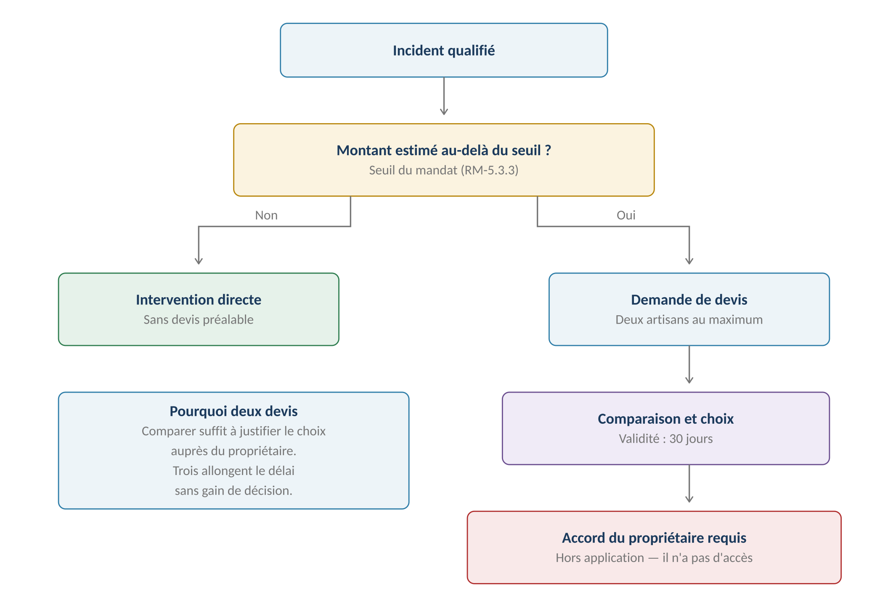
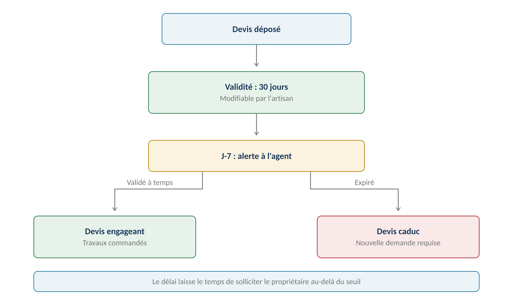
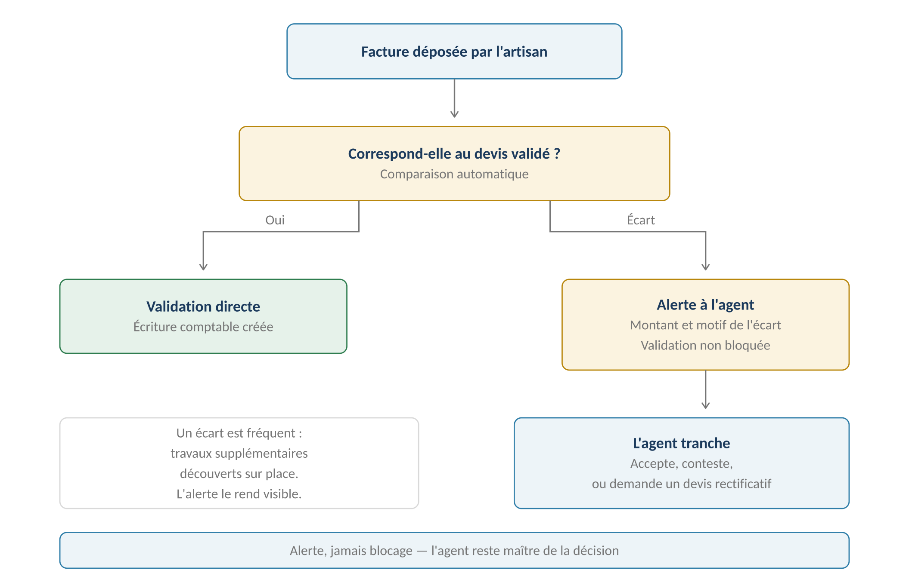
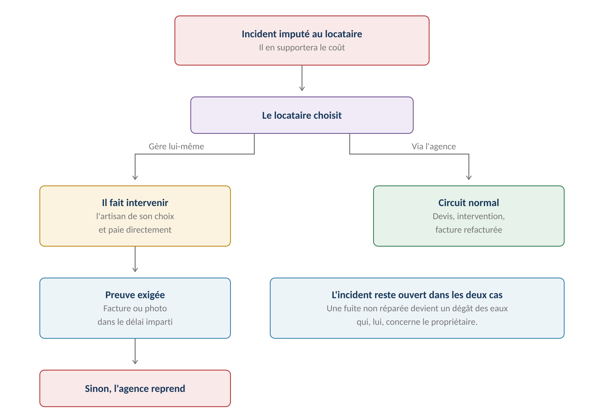

**GERIMMO V3**

Référentiel des parcours clients

**MODULE 9**

**Devis et facturation**

|               |                                                             |
|:--------------|:------------------------------------------------------------|
| **Périmètre** | 8 parcours · 2 objets métier                                |
| **Dépend de** | Module 7 (incident) · Module 8 (artisan) · Module 5 (seuil) |
| **Alimente**  | **Comptabilité (4.1) · Rapport propriétaire (6.2)**         |
| **Rôle**      | Relie l'intervention à la comptabilité                      |
| **Statut**    | **Module clos — aucune question ouverte**                   |

> **Vue d'ensemble du module**

**Quand un devis est nécessaire**

------------------------------------------------------------------------

*Schéma 1 — Le seuil du mandat décide si un devis est requis*

> **Deux devis au maximum — décision actée**
>
> Comparer deux propositions suffit à justifier le choix auprès du propriétaire.
>
> Trois allongent le délai sans améliorer la décision, et un artisan sollicité
>
> systématiquement sans jamais être retenu finit par ne plus répondre.

**Objets créés dans ce module**

------------------------------------------------------------------------

| **Objet** | **Description** | **Rattaché à** |
|:---|:---|:---|
| **Devis** | Proposition chiffrée, avec durée de validité | Incident + Artisan |
| **Facture** | Document émis après intervention | Intervention |

**Cartographie des 8 parcours**

------------------------------------------------------------------------

| **\#** | **Parcours**                 | **Persona** | **V1 / V2** | **Criticité** |
|:-------|:-----------------------------|:------------|:------------|:--------------|
| 9.1    | Demande de devis             | AG          | **V1**      | Haute         |
| 9.2    | Dépôt d'un devis             | AR          | **V1**      | Moyenne       |
| 9.3    | Comparaison des devis        | AG          | **V1**      | Moyenne       |
| 9.4    | Validation ou refus          | AG          | **V1**      | Haute         |
| 9.5    | **Accord du propriétaire**   | AG → PM     | **V1**      | **MAXIMALE**  |
| 9.6    | Relance d'un devis           | Système     | **V2**      | Faible        |
| 9.7    | Dépôt de la facture          | AR          | **V1**      | Haute         |
| 9.8    | **Validation et imputation** | AG          | **V1**      | **MAXIMALE**  |

> **9.1 à 9.4 — Du devis à la validation**

**9.1 — Demande de devis**

------------------------------------------------------------------------

|                 |                                               |
|:----------------|:----------------------------------------------|
| **Persona**     | AG — Agent immobilier                         |
| **Déclencheur** | Incident dont le coût estimé dépasse le seuil |
| **Fréquence**   | Régulière                                     |
| **Criticité**   | Haute                                         |
| **Limite**      | **Deux artisans au maximum**                  |

| **\#** | **Acteur** | **Action** | **Écran / état** |
|:---|:---|:---|:---|
| 1 | AG | Depuis l'incident qualifié, clique « Demander un devis » | Fiche incident |
| 2 | **Système** | Propose les artisans du métier, décennale valide (8.3) | Liste filtrée |
| 3 | AG | **Sélectionne un ou deux artisans** | Cases à cocher |
| 4 | AG | Précise le besoin et joint les photos de l'incident | Formulaire |
| 5 | AG | Envoie | — |
| 6 | **Système** | Notifie chaque artisan | Espace artisan |
| 7 | **Système** | Passe l'incident en attente de devis | — |

**9.2 — Dépôt d'un devis**

------------------------------------------------------------------------

| **\#** | **Acteur** | **Action** | **Écran / état** |
|:---|:---|:---|:---|
| 1 | AR | Consulte la demande et les photos | Espace artisan |
| 2 | AR | Peut demander une visite préalable | Module 10 |
| 3 | AR | Saisit le montant et le détail des prestations | Formulaire |
| 4 | AR | Indique le délai d'intervention | Formulaire |
| 5 | AR | **Fixe la durée de validité — 30 jours par défaut** | Modifiable |
| 6 | AR | Joint le devis en PDF | Upload |
| 7 | AR | Valide | — |
| 8 | **Système** | Notifie l'agent | — |

**La validité du devis**

------------------------------------------------------------------------

*Schéma 2 — Trente jours par défaut, avec alerte avant expiration*

> **Trente jours par défaut — décision actée**
>
> C'est l'usage courant du bâtiment, et le délai laisse le temps de solliciter
>
> le propriétaire quand le seuil du mandat est dépassé.
>
> L'artisan peut le modifier — plus court sur un matériau dont le prix fluctue,
>
> plus long sur une prestation stable.
>
> Une alerte à J-7 permet de relancer avant caducité.

**9.3 — Comparaison des devis**

------------------------------------------------------------------------

| **Élément comparé**        | **Affichage**                                |
|:---------------------------|:---------------------------------------------|
| **Montant total**          | Côte à côte, écart en pourcentage            |
| **Détail des prestations** | Ligne à ligne quand la structure le permet   |
| **Délai d'intervention**   | En jours                                     |
| **Validité restante**      | Jours avant expiration                       |
| **Note de l'artisan**      | **Score composite (module 11)**              |
| **Historique**             | Nombre d'interventions passées pour l'agence |

> **Le moins cher n'est pas toujours le bon choix**
>
> La comparaison affiche la note de l'artisan à côté du montant.
>
> Un écart de 15 % sur le prix pèse peu face à un artisan qui ne se présente pas
>
> au rendez-vous ou dont le travail est à refaire six mois plus tard.

**9.4 — Validation ou refus**

------------------------------------------------------------------------

| **\#** | **Acteur** | **Action** | **Écran / état** |
|:---|:---|:---|:---|
| 1 | AG | Compare les devis reçus | Tableau comparatif |
| 2 | **Système** | **Vérifie si le montant dépasse le seuil du mandat** | — |
| 3 | AG | **Si oui : sollicite le propriétaire (9.5)** | Hors application |
| 4 | AG | Valide un devis | — |
| 5 | **Système** | Notifie l'artisan retenu | — |
| 6 | **Système** | **Notifie et clôture les devis non retenus** | — |
| 7 | **Système** | Passe l'incident en affecté | — |

> **Prévenir les artisans non retenus**
>
> Un artisan qui prépare un devis engage du temps, parfois un déplacement.
>
> Le laisser sans réponse le dissuade de répondre la fois suivante.
>
> La notification de refus est automatique et immédiate.

**Variantes**

------------------------------------------------------------------------

| **Code** | **Situation** | **Comportement** |
|:---|:---|:---|
| **V1** | Un seul devis demandé | Possible quand l'agence connaît bien l'artisan. |
| **V2** | Aucun devis reçu | Relance manuelle en V1, automatique en V2 (9.6). |
| **V3** | **Devis expiré avant validation** | Caduc. Une nouvelle demande est nécessaire. |
| **V4** | Refus des deux devis | L'incident revient en qualifié. Nouvelle demande possible. |
| **V5** | **Artisan blacklisté entre-temps** | Son devis est annulé automatiquement (RM-8.5.7). |
| **V6** | Visite préalable nécessaire | L'artisan la demande avant de chiffrer (module 10). |

**Cas d'erreur**

------------------------------------------------------------------------

| **Cas** | **Comportement attendu** |
|:---|:---|
| Plus de deux artisans sollicités | **BLOCAGE — limite de deux** |
| Validation au-delà du seuil sans accord | **BLOCAGE — l'accord du propriétaire est requis** |
| Devis expiré | **BLOCAGE de la validation** |
| Artisan sans décennale valide | **Non proposé à la demande (RM-8.3.1)** |

**Règles métier**

------------------------------------------------------------------------

> **RM-9.1.1** — Deux artisans au maximum peuvent être sollicités en parallèle.
>
> **RM-9.1.2** — Seuls les artisans à décennale valide sont proposés.
>
> **RM-9.2.1** — La durée de validité est de trente jours par défaut, modifiable par l'artisan.
>
> **RM-9.2.2** — Une alerte est envoyée à l'agent sept jours avant expiration.
>
> **RM-9.2.3** — Un devis expiré ne peut plus être validé.
>
> **RM-9.3.1** — La comparaison affiche la note de l'artisan à côté du montant.
>
> **RM-9.4.1** — Les artisans non retenus sont notifiés automatiquement.
>
> **RM-9.4.2** — Aucune validation au-delà du seuil sans accord du propriétaire tracé.
>
> **RM-9.4.3** — Un devis d'artisan blacklisté est annulé automatiquement.

**User stories**

------------------------------------------------------------------------

> **US-9.2.1**
>
> *En tant qu'agent immobilier, je veux être alerté avant expiration d'un devis, afin de ne pas devoir tout recommencer.*

- **Étant donné** un devis valable trente jours, **quand** il reste sept jours de validité, **alors** une alerte m'invite à le valider ou à relancer

- **Étant donné** un devis expiré, **quand** je tente de le valider, **alors** l'action est refusée et une nouvelle demande m'est proposée

> **US-9.3.1**
>
> *En tant qu'agent immobilier, je veux voir la note de l'artisan à côté de son prix, afin de ne pas choisir uniquement sur le montant.*

- **Étant donné** deux devis à 420 € et 480 €, **quand** je les compare, **alors** la note et le nombre d'interventions passées apparaissent pour chacun

> **US-9.4.1**
>
> *En tant qu'artisan, je veux être informé si mon devis n'est pas retenu, afin de ne pas rester dans l'attente.*

- **Étant donné** un devis que j'ai déposé, **quand** l'agence en retient un autre, **alors** je reçois une notification immédiate

> **9.5 — Accord du propriétaire**
>
> **Le parcours le plus contraint du module**
>
> Le propriétaire mandant n'a aucun accès à l'application — décision actée
>
> et rappelée à chaque module.
>
> Sa sollicitation se fait donc entièrement hors plateforme : email, téléphone,
>
> courrier. Seule la trace de son accord revient dans Gerimmo.

|                 |                                                  |
|:----------------|:-------------------------------------------------|
| **Persona**     | AG → PM                                          |
| **Déclencheur** | Devis dépassant le seuil de délégation du mandat |
| **Fréquence**   | Occasionnelle                                    |
| **Criticité**   | MAXIMALE                                         |
| **Canal**       | **Hors application**                             |

**Parcours nominal**

------------------------------------------------------------------------

| **\#** | **Acteur** | **Action** | **Écran / état** |
|:---|:---|:---|:---|
| 1 | **Système** | Détecte le dépassement du seuil | Alerte |
| 2 | AG | Génère un document de présentation du devis | PDF |
| 3 | AG | Transmet au propriétaire | Email ou téléphone |
| 4 | PM | Donne ou refuse son accord | Hors application |
| 5 | AG | **Enregistre la réponse : date, canal, teneur** | Formulaire |
| 6 | AG | Joint la preuve écrite si elle existe | Upload |
| 7 | **Système** | Débloque la validation du devis | — |
| 8 | **Système** | Relance l'agent tous les cinq jours sans réponse | Alerte |

> **Pourquoi tracer la teneur de l'accord**
>
> Un accord téléphonique non tracé n'existe pas en cas de contestation.
>
> Si le propriétaire conteste la dépense au moment du rapport mensuel,
>
> l'agent doit pouvoir montrer quand et comment l'accord a été donné.
>
> Même logique que les relances du module 3 et les alertes du module 0c :
>
> la trace fonde la position de l'agence.

**Ce qui est enregistré**

------------------------------------------------------------------------

| **Élément** | **Obligatoire** | **Usage** |
|:---|:---|:---|
| **Date de la sollicitation** | **Oui** | Mesure du délai de réponse |
| **Canal utilisé** | **Oui** | Email, téléphone, courrier |
| **Date de la réponse** | **Oui** | Point de départ des travaux |
| **Sens de la réponse** | **Oui** | Accord ou refus |
| **Preuve écrite** | Recommandée | Email imprimé, courrier signé |
| **Commentaire** | Facultatif | Conditions posées par le propriétaire |

**Variantes**

------------------------------------------------------------------------

| **Code** | **Situation** | **Comportement** |
|:---|:---|:---|
| **V1** | Accord immédiat par email | Cas le plus simple. L'email est joint comme preuve. |
| **V2** | **Accord téléphonique** | L'agent saisit la teneur. Aucune pièce jointe possible. |
| **V3** | Refus du propriétaire | Le devis est refusé. L'incident revient en qualifié. |
| **V4** | **Absence de réponse** | Relance tous les cinq jours. Le devis peut expirer entre-temps. |
| **V5** | **Urgence absolue** | L'agent engage sans accord, sous sa responsabilité. Motif obligatoire. |
| **V6** | Accord conditionnel | Le propriétaire pose une condition. Tracée en commentaire. |

> **L'urgence absolue — une exception encadrée**
>
> Une fuite qui inonde l'appartement du dessous ne peut pas attendre
>
> la réponse d'un propriétaire injoignable.
>
> L'agent peut engager les travaux sans accord, mais doit saisir un motif
>
> d'urgence. La trace protège l'agence tout en rendant l'exception visible
>
> dans le rapport mensuel.

**Règles métier**

------------------------------------------------------------------------

> **RM-9.5.1** — La sollicitation du propriétaire se fait entièrement hors application.
>
> **RM-9.5.2** — Date, canal, date de réponse et sens de la réponse sont obligatoires.
>
> **RM-9.5.3** — Une preuve écrite est recommandée sans être obligatoire.
>
> **RM-9.5.4** — Sans accord tracé, la validation du devis reste bloquée.
>
> **RM-9.5.5** — Une relance part tous les cinq jours en l'absence de réponse.
>
> **RM-9.5.6** — En cas d'urgence absolue, l'agent peut engager sans accord, avec motif obligatoire.
>
> **RM-9.5.7** — Toute exception d'urgence apparaît dans le rapport mensuel.

**User stories**

------------------------------------------------------------------------

> **US-9.5.1**
>
> *En tant qu'agent immobilier, je veux tracer un accord téléphonique, afin de pouvoir le produire si le propriétaire conteste la dépense.*

- **Étant donné** un accord obtenu par téléphone, **quand** je l'enregistre avec la date et la teneur, **alors** la validation du devis est débloquée

- **Étant donné** une contestation ultérieure, **quand** je consulte l'historique du devis, **alors** la date, le canal et la teneur de l'accord apparaissent

> **US-9.5.2**
>
> *En tant qu'agent immobilier, je veux engager des travaux urgents sans accord, afin de ne pas laisser un sinistre s'aggraver.*

- **Étant donné** une fuite active et un propriétaire injoignable, **quand** j'invoque l'urgence avec un motif, **alors** la validation est débloquée et l'exception est tracée

- **Étant donné** cette exception, **quand** le rapport mensuel est généré, **alors** elle y apparaît explicitement

> **9.7 & 9.8 — Facture et imputation comptable**

|                 |                                               |
|:----------------|:----------------------------------------------|
| **Persona**     | AR (dépôt) · AG (validation)                  |
| **Déclencheur** | Intervention terminée                         |
| **Fréquence**   | À chaque intervention                         |
| **Criticité**   | MAXIMALE — c'est le lien avec la comptabilité |
| **Alimente**    | Écriture comptable (4.1)                      |

**L'écart entre devis et facture**

------------------------------------------------------------------------

*Schéma 3 — Un écart alerte sans bloquer ; l'agent tranche*

> **La facture doit correspondre au devis — décision actée**
>
> Le système compare automatiquement les deux montants.
>
> En cas d'écart, une alerte signale la différence sans bloquer la validation :
>
> des travaux supplémentaires découverts sur place sont fréquents et légitimes.
>
> L'agent tranche : il accepte, conteste, ou demande un devis rectificatif.

**9.7 — Dépôt de la facture**

------------------------------------------------------------------------

| **\#** | **Acteur** | **Action** | **Écran / état** |
|:---|:---|:---|:---|
| 1 | AR | Depuis l'intervention terminée, clique « Facturer » | Espace artisan |
| 2 | **Système** | Pré-remplit avec le montant du devis validé | — |
| 3 | AR | Ajuste si nécessaire et justifie l'écart | Formulaire |
| 4 | AR | Joint la facture en PDF | Upload |
| 5 | AR | Valide | — |
| 6 | **Système** | **Compare au devis et signale l'écart** | — |
| 7 | **Système** | Notifie l'agent | — |

**9.8 — Validation et imputation**

------------------------------------------------------------------------

| **\#** | **Acteur** | **Action** | **Écran / état** |
|:---|:---|:---|:---|
| 1 | AG | Consulte la facture et le compte rendu | Fiche incident |
| 2 | AG | **Vérifie la photo du travail réalisé (RM-7.5.2)** | — |
| 3 | AG | Traite l'écart s'il y en a un | Décision |
| 4 | AG | Valide la facture | — |
| 5 | **Système** | **Crée l'écriture comptable selon l'imputation** | Module 4 |
| 6 | **Système** | Si imputée au locataire : ajoute au solde du bail | Module 3 |
| 7 | **Système** | Si imputée au propriétaire : alimente son rapport | Module 6 |

**Où va la facture selon l'imputation**

------------------------------------------------------------------------

| **Imputation** | **Écriture comptable** | **Conséquence** |
|:---|:---|:---|
| **Propriétaire** | Dépense sur le lot | Apparaît au rapport mensuel |
| **Locataire** | **Créance sur le locataire** | Ajoutée à son solde (module 3) |
| **Dégradation fautive** | **Créance sur le locataire** | Idem, avec traçage du motif |

> **La photo conditionne la validation**
>
> Décision actée au module 7 : l'artisan doit joindre une photo du travail réalisé.
>
> C'est elle qui atteste que l'intervention a eu lieu, justifie la facture
>
> auprès du propriétaire, et sert de référence si le désordre réapparaît.

**Le locataire choisit qui intervient**

------------------------------------------------------------------------

*Schéma 4 — Quand l'incident lui est imputé, le locataire décide*

> **Décision actée — le locataire garde la main**
>
> Puisqu'il paiera, il choisit : faire intervenir l'artisan de son choix
>
> et payer directement, ou passer par l'agence et être refacturé.
>
> Dans les deux cas l'incident reste ouvert dans Gerimmo :
>
> une fuite non réparée devient un dégât des eaux qui, lui, concerne le propriétaire.

**S'il gère lui-même**

------------------------------------------------------------------------

| **\#** | **Acteur** | **Action** | **Effet** |
|:---|:---|:---|:---|
| 1 | LO | Indique qu'il gère lui-même | Incident marqué |
| 2 | **Système** | Fixe un délai de résolution | Alerte programmée |
| 3 | LO | Fait intervenir et paie directement | Hors application |
| 4 | LO | **Signale la résolution avec une preuve** | Facture ou photo |
| 5 | AG | Vérifie et clôture | — |
| 6 | **Système** | Relance sans retour du locataire | Alerte |
| 7 | **Système** | **Au-delà du délai, l'agence reprend la main** | — |

**Variantes**

------------------------------------------------------------------------

| **Code** | **Situation** | **Comportement** |
|:---|:---|:---|
| **V1** | Facture conforme au devis | Validation directe, écriture créée. |
| **V2** | **Facture supérieure au devis** | Alerte avec le montant de l'écart. Validation possible. |
| **V3** | Facture inférieure au devis | Alerte également. Prestation partielle possible. |
| **V4** | Intervention sans devis préalable | Sous le seuil. La facture est la seule référence. |
| **V5** | Contestation de la facture | L'agent la refuse. L'artisan la corrige ou la justifie. |
| **V6** | **Locataire gérant lui-même** | Aucune facture dans Gerimmo. Preuve de résolution attendue. |

**Cas d'erreur**

------------------------------------------------------------------------

| **Cas** | **Comportement attendu** |
|:---|:---|
| Facture sans compte rendu d'intervention | **BLOCAGE — l'intervention doit être terminée** |
| Photo du travail manquante | **BLOCAGE — l'intervention n'est pas terminée (RM-7.5.2)** |
| Période comptable clôturée | Imputation sur la période ouverte (RM-4.1.5) |
| Facture en double | Alerte de doublon sur montant et date |

**Règles métier**

------------------------------------------------------------------------

> **RM-9.7.1** — La facture est pré-remplie avec le montant du devis validé.
>
> **RM-9.7.2** — Un écart entre devis et facture génère une alerte, sans blocage.
>
> **RM-9.7.3** — L'artisan justifie tout écart au moment du dépôt.
>
> **RM-9.8.1** — Aucune facture sans intervention terminée et photo jointe.
>
> **RM-9.8.2** — La validation crée l'écriture comptable selon l'imputation de l'incident.
>
> **RM-9.8.3** — Une facture imputée au locataire devient une créance sur son bail.
>
> **RM-9.8.4** — Une facture imputée au propriétaire alimente son rapport mensuel.
>
> **RM-9.8.5** — Si le locataire gère lui-même, aucune facture n'entre dans Gerimmo.
>
> **RM-9.8.6** — Une preuve de résolution est attendue du locataire dans le délai imparti.
>
> **RM-9.8.7** — Sans preuve au-delà du délai, l'agence reprend la main et impute au locataire.

**User stories**

------------------------------------------------------------------------

> **US-9.7.1**
>
> *En tant qu'agent immobilier, je veux être alerté d'un écart entre devis et facture, afin de le comprendre avant de l'imputer au propriétaire.*

- **Étant donné** un devis validé à 420 € et une facture de 580 €, **quand** l'artisan la dépose, **alors** une alerte me signale l'écart de 160 € avec sa justification

- **Étant donné** cet écart, **quand** je le juge légitime, **alors** je valide et l'écriture est créée au montant facturé

> **US-9.8.1**
>
> *En tant qu'agent immobilier, je veux que la facture aille automatiquement au bon endroit, afin de ne pas ressaisir l'imputation.*

- **Étant donné** un incident imputé au propriétaire, **quand** je valide la facture, **alors** une dépense est créée sur le lot et apparaîtra au rapport

- **Étant donné** un incident imputé au locataire, **quand** je valide la facture, **alors** une créance est ajoutée à son solde de bail

> **US-9.8.2**
>
> *En tant que locataire, je veux pouvoir gérer moi-même une réparation à ma charge, afin de choisir mon artisan et mon prix.*

- **Étant donné** un incident imputé à ma charge, **quand** je choisis de gérer moi-même, **alors** un délai m'est fixé pour signaler la résolution

- **Étant donné** la réparation effectuée, **quand** je joins la facture ou une photo, **alors** l'agence vérifie et clôture l'incident

> **Synthèse du module**

**Les règles métier les plus structurantes**

------------------------------------------------------------------------

| **Code** | **Règle** | **Bloquant** |
|:---|:---|:---|
| **RM-9.1.1** | **Deux artisans au maximum** | **Oui** |
| **RM-9.2.1** | Validité de trente jours par défaut | Structurel |
| **RM-9.2.3** | Un devis expiré ne peut plus être validé | **Oui** |
| **RM-9.4.1** | Les artisans non retenus sont notifiés | Structurel |
| **RM-9.4.2** | **Aucune validation au-delà du seuil sans accord tracé** | **Oui** |
| **RM-9.5.1** | La sollicitation se fait hors application | Structurel |
| **RM-9.5.2** | Date, canal et sens de la réponse obligatoires | **Oui** |
| **RM-9.5.6** | Urgence absolue : engagement sans accord, avec motif | Non |
| **RM-9.7.2** | **Un écart devis-facture alerte sans bloquer** | Non |
| **RM-9.8.1** | Aucune facture sans intervention terminée et photo | **Oui** |
| **RM-9.8.2** | **La validation crée l'écriture selon l'imputation** | Structurel |
| **RM-9.8.7** | Sans preuve, l'agence reprend la main | Structurel |

**Décompte des user stories**

------------------------------------------------------------------------

| **Parcours** | **User stories** | **Critères d'acceptation** |
|:---|:---|:---|
| 9.1 à 9.4 — Du devis à la validation | 3 | 4 |
| **9.5 — Accord du propriétaire** | **2** | **4** |
| **9.7 & 9.8 — Facture et imputation** | **3** | **6** |
| **TOTAL** | **8** | **14** |

**Décisions actées sur ce module**

------------------------------------------------------------------------

| **Décision**                               | **Statut**         |
|:-------------------------------------------|:-------------------|
| Deux devis au maximum                      | **Acté**           |
| Validité de trente jours, modifiable       | **Acté**           |
| Alerte à J-7 avant expiration              | **Acté**           |
| Écart devis-facture en alerte              | **Acté**           |
| Le locataire choisit s'il gère lui-même    | **Acté**           |
| Incident maintenu ouvert dans les deux cas | **Acté**           |
| Preuve de résolution exigée du locataire   | **Acté**           |
| Relance automatique des devis              | **V2**             |
| Extraction automatique des montants        | **V2**             |
| Paiement des artisans                      | **Hors périmètre** |
| Accès du propriétaire à l'application      | **Hors périmètre** |

**Ce que ce module impose ailleurs**

------------------------------------------------------------------------

| **Module** | **Conséquence** |
|:---|:---|
| **Module 4 — Comptabilité** | **La facture validée crée une écriture** |
| **Module 3 — Loyers** | Une facture imputée au locataire devient une créance |
| **Module 6 — Rapport** | **Les exceptions d'urgence y apparaissent** |
| **Module 7 — Incidents** | La photo obligatoire conditionne la facturation |
| **Module 14 — Alertes** | Expiration de devis, relance d'accord, délai locataire |

**Le bloc intervention avance**

------------------------------------------------------------------------

> **Modules 7, 8 et 9 spécifiés**
>
> Incidents, artisans, devis et facturation sont couverts.
>
> Restent deux modules d'intervention : les rendez-vous et le planning (module 10),
>
> puis la notation (module 11) dont les principes ont déjà été arrêtés.
