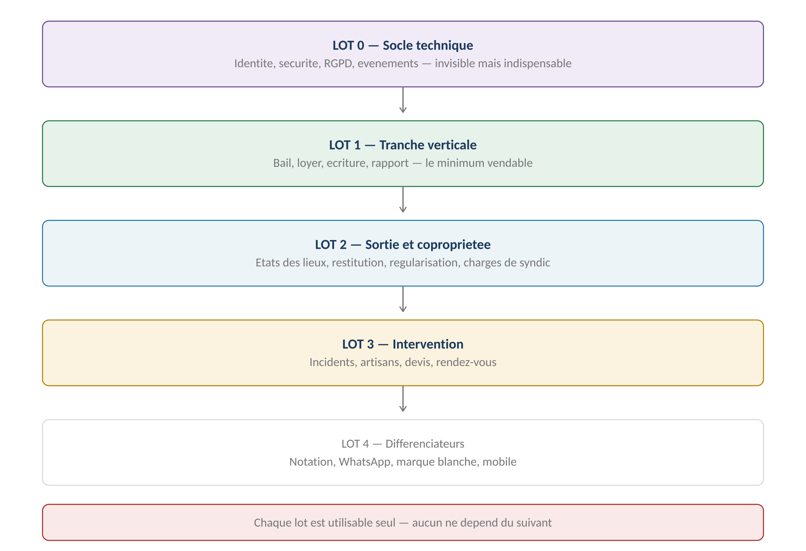
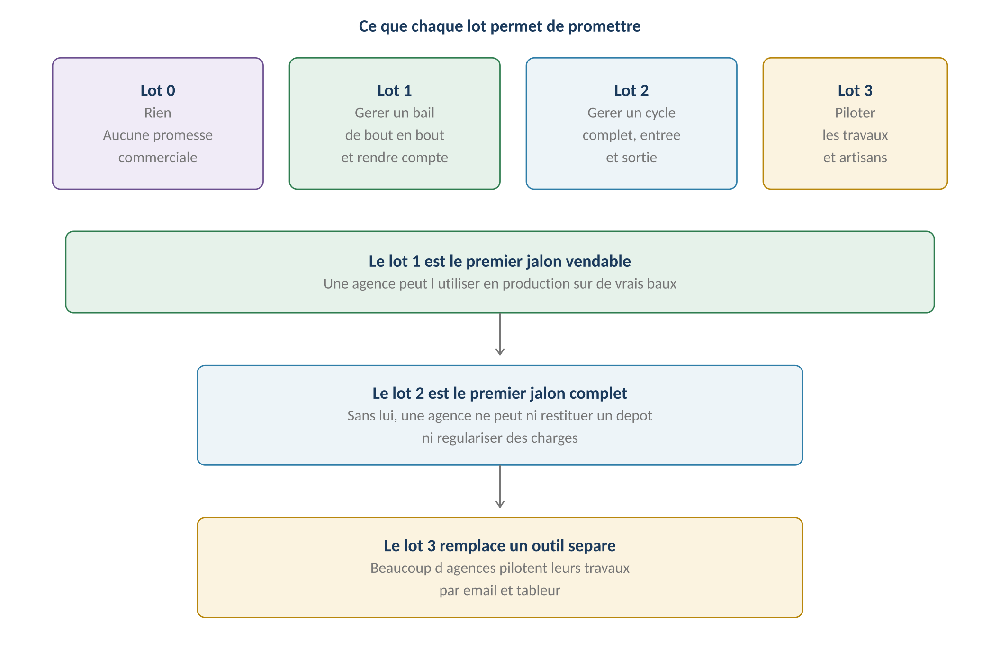
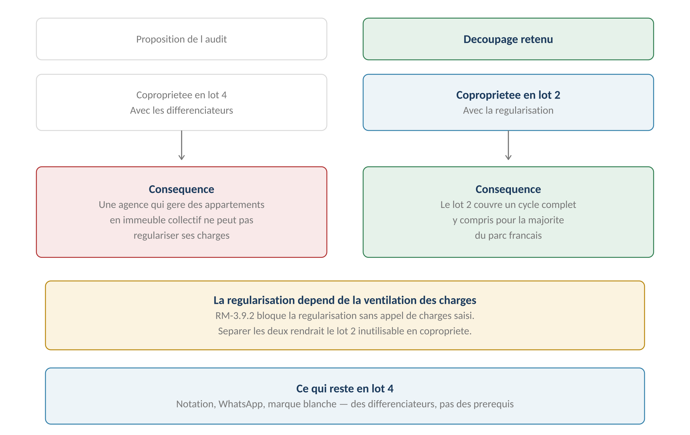
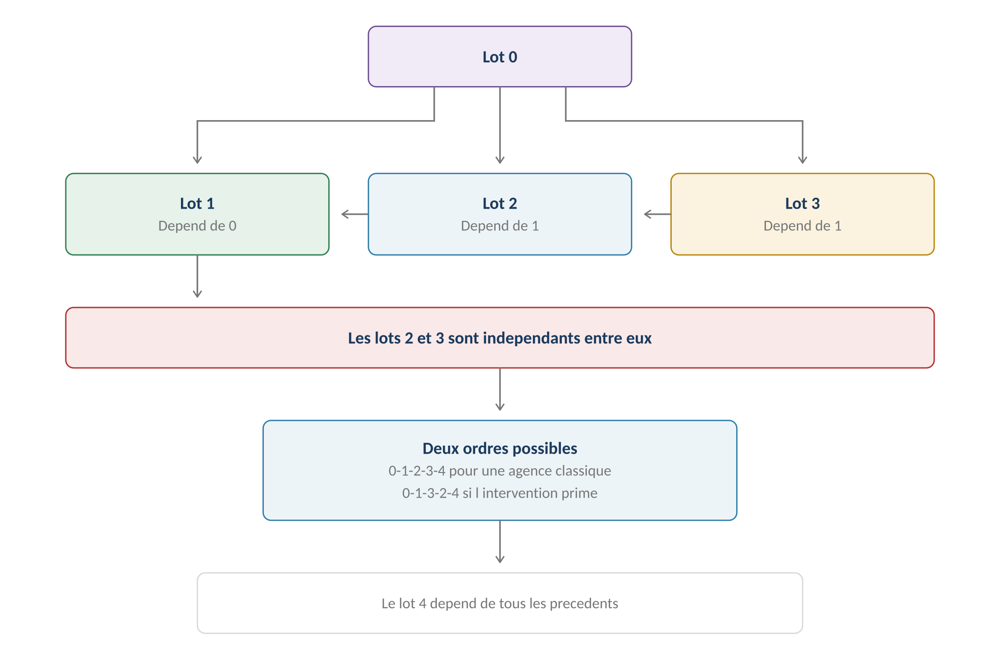

**GERIMMO V3**

Traitement de l'audit

**PHASE C**

**Plan de livraison**

|  |  |
|:---|:---|
| **Origine** | **Audit du 24 juillet 2026 — sections 6 et 7** |
| **Objet** | Répartition des 157 parcours en cinq lots livrables |
| **Constat** | **Le référentiel décrit une cible, pas une séquence** |
| **Écarts avec l'audit** | **Copropriété en lot 2, import en lot 1** |
| **Usage** | Arbitrage de périmètre et plan de développement |

> **Pourquoi ce plan**
>
> **Le diagnostic de l'audit**
>
> Les vingt-deux modules constituent plusieurs versions de produit,
>
> pas une V1.
>
> La faisabilité d'une V1 globale est notée 3 sur 10, celle d'un MVP
>
> recentré 8 sur 10. L'écart tient au périmètre, pas à la qualité
>
> de la spécification.

**Ce que le référentiel fait bien**

------------------------------------------------------------------------

| **Qualité**                 | **Ce qu'elle apporte**                    |
|:----------------------------|:------------------------------------------|
| **Décisions tranchées**     | Chaque question a une réponse écrite      |
| **Règles codées**           | 773 règles référençables en développement |
| **Cas limites traités**     | Variantes et cas d'erreur systématiques   |
| **Cohérence entre modules** | Les dépendances sont explicites           |

**Ce qui lui manque**

------------------------------------------------------------------------

| **Manque**                  | **Conséquence**                     |
|:----------------------------|:------------------------------------|
| **Aucune séquence**         | On ne sait pas par où commencer     |
| **Aucun jalon identifié**   | On ne sait pas quand on peut vendre |
| **Aucune priorité assumée** | Tout paraît également nécessaire    |

> **Un référentiel décrit une cible, un plan décrit un chemin**
>
> Les deux sont utiles, mais ils ne répondent pas à la même question.
>
> Ce document ne modifie aucune spécification : il ordonne
>
> ce qui a déjà été décidé.
>
> **Les cinq lots**

*Schéma 1 — Chaque lot est utilisable seul, aucun ne dépend du suivant*

**Vue d'ensemble**

------------------------------------------------------------------------

| **Lot**   | **Contenu**           | **Parcours**    | **Ce qu'il permet**         |
|:----------|:----------------------|:----------------|:----------------------------|
| **Lot 0** | Socle technique       | 6 livrables     | Rien commercialement        |
| **Lot 1** | Tranche verticale     | **77 parcours** | **Premier jalon pilotable** |
| **Lot 2** | Sortie et copropriété | **29 parcours** | **Cycle complet**           |
| **Lot 3** | Intervention          | **28 parcours** | Remplace un outil séparé    |
| **Lot 4** | Différenciateurs      | **23 parcours** | Argument concurrentiel      |

**Ce que chaque lot permet de promettre**

------------------------------------------------------------------------

*Schéma 2 — Le lot 1 est pilotable, le lot 2 est commercialisable*

> **Lot 0 — Socle technique**

|                     |                                             |
|:--------------------|:--------------------------------------------|
| **Nature**          | Invisible pour l'utilisateur                |
| **Contenu**         | Les six livrables transverses de la phase A |
| **Vendable**        | Non — aucune fonctionnalité métier          |
| **Indispensable**   | **Oui — tout le reste en dépend**           |
| **Risque si sauté** | **Refonte complète du modèle de données**   |

**Ce qu'il contient**

------------------------------------------------------------------------

| **Livrable** | **Objet** | **Pourquoi en premier** |
|:---|:---|:---|
| **A1** | Modèle d'identité et multi-tenancy | **Impossible à changer après** |
| **A2** | Conservation et RGPD | Structure les tables dès le départ |
| **A3** | Documents, canaux et preuve | Détermine les champs à prévoir |
| **A4** | Socle sécurité | Se rétrofitte mal |
| **A5** | États et événements | Conditionne les transitions |
| **A6** | **Doctrine financière** | **Structure le journal dès l'origine** |

> **Pourquoi ce lot ne se saute pas**
>
> Le modèle d'identité du livrable A1 et la structure du journal financier
>
> du livrable A6 sont les deux choix les plus difficiles à reprendre après coup.
>
> Passer de comptes cloisonnés à un compte global impose de fusionner
>
> des identités a posteriori, avec tous les doublons que cela révèle.
>
> Les autres livrables se rattrapent, celui-là non.

**Les fondations techniques associées**

------------------------------------------------------------------------

| **Élément**                          | **Origine**      |
|:-------------------------------------|:-----------------|
| **Tables avec identifiant d'agence** | RM-A1.6          |
| **Tests d'isolation automatisés**    | RM-A1.7          |
| **Authentification et MFA**          | RM-A4.1 à A4.5   |
| **Chiffrement et hébergement**       | RM-A4.6, RM-A4.7 |
| **Table d'événements**               | RM-A5.6 à A5.9   |
| **Journaux et durées**               | RM-A2.6          |

> **Lot 1 — Tranche verticale**

|                    |                                                    |
|:-------------------|:---------------------------------------------------|
| **Promesse**       | **Gérer un bail de bout en bout et rendre compte** |
| **Parcours**       | 77 sur 157                                         |
| **Statut**         | **Premier jalon commercialisable**                 |
| **Cible**          | Une agence acceptant un périmètre réduit           |
| **Limite assumée** | Ni sortie de bail, ni travaux                      |

**Les modules concernés**

------------------------------------------------------------------------

| **Module** | **Parcours inclus** | **Parcours exclus** |
|:---|:---|:---|
| **0 — Biens et lots** | **Tous — 0.1 à 0.12, import compris** | Aucun |
| **0b — Dossier locataire** | 0b.1 à 0b.7 | 0b.8 purge |
| **1 — Bail** | 1.1, 1.2, 1.6, 1.7, 1.8, 1.9, 1.14, 1.16 | Colocation, congés, EDL |
| **3 — Loyers** | 3.1 à 3.5, 3.8, 3.12 | Impayés, régularisation |
| **4 — Comptabilité** | 4.1 à 4.4, 4.6, 4.7 | 4.5, 4.8 |
| **5 — Mandat** | Tous — 5.1 à 5.6 | Aucun |
| **6 — Rapport** | 6.1, 6.2, 6.3, 6.5 | 6.4 fiscal, 6.6 |
| **12 — Documents** | Tous — 12.1 à 12.5 | Aucun |
| **13 — Signature** | Tous — 13.1 à 13.4 | Aucun |
| **14 — Alertes** | 14.1 à 14.4 | 14.5, 14.6 annonces |
| **16 — Onboarding** | 16.1, 16.2, 16.4, 16.6 à 16.8 | 16.3 import, 16.5 WhatsApp |
| **18 — Administration** | 18.1, 18.2, 18.3, 18.5, 18.6 | 18.4 archivage |
| **20 — Retours** | **20.1, 20.2, 20.3 — les bugs** | 20.4 à 20.6 idées |

> **Ce qu'une agence peut faire avec le lot 1**
>
> Importer son parc existant, créer ses biens et ses lots,
>
> constituer un dossier locataire, générer un bail et le faire signer.
>
> Appeler les loyers, encaisser, émettre les quittances, réviser à l'IRL.
>
> Tenir sa comptabilité, clôturer, produire et envoyer le rapport mensuel
>
> au propriétaire.

**Le découpage du lot 1**

------------------------------------------------------------------------

> **Soixante-dix-sept parcours, c'est trop pour un seul jalon**
>
> Un pilote qui attend la totalité du lot 1 attendra longtemps,
>
> et les premiers retours arriveront trop tard pour infléchir quoi que ce soit.
>
> Le lot se découpe donc en trois sous-lots, chacun démontrable.

| **Sous-lot** | **Contenu** | **Ce qu'il démontre** |
|:---|:---|:---|
| **1A** | **Agence, identité, biens, lots, personnes, bail saisi** | Le référentiel tient debout |
| **1B** | **Signature, échéancier, encaissement, quittance, écriture, rapport** | **Le cycle financier fonctionne** |
| **1C** | **Import et reprise contrôlée du parc** | Une agence peut migrer |

**Ce que chaque sous-lot permet**

------------------------------------------------------------------------

| **Sous-lot** | **Utilisable par** | **Limite** |
|:---|:---|:---|
| **1A** | Vous, en interne | Aucun bail réel |
| **1B** | **Une agence pilote, sur quelques baux** | Saisie manuelle du parc |
| **1C** | **Une agence pilote, sur son parc entier** | Ni sortie ni travaux |

> **Pourquoi l'import en 1C et non en 1A**
>
> Importer un parc avant que le référentiel soit stabilisé oblige à réimporter
>
> à chaque correction de structure.
>
> Le sous-lot 1A valide le modèle sur quelques biens saisis à la main.
>
> Le 1C importe une fois que la structure ne bouge plus.
>
> **Le module 20 accompagne le lot 1**
>
> Le signalement de bugs doit exister dès la première mise en production :
>
> c'est ainsi qu'on découvre ce qui ne va pas.
>
> Le circuit des idées attend le lot 2 — il suppose plusieurs agences
>
> utilisatrices pour que le classement ait du sens.
>
> **L'import est remonté en lot 1 — décision actée**
>
> Une agence qui vous intéresse gère déjà cent, deux cents ou cinq cents lots.
>
> Lui demander de tout ressaisir représente plusieurs semaines de travail
>
> avant même de commencer. Aucune ne le fera.
>
> Sans import, la cible se réduit aux agences qui démarrent
>
> ou aux propriétaires directs avec trois biens.

**Ce qu'elle ne peut pas faire**

------------------------------------------------------------------------

| **Manque** | **Conséquence pratique** |
|:---|:---|
| **Aucun état des lieux** | Pas de restitution de dépôt possible |
| **Aucun congé** | La fin de bail se gère hors application |
| **Aucune régularisation** | Les charges restent provisionnelles |
| **Aucun suivi d'impayé** | Les relances se font manuellement |
| **Aucun incident** | Les travaux se pilotent ailleurs |
| **Aucune copropriété** | Les charges de syndic se saisissent en dépense simple |

> **Une limite à assumer commercialement**
>
> Une agence qui achète le lot 1 doit savoir qu'elle gérera ses sorties
>
> de bail en dehors de l'application pendant quelques mois.
>
> C'est acceptable si c'est dit. Ce ne l'est pas si elle le découvre
>
> au premier départ de locataire.
>
> **Lot 2 — Sortie et copropriété**

|  |  |
|:---|:---|
| **Promesse** | **Gérer un cycle locatif complet, entrée et sortie** |
| **Parcours** | 29 sur 157 |
| **Écart avec l'audit** | **La copropriété y est remontée du lot 4** |
| **Vendable** | **Oui — premier jalon vraiment complet** |
| **Cible** | Toute agence de gestion locative |

**Pourquoi remonter la copropriété**

------------------------------------------------------------------------

*Schéma 3 — La régularisation dépend de la ventilation des charges*

> **Le raisonnement**
>
> RM-3.9.2 bloque la régularisation de charges tant que l'appel du syndic
>
> n'est pas saisi.
>
> Livrer la régularisation sans la copropriété rendrait le lot 2 inutilisable
>
> pour la majorité du parc français, qui est en immeuble collectif.
>
> Les deux doivent arriver ensemble.

**Les modules concernés**

------------------------------------------------------------------------

| **Module** | **Parcours inclus** | **Apport** |
|:---|:---|:---|
| **0c — Copropriété** | **Tous — 0c.1 à 0c.6** | Remonté du lot 4 |
| **0b — Dossier** | 0b.8 purge RGPD | Complète le module |
| **1 — Bail** | 1.10, 1.11, 1.12, 1.13 | **Congés et états des lieux** |
| **2 — Garanties** | Tous — 2.1 à 2.7 | **Dépôt et restitution** |
| **3 — Loyers** | 3.6, 3.9, 3.10, 3.11 | **Impayés et régularisation** |
| **6 — Rapport** | 6.4, 6.6 | Récapitulatif fiscal |
| **18 — Administration** | 18.4 | Archivage d'agence |
| **20 — Retours** | 20.4 à 20.6 | Circuit des idées |

> **Ce que le lot 2 débloque**
>
> L'état des lieux d'entrée et de sortie, avec leur comparatif.
>
> La restitution du dépôt de garantie et ses retenues.
>
> Les congés du locataire et du bailleur, avec leurs préavis.
>
> La régularisation annuelle des charges, copropriété comprise.
>
> Le suivi des impayés et le récapitulatif fiscal.

**Une agence peut désormais tout gérer**

------------------------------------------------------------------------

| **Cycle**                               | **Couvert** |
|:----------------------------------------|:------------|
| **Entrée du locataire**                 | Lot 1       |
| **Vie du bail**                         | Lot 1       |
| **Régularisation annuelle**             | Lot 2       |
| **Sortie du locataire**                 | Lot 2       |
| **Restitution du dépôt**                | Lot 2       |
| **Déclaration fiscale du propriétaire** | Lot 2       |

> **Lot 3 — Intervention**

|              |                                           |
|:-------------|:------------------------------------------|
| **Promesse** | **Piloter les travaux et les artisans**   |
| **Parcours** | 28 sur 157                                |
| **Vendable** | Oui — mais comme extension                |
| **Cible**    | Agences pilotant beaucoup de travaux      |
| **Remplace** | Un outil séparé, souvent email et tableur |

**Les modules concernés**

------------------------------------------------------------------------

| **Module** | **Parcours inclus** | **Apport** |
|:---|:---|:---|
| **7 — Incidents** | Tous sauf 7.7 urgence | Déclaration et qualification |
| **8 — Artisans** | Tous — 8.1 à 8.5 | **Annuaire et pièces** |
| **9 — Devis** | Tous sauf 9.6 relance auto | Devis et facturation |
| **10 — Rendez-vous** | Tous — 10.1 à 10.7 | Coordination des créneaux |

> **Un lot indépendant du lot 2**
>
> Une agence peut prendre le lot 3 avant le lot 2 si sa priorité
>
> est le pilotage des travaux plutôt que la sortie de bail.
>
> Les deux dépendent du lot 1, pas l'un de l'autre.

**Ce qui manque encore**

------------------------------------------------------------------------

| **Manque**                        | **Renvoi**        |
|:----------------------------------|:------------------|
| **Notation des artisans**         | Lot 4             |
| **Urgence hors horaires**         | V2 — RM-7.7.1     |
| **Relance automatique des devis** | V2 — parcours 9.6 |

> **Lot 4 — Différenciateurs**

|               |                                  |
|:--------------|:---------------------------------|
| **Promesse**  | Se distinguer de la concurrence  |
| **Parcours**  | 23 sur 157                       |
| **Vendable**  | Comme argument, pas comme socle  |
| **Cible**     | Réseaux et agences en croissance |
| **Caractère** | Aucun n'est un prérequis         |

**Les modules concernés**

------------------------------------------------------------------------

| **Module** | **Parcours** | **Argument commercial** |
|:---|:---|:---|
| **11 — Notation** | Tous — 11.1 à 11.4 | Qualité des artisans mesurée |
| **15 — Messagerie** | Tous — 15.1 à 15.4 | Traçabilité des échanges |
| **16 — WhatsApp** | 16.3, 16.5 | **Canal préféré des locataires** |
| **17 — Marque blanche** | Tous — 17.1 à 17.3 | **Vente aux réseaux** |
| **19 — Mobile** | Les trois déclinaisons | Usage sur le terrain |
| **14 — Annonces** | 14.5, 14.6 | Communication interne |
| **4 — Récapitulatif** | 4.5, 4.8 | Propriétaire direct |

**Le mobile — une nuance**

------------------------------------------------------------------------

> **Le mobile n'est pas un lot, c'est une contrainte**
>
> Le module 19 ne décrit aucun parcours nouveau : il précise comment
>
> trois écrans existants doivent se comporter sur petit écran.
>
> L'état des lieux du lot 2 et le compte rendu artisan du lot 3
>
> sont inutilisables sans adaptation mobile.
>
> Ces adaptations doivent donc accompagner leurs lots respectifs,
>
> pas attendre le lot 4.
>
> **Dépendances et séquences**

*Schéma 4 — Les lots 2 et 3 sont indépendants entre eux*

**Deux séquences possibles**

------------------------------------------------------------------------

| **Séquence** | **Logique** | **Convient à** |
|:---|:---|:---|
| **0 → 1 → 2 → 3 → 4** | Cycle locatif complet d'abord | **Agence classique** |
| **0 → 1 → 3 → 2 → 4** | Pilotage des travaux d'abord | Agence avec beaucoup de patrimoine ancien |

**Ce qui ne peut pas être déplacé**

------------------------------------------------------------------------

| **Contrainte** | **Pourquoi** |
|:---|:---|
| **Le lot 0 précède tout** | Le modèle d'identité est irréversible |
| **Le lot 1 précède 2 et 3** | Sans bail, ni sortie ni incident n'ont de sens |
| **La copropriété avec la régularisation** | RM-3.9.2 bloque l'une sans l'autre |
| **Le mobile avec ses écrans** | L'EDL est inutilisable sans mobile |

**Les adaptations mobiles par lot**

------------------------------------------------------------------------

| **Lot**   | **Écran mobile requis**            | **Origine**          |
|:----------|:-----------------------------------|:---------------------|
| **Lot 1** | Consultation locataire             | Confort              |
| **Lot 2** | **État des lieux — indispensable** | RM-19.1.1            |
| **Lot 3** | **Déclaration et compte rendu**    | RM-19.2.1, RM-19.3.1 |
| **Lot 4** | Reste des écrans                   | Confort              |

> **Synthèse**

**Le tableau de répartition**

------------------------------------------------------------------------

| **Module** | **Lot 0** | **Lot 1** | **Lot 2** | **Lot 3** | **Lot 4** |
|:---|:---|:---|:---|:---|:---|
| **0 — Biens et lots** |  | **12** |  |  |  |
| **0b — Dossier** |  | **7** | 1 |  |  |
| **0c — Copropriété** |  |  | **6** |  |  |
| **1 — Bail** |  | **8** | **4** |  | 3 |
| **2 — Garanties** |  |  | **7** |  |  |
| **3 — Loyers** |  | **7** | **4** |  | 1 |
| **4 — Comptabilité** |  | **6** |  |  | 2 |
| **5 — Mandat** |  | **6** |  |  |  |
| **6 — Rapport** |  | **4** | 2 |  |  |
| **7 — Incidents** |  |  |  | **7** | 1 |
| **8 — Artisans** |  |  |  | **5** |  |
| **9 — Devis** |  |  |  | **7** | 1 |
| **10 — Rendez-vous** |  |  |  | **7** |  |
| **11 — Notation** |  |  |  |  | **4** |
| **12 — Documents** |  | **5** |  |  |  |
| **13 — Signature** |  | **4** |  |  |  |
| **14 — Alertes** |  | **4** |  |  | 2 |
| **15 — Messagerie** |  |  |  |  | **4** |
| **16 — Onboarding** |  | **6** |  |  | 2 |
| **17 — Marque blanche** |  |  |  |  | **3** |
| **18 — Administration** |  | **5** | 1 |  |  |
| **19 — Mobile** |  |  | 1 | 2 | — |
| **20 — Retours** |  | **3** | 3 |  |  |
| **TOTAL** | **6 livrables** | **77** | **29** | **28** | **23** |

**Les décisions de ce plan**

------------------------------------------------------------------------

| **Décision** | **Motif** |
|:---|:---|
| **La copropriété passe en lot 2** | **RM-3.9.2 la lie à la régularisation** |
| **Le mobile accompagne ses écrans** | L'EDL est inutilisable sans lui |
| **La signature reste en lot 1** | Le bail en dépend depuis la révision de décision |
| **L'import remonte en lot 1** | **Sans lui, aucune agence installée ne migre** |
| **Les lots 2 et 3 sont interchangeables** | Aucune dépendance entre eux |

**Les trois arbitrages rendus**

------------------------------------------------------------------------

| **Question** | **Décision** | **Motif** |
|:---|:---|:---|
| **L'import en lot 1 ?** | **Oui** | Aucune agence installée ne ressaisit son parc |
| **Quel positionnement comptable ?** | **Déclaratif assumé** | La gérance réglementée est un autre métier |
| **À partir de quel lot vendre ?** | **Lot 2** | Le lot 1 va en pilote, pas en vente |

**Pilote et commercialisation**

------------------------------------------------------------------------

|  | **Agence pilote** | **Agence cliente** |
|:---|:---|:---|
| **Lot minimal** | **Lot 1** | **Lot 2** |
| **Ce qu'elle accepte** | Un périmètre incomplet | Un produit qui fonctionne |
| **Ce qu'elle obtient** | Tarif préférentiel, accès direct | Un cycle locatif complet |
| **Ce qu'elle apporte** | **Des retours de terrain** | Du revenu |
| **Nombre visé** | Une ou deux | Autant que possible |

> **Pourquoi ne pas vendre le lot 1 — décision actée**
>
> Sans état des lieux ni restitution de dépôt, une agence est bloquée
>
> à la première fin de bail. Il y en aura une dans les six mois.
>
> Une agence pilote l'accepte parce qu'elle participe à la construction.
>
> Une agence cliente ne l'acceptera pas.
>
> C'est aussi ce qui donne son sens au module 20 dès la première
>
> mise en production : le pilote fait remonter les vrais problèmes.

**Prochaine étape**

------------------------------------------------------------------------

> **Phase B — correction des incohérences**
>
> Les douze incohérences relevées en section 5 de l'audit,
>
> plus les points P1 non encore traités.
>
> Ensuite, l'ensemble des modules corrigés sera redonné.
