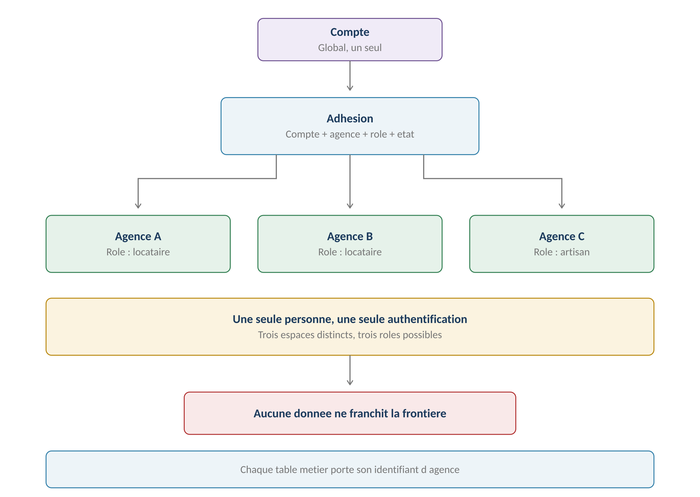

# Compte, personne et adhésion

**Définition :** le modèle canonique d'identité de GERIMMO V3 —
**un compte global, des adhésions par agence** ([[2026-07-24-gerimmo-v3-a1-modele-identite|Livrable A1]]).
Une même personne physique peut exister dans plusieurs agences sans doublon de compte ni
fuite de données entre agences.

## Les cinq entités

| Entité | Rôle | Portée |
|---|---|---|
| **Compte** | Moyen d'authentification : email, mot de passe | **Globale** |
| **Personne** | Identité métier : nom, coordonnées, pièces | **Par agence** |
| **Agence** | Tenant — unité d'isolation ([[Organisation]]) | Racine |
| **Adhésion** | Compte + agence + **rôle** + état (active/inactive) | Par agence |
| **Relation métier** | Locataire, garant, propriétaire, artisan… | Par agence |

Points structurants :
- **Le rôle applicatif est porté par l'adhésion, pas par la personne** (RM-A1.5) —
  locataire dans l'agence A et propriétaire dans l'agence B = un seul compte, deux adhésions.
- À la connexion, un **sélecteur d'espace** apparaît si plusieurs adhésions sont actives.
- Une adhésion **passe en inactive** (fin de bail, départ d'un agent…) sans supprimer
  l'historique ; les autres adhésions demeurent.

## Règles d'unicité

| Élément | Unicité | Portée |
|---|---|---|
| Email du compte | Strictement unique | **Toute la plateforme** (RM-A1.1) |
| Personne | Nom + date de naissance, **alerte non bloquante** | Par agence |
| SIRET artisan | Unique si vérifié, sinon état « non vérifié » | Globale |
| Adhésion | Une seule par couple compte × agence | (RM-A1.3) |

## Les six cas résolus

1. **Locataire dans deux agences** — un compte, deux adhésions, **deux dossiers** :
   les pièces ne circulent jamais entre agences (RM-A1.10). Voir [[Locataire]].
2. **Artisan multi-agences** — profil global qui circule, relation d'agence privée.
   Voir [[Artisan]].
3. **Cumul de rôles** — même agence : une personne, deux relations métier ;
   agences différentes : deux adhésions.
4. **Agent changeant d'agence** — adhésion A inactivée (actions tracées), nouvelle
   adhésion B sur le même compte ; **il n'emporte aucune donnée**. Voir [[Agent immobilier]].
5. **Propriétaire direct devenant mandant** — c'est l'**état de l'adhésion** qui change,
   pas la personne : adhésion inactivée à la signature du mandat (« le mandant reçoit,
   il ne consulte pas »), réactivée au retour en gestion directe. Voir [[Propriétaire bailleur]].
6. **Frontière données globales / privées** — trois niveaux de données.
   Voir [[Isolation multi-organisation]].

## Traduction technique (lot 0)

Le socle ([[2026-07-24-gerimmo-v3-architecture-lot-0|Architecture lot 0]]) implémente le
modèle en quatre tables : `accounts` (email unique, `mfa_actif`), `organizations`
(états : essai/active/suspendue/archivée), `persons`, `memberships`
(`unique (account_id, organization_id)`). **Trois règles sont portées par des
contraintes de base**, pas du code : RM-A1.1 (unique sur `accounts.email`), RM-A1.3
(unique sur le couple compte-agence), RM-A1.5 (le rôle est sur `memberships`, jamais sur
`accounts`) — « un doublon d'email ou une double adhésion sont impossibles, même en cas
d'erreur de programmation ». S'y ajoute **RM-A1.4** (absente de la synthèse d'A1) :
`persons` n'a **aucune référence obligatoire** vers `accounts` — une personne peut
exister sans compte. Le super admin est une adhésion de rôle `super_admin` **sans
organisation**, MFA obligatoire (RM-A4.1). Voir [[Architecture du socle V3]].

## Le compte en pratique (module 16)
« **Une personne existe avant d'avoir un compte** » : le locataire peut rester sans
compte (géré par email, RM-16.4.2), l'artisan et l'agent en ont un, **le mandant
jamais** (RM-16.4.3). L'invitation (depuis la fiche personne, email requis) crée
l'accès — relances J+3/J+10, expiration J+30, refus tracé. S'y ajoute l'objet
**Consentement** (canal WhatsApp : accord daté, révocable, repli email).

## Correspondance avec le code actuel

Le code Gerimmo-V3 approxime ce modèle : `profiles` (compte/personne confondus),
`organization_members` (~ adhésion, avec `member_type`), relations métier éparses
(`bien_occupants`, artisans…). L'email y est déjà globalement unique (auth Supabase),
ce qui **anticipe** RM-A1.1.

## Confirmation par le module 0b (2026-07-24)
Le [[2026-07-24-gerimmo-v3-module-0b-dossier-locataire|module 0b]] applique le modèle :
la fiche **Personne** se crée **sans rôle** — « le rôle n'est pas un champ, il se déduit
des rattachements » (RM-0b.1.1) ; un email déjà utilisé sur la plateforme **bloque** la
création (RM-0b.1.3, désormais alignée sur RM-A1.1) ; doublon probable détecté sur
nom + date de naissance en alerte **non bloquante** ; une personne ne se supprime
jamais, elle s'archive (RM-0b.1.4). Le [[Dossier locataire]] illustre RM-A1.10 : les
pièces suivent la personne **dans** l'agence, jamais entre agences.

> [!note] Modèle VALIDÉ par l'humain (2026-07-25)
> Le modèle canonique A1 est **validé** — aucune anomalie bloquante relevée par
> l'agent. **Quatre points de vigilance à garder pendant l'implémentation** :
> 1. **Le compte global concentre le risque** : la contrepartie non négociable est le
>    **test d'isolation par table à chaque livraison** (RM-A1.7) + « RLS actif
>    partout » ([[Isolation multi-organisation]]).
> 2. **Rapprochement personne ↔ compte à l'invitation** — *tranché (2026-07-25)* :
>    **l'agent peut modifier l'email sur la fiche personne/locataire** ; le
>    rattachement manuel passe par cette correction d'email avant (ré)invitation.
> 3. **Doublons de personnes dans une agence** : l'alerte nom + date de naissance est
>    non bloquante — la **fusion de fiches** est retenue comme **fonctionnalité
>    [[Super Admin]]** (backlog, à garder en tête ; décision 2026-07-25).
> 4. **UX assumée** : le locataire multi-agences refournit ses pièces (RM-A1.10) et
>    l'agent qui change d'agence repart de zéro — à expliquer aux utilisateurs, ce
>    n'est pas un bug.
>
> Reste l'écart structurel avec le code (**`profiles` global unique** vs
> accounts/persons/memberships) — matière de migration :
> [[Divergences code et référentiel V3]].
