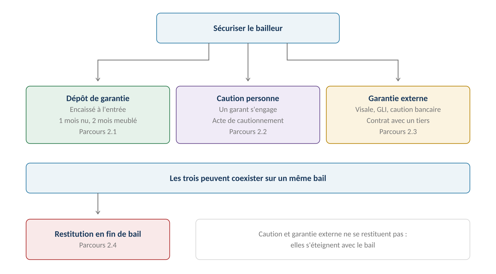

# Garantie

**Définition :** engagement d'un tiers qui sécurise le bailleur contre les impayés du
[[Locataire]] — caution personne physique ou dispositif externe (Visale, GLI, caution
bancaire, garantie employeur). Rattachée au [[Bail]] ; contrairement au
[[Dépôt de garantie]], une garantie **ne se restitue pas : elle s'éteint avec le bail**.
Source : [[2026-07-24-gerimmo-v3-module-2-garanties|Module 2]], parcours 2.2 / 2.3.

## Caution personne physique (2.2)

Le garant est **une personne à part entière** du [[Dossier locataire|module 0b]]
(RM-0b.3.1) — fiche et pièces réutilisables — mais **son engagement est rattaché à un
bail précis, jamais à une personne en général** (RM-2.2.1 = RM-0b.3.3). Un même garant
peut couvrir deux locataires sur deux baux : deux engagements séparés.

| Type | Portée | Usage |
|---|---|---|
| Caution simple | Le bailleur poursuit d'abord le locataire | Rare |
| **Caution solidaire** | **Le bailleur peut poursuivre directement le garant** | **Cas majoritaire — type par défaut** (RM-2.2.2) |

**Circuit d'activation** : sélection du garant parmi les personnes → type (simple /
solidaire) → durée de l'engagement → génération de l'acte de cautionnement (PDF) →
**signature électronique Yousign via le module 13** (RM-2.2.6, décision actée) →
**l'acte signé conditionne l'activation de la garantie** (RM-2.2.3). Yousign porte la
preuve ([[Notification et valeur probante]], famille 2).
Conforme au droit : **le garant ne signe pas le bail** — il signe un **acte de
cautionnement distinct, annexé au bail**, reproduisant loyer, révision et durée de
l'engagement ([[2026-08-05-bailpdf-contrat-de-bail|BailPDF]]).

**En colocation** : chaque garant couvre **un colocataire identifié** (RM-2.2.4 =
RM-1.3.8), jamais le bail en bloc ; **son engagement s'éteint avec la solidarité du
colocataire qu'il couvre** (RM-2.2.5, US-2.2.1) — extinction calculée et tracée au
module 1.

## Garanties externes (2.3)

| Dispositif | Nature | Ce que Gerimmo enregistre |
|---|---|---|
| **Visale** | Garantie gratuite d'Action Logement | Numéro de visa, période, plafond |
| **GLI** | Assurance loyers impayés souscrite par le bailleur | Assureur, contrat, franchise |
| **Caution bancaire** | Engagement d'une banque | Banque, montant, durée |
| **Garantie employeur** | Engagement d'un employeur | Entreprise, référence |

- **Aucune intégration avec les organismes** (RM-2.3.1, décision actée — intégrations
  hors périmètre) : Gerimmo enregistre l'existence et les caractéristiques ; pas de
  vérification en ligne auprès d'Action Logement, pas de déclaration de sinistre GLI.
- **Plusieurs garanties peuvent coexister** sur un même bail (RM-2.3.2).
- **Visale peut se substituer au dépôt de garantie**, qui reste alors à zéro (RM-2.3.3).

## Relations

- Portée par le [[Bail]] (onglet Garanties) ; garant issu du [[Dossier locataire]]
  (la purge RGPD est bloquée tant qu'une personne est garante, RM-0b.8.10).
- Acte de cautionnement signé via le module 13 ([[Notification et valeur probante]]).
- Échéance de garantie alertée par le module 14 ([[Agenda et échéances]]).
- En cas d'impayé, la mise en jeu de la garantie (relance du garant, sinistre GLI)
  s'opère **hors application** — voir [[Relances et mise en demeure]].

> [!note] Étendue de l'engagement du garant en colocation — décision (humain, 2026-08-01)
> Suit **la loi et la pratique** (arbitrage du garant, ingest [[2026-08-01-bailpdf-com]]) :
> le garant est **rattaché à un colocataire nommé** (acte de cautionnement nominatif,
> RM-1.3.8) ; si l'acte porte une **clause de solidarité**, le bailleur peut le
> solliciter **au-delà de la part** de son colocataire (jusqu'au total) ; mais la **loi
> ALUR plafonne** son engagement pour un colocataire **partant à 6 mois** après le
> départ (ou dès l'acceptation d'un remplaçant). À stocker sur la garantie : **nature**
> (simple / solidaire) et **durée** (déterminée / indéterminée). Le texte de la mention
> légale doit suivre la **réforme 2022** (ordonnance 2021-1192), pas l'ancien « lu et
> approuvé ». Voir [[Documents a generer et automatisation WhatsApp]].
