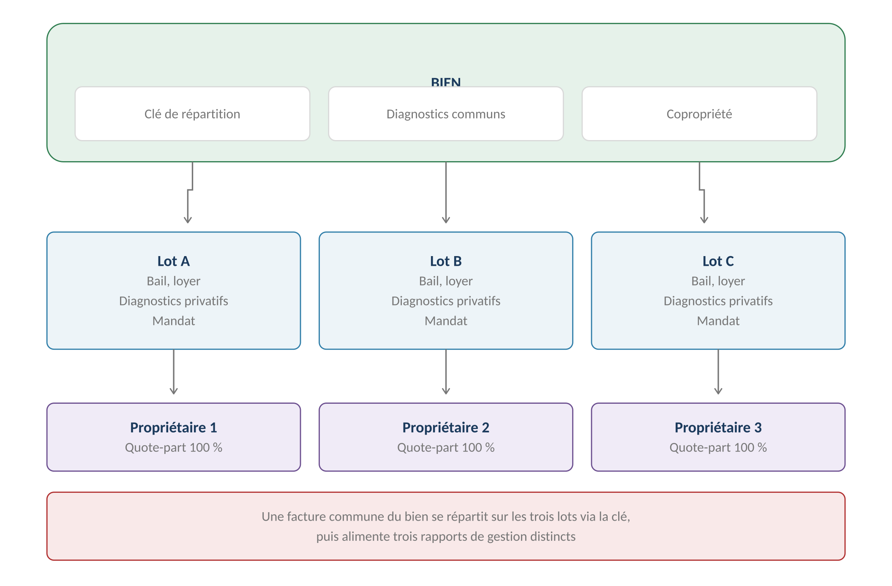

# Lot

**Définition :** l'**unité locative** du référentiel V3 — c'est le lot (pas le
[[Bien]]) qui porte **le bail, le loyer, les propriétaires et le mandat**. Principe
fondateur : « le bail porte toujours sur un LOT, jamais sur un bien. »
Source : [[2026-07-24-gerimmo-v3-module-0-biens-et-lots|Module 0]].

## Qui porte quoi

| Niveau | Porte | Ne porte jamais |
|---|---|---|
| **[[Bien]]** | Adresse · [[Clé de répartition]] · [[Diagnostic]]s communs · Copropriété | Propriétaire · Bail · Loyer |
| **Lot** | **Propriétaires (détention) · [[Bail]] · Loyer · Diagnostics privatifs · Équipements · Mandat · Tantième de copro** | Clé de répartition |

- **Tout bien créé génère automatiquement un « lot unique »** (RM-0.1.2) qui hérite de
  sa surface — le multi-lots reste **invisible** dans les ~90 % de cas simples
  (RM-0.3.4 : l'interface masque la notion de lot tant qu'il est unique).
- Découpage en lots (0.3) : irréversible en pratique ; les nouveaux lots héritent du
  propriétaire d'origine (RM-0.3.6) ; toute modification du nombre de lots impose de
  **revalider la clé** (RM-0.3.3). **Le LOT loué lui-même ne se redécoupe pas**
  (RM-0.3.8 — résilier, archiver, recréer), **mais le BIEN qui contient un lot loué
  reste découpable** (variante V3 du module 0) : le lot loué **garde son bail**, les
  nouveaux lots naissent en **brouillon**, une alerte signale les régularisations en cours.

> [!note] Contradiction tranchée le 2026-07-31 (arbitrage humain, interprétation B)
> Le module 0 opposait la variante **V3** (découpage autorisé avec un lot loué) et
> **RM-0.3.8** (« un lot loué ne peut pas être redécoupé »). Décision : les deux
> visent des opérations différentes — RM-0.3.8 interdit de scinder le **lot loué**,
> V3 autorise de découper le **bien**. Le code (`decouper_bien`) bloquait tout ;
> corrigé pour n'interdire que la scission du lot loué. Voir `log.md`.

## La détention (propriétaire ↔ lot)

- Rattachement **au niveau lot** (RM-0.2.5) avec **quote-part** ; somme ≤ 100 %
  (bloquant) ; un lot ne passe en *disponible* qu'à 100 % (RM-0.2.2).
- Deux lots d'un même bien peuvent avoir des **propriétaires entièrement différents**
  (RM-0.2.6) — cas courant en copropriété ; chacun aura **son mandat** (module 5), et
  une dépense commune du bien se ventile entre eux (modules 4 et 6).
- **Détention datée, jamais supprimée** (RM-0.2.3/4) : un rapport de gestion de mars
  2025 doit continuer à mentionner le propriétaire de l'époque.
- Indivision : quotes-parts saisies, mais **ventilation par indivisaire hors périmètre**
  (acté).

## Machine à états — le module 0 fait foi (tranché, 2026-07-25)

**brouillon** (créé, incomplet) → **disponible** (champs + diagnostics OK + détention
100 %) → **loué** ⇄ **préavis** → **archivé** (réactivation par l'admin agence
uniquement, RM-0.9.4). Passage en disponible bloqué si nom/surface/type manquants ou
[[Diagnostic]] obligatoire expiré (RM-0.5.4, RM-0.7.3).
L'écart interne avec le registre A5 (qui ignorait « brouillon » et la réactivation)
est **tranché : cette machine fait foi**, le registre A5 est à amender
([[Machines à états et événements]]).

## Caractéristiques du lot

- **Équipements en liste fermée** paramétrée par l'admin agence (RM-0.5.5) → génère
  automatiquement la **grille d'état des lieux** (RM-0.5.6, parcours 1.12).
- **Critères de décence** en alertes non bloquantes : surface ≥ 9 m², hauteur ≥ 2,20 m,
  chauffage, eau (RM-0.5.2).
- **Champs verrouillés quand le lot est loué** (surface, pièces, adresse — RM-0.5.1) :
  modification par avenant au bail uniquement.
- Surface **Carrez** : champ simple en V1 (RM-0.5.7 — réserve : sans date ni mesureur,
  pas de défense en cas de contestation > 5 %). Lot meublé : onglet inventaire
  mobilier. Parking/cave : formulaire allégé.
- Un lot peut être **archivé seul** sans affecter les autres lots du bien (RM-0.9.6).
- **En copropriété** (module 0c) : le **tantième** est porté par le lot (RM-0c.1.1) —
  contrôle de cohérence des [[Appel de charges|appels de charges]] du syndic et clé
  alternative ; l'onglet « Charges » du lot reçoit les appels et fonds travaux.

> [!warning] Écart avec le code actuel
> Le code Gerimmo-V3 n'a **pas de table lot** : `biens` porte directement loyer,
> occupation et incidents ([[Modèle de données]]). Le modèle bien/lot/détention du
> module 0 est une refonte structurelle — le « lot unique » auto-créé assure la
> compatibilité du cas simple.
