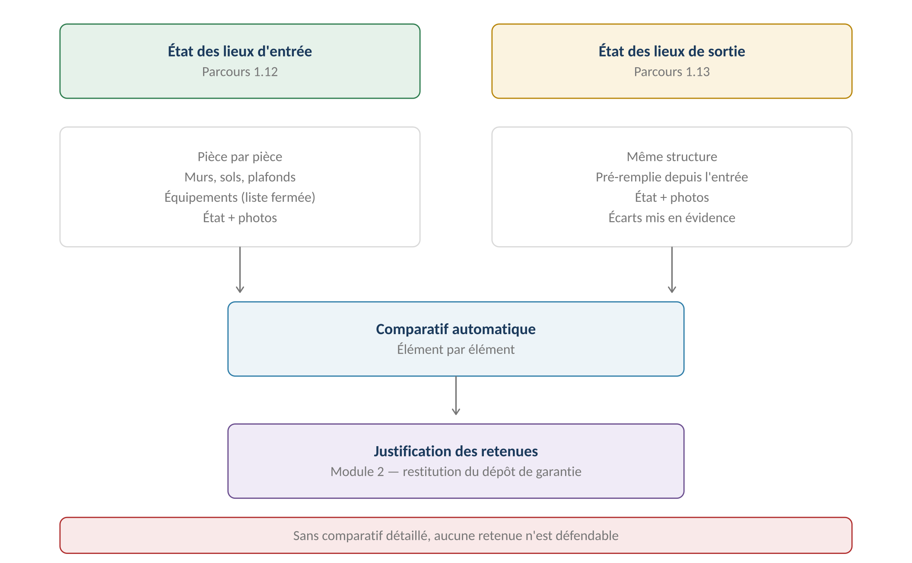

# État des lieux

**Définition :** constat d'entrée ou de sortie du logement, **pièce par pièce**,
rattaché au [[Bail]]. Enjeu juridique central : **sans état des lieux d'entrée, le
logement est réputé remis en bon état — aucune retenue sur le dépôt de garantie n'est
possible** (RM-1.13.4), quelles que soient les dégradations constatées.
Source : [[2026-07-24-gerimmo-v3-module-1-bail|Module 1]], parcours 1.12/1.13.

**Décision actée : saisie native, pièce par pièce, sur mobile** — pas un PDF déposé.
Fonctionne **hors ligne** avec synchronisation au retour du réseau (RM-1.12.4 — module
19 : « le parcours mobile le plus exigeant »). Signature **tactile sur place** = un
consentement recueilli en présence, pas une signature électronique eIDAS (RM-13.1.6,
RM-A3.7 — [[Notification et valeur probante]]).

## La structure

| Niveau | Contenu | Source |
|---|---|---|
| Pièce | Séjour, chambre, cuisine… | [[Lot]] (0.5) |
| Élément | Murs, sol, plafond, fenêtres, porte | Liste standard |
| Équipement | Chaudière, hotte, radiateurs | **Liste fermée** (RM-0.5.5, module 0) |
| État | **Neuf / bon / usagé / mauvais** | Échelle fixe |
| Photos + observation | Par élément | Prise mobile |

La grille est **générée depuis les pièces et équipements du lot** (RM-1.12.1) — c'est
la liste fermée d'équipements du module 0 qui rend possible la génération ET la
garantie que **la grille de sortie porte exactement les mêmes lignes que l'entrée**
(RM-1.13.1). Une pièce découverte sur place peut être ajoutée : le lot est mis à jour.
En meublé, l'inventaire mobilier (structuré, module 1.2) est repris dans la grille.
Relevés de compteurs aux deux EDL (RM-1.13.5).

## Règles clés

- **Aucune ligne sans état** (RM-1.12.2, bloquant) ; photos recommandées sur tout
  élément « mauvais » (sinon retenue difficile à justifier).
- **Figé dès signature** (RM-1.12.3) — aucune modification ultérieure.
- À la sortie, **chaque écart entrée/sortie est mis en évidence automatiquement**
  (RM-1.13.2) et transmis à la [[Restitution du dépôt de garantie]] (module 2).
- **La vétusté n'est pas une dégradation** : bon → usagé après trois ans d'occupation
  = usage normal, aucune retenue. Seul l'écart au-delà de l'usure attendue est
  imputable — et « le module 1 constate, il ne juge pas » : l'imputabilité se décide
  au module 2 (RM-1.13.3), avec décote linéaire selon la grille de
  [[Vétusté et décote]].
- L'absence d'EDL d'entrée est **doublement bloquante** : RM-1.13.4 côté constat,
  RM-2.4.3 côté restitution (restitution intégrale imposée).

## Le parcours mobile et le hors ligne (module 19)

Le [[2026-07-24-gerimmo-v3-module-19-mobile|module 19]] fait de l'EDL la déclinaison
mobile de **criticité MAXIMALE** — « le parcours le plus exigeant du produit » : ~60
lignes remplies debout, dans un logement souvent mal couvert, avec un locataire qui
attend. « Si l'écran est mal conçu, il retournera au papier. » Aucune règle métier
n'est modifiée par le mobile (RM-19.1.5).

- **Sauvegarde locale automatique** : chaque saisie est stockée localement dès
  qu'elle est faite, sans action de l'agent (RM-19.1.1) ; **synchronisation seule au
  retour du réseau** (RM-19.1.2). Cela couvre le cas courant (logement vide mal
  couvert), pas une coupure de plusieurs jours.
- **Photos compressées à la prise**, envoi différé (RM-19.1.3) ; **signature tactile
  pleine largeur** (RM-19.1.4) ; progression pièce par pièce, boutons larges, champs
  numériques dédiés aux compteurs ; à la sortie, l'état d'entrée est **affiché en
  regard** (RM-1.13.1).
- **Deux garde-fous** — « ce qui distingue un hors ligne utilisable d'un hors ligne
  dangereux » : un **indicateur permanent** des données non synchronisées, avec le
  nombre d'éléments en attente (RM-19.1.6, **bloquant**, ajouté à l'audit P1.5), et
  une **alerte avant fermeture** de l'onglet avec des données non remontées
  (RM-19.1.7).
- **Limites assumées** : les données locales ne survivent **ni au vidage du cache ni
  au changement d'appareil** (RM-19.1.8).
- **Concurrence** : « un état des lieux ne se saisit pas à deux » — si deux agents
  ouvrent le même EDL, **la dernière synchronisation écrase la précédente** ; un EDL
  ouvert sur un appareil est **signalé aux autres** — un avertissement, pas un verrou
  (le hors ligne interdit le verrou, RM-19.1.9).

## Variantes notables

Locataire absent → EDL par huissier, déposé et rattaché · refus de signature →
constat du refus, portée affaiblie · colocation → un seul EDL, signé par les présents.

## Relations

Rattaché au [[Bail]] ; alerte d'entrée créée à la signature du bail, alerte de sortie
au congé ([[Agenda et échéances]]) ; grille issue du [[Lot]] ; écarts consommés par la
[[Restitution du dépôt de garantie]] ([[Dépôt de garantie]]) ; PDF en GED ([[Document]]).
