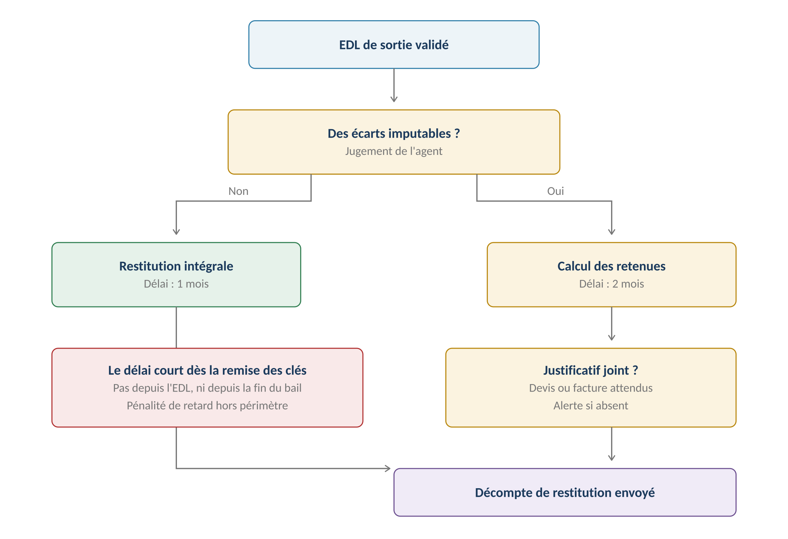

# Restitution du dépôt de garantie

**Le parcours le plus exposé du module 2 — criticité MAXIMALE, délai légal sanctionné.**
À la fin du [[Bail]], l'agent restitue le [[Dépôt de garantie]] au [[Locataire]],
déduction faite des impayés et des retenues justifiées par le comparatif d'
[[État des lieux]], après décote de [[Vétusté et décote|vétusté]].
Source : [[2026-07-24-gerimmo-v3-module-2-garanties|Module 2]], parcours 2.4 / 2.5 / 2.7.

## Le délai légal

- **Le délai court à compter de la remise des clés** (RM-2.4.1), non de l'état des lieux.
- **1 mois** si l'EDL de sortie est conforme à l'entrée, **2 mois** en cas d'écarts
  (RM-2.4.2). Alerte avant l'échéance (US-2.4.4, module 14 — [[Agenda et échéances]]).
- Délai dépassé : alerte ; la **pénalité de retard de 10 % par mois est hors périmètre
  V1** (RM-2.4.10). Délais 1/2 mois depuis la remise des clés et majoration de retard
  confirmés par [[2026-08-05-bailpdf-contrat-de-bail|BailPDF]] (qui confirme aussi :
  chaque retenue justifiée par devis/facture, vétusté normale jamais imputable).

## Le circuit (parcours nominal 2.4)

1. L'agent enregistre la **remise des clés** → le système lance le compteur (1 ou 2 mois).
2. Le système **reprend les écarts du comparatif d'EDL** (1.13).
3. L'agent **juge l'imputabilité de chaque écart** (« le module 1 constate, il ne juge
   pas ») et saisit le coût de remise en état.
4. Le système **applique la décote de vétusté** depuis la grille ([[Vétusté et décote]]).
5. L'agent joint devis ou facture (**alerte si absent**, RM-2.4.6 — retenue acceptée
   mais « difficilement défendable », absence tracée, US-2.4.2).
6. Le système calcule le solde ; l'agent valide et **génère le décompte** (PDF), envoyé
   au locataire (2.7).

## Règles d'imputation

- **Sans EDL d'entrée : retenues possibles, mais uniquement justifiées** (corrigé le
  29/09/2026). À défaut d'état des lieux, le locataire est **présumé avoir reçu le
  logement en bon état de réparations locatives** (art. 1731 du Code civil), sauf
  preuve contraire — présomption que le bailleur **ne peut pas invoquer s'il a fait
  obstacle** à l'établissement de l'EDL (art. 3-2 loi 89-462). L'application refuse une
  retenue **sans justificatif** (devis, facture, constat) et le décompte porte la mention
  « sans EDL d'entrée » avec ce rappel. Voir l'avertissement en fin de page.
- **Les impayés (loyers, charges) s'imputent sur le dépôt AVANT les retenues de
  dégradation** (RM-2.4.7).
- **Provision de 20 % maximum** conservable si une régularisation de charges est en
  attente, jusqu'à l'arrêté des comptes (RM-2.4.8).
- Retenues > dépôt : autorisé — **le solde bascule en créance** sur le locataire
  (module 3).
- **Colocation** : restitution unique, aux colocataires conjointement.
- Jamais retenu : usure normale, élément amorti (blocage), vétusté antérieure au bail —
  voir [[Vétusté et décote]]. Réparation locative non faite : retenue possible
  (décret 87-712).

## Le décompte (2.7)

Envoyé au locataire (email + espace) ; il détaille **chaque retenue : élément, coût,
âge, décote appliquée, montant retenu** (RM-2.7.1), les impayés imputés période par
période, la provision sur charges éventuelle, le solde restitué avec sa date. Les
**justificatifs joints sont accessibles au locataire** (RM-2.7.2, US-2.7.1).
**Le décompte est figé après envoi** — toute correction produit un **décompte
rectificatif** (RM-2.7.3). Le locataire ne voit **aucune retenue avant l'arrêté du
décompte** (RM-2.6.2, [[Dépôt de garantie]]).

## Litige sur retenue (2.5) — reporté en V2

En V1, la contestation passe par la **messagerie (module 15)** et le traçage
documentaire ; issue = nouveau décompte rectificatif. La V2 apporterait un objet litige
structuré (contestation datée, pièces rattachées, issue tracée). La **commission de
conciliation reste hors périmètre** dans les deux cas.

## Relations

Consomme : écarts du comparatif d'[[État des lieux]] (1.13), grille de
[[Vétusté et décote]] (paramétrée au module 18), impayés du module 3.
Alimente : **solde de tout compte (3.11)**, [[Comptabilité]] (écriture de restitution,
4.1). Alertes de délai au module 14 ([[Agenda et échéances]]).

## Canal du décompte — tranché (humain, 2026-07-25)

Décision à **deux vitesses**, qui réconcilie le parcours 2.7 et le livrable A3 :
- **Restitution intégrale** (aucune retenue) : décompte par **email + espace
  locataire** — rien à prouver, le locataire récupère tout.
- **Avec retenues** : le système **alerte le gérant qu'une LRAR est à envoyer** (hors
  plateforme) ; le **justificatif LRAR est déposé dans l'espace/GED**, rattaché au
  bail (avec la **date de première présentation** saisie — champ RM-A3.5 à ajouter au
  module 2). L'email + espace restent en parallèle pour la consultation.

> [!warning] Points à trancher / contradictions
> - ~~Canal du décompte~~ → **tranché le 2026-07-25** (voir section ci-dessus).
> - La **pénalité de retard de 10 % par mois de loyer** (majoration légale en cas de
>   restitution tardive) est hors périmètre V1 : l'application alerte mais ne calcule pas.

## Événements ajoutés le 2026-08-29 (application)
- **Décompte envoyé** : date d'envoi enregistrée sur la restitution (après
  finalisation, jamais dans le futur ni avant l'émission) — ferme l'alerte d'envoi.
- **Justificatif fourni a posteriori** sur une retenue (même après finalisation :
  il s'agit de défendre la retenue, pas de la modifier) — ferme l'alerte « retenue
  sans justificatif ». **Retrait d'une retenue** (avant finalisation) — idem.
Voir [[Agenda et échéances]] (alerte liée à son événement d'origine).

## Événements ajoutés le 2026-08-30 (application)

- **Alertes d'approche du compteur** (`restitution_echeance`) : J-7 avant la
  date limite (remise des clés + délai 1/2 mois), puis dépassement en critique
  — une seule alerte mise à jour, fermée à la finalisation du décompte
  (« Décompte finalisé »). L'alerte « Décompte à envoyer » porte désormais
  l'échéance légale. Cron `alertes-restitutions-quotidiennes` (4 h 15). Voir
  [[Agenda et échéances]].

> [!warning] Correction du 29/09/2026 — règle « sans EDL d'entrée » (art. 1731 C. civ.)
> L'ancienne règle RM-2.4.3 (« sans EDL d'entrée, aucune retenue : restitution
> intégrale ») inversait la présomption légale : l'art. 1731 du Code civil présume que
> le preneur a reçu les lieux **en bon état** quand aucun état des lieux n'a été fait —
> il doit donc les rendre tels, sauf preuve contraire. Le blocage est levé le 29/09/2026
> (migration `20260929130000_audit_gestion`) : retenue admise si elle est **justifiée**,
> mention conservée au décompte, et rappel que la présomption tombe si le bailleur a fait
> obstacle à l'EDL (art. 3-2 loi 89-462). Le référentiel V3 (RM-2.4.3 = RM-1.13.4) reste
> à mettre à jour dans ce sens. Source : [[Audit complet du 29 septembre 2026]].
