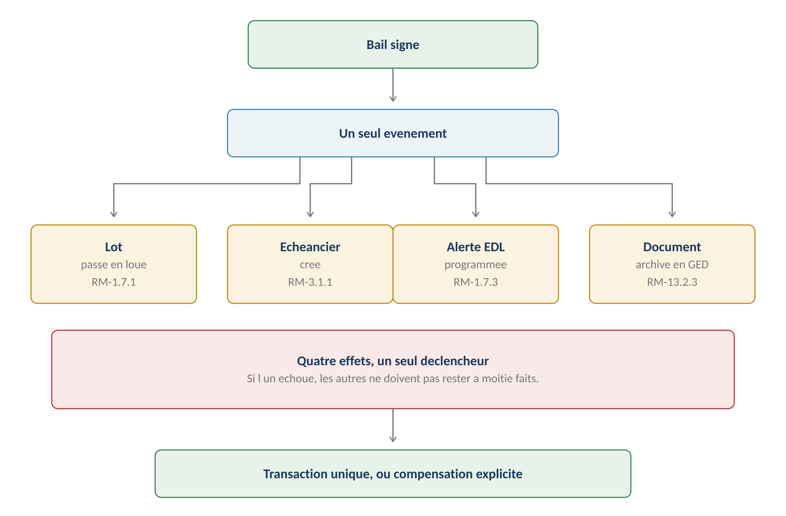

# Machines à états et événements

**Énoncé :** le référentiel V3 unifie **huit machines à états (46 états)** dans un
registre commun, avec deux principes bloquants — **toute transition non listée est
interdite** (RM-A5.1, à implémenter comme contrôle) et **un état terminal n'a aucune
sortie** (RM-A5.2). Source : [[2026-07-24-gerimmo-v3-a5-etats-et-evenements|Livrable A5]].

## Le registre des huit machines

| Objet (module) | États |
|---|---|
| **[[Lot]]** (0) | disponible → loué → préavis → disponible ; → archivé (terminal) |
| **[[Bail]]** (1) | brouillon → à signer → actif → préavis → terminé → archivé ; annulé (terminal) ; actif → reconduit |
| **Mandat** (5) | brouillon → à signer → actif → préavis → résilié (terminal) ; actif → reconduit |
| **[[Incident]]** (7) | déclaré → qualifié → affecté → en cours → terminé → clos → rouvert → qualifié |
| **[[Devis]]** (9) | demandé → déposé → validé → facturé ; refusé / expiré (terminaux) |
| **Rendez-vous** (10) — [[Planification d'intervention]] | proposé → contre-proposé → arbitrage → confirmé → honoré ; reporté / manqué → proposé |
| **Demande de signature** (13) | préparée → envoyée → en cours → complète ; refusée / expirée → préparée |
| **Alerte** (14) — [[Agenda et échéances]] | ouverte → fermée / reportée / escaladée |

Transitions **interdites** emblématiques (contrôles, pas conventions) :
- lot : disponible → préavis (un lot vacant n'a pas de préavis) ; archivé → disponible ;
- bail : brouillon → actif (signature obligatoire, RM-1.7.1) ; actif → annulé (un bail
  signé se **résilie**) ; terminé → actif (nouveau bail requis) ;
- incident : déclaré → affecté (imputation obligatoire, RM-7.2.7) ; en cours → clos
  (compte rendu obligatoire, RM-7.5.1) ; clos → déclaré (la réouverture passe par qualifié).

## Une transition, plusieurs effets

**Effets immédiats = tout ou rien** (RM-A5.3, transaction partagée) ; **effets différés**
(email, notification) en file — leur échec n'annule pas la transition, il est retenté
puis alerte (RM-A5.4).

Les sept **chaînes critiques** :

| Événement | Effets déclenchés |
|---|---|
| **Bail signé** | Lot loué, échéancier créé, alerte EDL, archivage (RM-1.7.1–1.7.3) |
| Mandat signé | Gestion activée sur les lots couverts (RM-5.6.1) |
| Encaissement enregistré | Écriture, honoraires, quittance (RM-3.4.1, RM-4.2.2) |
| Facture validée | Écriture selon imputation, solde ou rapport (RM-9.8.2–9.8.4) |
| Incident clos | Notation déclenchée, alerte fermée (RM-7.6.2) |
| Période clôturée | Rapport débloqué, écritures figées (RM-4.4.1, RM-6.1.2) |
| Rapport envoyé | Rapport figé, alerte versement programmée (RM-6.2.4, RM-6.2.7) |

## Événements externes (Yousign, Stripe, Meta)

| Prestataire | Événements → effets |
|---|---|
| **Yousign** | signature apposée → progression ; **toutes signatures → bail actif, lot loué** ; refus → alerte agent ; expiration → relançable |
| **Stripe** | paiement réussi → [[Abonnement]] à jour ; **échec de prélèvement → relance puis suspension** ; moyen expiré → alerte |
| **Meta** | livré/lu → traces ; **message entrant → file de rattachement** ; consentement révoqué → repli email ([[Canaux de communication]]) |

Règles techniques :
- **Signature de webhook vérifiée**, événement non signé rejeté + alerte (RM-A5.5) ;
- **Idempotence** : identifiant unique par événement, stocké à la première réception —
  un doublon est ignoré sans erreur (RM-A5.6/A5.7) ;
- **Conservation 30 jours** (RM-A5.8) + **rejeu manuel super admin** (RM-A5.9, console
  module 18) — couvre le cas du bug applicatif que le prestataire ne voit pas ;
- Réponse immédiate, traitement asynchrone (RM-A5.10) ; alerte après 3 échecs (RM-A5.11).

## Ce que cela impose au développement

Contrôles de transition, transaction partagée des effets immédiats, file de traitement
des différés, **table d'événements** (nouvelle table technique), console de rejeu
(module 18). À rapprocher de l'existant : `incident_events`, `document_events`,
`bien_history` ([[Modèle de données]]).

## Implémentation (lot 0)
Le [[2026-07-24-gerimmo-v3-architecture-lot-0|socle]] spécifie la table `events`
(`source`, `identifiant_ext`, `charge_utile`, `statut`, `tentatives`) avec
**`unique (source, identifiant_ext)`** : « la contrainte fait tout le travail » —
l'idempotence (RM-A5.6/A5.7) est garantie par la base, sans vérification applicative.
Les effets immédiats s'exécutent dans un seul `begin/commit` (RM-A5.3). Les tâches
planifiées passent par **pg_cron** (6 tâches du socle), elles aussi idempotentes —
« c'est le même principe que l'idempotence des webhooks, appliqué au temps ».
Voir [[Architecture du socle V3]].

> [!warning] Points à trancher / divergences avec le code
> - **Écart interne au référentiel — machine du lot** : le module 0 (2026-07-24) donne
>   **5 états** (ajout de « brouillon ») et permet la réactivation d'un lot archivé par
>   l'admin agence (RM-0.9.4), là où le registre A5 donne 4 états et un archivage
>   définitif. Le module 0, plus détaillé, semble faire foi — à confirmer. Voir [[Lot]].
> - **Rattachements en attente** ([[2026-07-24-gerimmo-v3-matrice-tracabilite|matrice]]) :
>   aucune des 11 règles RM-A5 n'est encore citée par les modules — notamment le renvoi
>   au registre (RM-A5.1/A5.2, 8 modules) et la **transaction unique des effets
>   immédiats** (RM-A5.3, 6 modules — le module 1 décrit les 4 conséquences du bail
>   signé sans dire qu'elles forment une transaction).
> - Les **vocabulaires d'états du code diffèrent du registre V3** — lot :
>   `vacant/occupe/travaux/archive` vs disponible/loué/préavis/archivé (l'état
>   **préavis** n'existe pas en code, `travaux` n'existe pas au registre) ; incident :
>   `nouveau…cloture_normale/cloture_reserve` vs les 7 états V3 ; devis :
>   `demande/recu/refuse/expire/retenu` vs demandé/déposé/validé/refusé/expiré/facturé.
>   Une **table de correspondance et une migration** seront nécessaires.
> - Aucune infrastructure d'idempotence/rejeu (table d'événements, file) n'existe dans
>   le code actuel — chantier spécifié depuis par le lot 0 (table `events`, étape 4 du
>   socle).
