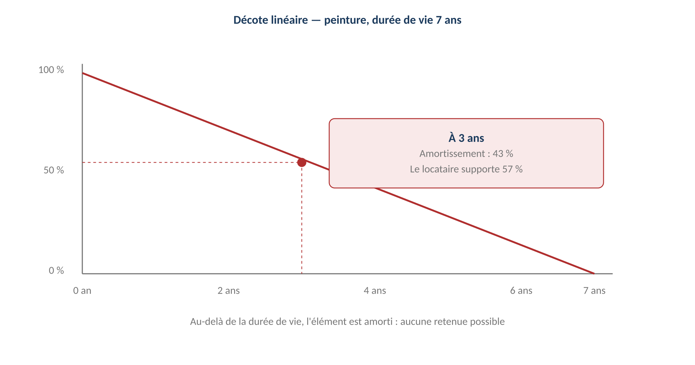

# Vétusté et décote

**Énoncé :** l'usure normale d'un logement n'est pas une dégradation — « la vétusté
n'est pas une dégradation » (RM-1.13.3, [[État des lieux]]). Quand une dégradation est
imputable au [[Locataire]], la retenue sur le [[Dépôt de garantie]] subit une **décote
de vétusté linéaire** selon une grille de durées de vie (RM-2.4.4) : la part amortie se
calcule **au prorata de l'âge de l'élément, sans palier**.
Source : [[2026-07-24-gerimmo-v3-module-2-garanties|Module 2]], parcours 2.4.

**Décision actée — décote linéaire, sans palier** : « la décote linéaire est celle que
retiennent les tribunaux : elle est plus favorable au locataire qu'un système de
paliers, et plus simple à défendre. » Calcul automatique (US-2.4.1) : peinture de durée
de vie 7 ans refaite il y a 3 ans, coût de remise en état 900 € → retenue proposée
**514 €** (57 % du coût, part non amortie 4/7).

## Grille par défaut (modifiable)

| Élément | Durée de vie | Remarque |
|---|---|---|
| Peinture, papier peint | 7 ans | Le plus fréquemment invoqué |
| Revêtement de sol souple | 10 ans | Lino, vinyle |
| Moquette | 7 ans | — |
| Parquet | 25 ans | Hors ponçage |
| Robinetterie | 15 ans | — |
| Appareils sanitaires | 25 ans | — |
| Électroménager | 8 ans | En location meublée |
| Volets, stores | 15 ans | — |
| Serrurerie | 20 ans | — |
| Chaudière individuelle | 15 ans | Entretien annuel à la charge du locataire |

**La grille est modifiable par l'agence** (module 18 — Administration), **sans effet
rétroactif** (RM-2.4.9) — même logique anti-rétroactivité que la [[Clé de répartition]]
ou la zone tendue figée au bail.

## Ce qui n'est jamais retenu

| Situation | Raison |
|---|---|
| **Usure normale** | L'usage du logement implique une dégradation progressive |
| **Élément amorti** | Au-delà de sa durée de vie, valeur résiduelle nulle — **BLOCAGE** (RM-2.4.5) |
| **Vétusté antérieure au bail** | L'[[État des lieux|EDL]] d'entrée fait foi |
| **Absence d'EDL d'entrée** | Le logement est réputé remis en bon état — **BLOCAGE** (RM-2.4.3 = RM-1.13.4) |

À l'inverse, une **réparation locative non faite** reste retenable (décret 87-712),
et l'écart constaté ne devient une retenue **qu'après jugement d'imputabilité par
l'agent, puis décote** — voir [[Restitution du dépôt de garantie]].

## Relations

Appliquée par la [[Restitution du dépôt de garantie]] (calcul automatique par ligne de
retenue) ; s'appuie sur le comparatif d'[[État des lieux]] (l'âge et l'état d'origine
des éléments) ; grille paramétrée par l'[[Administrateur d'agence]] (module 18) ;
chaque retenue décomptée est détaillée au locataire (coût, âge, décote — RM-2.7.1).
